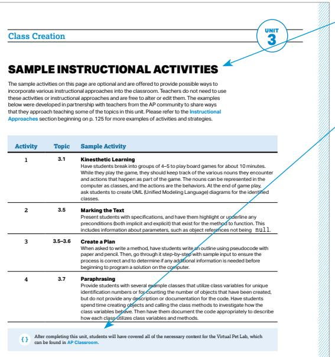
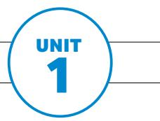
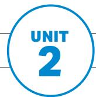
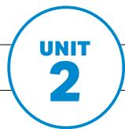
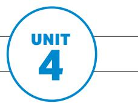

AP<sup>®</sup> Computer Science A

COURSE AND EXAM DESCRIPTION

Effective Fall 2025

Instructional section

Sample exam questions

# AP<sup>®</sup> Computer Science A

COURSE AND EXAM DESCRIPTION

Efective Fall 2025

## What AP<sup>®</sup> Stands For

Thousands of Advanced Placement teachers have contributed to the principles articulated here. These principles are not new; they are, rather, a reminder of how AP already works in classrooms nationwide. The following principles are designed to ensure that teachers’ expertise is respected, required course content is understood, and that students are academically challenged and free to make up their own minds.

1. AP standsforclarityandtransparency.Teachersandstudentsdeserveclear expectations. The Advanced Placement Program makes public its course frameworks and sample assessments. Confusion about what is permitted in the classroom disrupts teachers and students as they navigate demanding work.

2. APisanunflinchingencounterwithevidence.APcoursesenablestudentstodevelop as independent thinkers and to draw their own conclusions. Evidence and the scientificmethodarethestartingplaceforconversationsinAPcourses.

3. AP opposescensorship.APisanimatedbyadeeprespectfortheintellectual freedom of teachers and students alike. If a school bans required topics from their AP courses, the AP Program removes the AP designation from that course and its inclusion in the AP Course Ledger provided to colleges and universities. For example, the concepts of evolution are at the heart of college biology, and a course that neglects such concepts does not pass muster as AP Biology.

4. APopposesindoctrination.APstudentsareexpectedtoanalyzediferent perspectives from their own, and no points on an AP Exam are awarded for agreementwithanyspecificviewpoint.APstudentsarenotrequiredtofeel certain ways about themselves or the course content. AP courses instead develop students’ abilities to assess the credibility of sources, draw conclusions, and make up their own minds.

As the AP English Literature course description states: “AP students are not expectedoraskedtosubscribetoanyonespecificsetofculturalorpoliticalvalues, butareexpectedtohavethematuritytoanalyzeperspectivesdiferentfromtheir ownandtoquestionthemeaning,purpose,orefectofsuchcontentwithinthe literary work as a whole.”

5. APcoursesfosteranopen-mindedapproachtothehistoriesandculturesof diferentpeoples.Thestudyofdiferentnationalities,cultures,religions,races,and ethnicities is essential within a variety of academic disciplines. AP courses ground such studies in primary sources so that students can evaluate experiences and evidence for themselves.

6. EveryAPstudentwhoengageswithevidenceislistenedtoandrespected. Students are encouraged to evaluate arguments but not one another. AP classrooms respect diversity in backgrounds, experiences, and viewpoints. The perspectives and contributions of the full range of AP students are sought and considered. Respectful debate of ideas is cultivated and protected; personal attacks have no place in AP.

7. APisachoiceforparentsandstudents.Parentsandstudentsfreelychooseto enroll in AP courses. Course descriptions are available online for parents and studentstoinformtheirchoice.Parentsdonotdefinewhichcollege-leveltopics are suitable within AP courses; AP course and exam materials are crafted by committeesofprofessorsandotherexperteducatorsineachfield.APcoursesand exams are then further validated by the American Council on Education and studies thatconfirmtheuseofAPscoresforcollegecreditsbythousandsofcollegesand universities nationwide.

The AP Program encourages educators to review these principles with parents and students so they know what to expect in an AP course. Advanced Placement is always achoice,anditshouldbeaninformedone.APteachersshouldbegiventheconfidence and clarity that once parents have enrolled their child in an AP course, they have agreed to a classroom experience that embodies these principles.

## Contents

v Acknowledgments
1 About AP
4 AP Resources and Supports
5 Instructional Model
6 About the AP Computer Science A Course
COURSE FRAMEWORK
9 Introduction
11 Course Framework Components
13 Computational Thinking Practices
15 Course Content
17 Course at a Glance
19 Unit Guides
20 Using the Unit Guides
23 UNIT 1: Using Objects and Methods
53 UNIT 2: Selection and Iteration
73 UNIT 3: Class Creation
91 UNIT 4: Data Collections
INSTRUCTIONAL APPROACHES
125 Selecting and Using Course Materials
128 Artificial Intelligence in AP Computer Science A
130 Developing the Computational Thinking Practices
136 Instructional Strategies
140 Using Strategies for Collaboration
141 Using Real-World Data
EXAM INFORMATION
145 Exam Overview
146 How Student Learning Is Assessed on the AP Exam
148 Task Verbs Used in Free-Response Questions
149 Sample Exam Questions

SCORING GUIDELINES

Applying the Scoring Criteria

174 Question 1: Methods and Control Structures

176 Question 2: Class Design

178 Question 3: Data Analysis with ArrayList

180 Question 4: 2D Array

APPENDIX

185 Java Quick Reference

# Acknowledgments

College Board would like to acknowledge the following committee members, consultants, and reviewers for their assistance with and commitment to the developmentofthiscourse.Allindividualsandtheirafiliationswerecurrentat the time of contribution.

Don Blaheta, Longwood University, Farmville, VA

Alistair Campbell, Hamilton College, Clinton, NY

Misti Clark, Collin College, McKinney, TX

Adrienne Decker, University of Bufalo, Bufalo, NY

Dave Feinberg, Columbus Academy, Gahanna, OH

Tim Gallagher, Winter Springs High School, Winter Springs, FL

Bo Hatfield, Salem University, Salem, MA

Cody Henrichsen, Canyons Technical Education Center, Sandy, UT

Kimberly Hermans, Santiago Canyon College, Orange, CA

Helen Hu, Westminster College, Salt Lake City, UT

Daniela Marghitu, Auburn University, Auburn, AL

Sage Miller, Webster Schroeder High School, Webster, NY

Jerone Mitchell, The Overlake School, Redmond, WA

Mohammad Mohammadi, SUNY Oswego, Oswego, NY

Briana Morrison, University of Virginia, Charlottesville, VA

Jill Pieritz, Girls Preparatory School, Chattanooga, TN

Blythe Samuels, CodeRVA Regional High School, Richmond, VA

Rob Schultz, Bellbrook High School, Bellbrook, OH

Schinnel Small, University of South Florida, Tampa, FL

Lester Wainwright, Charlottesville High School, Charlottesville, VA

Kevin Wayne, Princeton University, Princeton, NJ

## College Board Staf

Deborah Klipp, Director I, AP Computer Science A Curriculum and Assessment

Daniel Klag, Senior Director I, AP Computer Science Curriculum and Assessment

Shu-Kang Chen, Executive Director, AP Science Department Head

Alesha Fox, Executive Director, AP Instructional Services

Dana Kopelman, Executive Director, AP Content Production and Product Management

Claire Lorenz, Program Manager, Computer Science

Daniel McDonough, Senior Director, AP Content and Assessment Publications

Sarah Muller, Director, AP Product Development and Editorial

Andrea Pellerito, Senior Director, Course Product Manager

Monica Roman, Senior Director, Project Manager

Natalya Tabony, Executive Director, AP Strategy & Analytics

Allison Thurber, Vice President, AP Curriculum and Assessment

Jason VanBilliard, Senior Director, AP Math and Computer Science Department Head

SPECIAL THANKS Crystal Sheldon and Maureen Reyes

THIS PAGE IS INTENTIONALLY LEFT BLANK.

## About AP

The Advanced Placement® Program (AP®) enables willing and academically prepared students to pursue college-levelstudies—withtheopportunitytoearn collegecredit,advancedplacement,orboth—whilestill in high school. Through AP courses in 40 subjects, each culminating in a challenging exam, students learn to think critically, construct solid arguments, and see many sidesofanissue—skillsthatpreparethemforcollege and beyond. Taking AP courses demonstrates to college admissionoficersthatstudentshavesoughtthemost challenging curriculum available to them, and research indicates that students who score a 3 or higher on an AP Exam typically experience greater academic success in college and are more likely to earn a college degree thannon-APstudents.EachAPteacher’ssyllabus is evaluated and approved by faculty from some of the nation’s leading colleges and universities, and AP Exams are developed and scored by college faculty and experiencedAPteachers.Mostfour-yearcollegesand universities in the United States grant credit, advanced placement, or both on the basis of successful AP Examscores—morethan3,300institutionsworldwide annually receive AP scores.

## AP Course Development

Inanongoingeforttomaintainalignmentwithbest practicesincollege-levellearning,APcoursesandexams emphasizechallenging,research-basedcurriculaaligned with higher education expectations.

Individual teachers are responsible for designing their own curriculum for AP courses, selecting appropriatecollege-levelreadings,assignments, and resources. This course and exam description presents the content and skills that are the focus of the corresponding college course and that appear on theAPExam.Italsoorganizesthecontentandskills into a series of units that represent a sequence found in widely adopted college textbooks and that many AP teachers have told us they follow in order to focus their instruction. The intention of this publication is to respect teachers’ time and expertise by providing a roadmap that they can modify and adapt to their local prioritiesandpreferences.Moreover,byorganizing the AP course content and skills into units, the AP Program is able to provide teachers and students

withformativeassessments—ProgressChecks—that teachers can assign throughout the year to measure student progress as they acquire content knowledge and develop skills.

## Enrolling Students: Access, Opportunity, and Readiness

The AP Program welcomes all students willing to challengethemselveswithcollege-levelcourseworkand career preparation. We strongly encourage educators to invite students into AP classes, including students from ethnic, racial, socioeconomic, geographic, or other groups not broadly participating in a school's AP program. We believe that readiness for AP is attainable, and that educators can expand readiness by opening accesstoPre-APcoursework.Wecommittosupport educatorsandcommunitiesintheirefortstomakeAP courses widely available, advancing students in their plans for college and careers.

## Ofering AP Courses: The AP Course Audit

The AP Program unequivocally supports the principle that each school implements its own curriculum that will enable students to develop the content understandings and skills described in the course framework.

While the unit sequence represented in this publication is optional, the AP Program does have a short list of curricular and resource requirements that must be fulfilledbeforeaschoolcanlabelacourse“Advanced Placement”or“AP.”SchoolswishingtooferAP courses must participate in the AP Course Audit, a process through which AP teachers’ course materials are reviewed by college faculty. The AP Course Audit was created to provide teachers and administrators with clear guidelines on curricular and resource requirements for AP courses and to help colleges and universities validate courses marked “AP” on students transcripts. This process ensures that AP teachers’ courses meet or exceed the curricular and resource expectations that college and secondary school faculty haveestablishedforcollege-levelcourses.

The AP Course Audit form is submitted by the AP teacher and the school principal (or designated administrator) to confirmawarenessandunderstandingofthecurricular and resource requirements. A syllabus or course outline, detailing how course requirements are met, is submitted by the AP teacher for review by college faculty.

Please visit the AP Course Audit website for more information to support the preparation and submission of materials for the AP Course Audit.

## How the AP Program Is Developed

The scope of content for an AP course and exam is derived from an analysis of hundreds of syllabi and courseoferingsofcollegesanduniversities.Using this research and data, a committee of college faculty and expert AP teachers work within the scope of the corresponding college course to articulate what students should know and be able to do upon the completion of the AP course. The resulting course framework is the heart of this course and exam description and serves as a blueprint of the content and skills that can appear on an AP Exam.

The AP Test Development Committees are responsible for developing each AP Exam, ensuring the exam questions are aligned to the course framework. The AP Exam development process is a multiyear endeavor; all AP Exams undergo extensive review, revision, piloting, and analysis to ensure that questions are accurate, fair, and valid, and that there is an appropriate spread of dificultyacrossthequestions.

Committee members are selected to represent a variety of perspectives and institutions (public and private, small and large schools and colleges) and a range of gender, racial/ethnic, and regional groups. A list of each subject’s current AP Test Development Committee members is available on AP Central®.

Throughout AP course and exam development, College Board gathers feedback from various stakeholders in both secondary schools and higher education institutions. This feedback is carefully considered to ensure that AP courses and exams are able to provide studentswithacollege-levellearningexperienceand theopportunitytodemonstratetheirqualificationsfor advanced placement or college credit.

## How AP Exams Are Scored

The exam scoring process, like the course and exam development process, relies on the expertise of both APteachersandcollegefaculty.Whilemultiple-choice questionsarescoredbymachine,thefree-response questionsandthrough-courseperformance

assessments, as applicable, are scored by thousands of college faculty and expert AP teachers. Most are scored at the annual AP Reading, while a small portion is scored online. All AP Readers are thoroughly trained, and their work is monitored throughout the Reading for fairness and consistency. In each subject, a highly respected college faculty member serves as Chief Faculty Consultant and, with the help of AP Readers in leadership positions, maintains the accuracy of thescoringstandards.Scoresonthefree-response questions and performance assessments are weighted andcombinedwiththeresultsofthecomputer-scored multiple-choicequestions,andthisrawscoreis converted into a composite AP score on a 1–5 scale.

AP Exams are notnorm-referencedorgradedona curve.Instead,theyarecriterion-referenced,which means that every student who meets the criteria for an AP score of 2, 3, 4, or 5 will receive that score, no matter how many students that is. The criteria for the number of points students must earn on the AP Exam toreceivescoresof3,4,or5—thescoresthatresearch consistently validates for credit and placement purposes—include:

§ The number of points successful college students earn when their professors administer AP Exam questions to them.

Performance that researchers have found to be predictive of an AP student succeeding when placedintoasubsequenthigher-levelcollege course.

The number of points college faculty indicate, after reviewing each AP question, that they expect is necessary to achieve each AP grade level.

## Using and Interpreting AP Scores

The extensive work done by college faculty and AP teachers in the development of the course and exam and throughout the scoring process ensures that AP Exam scores accurately represent students achievement in the equivalent college course. Frequent and regular research studies establish the validity of AP scores as follows:

<table><tr><td>AP Score</td><td>Credit Recommendation</td><td>College Grade Equivalent</td></tr><tr><td>5</td><td>Extremely well qualified</td><td>A</td></tr><tr><td>4</td><td>Well qualified</td><td>A-, B+, B</td></tr><tr><td>3</td><td>Qualified</td><td>B-, C+, C</td></tr><tr><td>2</td><td>Possibly qualified</td><td>n/a</td></tr><tr><td>1</td><td>No recommendation</td><td>n/a</td></tr></table>

While colleges and universities are responsible for setting their own credit and placement policies, most private colleges and universities award credit and/or advanced placement for AP scores of 3 or higher. Additionally, most states in the U.S. have adopted statewide credit policies that assure college credit for scores of 3 or higher at public colleges and universities.Toconfirmaspecificcollege’sAP credit/placement policy, use the search engine available on the AP Credit Policy Search page.

## BECOMING AN AP READER

Each June, thousands of AP teachers and college faculty members from around the world gather for seven days in multiple locations to evaluate and score thefree-responsesectionsoftheAPExams.Ninetyeight percent of surveyed educators who took part in the AP Reading say it was a positive experience.

There are many reasons to consider becoming an AP Reader, including opportunities to:

Surveys show that the vast majority of returning APReaders—bothhighschoolandcollege educators—makeimprovementstothewaythey teach or score because of their experience at the AP Reading.

Gain in-depth understanding of AP Exam and AP scoring standards: AP Readers gain exposure to the quality and depth of the responses from the entire pool of AP Exam takers, and thus are better able to assess their students’ work in the classroom.

Receive compensation: AP Readers are compensated for their work during the Reading. Expenses, lodging, and meals are covered for Readers who travel.

Score from home: AP Readers have online distributed scoring opportunities for certain subjects. Check the AP Reader sitefor details.

§ Earn Continuing Education Units (CEUs): AP Readersearnprofessionaldevelopmenthours and CEUs that can be applied to PD requirements by states, districts, and schools.

## How to Apply

Visit the Become an AP Reader site for eligibility requirements and to start the application process.

# AP Resources and Supports

By completing a simple activation process at the start of the school year, teachers and students receive access to a robust set of classroom resources.

## AP Classroom

AP Classroom is a dedicated online platform designed to support teachers and students throughout their AP experience. The platform provides a variety of powerful resources andtoolstoprovideyearlongsupporttoteachers,oferingopportunitiestogiveandget meaningful feedback on student progress.


## UNIT GUIDES

Appearing in this publication and on AP Classroom, these planning guides outline all required coursecontentandskills,organizedintocommonlytaughtunits.Eachunitguidesuggestsa sequenceandpacingofcontent,scafoldsskillinstructionacrossunits,organizescontent into topics, and provides tips on taking the AP Exam.


## PROGRESS CHECKS

Formative AP questions for every unit provide feedback to students on the areas where they need to focus. Available online, Progress Checks measure knowledge and skills through multiple-choicequestionswithrationalestoexplaincorrectandincorrectanswers,andfreeresponse questions with scoring information. Because the Progress Checks are formative, theresultsoftheseassessmentscannotbeusedtoevaluateteacherefectivenessorassign lettergradestostudents,andanysuchmisusesaregroundsforlosingschoolauthorizationto oferAPcourses.\*


## REPORTS

Reportsprovidesteacherswithaone-stopshopforstudentresultsonallassignmenttypes, including Progress Checks. Teachers can view class trends and see where students struggle with content and skills that will be assessed on the AP Exam. Students can view their own progress over time to improve their performance before the AP Exam.


## QUESTION BANK

The Question Bank is a searchable library of all AP questions that teachers use to build custom practice for their students. Teachers can create and assign assessments with formative topic questions or questions from practice or released AP Exams.

Class Section Setup and Enrollment

§ Teachers and students sign into or create their College Board accounts.

TeachersconfirmthattheyhaveaddedthecoursetheyteachtotheirAPCourseAudit account and have had it approved by their school’s administrator.

Teachers or AP coordinators, depending on who the school has decided is responsible, set up class sections so students can access AP resources and have exams ordered on their behalf.

§ Students join class sections with a join code provided by their teacher or AP coordinator.

§ Studentswillbeaskedforadditionalinformationuponjoiningtheirfirstclasssection.

# Instructional Model

Integrating AP resources throughout the course can help students develop skills and conceptual understandings. The instructional model outlined below shows possible ways to incorporateAP resourcesintotheclassroom.


## Plan

Teachers may consider the following approaches as they plan their instruction before teaching each unit.

§ Review the overview at the start of each unit guide to identify essential questions, conceptual understandings, and skills for each unit.

§ Use the Unit at a Glance table to identify related topics that build toward a common understanding, and then plan appropriate pacing for students.

§ Identify useful strategies in the Instructional Approaches section to help teach the concepts and skills.


## Teach

When teaching, supporting resources could be used to build students’ conceptual understanding and their mastery of skills.

§ Use the topic pages in the unit guides to identify the required content.

§ Integratethecontentwithaskill,consideringanyappropriatescafolding.

§ Employanyoftheinstructionalstrategiespreviouslyidentified.

§ Use the available resources, including AP Daily, on the topic pages to bring a variety of assetsintothe classroom.


## Assess

Teachers can measure student understanding of the content and skills covered in the unit and provide actionable feedback to students.

§ As you teach each topic, use AP Classroom to assign student Topic Questions as a way tocontinuouslycheckstudentunderstandingandprovidejust-in-timefeedback

§ At the end of each unit, use AP Classroom to assign students Progress Checks, as homeworkoranin-classtask.

§ Providequestion-levelfeedbacktostudentsthroughanswerrationales;provideunit-and skill-levelformativefeedbackusingReports.

§ Create additional practice opportunities using the Question Bank and assign them through AP Classroom.

# About the AP Computer Science A Course

AP Computer Science A introduces students to computer science through programming. Fundamental topics in this course include the design of solutions to problems, the use of data structurestoorganizelargesetsofdata,thedevelopmentandimplementationofalgorithms to process data and discover new information, the analysis of potential solutions, and the ethicalandsocialimplicationsofcomputingsystems.Thecourseemphasizesobject-oriented programming and design using the Java programming language.

## College Course Equivalent

AP Computer Science A is equivalent to an introductory college course in computer science.

## Prerequisites

It is recommended that a student in the AP Computer Science A course has successfully completedafirst-yearhighschoolalgebracoursewithastrongfoundationofbasiclinear functions,compositionoffunctions,andproblem-solvingstrategiesthatrequiremultiple approachesandcollaborativeeforts.Inaddition,studentsshouldbeabletouseaCartesian (x, y) coordinate system to represent points on a plane. AP Computer Science A builds upon a foundation of mathematical reasoning that should be acquired prior to taking this course.

## Programming Language

The AP Computer Science A course requires that solutions of problems be written in the Java programming language. Because the Java programming language is extensive, with far more features than could be covered in a single introductory course, the AP Computer Science A Exam covers a subset of Java.

## Lab Requirement

TheAPComputerScienceAcoursemustincludeaminimumof20hoursofhands-on, structuredlabexperiencestoengagestudentsinindividualorgroupproblem-solving.Thus, each AP Computer Science A course includes a substantial lab component in which students design solutions to problems, express their solutions precisely (e.g., in the Java programming language), test their solutions, identify and correct errors (when mistakes occur), and compare possible solutions. College Board has developed several labs that are aligned to the course frameworkthatfulfillthe20-hourlabrequirement.Theclassperiodrecommendations provided in the unit guides account for the time needed to complete each lab activity as described in the lab guide.

AP COMPUTER SCIENCE A

# Course Framework

elloWorld.j

public class He

pu gain

## Introduction

Computer science involves problem-solving, hardware, and algorithms that help people utilize computers and incorporate multiple perspectives to address real-world problems in contemporary life. As the study of computer science continues to evolve, the careful design of the AP Computer Science A course strives to engage a diverse student population, including female and underrepresented students, by allowing them to discover the power of computer science through rewarding yet challenging concepts.

Awell-designed,modernAPComputerScienceA course that includes opportunities for students to collaborate to solve problems that interest them, as well as ones that use authentic data sources, can help address traditional issues of equity and access. Such a course can broaden participation in computing while providing a strong and engaging introduction to fundamentalareasof thediscipline.

TheAPComputerScienceAcoursereflectswhat computer science teachers, professors, and researchers have indicated are the main goals of anintroductory,college-levelcomputerscience programming course:

§ Design Code—Determineanappropriateprogram design and develop algorithms.

§ Develop Code—Writeandimplementprogram code.

Analyze Code—Determinetheoutputorresultof given program code or explain why code may not work as intended.

Document Code and Computing Systems— Describe the behavior and conditions that produce thespecifiedresultsinaprogram.

Use Computers Responsibly—Understandthe ethical and social implications of computer use.

Students practice the computer science skills of designing,developing,andanalyzingtheirown programstoaddressreal-worldproblemsorpursue a passion.

## Compatible Curricula

The AP Computer Science A course is compatible with the recommendations of the Association for Computing Machinery (ACM) and the Institute of Electrical and Electronics Engineers ComputingSociety(IEEE-CS)inthe“Software Development Fundamentals” knowledge area, which is recommendedforanintroductorycourse.TheAP Computer Science A course also integrates topics from the “Programming Languages” and “Algorithms and Complexity” knowledge areas. Teachers can review the Computer Science Curricula fromACMandIEEE-CS to see their complete curriculum guidelines.

The AP Computer Science A course vertically aligns with subconcepts in the “Algorithms and Programming” core concept in the Computer Science Teachers Association (CSTA) K-12 Computer Science Framework. This vertical alignmentallowsK-12CSteacherstomake connections from their high school courses to the college-equivalentAPComputerScienceAcourse.

## AP Computer Science Program

AP Computer Science A is one of two AP computer science courses available to students. The AP Computer Science Principles course complements AP Computer Science A by teaching the foundational areas of the discipline. Students can take these two courses in either order or concurrently, as allowed by theirschool.

## Resource Requirements

Students should have access to a computer system that represents relatively recent technology. A school should ensure that each student has access to a computer for at least three hours a week; additional time is desirable. Student and instructor access to computers is important during class time, but additional time is essential for students to individually develop solutions to problems.

The computer system must allow students to create, edit, quickly compile, and execute Java programscomparableinsizetothosefoundintheAP Computer Science A labs. It is highly desirable that these computers provide students with access to the internet. It is essential that each computer science teacher has internet access.

A school must ensure that each student has a college-leveltextforindividualusebothinsideand outside of the classroom.

# Course Framework Components

## Overview

This course framework provides a clear and detailed description of the course requirementsnecessaryforstudentsuccess.Theframeworkspecifieswhat students should know, be able to do, and understand to qualify for college credit and/or placement.

## The course framework includes two essential components:

## COMPUTATIONAL THINKING PRACTICES

The computational thinking practices are central to the study and practice of computer science. Students should develop and apply the describedpracticesonaregularbasisoverthespanof the course.

## 2 COURSE CONTENT

Thecoursecontentisorganizedintocommonlytaughtunitsofstudythat provide a suggested sequence for the course. These units comprise the content and conceptual understandings that colleges and universities typicallyexpectstudentstobeproficientintoqualifyforcollegecredit and/or placement.

THIS PAGE IS INTENTIONALLY LEFT BLANK.

## 1 AP COMPUTER SCIENCE A

# Computational Thinking Practices

The computational thinking practices and skills for AP Computer Science A describe what a student should be able to do while exploring course concepts. The table that follows presents these practices along with their corresponding skills that students should develop during the AP Computer Science A course. These skills form the basis of tasks on the AP Computer Science A Exam. While manydiferentskillscanbeappliedtoanyonecontenttopic,theframework supplies skill focus recommendations for each topic to help assure skill distribution and repetition throughout the course.

The unit guides that follow embed and spiral these practices throughout the course, providing teachers with one way to integrate the practices into the course content,withsuficientrepetitiontopreparestudentstoapplythoseskillswhen taking the AP Computer Science A Exam.

More detailed information about teaching the computational thinking practices and skills can be found in the Instructional Approaches section of this publication.

# AP COMPUTER SCIENCE A Computational Thinking Practices


## Practice 1

Design Code 1 Determine an appropriate program design and develop algorithms.

## SKILLS

1.A Determinean appropriate program design to solve a problem or accomplish a task.

1.B Determinewhat knowledge can be extracted from data.

## Practice 2

Develop Code 2 Write and implement program code.

2.A Writeprogram code to implement an algorithm.

2.B Writeprogram code involving data abstractions.

2.C Writeprogram code involving procedural abstractions.

## Practice 3

Analyze Code 3 Determine the output or result of given program code or explain why code may not work as intended.

3.A Determinethe result or output based on statement execution order in an algorithm.

3.B Determinethe result or output based on code that contains data abstractions.

3.C Determinethe result or output based on code that contains procedural abstractions.

3.D Explainwhya code segment will not compile or work as intended and modify the code to correct the error.

## Practice 4

Document Code and Computing Systems 4 Describe the behavior and conditions that produce specified results in a program.

4.A Describethe behavior of a code segment or program.

4.B Describethe initial conditions that must be met for a code segment to work as intended or described.

## Practice 5

Use Computers Responsibly 5 Understand the ethical and social implications of computer use.

5.A Explainhow computing impacts society, economy, and culture.


## AP COMPUTER SCIENCE A

# Course Content

The AP Computer Science A course framework provides a clear and detailed description of the course requirements necessary for student success. The frameworkspecifieswhatstudentsmustknow,beabletodo,andunderstand with a focus on ideas that encompass core principles, theories, and processes of computer science. The framework also encourages instruction that prepares students for advanced coursework in computer science and its integration into awidevarietyofSTEM-relatedfields,aswellasforcreatinguseful,reasonable solutions to problems encountered in a rapidly changing world.

## UNITS

Thecoursecontentisorganizedintocommonlytaughtunits.Theunitshavebeen arranged in a logical sequence frequently found in many college courses and textbooks.

The four units in AP Computer Science A and their relevant weightings on the multiple-choicesectionoftheAPExamarelistedonthefollowingpage.

Pacing recommendations on the Course at a Glance page provide suggestions for how to teach the required course content and administer the Progress Checks. The number of suggested class periods is based on a schedule in whichtheclassmeetsfivedaysaweekfor45minuteseachday.Whilethese recommendations have been made to aid planning, teachers should adjust the pacing based on the needs of their students, alternate schedules (e.g., block scheduling), or their school’s academic calendar.

<table><tr><td>Units of Instruction</td><td>Approximate Multiple-Choice Exam Weighting</td></tr><tr><td>Unit 1: Using Objects and Methods</td><td>15–25%</td></tr><tr><td>Unit 2: Selection and Iteration</td><td>25–35%</td></tr><tr><td>Unit 3: Class Creation</td><td>10–18%</td></tr><tr><td>Unit 4: Data Collections</td><td>30–40%</td></tr></table>

## Topics

Each unit is divided into teachable segments called topics. Visit the topic pages (starting on page 30) to see all the required content for each topic.

## Learning Objectives and

## Computational Thinking Practices

In AP Computer Science A, every exam question will be aligned to a learning objective and a skill. The learning objectives represent the content domain, while the skill articulates the computational thinking practice required to successfully complete the task.Thefivecategoriesofcomputationalthinking practices are described as discrete practices; they are, in fact, interrelated and should be applied throughout the course. For a given learning objective, teachers are encouraged to ask the following questions about coding to help students apply the practices:

§ How can the concepts of designing a program best be taught to students?

§ Doesthestudent’sprogramdesignmaximizeits eficiency?

§ What programs can be assigned to students that relate to their interests?

§ What data can be provided to students to ensure their programs are thoroughly tested?

§ What problems could a student solve by writing a computer program?

§ What is the best way to teach how to debug programs?

§ With all of the data that exists in various databases and websites, how can it be leveraged to help solve problems?

§ How could extracting and using data be used to support a claim?

## Java Quick Reference

The Java language is extensive, with far more features than could be covered in a single introductory course. The Java Quick Reference is a sheet provided to studentsduringboththemultiple-choiceandfreeresponse sections of the AP Exam. It includes a list of accessible methods from the Java library that may be included on the exam. The Java Quick Reference sheet can be found in the Appendix of this publication, and a copy should be given to students to use throughout the course.

# Course at a Glance

## Plan

The Course at a Glance provides ausefulvisualorganization of the AP Computer Science A curricular components, including:

Sequence of units, along with approximate weighting and suggested pacing. Please note, pacing is based on45-minuteclassperiods, meetingfivedayseachweek for a full academic year.

§ Progression of topics within each unit.

§ Computational thinking practices across units.

## Teach

## COMPUTATIONAL THINKING PRACTICES

1 Design Code

2 Develop Code

4 Document Code and Computing Systems

3 Analyze Code

5 Use Computers Responsibly

## Required Course Content

Each topic contains required learning objectives and essential knowledge statements that form the basis of the assessment on the AP Exam.

## Assess

AssigntheProgressChecks— eitherashomeworkorinclass— for each unit. Each Progress Check containsformativemultiple-choice andfree-responsequestions. The feedback from the Progress Checks shows students the areas where they need to focus.

<table><tr><td colspan="3"> Using Objects and Methods</td></tr><tr><td colspan="3">~32-34 Class Periods 15-25% AP Exam Weighting</td></tr><tr><td>1</td><td colspan="2">1.1 Introduction to Algorithms, Programming, and Compilers</td></tr><tr><td>1</td><td colspan="2">1.2 Variables and Data Types</td></tr><tr><td>2</td><td colspan="2">1.3 Expressions and Output</td></tr><tr><td>2</td><td colspan="2">1.4 Assignment Statements and Input</td></tr><tr><td>2</td><td colspan="2">1.5 Casting and Range of Variables</td></tr><tr><td>3</td><td colspan="2">1.6 Compound Assignment Operators</td></tr><tr><td>4</td><td colspan="2">1.7 Application Program Interface (API) and Libraries</td></tr><tr><td>4</td><td colspan="2">1.8 Documentation with Comments</td></tr><tr><td>3</td><td colspan="2">1.9 Method Signatures</td></tr><tr><td>2</td><td colspan="2">1.10 Calling Class Methods</td></tr><tr><td>3</td><td colspan="2">1.11 Math Class</td></tr><tr><td>2</td><td colspan="2">1.12 Objects: Instances of Classes</td></tr><tr><td>4</td><td colspan="2">1.13 Object Creation and Storage (Instantiation)</td></tr><tr><td>2</td><td colspan="2">1.14 Calling Instance Methods</td></tr><tr><td>3</td><td colspan="2">1.15 String Manipulation</td></tr></table>

Multiple-choice: \~15 questions

Multiple-choice: \~18 questions

Progress Check Unit 1 Part 3: Topics 1.10–1.15

Progress Check Unit 1 Part 1: Topics 1.1–1.4

Progress Check Unit 1 Part 2: Topics 1.5–1.9

Free-response: 1 question

§ Methods and Control Structures (partial)

Selection and Iteration

\~29–31 Class <sub>Periods</sub>

25–35% AP Exam <sub>Weighting</sub>

Multiple-choice: \~12 questions

2.1 Algorithms with Selection and Repetition

2.2 Boolean Expressions

2.3 if Statements

2.4 Nested if Statements

2.5 Compound Boolean Expressions

2.6 Comparing Boolean Expressions

2.7 while Loops

2.10 Implementing String Algorithms

2.9 Implementing Selection and Iteration Algorithms

2.8 for Loops

2.11 Nested Iteration

2.12 Informal Run-Time Analysis

Progress Check Unit 2 Part 1: Topics 2.1–2.6

Multiple-choice: \~18 questions

Free-response: 1 question

§ Methods and Control Structures (partial)

Progress Check Unit 2 Part 2: Topics 2.7–2.12

Multiple-choice: \~21 questions

Free-response: 2 questions

§ Methods and Control Structures (partial)

## UNIT 3

## Class Creation

<table><tr><td colspan="2">~20-22 Class Periods</td><td>10-18% AP Exam Weighting</td></tr><tr><td>1</td><td>3.1 Abstraction and Program Design</td><td></td></tr><tr><td>5</td><td>3.2 Impact of Program Design</td><td></td></tr><tr><td>1</td><td>3.3 Anatomy of a Class</td><td></td></tr><tr><td>2</td><td>3.4 Constructors</td><td></td></tr><tr><td>2</td><td rowspan="3">3.5 Methods: How to Write Them</td><td></td></tr><tr><td>3</td><td></td></tr><tr><td>4</td><td></td></tr><tr><td>2</td><td rowspan="2">3.6 Methods: Passing and Returning References of an Object</td><td></td></tr><tr><td>4</td><td></td></tr><tr><td>2</td><td>3.7 Class Variables and Methods</td><td></td></tr><tr><td>3</td><td rowspan="2">3.8 Scope and Access</td><td></td></tr><tr><td>4</td><td></td></tr><tr><td>2</td><td>3.9 this Keyword</td><td></td></tr></table>

Progress Check Unit 3 Part 1: Topics 3.1–3.4

Multiple-choice: \~12 questions

Progress Check Unit 3 Part 2: Topics 3.5–3.9

Multiple-choice: \~15 questions Free-response: 2 questions § Class Design

## Data Collections

<table><tr><td>15</td><td>4.1 Ethical and Social Issues Around Data Collection</td></tr><tr><td>1</td><td>4.2 Introduction to Using Data Sets</td></tr><tr><td>23</td><td>4.3 Array Creation and Access</td></tr><tr><td>23</td><td>4.4 Array Traversals</td></tr><tr><td>234</td><td>4.5 Implementing Array Algorithms</td></tr><tr><td>234</td><td>4.6 Using Text Files</td></tr><tr><td>2</td><td>4.7 Wrapper Classes</td></tr><tr><td>23</td><td>4.8 ArrayList Methods</td></tr><tr><td>234</td><td>4.9 ArrayList Traversals</td></tr><tr><td>234</td><td>4.10 Implementing ArrayList Algorithms</td></tr><tr><td>23</td><td>4.11 2D Array Creation and Access</td></tr><tr><td>23</td><td>4.12 2D Array Traversals</td></tr><tr><td>234</td><td>4.13 Implementing 2D Array Algorithms</td></tr><tr><td>234</td><td>4.14 Searching Algorithms</td></tr><tr><td>34</td><td>4.15 Sorting Algorithms</td></tr><tr><td>34</td><td>4.16 Recursion</td></tr><tr><td>4</td><td>4.17 Recursive Searching and Sorting</td></tr></table>

Progress Check Unit 4 Part 1: Topics 4.1–4.5

Multiple-choice: \~18 questions Free-response: 2 questions § Data Analysis with Array (partial)

Progress Check Unit 4 Part 2: Topics 4.6–4.10

Multiple-choice: \~21 questions Free-response: 2 questions § Data Analysis with ArrayList

Progress Check Unit 4 Part 3: Topics 4.11–4.17

Multiple-choice: \~21 questions Free-response: 2 questions § 2D Array

AP COMPUTER SCIENCE A

# Unit Guides

## Introduction

Designed with input from the community of AP Computer Science A educators,theunitguidesoferteachershelpfulguidanceinbuilding students’ skills and content knowledge. The suggested sequence was identifiedthroughathoroughanalysisofthesyllabiofhighlyefectiveAP teachersandtheorganizationoftypicalcollegetextbooks.

This unit structure respects new AP teachers’ time by providing one possible sequence they can adopt or modify rather than having to build fromscratch.AnadditionalbenefitisthattheseunitsenabletheAP Programtoprovideinterestedteacherswithformativeassessments— theProgressChecks—thattheycanassigntheirstudentsattheendof each unit to gauge progress toward success on the AP Exam. However, experiencedAPteacherswhoaresatisfiedwiththeircurrentcourse organizationandexamresultsshouldfeelnopressuretoadoptthese units,whichcompriseanoptionalsequenceforthis course.

Course Framework V.1 | 25

# Using Objects and Methods

## ESSENTIAL QUESTIONS

## Developing Understanding

§ How can you represent but ons on a remote

This unit introduces students to the Java pregramming language and the use of variables and classes, providing studentewith an important foundation of concepts that will be leveraged and builit upon inralttuture units Students will leern about three built-in data types and bow to create variables, store values, and interact with those variables using basic operations. The abilit to write expressions is essential to representing the variability of the real world in a program Several Math and String class methods are introduced, and students wil learn the fundamentals of cal ing and using classes.

§ How can you simulate election results using existing program code?

How can you use random numbers to add variety, excitement and unpredictability to games?

The study of computer science involves implementing the design or specification of of proorammina because it invobes putting study and model the world, and this requires designing program code to fit a given scenario Spending time to plan out a program upfront will shorten overall program development time and increase accuracy In all units of the course, students wil need to determine an appropriate program desion to solve a given problem or accomplish a task, (1.A)

During the early stages of learning to program, students should first study existing program code and be able to explain what it does rather than develop program code from scratch. Exposing students to many diferent code segments that yield equivalent results al ows them to be more confident in their solution and helps expose them to new ways of solving the problem that may be better than their current solution. Have students write their program code on paper and trace it with diferent sample inputs before writing code on the computer. (3.A)

Students should be able to determine the result of program code that uses cal s to the String and Math methods. While practicing these calls, students should begin to understand why parameter types and retum values are important Proorammers need to make design decisions when creating programs that determine how a program specification wil be implemented. Typical y there are many ways in which statements this final determination is dictated by the programmer (3.C)

## Preparing for the AP Exam

This unit provides foundational content and skil s that students wil continue to draw on throughout the course. It is importan for students to snend adeguate time understanding and tracing code, especially for Early success will foster students' confidence which wil be necessary as later units build on this knowledge. The first free-response question on the AP Exam—Methods and Control Stnuaturee wdll roguire ctudonto to implement an algorithm that involves cal ing String methods. Using the Java Quick class will help students become familiar wit this resource prior to the exam. Students should practice identifying the proper parameters to use when calling methods of classes that are provided to them Multiplechoice and free-response questions contain user-defined classes that students will utilize when answering questions involving those classes.

AP Gomputer Scisnce A. Course and Exam Descrintior

<table><tr><td>Topic</td><td>Instructional Periods</td><td>Suggested Skills</td></tr><tr><td>1.1 Introduction to Algorithms, Programming, and Compilers</td><td>2</td><td>AB Determine an appropriate program design to solve a problem or accomplish a task.</td></tr><tr><td rowspan="2">1.2 Variables and Data Types</td><td rowspan="2">2</td><td>AB Determine an appropriate program design to solve a problem or accomplish a task.</td></tr><tr><td>AB Write program code to implement an algorithm.</td></tr><tr><td rowspan="3">1.3 Expressions and Output</td><td rowspan="3">3</td><td>AB Write program code to implement an algorithm.</td></tr><tr><td>AB Determine the result or output based on statement execution order in an algorithm.</td></tr><tr><td>AB Explain why a code segment will not compile or work as intended and modify the code to correct the error.</td></tr><tr><td rowspan="2">1.4 Assignment Statements and Input</td><td rowspan="2">2</td><td>AB Write program code to implement an algorithm.</td></tr><tr><td>AA Describe the behavior of a code segment or program.</td></tr><tr><td rowspan="2">1.5 Casting and Range of Variables</td><td rowspan="2">2</td><td>AB Write program code to implement an algorithm.</td></tr><tr><td>AA Describe the behavior of a code segment or program.</td></tr><tr><td>1.6 Compound Assignment Operators</td><td>1</td><td>AB Determine the result or output based on statement execution order in an algorithm.</td></tr><tr><td>1.7 Application Program Interface (API) and Libraries</td><td>1</td><td>AA Describe the behavior of a code segment or program.</td></tr><tr><td>1.8 Documentation with Comments</td><td>1</td><td>AB Describe the initial conditions that must be met for a code segment to work as intended or described.</td></tr><tr><td>1.9 Method Signatures</td><td>1</td><td>AB Determine the result or output based on code that contains procedural abstractions.</td></tr></table>

## UNIT OPENERS

Developing Understanding provides an overview that contextualizesandsituatesthekeycontentoftheunitwithin the scope of the course.

The essential questionsarethought-provokingquestionsthat motivate students and inspire inquiry.

Building Computational Thinking Practices describes specific skillswithinthepracticesthatareappropriatetofocus oninthat unit.Certainpracticeshavebeennotedtoindicate areas of emphasis for that unit.

Preparing for the AP Exam provides helpful tips and common studentmisunderstandingsidentifiedfrompriorexamdata.

The Unit at a Glance table shows the topics and suggested skills.

The suggested skills for each topic show possible ways to link thecontentinthattopictospecificAPComputerScienceA skills. The individual skills have been thoughtfully chosen in a waythatscafoldstheskillsthroughoutthecourse.However, AP Exam questions can pair the content with any of the skills.



The Sample Instructional Activities includes optional activities that can help teachers tie together the content and skill for a particular topic.

When enough content has been covered to complete an AP ComputerScienceAlab, an icon appears in this section. Teachers can also choose to integrate lab activities earlier as they cover the content.

## TOPIC PAGES

The suggested skillsoferpossibleskillstopairwith thetopic.

Learning objectives definewhatastudentneedstobeable to do with content knowledge in order to progress through the course.

Essential knowledgestatementsdefinetherequiredcontent knowledge associated with each learning objective assessed on the AP Exam.

Exclusion statements provide guidance to teachers regarding the content exclusions of the AP Computer Science A course. The contentintheexclusionstatementswillnotbeassessed on theAPComputerScienceAExam.However,suchcontent may be provided as background or additional information for the concepts and skills being assessed in lab activities.

THIS PAGE IS INTENTIONALLY LEFT BLANK.

AP COMPUTER SCIENCE A

# UNIT 1 Using Objects and Methods


AP® 15–25% AP EXAM WEIGHTING


\~32–34 CLASS PERIODS

Remember to go to AP Classroom to assign students the online Progress Checksforthis unit.

Whether assigned as homework or completed in class, the Progress Checks provide each student with immediate feedback related to this unit’s topics and skills.

## Progress Check Unit 1

Part 1: Topics 1.1–1.4

Multiple-choice: \~12 questions

Progress Check Unit 1 Part 2: Topics 1.5–1.9

Multiple-choice: \~15 questions

Progress Check Unit 1 Part 3: Topics 1.10–1.15

Multiple-choice: \~18 questions Free-response: 1 question

§ Methods and Control Structures (partial)

# Using Objects and Methods

## ESSENTIAL QUESTIONS

§ How can you represent buttons on a remote control using variables?

§ How can you simulate election results using existing program code?

§ How can you use random numbers to add variety, excitement, and unpredictability to games?

## Developing Understanding

This unit introduces students to the Java programming language and the use of variables and classes, providing students with an important foundation of concepts that will be leveraged and builtuponinallfutureunits.Studentswilllearnaboutthreebuilt-indatatypesandhowtocreate variables, store values, and interact with those variables using basic operations. The ability to write expressions is essential to representing the variability of the real world in a program. Several Math and String class methods are introduced, and students will learn the fundamentals of calling and using classes.

## Building Computational Thinking Practices 1.A 3.A 3.C

The study of computer science involves implementingthedesignorspecificationof a program. This is the fun and rewarding part of programming because it involves putting a plan into practice to create a program that runs. Computer scientists use computers to study and model the world, and this requires designingprogramcodetofitagivenscenario. Spending time to plan out a program upfront will shorten overall program development time and increase accuracy. In all units of the course, students will need to determine an appropriate program design to solve a given problem or accomplish a task. (1.A)

During the early stages of learning to program,studentsshouldfirststudyexisting program code and be able to explain what it does rather than develop program code from scratch.Exposingstudentstomanydiferent code segments that yield equivalent results allowsthemtobemoreconfidentintheir solution and helps expose them to new ways of solving the problem that may be better than their current solution. Have students write their program code on paper and trace itwithdiferentsampleinputsbeforewriting code on the computer. (3.A)

Students should be able to determine the result of program code that uses calls to the String and Math methods. While practicing these calls, students should begin to understand why parameter types and return values are important. Programmers need to make design decisions when creating programs that determine how a program specificationwillbeimplemented.Typically, there are many ways in which statements can be written to yield the same result, and thisfinaldeterminationisdictatedbythe programmer. (3.C)

## Preparing for the AP Exam

This unit provides foundational content and skills that students will continue to draw on throughout the course. It is important for students to spend adequate time understanding and tracing code, especially for themultiple-choicesectionoftheAPExam. Earlysuccesswillfosterstudents’confidence, which will be necessary as later units build onthisknowledge.Thefirstfree-response questionontheAPExam—Methodsand ControlStructures—willrequirestudentsto implement an algorithm that involves calling String methods. Using the Java Quick Reference (see Appendix) regularly during class will help students become familiar with this resource prior to the exam. Students should practice identifying the proper parameters to use when calling methods of classesthatareprovidedtothem.Multiplechoiceandfree-responsequestionscontain user-definedclassesthatstudentswillutilize when answering questions involving those classes.

## UNIT AT A GLANCE

<table><tr><td>Topic</td><td>Instructional Periods</td><td>Suggested Skills</td></tr><tr><td>1.1 Introduction to Algorithms, Programming, and Compilers</td><td>2</td><td>1.A Determine an appropriate program design to solve a problem or accomplish a task.</td></tr><tr><td>1.2 Variables and Data Types</td><td>2</td><td>1.A Determine an appropriate program design to solve a problem or accomplish a task.2.A Write program code to implement an algorithm.</td></tr><tr><td>1.3 Expressions and Output</td><td>3</td><td>2.A Write program code to implement an algorithm.3.A Determine the result or output based on statement execution order in an algorithm.3.D Explain why a code segment will not compile or work as intended and modify the code to correct the error.</td></tr><tr><td>1.4 Assignment Statements and Input</td><td>2</td><td>2.A Write program code to implement an algorithm.4.A Describe the behavior of a code segment or program.</td></tr><tr><td>1.5 Casting and Range of Variables</td><td>2</td><td>2.A Write program code to implement an algorithm.4.A Describe the behavior of a code segment or program.</td></tr><tr><td>1.6 Compound Assignment Operators</td><td>1</td><td>3.A Determine the result or output based on statement execution order in an algorithm.</td></tr><tr><td>1.7 Application Program Interface (API) and Libraries</td><td>1</td><td>4.A Describe the behavior of a code segment or program.</td></tr><tr><td>1.8 Documentation with Comments</td><td>1</td><td>4.B Describe the initial conditions that must be met for a code segment to work as intended or described.</td></tr><tr><td>1.9 Method Signatures</td><td>1</td><td>3.C Determine the result or output based on code that contains procedural abstractions.</td></tr></table>

continued on next page

## UNIT AT A GLANCE (cont’d)

<table><tr><td>Topic</td><td>Instructional Periods</td><td>Suggested Skills</td></tr><tr><td>1.10 Calling Class Methods</td><td>3</td><td>2.C Write program code involving procedural abstractions.3.C Determine the result or output based on code that contains procedural abstractions.3.D Explain why a code segment will not compile or work as intended and modify the code to correct the error.</td></tr><tr><td>1.11 Math Class</td><td>2</td><td>2.C Write program code involving procedural abstractions.4.A Describe the behavior of a code segment or program.</td></tr><tr><td>1.12 Objects: Instances of Classes</td><td>1</td><td>4.A Describe the behavior of a code segment or program.</td></tr><tr><td>1.13 Object Creation and Storage (Instantiation)</td><td>2</td><td>2.B Write program code involving data abstractions.</td></tr><tr><td>1.14 Calling Instance Methods</td><td>2</td><td>2.C Write program code involving procedural abstractions.3.C Determine the result or output based on code that contains procedural abstractions.</td></tr><tr><td>1.15 String Manipulation</td><td>4</td><td>2.C Write program code involving procedural abstractions.3.C Determine the result or output based on code that contains procedural abstractions.4.A Describe the behavior of a code segment or program.4.B Describe the initial conditions that must be met for a code segment to work as intended or described.</td></tr></table>

Go to AP Classroom to assign the Progress Checks for Unit 1.<sub>Review</sub> <sub>the</sub> <sub>results</sub> <sub>in</sub> <sub>class</sub> <sub>to</sub> <sub>identify</sub> <sub>and</sub> <sub>address</sub> <sub>any</sub> <sub>student</sub> <sub>misunderstandings.</sub>

## SAMPLE INSTRUCTIONAL ACTIVITIES

Thesampleactivitiesonthispageareoptionalandareoferedtoprovidepossiblewaysto incorporate various instructional approaches into the classroom. Teachers do not need to use these activities or instructional approaches and are free to alter or edit them. The examples below were developed in partnership with teachers from the AP community to share ways that they approach teaching some of the topics in this unit. Please refer to the Instructional Approaches section beginning on p. 125 for more examples of activities and strategies.

<table><tr><td>Activity</td><td>Topic</td><td>Sample Activity</td></tr><tr><td>1</td><td>1.3</td><td>Activating Prior KnowledgeThe basic arithmetic operators of +, -, /, and * are similar to what students have experienced in math class or when using a calculator. Give students a list of expressions and ask them to apply what they know from math class to evaluate the meaning of the expressions. Have them verify their results by writing a small program.</td></tr><tr><td>2</td><td>1.5</td><td>Predict and ConfirmProvide students with several statements that involve casting. Each cast should be on a different value in the statement. Have students predict the resulting value. For any statements that would not compile or work as intended, have students explain the problem and propose a solution. They should verify their results by putting those results into a compiler.</td></tr><tr><td>3</td><td>1.6</td><td>Error AnalysisProvide students with code that contains syntax errors. Ask students to identify and correct the errors in the provided code. Then have them verify their conclusion by using a compiler and an integrated development environment (IDE) that does not autocorrect errors.</td></tr><tr><td>4</td><td>1.6</td><td>Sharing and RespondingPut students into groups of two. Provide each student with a different set of statements; in each pair, one student should have a list of statements that contain compound assignment operators, while the other student has a list of statements that accomplish the same thing without using compound statements. Be sure the statements are in a different order. Students should take turns describing what a statement does to their partner, and the partner should determine which statement of theirs is equivalent to the one being described.</td></tr><tr><td>5</td><td>1.13</td><td>Using ManipulativesWhen introducing students to the idea of creating objects, use a cookie cutter and modeling clay or dough, with the cutter representing the class and the cut dough representing the objects. For each object cut, write the instantiation. Ask students to describe what the code is doing and how the different parameter values (e.g., thickness, color) change the object that was created.</td></tr><tr><td>6</td><td>1.13</td><td>Marking the TextProvide students with several statements that define a variable and create an object on a single line. Have students mark up the statements by circling the assignment operator and the new keyword. Then, have students underline the variable type and the constructor. Lastly, have them draw a rectangle around the list of actual parameters being passed to the constructor. Using these marked-up statements, ask students to create several new variables and objects.</td></tr><tr><td>7</td><td>1.15</td><td>Think-Pair-ShareProvide students with several code segments, each with a missing expression that would contain a call to a method in the String class and a description of the intended outcome of each code segment. Ask students which statement should be used to complete the code segment. Have them share their responses with a partner to compare answers and come to an agreement, and then have groups share with the entire class.</td></tr></table>

{} After completing this unit, students will have covered all of the necessary content for the Receipt Lab, which can<sub>be</sub> <sub>found</sub> <sub>in .</sub>

SUGGESTED SKILLS

1.A

Determine an appropriate program design to solve a problem or accomplish a task.

TOPIC 1.1

# Introduction to Algorithms, Programming, and Compilers

Required Course Content

## LEARNING OBJECTIVE

## 1.1.A

Represent patterns and algorithms found in everyday life using written language or diagrams.

## 1.1.B

Explain the code compilation and execution process.

1.1.C

Identify types of programming errors.

## ESSENTIAL KNOWLEDGE

## 1.1.A.1

Algorithmsdefinestep-by-stepprocesses to follow when completing a task or solving a problem. These algorithms can be represented using written language or diagrams.

## 1.1.A.2

Sequencingdefinesanorderforwhenstepsin a process are completed. Steps in a process are completed one at a time.

## 1.1.B.1

Code can be written in any text editor; however, an integrated development environment (IDE) is often used to write programs because it provides tools for a programmer to write, compile, and run code.

## 1.1.B.2

A compiler checks code for some errors. Errors detectablebythecompilerneedtobefixed before the program can be run.

## 1.1.C.1

A syntax error is a mistake in the program where the rules of the programming language are not followed. These errors are detected by the compiler.

continued on next page


## LEARNING OBJECTIVE

1.1.C

Identify types of

programming errors.

## ESSENTIAL KNOWLEDGE

## 1.1.C.2

A logic error is a mistake in the algorithm or program that causes it to behave incorrectly or unexpectedly. These errors are detected by testingtheprogramwithspecificdatatoseeif it produces the expected outcome.

## 1.1.C.3

A run-time error is a mistake in the program that occurs during the execution of a program. Run-timeerrorstypicallycausetheprogramto terminate abnormally.

## 1.1.C.4

An exceptionisatypeofrun-timeerrorthat occurs as a result of an unexpected error that was not detected by the compiler. It interrupts thenormalflowoftheprogram’sexecution.

SUGGESTED SKILLS

1.A

Determine an appropriate program design to solve a problem or accomplish a task.

2.A

Write program code to implement an algorithm.

TOPIC 1.2

# Variables and Data Types

## Required Course Content

## LEARNING OBJECTIVE

## 1.2.A

Identify the most appropriate data type category for a particularspecification.

1.2.B

Develop code to declare variables to store numbers and Boolean values.

## ESSENTIAL KNOWLEDGE

## 1.2.A.1

A data type is a set of values and a corresponding set of operations on those values.Datatypescanbecategorizedaseither primitive or reference.

## 1.2.A.2

The primitive data types used in this course definethesetofvaluesandcorresponding operations on those values for numbers and Boolean values.

## 1.2.A.3

A reference typeisusedtodefineobjectsthat are not primitive types.

## 1.2.B.1

The three primitive data types used in this course are int, double, and boolean. An int value is an integer. A double value is a real number. A boolean value is either true or false.

X EXCLUSION STATEMENT—The other five primitive data types (long, short, byte, float, and char) are outside the scope of the AP Computer Science A course and exam.

## 1.2.B.2

A variable is a storage location that holds a value, which can change while the program is running. Every variable has a name and an associated data type. A variable of a primitive type holds a primitive value from that type.

TOPIC 1.3

# Expressions and Output

## Required Course Content

2.A

SUGGESTED SKILLS

3.A

Determine the result or output based on statement execution order in an algorithm.

3.D

Explain why a code segment will not compile or work as intended and modify the code to correct the error.

## LEARNING OBJECTIVE

## 1.3.A

Develop code to generate output and determine the result that would be displayed.

## 1.3.B

Developcodetoutilizestring literals and determine the result of using string literals.

## 1.3.C

Develop code for arithmetic expressions and determine the result of these expressions.

## ESSENTIAL KNOWLEDGE

## 1.3.A.1

System.out.print and System.out. println display information on the computer display. System.out.println moves the cursor to a new line after the information has been displayed, while System.out.print does not.

## 1.3.B.1

A literalisthecoderepresentationofafixed value.

## 1.3.B.2

A string literal is a sequence of characters enclosed in double quotes.

## 1.3.B.3

Escape sequences are special sequences of characters that can be included in a string. They start with a \ and have a special meaning in Java. Escape sequences used in this course include double quote \", backslash \\, and newline \n.

## 1.3.C.1

Arithmetic expressions, which consist of numeric values, variables, and operators, include expressions of type int and double.

continued on next page

## LEARNING OBJECTIVE

## 1.3.C

Develop code for arithmetic expressions and determine the result of these expressions.

## ESSENTIAL KNOWLEDGE

## 1.3.C.2

The arithmetic operators consist of addition +, subtraction -, multiplication \*, division /, and remainder %. An arithmetic operation that uses two int values will evaluate to an int value. An arithmetic operation that uses at least one double value will evaluate to a double value.

X EXCLUSION STATEMENT—Expressions that result in special double values (e.g., infinities and NaN) are outside the scope of the AP Computer Science A course and exam.

## 1.3.C.3

When dividing numeric values that are both int values, the result is only the integer portion of the quotient. When dividing numeric values that use at least one double value, the result is the quotient.

## 1.3.C.4

The remainder operator % is used to compute the remainder when one number a is divided by another number b.

X EXCLUSION STATEMENT—The use of values less than 0 for a and the use of values less than or equal to 0 for b is outside the scope of the AP Computer Science A course and exam.

## 1.3.C.5

Operators can be used to construct compound expressions. At compile time, numeric values are associated with operators according to operator precedence to determine how they are grouped. Parentheses can be used to modify operator precedence. Multiplication, division, and remainder have precedence over addition and subtraction. Operators with the same precedence are evaluated from left to right.

## 1.3.C.6

An attempt to divide an integer bytheintegerzerowillresultinan ArithmeticException.

X EXCLUSION STATEMENT—The use of dividing by zero when one numeric value is a double is outside the scope of the AP Computer Science A course and exam.

TOPIC 1.4

# Assignment Statements and Input

SUGGESTED SKILLS

2.A

Write program code to

implement an algorithm.

## 4.A

Describe the behavior of a code segment or program.

## Required Course Content

## LEARNING OBJECTIVE

## 1.4.A

Develop code for assignment statements with expressions and determine the value that is stored in the variable as a result of these statements.

## ESSENTIAL KNOWLEDGE

## 1.4.A.1

Every variable must be assigned a value before it can be used in an expression. That value must be from a compatible data type. A variableisinitializedthefirsttimeitisassigned a value. Reference types can be assigned a new object or null if there is no object. The literal null is a special value used to indicate that a reference is not associated with any object.

## 1.4.A.2

The assignment operator = allows a program toinitializeorchangethevaluestoredina variable. The value of the expression on the right is stored in the variable on the left.

## X EXCLUSION STATEMENT—The use of

assignment operators inside expressions (e.g., a = b = 4; or a[i += 5]) is outside the scope of the AP Computer Science A course and exam.

## 1.4.A.3

During execution, an expression is evaluated to produce a single value. The value of an expression has a type based on the evaluation of the expression.

## 1.4.B

Develop code to read input.

## 1.4.B.1

Input can come in a variety of forms, such as tactile, audio, visual, or text. The Scanner class is one way to obtain text input from the keyboard.

X EXCLUSION STATEMENT—Any specific form of input from the user is outside the scope of the AP Computer Science A course and exam.

SUGGESTED SKILLS

2.A

Write program code to implement an algorithm.

## 4.A

Describe the behavior of a code segment or program.

TOPIC 1.5

# Casting and Range of Variables

## Required Course Content

## LEARNING OBJECTIVE

## 1.5.A

Develop code to cast primitivevaluestodiferent primitive types in arithmetic expressions and determine the value that is produced as a result.

## 1.5.B

Describe conditions when an integer expression evaluates to a value out of range.

## ESSENTIAL KNOWLEDGE

## 1.5.A.1

The casting operators (int) and (double) can be used to convert from a double value to an int value (or vice versa).

## 1.5.A.2

Casting a double value to an int value causes the digits to the right of the decimal point to be truncated.

## 1.5.A.3

Some code causes int values to be automatically cast (widened) to double values.

## 1.5.A.4

Values of type double can be rounded to the nearest integer by (int) (x + 0.5) fornon-negativenumbersor

(int)(x - 0.5) for negative numbers.

## 1.5.B.1

The constant Integer.MAX\_VALUE holds the value of the largest possible int value. The constant Integer.MIN\_VALUE holds the value of the smallest possible int value.

## 1.5.B.2

Integer values in Java are represented by values of type int, which are stored using a finiteamount(4bytes)ofmemory.Therefore, an int value must be in the range from Integer.MIN\_VALUE to Integer.MAX\_VALUE inclusive.

continued on next page

## LEARNING OBJECTIVE

## 1.5.B

Describe conditions when an integer expression evaluates to a value out of range.

## 1.5.C

Describe conditions that limit accuracy of expressions.

## ESSENTIAL KNOWLEDGE

## 1.5.B.3

If an expression would evaluate to an int value outside of the allowed range, an integer overflowoccurs.Theresultisan int value in the allowed range but not necessarily the value expected.

## 1.5.C.1

Computersallotaspecifiedamountofmemory to store data based on the data type. If an expression would evaluate to a double that is more precise than can be stored in theallottedamountofmemory,around-of error occurs. The result will be rounded to the representable value. To avoid rounding errors that naturally occur, use int values.

X EXCLUSION STATEMENT—Other special decimal data types that can be used to avoid rounding errors are outside the scope of the AP Computer Science A course and exam.

SUGGESTED SKILLS

3.A

Determine the result or output based on statement execution order in an algorithm.

TOPIC 1.6

# Compound Assignment Operators

## Required Course Content

## LEARNING OBJECTIVE

## 1.6.A

Develop code for assignment statements with compound assignment operators and determine the value that is stored in the variable as a result.

## ESSENTIAL KNOWLEDGE

## 1.6.A.1

Compound assignment operators +=, −=, \*=, /=, and %= can be used in place of the assignment operator in numeric expressions. A compound assignment operator performs the indicated arithmetic operation between the value on the left and the value on the right and then assigns the result to the variable on the left.

## 1.6.A.2

Thepost-incrementoperator ++ andpostdecrement operator -- are used to add 1 or subtract 1 from the stored value of a numeric variable. The new value is assigned to the variable.

X EXCLUSION STATEMENT—The use of increment and decrement operators in prefix form (e.g., ++x) is outside the scope of the AP Computer Science A course and exam. The use of increment and decrement operators inside other expressions (e.g., arr[x++]) is outside the scope of the AP Computer Science A course and exam.

TOPIC 1.7

# Application Program Interface (API) and Libraries

Required Course Content

SUGGESTED SKILLS

4.A

Describe the behavior of a code segment or program.

## LEARNING OBJECTIVE

## 1.7.A

Identify the attributes and behaviors of a class found in the libraries contained in an API.

## ESSENTIAL KNOWLEDGE

## 1.7.A.1

Libraries are collections of classes. An application programming interface (API) specificationinformstheprogrammerhowto use those classes. Documentation found in APIspecificationsandlibrariesisessentialto understanding the attributes and behaviors of aclassdefinedbytheAPI.A class definesa specificreferencetype.ClassesintheAPIsand libraries are grouped into packages. Existing classesandclasslibrariescanbeutilizedto create objects.

## 1.7.A.2

Attributes refertothedatarelatedtotheclass andarestoredinvariables. Behaviors referto what instances of the class can do (or what can bedonewiththem)andaredefinedbymethods.

SUGGESTED SKILLS

4.B

Describe the initial

conditions that must be met for a code segment to work as intended or described.

TOPIC 1.8

# Documentation with Comments

## Required Course Content

## LEARNING OBJECTIVE

1.8.A

Describe the functionality and use of code through comments.

## ESSENTIAL KNOWLEDGE

## 1.8.A.1

Comments are written for both the original programmer and other programmers to understand the code and its functionality, but are ignored by the compiler and are not executed when the program is run. Three types of comments in Java include $/ \star \star / ,$ which generates a block of comments; //, which generates a comment on one line; and ${ \bar { / } } \star \star { \bf \Omega } \star / ,$ which are Javadoc comments and are used to create API documentation.

## 1.8.A.2

A precondition isaconditionthatmustbe true just prior to the execution of a method in order for it to behave as expected. There is no expectation that the method will check to ensurepreconditionsaresatisfied.

## 1.8.A.3

A postcondition isaconditionthatmust always be true after the execution of a method. Postconditions describe the outcome of the execution in terms of what is being returned or the current value of the attributes of an object.

TOPIC 1.9

# Method Signatures

SUGGESTED SKILLS

## 3.C

Determine the result or output based on code that contains procedural abstractions.

## Required Course Content

## LEARNING OBJECTIVE

## 1.9.A

Identify the correct method to call based on documentation and method signatures.

## ESSENTIAL KNOWLEDGE

## 1.9.A.1

A method isanamedblockofcodethat onlyrunswhenitiscalled.A block of code is any section of code that is enclosed in braces. Procedural abstraction allowsa programmer to use a method by knowing what the method does even if they do not know how the method was written.

## 1.9.A.2

A parameter isavariabledeclaredinthe header of a method or constructor and can be used inside the body of the method. This allows values or arguments to be passed and usedbyamethodorconstructor.A method signature foramethodwithparameters consists of the method name and the ordered list of parameter types. A method signature for a method without parameters consists of the method name and an empty parameter list.

## 1.9.B

Describe how to call methods.

## 1.9.B.1

A void method doesnothaveareturnvalue and is therefore not called as part of an expression.

## 1.9.B.2

A non-void method returnsavaluethatisthe same type as the return type in the header. To usethereturnvaluewhencallinganon-void method, it must be stored in a variable or used as part of an expression.

continued on next page

## LEARNING OBJECTIVE

1.9.B

Describe how to call

methods

## ESSENTIAL KNOWLEDGE

## 1.9.B.3

An argument isavaluethatispassedinto a method when the method is called. The arguments passed to a method must be compatible in number and order with the typesidentifiedintheparameterlistofthe method signature. When calling methods, argumentsarepassedusingcallbyvalue. Call by value initializestheparameterswithcopies of the arguments.

## 1.9.B.4

Methodsaresaidtobe overloaded whenthere are multiple methods with the same name but diferentsignatures.

## 1.9.B.5

A method call interrupts the sequential execution of statements, causing the program tofirstexecutethestatementsinthemethod before continuing. Once the last statement in the method has been executed or a return statementisexecuted,theflowofcontrolis returned to the point immediately following where the method was called.

TOPIC 1.10

# Calling Class Methods

## Required Course Content

## LEARNING OBJECTIVE

## 1.10.A

Develop code to call class methods and determine the result of those calls.

## ESSENTIAL KNOWLEDGE

## 1.10.A.1

Class methods areassociatedwiththeclass, not instances of the class. Class methods include the keyword static in the header before the method name.

## 1.10.A.2

Class methods are typically called using the class name along with the dot operator. When themethodcalloccursinthedefiningclass, the use of the class name is optional in the call.

## SUGGESTED SKILLS

2.C

Write program code involving procedural abstractions.

3.C

Determine the result or output based on code that contains procedural abstractions.

## 3.D

Explain why a code segment will not compile or work as intended and modify the code to correct the error.

SUGGESTED SKILLS

2.C

Write program code involving procedural abstractions.

## 4.A

Describe the behavior of a code segment or program.

# TOPIC 1.11 Math Class

## Required Course Content

## LEARNING OBJECTIVE

## 1.11.A

Develop code to write expressions that incorporate callstobuilt-inmathematical libraries and determine the value that is produced as a result.

## ESSENTIAL KNOWLEDGE

## 1.11.A.1

The Math class is part of the java.lang package. Classes in the java.lang package are available by default.

## 1.11.A.2

The Math class contains only class methods. The following Math class methods—includingwhattheydoandwhen theyareused—arepartoftheJavaQuick Reference:

• static int abs(int x) returns the absolute value of an int value.

• static double abs(double x) returns the absolute value of a double value.

• static double pow(double base, double exponent) returns the value of the first parameter raised to the power of the second parameter.

• static double sqrt(double x) returns the nonnegative square root of a double value.

• static double random() returns a double value greater than or equal to 0.0 and less than 1.0.

## 1.11.A.3

The values returned from Math.random() can be manipulated using arithmetic and casting operators to produce a random int or double inadefinedrangebasedon specifiedcriteria.Eachendpointoftherange can be inclusive, meaning the value is included, or exclusive, meaning the value is not included.

# Objects: Instances of Classes

TOPIC 1.12

Required Course Content

SUGGESTED SKILLS

4.A

Describe the behavior of a code segment or program.

## LEARNING OBJECTIVE

## 1.12.A

Explain the relationship between a class and an object.

## ESSENTIAL KNOWLEDGE

## 1.12.A.1

Develop code to declare variables to store reference types.

An object isaspecificinstanceofaclass withdefinedattributes.A class istheformal implementation, or blueprint, of the attributes and behaviors of an object.

## 1.12.A.2

A class hierarchy can be developed by putting common attributes and behaviors of related classes into a single class called a superclass. Classes that extend a superclass, called subclasses, can draw upon the existing attributes and behaviors of the superclass without replacing these in the code. This createsan inheritance relationship fromthe subclasses to the superclass.

## 1.12.B

X EXCLUSION STATEMENT—Designing and implementing inheritance relationships are outside the scope of the AP Computer Science A course and exam.

All classes in Java are subclasses of the Object class.

## 1.12.A.3

## 1.12.B.1

A variable of a reference type holds an object reference, which can be thought of as the memory address of that object.

SUGGESTED SKILLS

2.B

Write program code

TOPIC 1.13

# Object Creation and Storage (Instantiation)

involving data abstractions.

## Required Course Content

## LEARNING OBJECTIVE

## 1.13.A

Identify, using its signature, the correct constructor being called.

## 1.13.B

Develop code to declare variables of the correct types to hold object references.

## 1.13.C

Develop code to create an object by calling a constructor.

## ESSENTIAL KNOWLEDGE

## 1.13.A.1

Aclasscontains constructors thatarecalled to create objects. They have the same name as the class.

## 1.13.A.2

A constructor signature consistsofthe constructor’s name, which is the same as the class name, and the ordered list of parameter types. The parameter list, in the header of a constructor, lists the types of the values that are passed and their variable names.

## 1.13.A.3

Constructors are said to be overloaded when therearemultipleconstructorswithdiferent signatures.

## 1.13.B.1

A variable of a reference type holds an object reference or, if there is no object, null.

## 1.13.C.1

An object is typically created using the keyword new followed by a call to one of the class’s constructors.

## 1.13.C.2

Parameters allow constructors to accept values to establish the initial values of the attributes of the object.

continued on next page

## LEARNING OBJECTIVE

1.13.C

Develop code to create

an object by calling a

constructor.

## ESSENTIAL KNOWLEDGE

## 1.13.C.3

A constructor argument isavaluethat is passed into a constructor when the constructor is called. The arguments passed to a constructor must be compatible in order andnumberwiththetypesidentifiedinthe parameter list in the constructor signature. When calling constructors, arguments are passed using call by value. Call by value initializestheparameterswithcopiesofthe arguments.

## 1.13.C.4

A constructor call interrupts the sequential execution of statements, causing the programtofirstexecutethestatementsin the constructor before continuing. Once the last statement in the constructor has been executed,theflowofcontrolisreturnedto the point immediately following where the constructor was called.

SUGGESTED SKILLS

2.C

Write program code involving procedural abstractions.

3.C

Determine the result or output based on code that contains procedural abstractions.

TOPIC 1.14

# Calling Instance Methods

## Required Course Content

## LEARNING OBJECTIVE

1.14.A

Develop code to call instance methods and determine the result of these calls.

## ESSENTIAL KNOWLEDGE

## 1.14.A.1

Instance methods arecalledonobjectsofthe class. The dot operator is used along with the object name to call instance methods.

1.14.A.2

A method call on a null reference will result in a NullPointerException.

# TOPIC 1.15

# String Manipulation

## Required Course Content

## LEARNING OBJECTIVE

## 1.15.A

Develop code to create string objects and determine the result of creating and combining strings.

## ESSENTIAL KNOWLEDGE

## 1.15.A.1

A String object represents a sequence of characters and can be created by using a string literal or by calling the String class constructor.

## 1.15.A.2

The String class is part of the java.lang package. Classes in the java.lang package are available by default.

## 1.15.A.3

A String object is immutable, meaning once a String object is created, its attributes cannot be changed. Methods called on a String object do not change the content of the String object.

## 1.15.A.4

Two String objects can be concatenated together or combined using the + or += operator, resulting in a new String object. A primitive value can be concatenated with a String object. This causes the implicit conversion of the primitive value to a String object.

continued on next page

## SUGGESTED SKILLS

## 2.C

Write program code involving procedural abstractions.

## 3.C

Determine the result or output based on code that contains procedural abstractions.

## 4.A

Describe the behavior of a code segment or program.

## 4.B

Describe the initial conditions that must be met for a code segment to work as intended or described.

## LEARNING OBJECTIVE

## 1.15.A

Develop code to create string objects and determine the result of creating and combining strings.

## 1.15.B

Develop code to call methods on string objects and determine the result of calling these methods.

## ESSENTIAL KNOWLEDGE

## 1.15.A.5

A String object can be concatenated with any object, which implicitly calls the object’s toString method (a behavior that is guaranteed to exist by the inheritance relationship every class has with the Object class). An object’s toString method returns a string value representing the object. Subclasses of Object often override the toString methodwithclassspecificimplementation.Method overriding occurs when a public method in a subclass has the same method signature as a public method in the superclass, but the behavior of the methodisspecifictothesubclass.

toString method of a class is outside the scope of the AP Computer Science A course and exam.

## 1.15.B.1

A String object has index values from 0 to one less than the length of the string. Attempting to access indices outside this range will result in a StringIndexOutOfBoundsException.



## LEARNING OBJECTIVE

## 1.15.B

Develop code to call methods on string objects and determine the result of calling these methods.

## ESSENTIAL KNOWLEDGE

## 1.15.B.2

The following String methods—including whattheydoandwhentheyareused—arepart of the Java Quick Reference:

• int length() returns the number of characters in a String object.

• String substring(int from, int to) returns the substring beginning at index from and ending at index to - 1.

• String substring(int from) returns substring(from, length()).

• int indexOf(String str) returns the index of the first occurrence of str; returns -1 if not found.

• boolean equals(Object other) returns true if this corresponds to the same sequence of characters as other; returns false otherwise.

• int compareTo(String other) returns a value < 0 if this is less than other; returnszeroif this is equal to other; returns a value > 0 if this is greater than other. Strings are ordered based upon the alphabet.

## X EXCLUSION STATEMENT—Using the

equals method to compare one String object with an object of a type other than String is outside the scope of the AP Computer Science A course and exam.

## 1.15.B.3

A string identical to the single element substring at position index can be created by calling substring(index, index + 1).

THIS PAGE IS INTENTIONALLY LEFT BLANK.

AP COMPUTER SCIENCE A

UNIT 2

# Selection and Iteration


25–35%AP EXAM WEIGHTING


\~29–31 CLASS PERIODS

Remember to go to AP Classroom to assign students the online Progress Checks for this unit.

Whether assigned as homework or completed in class, the Progress Checks provide each student with immediate feedback related to this unit’s topics and skills.

## Progress Check Unit 2

Part 1: Topics 2.1–2.6

Multiple-choice: \~18 questions Free-response: 1 question

§ Methods and Control Structures (partial)

Progress Check Unit 2

Part 2: Topics 2.7–2.12

Multiple-choice: \~21 questions Free-response: 2 question

§ Methods and Control Structures (partial)


# Selection and Iteration

## ESSENTIAL QUESTIONS

Why is selection a necessary part of programming languages?

§ How can you use diferentconditional statements to write a pick-your-own-path interactive story?

§ How does iteration improve programs and reduce the amount of program code necessary to complete a task?

§ Why are standard algorithms useful when solving new problems?

## Developing Understanding

Algorithms are composed of three building blocks: sequencing, selection, and iteration. While Unit 1 introduced sequencing, this unit focuses on selection and iteration. Selection is important to a computer program because it gives the programmer the ability to make a decision and respond to that decision using conditional statements. These allow programmers to incorporate choice into their programs: to create games that react to user interactions, to develop simulations that are more real world by allowing for variability, or to discover new knowledge in aseaofinformationbyfilteringoutirrelevantdata.Iterationisaformofrepetitionandchanges theflowofcontrolbyrepeatingasegmentofcode.Itisrepresentedby while and for loops. In addition, students will build on the introduction of Boolean variables in Unit 1 by writing Boolean expressions with relational and logical operators. This unit also introduces several standard algorithms that use iteration. Knowledge of standard algorithms makes solving similar problemseasier,asalgorithmscanbemodifiedorcombinedtosuitnewsituations.

## Building Computational Thinking Practices 2.A 3.D 4.A

Selection and iteration allow programmers to incorporate choices and repetition into their programs. Understanding program code that uses those processes allows students to write programs that solve a wide variety of problems. In addition to developing their own programs, students should practice completing partially written program code tofulfillaspecification.Thisbuildstheir confidenceandprovidesthemopportunities to be successful during the early stages of learning. (2.A)

When writing code, errors are inevitable. To learn how to identify and correct errors, students need exposure to the error messages generated by the compiler. Sometimes students struggle to explain why a code segment will not compile or work as intended. It helps to have students work with a collaborative partner to practice verbally explaining the issues. The ability to describe why a code segment does not work correctly assists students in the development of solutions. (3.D)

Students should also be able to describe the behavior of a code segment or program. Have students write program code on paper andtracethatcodewithdiferentsample inputs.Spendingtimeanalyzingexisting program code provides opportunities for students to better understand how to solve their own problems and the implications associated with code changes. (4.A)

## Preparing for the AP Exam

The study of computer science involves the analysis of program code. On the multiple-choice section of the AP Exam students will be asked to determine the result of a given program code segment basedonspecificinputandonthe behavior of program code in general or



## Selection and Iteration

to complete missing code in a described task. Students should know how to trace program code when testing programs to ensure that all conditions are met. Testing forthediferentexpectedbehaviorsof conditional and iterative statements is a critical part of program development and is useful when writing program code or analyzinggivencodesegments.Students often struggle in situations that warrant variation in the Boolean condition of loops, such as when they want to terminate a loop early. Early termination of a loop requires the use of conditional statements within the body of the loop. If the order of the program statements is incorrect, the early termination may be triggered too early or not at all. Provide students with practice ordering statements by giving them strips of paper, each with a line of program code that can be used to assemble the correct and incorrect solutions. Ask them to reassemble the code and trace it to see if it is correct.

Using manipulatives in this way makes it easier for students to rearrange the order of the program code to determine if it will execute properly.

Inthefirstfree-responsequestionon theAPExam—MethodsandControl Structures—students will be instructed to write two methods or a constructor and one method of a given class based on provided specificationsandexamples.Themethod will require students to write iterative or conditional statements or both, as well as statements that call methods in a class. As described in Unit 1, one of the methods will involve calling String methods. Practice close reading techniques with students, such as underlining keywords, instance variables, return types, and parameters. These close reading techniques can help students process the questions quickly without inadvertently missing key information.

## UNIT AT A GLANCE

<table><tr><td>Topic</td><td>Instructional Periods</td><td>Suggested Skills</td></tr><tr><td>2.1 Algorithms with Selection and Repetition</td><td>1</td><td>1.A Determine an appropriate program design to solve a problem or accomplish a task.</td></tr><tr><td>2.2 Boolean Expressions</td><td>1</td><td>3.A Determine the result or output based on statement execution order in an algorithm.</td></tr><tr><td>2.3 if Statements</td><td>3</td><td>2.A Write program code to implement an algorithm.3.A Determine the result or output based on statement execution order in an algorithm.4.A Describe the behavior of a code segment or program.</td></tr><tr><td>2.4 Nested if Statements</td><td>2</td><td>2.A Write program code to implement an algorithm.4.A Describe the behavior of a code segment or program.</td></tr><tr><td>2.5 Compound Boolean Expressions</td><td>2</td><td>2.A Write program code to implement an algorithm.3.A Determine the result or output based on statement execution order in an algorithm.</td></tr><tr><td>2.6 Comparing Boolean Expressions</td><td>2</td><td>2.A Write program code to implement an algorithm.3.A Determine the result or output based on statement execution order in an algorithm.</td></tr><tr><td>2.7 while Loops</td><td>3</td><td>2.A Write program code to implement an algorithm.3.A Determine the result or output based on statement execution order in an algorithm.4.B Describe the initial conditions that must be met for a code segment to work as intended or described.</td></tr><tr><td>2.8 for Loops</td><td>3</td><td>2.A Write program code to implement an algorithm.3.A Determine the result or output based on statement execution order in an algorithm.3.D Explain why a code segment will not compile or work as intended and modify the code to correct the error.</td></tr></table>

continued on next page

## UNIT AT A GLANCE (cont’d)

<table><tr><td>Topic</td><td>Instructional Periods</td><td>Suggested Skills</td></tr><tr><td>2.9 Implementing Selection and Iteration Algorithms</td><td>3</td><td>2.A Write program code to implement an algorithm.3.A Determine the result or output based on statement execution order in an algorithm.4.A Describe the behavior of a code segment or program.</td></tr><tr><td>2.10 Implementing String Algorithms</td><td>3</td><td>2.C Write program code involving procedural abstractions.3.C Determine the result or output based on code that contains procedural abstractions.3.D Explain why a code segment will not compile or work as intended and modify the code to correct the error.</td></tr><tr><td>2.11 Nested Iteration</td><td>2</td><td>2.A Write program code to implement an algorithm.3.D Explain why a code segment will not compile or work as intended and modify the code to correct the error.4.B Describe the initial conditions that must be met for a code segment to work as intended or described.</td></tr><tr><td>2.12 Informal Run-Time Analysis</td><td>1</td><td>4.A Describe the behavior of a code segment or program.</td></tr></table>

## SAMPLE INSTRUCTIONAL ACTIVITIES

Thesampleactivitiesonthispageareoptionalandareoferedtoprovidepossiblewaysto incorporate various instructional approaches into the classroom. Teachers do not need to use these activities or instructional approaches and are free to alter or edit them. The examples below were developed in partnership with teachers from the AP community to share ways that they approach teaching some of the topics in this unit. Please refer to the Instructional Approaches section beginning on p. 125 for more examples of activities and strategies.

<table><tr><td>Activity</td><td>Topic</td><td>Sample Activity</td></tr><tr><td>1</td><td>2.3</td><td>Code TracingProvide students with several code segments that contain conditional statements.Have students trace various sample inputs, keeping track of the statements that get executed and the order in which they are executed. This can help students find errors and validate results.</td></tr><tr><td>2</td><td>2.2–2.6</td><td>Pair ProgrammingHave students work with a partner to create a “guess checker” that could be used as part of a larger game. Students compare four given digits to a preexisting four-digit code that is stored in individual variables. Their program should provide output containing the number of correct digits in correct locations and the number of correct digits in incorrect locations. This program can be continually improved as students learn about nested conditional statements and compound Boolean expressions.</td></tr><tr><td>3</td><td>2.5</td><td>Student Response SystemProvide students with a code segment that utilizes conditional statements and a compound Boolean expression. Ask them to choose an equivalent code segment that uses a nested conditional statement (and vice versa). Have them report their responses using a student response system.</td></tr><tr><td>4</td><td>2.6</td><td>DiagrammingHave students create truth tables by listing all the possible true and false combinations and corresponding Boolean values for a given compound Boolean expression. Then give them input values. Have students determine the value of each individual Boolean expression and then use the truth table to determine the result of the compound Boolean expression.</td></tr><tr><td>5</td><td>2.6</td><td>Predict and ConfirmHave students predict the output of several different code segments that compare object references—some that use .equals() and some that use ==. Once done, have them create a program that contains those code segments and compare the actual and expected results. This is best illustrated with a self-written simple class.</td></tr><tr><td>6</td><td>2.7–2.8</td><td>JigsawAs a whole class, look at a code segment containing iteration and the resulting output. Then divide students into groups, and provide each group with a slightly modified code segment. After groups have determined how the result changes based on their modified segment, have them get together with students who investigated a different version of the code segment and share their conclusions.</td></tr></table>



## Selection and Iteration

<table><tr><td>Activity</td><td>Topic</td><td>Sample Activity</td></tr><tr><td>7</td><td>2.9</td><td>Marking the TextProvide students with a code segment that, when given an integer n, determines the nth word from a string of words separated by spaces. Have them annotate what each statement does in the code segment. Then ask students to use their annotated code segment as a guide to write a similar code segment that, given a student number as input, returns the name of a student from a String containing the first name of all students in the class, each separated by a space.</td></tr><tr><td>8</td><td>2.12</td><td>Simplify the ProblemProvide students with two code segments with similar iterative structures but with different loop bounds. Have them trace through the execution of each loop to see the differences.</td></tr></table>

{} After completing this unit, students will have covered all of the necessary content for the Magpie 2.0 Lab, which<sub>can</sub> <sub>be</sub> <sub>found</sub> <sub>in .</sub>

# Algorithms with Selection and Repetition

TOPIC 2.1

Required Course Content

1.A

SUGGESTED SKILLS

Determine an appropriate program design to solve a problem or accomplish a task.

## LEARNING OBJECTIVE

## 2.1.A

Represent patterns and algorithms that involve selection and repetition found in everyday life using written language or diagrams.

## ESSENTIAL KNOWLEDGE

## 2.1.A.1

The building blocks of algorithms include sequencing, selection, and repetition.

## 2.1.A.2

Algorithms can contain selection, through decision making, and repetition, via looping.

## 2.1.A.3

Selection occurswhenachoiceofhowthe execution of an algorithm will proceed is based on a true or false decision.

## 2.1.A.4

Repetition iswhenaprocessrepeatsitselfuntil a desired outcome is reached.

## 2.1.A.5

The order in which sequencing, selection, and repetition are used contributes to the outcome of the algorithm.

SUGGESTED SKILLS

3.A

Determine the result or output based on statement execution order in an algorithm.

# TOPIC 2.2

# Boolean Expressions

## Required Course Content

## LEARNING OBJECTIVE

## 2.2.A

Develop code to create Boolean expressions with relational operators and determine the result of these expressions.

## ESSENTIAL KNOWLEDGE

## 2.2.A.1

Values can be compared using the relational operators == and != to determine whether the values are the same. With primitive types, this compares the actual primitive values. With reference types, this compares the object references.

## 2.2.A.2

Numeric values can be compared using the relational operators <, >, <=, and >= to determine the relationship between the values.

## 2.2.A.3

An expression involving relational operators evaluates to a Boolean value.

# if Statements

2.A Write program code to implement an algorithm.

## 3.A

Determine the result or output based on statement execution order in an algorithm.

## 4.A

Describe the behavior of a code segment or program.

## Required Course Content

## LEARNING OBJECTIVE

## 2.3.A

Develop code to represent branching logical processes by using selection statements and determine the result of these processes.

## ESSENTIAL KNOWLEDGE

## 2.3.A.1

Selection statements change the sequential execution of statements.

## 2.3.A.2

An if statement is a type of selection statementthatafectstheflowofcontrolby executingdiferentsegmentsofcodebasedon the value of a Boolean expression.

## 2.3.A.3

A one-way selection (if statement) is used when there is a segment of code to execute under a certain condition. In this case, the body is executed only when the Boolean expression is true.

## 2.3.A.4

A two-way selection (if-else statement) is used when there are two segments of code—onetobeexecutedwhentheBoolean expression is true and another segment for when the Boolean expression is false. In this case, the body of the if is executed when the Boolean expression is true, and the body of the else is executed when the Boolean expression is false.

SUGGESTED SKILLS

2.A

Write program code to implement an algorithm.

# Nested if Statements

## 4.A

# TOPIC 2.4

Describe the behavior of a code segment or program.

## Required Course Content

## LEARNING OBJECTIVE

2.4.A

Develop code to represent nested branching logical processes and determine the result of these processes.

## ESSENTIAL KNOWLEDGE

## 2.4.A.1

Nested if statements consist of if, if-else, or if-else-if statements within if, if-else, or if-else-if statements.

## 2.4.A.2

The Boolean expression of the inner nested if statement is evaluated only if the Boolean expression of the outer if statement evaluates to true.

## 2.4.A.3

A multiway selection (if-else-if) is used when there are a series of expressions withdiferentsegmentsofcodeforeach condition. Multiway selection is performed such that no more than one segment ofcodeisexecutedbasedonthefirst expression that evaluates to true. If no expression evaluates to true and there is a trailing else statement, then the body of the else is executed.

TOPIC 2.5

# Compound Boolean Expressions

## Required Course Content

2.A Write program code to implement an algorithm.

3.A

SUGGESTED SKILLS

Determine the result or output based on statement execution order in an algorithm.

## LEARNING OBJECTIVE

## 2.5.A

Develop code to represent compound Boolean expressions and determine the result of these expressions.

Short-circuit evaluation occurs when the result of a logical operation using && or can bedeterminedbyevaluatingonlythefirst Boolean expression. In this case, the second Boolean expression is not evaluated.

## ESSENTIAL KNOWLEDGE

Logical operators ! (not), && (and), and || (or) are used with Boolean expressions. The expression !a evaluates to true if a is false and evaluates to false otherwise. The expression a && b evaluates to true if both a and b are true and evaluates to false otherwise. The expression a || b evaluates to true if a is true, b is true, or both, and evaluates to false otherwise. The order of precedence for evaluating logical operators is ! (not), && (and), then || (or). An expression involving logical operators evaluates to a Boolean value.

## 2.5.A.1

## 2.5.A.2

SUGGESTED SKILLS

2.A

Write program code to implement an algorithm.

3.A

Determine the result or output based on statement execution order in an algorithm.

TOPIC 2.6

# Comparing Boolean Expressions

## Required Course Content

## LEARNING OBJECTIVE

## 2.6.A

Compare equivalent Boolean expressions.

## 2.6.B

Develop code to compare object references using Boolean expressions and determine the result of these expressions.

## ESSENTIAL KNOWLEDGE

## 2.6.A.1

Two Boolean expressions are equivalent if they evaluate to the same value in all cases. Truth tables can be used to prove Boolean expressions are equivalent.

## 2.6.A.2

De Morgan’s law can be applied to Boolean expressions to create equivalent Boolean expressions. Under De Morgan’s law, the Boolean expression !(a && b) is equivalent to !a || !b and the Boolean expression !(a || b) is equivalent to !a && !b.

## 2.6.B.1

Twodiferentvariablescanholdreferences to the same object. Object references can be compared using and !=.

## 2.6.B.2

An object reference can be compared with null, using == or !=, to determine if the reference actually references an object.

## 2.6.B.3

equalsClassesoftendefinetheirown method, which can be used to specify the criteria for equivalency for two objects of the class. The equivalency of two objects is most often determined using attributes from the two objects.

X EXCLUSION STATEMENT—Overriding the equals method is outside the scope of the AP Computer Science A course and exam.

# TOPIC 2.7 while Loops

## Required Course Content

## SUGGESTED SKILLS

## 2.A

Write program code to implement an algorithm.

## 3.A

Determine the result or output based on statement execution order in an algorithm.

## 4.B

Describe the initial conditions that must be met for a code segment to work as intended or described.

## LEARNING OBJECTIVE

## 2.7.A

Identify when an iterative process is required to achieve a desired result.

## ESSENTIAL KNOWLEDGE

Develop code to represent iterative processes using while loops and determine the result of these processes.

Iteration is a form of repetition. Iteration statementschangetheflowofcontrolby repeatingasegmentofcodezeroormore times as long as the Boolean expression controlling the loop evaluates to true.

## 2.7.A.1

## 2.7.B

## 2.7.A.2

An infinite loop occurswhentheBoolean expression in an iterative statement always evaluates to true.

## 2.7.A.3

The loop body of an iterative statement will not execute if the Boolean expression initially evaluates to false.

Of by one errorsoccurwhentheiteration statement loops one time too many or one time too few.

## 2.7.A.4

## 2.7.B.1

A while loop is a type of iterative statement. In while loops, the Boolean expression is evaluated before each iteration oftheloopbody,includingthefirst.Whenthe expression evaluates to true, the loop body is executed. This continues until the Boolean expression evaluates to false, whereupon the iteration terminates.

## SUGGESTED SKILLS

2.A

Write program code to implement an algorithm.

3.A

Determine the result or output based on statement execution order in an algorithm.

3.D

Explain why a code segment will not compile or work as intended and modify the code to correct the error.

# TOPIC 2.8 for Loops

## Required Course Content

## LEARNING OBJECTIVE

## 2.8.A

Develop code to represent iterative processes using for loops and determine the result of these processes.

## ESSENTIAL KNOWLEDGE

## 2.8.A.1

A loop is a type of iterative statement. for There are three parts in a for loop header: theinitialization,theBooleanexpression,and the update.

## 2.8.A.2

In a for loop,theinitializationstatementis onlyexecutedoncebeforethefirstBoolean expression evaluation. The variable being initializedisreferredtoasa loop control variable. The Boolean expression is evaluated immediately after the loop control variable is initializedandthenfollowingeachexecutionof the increment statement until it is false. In each iteration, the update is executed after the entire loop body is executed and before the Boolean expression is evaluated again.

## 2.8.A.3

A for loop can be rewritten into an equivalent while loop (and vice versa).

TOPIC 2.9

# Implementing Selection and Iteration Algorithms

## Required Course Content

SUGGESTED SKILLS

2.A

Write program code to implement an algorithm.

3.A

Determine the result or output based on statement execution order in an algorithm.

4.A

Describe the behavior of a code segment or program.

## LEARNING OBJECTIVE

## 2.9.A

Develop code for standard and original algorithms (without data structures) and determine the result of these algorithms.

## ESSENTIAL KNOWLEDGE

## 2.9.A.1

There are standard algorithms to:

• identify if an integer is or is not evenly divisible by another integer

• identify the individual digits in an integer

• determine the frequency with which a specific criterion is met

• determine a minimum or maximum value

• compute a sum or average

SUGGESTED SKILLS

2.C

Write program code involving procedural abstractions.

3.C

Determine the result or output based on code that contains procedural abstractions.

3.D

Explain why a code segment will not compile or work as intended and modify the code to correct the error.

TOPIC 2.10

# Implementing String Algorithms

## Required Course Content

## LEARNING OBJECTIVE

2.10.A

Develop code for standard and original algorithms that involve strings and determine the result of these algorithms.

## ESSENTIAL KNOWLEDGE

## 2.10.A.1

There are standard string algorithms to:

• find if one or more substrings have a particular property

• determine the number of substrings that meet specific criteria

• create a new string with the characters reversed

# TOPIC 2.11

# Nested Iteration

## Required Course Content

## LEARNING OBJECTIVE

2.11.A

Develop code to represent nested iterative processes and determine the result of these processes.

## ESSENTIAL KNOWLEDGE

## 2.11.A.1

Nested iteration statements are iteration statements that appear in the body of another iteration statement. When a loop is nested inside another loop, the inner loop must complete all its iterations before the outer loop can continue to its next iteration.

## SUGGESTED SKILLS

2.A

Write program code to implement an algorithm.

3.D

Explain why a code segment will not compile or work as intended and modify the code to correct the error.

4.B

Describe the initial conditions that must be met for a code segment to work as intended or described.

SUGGESTED SKILLS

4.A

Describe the behavior of a code segment or program.

TOPIC 2.12

# Informal Run-Time Analysis

## Required Course Content

## LEARNING OBJECTIVE

2.12.A

Calculate statement

execution counts and

informalrun-timecomparison

of iterative statements.

## ESSENTIAL KNOWLEDGE

## 2.12.A.1

A statement execution count indicatesthe number of times a statement is executed by the program. Statement execution counts are often calculated informally through tracing and analysis of the iterative statements.

AP COMPUTER SCIENCE A

## UNIT 3 Class Creation


10–18% AP EXAM WEIGHTING

\~20–22 CLASS PERIODS

Remember to go to AP Classroom to assign students the online Progress Checksforthis unit.

Whether assigned as homework or completedinclass,the Progress Checks provide each student with immediate feedback related to this unit’stopicsand skills.

## Progress Check Unit 3

Part 1: Topics 3.1–3.4

Multiple-choice: \~12 questions

## Progress Check Unit 3

Part 2: Topics 3.5–3.9

Multiple-choice: \~15 questions Free-response: 2 questions

§ Class Design


# Class Creation

## ESSENTIAL QUESTIONS

§ How can using a model oftraficpatterns improve travel time?

§ How can programs be written to protect your bank account balance from being inadvertently changed?

§ How can you be a responsible programmer?

## Developing Understanding

Thisunitwillpulltogetherinformationfromtheprevioustwounitstocreatenew,user-defined referencedatatypesintheformofclasses.Theabilitytoaccuratelymodelreal-worldentities in a computer program is a large part of what makes computer science so powerful. By being able to design their own classes, programmers are not limited to the existing classes provided within the Java libraries and can therefore represent their own ideas through classes. This unitfocusesonidentifyingappropriatebehaviorsandattributesofreal-worldentitiesand organizingtheseintoclassesandtheircorrespondingmethods.Thecreationofcomputer programs can have an extensive impact on societies, economies, and cultures. The legal and ethical concerns that come with programs and the responsibilities of programmers are also addressed in this unit.

## Building Computational Thinking Practices 2.B 2.C 3.B

Programmers often rely on existing program code to build new programs. Using existing code saves time because it has already been tested.Byusingbuilt-inJavaclassessuch as String and Math oruser-defined classes, students learn how to interact withandutilizethoseclassestocreate objects and call methods. Understanding how to write program code that uses those processes allows students to write programs that solve a wider variety of problems. Deciding how to design a class so it adheres tothedesiredspecificationsisanimportant skill for programmers. (2.B, 2.C)

Spendingtimeanalyzingexistingprogram code allows students to better understand how methods are called and how classes are designed, Students should practice determining the number of times a given loop structure will execute as well as the implications associated with code changes, suchashowusingadiferentiterative structure might change the result of a set of program code. (3.B)

## Preparing for the AP Exam

The ability to create and use instance and class methods is assessed in both the multiple-choiceandfree-responsesections of the exam. Students should know how to lookataclassdefinitionanddetermineif the class is syntactically correct in terms of its instance variables, constructors, and methods. Once the new class is designed, students should be able to implement program code to create and use that new class. The behaviors of an object are expressed through writing methods in the class, which include expressions, conditional statements, and iterative statements.

Inthesecondfree-responsequestionon theAPExam—ClassDesign—students will be provided with a scenario and specificationsintheformofatable demonstrating ways to interact with the class and those results. A second class might also be included. Students will be instructed to design and implement a classbasedonprovidedspecifications and examples. The class must include class header, private instance variables, constructors, methods, and implementation of the constructor and required methods. Therefore, students must have many opportunities throughout the course to design their own classes based on program specificationsandobservationsofreal-

world objects. This process includes identifyingtheattributes(data)thatdefine an object of a class and the behaviors (methods)thatdefinewhatanobjectofa class does.

## UNIT AT A GLANCE

<table><tr><td>Topic</td><td>Instructional Periods</td><td>Suggested Skills</td></tr><tr><td>3.1 Abstraction and Program Design</td><td>2</td><td>1.A Determine an appropriate program design to solve a problem or accomplish a task.</td></tr><tr><td>3.2 Impact of Program Design</td><td>1</td><td>5.A Explain how computing impacts society, economy, and culture.</td></tr><tr><td>3.3 Anatomy of a Class</td><td>2</td><td>1.A Determine an appropriate program design to solve a problem or accomplish a task.2.B Write program code involving data abstractions.</td></tr><tr><td>3.4 Constructors</td><td>2</td><td>2.B Write program code involving data abstractions.3.B Determine the result or output based on code that contains data abstractions.</td></tr><tr><td>3.5 Methods: How to Write Them</td><td>4</td><td>2.C Write program code involving procedural abstractions.3.C Determine the result or output based on code that contains procedural abstractions.3.D Explain why a code segment will not compile or work as intended and modify the code to correct the error.4.B Describe the initial conditions that must be met for a code segment to work as intended or described.</td></tr><tr><td>3.6 Methods: Passing and Returning References of an Object</td><td>2</td><td>2.C Write program code involving procedural abstractions.4.A Describe the behavior of a code segment or program.</td></tr><tr><td>3.7 Class Variables and Methods</td><td>2</td><td>2.C Write program code involving procedural abstractions.3.B Determine the result or output based on code that contains data abstractions.</td></tr></table>

continued on next page

## UNIT AT A GLANCE (cont’d)

<table><tr><td>Topic</td><td>Instructional Periods</td><td>Suggested Skills</td></tr><tr><td>3.8 Scope and Access</td><td>2</td><td>3.B Determine the result or output based on code that contains data abstractions.3.D Explain why a code segment will not compile or work as intended and modify the code to correct the error.4.A Describe the behavior of a code segment or program.</td></tr><tr><td>3.9 this Keyword</td><td>1</td><td>2.B Write program code involving data abstractions.</td></tr></table>

Go to AP Classroom to assign the Progress Checks for Unit 3.<sub>Review</sub> <sub>the</sub> <sub>results</sub> <sub>in</sub> <sub>class</sub> <sub>to</sub> <sub>identify</sub> <sub>and</sub> <sub>address</sub> <sub>any</sub> <sub>student</sub> <sub>misunderstandings.</sub>

## SAMPLE INSTRUCTIONAL ACTIVITIES

Thesampleactivitiesonthispageareoptionalandareoferedtoprovidepossiblewaysto incorporate various instructional approaches into the classroom. Teachers do not need to use these activities or instructional approaches and are free to alter or edit them. The examples below were developed in partnership with teachers from the AP community to share ways that they approach teaching some of the topics in this unit. Please refer to the Instructional Approaches section beginning on p. 125 for more examples of activities and strategies.

<table><tr><td>Activity</td><td>Topic</td><td>Sample Activity</td></tr><tr><td>1</td><td>3.1</td><td>Kinesthetic LearningHave students break into groups of 4–5 to play board games for about 10 minutes. While they play the game, they should keep track of the various nouns they encounter and actions that happen as part of the game. The nouns can be represented in the computer as classes, and the actions are the behaviors. At the end of game play, ask students to create UML (Unified Modeling Language) diagrams for the identified classes.</td></tr><tr><td>2</td><td>3.5</td><td>Marking the TextPresent students with specifications, and have them highlight or underline any preconditions (both implicit and explicit) that exist for the method to function. This includes information about parameters, such as object references not being null.</td></tr><tr><td>3</td><td>3.5–3.6</td><td>Create a PlanWhen asked to write a method, have students write an outline using pseudocode with paper and pencil. Then, go through it step-by-step with sample input to ensure the process is correct and to determine if any additional information is needed before beginning to program a solution on the computer.</td></tr><tr><td>4</td><td>3.7</td><td>ParaphrasingProvide students with several example classes that utilize class variables for unique identification numbers or for counting the number of objects that have been created, but do not provide any description or documentation for the code. Have students spend time creating objects and calling the class methods to investigate how the class variables behave. Then have them document the code appropriately to describe how each class utilizes class variables and methods.</td></tr></table>

{} After completing this unit, students will have covered all of the necessary content for the Virtual Pet Lab, which<sub>can</sub> <sub>be</sub> <sub>found</sub> <sub>in .</sub>

SUGGESTED SKILLS

1.A

Determine an appropriate program design to solve a problem or accomplish a task.

TOPIC 3.1

# Abstraction and Program Design

## Required Course Content

## LEARNING OBJECTIVE

## 3.1.A

Represent the design of a program by using natural language or creating diagrams that indicate the classes in the program and the data and procedural abstractions found in each class by including all attributes and behaviors.

## ESSENTIAL KNOWLEDGE

## 3.1.A.1

Abstraction is the process of reducing complexity by focusing on the main idea. By hiding details irrelevant to the question at hand and bringing together related and useful details, abstraction reduces complexity and allows one to focus on the idea.

## 3.1.A.2

Data abstraction providesaseparation between the abstract properties of a data type and the concrete details of its representation. Data abstraction manages complexity by giving data a name without referencing the specific details of the representation. Data can take the form of a single variable or a collection of data, such as in a class or a set of data.

## 3.1.A.3

An attribute is a type of data abstraction that is defined in a class outside any method or constructor.An instance variable isanattribute whose value is unique to each instance of the class. A class variable isanattributesharedby all instances of the class.

## 3.1.A.4

Procedural abstraction providesaname for a process and allows a method to be used only knowing what it does, not how it does it. Through method decomposition, a programmer breaks down larger behaviors of the class into smaller behaviors by creating methods to represent each individual smaller behavior. A procedural abstraction may extract sharedfeaturestogeneralizefunctionality instead of duplicating code. This allows for code reuse, which helps manage complexity.

## LEARNING OBJECTIVE

## 3.1.A

Represent the design of a program by creating diagrams that indicate the classes in the program and the data and procedural abstractions found in each class by including all attributes and behaviors.

## ESSENTIAL KNOWLEDGE

## 3.1.A.5

Using parameters allows procedures to be generalized,enablingtheproceduresto be reused with a range of input values or arguments.

## 3.1.A.6

Using procedural abstraction in a program allows programmers to change the internals of a method (to make it faster, more efficient, use less storage, etc.) without needing to notify method users of the change as long as the method signature and what the method does is preserved.

## 3.1.A.7

Prior to implementing a class, it is helpful to take time to design each class including its attributes and behaviors. This design can be represented using natural language or diagrams.

SUGGESTED SKILLS

5.A

Explain how computing impacts society, economy, and culture.

TOPIC 3.2

# Impact of Program Design

## Required Course Content

## LEARNING OBJECTIVE

3.2.A

Explain the social and ethical implications of computing systems.

## ESSENTIAL KNOWLEDGE

## 3.2.A.1

System reliability referstotheprogrambeing able to perform its tasks as expected under stated conditions without failure. Programmers shouldmakeanefforttomaximizesystem reliability by testing the program with a variety of conditions.

## 3.2.A.2

The creation of programs has impacts on society, the economy, and culture. These impacts can be both beneficial and harmful. Programs meant to fill a need or solve a problem can have unintended harmful effects beyond their intended use.

## 3.2.A.3

Legal issues and intellectual property concerns arise when creating programs. Programmers often reuse code written by others and published as open source and free to use. Incorporation of code that is not published as open source requires the programmer to obtain permission and often purchase the code before integrating it into their program.

# TOPIC 3.3

# Anatomy of a Class

## SUGGESTED SKILLS

1.A

Determine an appropriate program design to solve a problem or accomplish a task.

## 2.B

Write program code involving data abstractions.

## Required Course Content

## LEARNING OBJECTIVE

## 3.3.A

Develop code to designate access and visibility constraints to classes, data, constructors, and methods.

## ESSENTIAL KNOWLEDGE

## 3.3.A.1

Data encapsulation isatechniqueinwhich the implementation details of a class are kept hidden from external classes. The keywords public and private affect the access of classes, data, constructors, and methods. The keyword private restricts access to the declaring class, while the keyword public allows access from classes outside the declaring class.

## 3.3.A.2

In this course, classes are always designated public and are declared with the keyword class.

## 3.3.A.3

In this course, constructors are always designated public.

## 3.3.A.4

Instance variables belongtotheobject,and each object has its own copy of the variable.

## 3.3.A.5

Access to attributes should be kept internal to the class in order to accomplish encapsulation. Therefore, it is good programming practice to designate the instance variables for these attributes as private unless the class specification states otherwise.

## 3.3.A.6

Access to behaviors can be internal or external to the class. Methods designated as public can be accessed internally or externally to a class, whereas methods designated as private can only be accessed internally to the class.

SUGGESTED SKILLS

2.B Write program code involving data abstractions.

3.B

Determine the result or output based on code that contains data abstractions.

# TOPIC 3.4 Constructors

## Required Course Content

## LEARNING OBJECTIVE

## 3.4.A

Develop code to declare instance variables for the attributestobeinitializedin the body of the constructors of a class.

## ESSENTIAL KNOWLEDGE

## 3.4.A.1

Anobject’s state refers to its attributes and their values at a given time and is defined by instance variables belonging to the object. Thisdefinesa has-a relationship between the object and its instance variables.

## 3.4.A.2

A constructor is used to set the initial state of an object, which should include initial values for all instance variables. When a constructor is called, memory is allocated for the object and the associated object reference is returned. Constructor parameters, if specified, provide datatoinitializeinstancevariables.

## 3.4.A.3

When a mutable object is a constructor parameter, the instance variable should be initializedwithacopyofthereferencedobject. In this way, the instance variable does not hold a reference to the original object, and methods are prevented from modifying the state of the original object.

## 3.4.A.4

When no constructor is written, Java provides ano-parameterconstructor,andtheinstance variables are set to default values according to the data type of the attribute. This constructor iscalledthe default constructor.

## 3.4.A.5

The default value for an attribute of type int is 0. The default value of an attribute of type double is 0.0. The default value of an attribute of type boolean is false. The default value of a reference type is null.

TOPIC 3.5

# Methods: How to Write Them

## Required Course Content

## LEARNING OBJECTIVE

## 3.5.A

Develop code to define behaviors of an object through methods written in a class using primitive values and determine the result of calling these methods.

## ESSENTIAL KNOWLEDGE

## 3.5.A.1

A void method does not return a value. Its header contains the keyword void before the method name.

## 3.5.A.2

Anon-voidmethodreturnsasinglevalue.Its header includes the return type in place of the keyword void.

## 3.5.A.3

Innon-voidmethods,areturnexpression compatible with the return type is evaluated, and the value is returned. This is referred to as return by value.

## 3.5.A.4

The return keyword is used to return the flow of control to the point where the method or constructor was called. Any code that is sequentially after a return statement will never be executed. Executing a return statement inside a selection or iteration statement will halt the statement and exit the method or constructor.

## 3.5.A.5

An accessor method allows objects of other classes to obtain a copy of the value of instance variables or class variables. An accessormethodisanon-voidmethod.

## 3.5.A.6

A mutator (modifier) method isamethodthat changes the values of the instance variables or class variables. A mutator method is often a void method.

continued on next page

## 2.C

SUGGESTED SKILLS

Write program code involving procedural abstractions.

## 3.C

Determine the result or output based on code that contains procedural abstractions.

## 3.D

Explain why a code segment will not compile or work as intended and modify the code to correct the error.

## 4.B

Describe the initial conditions that must be met for a code segment to work as intended or described.

## LEARNING OBJECTIVE

## 3.5.A

Develop code to define behaviors of an object through methods written in a class using primitive values and determine the result of calling these methods.

## ESSENTIAL KNOWLEDGE

## 3.5.A.7

Methods with parameters receive values through those parameters and use those values in accomplishing the method’s task.

## 3.5.A.8

When an argument is a primitive value, the parameterisinitializedwithacopyofthatvalue. Changes to the parameter have no effect on the corresponding argument.

TOPIC 3.6

# Methods: Passing and Returning References of an Object

Required Course Content

SUGGESTED SKILLS

## 2.C

Write program code involving procedural abstractions.

## 4.A

Describe the behavior of a code segment or program.

## LEARNING OBJECTIVE

## 3.6.A

Develop code to define behaviors of an object through methods written in a class using object references and determine the result of calling these methods.

## ESSENTIAL KNOWLEDGE

## 3.6.A.1

When an argument is an object reference, theparameterisinitializedwithacopyof that reference; it does not create a new independent copy of the object. If the parameter refers to a mutable object, the method or constructor can use this reference to alter the state of the object. It is good programming practice to not modify mutable objects that are passed as parameters unless required in the specification.

## 3.6.A.2

When the return expression evaluates to an object reference, the reference is returned, not a reference to a new copy of the object.

## 3.6.A.3

Methods cannot access the private data and methods of a parameter that holds a reference to an object unless the parameter is the same type as the method’s enclosing class.

SUGGESTED SKILLS

2.C

Write program code involving procedural abstractions.

3.B

# Class Variables and Methods

TOPIC 3.7

Determine the result or output based on code that contains data abstractions.

## Required Course Content

## LEARNING OBJECTIVE

## 3.7.A

Develop code to define behaviors of a class through class methods.

## 3.7.B

Develop code to declare the class variables that belong to the class.

## ESSENTIAL KNOWLEDGE

## 3.7.A.1

Class methods cannot access or change the values of instance variables or call instance methods without being passed an instance of the class via a parameter.

## 3.7.A.2

Class methods can access or change the values of class variables and can call other class methods.

## 3.7.B.1

Class variables belong to the class, with all objects of a class sharing a single copy of the class variable. Class variables are designated with the static keyword before the variable type.

## 3.7.B.2

Class variables that are designated public are accessed outside of the class by using the class name and the dot operator, since they are associated with a class, not objects of a class.

## 3.7.B.3

When a variable is declared final, its value cannot be modified.

# TOPIC 3.8

# Scope and Access

## Required Course Content

## SUGGESTED SKILLS

## 3.B

Determine the result or output based on code that contains data abstractions.

## 3.D

Explain why a code segment will not compile or work as intended and modify the code to correct the error.

## 4.A

Describe the behavior of a code segment or program.

## LEARNING OBJECTIVE

## 3.8.A

Explain where variables can be used in the code.

## ESSENTIAL KNOWLEDGE

## 3.8.A.1

Local variables arevariablesdeclaredinthe headers or bodies of blocks of code. Local variables can only be accessed in the block in which they are declared. Since constructors and methods are blocks of code, parameters to constructors or methods are also considered local variables. These variables may only be used within the constructor or method and cannot be declared to be public or private.

## 3.8.A.2

When there is a local variable or parameter with the same name as an instance variable, the variable name will refer to the local variable instead of the instance variable within the body of the constructor or method.


# TOPIC 3.9

SUGGESTED SKILLS

# this Keyword

Write program code involving procedural abstractions.

## Required Course Content

## LEARNING OBJECTIVE

## 3.9.A

Develop code for expressions thatareself-referencingand determine the result of these expressions.

## ESSENTIAL KNOWLEDGE

## 3.9.A.1

Within an instance method or a constructor, the keyword this acts as a special variable thatholdsareferencetothecurrentobject— the object whose method or constructor is being called.

## 3.9.A.2

The keyword this can be used to pass the current object as an argument in a method call.

## 3.9.A.3

Class methods do not have a this reference.

AP COMPUTER SCIENCE A

## UNIT 4 Data Collections


30–40% AP EXAM WEIGHTING

\~50–52 CLASS PERIODS

Remember to go to AP Classroom to assign students the online Progress Checksforthis unit.

Whether assigned as homework or completed in class, the Progress Checks provide each student with immediate feedback related to this unit’s topics and skills.

## Progress Check Unit 4 Part 1: Topics 4.1–4.5

Multiple-choice: \~18 questions Free-response: 2 questions

§ Data Analysis with Array (partial)

Progress Check Unit 4

Part 2: Topics 4.6–4.10

Multiple-choice: \~21 questions Free-response: 2 questions

§ Data Analysis with ArrayList

Progress Check Unit 4 Part 3: Topics 4.11–4.17

Multiple-choice: \~21 questions Free-response: 2 questions § 2D Array

# Data Collections


## ESSENTIAL QUESTIONS

§ What type of personal data is being collected when using a food delivery app, and how does the app collect the data?

§ How can programs leverage volcano data to make predictions about the next eruption?

§ Why is an ArrayList more appropriate for storing your music playlist, while an array is more appropriate for storing your class schedule?

What are some realworld processes that are recursive in nature?

## Developing Understanding

This unit introduces the data structures array, ArrayList, and 2D array, which are used to represent collections of related data using a single variable rather than multiple variables. Arrayshaveastaticsize,whichcauseslimitationsrelatedtothenumberofelements stored, and it can be challenging to reorder elements stored in arrays. An ArrayList objecthasadynamicsize,andtheclasscontainsmethodsforinsertionanddeletionof elements, making reordering and shifting items easier. Deciding which data structure to selectbecomesincreasinglyimportantasthesizeofthedatasetgrows,suchaswhen usingalargereal-worlddataset.A2Darrayismostsuitabletorepresentatable.Unlike1D arrays, 2D arrays require nested iterative statements to traverse and access all elements. Theeasiestwaytoaccomplishthisisinrow-majororder,butitisimportanttodiscuss additionaltraversalpatterns,suchascolumn-majororbackandforth.Justasthereare useful standard algorithms when dealing with primitive data, there are standard algorithms to use with data structures. Additional algorithms, such as two common searching and three common sorting algorithms, are also covered.

Sometimes a problem can be solved by solving smaller or simpler versions of the same problem rather than attempting an iterative solution. This is called recursion, and it is a powerful math and computer science concept. In this unit, students will learn how to write simple recursive methods and determine the purpose or output of a recursive method by tracing. Students will revisit how control is passed when methods are called, which is necessary knowledge when working with recursion. Tracing skills are also helpful.

Also in this unit, students will learn about privacy concerns related to storing large amounts of personal data and about what can happen if such information is compromised. They will also examine the potential for bias in collecting and using data.

## Building Computational Thinking Practices

1.B 4.B 5.A

Having students practice writing programs fordatasetsofundeterminedsizesprovides a relevant and realistic experience with data. This requires students to not only determine what data collection to use but also what information can be gained from that data set. Students should focus more on the algorithm and ensuring that it will work in all situations rather than on an individual result. With larger data sets, programmers must also consider the amount of time it will take for their program code to run. (1.B)

Students must understand that methods only work as designed when their preconditions are met. If those preconditions are not checked, then the method is not guaranteed to work as intended. Help students learn this by showing them the results of invalid calls to methods when their preconditions have not been met. (4.B)

While programs are typically designed toachieveaspecificpurpose,theymay have unintended consequences that can impact society as a whole. Students should be prepared to explain the risks to privacy from collecting and storing personal data on computer systems and howtheseimpactscanbebeneficialand/or harmful. (5.A)

## Preparing for the AP Exam

Onboththemultiple-choiceandfreeresponse sections of the AP Exam, students need to know how to traverse arrays,

ArrayLists, and 2D arrays in a variety of ways(e.g.,fromthefirstelementtothelast element, from the last element to the first element, and every other element). Knowing various iterative structures can be helpful when students use tracing to determine what program code is doing. Students can follow thistraversalforthefirstfewiterationsand apply that pattern to the remaining elements inthearray.Whenanarrayisnotspecifically definedinacodesegment,studentscan createtheirownsmall-sizedarrayanduseit to trace the code that is given. Recursion is assessedonlythroughthemultiple-choice section of the exam. Students are often askedtodeterminetheresultofaspecific call to a recursive method or to describe the behavior of a recursive method. A call to a recursive method is just like a call to a non-recursivemethod.Becauseamethod is an abstraction of a process that has a specificresultforeachvariedinput,using aspecificinputvalueprovidesinsightinto how the method functions for that input. By understanding several instances of the method call, students can abstract and generalizethemethod’soverallpurposeor process.

Inthethirdfree-responsequestionontheAP Exam—DataAnalysiswith ArrayList— students are provided with an outline of a data set that has been represented by a class, and the question requires analysis of an ArrayList of objects of this class. Students will be instructed to write one method of a given class based on providedspecificationsandexamples.This methodrequiresstudentstouse,analyze, and manipulate data in an ArrayList structure. When writing solutions, students are often asked to insert or remove elements from the ArrayList. In these cases, adjustments will need to be made to the loop counter to account for skipping an element or attempting to access elements that no longer exist.

Inthefourthfree-responsequestion—2D Array—studentsareprovidedwithascenario and its associated classes. Students will be instructed to write one method of a given classbasedonprovidedspecificationsand examples. The method requires students to access or manipulate data in a 2D array structure. While there is a specific nested structure to traverse elements in a 2D array inrow-majororder,thisstructurecanbe modifiedtotraverse2Darraysinother ways,suchascolumn-major,byswitching the nested iterative statements. Additional modificationscanbemadetotraverse rowsorcolumnsindiferentways,suchas back and forth or up and down, However when making these adjustments, students need to remember to adjust the bounds of the iterative statements appropriately. Toprepareforthistypeoffree-response question, students should practice traversing 2D arrays in these nonstandard ways, being sure to test the boundary conditions of the iterative statements.

## UNIT AT A GLANCE

<table><tr><td>Topic</td><td>Instructional Periods</td><td>Suggested Skills</td></tr><tr><td>4.1 Ethical and Social Issues Around Data Collection</td><td>1</td><td>1.B Determine what knowledge can be extracted from data.5.A Explain how computing impacts society, economy, and culture.</td></tr><tr><td>4.2 Introduction to Using Data Sets</td><td>1</td><td>1.B Determine what knowledge can be extracted from data.</td></tr><tr><td>4.3 Array Creation and Access</td><td>2</td><td>2.B Write program code involving data abstractions.3.B Determine the result or output based on code that contains data abstractions.</td></tr><tr><td>4.4 Array Traversals</td><td>3</td><td>2.B Write program code involving data abstractions.3.B Determine the result or output based on code that contains data abstractions.3.D Explain why a code segment will not compile or work as intended and modify the code to correct the error.</td></tr><tr><td>4.5 Implementing Array Algorithms</td><td>4</td><td>2.B Write program code involving data abstractions.3.B Determine the result or output based on code that contains data abstractions.3.D Explain why a code segment will not compile or work as intended and modify the code to correct the error.4.A Describe the behavior of a code segment or program.</td></tr><tr><td>4.6 Using Text Files</td><td>3</td><td>2.C Write program code involving procedural abstractions.3.C Determine the result or output based on code that contains procedural abstractions.4.B Describe the initial conditions that must be met for a code segment to work as intended or described.</td></tr><tr><td>4.7 Wrapper Classes</td><td>1</td><td>2.B Write program code involving data abstractions.</td></tr></table>

continued on next page

## UNIT AT A GLANCE (cont’d)

<table><tr><td>Topic</td><td>Instructional Periods</td><td>Suggested Skills</td></tr><tr><td>4.8 ArrayList Methods</td><td>3</td><td>2.B Write program code involving data abstractions.3.B Determine the result or output based on code that contains data abstractions.3.D Explain why a code segment will not compile or work as intended and modify the code to correct the error.</td></tr><tr><td>4.9 ArrayList Traversals</td><td>3</td><td>2.B Write program code involving data abstractions.3.D Explain why a code segment will not compile or work as intended and modify the code to correct the error.4.A Describe the behavior of a code segment or program.</td></tr><tr><td>4.10 Implementing ArrayList Algorithms</td><td>4</td><td>2.B Write program code involving data abstractions.3.B Determine the result or output based on code that contains data abstractions.3.D Explain why a code segment will not compile or work as intended and modify the code to correct the error.4.A Describe the behavior of a code segment or program.</td></tr><tr><td>4.11 2D Array Creation and Access</td><td>2</td><td>2.B Write program code involving data abstractions.3.B Determine the result or output based on code that contains data abstractions.</td></tr><tr><td>4.12 2D Array Traversals</td><td>3</td><td>2.B Write program code involving data abstractions.3.B Determine the result or output based on code that contains data abstractions.3.D Explain why a code segment will not compile or work as intended and modify the code to correct the error.</td></tr></table>

continued on next page

## UNIT AT A GLANCE (cont’d)

<table><tr><td>Topic</td><td>Instructional Periods</td><td>Suggested Skills</td></tr><tr><td>4.13 Implementing 2D Array Algorithms</td><td>4</td><td>2.B Write program code involving data abstractions.3.B Determine the result or output based on code that contains data abstractions.3.D Explain why a code segment will not compile or work as intended and modify the code to correct the error.4.A Describe the behavior of a code segment or program.</td></tr><tr><td>4.14 Searching Algorithms</td><td>3</td><td>2.B Write program code involving data abstractions.3.B Determine the result or output based on code that contains data abstractions.4.A Describe the behavior of a code segment or program.</td></tr><tr><td>4.15 Sorting Algorithms</td><td>3</td><td>3.B Determine the result or output based on code that contains data abstractions.4.A Describe the behavior of a code segment or program.4.B Describe the initial conditions that must be met for a code segment to work as intended or described.</td></tr><tr><td>4.16 Recursion</td><td>3</td><td>3.C Determine the result or output based on code that contains procedural abstractions.4.A Describe the behavior of a code segment or program.4.B Describe the initial conditions that must be met for a code segment to work as intended or described.</td></tr><tr><td>4.17 Recursive Searching and Sorting</td><td>2</td><td>4.A Describe the behavior of a code segment or program.4.B Describe the initial conditions that must be met for a code segment to work as intended or described.</td></tr></table>

Go to AP Classroom to assign the Progress Checks for Unit 4.<sub>Review</sub> <sub>the</sub> <sub>results</sub> <sub>in</sub> <sub>class</sub> <sub>to</sub> <sub>identify</sub> <sub>and</sub> <sub>address</sub> <sub>any</sub> <sub>student</sub> <sub>misunderstandings</sub>

## SAMPLE INSTRUCTIONAL ACTIVITIES

Thesampleactivitiesonthispageareoptionalandareoferedtoprovidepossiblewaysto incorporate various instructional approaches into the classroom. Teachers do not need to use these activities or instructional approaches and are free to alter or edit them. The examples below were developed in partnership with teachers from the AP community to share ways that they approach teaching some of the topics in this unit. Please refer to the Instructional Approaches section beginning on p. 125 for more examples of activities and strategies.

<table><tr><td>Activity</td><td>Topic</td><td>Sample Activity</td></tr><tr><td>1</td><td>4.3</td><td>DiagrammingProvide students with several prompts to create and access elements in an array. After they determine the code for each prompt, have students draw a memory diagram that shows references and the arrays they point to. Have students update the diagram with each statement to demonstrate how changing the contents through one array reference effects all the array references for this array.</td></tr><tr><td>2</td><td>4.4</td><td>Error AnalysisProvide students with several error-ridden code segments containing array traversals along with the expected output of each segment. Ask them to identify any errors that they see on paper and to suggest fixes to provide the expected output. Have them type up their solutions in an IDE to verify their work.</td></tr><tr><td>3</td><td>4.5</td><td>Think-Pair-ShareAsk students to consider two program code segments that are meant to yield the same result: one using an indexed for loop and one using an enhanced for loop. Give them a few minutes to think independently about whether the two segments accomplish the same result and, if not, what changes could be made for that to happen. Then have them work with partners to come up with situations where it would make sense to use one type of loop over the other before sharing with the whole class.</td></tr><tr><td>4</td><td>4.5</td><td>Pair ProgrammingHave students use pair programming to solve an array-based free-response question from exam years prior to 2026. Have one student be the driver for Part A while the other navigates, and have them switch for Part B. Once they are done, have partners exchange their solutions with another group and work through the scoring guidelines to “grade” that solution. Spend time as a class discussing the different approaches students used.</td></tr><tr><td>5</td><td>4.10</td><td>Predict and ConfirmHave students look at the code they wrote to solve the free-response question for arrays on paper, and have them rewrite it using an ArrayList. Have them highlight the parts that need to be changed and determine how to change them. Then, have students type up the changes in an IDE and confirm that the program still works as expected.</td></tr><tr><td>6</td><td>4.8–4.10</td><td>Identify a SubtaskHave students read through an ArrayList-based free-response question in groups and identify all subtasks. These subtasks could be conditional statements, iteration, or even other methods. Divide the subtasks among the group members, and have students implement their given subtask. When all students are finished, have them combine the subtasks into a single solution.</td></tr><tr><td>7</td><td>4.10</td><td>Discussion GroupDiscuss the algorithm necessary to search for the smallest value in an ArrayList. Without any explanation, change the Boolean expression so it will find the largest value, and ask students to describe what the resulting algorithm will do. Then, change the algorithm to store and return the location of the largest value, and discuss the change.</td></tr><tr><td>8</td><td>4.11</td><td>Using ManipulativesUse different-sized egg cartons or ice cube trays with random compartments filled with small toys or candy. Create laminated cards with the code for the construction of and access to a 2D array, leaving blanks for the name and size dimensions. Have students fill in the missing code that would be used to represent the physical 2D array objects and access the randomly stored elements.</td></tr><tr><td>9</td><td>4.12</td><td>Activating Prior KnowledgeWhen introducing 2D arrays and row-major traversal, ask students which part of the nested for loop structure loops over a 1D array. Based on what they know about the traversal of 1D array structures, ask them to calculate the number of times the inner loop executes.</td></tr><tr><td>10</td><td>4.13–4.15</td><td>Sharing and RespondingAs a class, create a set of test cases to be used with answers to a free-response question from this unit. Have students write their answers to the free-response question individually on paper. After exchanging solutions with another student, ask students to find errors or validate results of their peers' code by tracing the code with the developed test cases. Allow students an opportunity to provide feedback on the program code as well as the results of each test case.</td></tr><tr><td>11</td><td>4.16</td><td>Sharing and RespondingProvide students with the pseudocode to multiple recursive algorithms. Have students write the base case of the recursive methods and share it with a partner. The partner should then provide feedback, including any corrections or additions that may be needed.</td></tr><tr><td>12</td><td>4.16</td><td>Look for a PatternProvide students with a recursive method and several different inputs. Have students run the recursive method, record the various outputs, and look for a pattern between the input and related output. Ask students to write one or two sentences as a broad description of what the recursive method is doing.</td></tr><tr><td>13</td><td>4.16</td><td>Code TracingWhen looking at a recursive method to determine how many times it executes, have students create a call tree or a stack trace to show the method being called and the values of any parameters of each call. Students can then count up the number of times a statement executes or a method is called.</td></tr></table>

{} After completing this unit, students will have covered all of the necessary content for the Data Set Lab, 2048 Lab,<sub>and</sub> <sub>Digit</sub> <sub>Recognition</sub> <sub>Lab,</sub> <sub>which</sub> <sub>can</sub> <sub>be</sub> <sub>found</sub> <sub>in</sub> <sub>.</sub>

SUGGESTED SKILLS

1.B

Determine what knowledge can be extracted from data.

5.A

Explain how computing impacts society, economy, and culture.

TOPIC 4.1

# Ethical and Social Issues Around Data Collection

## Required Course Content

## LEARNING OBJECTIVE

## 4.1.A

Explain the risks to privacy from collecting and storing personal data on computer systems.

## 4.1.B

Explain the importance of recognizingdataqualityand potential issues when using a data set.

## 4.1.C

Identify an appropriate data set to use in order to solve a problem or answer a specific question.

## ESSENTIAL KNOWLEDGE

## 4.1.A.1

When using a computer, personal privacy is at risk. When developing new programs, programmers should attempt to safeguard the personalprivacyoftheuser.

## 4.1.B.1

Algorithmic bias describessystemicand repeated errors in a program that create unfair outcomes for a specific group of users.

## 4.1.B.2

Programmers should be aware of the data set collection method and the potential for bias when using this method before using the data to extrapolate new information or drawing conclusions.

## 4.1.B.3

Some data sets are incomplete or contain inaccurate data. Using such data in the development or use of a program can cause the program to work incorrectly or inefficiently.

## 4.1.C.1

Contents of a data set might be related to a specific question or topic and might not be appropriate to give correct answers or extrapolate information for a different question or topic.

# Introduction to Using Data Sets

TOPIC 4.2

SUGGESTED SKILLS

1.B

Determine what knowledge can be extracted from data.

## Required Course Content

## LEARNING OBJECTIVE

## 4.2.A

Represent patterns and algorithms that involve data sets found in everyday life using written language or diagrams.

## ESSENTIAL KNOWLEDGE

## 4.2.A.1

A data set is a collection of specific pieces of information or data.

## 4.2.A.2

Datasetscanbemanipulatedandanalyzedto solve a problem or answer a question. When analyzingdatasets,valueswithinthesetare accessedandutilizedoneatatimeandthen processed according to the desired outcome.

## 4.2.A.3

Data can be represented in a diagram by using a chart or table. This visual can be used to plan the algorithm that will be used to manipulate the data.

SUGGESTED SKILLS

2.B

Write program code involving data abstractions.

3.B

Determine the result or output based on code that contains data abstractions.

TOPIC 4.3

# Array Creation and Access

## Required Course Content

## LEARNING OBJECTIVE

## 4.3.A

Develop code used to represent collections of relateddatausingonedimensional (1D) array objects.

## ESSENTIAL KNOWLEDGE

## 4.3.A.1

An array stores multiple values of the same type. The values can be either primitive values or object references.

## 4.3.A.2

The length of an array is established at the time of creation and cannot be changed. The length of an array can be accessed through the length attribute.

## 4.3.A.3

When an array is created using the keyword new, all of its elements are initializedtothedefaultvaluesfortheelement data type. The default value for int is 0, for double is 0.0, for boolean is false, and for a reference type is null.

## 4.3.A.4

Initializerlistscanbeusedtocreateand initializearrays.

## 4.3.A.5

Square brackets [] are used to access and modify an element in a 1D array using an index.

## 4.3.A.6

The valid index values for an array are 0 through one less than the length of the array, inclusive. Using an index value outside of this range will result in an ArrayIndexOutOfBoundsException.

TOPIC 4.4

# Array Traversals

## Required Course Content

2.B

SUGGESTED SKILLS

Write program code involving data abstractions.

3.B

Determine the result or output based on code that contains data abstractions.

3.D

Explain why a code segment will not compile or work as intended and modify the code to correct the error.

## LEARNING OBJECTIVE

## 4.4.A

Develop code used to traverse the elements in a 1D array and determine the result of these traversals.

## ESSENTIAL KNOWLEDGE

## 4.4.A.1

Traversing an array is when repetition statements are used to access all or an ordered sequence of elements in an array.

## 4.4.A.2

Traversing an array with an indexed for loop or while loop requires elements to be accessed using their indices.

## 4.4.A.3

An enhanced for loop header includes a variable, referred to as the enhanced for loop variable. For each iteration of the enhanced for loop, the enhanced for loop variable is assigned a copy of an element without using its index.

## 4.4.A.4

Assigning a new value to the enhanced for loop variable does not change the value stored in the array.

## 4.4.A.5

When an array stores object references, the attributes can be modified by calling methods on the enhanced for loop variable. This does not change the object references stored in the array.

## 4.4.A.6

Code written using an enhanced for loop to traverse elements in an array can be rewritten using an indexed for loop or a while loop.

SUGGESTED SKILLS

2.B

Write program code involving data abstractions.

3.B

Determine the result or output based on code that contains data abstractions.

3.D

Explain why a code segment will not compile or work as intended and modify the code to correct the error.

4.A

Describe the behavior of a code segment or program.

TOPIC 4.5

# Implementing Array Algorithms

## Required Course Content

## LEARNING OBJECTIVE

4.5.A

Develop code for standard and original algorithms for a particular context or specification that involves arrays and determine the result of these algorithms.

## ESSENTIAL KNOWLEDGE

## 4.5.A.1

Therearestandardalgorithmsthatutilizearray traversals to:

• determine a minimum or maximum value

• compute a sum or average

• determine if at least one element has a particular property

• determine if all elements have a particular property

• determine the number of elements having a particular property

• access all consecutive pairs of elements

• determine the presence or absence of duplicate elements

• shift or rotate elements left or right

• reverse the order of the elements

# TOPIC 4.6

# Using Text Files

## Required Course Content

## LEARNING OBJECTIVE

## 4.6.A

Develop code to read data from a text file.

## ESSENTIAL KNOWLEDGE

## 4.6.A.1

A file is storage for data that persists when the program is not running. The data in a file can be retrieved during program execution.

A file can be connected to the program using the File and Scanner classes.

## 4.6.A.2

A file can be opened by creating a File object, using the name of the file as the argument of the constructor.

• File(String str) is the File constructor that accepts a String file name to open for reading, where str is the pathname for the file.

When using the File class, it is required to indicate what to do if the file with the provided name cannot be opened. One way to accomplish this is to add throws IOException to the header of the method that uses the file. If the file name is invalid, the program will terminate.

## 4.6.A.3

## 4.6.A.5

## 4.6.A.4

The File and IOException classes are part of the java.io package. An import statement must be used to make these classes available for use in the program.

Describe the initial conditions that must be met for a code segment to work as intended or described.

continued on next page

## SUGGESTED SKILLS


Determine the result or output based on code that contains procedura abstractions.

3.C

Write program code involving procedural abstractions.

## 4.B

<table><tr><td>LEARNING OBJECTIVE4.6.ADevelop code to read data from a text file.</td><td>ESSENTIAL KNOWLEDGE4.6.A.6The following Scanner methods and constructor—including what they do and when they are used—are part of the Java Quick Reference:Scanner(File f) is the Scanner constructor that accepts a File for reading.int nextInt() returns the next int read from the file or input source if available. If the next int does not exist or is out of range, it will result in an InputMismatchException.double nextDouble() returns the next double read from the file or input source. If the next double does not exist, it will result in an InputMismatchException.boolan nextBoolean() returns the next boolean read from the file or input source. If the next boolean does not exist, it will result in an InputMismatchException.String FermiLine() returns the next line of text as a String read from the file or input source; can return the empty string if called immediately after another Scanner method that is reading from the file or input source.String next() returns the next String read from the file or input source.boolean hasNext() returns true if there is a next item to read in the file or input source; returns false otherwise. void close() closes this scanner.</td></tr><tr><td></td><td>EXCLUSION STATEMENT—Accepting input from the keyboard is outside the scope of the AP Computer Science A course and exam.</td></tr><tr><td></td><td>4.6.A.7Using nextLine and the other Scanner methods together on the same input source sometimes requires code to adjust for the methods&#x27; different ways of handling whitespace.</td></tr><tr><td></td><td>EXCLUSION STATEMENT—Writing or analyzing code that uses both nextLine and other Scanner methods on the same input source is outside the scope of the AP Computer Science A course and exam.</td></tr></table>


## LEARNING OBJECTIVE

## 4.6.A

Develop code to read data from a text file.

## ESSENTIAL KNOWLEDGE

## 4.6.A.8

The following additional String method— includingwhatitdoesandwhenitisused—is part of the Java Quick Reference:

• String[] split(String del) returns a String array where each element is a substring of this String, which has been split around matches of the given expression del.

X EXCLUSION STATEMENT—The parameter del uses a format called a regular expression. Writing or analyzing code that uses any of the special properties of regular expressions (e.g., \\\*, \\.) is outside the scope of the AP Computer Science A course and exam.

## 4.6.A.9

A while loop can be used to detect if the file still contains elements to read by using the hasNext method as the condition of the loop.

## 4.6.A.10

A file should be closed when the program is finished using it. The close method from Scanner is called to close the file.

SUGGESTED SKILLS

2.B

# TOPIC 4.7

# Wrapper Classes

Write program code

involving data abstractions.

## Required Course Content

## LEARNING OBJECTIVE

## 4.7.A

Develop code to use Integer and Double objects from their primitive counterparts and determine the result of using these objects.

## ESSENTIAL KNOWLEDGE

## 4.7.A.1

The Integer class and Double class are part of the java.lang package. An Integer object is immutable, meaning once an Integer object is created, its attributes cannot be changed. A Double object is immutable, meaning once a Double object is created, its attributes cannot be changed.

## 4.7.A.2

Autoboxing is the automatic conversion that the Java compiler makes between primitive types and their corresponding object wrapper classes. This includes converting an int to an Integer and a double to a Double. The Java compiler applies autoboxing when a primitive value is:

passed as a parameter to a method that expects an object of the corresponding wrapper class

• assigned to a variable of the corresponding wrapper class

## 4.7.A.3

Unboxing is the automatic conversion that the Java compiler makes from the wrapper class to the primitive type. This includes converting an Integer to an int and a Double to a double. The Java compiler applies unboxing when a wrapper class object is:

passed as a parameter to a method that expects a value of the corresponding primitive type

• assigned to a variable of the corresponding primitive type

continued on next page

## LEARNING OBJECTIVE

## 4.7.A

Develop code to use Integer and Double objects from their primitive counterparts and determine the result of using these objects.

## ESSENTIAL KNOWLEDGE

## 4.7.A.4

The following class Integer method— includingwhatitdoesandwhenitisused—is part of the Java Quick Reference:

• static int parseInt(String s) returns the String argument as an int.

## 4.7.A.5

The following class Double method— includingwhatitdoesandwhenitisused—is part of the Java Quick Reference:

## • static double

parseDouble(String s) returns the String argument as a double.

SUGGESTED SKILLS

2.B

Write program code involving data abstractions.

3.B

Determine the result or output based on code that contains data abstractions.

3.D

Explain why a code segment will not compile or work as intended and modify the code to correct the error.

# TOPIC 4.8

# ArrayList Methods

## Required Course Content

## LEARNING OBJECTIVE

## 4.8.A

Develop code for collections of related objects using ArrayList objects and determine the result of calling methods on these objects.

## ESSENTIAL KNOWLEDGE

## 4.8.A.1

An ArrayList objectismutableinsize and contains object references.

## 4.8.A.2

The ArrayList constructor ArrayList() constructs an empty list.

## 4.8.A.3

Java allows the generic type ArrayList<E>, where the type parameter E specifies the type of the elements. When ArrayList<E> is specified, the types of the reference parameters and return type when using the ArrayList methods are type E. ArrayList<E> is preferred over ArrayList. For example, ArrayList<String> names = new ArrayList<String>(); allows the compiler to find errors that would otherwise be foundatrun-time.

## 4.8.A.4

The ArrayList class is part of the java.util package. An import statement must be used to make this class available for use in the program.

continued on next page


## LEARNING OBJECTIVE

## 4.8.A

Develop code for collections of related objects using ArrayList objects and determine the result of calling methods on these objects.

## ESSENTIAL KNOWLEDGE

## 4.8.A.5

The following ArrayList methods— including what they do and when they are used—arepartoftheJavaQuickReference:

• int size() returns the number of elements in the list.

• boolean add(E obj) appendsobj to end of list; returns true.

void add(int index, E obj) inserts obj at position index (0 <= index <= size), moving elements at position index and higher to the right (adds 1 to their indices) and adds1tosize.

• E get(int index) returns the element at position index in the list.

• E set(int index, E obj) replaces the element at position index with obj; returns the element formerly at position index.

• E remove(int index) removes element from position index, moving elements at position index + 1 and higher to the left (subtracts 1 from their indices)andsubtracts1fromsize;returns the element formerly at position index.

## 4.8.A.6

The indices for an ArrayList start at 0 and end at the number of elements - 1.

## SUGGESTED SKILLS

2.B

Write program code involving data abstractions.

3.D

Explain why a code segment will not compile or work as intended and modify the code to correct the error.

4.A

Describe the behavior of a code segment or program.

# TOPIC 4.9

# ArrayList Traversals

## Required Course Content

## LEARNING OBJECTIVE

## 4.9.A

Develop code used to traverse the elements of an ArrayList and determine the results of these traversals.

## ESSENTIAL KNOWLEDGE

## 4.9.A.1

Traversing an ArrayList is when iteration or recursive statements are used to access all or an ordered sequence of the elements in an ArrayList.

## 4.9.A.2

Deleting elements during a traversal of an ArrayList requires the use of special techniques to avoid skipping elements.

## 4.9.A.3

Attempting to access an index value outside of its range will result in an IndexOutOfBoundsException.

## 4.9.A.4

Changingthesizeofan ArrayList while traversingitusinganenhanced for loop can result in a ConcurrentModificationException. Therefore, when using an enhanced for loop to traverse an ArrayList, you should not add or remove elements.

TOPIC 4.10

# Implementing ArrayList Algorithms

## Required Course Content

## LEARNING OBJECTIVE

## 4.10.A

Develop code for standard and original algorithms for a particular context or specification that involve ArrayList objects and determine the result of these algorithms.

## ESSENTIAL KNOWLEDGE

## 4.10.A.1

There are standard ArrayList algorithms thatutilizetraversalsto:

• determine a minimum or maximum value

• compute a sum or average

• determine if at least one element has a particular property

• determine if all elements have a particular property

• determine the number of elements having a particular property

• access all consecutive pairs of elements

• determine the presence or absence of duplicate elements

• shift or rotate elements left or right

• reverse the order of the elements

• insert elements

• delete elements

## 4.10.A.2

Some algorithms require multiple String, array, or ArrayList objects to be traversed simultaneously.

SUGGESTED SKILLS

2.B

Write program code involving data abstractions.

3.B

Determine the result or output based on code that contains data abstractions.

3.D

Explain why a code segment will not compile or work as intended and modify the code to correct the error.

4.A

Describe the behavior of a code segment or program.

SUGGESTED SKILLS

2.B

Write program code involving data abstractions.

3.B

Determine the result or output based on code that contains data abstractions.

TOPIC 4.11

# 2D Array Creation and Access

## Required Course Content

## LEARNING OBJECTIVE

## 4.11.A

Develop code used to represent collections of relateddatausingtwodimensional (2D) array objects.

## ESSENTIAL KNOWLEDGE

## 4.11.A.1

A 2D array is stored as an array of arrays. Therefore, the way 2D arrays are created and indexed is similar to 1D array objects. The sizeofa2Darrayisestablishedatthetimeof creation and cannot be changed. 2D arrays can store either primitive data or object reference data.

X EXCLUSION STATEMENT—Nonrectangular 2D array objects are outside the scope of the AP Computer Science A course and exam.

## 4.11.A.2

When a 2D array is created using the keyword new, all of its elements are initializedtothedefaultvaluesfortheelement data type. The default value for int is 0, for double is 0.0, for boolean is false, and for a reference type is null.

## 4.11.A.3

Theinitializerlistusedtocreateandinitializea 2Darrayconsistsofinitializerliststhatrepresent 1D arrays; for example, int[][] arr2D = { {1, 2, 3}, {4, 5, 6} };.

## 4.11.A.4

The square brackets [row][col] are used to access and modify an element in a 2D array. For the purposes of the exam, when accessing the element at arr[first][second], the first index is used for rows, the second index is used for columns.

continued on next page



## LEARNING OBJECTIVE

## 4.11.A

Develop code used to represent collections of related data using twodimensional (2D) array objects.

## ESSENTIAL KNOWLEDGE

## 4.11.A.5

A single array that is a row of a 2D array can be accessed using the 2D array name and a single set of square brackets containing the row index.

## 4.11.A.6

The number of rows contained in a 2D array can be accessed through the length attribute. The valid row index values for a 2D array are 0 through one less than the number of rows or the length of the array, inclusive. The number of columns contained in a 2D array can be accessed through the length attribute of one of the rows. The valid column index values for a 2D array are 0 through one less than the number of columns or the length of any given row of the array, inclusive. For example, given a 2D array named values, the number of rows is values. length and the number of columns is values[0].length. Using an index value outside of these ranges will result in an ArrayIndexOutOfBoundsException.

## SUGGESTED SKILLS

2.B

Write program code involving data abstractions.

3.B

Determine the result or output based on code that contains data abstractions.

3.D

Explain why a code segment will not compile or work as intended and modify the code to correct the error.

# TOPIC 4.12

# 2D Array Traversals

## Required Course Content

## LEARNING OBJECTIVE

## 4.12.A

Develop code used to traverse the elements in a 2D array and determine the result of these traversals.

## ESSENTIAL KNOWLEDGE

## 4.12.A.1

Nested iteration statements are used to traverse and access all or an ordered sequence of elements in a 2D array. Since 2D arrays are stored as arrays of arrays, the way 2D arrays are traversed using for loops and enhanced for loops is similar to 1D array objects. Nested iteration statements can be writtentotraversethe2Darrayinrow-major order,column-majororder,orauniquely defined order. Row-major order referstoan ordering of 2D array elements where traversal occurs across each row, whereas columnmajor order traversal occurs down each column.

## 4.12.A.2

The outer loop of a nested enhanced for loop used to traverse a 2D array traverses the rows. Therefore, the enhanced for loop variable must be the type of each row, which is a 1D array. The inner loop traverses a single row. Therefore, the inner enhanced for loop variable must be the same type as the elements stored in the 1D array. Assigning a new value to the enhanced for loop variable does not change the value stored in the array.

TOPIC 4.13

# Implementing 2D Array Algorithms

Required Course Content

## LEARNING OBJECTIVE

## 4.13.A

Develop code for standard and original algorithms for a particular context or specification that involves 2D arrays and determine the result of these algorithms.

## ESSENTIAL KNOWLEDGE

## 4.13.A.1

Therearestandardalgorithmsthatutilize2D array traversals to:

• determine a minimum or maximum value of all the elements or for a designated row, column, or other subsection

• compute a sum or average of all the elements or for a designated row, column, or other subsection

• determine if at least one element has a particular property in the entire 2D array or for a designated row, column, or other subsection

• determine if all elements of the 2D array or a designated row, column, or other subsection have a particular property

• determine the number of elements in the 2D array or in a designated row, column, or other subsection having a particular property

• access all consecutive pairs of elements

• determine the presence or absence of duplicate elements in the 2D array or in a designated row, column, or other subsection

• shift or rotate elements in a row left or right or in a column up or down

• reverse the order of the elements in a row or column

SUGGESTED SKILLS

2B

Write program code involving data abstractions.

3.B

Determine the result or output based on code that contains data abstractions.

3.D

Explain why a code segment will not compile or work as intended and modify the code to correct the error.

4.A

Describe the behavior of a code segment or program.

## SUGGESTED SKILLS

2.B

Write program code involving data abstractions.

3.B

Determine the result or output based on code that contains data abstractions.

4.A

Describe the behavior of a code segment or program.

# TOPIC 4.14

# Searching Algorithms

## Required Course Content

## LEARNING OBJECTIVE

## 4.14.A

Develop code used for linear search algorithms to search for specific information in a collection and determine the results of executing a search.

## ESSENTIAL KNOWLEDGE

## 4.14.A.1

Linear search algorithms are standard algorithms that check each element in order until the desired value is found or all elements in the array or ArrayList have been checked. Linear search algorithms can begin the search process from either end of the array or ArrayList.

## 4.14.A.2

When applying linear search algorithms to 2D arrays, each row must be accessed then linear search applied to each row of the 2D array.

# TOPIC 4.15

# Sorting Algorithms

## Required Course Content

## SUGGESTED SKILLS


Determine the result or output based on code that contains data abstractions.

## 4.A

Describe the behavior of a code segment or program.

## 4.B

Describe the initial conditions that must be met for a code segment to work as intended or described.

## LEARNING OBJECTIVE

## 4.15.A

Determine the result of executing each step of sorting algorithms to sort the elements of a collection.

## ESSENTIAL KNOWLEDGE

## 4.15.A.1

Selection sort and insertion sort are iterative sorting algorithms that can be used to sort elements in an array or ArrayList.

## 4.15.A.2

Selection sort repeatedlyselectsthesmallest (or largest) element from the unsorted portion of the list and swaps it into its correct (and final) position in the sorted portion of the list.

## 4.15.A.3

Insertion sort insertsanelementfromthe unsorted portion of a list into its correct (but not necessarily final) position in the sorted portion of the list by shifting elements of the sorted portion to make room for the new element.

## SUGGESTED SKILLS

3.C

Determine the result or output based on code that contains procedural abstractions.

4.A

Describe the behavior of a code segment or program.

4.B

Describe the initial conditions that must be met for a code segment to work as intended or described.

# TOPIC 4.16 Recursion

## Required Course Content

## LEARNING OBJECTIVE

## 4.16.A

Determine the result of calling recursive methods.

## ESSENTIAL KNOWLEDGE

## 4.16.A.1

A recursive method is a method that calls itself. Recursive methods contain at least one base case, which halts the recursion, and at least one recursive call. Recursion is another form of repetition.

## 4.16.A.2

Each recursive call has its own set of local variables, including the parameters. Parameter values capture the progress of a recursive process, much like loop control variable values capture the progress of a loop.

## 4.16.A.3

Any recursive solution can be replicated through the use of an iterative approach and vice versa.

X EXCLUSION STATEMENT—Writing recursive code is outside the scope of the AP Computer Science A course and exam.

TOPIC 4.17

# Recursive Searching and Sorting

Required Course Content

SUGGESTED SKILLS

4.A

## 4.B

Describe the behavior of a code segment or program.

Describe the initial conditions that must be met for a code segment to work as intended or described.

## LEARNING OBJECTIVE

## 4.17.A

Determine the result of executing recursive algorithms that use strings or collections.

## 4.17.B

Determine the result of each iteration of a binary search algorithm used to search for information in a collection.

## 4.17.C

Determine the result of each iteration of the merge sort algorithm when used to sort a collection.

## ESSENTIAL KNOWLEDGE

## 4.17.A.1

Recursion can be used to traverse String objects, arrays, and ArrayList objects.

## 4.17.B.1

Data must be in sorted order to use the binary search algorithm. Binary search starts at the middle of a sorted array or ArrayList and eliminates half of the array or ArrayList in each recursive call until the desired value is found or all elements have been eliminated.

## 4.17.B.2

Binary search is typically more efficient than linear search.

X EXCLUSION STATEMENT—Search algorithms other than linear and binary search are outside the scope of the AP Computer Science A course and exam.

## 4.17.B.3

The binary search algorithm can be written either iteratively or recursively.

## 4.17.C.1

Merge sort is a recursive sorting algorithm that can be used to sort elements in an array or ArrayList.

X EXCLUSION STATEMENT—Sorting algorithms other than selection, insertion, and merge sort are outside the scope of the AP Computer Science A course and exam.

## LEARNING OBJECTIVE

## 4.17.C

Determine the result of each iteration of the merge sort algorithm when used to sort a collection.

## ESSENTIAL KNOWLEDGE

## 4.17.C.2

Merge sort repeatedly divides an array into smaller subarrays until each subarray is one element and then recursively merges the sorted subarrays back together in sorted order to form the final sorted array.

AP COMPUTER SCIENCE A

## Instructional Approaches

elloWorld.j

public class He

# Selecting and Using Course Materials

## Language

AP Computer Science A is taught using the Java programming language. The Java language is extensive, with far more features than could be covered in a single introductory course. Although students are allowed to use any valid Java statements on the AP Exam, it is recommended that students use Java 22 and stay within the scope of the Java Quick Reference (see Appendix). However, given the technical constraints of some schools and classrooms, a minimum of Java 17isacceptable.FeaturesofJava8,includingLambda expressions and the Stream API, are not covered on the AP Exam and should not be covered in this course.

## Textbooks

The AP Computer Science A course requires the use ofacollege-leveltextbookorresourcethatincludes discussion of all the required course content. These college-leveltextbooksorresourcesoftencovermore material than what is required in AP Computer Science A. While this is not a problem and can provide opportunities for extended learning for students with a strong background and a desire to go beyond the requirements, teachersshouldrecognizewhatisbeyondthescopeof the course and not feel compelled to teach the entire contents of the textbook. Because this course does not use all the latest features of Java 22 and beyond, it is not necessarytohavethenewesttextbook,butitisbest that it include information and features of at least Java 7.

An example textbook list ofcollege-leveltextbooks that meet the AP Course Audit resource requirements is provided on AP Central.

## Choosing an Integrated Development Environment (IDE)

An integrated development environment, or IDE, is extremely helpful when teaching students how to program. The table on the following page shows several free IDEs that teachers of introductory computer science courses have found useful, but the list is not comprehensive. It is important to consider the needs of the students when choosing an IDE. It helps to choose a single IDE that students will use throughout the year. In addition to considering the needs of their students, there are several questions that teachers should ask themselves before choosing an IDE. How dificultortimeconsumingwillitbetolearnaspecific IDE? What training is available to them, either through online tutorials, workshop consultants, colleagues, or other means? What features do they feel are essential versus nice to have? What features would get in the way of student learning? An IDE should support the teacher and the way they teach, as well as the student learning that takes place in their classroom.

If an IDE supports autocompletion, it is recommended toturnofthisfeatureoruseanIDEwithoutthisfeature. Studentswillhavetotypetheirresponsestofreeresponse questions in a code editor window. The code editor does not compile the code and does not provide any feedback about the response. Students who rely heavily on code completion during the year may struggle writing code without the IDE.

Some IDEs are available through the web browser rather than downloading software. These are IDEs that are accessed online through a web browser. They are platform independent, which means you can write code on any device, as long as it is connected to the internet.

## Online Programming Resources

There are several online resources that allow students to writecodetomeetaspecificationandreceivereal-time evaluation. These resources are a great way for students to get immediate feedback on code that they write, without requiring extensive amounts of time from the teacher. Since the answers for most of these questions are freely available online, they are best used as formative assessments to gauge student understanding.

<table><tr><td>IDE</td><td>Platform</td><td>Link</td></tr><tr><td>Apache NetBeans</td><td>Client based</td><td>netbeans.apache.org</td></tr><tr><td>BlueJ</td><td>Client based</td><td>bluej.org</td></tr><tr><td>DrJava</td><td>Client based</td><td>drjava.sourceforge.net</td></tr><tr><td>Eclipse</td><td>Client based</td><td>eclipseide.org</td></tr><tr><td>Greenfoot</td><td>Client based</td><td>greenfoot.org</td></tr><tr><td>IntelliJ IDEA</td><td>Client based</td><td>jetbrains.com/idea</td></tr><tr><td>JCreator</td><td>Client based</td><td>jcreator.en.softonic.com</td></tr><tr><td>JDoodle</td><td>Browser based</td><td>jdoodle.com</td></tr><tr><td>jGRASP</td><td>Client based</td><td>jgrasp.org</td></tr><tr><td>The Java Playground</td><td>Browser based</td><td>dev.java/playground</td></tr></table>

## Professional Organizations

Professionalorganizationsalsoserveasexcellent resources for best practices and professional development opportunities. Following is a list of prominentorganizationsthatservethecomputer science education community.

## COMPUTER SCIENCE TEACHERS ASSOCIATION

## csteachers.org

CSTAisacommunityrunbyK-12computerscience teachersforK-12computerscienceteachers.Local chapters are the heart of CSTA, helping to build community and provide professional development.

## ASSOCIATION FOR COMPUTING MACHINERY acm.org

ACM is the world’s largest computing society. ACM supports professional growth of its members by providing opportunities for lifelong learning, career development, and professional networking.

## SPECIAL INTEREST GROUP ON COMPUTER SCIENCE EDUCATION sigcse.org

SIGCSE is a special interest group of ACM that provides opportunities and resources for computer science educators to develop and implement pedagogy, curricula, programs, and tools at all levels of educational settings.

## Alternate Sequencing

Oneofthebiggestconsiderationswhenteachingobjectoriented programming is when to introduce the creation ofanewtypebydesigningaclass,whichisdiferentfrom using existing classes to create objects. There are two main options: creating new classes before conditional and iterative statements have been covered, or creating new classes after most other content has been covered. The provided unit guide covers the creation of new classesinUnit 3.Ifusingacurriculumortextbookthat encourages teaching the creation of classes early, it is possible to cover Unit 3 directly after Unit 1. Once the creation of classes has been covered, all future content should be taught in the context of classes to provide students with more opportunities for practice.

Unit 4 includes a topic on recursion. This topic could be taught at any point after Unit 2. Recursion can sometimes be easier for students to understand if they are exposed to it before iteration.

While alternate sequencing is an option, it should benotedthatthescafoldingoftheresourcesinAP Classroom follow the unit sequencing in the provided unit guide.

## Course Pacing

Another consideration when teaching the course is how much time to spend covering each topic. AP Computer Science A is meant to be an introduction to computer science and has no programming prerequisite while still beingafullandcomparableintroductorycollege-level course. Each unit has a suggested number of class periods to spend on the topics within that unit. This is basedon45-minuteclassperiods,meetingfivedays per week to account for 140 instructional days.

To help students achieve success, teachers may decide it is necessary to spend more time on the foundational topics in Units 1 and 2, which are the building blocks for the rest of the course. Students who have a strong understanding of these foundational units are likely to be more successful, because they can focus more on learning new material without continuing to struggle with foundational material. However, more time spent on these fundamental topics will mean less time available to cover some of the remaining topics. Considering the weighting of the remaining units can help determine which topics may be acceptable to cover in less depth if teachers are running short on time.

# Artificial Intelligence in AP Computer Science A

## The Value of Dual Competency: Artificial Intelligence (AI) Tools and Core Programming Skills

AI-poweredtoolsareincreasinglyutilizedinthefield of computer science, both in the classroom and in careers. In the classroom, successful students combine strong foundational knowledge with efectiveAItoolusage.WhileAItoolscanenhance abilities,theirefectivenessdependsonauser’s knowledge and judgment.

For example, a student with solid programming fundamentalscanevaluateAI-generatedcodefor accuracy,writepreciseprompts,identifyandfix issues,integrateAI-generatedcodewiththeirown, and explore advanced concepts. Conversely, a student lacking these fundamentals might accept incorrect AI suggestions, struggle with debugging, fail to adapt AI solutions, miss errors, and have dificultymergingAIsuggestionswithexistingcode.

The AP Computer Science A course focuses on helping students build the fundamentals necessary forefectiveAIuse.Thiscoursedoesnotcurrently assess AI skills, nor are students permitted to use AI during assessments. Success in the course and on the AP Exam requires understanding and mastery of the course content; however, AI tools can be valuable learning aids, helping students deepen their comprehension and skills. Teachers can integrate AI use into their instruction to help prepare students for future computing challenges.

Thefollowingdefinitions,guidelinesforacceptable use, and instructional scenarios can help teachers set clear expectations and incorporate AI tools into their teaching.

## Acceptable Generative AI Use in AP Computer Science A

Using generative AI (GenAI) tools in software development can include code completion and generation tools (e.g., GitHub, Microsoft Copilot, AmazonCodeWhisperer),largelanguagemodels(e.g., ChatGPT),andotherAI-assisteddevelopmenttools. These tools can generate code, explain programming concepts, debug issues, and assist with various aspects of development.

GenAI tools should be used ethically, responsibly, and intentionally to support student learning, not to bypass it. The goal is for students to become skilled problemsolverswhocanefectivelyleverageAItools because of their strong fundamental understanding and independent programming abilities.

StudentsshouldrecognizethatwhileAItoolscan accelerate learning and development, success in AP Computer Science A assessments requires independent mastery of course content and practices, and all AP assessments are conducted without AI assistance, making personal competency essential.

## Key Principles for Using AI in AP Computer Science A:

§ AI tools should enhance, not replace, the learning process.

Students must develop independent programming andproblem-solvingabilitiesasoutlinedinthe course framework to succeed in the course and on the exam.

§ Understandinghowcodeworksismoreimportant— andamorevaluableskill—thansimplygeneratingit.

§ AI can be used as a learning aid to build deeper comprehension.

§ Students should develop skills to evaluate and verifyAI-generatedcode.

<table><tr><td>Practice</td><td>Uses That Will Enhance Learning</td><td>Uses That Will Undermine Learning</td></tr><tr><td>Design Code</td><td>Using AI to explore different approaches to solving a programming problemGetting suggestions for algorithm design and data structure selectionAnalyzing AI-generated solutions to understand different design patternsUsing AI to break down complex problems into smaller components</td><td>Relying on AI to design solutions without understanding the underlying logicUsing AI-generated code without analyzing its structure and efficiencyAccepting AI suggestions without considering alternative approachesBypassing the problem-solving process by immediately asking AI for complete solutions</td></tr><tr><td>Develop Code</td><td>Using AI for syntax assistance and basic code structureLearning from AI explanations of code concepts (e.g., constructors, methods)Getting help with debugging specific errorsUsing AI to understand different implementation approachesRequesting examples of specific Java concepts (e.g., array manipulation)</td><td>Copying AI-generated code without understanding how it worksUsing AI to complete homework or labs without learning the conceptsRelying on AI for all programming tasks without developing independent skillsLetting AI handle the entire development process without student involvement</td></tr><tr><td>Analyze Code</td><td>Using AI to help understand unfamiliar codeGetting explanations of code behavior and execution flowLearning how to identify and fix common programming errorsPracticing code review skills with AI assistance</td><td>Using AI to bypass understanding program execution and behaviorRelying solely on AI for debugging without learning troubleshooting skills</td></tr><tr><td>Document Code and Computing Systems</td><td>Getting suggestions for clear and effective commentsLearning best practices for documentationUnderstanding how to describe code behavior and purposeUsing AI to solicit feedback on how to improve documentation clarity</td><td>Using AI to generate documentation without understanding the codeRelying on AI for all documentation without developing personal documentation skillsAccepting AI-generated documentation without verifying its accuracy</td></tr><tr><td>Use Computers Responsibly</td><td>Learning about the ethical implications of AI in software developmentUnderstanding how to verify and validate AI-generated codeDeveloping skills to assess AI tool capabilities and limitationsUsing AI tools to explore industry best practices</td><td>Using AI in ways that violate academic integritySharing or submitting AI-generated code without proper attributionUsing AI tools to circumvent learning objectivesFailing to develop independent problem-solving skills</td></tr></table>

Teachers can help students explore these acceptable and productive uses through structured practice and guided learning experiences. Regular formative assessments, such as the use of Progress Checks

and Practice Exams without AI assistance in AP Classroom, will help ensure students are developing the independent capabilities necessary for success in this course and in their careers.

# Developing the Computational Thinking Practices

Throughout the course, students will develop computational thinking practices that are fundamental to the study of computer science. Because computational thinking practices represent the complex skills demonstrated by adept computer scientists,studentswillbenefitfrommultiple opportunities to develop these practices in a scafoldedmanner.

Allthemultiple-choicequestionsontheAPExamwill be associated with one of the skills in the tables that follow. In addition, each scoring criteria in the scoring guidelinesforthefree-responsequestionswillbe associated with skills in the practice of developing code. The sample exam questions later in this publicationshowhowthequestionsrelatetospecific computational thinking practices.

The tables that follow look at each computational thinking practice and its associated skills and provide examples of questions with sample activities for incorporating instruction on that skill into the course.

## Computational Thinking Practice 1: Design Code

The table that follows provides examples of questions and sample activities for teaching students to successfully designcodeusingdiferenttopicsthroughoutthecourse

<table><tr><td>Skill</td><td>Questions to Ask Students</td><td>Sample Activities</td></tr><tr><td>1.A Determine an appropriate program design to solve a problem or accomplish a task.</td><td>What strategy did you use to solve this problem?How does using the cues from nouns and verbs in a problem description help determine a class design?How does creating a diagram aid in the class design process?</td><td>Give students a problem specification and have them determine the appropriate classes and/or methods that need to be written. As students read through the specification, ask them to highlight nouns and circle verbs to help ascertain what classes might be needed, as well as potential attributes and behaviors of those classes.Have students create UML diagrams of existing classes and methods and refer to those diagrams when deciding what method calls are legal and appropriate.</td></tr><tr><td>1.B Determine what knowledge can be extracted from data.</td><td>Does the data set have enough information to answer your question?Is there any bias within the data set?</td><td>Direct students to the U.S. Government&#x27;s Open Data site data.gov and have them find a data set that interests them. Ask them what analysis can be done using that set.</td></tr></table>

## Computational Thinking Practice 2: Develop Code

The table that follows provides examples of questions and sample activities for teaching students to write code followingalgorithmsthatcontaindataabstractionsandproceduralabstractionsthatincludediferenttopics throughout the course.

<table><tr><td>Skill</td><td>Questions to Ask Students</td><td>Sample Activities</td></tr><tr><td>2.AWrite program code to implement an algorithm.</td><td>Is there more than one way to implement an algorithm?What makes one algorithm a better choice than another algorithm?What line or lines of code can be used to complete a given task?</td><td>Provide students a code segment with a missing expression, and ask them what statement should be used to complete the code segment. Have them share their solution with a partner to see if they have the same answer or can come to an agreement.Then have pairs share with the entire class.Before introducing searching algorithms, have students search for a specific item among a large group of unsorted items, making note of their process and the time it takes. Then ask them to search for an item in a large group of sorted items and note the difference in process and time taken.Give students an algorithm for one of the sorts in the course (insertion, selection, or merge sort) and have them write the code to implement that sort.</td></tr><tr><td>2.BWrite program code involving data abstractions.</td><td>How do you know what data type to use for your variables?Which data structure is most appropriate to use for a given problem?Should you use an array or ArrayList as your data structure?What are the pros and cons for using each?</td><td>Give students lists of different types of objects and have them identify the appropriate data type that should be used to store data for that object.When teaching how to create objects, model the correct way to declare a reference type variable and then initialize it with a call to a constructor. This helps students recognize the parts of the statement that change, such as the class name and parameter list, and what remains the same, such as the new keyword and the statement structure.Give students a problem specification and ask them to design their own class. Then have them work with a partner to see if there is any expected or desired behavior missing.Ask students to form groups of four and come up with a way of traversing a 2D array other than row-major order. Then ask them to develop and implement the algorithm to match their traversal. Create four new groups of students, comprised of one member from each of the former groups, and have them present their pattern and program code for the traversal.</td></tr></table>

continued on next page

<table><tr><td>Skill</td><td>Questions to Ask Students</td><td>Sample Activities</td></tr><tr><td>2.CWrite program code involving procedural abstractions.</td><td>Should you use methods included in available Java libraries or should you design your own class and write methods for it?Does the method you are using need parameters? If so, how many and what are their types?What prompt framework could be used to produce a step-by-step walkthrough and help you learn why it is important to break down tasks?What role do you want the AI prompt framework tool to play? How will you communicate that in your prompt?</td><td>When introducing new methods to students, provide them with the method signature and have them come up with their own method call examples to help them remember how they function.Ask students to write the steps needed to define a method so they can refer to a record of the process later.Use AI explanations to build student understanding of procedural abstractions by having students request step-by-step walkthroughs of example code. Encourage them to use a high-value prompt framework to craft prompts that go beyond the walkthrough. For instance, students can be taught to ask AI to explainwhybreaking tasks into procedures or methods enhances reusability and maintainability, reinforcing both the conceptual and practical benefits of procedural abstraction.</td></tr></table>

## Computational Thinking Practice 3: Analyze Code

Thetablethatfollowsprovidesexamplesofquestionsandsampleactivitiesforteachingstudentstoanalyze diferenttopicsthroughoutthecourse.

<table><tr><td>Skill</td><td>Questions to Ask Students</td><td>Sample Activities</td></tr><tr><td>3.ADetermine the result or output based on statement execution order in an algorithm.</td><td>What output does the code segment produce?What are the values of the variables as the program executes?</td><td>When teaching iteration, trace tables are helpful for keeping track of loop variables, other program variables, and output. Have students make a column for each variable in their code and a column for output. Each time through, the loop is represented by a new row in the table, with the current value of each variable being stored in cells on the table.</td></tr><tr><td>3.BDetermine the result or output based on code that contains data abstractions.</td><td>How can you determine the output of a segment of code?What strategy should you use?</td><td>Students can check whether they have been given the correct output for a given method by tracing their code with input values that are around the extreme ranges of the input values.</td></tr><tr><td>3.CDetermine the result or output based on code that contains procedural abstractions.</td><td>How can you best use the Java Quick Reference (seeAppendix)to understand method calls?</td><td>When introducing students to new methods, have them predict the output of several different statements that use that method call. Then have them create a program that contains the same statements and compare actual and expected results.</td></tr><tr><td>3.DExplain why a code segment will not compile or work as intended and modify the code to correct the error.</td><td>When a method was called in the program, did you make sure it was called with the correct number and type of parameters? Are the parameters in the correct order?Is the method a void method or does it return a value?What prompt framework could be used to help you diagnose and debug your code?What kind of output do you want? Is your prompt specific enough for the AI tool to know this?</td><td>Ask students to consider a code segment that does not work as intended. Give them a few minutes to think independently about the reason why and how to fix the code. Have students compare and add to this list with a partner before sharing with the whole group.Pass out papers with various segments of code that have errors such as parameter mismatch, incorrect Boolean expressions or loop bounds, or incorrect order of expressions. Ask students to identify the errors.Use AI tools to help students develop the skill of identifying and fixing common programming errors. Have students input code containing errors into a generative AI platform and evaluate the suggested improvements. To deepen their understanding, teach students to prompt the AI not only to correct errors but also to explainwhythe original code does not compile or work as intended. This approach builds both error diagnosis and debugging skills.</td></tr></table>

## Computational Thinking Practice 4: Document Code and Computing Systems

The table that follows provides examples of questions and sample activities for teaching students to describe how codeisusedtoincorporatediferenttopicsthroughoutthecourse.

<table><tr><td>Skill</td><td>Questions to Ask Students</td><td>Sample Activities</td></tr><tr><td>4.ADescribe the behavior of a code segment or program.</td><td>What is a given code segment supposed to do?What comments can be added to a given code segment so that another programmer can understand its purpose?</td><td>When covering nested conditionals and compound Boolean expressions, provide different code segments to students. Have them paraphrase what is happening in the code, instead of just explaining each line or expression individually. Then have them pair up with students whose code accomplishes the same task in a different manner.When looking at a recursive method to determine how many times it executes, have students call each other as recursive methods. Students should stand up when &quot;called.&quot; The count would be equivalent to the number of students in the room who are standing as a result of the calls.</td></tr><tr><td>4.BDescribe the initial conditions that must be met for a code segment to work as intended or described.</td><td>What parameters are needed when a method is called?Does a given method have preconditions? If so, did you make sure they were checked before the method was called?</td><td>As students begin to write methods, provide them with the specifications for several methods and a collection of method headers. Ask them to select which method header belongs with which specification, and have them implement each method.Provide students with a complete class implementation, with associated Java documentation, and have them circle the pre- and postconditions for each method.</td></tr></table>

# Computational Thinking Practice 5: Use Computers Responsibly

The table that follows provides examples of questions and sample activities for teaching students to be aware of the impacts of computing throughout the course.

<table><tr><td>Skill</td><td>Questions to Ask Students</td><td>Sample Activities</td></tr><tr><td>5.AExplain how computing impacts society, economy, and culture.</td><td>How have computers changed the way people relate to one another?In what ways have computers impacted culture?</td><td>Have students interview someone from an older generation, asking questions about how they did certain tasks before computers were readily available. Each student should be prepared to share out with the whole group.As an example of learning about ethical implications of AI in software development, ask students to research how AI is impacting the job market, productivity, and innovation. Have them form groups and discuss their findings.</td></tr></table>

## Using an Iterative Development Process

The instructional strategies tables include strategies that facilitate students’ use of a process to plan and create computer programs. Planning processes are iterative and cyclical in nature and require students toreflectonwhattheyhavecreated.Ifnecessary, students should return to prior stages to modify their plans and change their development. This iterative process of development and revision allows studentstohavemoreconfidenceintheirsolution and in their ability to develop solutions. Allowing students to revise and improve on previous work is also another way to provide feedback and can be used as a method of formative assessment throughout the course.

Several of the computational thinking practices for this course represent phases that can be seen in a development process to plan and create computer programs, including:

Design Code: In this phase, students create a representation or model of their solution. Strategies such as diagramming and using manipulativescangivestudentsconfidencein thedesignoftheir solution.

Develop Code: In this phase, students implement their solution by writing a program. The strategy of pair programming allows students to have constant support during implementation. To successfully implement a program, students need to understand the operators and program execution order needed to produce the desired results.

Analyze Code: In this phase, students evaluate and test the solution they implemented. Use strategies such as predictandconfirm and error analysis to determine whether the solution is appropriate. This phase may require students to revisit earlier phases of development to make improvements on their solution.

Document Code and Computing Systems: In this phase, students describe what the program does, often adding comments to program code. Students could keep a journal or log book to note design decisions and rationales. This allows students to come back to a program later and recall how it was constructed.Thisishelpfulwhenmodifications need to be made to an existing program, either by the student who wrote the initial version or by another student. Strategies such as marking the text or paraphrasing can help students document theirprocessatdiferentstages.

Use Computers Responsibly: In this phase, students explain how computing is an important part of our lives and with it comes great responsibility to society, the economy, and culture.

These phases need not be implemented in linear order. Students may choose to return to earlier phases as their design ideas change and develop. Throughout any design process, students should collaborate with others when developing a program.

# Instructional Strategies

The AP Computer Science A course framework outlines the concepts and skills students must master to be successful on the AP Exam. To address thoseconceptsandskillsefectively,ithelpsto incorporate a variety of instructional approaches and best practices into daily lessons and activities.

## Programming and Problem-Solving

The following table presents strategies that can help students apply their understanding of course concepts.

<table><tr><td>Strategy</td><td>Definition</td><td>Example</td></tr><tr><td>Code Tracing</td><td>Students step through program code by hand to determine how a piece of program code operates.</td><td>Provide students with code segments containing multiple method calls, and have them trace program execution with various input values, noting which lines get evaluated and the order in which they are executed.</td></tr><tr><td>Create a Plan</td><td>Students analyze the tasks in a problem and create a process for completing the tasks. They find the information needed, interpret data, choose how to solve the problem, communicate the results, and verify accuracy.</td><td>Give students a class-design problem that asks them to model real-world phenomena using a class. Have them identify the components needed to create such a class. This involves selecting appropriate attributes and behaviors, including the data type necessary for each attribute, the information necessary for a given behavior, and what value might be returned.</td></tr><tr><td>Error Analysis</td><td>Students analyze an existing solution to determine whether (or where) errors have occurred.</td><td>When students begin to write methods, they can analyze the method output and troubleshoot any errors that might lead to incorrect output or run-time errors. By encouraging students&#x27; familiarity with the types of errors that may happen, they should be better able to spot them in unfamiliar code.</td></tr><tr><td>Identify a Subtask</td><td>Students break a problem into smaller pieces whose combined outcomes lead to a solution.</td><td>When providing students with a free-response question or other program specification, have them break down the problem into subtasks. These smaller tasks could be conditional statements, loops, or even other methods.</td></tr><tr><td>Look for a Pattern</td><td>Students observe trends by looking at expected output or results based on input and specifications.</td><td>Demonstrate for students how patterns can be detected when trying to describe what a code segment does with several different inputs. These patterns can allow the output of the code to be generalized into a broader description.</td></tr></table>

continued on next page

Programming and Problem-Solving (cont’d)

<table><tr><td>Strategy</td><td>Definition</td><td>Example</td></tr><tr><td>Marking the Text</td><td>Students highlight, underline, and/or annotate text to identify and focus on key information to help them understand the concepts and interpretations of tasks required to solve the problem.</td><td>When completing a free-response question, students should mark parameters to ensure that they know to use them in their solution and, if the method returns a value, what the type is to ensure that they are returning the correct type of value.</td></tr><tr><td>Pair Programming</td><td>Students work together in pairs. One (the driver) writes program code, while the other (the observer, pointer, or navigator) reviews each line of program code as it is typed in.</td><td>When students practice writing code to fulfill a specification—especially early in the year when covering the fundamentals of selection and iteration—encourage them to work in teams. By following the pair programming paradigm, students gain experience both writing and reviewing code and can work together to solve problems when they arise.</td></tr><tr><td>Predict and Confirm</td><td>Students make conjectures about what results will develop in an activity and confirm or modify the conjectures based on outcomes.</td><td>Share a set of methods and input/output pairs, and have students match the methods with the appropriate input/output pairs. Students then run the methods using the given inputs to confirm their match selection.</td></tr><tr><td>Simplify the Problem</td><td>Students use simpler numbers or statements to solve a problem.</td><td>When introducing recursion, discuss larger problems in their simplest forms so students can understand the “base case” before moving on to the more general case.</td></tr><tr><td>Think Aloud</td><td>Students talk through a difficult problem by describing what the text means.</td><td>Encourage students to work out a solution for themselves by giving them a rubber duck or other inanimate object, and ask them to describe the problem aloud to the object.</td></tr></table>

## Cooperative Learning

<table><tr><td>Strategy</td><td>Definition</td><td>Example</td></tr><tr><td>Ask the Expert</td><td>Students are assigned as “experts” on problems they understand well; groups rotate through the expert stations to learn about problems they need to work on.</td><td>When explaining different methods in the String class, assign students as “experts” on the different methods within the Java Quick Reference (see Appendix). Have a station for each method. Students should rotate through stations in groups, working with the station expert to complete a series of problems using the corresponding method.</td></tr><tr><td>Discussion Groups</td><td>Students work within groups to discuss content, create problem solutions, and explain and justify a solution.</td><td>Have students read an article or articles on a social or ethical implication of computer science in the news and then discuss in small groups why these are issues and how they might be avoided.</td></tr></table>

continued on next page

Cooperative Learning (cont’d)

<table><tr><td>Strategy</td><td>Definition</td><td>Example</td></tr><tr><td>Jigsaw</td><td>Groups of students take on the role of “specialists” about a particular text or course concept; individual students then form new groups to share their expertise with each other. The activity ends by students returning to their original groups to present the new knowledge they have gained from members of other groups.</td><td>After completing a free-response question, have groups of students look at different responses to the question, such as student samples found on AP Central. Once students have discussed their solution, put them into groups with students who examined different responses and share the ways in which the response was correct.</td></tr><tr><td>Kinesthetic Learning</td><td>Students&#x27; body movements are used to create knowledge or understanding of a new concept. A kinesthetic-tactile learning style requires students to manipulate or touch materials to learn.</td><td>Before introducing sorting algorithms, have a group of 10–15 students put themselves in sorted order based on some criteria, and ask participants and observers what they noticed about the process. Draw analogies from the process that students used to a similar sorting algorithm.</td></tr><tr><td>Sharing and Responding</td><td>Students communicate with each other in pairs or in groups, taking turns proposing a solution to a problem and responding to the solutions of others.</td><td>Before starting to implement a solution to a specification, have students determine the classes and methods they plan on using. Before moving on to implementation, have students share their designs with others, who will provide feedback and suggestions.</td></tr><tr><td>Student Response System</td><td>Students use a classroom response system or other means of electronic or nonelectronic communication to send answers or information in response to a question or request.</td><td>When covering object creation and method calls early in the year, use a student response system to ensure that all students understand the flow of execution, allowing for the early correction of misunderstandings and potential remediation on a foundational topic.</td></tr><tr><td>Think-Pair-Share</td><td>Students think through a problem alone, pair with a partner to share ideas, and then conclude by sharing results with the class.</td><td>Provide students with a short warm-up problem to solve; this could be a portion of code or a river-crossing brain teaser. Have students work on the problem on their own for a set period of time and then work with a partner. Have students share their solutions with the class.</td></tr><tr><td>Unplugged Activities</td><td>Students use engaging games and puzzles that use manipulatives and kinesthetic learning activities.</td><td>To demonstrate the structure of classes, take a printout of a simple class and cut it into different sections. As students enter the classroom, hand them an envelope of the paper strips, and ask them to reassemble the class in order: class header, instance variables, constructors, and methods.</td></tr><tr><td>Using Manipulatives</td><td>Students use objects to examine relationships between the information given, supporting comprehension by providing a visual or hands-on representation of a problem or concept.</td><td>When illustrating how values are passed to and returned from methods, have students act as methods and pass a foam ball to their classmates and then pass it back to you after performing their function. Values should be taped to the ball to represent parameters and return values. To show the need for a variable to store the value returned by a method call, do not catch the ball when a student returns it to show how the value is “dropped.”</td></tr></table>

Making Connections

<table><tr><td>Strategy</td><td>Definition</td><td>Example</td></tr><tr><td>Activating Prior Knowledge</td><td>Students recall what they already know about a concept and make connections to current studies.</td><td>When introducing 2D arrays, have students write down everything they know about 1D arrays, and then show how that relates to 2D arrays. Although there are similarities between the two, there are some differences that can cause confusion if not addressed early on.</td></tr><tr><td>Diagramming</td><td>Students use a visual representation to organize information.</td><td>Use, or have students create, diagrams or flowcharts to visualize algorithms before implementing them in program code.</td></tr><tr><td>Note-Taking</td><td>Students create a record of information while reading a text, listening to a speaker, or interacting with a problem.</td><td>Ask students to take notes on the proper syntax to traverse a 2D array in row-major order.</td></tr><tr><td>Paraphrasing</td><td>Students restate, in their own words, essential information expressed in text.</td><td>Provide students with a method header that includes Javadoc comments. Have the students describe in their own words what the method does.</td></tr><tr><td>Quickwrite</td><td>Students write for a short, specific amount of time about a designated topic.</td><td>To help synthesize concepts after learning about traversals, provide students with code to traverse an array or ArrayList object. Ask them to brainstorm ways they could use an ArrayList in future programs.</td></tr><tr><td>Vocabulary Organizer</td><td>Students use a graphic organizer with a designated format to maintain an ongoing record of vocabulary words with definitions, pictures, notation, and connections.</td><td>At the end of each unit, review the vocabulary that students should know and have included in their vocabulary organizer. Provide the definition, and have students create their own examples or pictures to help them remember the terms later in the course. There are several apps and websites that students can use to create flashcards, interactive notebooks, and quizzes to help organize the vocabulary they learn throughout the year.</td></tr></table>

# Using Strategies for Collaboration

Efectivecollaborationhasbeenshowntohave significantpositiveimpactsonstudents;however, this does not simply mean having students work in groups. Using appropriate strategies and creating a collaborativeenvironmentintheclassroom—onethat places a strong emphasis on valuing and discussing contributionsofideasfromallgroupmembers—helps studentengagementandconfidenceandencourages participation from a wider population of students. Students should be given many opportunities to practice collaboration throughout the course, especially astheyconsiderdiferentcollaborativemethodsthat will help improve their programs using an iterative development process.

Someefectivewaystoincorporatecollaborationinthe classroom and during the development of programs include the following:

§ Have an established protocol for students to equally participate and share their ideas, such as the think-pair-share strategy. This strategy buildsstudents’confidenceandcancreatea successful collaborative learning community within a classroom.

§ Provide students with opportunities to work togethertosolveproblems.River-crossing problemsandcriticalthinkingproblem-solving questions can be answered collaboratively.

§ Lead a brainstorming session of ideas and solutions in a team environment.

§ Have students work together to design subtasks of a larger project, develop those subtasks, and integrate them into the completion of the project.

§ Ask students to implement a solution together using pair programming. One student (the driver) writes program code, while the other student (the observer, pointer, or navigator) reviews each line of program code as it is typed in. The partners change roles after designated time intervals. For multiday projects, have students rotate every 20–30 minutes. Smaller programming projects can be used aswarm-upproblemswherestudentsrotateroles after each problem.

§ Have students provide feedback to each other on a program at various points in the development process to improve the overall quality.

§ Have students provide technical support to each other when working to solve a problem on their own.

# Using Real-World Data

Dataandinformationareveryimportantinthefieldof computer science. Many computer systems are heavily reliant on the collection and use of data to determine important information or new knowledge. Data is what makes simulations more robust; for example, it is what ensures viewers get appropriate suggestions based on their viewing preferences when streaming content, and it is what helps people navigate through many of the apps on today’s technological devices. As students learn about data and how it can be used, their understanding can help them see the connection between computer science and other careers and fieldsofstudy.Oneofthebestwaysforstudentsto learn about and interact with data, while also reinforcing theconceptsinthecourse,istousereal-worlddata to solve a problem of interest. This can include the following steps:

In discussion groups, or using online tools for collaboration, have students read about and examinepossiblesourcesofdatainvariousfields, such as medicine, business, criminal justice, marketing, civil engineering, or municipal planning.

§ Have students generate and pose questions about a set of data and use sharing and responding to refinethosequestions.

§ Use pair programming to have students develop a programtoprocessinformationfromalarge,realworld data set.

## Using Input

Although this course does not prescribe an approach forgettingdataintoaprogramthroughspecificlearning objectivesfocusedoninputuntilfilereadinginUnit4, input is a necessary component for any computer programming course. There are several ways to accomplishinputbeforefilereadinginUnit4,such as the Scanner class or JOptionPane, and teachersshoulduseanapproachthatfitstheirstyle, textbook, or other materials in use. Input is essential for the creation of interesting and engaging programs and should therefore play an important role in the programming practice that takes place throughout the year.

Several of the labs for AP Computer Science A include theopportunitytobringinreal-worlddata,andthe more that data can be used as part of everyday practice, the more comfortable students will become. Showing students how to solve problems and answer questionsusingreal-worlddatasetsreinforcesthe power of computer science and its applications to other disciplines.

There are a variety of ways to bring in data, and it is not necessary for students to write this code themselves. Providing students with starter code that can be used to read or process data can allow for richer programming exercises. Examples of starter code can be found on the online teacher community.

THIS PAGE IS INTENTIONALLY LEFT BLANK.

AP COMPUTER SCIENCE A

## Exam Information

elloWorld.j

public class Hè

pu gain

## Exam Overview

The AP Computer Science A Exam assesses student understanding of the computational thinking practices and learning objectives outlined in the course framework. The exam is 3 hours long and includes 42 multiple-choice questions and 4 free-response questions. As part of the exam, students will be given the Java Quick Reference (see Appendix), which lists accessible methods from the Java library that may be included on the exam. The details of the exam, including exam weighting and timing, can be found below:

<table><tr><td>Section</td><td>Question Type</td><td>Number of Questions</td><td>Exam Weighting</td><td>Timing</td></tr><tr><td>I</td><td>Multiple-choice questions</td><td>42</td><td>55%</td><td>90 minutes</td></tr><tr><td>II</td><td>Free-response questions</td><td>4</td><td>45%</td><td>90 minutes</td></tr><tr><td></td><td>Question 1: Methods and Control Structures (7 points)</td><td></td><td></td><td></td></tr><tr><td></td><td>Question 2: Class Design (7 points)</td><td></td><td></td><td></td></tr><tr><td></td><td>Question 3: Data Analysis with ArrayList (5 points)</td><td></td><td></td><td></td></tr><tr><td></td><td>Question 4: 2D Array (6 points)</td><td></td><td></td><td></td></tr></table>

# How Student Learning Is Assessed on the AP Exam

## Section I: Multiple-Choice

Themultiple-choicesectionoftheAPComputerScienceAExamincludesdiscreteandset-basedquestions. Allfourunitsofthecourseareassessedinthemultiple-choicesectionoftheAPExamwiththefollowingexam weighting:

<table><tr><td>Units of Instruction</td><td>Approximate Exam Weighting for Multiple-Choice Section</td></tr><tr><td>Unit 1: Using Objects and Methods</td><td>15–25%</td></tr><tr><td>Unit 2: Selection and Iteration</td><td>25–35%</td></tr><tr><td>Unit 3: Class Creation</td><td>10–18%</td></tr><tr><td>Unit 4: Data Collections</td><td>30–40%</td></tr></table>

Allfivecomputationalthinkingpracticesareassessedinthemultiple-choicesectionoftheAPExamwiththe following approximate exam weighting:

<table><tr><td>Computational Thinking Practices</td><td>Approximate Exam Weighting for Multiple-Choice Section</td></tr><tr><td>Practice 1: Design Code</td><td>2–10%</td></tr><tr><td>Practice 2: Develop Code</td><td>22–38%</td></tr><tr><td>Practice 3: Analyze Code</td><td>37–53%</td></tr><tr><td>Practice 4: Document Code and Computing Systems</td><td>10–15%</td></tr><tr><td>Practice 5: Use Computers Responsibly</td><td>2–10%</td></tr></table>

## Section II: Free-Response

ThesecondsectionoftheAPComputerScienceAExamincludesfourfree-responsequestions,allofwhichassess Computational Thinking Practice 2: Develop Code. All three skills within this practice (2.A, 2.B, 2.C) are assessed acrossthefourfree-responsequestions,withthefollowingskillfocusforeachquestion:

Free-Response Question 1: Methods and Control Structures. Students will write two methods or one constructor andonemethodofagivenclassbasedonprovidedspecificationsandexamples.InPartA(4points),themethod or constructor will require students to write iterative or conditional statements, or both, as well as statements that callmethodsinthespecifiedclass.InPartB(3points),themethodorconstructorwillrequirecalling String methods.

Free-Response Question 2: Class Design. Students will be instructed to design and implement a class based onprovidedspecificationsandexamples.Asecondclassmightalsobeincluded.Studentswillbeprovidedwith ascenarioandspecificationsintheformofatabledemonstratingwaystointeractwiththeclassandtheresults. The class must include a class header, instance variables, a constructor, a method, and implementation of the constructor and required method.

Free-Response Question 3: Data Analysis with ArrayList. Students will be provided with a scenario and itsassociatedclass(es).Studentswillwriteonemethodofagivenclassbasedonprovidedspecificationsand examples.Themethodrequiresstudentstouse,analyze,andmanipulatedatainan ArrayList structure.

Free-Response Question 4: 2D Array. Students will be provided with a scenario and its associated class(es). Studentswillwriteonemethodofagivenclassbasedonprovidedspecificationsandexamples.Themethod requiresstudentstouse,analyze,andmanipulatedataina2Darraystructure.

# Task Verbs Used in Free-Response Questions

The following task verbs are commonly used in the free-response questions:

Assume: Suppose to be the case without any proof or need to further address the condition.

Complete (program code): Express in print form the proper syntax to represent a described algorithm or program given part of the code.

Implement/Write: Express in print form the proper syntax to represent a described algorithm or program.

# Sample Exam Questions

The sample exam questions that follow illustrate the relationship between the course framework and the AP Computer Science A Exam and serve as examples of the types of questions that appear on the exam. These sample questions do not represent thefullrangeanddistributionofitemsonanoficialAPComputerScienceAExam. After the sample questions is a table that shows which skill, learning objective(s), and essential knowledge statement(s) each question assesses. The table also provides the answerstothemultiple-choicequestions.

## Section I: Multiple-Choice

```txt
1. Consider the following code segment.
double q = 15.0;
int r = 2;

double x = (int) (q / r);
double y = q / r;

System.out.println(x + " " + y);

What is printed as a result of executing this code segment?
(A) 7.0 7.0
(B) 7.0 7.5
(C) 7.5 7.0
(D) 7.5 7.5

2. Consider the following code segment.
int x = ((int) (Math.random() * 10)) + 5;
int y = ((int) (Math.random() * 5)) + 10;
System.out.println(x + " " + y);

Which of the following could be printed as a result of executing this code segment?
(A) 8 15
(B) 9 12
(C) 10 7
(D) 15 11
```

```txt
3. Consider the following Date class.
public class Date
{
    private String month;
    private int day;

    public Date(String m, int d)
    { /* implementation not shown */ }

    /* Class contains no other constructors.
    Other methods are not shown. */
}

Which of the following code segments, appearing in a class other than Date, will correctly create an instance of a Date object?
(A) Date birthday = new Date("September", "5th");
(B) Date birthday = new Date("September", 5);
(C) Date birthday = new Date("September 5");
(D) Date birthday = new Date();
    birthday.month = "September";
    birthday.day = 5;

4. Consider the following code segment.
String str1 = "LMNOP";
String str2 = str1.substring(3);
str2 += str1.substring(2, 3);

What is the value of str2 after executing this code segment?
(A) "OPN"
(B) "OPNO"
(C) "NOPM"
(D) "NOPMN"

5. The following method is intended to return "Renaissance" for years from 1400 to 1600, inclusive, "Medieval" for years from 400 to 1399, inclusive, or "Other" for any other year. In the method, the parameter represents a year.
public static Stringの場合(int year)
{
    String category = "";
    /* missing code */
    return category;
}
```

W hich of the following code segments can replace /\* missing code \*/ so that the getCategory method works as intended?

```lisp
(A) if (year > 1600 || year < 400)
{
    category = "Other";
}
else if (year >= 1400)
{
    category = "Renaissance";
}
else if (year >= 400)
{
    category = "Medieval";
}

(B) if (year > 1600 || year < 400)
{
    category = "Other";
}
if (year >= 1400)
{
    category = "Renaissance";
}
if (year >= 400)
{
    category = "Medieval";
}

(C) if (year >= 1400)
{
    category = "Renaissance";
}
else if (year >= 400)
{
    category = "Medieval";
}
else
{
    category = "Other";
}

(D) if (year >= 1400)
{
    category = "Renaissance";
}
if (year >= 400)
{
    category = "Medieval";
}
else
{
    category = "Other";
}
```

```c
Consider the following code segment.

int j = 1;
while (j < 4)
{
    for (int k = 0; k <= 4; k++)
    {
    System.out.println("hello"); // line 6
    }
    j++;
}

How many times will the statement in line 6 be executed as a result of running this code segment?

(A) 12

(B) 15

(C) 16

(D) 20
```

6. Assume that x, y, and z are boolean variables that have been properly declared and initialized.

```txt
Which of the following expressions is equivalent to !x || !y || z?
(A) !(x && y) && z
(B) !(x && y) || z
(C) !(x || y) && z
(D) !(x || y) || z
```

7. Consider the following code segment.

```txt
for (int j = 4; j > 0; j--)
{
    for (/ * missing code */)
    {
    System.out.print(k + " ");
    }
    System.out.println();
}
This code segment is intended to produce the following output.
0 1 2 3
0 1 2
0 1
0
```

```lisp
(A) int k = 0; k < j; k++
(B) int k = 0; k <= j; k++
(C) int k = j; k > 0; k--
(D) int k = j; k >= 0; k--
```

9. A programmer is creating a Movie class that will contain attributes for a movie’s title and its average user rating on a scale from 0.0 to 5.0. The class must also contain methods to allow the attributes to be accessed outside the class.

A class design diagram for the Movie class will contain three sections. The first section contains the class name, the second section contains two instance variables and their data types, and the third section contains two methods and their return types. The + symbol indicates a public designation, and the symbol - indicates a private designation.

Which of the following diagrams represents the most appropriate design for the Movie class?

```txt
Movie
+ title : String
+ rating : double
- getTitle() : String
- getRating() : double
```

```txt
(B)
Movie
+ title : String
+ rating : int
- getTitle() : String
- getRating() : int
```

```txt
(C)  
Movie  
- title : String  
- rating : double  
+ getTitle(): String  
+ getRating(): double
```

```txt
(D)  
Movie  
- title : String  
- rating : int  
+ setTitle(): String  
+ getRating(): int
```

```txt
10. A programmer developed a method and wants to allow other programmers to use the method in other programs without raising intellectual property concerns. Which of the following actions is most likely to support this goal?
(A) Designating the method as public in the method header
(B) Designating the method as static in the method header
(C) Publishing the code for the method as open source
(D) Removing all personal information from the data used by the method
```

```java
11. The following class declarations are used to represent information about an apartment and a duplex, which is a building containing two apartments.
public class Apartment
{
    public int calculateRent()
    { /* implementation not shown */ }

    private String getTenant()
    { /* implementation not shown */ }

    /* There may be instance variables, methods, and constructors that are not shown. */
}

public class Duplex
{
    private Apartment unitOne;
    private Apartment unitTwo;

    public void printInfo()
    {
    System.out.println( /* missing code */ );
    }

    /* There may be instance variables, methods, and constructors that are not shown. */
}

Which of the following replacements for /* missing code */ will compile without error?
(A) Apartment.calculateRent()
(B) Apartment.getTenant()
(C) unitOne.calculateRent()
(D) unitTwo.getTenant()
```

```cs
2. Consider the following class declaration.
public class Point
{
    private int xCoor; // the x-coordinate of the point
    private int yCoor; // the y-coordinate of the point

    public Point(int x, int y)
    {
    xCoor = x;
    yCoor = y;
    }

    public int getXCoor()
    {
    return xCoor;
    }

    public int getYCoor()
    {
    return yCoor;
    }
    public boolean isEquiv(Point otherP)
    {
    return /* missing expression */;
    }
}
```

Two Point objects are considered equivalent if they have the same x and y coordinates. The isEquiv method is intended to return true if this Point object is equivalent to the Point object parameter and return false otherwise.

Which of the following expressions can replace /\* missing expression \*/ so that the method works as intended?

```txt
(A) getXCoor() == xCoor && getYCoor() == yCoor
(B) otherP.xCoor == x && otherP.yCoor == y
(C) otherP.getXCoor() == getXCoor() &&
otherP.getYCoor() == getYCoor()
(D) otherP == this
```

13. A researcher wants to investigate which age group (under 18 years old, or 18 years old and over) is more likely to have downloaded a certain application from an online store. Each customer of the store has a unique ID number. The researcher has the following data sets available.

§ Data set 1 contains an entry for each application available from the store. Each entry includes the name of the application and the total number of customers who have downloaded it.

Data set 2 contains an entry for each application available from the store. Each entry includes the ID number and age of the customer who most recently downloaded the application.

§ Data set 3 contains an entry for each customer of the store. Each entry includes the customer’s ID number and the customer’s age.

§ Data set 4 contains an entry for each customer of the store. Each entry includes the customer’s ID number and the names of all the applications downloaded by the customer.

Which two data sets can be combined and analyzed to determine the desired information?

(A) Data sets 1 and 2

(B) Data sets 2 and 3

(C) Data sets 2 and 4

(D) Data sets 3 and 4

14. Consider the following method, which is intended to return the maximum integer value contained in ranges.

/\*\* Precondition: ranges contains at least one element. \*/ public int findMaxValue(int[] ranges)

```lisp
{
    int max = 0;    // line 4
    for (int value : ranges)
    {
    if (value > max)    // line 7
    {
    max = value;    // line 9
    }
    }
    return max;
}
```

This method does not always work as intended. Which of the following changes can be made so that the code segment works as intended?

(A) Changing line 4 to int max = ranges[0];

(B) Changing line 4 to int max = Integer.MAX\_VALUE;

(C) Changing line 7 to if (value < max)

(D) Changing line 9 to value = max;

15. A text file named roster.txt has the following contents. Assume that the file contains no spaces.

```powershell
Cohen-Isabel
Lee-Cindy
Patel-Anisha
Sanchez-Michael
```

In the following code segment, a valid Scanner object named scan has been created to read from the text file.

```javascript
File myText = new File("roster.txt");
Scanner scan = new Scanner(myText);
```

```dart
ArrayList<String> usernames = new ArrayList<String>();
```

```css
/* missing code */
```

```txt
This code segment is intended to assign ["ICohen", "CLee", "APatel", "MSanchez"] to usernames.
```

Which of the following can replace /\* missing code \*/ so that this code segment works as intended?

```txt
(A) while (scan.hasNext())
{
    String temp = scan.next().substring(0, 1);
    usernames.add(temp + scan.next());
}

(B) while (scan.hasNext())
{
    String one = scan.next();
    String two = scan.next();
    usernames.add(two.substring(0, 1) + one);
}

(C) while (scan.hasNext())
{
    String[] temp = scan.next().split("-");
    usernames.add(temp[1].substring(0, 1) + temp[0]);
}

(D) while (scan.hasNext())
{
    String[] temp = scan.next().split("-");
    usernames.add(temp[0].substring(0, 1) + temp[1]);
}
```

```txt
16. Consider the following method.
public void reviseList(ArrayList<Integer> list)
{
    for (int i = 0; i < list.size(); i++)
    {
    int temp = list.get(i);
    if (temp % 2 == 1)
    {
    list.set(i, temp + 1);
    }
    }
}

The reviseList method is called with an ArrayList containing the values [1, 2, 3, 3, 2, 1]. What will be the contents of the ArrayList after executing this method?
(A) [1, 3, 3, 3, 3, 1]
(B) [1, 3, 3, 4, 2, 2]
(C) [2, 2, 4, 4, 2, 2]
(D) [2, 3, 4, 4, 3, 2]

17. Consider the following code segment.
int[][] arr2D = /* missing initialization */
int sum = 0;

for (int j = 0; j < arr2D.length; j++)
{
    sum += arr2D[j][2];
}

System.out.println(sum);

Which of the following replacements for /* missing initialization */
will cause the code segment to print the value 3?

(A) {{0, 0, 1},
    {0, 0, 2},
    {0, 0, 1}}
(B) {{0, 0, 0},
    {0, 1, 2},
    {0, 0, 0}}
(C) {{0, 0, 0},
    {0, 0, 0},
    {1, 1, 1},
    {0, 0, 0}}
(D) {{0, 0, 1, 0},
    {0, 0, 1, 0},
    {0, 0, 1, 0}}
```

18. Consider the following code segment.

```c
int[][] arr = {{10, -7, 19, 14},
{-3, -2, -6, 11},
{-9, 12, 10, -1}};
int ans = 1;
for (int[] row : arr)
{
    for (int value : row)
    {
    if (value > 0)
    {
    ans = ans * value;
    }
    }
}
System.out.println(ans);
```

Which of the following best describes the behavior of the code segment?

(A) It prints the product of all the elements in arr.

(B) It prints the product of all the negative elements in arr.

(C) It prints the product of all the positive elements in arr.

(D) It prints nothing because of a run-time error.

19. The following method is a correct implementation of the selection sort algorithm. The method sorts the elements of arr so that they are in order from least to greatest.

```txt
public static void selectionSort(int[] arr)
{
    for (int j = 0; j < arr.length - 1; j++)
    {
    int minIndex = j;
    for (int k = j + 1; k < arr.length; k++)
    {
    if (arr[k] < arr[minIndex])
    {
    minIndex = k;
    }
    }
    int temp = arr[j];
    arr[j] = arr[minIndex];
    arr[minIndex] = temp;
    /* end of outer loop */
    }
}
```

Assume that selectionSort has been called with an int[] argument that has been initialized with the following contents.

What will the contents of arr be after three iterations of the outer loop (i.e., when j == 2 at the point indicated by /\* end of outer loop \*/ )?

```txt
20. Consider the following method.
public static void mystery(int j, int k)
{
    if (j > k)
    {
    mystery(j - 2, k + 2);
    }
    System.out.print(j + " ");
}

What is printed as a result of the call mystery(10, 0)?
(A) 10 8 6 4
(B) 10 8 6
(C) 6 8 10
(D) 4 6 8 10
```

## Section II: Free-Response

The following are examples of the kinds of free-response questions found on the exam.

## Question 1: Methods and Control Structures

```txt
This question involves the MessageBuilder class, which is used to generate a message based on a starting word. The MessageBuilder class contains a helper method, getNextWord. You will write a constructor and a method in the MessageBuilder class.

public class MessageBuilder
{
    private String message; // To be initialized in part (a)
    private int numWords; // To be initialized in part (a)
    /**
    * Builds a message starting with the word specified by the
    * parameter and counts the number of words in the message,
    * as described in part (a)
    * Precondition: startingWord is a single word with no spaces.
    */
    public MessageBuilder(String startingWord)
    { /* to be implemented in part (a) */ }

    /**
    * Returns a word to follow the word specified by the
    * parameter or null if there are no remaining words.
    * Precondition: s is a single word with no spaces.
    * Postcondition: Returns an individual word with no spaces.
    */
    public String getNextWord(String s)
    { /* implementation not shown */ }

    /**
    * Returns an abbreviation for the instance variable message,
    * as described in part (b)
    * Preconditions: Each word in message is separated by a
    * single space.
    * message contains two or more words.
    * Postcondition: message is unchanged.
    */
    public String getAbbreviation()
    { /* to be implemented in part (b) */ }

    /* There may be instance variables, constructors, and methods that are not shown. */
}
```

(a) Write the MessageBuilder constructor, which uses a helper method to create a message starting with the word specified by the parameter startingWord and assigns the message to the instance variable message. The constructor also counts the number of words in the message and assigns the count to the instance variable numWords.

Each word in the message will be separated by a single space.

A helper method, getNextWord, has been provided to obtain words to be added to the message. Each call to getNextWord returns the next word in the message based on the word most recently added to the message. When there are no more words to be added to the message, getNextWord returns null. Consecutive calls to getNextWord are guaranteed to eventually return null.

## Example 1

Consider the following calls to getNextWord, which are made within the MessageBuilder class. The return value of each call is used in the next call.

<table><tr><td>Method Call</td><td>Return Value</td></tr><tr><td>getNextWord(&quot;the&quot;)</td><td>&quot;book&quot;</td></tr><tr><td>getNextWord(&quot;book&quot;)</td><td>&quot;on&quot;</td></tr><tr><td>getNextWord(&quot;on&quot;)</td><td>&quot;the&quot;</td></tr><tr><td>getNextWord(&quot;the&quot;)</td><td>&quot;table&quot;</td></tr><tr><td>getNextWord(&quot;table&quot;)</td><td>null</td></tr></table>

Based on these return values, a call to the MessageBuilder constructor with argument "the" should set the instance variable message to "the book on the table" and should set the instance variable numWords to 5.

## Example 2

Consider the following calls to getNextWord, which are made within the MessageBuilder class. The return value of each call is used in the next call.

<table><tr><td>Method Call</td><td>Return Value</td></tr><tr><td>getNextWord(&quot;good&quot;)</td><td>&quot;morning&quot;</td></tr><tr><td>getNextWord(&quot;morning&quot;)</td><td>&quot;sunshine&quot;</td></tr><tr><td>getNextWord(&quot;sunshine&quot;)</td><td>null</td></tr></table>

Based on these return values, a call to the MessageBuilder constructor with argument "good" should set the instance variable message to "good morning sunshine" and should set the instance variable numWords to 3.

Complete the MessageBuilder constructor. You must use getNextWord appropriately in order to receive full credit.

/\*\*

\* Builds a message starting with the word specified by the

\* parameter and counts the number of words in the message,

\* as described in part (a)

\* Precondition: startingWord is a single word with no spaces. \*/

public MessageBuilder(String startingWord)

(b) Write the getAbbreviation method, which returns an abbreviation consisting of the first letter of each word in message. Assume that message consists of two or more words, each separated by a single space.

For example, if the value of message is "as soon as possible", then getAbbreviation() should return "asap".

Complete the getAbbreviation method.

/\*\*

\* Returns an abbreviation for the instance variable message,

\* as described in part (b)

\* Preconditions: Each word in message is separated by a

\* single space.

\* message contains two or more words.

\* Postcondition: message is unchanged.

public String getAbbreviation()

## Question 2: Class Design

The CupcakeMachine class, which you will write, represents a cupcake vending machine, an automated machine that dispenses cupcakes. CupcakeMachine objects are created by calls to a constructor with two parameters.

The first parameter is an int that represents the number of cupcakes that the vending machine has been stocked with. Assume that this value will be greater than or equal to 0.

§ The second parameter is a double that represents the cost, in dollars, per cupcake. Assume that this value will be greater than 0.0.

The CupcakeMachine class contains a takeOrder method, which determines whether a cupcake order can be filled. A cupcake order can be filled if there are at least as many cupcakes in the vending machine as there are in the order.

A cupcake order is represented by a single int parameter to the takeOrder method. Assume that all values passed to the takeOrder method are positive.

If an order can be filled, the method updates the number of cupcakes remaining in the machine and returns a String containing information about the order. The returned string indicates the order number and the cost of the order, as shown in the following table. Order numbers begin at 1 and increase by 1 for each order filled.

If the order cannot be filled because the vending machine does not have enough cupcakes, the takeOrder method should return the message "Order cannot be filled". In this case, the number of cupcakes available in the machine is unchanged and no order number is given to the order.

The following table contains a sample code execution sequence and the corresponding results. The code execution sequence appears in a class other than CupcakeMachine.

<table><tr><td>Statement</td><td>Return Value (blank if no value)</td><td>Explanation</td></tr><tr><td>String info;</td><td></td><td></td></tr><tr><td>CupcakeMachine c1 = new CupcakeMachine(10, 1.75);</td><td></td><td>CupcakeMachine c1 is constructed with 10 cupcakes and a cost of $1.75 per cupcake.</td></tr><tr><td>info = c1.takeOrder(2);</td><td>&quot;Order number 1, cost $3.5&quot;</td><td>A customer orders 2 cupcakes for a total cost of 2 × $1.75. There are now 8 cupcakes remaining in the machine.</td></tr><tr><td>info = c1.takeOrder(3);</td><td>&quot;Order number 2, cost $5.25&quot;</td><td>A customer orders 3 cupcakes for a total cost of 3 × $1.75. There are now 5 cupcakes remaining in the machine.</td></tr><tr><td>info = c1.takeOrder(10);</td><td>&quot;Order cannot be filled&quot;</td><td>A customer attempts to order 10 cupcakes. The machine only has 5 cupcakes available, so no order is made.</td></tr><tr><td>info = c1.takeOrder(1);</td><td>&quot;Order number 3, cost $1.75&quot;</td><td>A customer orders 1 cupcake for a total cost of $1.75. There are now 4 cupcakes remaining in the machine.</td></tr><tr><td>CupcakeMachine c2 = new CupcakeMachine(10, 1.5);</td><td></td><td>CupcakeMachine c2 is constructed with 10 cupcakes and a cost of $1.50 per cupcake.</td></tr><tr><td>info = c2.takeOrder(10);</td><td>&quot;Order number 1, cost $15.0&quot;</td><td>A customer orders 10 cupcakes for a total cost of 10 × $1.50. There are now 0 cupcakes remaining in the machine.</td></tr></table>

Write the complete CupcakeMachine class. Your implementation must meet all specifications and conform to the examples shown in the table.

## Question 3: Data Analysis with ArrayList

```txt
The ItemInfo class is used to store information about an item at a store. A partial declaration of the ItemInfo class is shown.
public class ItemInfo
{
    /**
    * Returns the name of the item
    */
    public String getName()
    { /* implementation not shown */ }

    /**
    * Returns a value greater than 0.0 that represents the
    * cost of a single unit of the item, in dollars
    */
    public double getCost()
    { /* implementation not shown */ }

    /**
    * Returns true if the item is currently available and
    * returns false otherwise
    */
    public boolean isAvailable()
    { /* implementation not shown */ }
    /* There may be instance variables, constructors, and
    methods that are not shown. */
}
```

```txt
* Returns the average cost of the available items
```

The ItemInventory class maintains an ArrayList named inventory that contains all items at the store. A partial declaration of the ItemInventory class is shown.

```txt
public class ItemInventory
{
    /** The list of all items at the store */
    private ArrayList<ItemInfo> inventory;
```

```txt
* Precondition: lower <= upper
```

```txt
public double averageWithinRange(double lower, double upper) { /* to be implemented */ }
```

/\* There may be instance variables, constructors, and methods that are not shown. \*/

Write the ItemInventory method averageWithinRange. The method should return the average cost of the available items in inventory whose cost is between the parameters lower and upper, inclusive.

Suppose inventory contains the following seven ItemInfo objects.

<table><tr><td>Name</td><td>&quot;action figure&quot;</td><td>&quot;hair brush&quot;</td><td>&quot;frying pan&quot;</td><td>&quot;dish sponge&quot;</td><td>&quot;coffee mug&quot;</td><td>&quot;scarf&quot;</td><td>&quot;watch&quot;</td></tr><tr><td>Cost</td><td>20.0</td><td>7.99</td><td>45.0</td><td>2.0</td><td>10.0</td><td>59.0</td><td>45.0</td></tr><tr><td>Is Available</td><td>true</td><td>true</td><td>true</td><td>false</td><td>true</td><td>true</td><td>false</td></tr></table>

For the inventory shown, averageWithinRange(10.0, 50.0) should return 25.0, which is equal to the average cost of the available items within the specified range (a \$20 action figure, a \$45 frying pan, and a \$10 cofee mug). Although the watch is within the specified range, it is not available.

Complete method averageWithinRange.

```c
/**
 * Returns the average cost of the available items
 * whose cost is between lower and upper, inclusive
 * Precondition: lower <= upper
 *
 * At least one available element of
 *
 * inventory has a cost between
 *
 * lower and upper, inclusive.
 *
 * No elements of inventory are null.
 */
```

public double averageWithinRange(double lower, double upper)

## Question 4: 2D Array

```txt
The Appointment class is used to store information about a person's scheduled appointments. A partial declaration of the Appointment class is shown.
public class Appointment
{
    /**
    * Returns the status of the appointment ("free", "busy", etc.)
    */
    public String getStatus()
    { /* implementation not shown */ }

    /**
    * Returns the room number of the appointment location
    */
    public int getRoomNumber()
    { /* implementation not shown */ }

    /* There may be instance variables, constructors, and methods that are not shown. */
}

The Schedule class maintains a two-dimensional array of appointments that represents a person's schedule. A partial declaration of the Schedule class is shown.
public class Schedule
{
    private Appointment[][] sched;

    /**
    * Returns the index of a column containing the fewest occurrences of the status indicated by the parameter target
    * Preconditions: sched is not null and no elements of sched are null.
    * sched has at least one row and at least one column.
    */
    public int columnWithFewest(String target)
    { /* to be implemented */}

    /* There may be instance variables, constructors, and methods that are not shown. */
}

When an element of the two-dimensional array sched is accessed, the first index is used to specify the row and the second index is used to specify the column.
```

Write the Schedule method columnWithFewest. The method should return the index of a column in sched that contains the fewest occurrences of the parameter target. If there are multiple columns that have the fewest number of occurrences of target, any of their column indices can be returned.

Suppose sched has the following contents. For each element, the first value is the appointment status and the second value is the room number.

0

<table><tr><td>0</td><td>&quot;free&quot; 100</td><td>&quot;free&quot; 100</td><td>&quot;free&quot; 100</td><td>&quot;busy&quot; 206</td><td>&quot;busy&quot; 204</td></tr><tr><td>1</td><td>&quot;free&quot; 100</td><td>&quot;free&quot; 100</td><td>&quot;busy&quot; 304</td><td>&quot;busy&quot; 206</td><td>&quot;busy&quot; 202</td></tr><tr><td>2</td><td>&quot;hold&quot; 201</td><td>&quot;busy&quot; 105</td><td>&quot;busy&quot; 205</td><td>&quot;free&quot; 100</td><td>&quot;busy&quot; 205</td></tr><tr><td>3</td><td>&quot;busy&quot; 204</td><td>&quot;free&quot; 100</td><td>&quot;busy&quot; 310</td><td>&quot;hold&quot; 110</td><td>&quot;free&quot; 100</td></tr><tr><td>4</td><td>&quot;busy&quot; 204</td><td>&quot;hold&quot; 201</td><td>&quot;hold&quot; 310</td><td>&quot;busy&quot; 105</td><td>&quot;free&quot; 100</td></tr><tr><td>5</td><td>&quot;busy&quot; 105</td><td>&quot;busy&quot; 208</td><td>&quot;hold&quot; 310</td><td>&quot;busy&quot; 105</td><td>&quot;free&quot; 100</td></tr></table>

For these contents of sched, the expected behavior of columnWithFewest is as follows.

The call columnWithFewest("busy") should return 1 because "busy" appears two times in column 1 and more than two times in each of the other columns.

The call columnWithFewest("free") should return either 2 or 3 because ("free") appears one time in column 2, one time in column 3, and more than one time in each of the other columns.

§ The call columnWithFewest("hold") should return 4 because "hold" appears zero times in column 4 and one or more times in each of the other columns.

Complete method columnWithFewest.

/\*\*

\* Returns the index of a column containing the fewest

\* occurrences of the status indicated by the parameter

\* target

\* Preconditions: sched is not null and no elements

\* sched has at least one row and at

\* least one column.

public int columnWithFewest(String target)

## Answer Key and Question Alignment to Course Framework

<table><tr><td>Multiple-Choice Question</td><td>Answer</td><td>Skill</td><td>Learning Objective</td><td>Essential Knowledge</td></tr><tr><td>1</td><td>B</td><td>3.A</td><td>1.5.A</td><td>1.5.A.1</td></tr><tr><td></td><td></td><td></td><td></td><td>1.5.A.2</td></tr><tr><td>2</td><td>B</td><td>3.A</td><td>1.11.A</td><td>1.11.A.2</td></tr><tr><td></td><td></td><td></td><td></td><td>1.11.A.3</td></tr><tr><td>3</td><td>B</td><td>2.B</td><td>1.13.C</td><td>1.13.C.1</td></tr><tr><td></td><td></td><td></td><td></td><td>1.13.C.2</td></tr><tr><td>4</td><td>A</td><td>3.C</td><td>1.15.B</td><td>1.15.B.2</td></tr><tr><td></td><td></td><td></td><td></td><td>1.15.B.3</td></tr><tr><td>5</td><td>A</td><td>2.A</td><td>2.3.A</td><td>2.3.A.3</td></tr><tr><td></td><td></td><td></td><td></td><td>2.3.A.4</td></tr><tr><td>6</td><td>B</td><td>2.A</td><td>2.6.A</td><td>2.6.A.1</td></tr><tr><td></td><td></td><td></td><td></td><td>2.6.A.2</td></tr><tr><td>7</td><td>A</td><td>2.A</td><td>2.11.A</td><td>2.11.A.1</td></tr><tr><td>8</td><td>B</td><td>3.A</td><td>2.12.A</td><td>2.12.A.1</td></tr><tr><td>9</td><td>C</td><td>1.A</td><td>3.1.A</td><td>3.1.A.2</td></tr><tr><td></td><td></td><td></td><td></td><td>3.1.A.7</td></tr><tr><td>10</td><td>C</td><td>5.A</td><td>3.2.A</td><td>3.2.A.3</td></tr><tr><td>11</td><td>C</td><td>2.C</td><td>3.3.A</td><td>3.3.A.1</td></tr><tr><td></td><td></td><td></td><td></td><td>3.3.A.6</td></tr><tr><td>12</td><td>C</td><td>2.C</td><td>3.6.A</td><td>3.6.A.3</td></tr><tr><td>13</td><td>D</td><td>1.B</td><td>4.1.C</td><td>4.1.C.1</td></tr><tr><td>14</td><td>A</td><td>3.D</td><td>4.5.A</td><td>4.5.A.1</td></tr><tr><td>15</td><td>C</td><td>2.C</td><td>4.6.A</td><td>4.6.A.6</td></tr><tr><td></td><td></td><td></td><td></td><td>4.6.A.8</td></tr><tr><td>16</td><td>C</td><td>3.B</td><td>4.9.A</td><td>4.9.A.1</td></tr><tr><td>17</td><td>D</td><td>4.B</td><td>4.13.A</td><td>4.13.A.1</td></tr><tr><td>18</td><td>C</td><td>4.A</td><td>4.13.A</td><td>4.13.A.1</td></tr><tr><td>19</td><td>B</td><td>3.B</td><td>4.15.A</td><td>4.15.A.1</td></tr><tr><td></td><td></td><td></td><td></td><td>4.15.A.2</td></tr><tr><td>20</td><td>D</td><td>3.C</td><td>4.16.A</td><td>4.16.A.1</td></tr><tr><td></td><td></td><td></td><td></td><td>4.16.A.2</td></tr></table>

<table><tr><td>Free-Response Question</td><td>Skills</td><td>Learning Objectives</td></tr><tr><td>1</td><td>2.A, 2.B, 2.C</td><td>1.3.C, 1.14.A, 1.15.B, 2.7.B, 2.10.A</td></tr><tr><td>2</td><td>2.A, 2.B, 2.C</td><td>2.9.A, 3.3.A, 3.4.A, 3.5.A, 3.6.A</td></tr><tr><td>3</td><td>2.A, 2.B, 2.C</td><td>1.3.C, 1.14.A, 2.3.A, 4.9.A, 4.10.A</td></tr><tr><td>4</td><td>2.A, 2.B, 2.C</td><td>1.14.A, 2.2.A, 2.3.A, 4.12.A, 4.13.A</td></tr></table>

THIS PAGE IS INTENTIONALLY LEFT BLANK.

## Applying the Scoring Criteria

## Algorithm Points

Each question’s scoring criteria includes one or two algorithm points, labeled “(algorithm)”. Algorithm points involve applying all necessary steps of a solution in an appropriate order. Refer to the Scoring Guidelines for details on how to score algorithm points Algorithm points can often be earned if steps assessed in other scoring criteria are present but incorrect. However, there are some situations in which algorithm points are not earned

Algorithm points are NOT earned when:

• Required pieces are omitted

• The steps are assembled incorrectly

• Additional code not assessed in other scoring criteria makes the solution incorrect (e.g., printing to output, incorrect precondition check)

• A response confuses array/collection access ([] .get) when not otherwise assessed in the question

• Persistent data is modified (e.g., changing value referenced by parameter)

• A value is returned from a void method or constructor

• A provided method header is rewritten with a different number or type of parameters

## Non-Algorithm Points

All points not labeled “(algorithm)” are assessed with a narrower focus and can be earned even if other errors are present in the response

## Errors to Ignore

Forbothalgorithmandnon-algorithmpoints,someerrorsareconsideredminor.Thepointmaystillbeearnedevenwhenthe errors are present. Such errors include:

• Extraneouscodewithnosideeffect(e.g.,validpreconditioncheck,no-op)

• Spelling/casediscrepancieswherethereisnoambiguity\*

• Local variable not declared (unless scoring guidelines specifically require it)

• Local variable declared inside a block but used outside the block

• private or public qualifier on a local variable

• Missing public qualifier on a class or constructor header

Provided method header rewritten with different variable names

• Keyword used as an identifier

• Commonmathematicalsymbolsusedforoperators(ו÷≤≥<>≠)

• [] vs. () vs. <> confusion

• Using = instead of == and vice versa

• length/size confusion for array, String, or ArrayList; with or without ( )

• Extraneous [] when referencing entire array

• Extraneoussizeinarraydeclaration(e.g., int[size] nums = new int[size];)

• Using [i,j] instead of [i][j]

• Missing ; where structure clearly conveys intent

• Missing { } where indentation clearly conveys intent

• Missing ( ) onparameter-lessmethodorconstructorinvocations

• Missing ( ) around if, for, or while conditions

\*Spelling and case discrepancies for identifiers fall under the “Errors to Ignore” category only if the correction can be

unambiguously inferred from context as in the example “ArayList” instead of “ArrayList”. As a counterexample, if the code declares “int G=99, g=0;”, then uses “while $( G \ < \ 1 0 ) \prime \prime$ instead of “while $( g \ < \ 1 0 ) \prime \prime$ , the context does not allow the reader to assume the use of the lowercase variable.

## Question 1: Methods and Control Structures

```lisp
Canonical solution
(a) public MessageBuilder(String startingWord)
{
    message = startingWord;
    String w = getNextWord(startingWord);
    numWords = 1;
    while(w != null)
    {
    message += " " + w;
    numWords++;
    w = getNextWord(w);
    }
}
(b) public String getAbbreviation()
{
    String temp = message;
    String result = temp.substring(0, 1);

    while (temp.indexOf(" ") >= 0)
    {
    int i = temp.indexOf(" ");
    temp = temp.substring(i + 1);
    result += temp.substring(0, 1);
    }
    return result;
}
```

(a) MessageBuilder

<table><tr><td>Scoring Criteria</td><td colspan="2">Decision Rules</td></tr><tr><td>1 Calls getNextWord on the value of startingWord</td><td>Responses will not earn the point if theymake any incorrect call to getNextWord</td><td>1 point</td></tr><tr><td>2 Loops until no more words remaining</td><td>Responses will not earn the point if theymake an incorrect comparison to null</td><td>1 point</td></tr><tr><td>3 Increments a count of the number of words accessed (in the context of a loop)</td><td>Responses can still earn the point even if theyfail to assign the count to numWordsfail to initialize numWords</td><td>1 point</td></tr><tr><td>4 message is correctly built from startingWord and the strings obtained from getNextWord and numWords is assigned the correct count (algorithm)</td><td>Responses will not earn the point if theyfail to initialize messagecalculate an incorrect countinclude an additional space before the first word or after the last word</td><td>1 point</td></tr></table>

(b) getAbbreviation

<table><tr><td>Scoring Criteria</td><td colspan="2">Decision Rules</td></tr><tr><td>5 Loop accesses all necessary parts of message</td><td>Responses can still earn the point even if they• fail to extract the first letter of the word in a word-based loop</td><td>1 point</td></tr><tr><td>6 Identifies a letter that appears after a space within message (and all String method calls are syntactically valid)</td><td></td><td>1 point</td></tr><tr><td>7 Returns string consisting of the first letter of each word in message (algorithm)</td><td>Responses will not earn the point if they• modify message or numWords</td><td>1 point</td></tr><tr><td></td><td>Total for part (b)</td><td>3 points</td></tr><tr><td></td><td>Total for question 1</td><td>7 points</td></tr></table>

Note:Solutionstopart(b)thatiterateoverthestringcharacter-by-characterorusethe split method are valid and can be scored using these scoring guidelines.

## Canonical solution

```txt
public class CupcakeMachine
{
    private int availCupcakes;
    private double cupcakeCost;
    private int orderNum;

    public CupcakeMachine(int num, double cost)
    {
    availCupcakes = num;
    cupcakeCost = cost;
    orderNum = 1;
    }

    public String takeOrder(int quantity)
    {
    String message = "Order cannot be filled";
    if (quantity <= availCupcakes)
    {
    availCupcakes -= quantity;
    double cost = quantity * cupcakeCost;
    message = "Order number " + orderNum + ", cost $" + cost;
    orderNum++;
    }

    return message;
    }
}
```

7 points

CupcakeMachine

<table><tr><td>Scoring Criteria</td><td>Decision Rules</td><td></td></tr><tr><td>1 Declares class header: class CupcakeMachine</td><td>Responses will not earn the point if theydeclare the class as privateinclude extraneous code outside the class</td><td>1 point</td></tr><tr><td>2 Declares private instance variables of appropriate types to store the number of cupcakes, the order number, and the cost per cupcake</td><td>Responses will not earn the point if theydeclare any instance variable staticdeclare a variable outside the class</td><td>1 point</td></tr><tr><td>3 Declares constructor header:CupcakeMachine(int ___,String ___)</td><td>Responses will not earn the point if theydeclare the constructor as private</td><td>1 point</td></tr><tr><td>4 Constructor assigns correct initial values to all instance variables</td><td>Responses can still earn the point even if theyinitially assign an incorrect order number, as long as the algorithm corrects the order number before the first string is builtResponses will not earn the point if theyfail to declare instance variables for number of cupcakes, order number, and cost per cupcake</td><td>1 point</td></tr><tr><td>5 Declares method header:String takeOrder(int ___)</td><td>Responses will not earn the point if theyuse incorrect method namedeclare method as something other than public</td><td>1 point</td></tr><tr><td>6 Builds message based on int parameter, updates number of available cupcakes, and updates the order number appropriately (algorithm)</td><td>Responses can still earn the point even if theyfail to return the messagemake minor spelling errors, as long as both String literal parts are includeddeclare instance variables outside the class, or in the class within a method or constructorResponses will not earn the point if theyfail to handle the case when an order cannot be filledbuild correct messages for cases when an order can and cannot be filled, but return something else</td><td>1 point</td></tr><tr><td>7 Returns appropriate constructed string message</td><td>Responses can still earn the point even if theyreturn an incorrect messageResponses will not earn the point if theyreturn a single String literal with no computationreturn a non-String valuefail to return a value in some cases</td><td>1 point</td></tr></table>

Total for question 2 7 points

## Question 3: Data Analysis with ArrayList

Canonical solution

```txt
public double averageWithinRange(double lower, double upper)
{
    double sum = 0.0;
    int count = 0;

    for (ItemInfo it : inventory)
    {
    if (it.isAvailable() && it.getCost() >= lower && it.getCost() <= upper)
    {
    sum += it.getCost();
    count++;
    }
    }
    return sum / count;
}
```

5 points

averageWithinRange

<table><tr><td>Scoring Criteria</td><td>Decision Rules</td><td></td></tr><tr><td>1 Accesses all items in inventory (no bounds errors)</td><td>Responses can still earn the point even if they• fail to use the accessed valueResponses will not earn the point if they• use an indexed loop with correct bounds but fail to access an item inside the loop• access the elements of inventory incorrectly• use array syntax to access ArrayList elements ([ ])</td><td>1 point</td></tr><tr><td>2 Calls getCost and isAvailable on an element from the list</td><td>Responses can still earn the point even if they• use array syntax to access ArrayList elements ([ ])Responses will not earn the point if they• call either method on an object other than ItemInfo</td><td>1 point</td></tr><tr><td>3 Checks whether the cost of an item is between lower and upper, inclusive</td><td>Responses can still earn the point even if they• access ItemInfo or ArrayList incorrectly• fail to check whether the item is available• call getCost incorrectlyResponses will not earn the point if they• use incorrect syntax or logic for the condition (e.g., and in place of &amp;&amp;, &lt; in place of &lt;=)• fail to call getCost</td><td>1 point</td></tr><tr><td>4 Declares a double sum variable and accumulates sum of costs from inventory within a loop</td><td>Responses can still earn the point even if they• compute a sum of incorrectly identified costs• call getCost incorrectly• fail to initialize the sum variableResponses will not earn the point if they• fail to call getCost</td><td>1 point</td></tr><tr><td>5 Returns correct average cost of available items within range (algorithm)</td><td>Responses can still earn the point even if they• access ItemInfo or ArrayList incorrectly• use array syntax to access ArrayList elements ([ ])• calculate an average based on an incorrect sum, as long as the sum and count are consistentResponses will not earn the point if they• fail to initialize either the sum or the count variable• include unavailable items in the sum• fail to check range or combine range and availability checks incorrectly• compute the average by dividing anything other than the computed count• fail to return the computed average</td><td>1 point</td></tr></table>

Total for question 3 5 points

## Canonical solution

```txt
public int columnWithFewest(String target)
{
    int minCol = 0;
    int minCount = sched.length;
    for (int col = 0; col < sched[0].length; col++)
    {
    int count = 0;
    for (int row = 0; row < sched.length; row++)
    {
    if (sched[row][col].getStatus().equals(target))
    {
    count++;
    }
    }
    if (count < minCount)
    {
    minCol = col;
    minCount = count;
    }
    }
    return minCol;
}
```

6 points

columnWithFewest

<table><tr><td>Scoring Criteria</td><td colspan="2">Decision Rules</td></tr><tr><td>1 Accesses all elements of sched (no bounds errors)</td><td>Responses will not earn the point if they• fail to access elements of sched correctly</td><td>1 point</td></tr><tr><td>2 Calls getStatus to obtain a status of an Appointment object</td><td>Responses can still earn the point even if they• access elements of sched out of bounds• fail to access elements of sched correctlyResponses will not earn the point if they• call getStatus incorrectly</td><td>1 point</td></tr><tr><td>3 Compares a status with target</td><td>Responses can still earn the point even if they• access a status incorrectlyResponses will not earn the point if they• use == to compare statuses</td><td>1 point</td></tr><tr><td>4 Compares identified counts of target value for two columns</td><td>Responses can still earn the point even if they• determine the number of elements in each row instead of each column• compute an incorrect count• reverse an inequality when comparing countsResponses will not earn the point if they• fail to maintain the count of a previous column to compare to the current column</td><td>1 point</td></tr><tr><td>5 Determines the number of elements in each accessed column that match target value (algorithm)</td><td>Responses can still earn the point even if they• determine the number of elements in each row instead of each columnResponses will not earn the point if they• fail to reset the count when advancing to the next column• fail to initialize a count</td><td>1 point</td></tr><tr><td>6 Returns index of column with smallest computed count (algorithm)</td><td>Responses can still earn the point even if they• compute the count for individual columns incorrectlyResponses will not earn the point if they• confuse rows with columns• fail to initialize the minimum count• fail to initialize the index• fail to return the computed value• return the count instead of the index• reverse an inequality when comparing counts</td><td>1 point</td></tr></table>

Total for question 4 6 points

THIS PAGE IS INTENTIONALLY LEFT BLANK.

AP COMPUTER SCIENCE A

## Appendix

elloWorld.j

public class Hè

pu gain

## Java Quick Reference

This table contains accessible methods from the Java library that may be included on the AP Computer Science A Exam.

<table><tr><td>Class Constructors and Methods</td><td>Explanation</td></tr><tr><td colspan="2">String Class</td></tr><tr><td>String(String str)</td><td>Constructs a new String object that represents the same sequence of characters as str</td></tr><tr><td>int length()</td><td>Returns the number of characters in a String object</td></tr><tr><td>String substring(int from, int to)</td><td>Returns the substring beginning at index from and ending at index to - 1</td></tr><tr><td>String substring(int from)</td><td>Returns substring(from, length())</td></tr><tr><td>int indexOf(String str)</td><td>Returns the index of the first occurrence of str; returns -1 if not found</td></tr><tr><td>boolean equals(Object other)</td><td>Returns true if this corresponds to the same sequence of characters as other; returns false otherwise</td></tr><tr><td>int compareTo(String other)</td><td>Returns a value &lt;0 if this is less than other; returns zero if this is equal to other; returns a value &gt;0 if this is greater than other. Strings are ordered based upon the alphabet.</td></tr><tr><td>String[] split(String del)</td><td>Returns a String array where each element is a substring of this String, which has been split around matches of the given expression del</td></tr><tr><td colspan="2">Integer Class</td></tr><tr><td>Integer.MIN_VALUE</td><td>The minimum value represented by an int or Integer</td></tr><tr><td>Integer.MAX_VALUE</td><td>The maximum value represented by an int or Integer</td></tr><tr><td>static int parseInt(String s)</td><td>Returns the String argument as an int</td></tr><tr><td colspan="2">Double Class</td></tr><tr><td>static double parseDouble(String s)</td><td>Returns the String argument as a double</td></tr><tr><td colspan="2">Math Class</td></tr><tr><td>static int abs(int x)</td><td>Returns the absolute value of an int value</td></tr><tr><td>static double abs(double x)</td><td>Returns the absolute value of a double value</td></tr><tr><td>static double pow(double base, double exponent)</td><td>Returns the value of the first parameter raised to the power of the second parameter</td></tr><tr><td>static double sqrt(double x)</td><td>Returns the nonnegative square root of a double value</td></tr><tr><td>static double random()</td><td>Returns a double value greater than or equal to 0.0 and less than 1.0</td></tr><tr><td colspan="2">ArrayList Class</td></tr><tr><td>int size()</td><td>Returns the number of elements in the list</td></tr><tr><td>boolean add(E obj)</td><td>Appends obj to end of list; returns true</td></tr><tr><td>void add(int index, E obj)</td><td>Inserts obj at position index (0 &lt;= index &lt;= size), moving elements at position index and higher to the right (adds 1 to their indices) and adds 1 to size</td></tr><tr><td>E get(int index)</td><td>Returns the element at position index in the list</td></tr><tr><td>E set(int index, E obj)</td><td>Replaces the element at position index with obj; returns the element formerly at position index</td></tr><tr><td>E remove(int index)</td><td>Removes element from position index, moving elements at position index + 1 and higher to the left (subtracts 1 from their indices) and subtracts 1 from size; returns the element formerly at position index</td></tr><tr><td colspan="2">File Class</td></tr><tr><td>File(String pathname)</td><td>The File constructor that accepts a String pathname</td></tr><tr><td colspan="2">Scanner Class</td></tr><tr><td>Scanner(File f)</td><td>The Scanner constructor that accepts a File for reading</td></tr><tr><td>int nextInt()</td><td>Returns the next int read from the file or input source if available. If the next int does not exist or is out of range, it will result in an InputMismatchException.</td></tr><tr><td>double nextDouble()</td><td>Returns the next double read from the file or input source. If the next double does not exist, it will result in an InputMismatchException.</td></tr><tr><td>boolean nextBoolean()</td><td>Returns the next boolean read from the file or input source. If the next boolean does not exist, it will result in an InputMismatchException.</td></tr><tr><td>String nextLine()</td><td>Returns the next line of text as a String read from the file or input source; can return the empty string if called immediately after another Scanner method that is reading from the file or input source</td></tr><tr><td>String next()</td><td>Returns the next String read from the file or input source</td></tr><tr><td>boolean hasNext()</td><td>Returns true if there is a next item to read in the file or input source; false otherwise</td></tr><tr><td>void close()</td><td>Closes this scanner</td></tr><tr><td colspan="2">Object Class</td></tr><tr><td colspan="2">boolean equals(Object other)</td></tr><tr><td colspan="2">String toString()</td></tr></table>