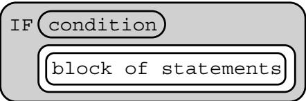
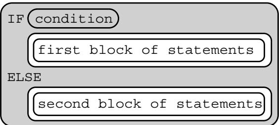
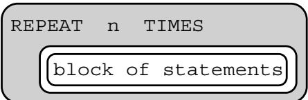
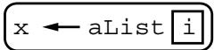
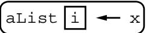
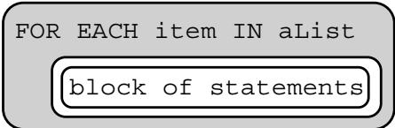
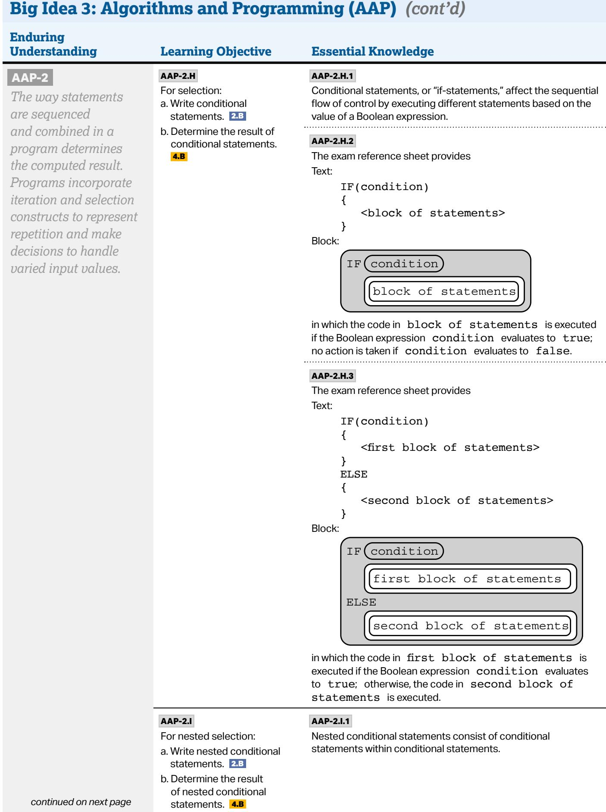
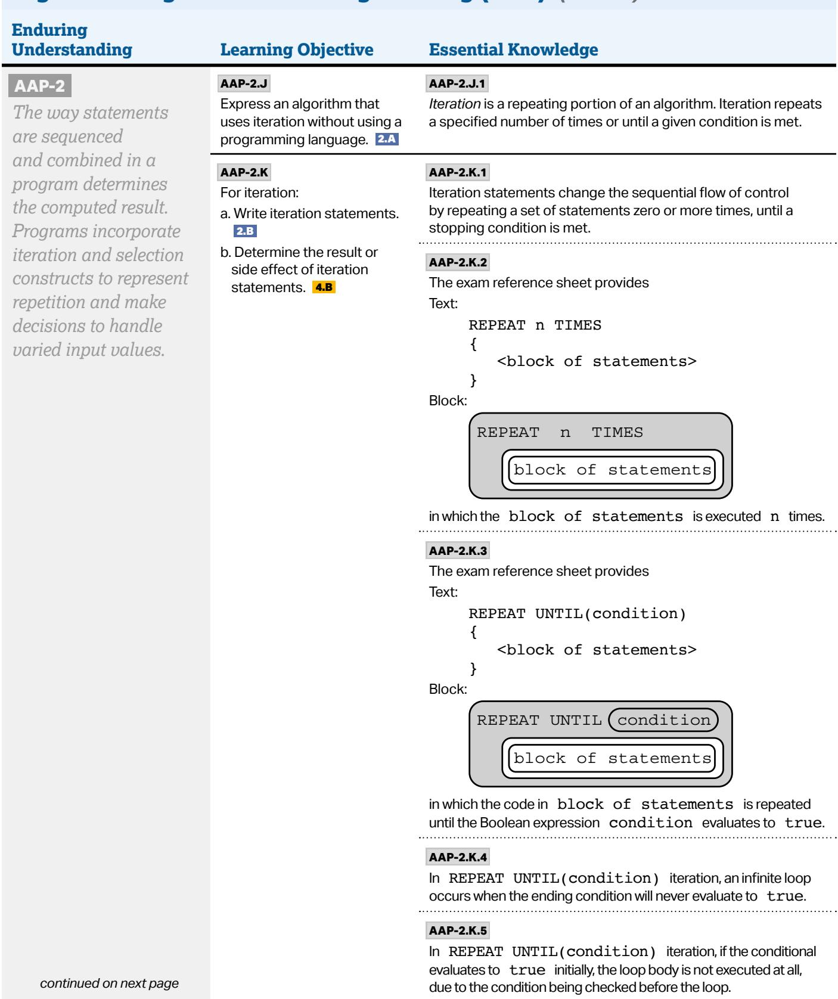
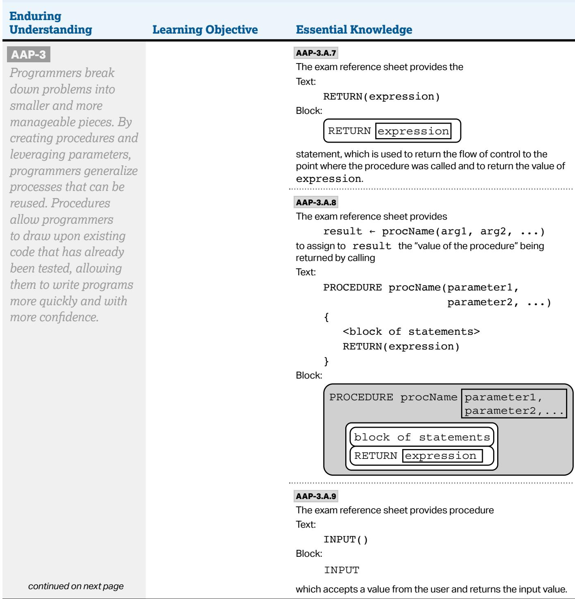
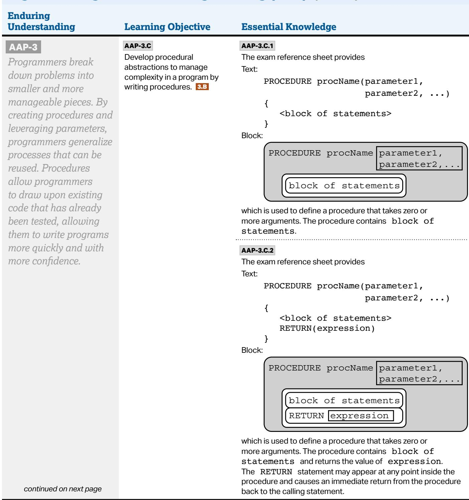

##

AP COMPUTER SCIENCE PRINCIPLES

# Student Handouts

Thefollowingpagescontainastudent-directedversionof the performance task guidelines that you can print out or copy to share with your students.

THIS PAGE IS INTENTIONALLY LEFT BLANK.

# Create Performance Task

Programming is a collaborative and creative process that brings ideas to life through the development of software. In the Create performance task, you will design and implement a program that might solve a problem, enable innovation, explore personal interests, or express creativity. Your submission must include the elements listed in the Submission Requirements section below.

You are allowed to collaborate with your partner(s) on the development of the program only. The video and Personalized Project Reference that you submit for this performance task must be completed individually, without any collaboration with your partner(s) or anyone else. You can develop the code segments used in your Personalized Project Reference with your partner(s) or on your own as you work on the performance task during class.

Please note that once your teacher has assigned this performance task as one of your AP score components, you are expected to complete the task without assistance from anyone except for your partner(s) and then only when developing the program code. You must follow the Guidelines for Completing the Create Performance Task section below.

## General Requirements

You will be provided with a minimum of 9 hours of class time to complete and submit the following:

§ Final program code (created independently or collaboratively)

§ A video that displays the running of your program and demonstrates functionality you developed (created independently)

§ Code Segments for your Personalized Project Reference (created independently) Note: Students in nontraditional classroom environments should consult a schoolbased AP Coordinator for instructions.

## Submission Requirements

COMPONENT A: PROGRAM CODE (CREATED INDEPENDENTLY OR COLLABORATIVELY) SubmitonePDFfilethatcontainsallofyourprogramcode(including comments). Include comments or acknowledgments for any part of the submitted program code that has been written by someone other than you and/or your collaborative partner(s).

## IMPORTANT:

If the programming environment allows you to include comments, this is the preferred way to acknowledge and give credit to another author. However, if the programming environment does not allow you to include comments, you can add them in a document editor when you capture your program code for submission.

Inyourprogram,youmustincludestudent-developedprogramcodethat contains the following:

□ Instructions for input from one of the following:

◆ the user (including user actions that trigger events)

◆ a device

◆ an online data stream

◆ afile

□ Use of at least one list (or other collection type) to represent a collection of datathatisstoredandusedtomanageprogramcomplexityandhelpfulfill the program’s purpose

## IMPORTANT:

The data abstraction must make the program easier to develop (alternatives would bemorecomplex)oreasiertomaintain(futurechangestothesizeofthelistwould otherwise requiresignificantmodificationstotheprogramcode).

□ At least one procedure that contributes to the program’s intended purpose, whereyouhavedefined:

◆ the procedure’s name

the return type (if necessary)

◆ one or more parameters

## IMPORTANT:

Implementationofbuilt-inorexistingproceduresorlanguagestructures,suchas eventhandlersormainmethods,arenotconsideredstudent-developed.

An algorithm that includes sequencing, selection, and iteration that is in the body of the selected procedure

□ Callstoyourstudent-developedprocedure

□ Instructions for output (tactile, audible, visual, or textual) based on input and program functionality

## DEFINITION:

## List

A list is an ordered sequence of elements. The use of lists allows multiple related items to be represented using a single variable. Lists may be referred to by diferentnames,suchas arrays, depending on the programming language.

## DEFINITION:

## Collection Type

A collection type is a type that aggregates elements in a single structure. Some examples include lists, databases, and sets.

## IMPORTANT:

Withtext-basedprogram code, you can use the print command to save your program code as aPDFfile,oryoucan copy and paste your code to a text document and then convert it into a PDF file. With blockbased program code, you can create screen captures that include only your program code, paste these images into a document, and then convert that document to a PDF. Screen captures should not be blurry, and text should be atleast10ptfontsize.

## COMPONENT B: VIDEO (CREATED INDEPENDENTLY) Submitonevideofilethat

demonstrates the running of your program as described below. Collaboration is not allowed during the development of your video.

Your video must demonstrate your program running, including:

□ Input to your program

□ At least one aspect of the functionality of your program

□ Output produced by your program

Your video may NOT contain:

□ Any distinguishing information about yourself

□ Voice narration (though text captions are allowed)

Your video must be:

Either .webm, .mp4, .wmv, .avi, or .mov format

□ No more than 1 minute in length

Nomorethan30MBinfilesize

## COMPONENT C: PERSONALIZED PROJECT REFERENCE (CREATED

INDEPENDENTLY) To assist in responding to the written response prompts on exam day, submit required portions of your code by capturing and pasting program code segments you developed during the administration of this task. Screencapturesshouldnotbeblurry,andtextshouldbeatleast10-point fontsize.Yourcodesegmentsshouldnotincludeanycomments.Thesecode segments will be made available to you on exam day only if this component is submittedasfinalintheAPDigitalPortfoliobythedeadline.

Procedure: Capture and paste two program code segments you developed duringtheadministrationofthistaskthatcontainastudent-developed procedure that implements an algorithm used in your program and a call to that procedure.

## IMPORTANT:

Built-inorexistingproceduresandlanguagestructures,suchaseventhandlers andmainmethods,arenotconsideredstudent-developed.

i. Thefirstprogramcodesegmentmustbeastudent-developed procedure that:

□ Definestheprocedure’snameandreturntype(ifnecessary)

□ Containsandusesoneormoreparametersthathaveanefecton the functionality of the procedure

□ Implements an algorithm that includes sequencing, selection, and iteration

ii. The second program code segment must show where your student-developedprocedureisbeingcalledinyourprogram.

List: Capture and paste two program code segments you developed during the administration of this task that contain a list (or other collection type) being used to manage complexity in your program.

i. Thefirstprogramcodesegmentmustshowhowdatahavebeen stored in the list.

ii. The second program code segment must show the data in the same list being used, such as creating new data from the existing dataoraccessingmultipleelementsinthelist,aspartoffulfilling the program’s purpose.

## DEFINITION:

## List

## A list is an ordered

sequence of elements. The use of lists allows multiple related items to be represented using a single variable. Lists may be referred to by diferentnames,suchas arrays, depending on the programming language.

## DEFINITION:

## Collection Type

A collection type is a type that aggregates elements in a single structure. Some examples include lists, databases, and sets.

## IMPORTANT:

The data abstraction manages complexity by making the program easier to develop (alternatives would be more complex) or easier to maintain (future changestothesizeofthe list would otherwise require significantmodificationsto the program code).

THIS PAGE IS INTENTIONALLY LEFT BLANK.

# Guidelines for Completing the Performance Task

## Academic Integrity and Plagiarism Policy

This policy addresses plagiarism and academic integrity in completing the Create Performance Task.

## Plagiarism

The use of program code, media (e.g., video, images, sound), data, information, or evidence created by someone else or with generative AI tools in the creation of a program and/or a program code segment(s), without appropriate acknowledgment (i.e., through citation, through attribution, and/or by reference), is considered plagiarism. A student who commits plagiarism will receive a score of 0 on the Create performance task,includingtheirresponsestothewrittenresponsepromptsontheend-of-course AP Exam.

To the best of their ability, teachers will ensure that students understand how to ethically incorporate ideas that are not their own and provide credit to the original creator or source, as well as the consequences of plagiarism.

## Acceptable Generative AI Use

StudentsarepermittedtoutilizegenerativeAItoolsassupplementaryresourcesfor understanding coding principles, assisting in code development, and debugging. This responsible use aligns with current guidelines for peer collaboration on developing code.

Students should be aware that generative AI tools can produce incomplete code, code thatcreatesorintroducesbiases,codewitherrors,ineficienciesinhowthecode executes,orcodecomplexitiesthatmakeitdificulttounderstandandthereforeexplain thecode.Itisthestudent'sresponsibilitytoreviewandunderstandanycodeco-written with AI tools, ensuring its functionality. Additionally, students must be prepared to explaintheircodeindetail,asrequiredontheend-of-courseAPExam.

## Preparing for Final Submission

StudentsarenotpermittedtocollaborateonthevideoorcreationofthePersonalized Project Reference.

ThePersonalizedProjectReferencecannotincludecoursecontentor comments within the code or on any other part of the reference. Including course content or comments inthePersonalizedProjectReferencewillresultinstudentsreceivingascoreof0onthe Create performance task, including their responses to the written response prompts on theend-of-courseAPExam.

## Attestations

DuringthefinalsubmissionprocessintheAPDigitalPortfolio,studentswillbe asked to attest that they have followed the Performance Task guidelines and havenotplagiarizedtheirsubmission.Eachofthethreecomponentsofthe Createperformancetaskmustbesubmittedasfinaltobesentforscoring. Additionally,ifstudentsdonotsubmittheirPersonalizedProject Reference by the deadline, they will not have this resource available on exam day to complete their written response section.

## Preparing for the Performance Task

Prior to beginning the performance task, you should:

Obtain content knowledge and skills that will help you succeed on the performance task. This can include, but needs not be limited to, the iterative development process, strategies for collaboration, the development of both data and procedural abstractions, describing an algorithm’s purpose and explaining how it functions, and identifying test data that demonstrates thediferentoutcomesofanalgorithm.Adevelopmentprocessincludes exploration,investigation,reflection,design,implementation,andtesting your program.

§ Review the performance task directions and guidelines.

§ Brainstorm problems that programming can address, or brainstorm special interests that programming can help develop.

§ As needed, seek assistance from your teacher or AP Coordinator on definingyourfocusandchoiceoftopics.

§ Be prepared to collaborate with peers as necessary.

§ Practice and discuss all or part of the performance task, including potential writtenresponsepromptsthatcouldappearontheend-of-courseAPExam.

Review the role your teacher can and cannot play in providing assistance during the actual performance task, and take advantage of the opportunity to get assistance and feedback from your teacher during practice.

Ensure you know the proper way to cite media or program code, including APIsorotherpiecesofopen-sourcecode,usedinthecreationofyour program. Any media or program code that has not been written by you must be cited, and credit must be given to the author. Any existing program code needs to be extended in some new way by adding new functionality.

Examples of responses can be found on the AP Computer Science Principles Exam page. You cannot submit any work from AP Central samples, curriculum provider samples, or practice performance tasks for yourfinalsubmission.

Be aware that the scoring process that occurs in the AP Reading may be diferentfromthescoringprocessthatoccursinyourclassroom;theAP scorethatyoureceivemaybediferentthanyourclassroomgrade.

Read through the AP Digital Portfolio file submission requirements and process,payingattentiontotheinstructionsconcerningthefiletype,size, and length to be uploaded. This is important to ensure that work is sent for AP scoring. This process includes:

◆ uploadingyourfilestothecorrectpartofthetask

◆ submittingeachcomponentasfinal

completing the College Board attestations to the originality of your work Allthreecomponentsmustbesubmittedasfinalbythedeadlineposted onAPCentral.Onlyfilesthataresubmittedasfinalwillbesentforscoring. Additionally,ifyoudonotsubmityourPersonalizedProject Reference by the deadline, you will not have this resource available on exam day to complete your written response section.

§ Practicecreatingavideoofyourprogramrunning,whileadheringtofile type,size,andlengthrequirements.

§ PracticemakingreadablescreencapturesandcreatingaPDFfileofyour program code to submit for the performance task:

Withtext-basedprogramcode,youcanusetheprintcommandto save yourprogramcodeasaPDFfile,oryoucancopyandpasteyour code to atextdocumentandthenconvertitintoaPDFfile.

Withblock-basedprogramcode,youcancreatescreencapturesthat include only your program code, paste these images into a document, andthenconvertthatdocumenttoaPDFfile.Screencapturesshould notbeblurry,andtextshouldbeatleast10ptfontsize.

ForthePersonalizedProjectReference,screencapturesshould notbeblurry,andtextshouldbeatleast10ptfontsize.Any course content or comments that were included with the program code, should not be included in the screen captures used in the PersonalizedProjectReference.Includingcoursecontentor commentsinthePersonalizedProjectReferencecouldresultin students receiving a 0 for the Create performance task.

§ Understand that you may not revise your work once you have submitted itasfinaltotheAPDigitalPortfolio.

Reviewthecategoriesforeachwrittenresponsepromptsontheendof-courseAPExam.Thewrittenresponsepromptswillberelatedtoyour Create performance task. Practice writing responses for these types of questions.

# Completing the Performance Task

## You must:

Submitallthreecomponentsofyourperformancetaskasfinalprior to the submission deadline, which can be found on the AP Computer Science Principles Exam page on AP Central. Onlyfilessubmittedasfinal will be sent for scoring. IfyoudonotsubmityourPersonalizedProject Reference by the deadline, you will not have this resource available on exam day to complete your written response section.

§ Follow a calendar or schedule that provides time for all performance task components to be completed and uploaded in advance of the deadline.

§ Read the performance task directions.

§ Apply the computer science knowledge you have obtained throughout the course, and when completing the performance task.

Use acceptable acknowledgment practices when using program code, media (i.e., images, videos, sound), or data sources created by others or with generative AI tools in your program code to avoid plagiarism. Program code not written by you could include starter code provided by yourteacher,theuseofAPIsoropen-sourcecode,orgeneratedusing an AI tool. When using existing code, you must extend the program in some new way by adding new functionality. Some examples of ways to provide attribution for program code that was not authored by you are as follows:

If the program code has been made available for your use by your teacher, add a comment that states: This code was provided as starter code by my teacher.

◆ IftheprogramcodehasbeenmadeavailablethroughanAPIoropensource code, add a comment that states: This code was made freely available by [source of code].

◆ Iftheprogramcodehasbeenco-createdwiththeassistanceof a generative AI tool, add a comment that states: This code was generated using [Generative AI Tool Name].

Add comments to your program code to clarify the functionality of program code segments or to acknowledge and credit authors of media, data sources, or program code:

If the programming environment allows you to include comments, this is the preferred way to acknowledge and give credit to another author.

◆ If the programming environment does not allow you to include comments, you can add them in a document editor when you capture your program code for submission.

Once you have started your oficial administration of the performance task, you may not:

Seek assistance in writing, revising, amending, or correcting your work, including debugging the program, writing or designing functionality in the program, testing the program, or making revisions to the program, from anyone other than your collaborative partner(s).

Submit practice performance tasks or any work that has been revised, amended, or corrected by another individual, other than your collaborative partner(s) or cited program code, as a submission for AP Exam scoring.

Include any course content in the screen captures of the program code includedinthePersonalizedProjectReference.Anycoursecontent or comments that were included in the program code during the development of your program should be removed prior to taking screen captures. Including course content or comments in your screen captures will result in the written response portion of your exam being scored a 0.

§ Collaborate during the creation of your video or creation of your PersonalizedProjectReference.

§ Reviseyourworkonceyouhavecompletedandsubmitteditasfinalto the AP Digital Portfolio.

## Once you have started your oficial administration of the performance task, you may:

Collaborate with your partner(s) only during the ideation and development, including debugging and error testing, of your program code, if you choose to do so. NOTE: You are not allowed to collaborate on yourvideoorcreationofyourPersonalizedProjectReference.

§ Follow a timeline and schedule for completing the performance task.

Seek assistance from your teacher or AP Coordinator on the formation of groups and resolution of collaboration issues when one collaborative partner is clearly and directly impeding the completion of the performance task.

SeekclarificationfromyourteacherorAPCoordinatorontheprogram requirements and submission requirements for the performance task when you do not understand the directions.

§ Work on the performance task outside of designated class time.

Seek assistance from your teacher or AP Coordinator to resolve technical problems that impede work, such as a failing workstation or dificultywithaccesstonetworks,ortohelpwithsavingfilesormaking moviefiles.

Keep a programming journal of the design choices that were made during the development of the program code or code segment and the efectofthesedecisionsontheprogram’sfunction.

AP COMPUTER SCIENCE PRINCIPLES

## Appendix

##

AP COMPUTER SCIENCE PRINCIPLES

# Appendix 1: AP CSP Exam Reference Sheet

THIS PAGE IS INTENTIONALLY LEFT BLANK.

Exam Reference Sheet

<table><tr><td>Instruction</td><td>Explanation</td></tr><tr><td colspan="2">Assignment, Display, and Input</td></tr><tr><td>Text: a ← expressionBlock:a ← expression</td><td>Evaluates expression and then assigns a copy of the result to the variable a.</td></tr><tr><td>Text: DISPLAY(expression)Block:DISPLAY expression</td><td>Displays the value of expression, followed by a space.</td></tr><tr><td>Text: INPUT()Block:INPUT</td><td>Accepts a value from the user and returns the input value.</td></tr><tr><td colspan="2">Arithmetic Operators and Numeric Procedures</td></tr><tr><td>Text and Block:a + ba - ba * ba / b</td><td>The arithmetic operators +, -, *, and / are used to perform arithmetic on a and b.For example, 17 / 5 evaluates to 3.4.The order of operations used in mathematics applies when evaluating expressions.</td></tr><tr><td>Text and Block:a MOD b</td><td>Evaluates to the remainder when a is divided by b. Assume that a is an integer greater than or equal to 0 and b is an integer greater than 0.For example, 17 MOD 5 evaluates to 2.The MOD operator has the same precedence as the * and / operators.</td></tr><tr><td>Text: RANDOM(a, b)Block:RANDOM a, b</td><td>Generates and returns a random integer from a to b, including a and b. Each result is equally likely to occur.For example, RANDOM(1, 3) could return 1, 2, or 3.</td></tr><tr><td colspan="2">Relational and Boolean Operators</td></tr><tr><td>Text and Block:a = ba ≠ ba &gt;ba &lt; ba ≥ ba ≤ b</td><td>The relational operators =, ≠, &gt;, &lt;, ≥, and ≤ are used to test the relationship between two variables, expressions, or values. A comparison using relational operators evaluates to a Boolean value.For example, a = b evaluates to true if a and b are equal; otherwise it evaluates to false.</td></tr><tr><td colspan="2">Relational and Boolean Operators (continued)</td></tr><tr><td>Text:NOT conditionBlock:NOT condition</td><td>Evaluates to true if condition is false; otherwise evaluates to false.</td></tr><tr><td>Text:condition1 AND condition2Block:condition1 AND condition2</td><td>Evaluates to true if both condition1 and condition2 are true; otherwise evaluates to false.</td></tr><tr><td>Text:condition1 OR condition2Block:condition1 OR condition2</td><td>Evaluates to true if condition1 is true or if condition2 is true or if both condition1 and condition2 are true; otherwise evaluates to false.</td></tr><tr><td colspan="2">Selection</td></tr><tr><td>Text:IF(condition){&lt;block of statements&gt;}Block:</td><td>The code in block of statements is executed if the Boolean expression condition evaluates to true; no action is taken if condition evaluates to false.</td></tr><tr><td>Text:IF(condition){&lt;first block of statements&gt;}ELSE{&lt;second block of statements&gt;}Block:</td><td>The code in first block of statements is executed if the Boolean expression condition evaluates to true; otherwise the code in second block of statements is executed.</td></tr><tr><td colspan="2">Iteration</td></tr><tr><td>Text:REPEAT n TIMES{ }Block:</td><td>The code in block of statements is executed n times.</td></tr><tr><td>Text:REPEAT UNTIL(condition){ }Block:REPEAT UNTIL conditionblock of statements</td><td>The code in block of statements is repeated until the Boolean expression condition evaluates to true.</td></tr><tr><td colspan="2">List Operations</td></tr><tr><td colspan="2">For all list operations, if a list index is less than 1 or greater than the length of the list, an error message is produced and the program terminates.</td></tr><tr><td>Text:aList ← [value1, value2, value3, ...]Block:aList ← value1, value2, value3</td><td>Creates a new list that contains the values value1, value2, value3, and ... at indices 1, 2, 3, and ... respectively and assigns it to aList.</td></tr><tr><td>Text:aList ← []Block:aList ← []</td><td>Creates an empty list and assigns it to aList.</td></tr><tr><td>Text:aList ← bListBlock:aList ← bList</td><td>Assigns a copy of the list bList to the list aList.For example,if bList contains [20, 40, 60], then aList will also contain [20, 40, 60] after the assignment.</td></tr><tr><td>Text:aList[i]Block:aList i</td><td>Accesses the element of aList at index i. The first element of aList is at index 1 and is accessed using the notation aList[1].</td></tr><tr><td colspan="2">List Operations (continued)</td></tr><tr><td>Text: x ← aList[i]Block:</td><td>Assigns the value of aList[i] to the variable x.</td></tr><tr><td>Text: aList[i] ← xBlock:</td><td>Assigns the value of x to aList[i].</td></tr><tr><td>Text: aList[i] ← aList[j]Block:</td><td>Assigns the value of aList[j] to aList[i].</td></tr><tr><td>Text: INSERT(aList, i, value)Block:</td><td>Any values in aList at indices greater than or equal to i are shifted one position to the right. The length of the list is increased by 1, and value is placed at index i in aList.</td></tr><tr><td>Text: APPEND(aList, value)Block:</td><td>The length of aList is increased by 1, and value is placed at the end of aList.</td></tr><tr><td>Text: REMOVE(aList, i)Block:</td><td>Removes the item at index i in aList and shifts to the left any values at indices greater than i. The length of aList is decreased by 1.</td></tr><tr><td>Text: LENGTH(aList)Block:LENGTH aList</td><td>Evaluates to the number of elements in aList.</td></tr><tr><td>Text: FOR EACH item IN aList {&lt;block of statements&gt;}Block:</td><td>The variable item is assigned the value of each element of aList sequentially, in order, from the first element to the last element. The code in block of statements is executed once for each assignment of item.</td></tr><tr><td colspan="2">Procedures and Procedure Calls</td></tr><tr><td>Text:PROCEDURE procName(parameter1, parameter2, ...){Block:PROCEDURE procName parameter1, parameter2,...block of statements</td><td>Defines procName as a procedure that takes zero or more arguments. The procedure contains block of statements. The procedure procName can be called using the following notation, where arg1 is assigned to parameter1, arg2 is assigned to parameter2, etc.: procName(arg1, arg2, ...)</td></tr><tr><td>Text:PROCEDURE procName(parameter1, parameter2, ...){RETURN(expression)}Block:PROCEDURE procName parameter1, parameter2,...block of statementsRETURN expression</td><td>Defines procName as a procedure that takes zero or more arguments. The procedure contains block of statements and returns the value of expression. The RETURN statement may appear at any point inside the procedure and causes an immediate return from the procedure back to the calling statement.The value returned by the procedure procName can be assigned to the variable result using the following notation: result ← procName(arg1, arg2, ...)</td></tr><tr><td>Text:RETURN(expression)Block:RETURN expression</td><td>Returns the flow of control to the point where the procedure was called and returns the value of expression.</td></tr><tr><td colspan="2">Robot</td></tr><tr><td colspan="2">If the robot attempts to move to a square that is not open or is beyond the edge of the grid, the robot will stay in its current location and the program will terminate.</td></tr><tr><td>Text:MOVE_FORWARD()Block:MOVE_FORWARD</td><td>The robot moves one square forward in the direction it is facing.</td></tr><tr><td>Text:ROTATE_LEFT()Block:ROTATE_LEFT</td><td>The robot rotates in place 90 degrees counterclockwise (i.e., makes an in-place left turn).</td></tr><tr><td colspan="2">Robot</td></tr><tr><td>Text:ROTATE_RIGHT()Block:ROTATE_RIGHT</td><td>The robot rotates in place 90 degrees clockwise (i.e., makes an in-place right turn).</td></tr><tr><td>Text:CAN_MOVE(direction)Block:CAN_MOVE direction</td><td>Evaluates to true if there is an open square one square in the direction relative to where the robot is facing; otherwise evaluates to false. The value of direction can be left, right, forward, or backward.</td></tr></table>

AP COMPUTER SCIENCE PRINCIPLES

## Appendix 2: AP CSP Conceptual Framework

THIS PAGE IS INTENTIONALLY LEFT BLANK.

# Conceptual Framework

## Big Idea 1: Creative Development (CRD)

When developing computing innovations, developers can use a formal, iterative design process or experimentation. While using either approach, developers will encounter phases of investigating and reflecting, designing, prototyping, and testing. Additionally, collaboration is an important tool to use at any phase of development because considering multiple perspectives allows for improvement of innovations.

<table><tr><td>Enduring Understanding</td><td>Learning Objective</td><td>Essential Knowledge</td></tr><tr><td rowspan="9">CRD-1Incorporating multiple perspectives through collaboration improves computing innovations as they are developed.</td><td rowspan="6">CRD-1.AExplain how computing innovations are improved through collaboration. 1.C</td><td>CRD-1.A.1A computing innovation includes a program as an integral part of its function.</td></tr><tr><td>CRD-1.A.2A computing innovation can be physical (e.g., self-driving car), nonphysical computing software (e.g., picture editing software), or a nonphysical computing concept (e.g., e-commerce).</td></tr><tr><td>CRD-1.A.3Effective collaboration produces a computing innovation that reflects the diversity of talents and perspectives of those who designed it.</td></tr><tr><td>CRD-1.A.4Collaboration that includes diverse perspectives helps avoid bias in the development of computing innovations.</td></tr><tr><td>CRD-1.A.5Consultation and communication with users are important aspects of the development of computing innovations.</td></tr><tr><td>CRD-1.A.6Information gathered from potential users can be used to understand the purpose of a program from diverse perspectives and to develop a program that fully incorporates these perspectives.</td></tr><tr><td rowspan="2">CRD-1.BExplain how computing innovations are developed by groups of people. 1.C</td><td>CRD-1.B.1Online tools support collaboration by allowing programmers to share and provide feedback on ideas and documents.</td></tr><tr><td>CRD-1.B.2Common models such as pair programming exist to facilitate collaboration.</td></tr><tr><td>CRD-1.CDemonstrate effective interpersonal skills during collaboration. 1.C</td><td>CRD-1.C.1Effective collaborative teams practice interpersonal skills, including but not limited to:communicationconsensus buildingconflict resolutionnegotiation</td></tr><tr><td colspan="3">continued on next page</td></tr><tr><td rowspan="3">CRD-2Developers create and innovate using an iterative design process that is user-focused, that incorporates implementation/feedback cycles, and that leaves ample room for experimentation and risk-taking.</td><td>CRD-2.ADescribe the purpose of a computing innovation.1.A</td><td>CRD-2.A.1The purpose of computing innovations is to solve problems or to pursue interests through creative expression.CRD-2.A.2An understanding of the purpose of a computing innovation provides developers with an improved ability to develop that computing innovation.</td></tr><tr><td>CRD-2.BExplain how a program or code segment functions.4.A</td><td>CRD-2.B.1A program is a collection of program statements that performs a specific task when run by a computer. A program is often referred to as software.CRD-2.B.2A code segment is a collection of program statements that is part of a program.CRD-2.B.3A program needs to work for a variety of inputs and situations.CRD-2.B.4The behavior of a program is how a program functions during execution and is often described by how a user interacts with it.CRD-2.B.5A program can be described broadly by what it does, or in more detail by both what the program does and how the program statements accomplish this function.</td></tr><tr><td>CRD-2.CIdentify input(s) to a program.3.A</td><td>CRD-2.C.1Program inputs are data sent to a computer for processing by a program. Input can come in a variety of forms, such as tactile, audio, visual, or text.CRD-2.C.2An event is associated with an action and supplies input data to a program.CRD-2.C.3Events can be generated when a key is pressed, a mouse is clicked, a program is started, or any other defined action occurs that affects the flow of execution.CRD-2.C.4Inputs usually affect the output produced by a program.CRD-2.C.5In event-driven programming, program statements are executed when triggered rather than through the sequential flow of control.CRD-2.C.6Input can come from a user or other programs.</td></tr><tr><td rowspan="3">CRD-2Developers create and innovate using an iterative design process that is user-focused, that incorporates implementation/feedback cycles, and that leaves ample room for experimentation and risk-taking.</td><td>CRD-2.DIdentify output(s) produced by a program.3.A</td><td>CRD-2.D.1Program outputs are any data sent from a program to a device. Program output can come in a variety of forms, such as tactile, audio, visual, or text.CRD-2.D.2Program output is usually based on a program's input or prior state (e.g., internal values).</td></tr><tr><td>CRD-2.EDevelop a program using a development process.1.B</td><td>CRD-2.E.1A development process can be ordered and intentional, or exploratory in nature.CRD-2.E.2There are multiple development processes. The following phases are commonly used when developing a program:investigating and reflectingdesigningprototypingtestingCRD-2.E.3A development process that is iterative requires refinement and revision based on feedback, testing, or reflection throughout the process. This may require revisiting earlier phases of the process.CRD-2.E.4A development process that is incremental is one that breaks the problem into smaller pieces and makes sure each piece works before adding it to the whole.</td></tr><tr><td>CRD-2.FDesign a program and its user interface.1.B</td><td>CRD-2.F.1The design of a program incorporates investigation to determine its requirements.CRD-2.F.2Investigation in a development process is useful for understanding and identifying the program constraints, as well as the concerns and interests of the people who will use the program.CRD-2.F.3Some ways investigation can be performed are as follows:collecting data through surveysuser testinginterviewsdirect observations</td></tr><tr><td rowspan="2">CRD-2Developers create and innovate using an iterative design process that is user-focused, that incorporates implementation/feedback cycles, and that leaves ample room for experimentation and risk-taking.</td><td></td><td>CRD-2.F.4Program requirements describe how a program functions and may include a description of user interactions that a program must provide.CRD-2.F.5A program's specification defines the requirements for the program.CRD-2.F.6In a development process, the design phase outlines how to accomplish a given program specification.CRD-2.F.7The design phase of a program may include:brainstormingplanning and storyboardingorganizing the program into modules and functional componentscreation of diagrams that represent the layouts of the user interfacedevelopment of a testing strategy for the program</td></tr><tr><td>CRD-2.GDescribe the purpose of a code segment or program by writing documentation. 4.A</td><td>CRD-2.G.1Program documentation is a written description of the function of a code segment, event, procedure, or program and how it was developed.CRD-2.G.2Comments are a form of program documentation written into the program to be read by people and do not affect how a program runs.CRD-2.G.3Programmers should document a program throughout its development.CRD-2.G.4Program documentation helps in developing and maintaining correct programs when working individually or in collaborative programming environments.CRD-2.G.5Not all programming environments support comments, so other methods of documentation may be required.</td></tr><tr><td colspan="3">continued on next page</td></tr><tr><td colspan="3">Big Idea 1: Creative Development (CRD) (cont'd)</td></tr><tr><td>Enduring Understanding</td><td>Learning Objective</td><td>Essential Knowledge</td></tr><tr><td rowspan="10">CRD-2Developers create and innovate using an iterative design process that is user-focused, that incorporates implementation/feedback cycles, and that leaves ample room for experimentation and risk-taking.</td><td rowspan="2">CRD-2.H Acknowledge code segments used from other sources.1.C</td><td>CRD-2.H.1It is important to acknowledge any code segments that were developed collaboratively or by another source.</td></tr><tr><td>CRD-2.H.2Acknowledgement of a code segment(s) written by someone else and used in a program can be in the program documentation. The acknowledgement should include the origin or original author's name.</td></tr><tr><td rowspan="5">CRD-2.I For errors in an algorithm or program:a. Identify the error.4.Cb. Correct the error.4.C</td><td>CRD-2.I.1A logic error is a mistake in the algorithm or program that causes it to behave incorrectly or unexpectedly.</td></tr><tr><td>CRD-2.I.2A syntax error is a mistake in the program where the rules of the programming language are not followed.</td></tr><tr><td>CRD-2.I.3A run-time error is a mistake in the program that occurs during the execution of a program. Programming languages define their own run-time errors.</td></tr><tr><td>CRD-2.I.4An overflow error is an error that occurs when a computer attempts to handle a number that is outside of the defined range of values.</td></tr><tr><td>CRD-2.I.5The following are effective ways to find and correct errors: test caseshand tracingvisualizationsdebuggersadding extra output statement(s)</td></tr><tr><td rowspan="3">CRD-2.JIdentify inputs and corresponding expected outputs or behaviors that can be used to check the correctness of an algorithm or program.4.C</td><td>CRD-2.J.1In the development process, testing uses defined inputs to ensure that an algorithm or program is producing the expected outcomes. Programmers use the results from testing to revise their algorithms or programs.</td></tr><tr><td>CRD-2.J.2Defined inputs used to test a program should demonstrate the different expected outcomes that are at or just beyond the extremes (minimum and maximum) of input data.</td></tr><tr><td>CRD-2.J.3Program requirements are needed to identify appropriate defined inputs for testing.</td></tr></table>

## Big Idea 2: Data (DAT)

Data are central to computing innovations because they communicate initial conditions to programs and represent new knowledge. Computers consume data, transform data, and produce new data, allowing users to create new information or knowledge to solve problems through the interpretation of these data. Computers store data digitally, which means that the data must be manipulated in order to be presented in a useful way to the user.

<table><tr><td>Enduring Understanding</td><td>Learning Objective</td><td>Essential Knowledge</td></tr><tr><td>DAT-1The way a computer represents data internally is different from the way the data are interpreted and displayed for the user. Programs are used to translate data into a representation more easily understood by people.</td><td>DAT-1.AExplain how data can be represented using bits.3.C</td><td>DAT-1.A.1Data values can be stored in variables, lists of items, or standalone constants and can be passed as input to (or output from) procedures.DAT-1.A.2Computing devices represent data digitally, meaning that the lowest-level components of any value are bits.DAT-1.A.3Bit is shorthand for binary digit and is either 0 or 1.DAT-1.A.4A byte is 8 bits.DAT-1.A.5Abstraction is the process of reducing complexity by focusing on the main idea. By hiding details irrelevant to the question at hand and bringing together related and useful details, abstraction reduces complexity and allows one to focus on the idea.DAT-1.A.6Bits are grouped to represent abstractions. These abstractions include, but are not limited to, numbers, characters, and color.DAT-1.A.7The same sequence of bits may represent different types of data in different contexts.DAT-1.A.8Analog data have values that change smoothly, rather than in discrete intervals, over time. Some examples of analog data include pitch and volume of music, colors of a painting, or position of a sprinter during a race.DAT-1.A.9The use of digital data to approximate real-world analog data is an example of abstraction.DAT-1.A.10Analog data can be closely approximated digitally using a sampling technique, which means measuring values of the analog signal at regular intervals called samples. The samples are measured to figure out the exact bits required to store each sample.</td></tr><tr><td colspan="3">Big Idea 2: Data (DAT) (cont'd)</td></tr><tr><td>Enduring Understanding</td><td>Learning Objective</td><td>Essential Knowledge</td></tr><tr><td rowspan="2">DAT-1The way a computer represents data internally is different from the way the data are interpreted and displayed for the user. Programs are used to translate data into a representation more easily understood by people.</td><td>DAT-1.BExplain the consequences of using bits to represent data.1.D</td><td>DAT-1.B.1In many programming languages, integers are represented by a fixed number of bits, which limits the range of integer values and mathematical operations on those values. This limitation can result in overflow or other errors.DAT-1.B.2Other programming languages provide an abstraction through which the size of representable integers is limited only by the size of the computer's memory; this is the case for the language defined in the exam reference sheet.DAT-1.B.3In programming languages, the fixed number of bits used to represent real numbers limits the range and mathematical operations on these values; this limitation can result in round-off and other errors. Some real numbers are represented as approximations in computer storage.EXCLUSION STATEMENT (EK DAT-1.B.3)Specific range limitations for real numbers are outside the scope of this course and the AP Exam.</td></tr><tr><td>DAT-1.CFor binary numbers:a. Calculate the binary (base 2) equivalent of a positive integer (base 10) and vice versa.2.Bb. Compare and order binary numbers.2.B</td><td>DAT-1.C.1Number bases, including binary and decimal, are used to represent data.DAT-1.C.2Binary (base 2) uses only combinations of the digits zero and one.DAT-1.C.3Decimal (base 10) uses only combinations of the digits 0 – 9.DAT-1.C.4As with decimal, a digit's position in the binary sequence determines its numeric value. The numeric value is equal to the bit's value (0 or 1) multiplied by the place value of its position.DAT-1.C.5The place value of each position is determined by the base raised to the power of the position. Positions are numbered starting at the rightmost position with 0 and increasing by 1 for each subsequent position to the left.</td></tr><tr><td>continued on next page</td><td></td><td></td></tr><tr><td rowspan="8">DAT-1The way a computer represents data internally is different from the way the data are interpreted and displayed for the user. Programs are used to translate data into a representation more easily understood by people.</td><td rowspan="8">DAT-1.DCompare data compression algorithms to determine which is best in a particular context.1.D</td><td>DAT-1.D.1Data compression can reduce the size (number of bits) of transmitted or stored data.</td></tr><tr><td>DAT-1.D.2Fewer bits does not necessarily mean less information.</td></tr><tr><td>DAT-1.D.3The amount of size reduction from compression depends on both the amount of redundancy in the original data representation and the compression algorithm applied.</td></tr><tr><td>DAT-1.D.4Lossless data compression algorithms can usually reduce the number of bits stored or transmitted while guaranteeing complete reconstruction of the original data.</td></tr><tr><td>DAT-1.D.5Lossy data compression algorithms can significantly reduce the number of bits stored or transmitted but only allow reconstruction of an approximation of the original data.</td></tr><tr><td>DAT-1.D.6Lossy data compression algorithms can usually reduce the number of bits stored or transmitted more than lossless compression algorithms.</td></tr><tr><td>DAT-1.D.7In situations where quality or ability to reconstruct the original is maximally important, lossless compression algorithms are typically chosen.</td></tr><tr><td>DAT-1.D.8In situations where minimizing data size or transmission time is maximally important, lossy compression algorithms are typically chosen.</td></tr><tr><td rowspan="4">DAT-2Programs can be used to process data, which allows users to discover information and create new knowledge.</td><td rowspan="4">DAT-2.ADescribe what information can be extracted from data.5.B</td><td>DAT-2.A.1Information is the collection of facts and patterns extracted from data.</td></tr><tr><td>DAT-2.A.2Data provide opportunities for identifying trends, making connections, and addressing problems.</td></tr><tr><td>DAT-2.A.3Digitally processed data may show correlation between variables. A correlation found in data does not necessarily indicate that a causal relationship exists. Additional research is needed to understand the exact nature of the relationship.</td></tr><tr><td>DAT-2.A.4Often, a single source does not contain the data needed to draw a conclusion. It may be necessary to combine data from a variety of sources to formulate a conclusion.</td></tr><tr><td>continued on next page</td><td></td><td></td></tr><tr><td rowspan="2">DAT-2Programs can be used to process data, which allows users to discover information and create new knowledge.</td><td>DAT-2.BDescribe what information can be extracted from metadata.5.B</td><td>DAT-2.B.1Metadata are data about data. For example, the piece of data may be an image, while the metadata may include the date of creation or the file size of the image.DAT-2.B.2Changes and deletions made to metadata do not change the primary data.DAT-2.B.3Metadata are used for finding, organizing, and managing information.DAT-2.B.4Metadata can increase the effective use of data or data sets by providing additional information.DAT-2.B.5Metadata allow data to be structured and organized.</td></tr><tr><td>DAT-2.CIdentify the challenges associated with processing data.5.D</td><td>DAT-2.C.1The ability to process data depends on the capabilities of the users and their tools.DAT-2.C.2Data sets pose challenges regardless of size, such as:the need to clean dataincomplete datainvalid datathe need to combine data sourcesDAT-2.C.3Depending on how data were collected, they may not be uniform. For example, if users enter data into an open field, the way they choose to abbreviate, spell, or capitalize something may vary from user to user.DAT-2.C.4Cleaning data is a process that makes the data uniform without changing their meaning (e.g., replacing all equivalent abbreviations, spellings, and capitalizations with the same word).DAT-2.C.5Problems of bias are often created by the type or source of data being collected. Bias is not eliminated by simply collecting more data.DAT-2.C.6The size of a data set affects the amount of information that can be extracted from it.DAT-2.C.7Large data sets are difficult to process using a single computer and may require parallel systems.DAT-2.C.8Scalability of systems is an important consideration when working with data sets, as the computational capacity of a system affects how data sets can be processed and stored.</td></tr><tr><td>continued on next page</td><td></td><td></td></tr><tr><td rowspan="11">DAT-2Programs can be used to process data, which allows users to discover information and create new knowledge.</td><td rowspan="6">DAT-2.DExtract information from data using a program.2.3</td><td>DAT-2.D.1Programs can be used to process data to acquire information.</td></tr><tr><td>DAT-2.D.2Tables, diagrams, text, and other visual tools can be used to communicate insight and knowledge gained from data.</td></tr><tr><td>DAT-2.D.3Search tools are useful for efficiently finding information.</td></tr><tr><td>DAT-2.D.4Data filtering systems are important tools for finding information and recognizing patterns in data.</td></tr><tr><td>DAT-2.D.5Programs such as spreadsheets help efficiently organize and find trends in information.</td></tr><tr><td>DAT-2.D.6Some processes that can be used to extract or modify information from data include the following:transforming every element of a data set, such as doubling every element in a list, or adding a parent's email to every student recordfiltering a data set, such as keeping only the positive numbers from a list, or keeping only students who signed up for band from a record of all the studentscombining or comparing data in some way, such as adding up a list of numbers, or finding the student who has the highest GPAvisualizing a data set through a chart, graph, or other visual representation</td></tr><tr><td rowspan="5">DAT-2.EExplain how programs can be used to gain insight and knowledge from data.5.B</td><td>DAT-2.E.1Programs are used in an iterative and interactive way when processing information to allow users to gain insight and knowledge about data.</td></tr><tr><td>DAT-2.E.2Programmers can use programs to filter and clean digital data, thereby gaining insight and knowledge.</td></tr><tr><td>DAT-2.E.3Combining data sources, clustering data, and classifying data are parts of the process of using programs to gain insight and knowledge from data.</td></tr><tr><td>DAT-2.E.4Insight and knowledge can be obtained from translating and transforming digitally represented information.</td></tr><tr><td>DAT-2.E.5Patterns can emerge when data are transformed using programs.</td></tr></table>

## Big Idea 3: Algorithms and Programming (AAP)

Programmers integrate algorithms and abstraction to create programs for creative purposes and to solve problems. Using multiple program statements in a specified order, making decisions, and repeating the same process multiple times are the building blocks of programs. Incorporating elements of abstraction, by breaking problems down into interacting pieces, each with their own purpose, makes writing complex programs easier. Programmers need to think algorithmically and use abstraction to define and interpret processes that are used in a program.

<table><tr><td>Enduring Understanding</td><td>Learning Objective</td><td>Essential Knowledge</td></tr><tr><td rowspan="2">AAP-1To find specific solutions to generalizable problems, programmers represent and organize data in multiple ways.</td><td>AAP-1.ARepresent a value with a variable.3.A</td><td>AAP-1.A.1A variable is an abstraction inside a program that can hold a value. Each variable has associated data storage that represents one value at a time, but that value can be a list or other collection that in turn contains multiple values.AAP-1.A.2Using meaningful variable names helps with the readability of program code and understanding of what values are represented by the variables.AAP-1.A.3Some programming languages provide types to represent data, which are referenced using variables. These types include numbers, Booleans, lists, and strings.AAP-1.A.4Some values are better suited to representation using one type of datum rather than another.</td></tr><tr><td>AAP-1.BDetermine the value of a variable as a result of an assignment.4.B</td><td>AAP-1.B.1The assignment operator allows a program to change the value represented by a variable.AAP-1.B.2The exam reference sheet provides the “←” operator to use for assignment. For example,Text:a ← expressionBlock:a ← expressionevaluates expression and then assigns a copy of the result to the variable a.AAP-1.B.3The value stored in a variable will be the most recent value assigned. For example:a ← 1b ← aa ← 2display(b)still displays 1.</td></tr><tr><td rowspan="4">AAP-1To find specific solutions to generalizable problems, programmers represent and organize data in multiple ways.</td><td rowspan="4">AAP-1.CRepresent a list or string using a variable.3.A</td><td>AAP-1.C.1A list is an ordered sequence of elements. For example,[value1, value2, value3, ...]describes a list where value1 is the first element, value2 is the second element, value3 is the third element, and so on.</td></tr><tr><td>AAP-1.C.2An element is an individual value in a list that is assigned a unique index.</td></tr><tr><td>AAP-1.C.3An index is a common method for referencing the elements in a list or string using natural numbers.</td></tr><tr><td>AAP-1.C.4A string is an ordered sequence of characters.</td></tr><tr><td>continued on next page</td><td></td><td></td></tr><tr><td colspan="3">Big Idea 3: Algorithms and Programming (AAP) (cont'd)</td></tr><tr><td>Enduring Understanding</td><td>Learning Objective</td><td>Essential Knowledge</td></tr><tr><td>AAP-1To find specific solutions to generalizable problems, programmers represent and organize data in multiple ways.</td><td>AAP-1.DFor data abstraction:a. Develop data abstraction using lists to store multiple elements.3.Bb. Explain how the use of data abstraction manages complexity in program code.3.C</td><td>AAP-1.D.1Data abstraction provides a separation between the abstract properties of a data type and the concrete details of its representation.AAP-1.D.2Data abstractions manage complexity in programs by giving a collection of data a name without referencing the specific details of the representation.AAP-1.D.3Data abstractions can be created using lists.AAP-1.D.4Developing a data abstraction to implement in a program can result in a program that is easier to develop and maintain.AAP-1.D.5Data abstractions often contain different types of elements.AAP-1.D.6The use of lists allows multiple related items to be treated as a single value. Lists are referred to by different names, such as array, depending on the programming language.EXCLUSION STATEMENT (EK APP-1.D.6)The use of linked lists is outside the scope of this course and the AP Exam.AAP-1.D.7The exam reference sheet provides the notation[value1, value2, value3, ...]to create a list with those values as the first, second, third, and so on items. For example,Text:aList ← [value1, value2, value3, ...]Block:aList ← value1, value2, value3creates a new list that contains the values value1, value2, value3, and ... at indices 1, 2, 3, and ... respectively and assigns it to aList.Text:aList ← []Block:aList ← ]creates a new empty list and assigns it to aList.</td></tr><tr><td>continued on next page</td><td></td><td></td></tr><tr><td>Enduring Understanding</td><td>Learning Objective</td><td>Essential Knowledge</td></tr><tr><td>AAP-1To find specific solutions to generalizable problems, programmers represent and organize data in multiple ways.</td><td></td><td>• Text:aList ← bListBlock:aList ← bListassigns a copy of the list bList to the list aList. For example, if bList contains [20, 40, 60], then aList will also contain [20, 40, 60] after the assignment.AAP-1.D.8The exam reference sheet describes a list structure whose index values are 1 through the number of elements in the list, inclusive. For all list operations, if a list index is less than 1 or greater than the length of the list, an error message is produced and the program will terminate.</td></tr><tr><td rowspan="2">AAP-2The way statements are sequenced and combined in a program determines the computed result. Programs incorporate iteration and selection constructs to represent repetition and make decisions to handle varied input values.</td><td>AAP-2.AExpress an algorithm that uses sequencing without using a programming language.2.A</td><td>AAP-2.A.1An algorithm is a finite set of instructions that accomplish a specific task.AAP-2.A.2Beyond visual and textual programming languages, algorithms can be expressed in a variety of ways, such as natural language, diagrams, and pseudocode.AAP-2.A.3Algorithms executed by programs are implemented using programming languages.AAP-2.A.4Every algorithm can be constructed using combinations of sequencing, selection, and iteration.</td></tr><tr><td>AAP-2.BRepresent a step-by-step algorithmic process using sequential code statements.2.B</td><td>AAP-2.B.1Sequencing is the application of each step of an algorithm in the order in which the code statements are given.AAP-2.B.2A code statement is a part of program code that expresses an action to be carried out.AAP-2.B.3An expression can consist of a value, a variable, an operator, or a procedure call that returns a value.AAP-2.B.4Expressions are evaluated to produce a single value.AAP-2.B.5The evaluation of expressions follows a set order of operations defined by the programming language.AAP-2.B.6Sequential statements execute in the order they appear in the code segment.AAP-2.B.7Clarity and readability are important considerations when expressing an algorithm in a programming language.</td></tr><tr><td colspan="3">continued on next page</td></tr><tr><td rowspan="8">AAP-2The way statements are sequenced and combined in a program determines the computed result. Programs incorporate iteration and selection constructs to represent repetition and make decisions to handle varied input values.</td><td rowspan="4">AAP-2.CEvaluate expressions that use arithmetic operators.4.B</td><td>AAP-2.C.1Arithmetic operators are part of most programming languages and include addition, subtraction, multiplication, division, and modulus operators.</td></tr><tr><td>AAP-2.C.2The exam reference sheet provides a MOD b, which evaluates to the remainder when a is divided by b. Assume that a is an integer greater than or equal to 0 and b is an integer greater than 0. For example, 17 MOD 5 evaluates to 2.</td></tr><tr><td>AAP-2.C.3The exam reference sheet provides the arithmetic operators +, -, *, /, and MOD.Text and Block:a + ba - ba * ba / ba MOD bThese are used to perform arithmetic on a and b. For example, 17 / 5 evaluates to 3.4.</td></tr><tr><td>AAP-2.C.4The order of operations used in mathematics applies when evaluating expressions. The MOD operator has the same precedence as the * and / operators.</td></tr><tr><td rowspan="2">AAP-2.DEvaluate expressions that manipulate strings.4.B</td><td>AAP-2.D.1String concatenation joins together two or more strings end-to-end to make a new string.</td></tr><tr><td>AAP-2.D.2A substring is part of an existing string.</td></tr><tr><td rowspan="2">AAP-2.EFor relationships between two variables, expressions, or values:a. Write expressions using relational operators.2.Bb. Evaluate expressions that use relational operators.4.B</td><td>AAP-2.E.1A Boolean value is either true or false.</td></tr><tr><td>AAP-2.E.2The exam reference sheet provides the following relational operators: =, ≠, &gt;, &lt;, ≥, and ≤.Text and Block:a = ba ≠ba &gt;ba &lt; ba ≥ba ≤bThese are used to test the relationship between two variables, expressions, or values. A comparison using a relational operator evaluates to a Boolean value. For example, a = b evaluates to true if a and b are equal; otherwise, it evaluates to false.</td></tr><tr><td rowspan="2">AAP-2The way statements are sequenced and combined in a program determines the computed result. Programs incorporate iteration and selection constructs to represent repetition and make decisions to handle varied input values.</td><td>AAP-2.FFor relationships between Boolean values:a. Write expressions using logical operators. 2.Bb. Evaluate expressions that use logic operators. 4.B</td><td>AAP-2.F.1The exam reference sheet provides the logical operators NOT, AND, and OR, which evaluate to a Boolean value.......AAP-2.F.2The exam reference sheet providesText:NOT conditionBlock:NOT conditionwhich evaluates to true if condition is false; otherwise it evaluates to false.......AAP-2.F.3The exam reference sheet providesText:condition1 AND condition2Block:condition1 AND condition2which evaluates to true if both condition1 and condition2 are true; otherwise it evaluates to false.......AAP-2.F.4The exam reference sheet providesText:condition1 OR condition2Block:condition1 OR condition2which evaluates to true if condition1 is true or if condition2 is true or if both condition1 and condition2 are true; otherwise it evaluates to false.......AAP-2.F.5The operand for a logical operator is either a Boolean expression or a single Boolean value.</td></tr><tr><td>AAP-2.GExpress an algorithm that uses selection without using a programming language. 2.A</td><td>AAP-2.G.1Selection determines which parts of an algorithm are executed based on a condition being true or false.</td></tr></table>

Big Idea 3: Algorithms and Programming (AAP) (cont’d)  

first block of statements

For nested selection:

a. Write nested conditiona statements.  2.B

Big Idea 3: Algorithms and Programming (AAP) (cont’d)  

Big Idea 3: Algorithms and Programming (AAP) (cont’d)

<table><tr><td>Enduring Understanding</td><td>Learning Objective</td><td>Essential Knowledge</td></tr><tr><td rowspan="9">AAP-2The way statements are sequenced and combined in a program determines the computed result. Programs incorporate iteration and selection constructs to represent repetition and make decisions to handle varied input values.</td><td rowspan="5">AAP-2.LCompare multiple algorithms to determine if they yield the same side effect or result.1.D</td><td>AAP-2.L.1Algorithms can be written in different ways and still accomplish the same tasks.</td></tr><tr><td>AAP-2.L.2Algorithms that appear similar can yield different side effects or results.</td></tr><tr><td>AAP-2.L.3Some conditional statements can be written as equivalent Boolean expressions.</td></tr><tr><td>AAP-2.L.4Some Boolean expressions can be written as equivalent conditional statements.</td></tr><tr><td>AAP-2.L.5Different algorithms can be developed or used to solve the same problem.</td></tr><tr><td rowspan="3">AAP-2.MFor algorithms:a. Create algorithms. 2.Ab. Combine and modify existing algorithms. 2.B</td><td>AAP-2.M.1Algorithms can be created from an idea, by combining existing algorithms, or by modifying existing algorithms.</td></tr><tr><td>AAP-2.M.2Knowledge of existing algorithms can help in constructing new ones. Some existing algorithms include:determining the maximum or minimum value of two or more numberscomputing the sum or average of two or more numbersidentifying if an integer is or is not evenly divisible by another integerdetermining a robot's path through a maze</td></tr><tr><td>AAP-2.M.3Using existing correct algorithms as building blocks for constructing another algorithm has benefits such as reducing development time, reducing testing, and simplifying the identification of errors.</td></tr><tr><td>AAP-2.NFor list operations:a. Write expressions that use list indexing and list procedures. 2.Bb. Evaluate expressions that use list indexing and list procedures. 4.B</td><td>AAP-2.N.1The exam reference sheet provides basic operations on lists, including:accessing an element by indexText:aList[i]Block:aListiaccesses the element of aList at index i. The first element of aList is at index 1 and is accessed using the notation aList[1].assigning a value of an element of a list to a variable Text:x←aList[i]Block:x←aListiassigns the value of aList[i] to the variable x.</td></tr><tr><td>AAP-2The way statements are sequenced and combined in a program determines the computed result. Programs incorporate iteration and selection constructs to represent repetition and make decisions to handle varied input values.</td><td></td><td>assigning a value to an element of a listText:aList[i]←xBlock:aList i ← xassigns the value of x to aList[i].Text:aList[i]←aList[j]Block:aList i ← aList jassigns the value of aList[j] to aList[i].inserting elements at a given indexText:INSERT(aList, i, value)Block:INSERT aList, i, valueshifts to the right any values in aList at indices greater than or equal to i. The length of the list is increased by 1, and value is placed at index i in aList.adding elements to the end of the listText:APPEND(aList, value)Block:APPEND aList, valueincreases the length of aList by 1, and value is placed at the end of aList.removing elementsText:REMOVE(aList, i)Block:REMOVE aList, iremoves the item at index i in aList and shifts to the left any values at indices greater than i. The length of aList is decreased by 1.determining the length of a listText:LENGTH(aList)Block:LENGTH aListevaluates to the number of elements currently in aList.</td></tr><tr><td>continued on next page</td><td></td><td>AAP-2.N.2List procedures are implemented in accordance with the syntax rules of the programming language.</td></tr><tr><td colspan="3">Big Idea 3: Algorithms and Programming (AAP) (cont'd)</td></tr><tr><td>Enduring Understanding</td><td>Learning Objective</td><td>Essential Knowledge</td></tr><tr><td rowspan="2">AAP-2The way statements are sequenced and combined in a program determines the computed result. Programs incorporate iteration and selection constructs to represent repetition and make decisions to handle varied input values.</td><td>AAP-2.0For algorithms involving elements of a list:a. Write iteration statements to traverse a list.2.b. Determine the result of an algorithm that includes list traversals.4.B</td><td>AAP-2.0.1Traversing a list can be a complete traversal, where all elements in the list are accessed, or a partial traversal, where only a portion of elements are accessed.☑ EXCLUSION STATEMENT (EK AAP-2.0.1):Traversing multiple lists at the same time using the same index for both (parallel traversals) is outside the scope of this course and the AP Exam.AAP-2.0.2Iteration statements can be used to traverse a list.AAP-2.0.3The exam reference sheet providesText:FOR EACH item IN aList{ }Block:FOR EACH item IN aListblock of statementsThe variable item is assigned the value of each element of aList sequentially, in order, from the first element to the last element. The code in block of statements is executed once for each assignment of item.AAP-2.0.4Knowledge of existing algorithms that use iteration can help in constructing new algorithms. Some examples of existing algorithms that are often used with lists include:determining a minimum or maximum value in a listcomputing a sum or average of a list of numbersAAP-2.0.5Linear search or sequential search algorithms check each element of a list, in order, until the desired value is found or all elements in the list have been checked.</td></tr><tr><td>AAP-2.PFor binary search algorithms:a. Determine the number of iterations required to find a value in a data set.1.b. Explain the requirements necessary to complete a binary search.1.A</td><td>AAP-2.P.1The binary search algorithm starts at the middle of a sorted data set of numbers and eliminates half of the data; this process repeats until the desired value is found or all elements have been eliminated.☑ EXCLUSION STATEMENT (EK: AAP-2.P.1):Specific implementations of the binary search are outside the scope of the course and the AP Exam.AAP-2.P.2Data must be in sorted order to use the binary search algorithm.AAP-2.P.3Binary search is often more efficient than sequential/linear search when applied to sorted data.</td></tr><tr><td>Enduring Understanding</td><td>Learning Objective</td><td>Essential Knowledge</td></tr><tr><td>AAP-3Programmers break down problems into smaller and more manageable pieces. By creating procedures and leveraging parameters, programmers generalize processes that can be reused. Procedures allow programmers to draw upon existing code that has already been tested, allowing them to write programs more quickly and with more confidence.</td><td>AAP-3.AFor procedure calls:a. Write statements to call procedures.3.Bb. Determine the result or effect of a procedure call.4.B</td><td>AAP-3.A.1A procedure is a named group of programming instructions that may have parameters and return values.AAP-3.A.2Procedures are referred to by different names, such as method or function, depending on the programming language.AAP-3.A.3Parameters are input variables of a procedure. Arguments specify the values of the parameters when a procedure is called.AAP-3.A.4A procedure call interrupts the sequential execution of statements, causing the program to execute the statements within the procedure before continuing. Once the last statement in the procedure (or a return statement) has executed, flow of control is returned to the point immediately following where the procedure was called.AAP-3.A.5The exam reference sheet provides procName(arg1, arg2, ... ) as a way to callText:PROCEDURE procName(parameter1, parameter2, ... ){&lt;block of statements&gt;}Block:PROCEDURE procName parameter1, parameter2,...block of statementswhich takes zero or more arguments; arg1 is assigned to parameter1, arg2 is assigned to parameter2, and so on.AAP-3.A.6The exam reference sheet provides the procedure Text:DISPLAY(expression)Block:DISPLAY expressionto display the value of expression, followed by a space.</td></tr></table>

Big Idea 3: Algorithms and Programming (AAP) (cont’d)  

Big Idea 3: Algorithms and Programming (AAP) (cont’d)

<table><tr><td>Enduring Understanding</td><td>Learning Objective</td><td>Essential Knowledge</td></tr><tr><td>AAP-3Programmers break down problems into smaller and more manageable pieces. By creating procedures and leveraging parameters, programmers generalize processes that can be reused. Procedures allow programmers to draw upon existing code that has already been tested, allowing them to write programs more quickly and with more confidence.continued on next page</td><td>AAP-3.BExplain how the use of procedural abstraction manages complexity in a program. 3.C</td><td>AAP-3.B.1One common type of abstraction is procedural abstraction, which provides a name for a process and allows a procedure to be used only knowing what it does, not how it does it.AAP-3.B.2Procedural abstraction allows a solution to a large problem to be based on the solutions of smaller subproblems. This is accomplished by creating procedures to solve each of the subproblems.AAP-3.B.3The subdivision of a computer program into separate subprograms is called modularity.AAP-3.B.4A procedural abstraction may extract shared features to generalize functionality instead of duplicating code. This allows for program code reuse, which helps manage complexity.AAP-3.B.5Using parameters allows procedures to be generalized, enabling the procedures to be reused with a range of input values or arguments.AAP-3.B.6Using procedural abstraction helps improve code readability.AAP-3.B.7Using procedural abstraction in a program allows programmers to change the internals of the procedure (to make it faster, more efficient, use less storage, etc.) without needing to notify users of the change as long as what the procedure does is preserved.</td></tr></table>

Big Idea 3: Algorithms and Programming (AAP) (cont’d)  

Big Idea 3: Algorithms and Programming (AAP) (cont’d)

<table><tr><td>Enduring Understanding</td><td>Learning Objective</td><td>Essential Knowledge</td></tr><tr><td rowspan="2">AAP-3Programmers break down problems into smaller and more manageable pieces. By creating procedures and leveraging parameters, programmers generalize processes that can be reused. Procedures allow programmers to draw upon existing code that has already been tested, allowing them to write programs more quickly and with more confidence.</td><td>AAP-3.DSelect appropriate libraries or existing code segments to use in creating new programs.2.B</td><td>AAP-3.D.1A software library contains procedures that may be used in creating new programs.AAP-3.D.2Existing code segments can come from internal or external sources, such as libraries or previously written code.AAP-3.D.3The use of libraries simplifies the task of creating complex programs.AAP-3.D.4Application program interfaces (APIs) are specifications for how the procedures in a library behave and can be used.AAP-3.D.5Documentation for an API/library is necessary in understanding the behaviors provided by the API/library and how to use them.</td></tr><tr><td>AAP-3.EFor generating random values:a. Write expressions to generate possible values.2.Bb. Evaluate expressions to determine the possible results.4.B</td><td>AAP-3.E.1The exam reference sheet providesText:RANDOM(a,b)Block:RANDOMa,bwhich generates and returns a random integer from a to b, inclusive. Each result is equally likely to occur. For example, RANDOM(1,3) could return 1,2,or 3.AAP-3.E.2Using random number generation in a program means each execution may produce a different result.</td></tr><tr><td rowspan="8">AAP-3Programmers break down problems into smaller and more manageable pieces. By creating procedures and leveraging parameters, programmers generalize processes that can be reused. Procedures allow programmers to draw upon existing code that has already been tested, allowing them to write programs more quickly and with more confidence.</td><td rowspan="8">AAP-3.FFor simulations:a. Explain how computers can be used to represent real-world phenomena or outcomes.1.Ab. Compare simulations with real-world contexts.1.D</td><td>AAP-3.F.1Simulations are abstractions of more complex objects or phenomena for a specific purpose.</td></tr><tr><td>AAP-3.F.2A simulation is a representation that uses varying sets of values to reflect the changing state of a phenomenon.</td></tr><tr><td>AAP-3.F.3Simulations often mimic real-world events with the purpose of drawing inferences, allowing investigation of a phenomenon without the constraints of the real world.</td></tr><tr><td>AAP-3.F.4The process of developing an abstract simulation involves removing specific details or simplifying functionality.</td></tr><tr><td>AAP-3.F.5Simulations can contain bias derived from the choices of real-world elements that were included or excluded.</td></tr><tr><td>AAP-3.F.6Simulations are most useful when real-world events are impractical for experiments (e.g., too big, too small, too fast, too slow, too expensive, or too dangerous).</td></tr><tr><td>AAP-3.F.7Simulations facilitate the formulation and refinement of hypotheses related to the objects or phenomena under consideration.</td></tr><tr><td>AAP-3.F.8Random number generators can be used to simulate the variability that exists in the real world.</td></tr><tr><td rowspan="5">AAP-4There exist problems that computers cannot solve, and even when a computer can solve a problem, it may not be able to do so in a reasonable amount of time.</td><td rowspan="5">AAP-4.AFor determining the efficiency of an algorithm:a. Explain the difference between algorithms that run in reasonable time and those that do not.1.Db. Identify situations where a heuristic solution may be more appropriate.1.D</td><td>AAP-4.A.1A problem is a general description of a task that can (or cannot) be solved algorithmically. An instance of a problem also includes specific input. For example, sorting is a problem; sorting the list (2,3,1,7) is an instance of the problem.</td></tr><tr><td>AAP-4.A.2A decision problem is a problem with a yes/no answer (e.g., is there a path from A to B?). An optimization problem is a problem with the goal of finding the "best" solution among many (e.g., what is the shortest path from A to B?).</td></tr><tr><td>AAP-4.A.3Efficiency is an estimation of the amount of computational resources used by an algorithm. Efficiency is typically expressed as a function of the size of the input.</td></tr><tr><td>EXCLUSION STATEMENT (EK AAP-4.A.3):Formal analysis of algorithms (Big-O) and formal reasoning using mathematical formulas are outside the scope of this course and the AP Exam.</td></tr><tr><td>AAP-4.A.4An algorithm's efficiency is determined through formal or mathematical reasoning.</td></tr><tr><td rowspan="9">AAP-4There exist problems that computers cannot solve, and even when a computer can solve a problem, it may not be able to do so in a reasonable amount of time.</td><td rowspan="6"></td><td>AAP-4.A.5An algorithm's efficiency can be informally measured by determining the number of times a statement or group of statements executes.</td></tr><tr><td>AAP-4.A.6Different correct algorithms for the same problem can have different efficiencies.</td></tr><tr><td>AAP-4.A.7Algorithms with a polynomial efficiency or lower (constant, linear, square, cube, etc.) are said to run in a reasonable amount of time. Algorithms with exponential or factorial efficiencies are examples of algorithms that run in an unreasonable amount of time.</td></tr><tr><td>AAP-4.A.8Some problems cannot be solved in a reasonable amount of time because there is no efficient algorithm for solving them. In these cases, approximate solutions are sought.</td></tr><tr><td>AAP-4.A.9A heuristic is an approach to a problem that produces a solution that is not guaranteed to be optimal but may be used when techniques that are guaranteed to always find an optimal solution are impractical.</td></tr><tr><td>EXCLUSION STATEMENT (AAP-4.A.9):Specific heuristic solutions are outside the scope of this course and the AP Exam.</td></tr><tr><td rowspan="3">AAP-4.BExplain the existence of undecidable problems in computer science.1.A</td><td>AAP-4.B.1A decidable problem is a decision problem for which an algorithm can be written to produce a correct output for all inputs (e.g., "Is the number even?").AAP-4.B.2An undecidable problem is one for which no algorithm can be constructed that is always capable of providing a correct yes-or-no answer.</td></tr><tr><td>EXCLUSION STATEMENT (EK AAP-4.B.2):Determining whether a given problem is undecidable is outside the scope of this course and the AP Exam.</td></tr><tr><td>AAP-4.B.3An undecidable problem may have some instances that have an algorithmic solution, but there is no algorithmic solution that could solve all instances of the problem.</td></tr></table>

## Big Idea 4: Computing Systems and Networks (CSN)

Computer systems and networks are used to transfer data. One of the largest and most commonly used networks is the Internet. Through a series of protocols, the Internet can be used to send and receive information and ideas throughout the world. Transferring and processing information can be slow when done on a single computer but leveraging multiple computers to do the work at the same time can significantly shorten the time it takes to complete tasks or solve problems.

<table><tr><td>Enduring Understanding</td><td>Learning Objective</td><td>Essential Knowledge</td></tr><tr><td rowspan="2">CSN-1Computer systems and networks facilitate the transfer of data.</td><td>CSN-1.AExplain how computing devices work together in a network.5.A</td><td>CSN-1.A.1A computing device is a physical artifact that can run a program. Some examples include computers, tablets, servers, routers, and smart sensors.CSN-1.A.2A computing system is a group of computing devices and programs working together for a common purpose.CSN-1.A.3A computer network is a group of interconnected computing devices capable of sending or receiving data.CSN-1.A.4A computer network is a type of computing system.CSN-1.A.5A path between two computing devices on a computer network (a sender and a receiver) is a sequence of directly connected computing devices that begins at the sender and ends at the receiver.CSN-1.A.6Routing is the process of finding a path from sender to receiver.CSN-1.A.7The bandwidth of a computer network is the maximum amount of data that can be sent in a fixed amount of time.CSN-1.A.8Bandwidth is usually measured in bits per second.</td></tr><tr><td>CSN-1.BExplain how the Internet works.5.A</td><td>CSN-1.B.1The Internet is a computer network consisting of interconnected networks that use standardized, open (nonproprietary) communication protocols.CSN-1.B.2Access to the Internet depends on the ability to connect a computing device to an Internet-connected device.CSN-1.B.3A protocol is an agreed-upon set of rules that specify the behavior of a system.CSN-1.B.4The protocols used in the Internet are open, which allows users to easily connect additional computing devices to the Internet.</td></tr><tr><td>continued on next page</td><td></td><td></td></tr><tr><td rowspan="3">CSN-1Computer systems and networks facilitate the transfer of data.</td><td></td><td>CSN-1.B.5Routing on the Internet is usually dynamic; it is not specified in advance.CSN-1.B.6The scalability of a system is the capacity for the system to change in size and scale to meet new demands.CSN-1.B.7The Internet was designed to be scalable.</td></tr><tr><td>CSN-1.CExplain how data are sent through the Internet via packets. 5.A</td><td>CSN-1.C.1Information is passed through the Internet as a data stream. Data streams contain chunks of data, which are encapsulated in packets.CSN-1.C.2Packets contain a chunk of data and metadata used for routing the packet between the origin and the destination on the Internet, as well as for data reassembly.CSN-1.C.3Packets may arrive at the destination in order, out of order, or not at all.CSN-1.C.4IP, TCP, and UDP are common protocols used on the Internet.</td></tr><tr><td>CSN-1.DDescribe the differences between the Internet and the World Wide Web. 5.A</td><td>CSN-1.D.1The World Wide Web is a system of linked pages, programs, and files.CSN-1.D.2HTTP is a protocol used by the World Wide Web.CSN-1.D.3The World Wide Web uses the Internet.</td></tr><tr><td>continued on next page</td><td></td><td></td></tr><tr><td>CSN-1Computer systems and networks facilitate the transfer of data.</td><td>CSN-1.EFor fault-tolerant systems, like the Internet:a. Describe the benefits of fault tolerance. 1.Db. Explain how a given system is fault-tolerant. 5.Ac. Identify vulnerabilities to failure in a system. 1.D</td><td>CSN-1.E.1The Internet has been engineered to be fault-tolerant, with abstractions for routing and transmitting data.CSN-1.E.2Redundancy is the inclusion of extra components that can be used to mitigate failure of a system if other components fail.CSN-1.E.3One way to accomplish network redundancy is by having more than one path between any two connected devices.CSN-1.E.4If a particular device or connection on the Internet fails, subsequent data will be sent via a different route, if possible.CSN-1.E.5When a system can support failures and still continue to function, it is called fault-tolerant. This is important because elements of complex systems fail at unexpected times, often in groups, and fault tolerance allows users to continue to use the network.CSN-1.E.6Redundancy within a system often requires additional resources but can provide the benefit of fault tolerance.CSN-1.E.7The redundancy of routing options between two points increases the reliability of the Internet and helps it scale to more devices and more people.</td></tr><tr><td>continued on next page</td><td></td><td></td></tr><tr><td rowspan="2">CSN-2Parallel and distributed computing leverage multiple computers to more quickly solve complex problems or process large data sets.</td><td>CSN-2.AFor sequential, parallel, and distributed computing:a. Compare problem solutions.1.Db. Determine the efficiency of solutions.1.D</td><td>CSN-2.A.1Sequential computing is a computational model in which operations are performed in order one at a time.CSN-2.A.2Parallel computing is a computational model where the program is broken into multiple smaller sequential computing operations, some of which are performed simultaneously.CSN-2.A.3Distributed computing is a computational model in which multiple devices are used to run a program.CSN-2.A.4Comparing efficiency of solutions can be done by comparing the time it takes them to perform the same task.CSN-2.A.5A sequential solution takes as long as the sum of all of its steps.CSN-2.A.6A parallel computing solution takes as long as its sequential tasks plus the longest of its parallel tasks.CSN-2.A.7The “speedup” of a parallel solution is measured in the time it took to complete the task sequentially divided by the time it took to complete the task when done in parallel.</td></tr><tr><td>CSN-2.BDescribe benefits and challenges of parallel and distributed computing.1.D</td><td>CSN-2.B.1Parallel computing consists of a parallel portion and a sequential portion.CSN-2.B.2Solutions that use parallel computing can scale more effectively than solutions that use sequential computing.CSN-2.B.3Distributed computing allows problems to be solved that could not be solved on a single computer because of either the processing time or storage needs involved.CSN-2.B.4Distributed computing allows much larger problems to be solved quicker than they could be solved using a single computer.CSN-2.B.5When increasing the use of parallel computing in a solution, the efficiency of the solution is still limited by the sequential portion. This means that at some point, adding parallel portions will no longer meaningfully increase efficiency.</td></tr></table>

## Big Idea 5: Impact of Computing (IOC)

Computers and computing have revolutionized our lives. To use computing safely and responsibly, we need to be aware of privacy, security, and ethical issues. As programmers, we need to understand the potential impacts of our programs and be responsible for the consequences. As computer users, we need to understand any potential beneficial or harmful efects and how to protect ourselves and our privacy when using a computer.

<table><tr><td>Enduring Understanding</td><td>Learning Objective</td><td>Essential Knowledge</td></tr><tr><td rowspan="11">IOC-1While computing innovations are typically designed to achieve a specific purpose, they may have unintended consequences.</td><td rowspan="5">IOC-1.AExplain how an effect of a computing innovation can be both beneficial and harmful.5.C</td><td>IOC-1.A.1People create computing innovations.</td></tr><tr><td>IOC-1.A.2The way people complete tasks often changes to incorporate new computing innovations.</td></tr><tr><td>IOC-1.A.3Not every effect of a computing innovation is anticipated in advance.</td></tr><tr><td>IOC-1.A.4A single effect can be viewed as both beneficial and harmful by different people, or even by the same person.</td></tr><tr><td>IOC-1.A.5Advances in computing have generated and increased creativity in other fields, such as medicine, engineering, communications, and the arts.</td></tr><tr><td rowspan="6">IOC-1.BExplain how a computing innovation can have an impact beyond its intended purpose.5.C</td><td>IOC-1.B.1Computing innovations can be used in ways that their creators had not originally intended:The World Wide Web was originally intended only for rapid and easy exchange of information within the scientific community.Targeted advertising is used to help businesses, but it can be misused at both individual and aggregate levels.Machine learning and data mining have enabled innovation in medicine, business, and science, but information discovered in this way has also been used to discriminate against groups of individuals.</td></tr><tr><td>IOC-1.B.2Some of the ways computing innovations can be used may have a harmful impact on society, the economy, or culture.</td></tr><tr><td>IOC-1.B.3Responsible programmers try to consider the unintended ways their computing innovations can be used and the potential beneficial and harmful effects of these new uses.</td></tr><tr><td>IOC-1.B.4It is not possible for a programmer to consider all the ways a computing innovation can be used.</td></tr><tr><td>IOC-1.B.5Computing innovations have often had unintended beneficial effects by leading to advances in other fields.</td></tr><tr><td>IOC-1.B.6Rapid sharing of a program or running a program with a large number of users can result in significant impacts beyond the intended purpose or control of the programmer.</td></tr><tr><td>continued on next page</td><td></td><td></td></tr><tr><td rowspan="14">IOC-1While computing innovations are typically designed to achieve a specific purpose, they may have unintended consequences.</td><td rowspan="5">IOC-1.CDescribe issues that contribute to the digital divide.S.C</td><td>IOC-1.C.1Internet access varies between socioeconomic, geographic, and demographic characteristics, as well as between countries.</td></tr><tr><td>IOC-1.C.2The “digital divide” refers to differing access to computing devices and the Internet, based on socioeconomic, geographic, or demographic characteristics.</td></tr><tr><td>IOC-1.C.3The digital divide can affect both groups and individuals.</td></tr><tr><td>IOC-1.C.4The digital divide raises issues of equity, access, and influence, both globally and locally.</td></tr><tr><td>IOC-1.C.5The digital divide is affected by the actions of individuals, organizations, and governments.</td></tr><tr><td rowspan="3">IOC-1.DExplain how bias exists in computing innovations. S.E</td><td>IOC-1.D.1Computing innovations can reflect existing human biases because of biases written into the algorithms or biases in the data used by the innovation.</td></tr><tr><td>IOC-1.D.2Programmers should take action to reduce bias in algorithms used for computing innovations as a way of combating existing human biases.</td></tr><tr><td>IOC-1.D.3Biases can be embedded at all levels of software development.</td></tr><tr><td rowspan="6">IOC-1.EExplain how people participate in problem-solving processes at scale.T.C</td><td>IOC-1.E.1Widespread access to information and public data facilitates the identification of problems, development of solutions, and dissemination of results.</td></tr><tr><td>IOC-1.E.2Science has been affected by using distributed and “citizen science” to solve scientific problems.</td></tr><tr><td>IOC-1.E.3Citizen science is scientific research conducted in whole or part by distributed individuals, many of whom may not be scientists, who contribute relevant data to research using their own computing devices.</td></tr><tr><td>IOC-1.E.4Crowdsourcing is the practice of obtaining input or information from a large number of people via the Internet.</td></tr><tr><td>IOC-1.E.5Human capabilities can be enhanced by collaboration via computing.</td></tr><tr><td>IOC-1.E.6Crowdsourcing offers new models for collaboration, such as connecting businesses or social causes with funding.</td></tr><tr><td rowspan="11">IOC-1While computing innovations are typically designed to achieve a specific purpose, they may have unintended consequences.</td><td rowspan="11">IOC-1.FExplain how the use of computing can raise legal and ethical concerns.5.3</td><td>IOC-1.F.1Material created on a computer is the intellectual property of the creator or an organization.</td></tr><tr><td>IOC-1.F.2Ease of access and distribution of digitized information raises intellectual property concerns regarding ownership, value, and use.</td></tr><tr><td>IOC-1.F.3Measures should be taken to safeguard intellectual property.</td></tr><tr><td>IOC-1.F.4The use of material created by someone else without permission and presented as one's own is plagiarism and may have legal consequences.</td></tr><tr><td>IOC-1.F.5Some examples of legal ways to use materials created by someone else include:Creative Commons—a public copyright license that enables the free distribution of an otherwise copyrighted work. This is used when the content creator wants to give others the right to share, use, and build upon the work they have created.open source—programs that are made freely available and may be redistributed and modifiedopen access—online research output free of any and all restrictions on access and free of many restrictions on use, such as copyright or license restrictions</td></tr><tr><td>IOC-1.F.6The use of material created by someone other than you should always be cited.</td></tr><tr><td>IOC-1.F.7Creative Commons, open source, and open access have enabled broad access to digital information.</td></tr><tr><td>IOC-1.F.8As with any technology or medium, using computing to harm individuals or groups of people raises legal and ethical concerns.</td></tr><tr><td>IOC-1.F.9Computing can play a role in social and political issues, which in turn often raises legal and ethical concerns.</td></tr><tr><td>IOC-1.F.10The digital divide raises ethical concerns around computing.</td></tr><tr><td>IOC-1.F.11Computing innovations can raise legal and ethical concerns. Some examples of these include:the development of software that allows access to digital media downloads and streamingthe development of algorithms that include biasthe existence of computing devices that collect and analyze data by continuously monitoring activities</td></tr><tr><td>continued on next page</td><td></td><td></td></tr><tr><td rowspan="12">IOC-2The use of computing innovations may involve risks to personal safety and identity.</td><td rowspan="12">IOC-2.ADescribe the risks to privacy from collecting and storing personal data on a computer system.5.D</td><td>IOC-2.A.1Personally identifiable information (PII) is information about an individual that identifies, links, relates, or describes them.Examples of PII include:Social Security numberageracephone number(s)medical informationfinancial informationbiometric data</td></tr><tr><td>IOC-2.A.2Search engines can record and maintain a history of searches made by users.</td></tr><tr><td>IOC-2.A.3Websites can record and maintain a history of individuals who have viewed their pages.</td></tr><tr><td>IOC-2.A.4Devices, websites, and networks can collect information about a user's location.</td></tr><tr><td>IOC-2.A.5Technology enables the collection, use, and exploitation of information about, by, and for individuals, groups, and institutions.</td></tr><tr><td>IOC-2.A.6Search engines can use search history to suggest websites or for targeted marketing.</td></tr><tr><td>IOC-2.A.7Disparate personal data, such as geolocation, cookies, and browsing history, can be aggregated to create knowledge about an individual.</td></tr><tr><td>IOC-2.A.8Pll and other information placed online can be used to enhance a user's online experiences.</td></tr><tr><td>IOC-2.A.9Pll stored online can be used to simplify making online purchases.</td></tr><tr><td>IOC-2.A.10Commercial and governmental curation of information may be exploited if privacy and other protections are ignored.</td></tr><tr><td>IOC-2.A.11Information placed online can be used in ways that were not intended and that may have a harmful impact. For example, an email message may be forwarded, tweets can be retweeted, and social media posts can be viewed by potential employers.</td></tr><tr><td>IOC-2.A.12Pll can be used to stalk or steal the identity of a person or to aid in the planning of other criminal acts.</td></tr><tr><td colspan="3">continued on next page</td></tr><tr><td colspan="3">Big Idea 5: Impact of Computing (IOC) (cont'd)</td></tr><tr><td>Enduring Understanding</td><td>Learning Objective</td><td>Essential Knowledge</td></tr><tr><td rowspan="10">IOC-2The use of computing innovations may involve risks to personal safety and identity.</td><td rowspan="3"></td><td>IOC-2.A.13Once information is placed online, it is difficult to delete.</td></tr><tr><td>IOC-2.A.14Programs can collect your location and record where you have been, how you got there, and how long you were at a given location.</td></tr><tr><td>IOC-2.A.15Information posted to social media services can be used by others. Combining information posted on social media and other sources can be used to deduce private information about you.</td></tr><tr><td rowspan="7">IOC-2.BExplain how computing resources can be protected and can be misused.5.E</td><td>IOC-2.B.1Authentication measures protect devices and information from unauthorized access. Examples of authentication measures include strong passwords and multifactor authentication.</td></tr><tr><td>IOC-2.B.2A strong password is something that is easy for a user to remember but would be difficult for someone else to guess based on knowledge of that user.</td></tr><tr><td>IOC-2.B.3Multifactor authentication is a method of computer access control in which a user is only granted access after successfully presenting several separate pieces of evidence to an authentication mechanism, typically in at least two of the following categories: knowledge (something they know), possession (something they have), and inheritance (something they are).</td></tr><tr><td>IOC-2.B.4Multifactor authentication requires at least two steps to unlock protected information; each step adds a new layer of security that must be broken to gain unauthorized access.</td></tr><tr><td>IOC-2.B.5Encryption is the process of encoding data to prevent unauthorized access.Decryption is the process of decoding the data. Two common encryption approaches are:Symmetric key encryption involves one key for both encryption and decryption.Public key encryption pairs a public key for encryption and a private key for decryption. The sender does not need the receiver's private key to encrypt a message, but the receiver's private key is required to decrypt the message.</td></tr><tr><td>EXCLUSION STATEMENT (EK IOC-2.B.5):Specific mathematical procedures for encryption and decryption are beyond the scope of this course and the AP Exam.</td></tr><tr><td>IOC-2.B.6Certificate authorities issue digital certificates that validate the ownership of encryption keys used in secure communications and are based on a trust model.</td></tr><tr><td rowspan="12">IOC-2The use of computing innovations may involve risks to personal safety and identity.</td><td rowspan="5"></td><td>IOC-2.B.7Computer virus and malware scanning software can help protect a computing system against infection.</td></tr><tr><td>IOC-2.B.8A computer virus is a malicious program that can copy itself and gain access to a computer in an unauthorized way. Computer viruses often attach themselves to legitimate programs and start running independently on a computer.</td></tr><tr><td>IOC-2.B.9Malware is software intended to damage a computing system or to take partial control over its operation.</td></tr><tr><td>IOC-2.B.10All real-world systems have errors or design flaws that can be exploited to compromise them. Regular software updates help fix errors that could compromise a computing system.</td></tr><tr><td>IOC-2.B.11Users can control the permissions programs have for collecting user information. Users should review the permission settings of programs to protect their privacy.</td></tr><tr><td rowspan="7">IOC-2.CExplain how unauthorized access to computing resources is gained. S.E</td><td>IOC-2.C.1Phishing is a technique that attempts to trick a user into providing personal information. That personal information can then be used to access sensitive online resources, such as bank accounts and emails.</td></tr><tr><td>IOC-2.C.2Keylogging is the use of a program to record every keystroke made by a computer user in order to gain fraudulent access to passwords and other confidential information.</td></tr><tr><td>IOC-2.C.3Data sent over public networks can be intercepted, analyzed, and modified. One way that this can happen is through a rogue access point.</td></tr><tr><td>IOC-2.C.4A rogue access point is a wireless access point that gives unauthorized access to secure networks.</td></tr><tr><td>IOC-2.C.5A malicious link can be disguised on a web page or in an email message.</td></tr><tr><td>IOC-2.C.6Unsolicited emails, attachments, links, and forms in emails can be used to compromise the security of a computing system. These can come from unknown senders or from known senders whose security has been compromised.</td></tr><tr><td>IOC-2.C.7Untrustworthy (often free) downloads from freeware or shareware sites can contain malware.</td></tr></table>