Sample exam questions

Scoring guidelines

## AP<sup>®</sup> Cybersecurity

COURSE AND EXAM DESCRIPTION

Effective Fall 2026

## AP<sup>®</sup> Cybersecurity

COURSE AND EXAM DESCRIPTION

Efective Fall 2026

AP COURSE AND EXAM DESCRIPTIONS ARE UPDATED PERIODICALLY Please visit AP Central to determine whether a more recent course and exam description is available.

# What AP<sup>®</sup> Stands For

Thousands of Advanced Placement teachers have contributed to the principles articulated here. These principles are not new; they are, rather, a reminder of how AP already works in classrooms nationwide. The following principles are designed to ensure that teachers’ expertise is respected, required course content is understood, and that students are academically challenged and free to make up their own minds.

1. AP stands for clarity and transparency. Teachers and students deserve clear expectations. The Advanced Placement Program makes public its course frameworks and sample assessments. Confusion about what is permitted in the classroom disrupts teachers and students as they navigate demanding work.

2. AP is an unflinching encounter with evidence. AP courses enable students to develop as independent thinkers and to draw their own conclusions. Evidence and the scientific method are the starting place for conversations in AP courses.

3. AP opposes censorship. AP is animated by a deep respect for the intellectual freedom of teachers and students alike. If a school bans required topics from their AP courses, the AP Program removes the AP designation from that course and its inclusion in the AP Course Ledger provided to colleges and universities. For example, the concepts of evolution are at the heart of college biology, and a course that neglects such concepts does not pass muster as AP Biology.

4. AP opposes indoctrination. AP students are expected to analyze diferent perspectives from their own, and no points on the AP Exam are awarded for agreement with any specific viewpoint. AP students are not required to feel certain ways about themselves or the course content. AP courses instead develop students’ abilities to assess the credibility of sources, draw conclusions, and make up their own minds.

As the AP English Literature course description states: “AP students are not expected or asked to subscribe to any one specific set of cultural or political values, but are expected to have the maturity to analyze perspectives diferent from their own and to question the meaning, purpose, or efect of such content within the literary work as a whole.”

5. AP courses foster an open-minded approach to the histories and cultures of diferent peoples. The study of diferent nationalities, cultures, religions, races, and ethnicities is essential within a variety of academic disciplines. AP courses ground such studies in primary sources so that students can evaluate experiences and evidence for themselves.

6. Every AP student who engages with evidence is listened to and respected. Students are encouraged to evaluate arguments but not one another. AP classrooms respect diversity in backgrounds, experiences, and viewpoints. The perspectives and contributions of the full range of AP students are sought and considered. Respectful debate of ideas is cultivated and protected; personal attacks have no place in AP.

7. AP is a choice for parents and students. Parents and students freely choose to enroll in AP courses. Course descriptions are available online for parents and students to inform their choice. Parents do not define which college-level topics are suitable within AP courses; AP course and exam materials are crafted by committees of professors and other expert educators in each field. AP courses and exams are then further validated by the American Council on Education and studies that confirm the use of AP scores for college credits by thousands of colleges and universities nationwide.

The AP Program encourages educators to review these principles with parents and students so they know what to expect in an AP course. Advanced Placement is always a choice, and it should be an informed one. AP teachers should be given the confidence and clarity that once parents have enrolled their child in an AP course, they have agreed to a classroom experience that embodies these principles.

© 2026 The Advanced Placement Program, AP, AP Central, and the acorn logo are registered trademarks of the College Board. All other products and services may be trademarks of their respective owners. Visit College Board on the web: collegeboard.org.

## Contents

iv Acknowledgments
1 About AP
5 About AP Career Kickstart
7 AP Resources and Supports
9 Instructional Model
10 About the AP Cybersecurity Course
COURSE FRAMEWORK
14 Introduction
15 Course Framework Components
16 Cybersecurity Skills
17 Course Content
18 Course at a Glance
21 Unit Guides
22 Using the Unit Guides
25 UNIT 1: Introduction to Security
43 UNIT 2: Securing Spaces
63 UNIT 3: Securing Networks
89 UNIT 4: Securing Devices
115 UNIT 5: Securing Applications and Data
EXAM INFORMATION
146 Exam Overview
147 How Student Learning is Assessed on the AP Exam
147 SECTION I: Multiple-Choice
147 SECTION II: Free-Response
148 Task Verbs Used in Free-Response Questions
149 Sample Exam Question
149 SECTION I: Multiple-Choice
158 SECTION II: Free-Response
ANSWER KEY AND QUESTION ALIGNMENT TO COURSE FRAMEWORK
SCORING GUIDELINES
169 Device Security Analysis

# Acknowledgments

The Advanced Placement Program would like to acknowledge the following committee members, consultants, and reviewers for their assistance with and commitment to the development of this course. All individuals and their afiliations were current at the time of contribution.

## Development Committee

Bobbie Bastian, FutureForward at Bollman, Thornton, CO

Dane Brown, United States Naval Academy, Annapolis, MD

Joshua Brunty, Marshall University, Huntington, WV

Victoria Ferrell, Forsyth Technical Community College, Winston-Salem, NC

Donavon Lockett, Canyon Springs High School, Clark County School District, North Las Vegas, NV

Connar McCasland, University of West Florida, Pensacola, FL

Jessica Tickle, Shawnee Mission School District Center for Academic Achievement, Shawnee Mission, KS

## Higher Education Advisory Committee

Dane Brown, United States Naval Academy, Annapolis, MD

Jun Dai, Worcester Polytechnic Institute, Worcester, MA

Melissa Dark, DARK Enterprises, Inc., Lafayette, IN

Chance Folmar, Front Range Community College, Westminster, CO

Tommy Gober, Emporia State University, Emporia, KS

Angel Hueca, Carnegie Mellon University, Pittsburgh, PA

Terri Johnson Akse, University of Colorado–Colorado Springs, Colorado Springs, CO

Kyle Jones, Sinclair Community College, Dayton, OH

Bekah Michael, University of Cincinnati, Cincinnati, OH

Michael Qaissaunee, Brookdale Community College, Lincroft, NJ

Diego Tibaquirá, Miami Dade College, Miami, FL

Anthony Tsetse, Northern Kentucky University, Highland Heights, KY

## Industry Advisory Committee

Charles Banks, VP & Manager of Information Security Services, U.S. Bank, Cincinnati, OH

Charles Gardner, EnterpriseKC, Leawood, KS

Carol Kim, Director of Technology, Data & AI, IBM, Armonk, NY

Dr. Cynthia Sutherland, CISSP Chief Information Security Oficer (Former) Joint Chiefs of Staf

## High School Advisory Committee

Beth Cerrone, Innovation Center, St. Vrain Valley School District, Longmont, CO

Naomi Chamblee, Shelby County Area Technology Center, Shelbyville, KY

Jeremiah Milonas, Red Bank Regional School District, Little Silver, NJ

Kristi Rice, Spotsylvania High School, Spotsylvania, VA

Jennifer Schmerber, Taft High School, San Antonio, TX

## Expert Consultants

Devin Canaday, The STEMpreneur, LLC, Chester, VA

Angel Piñeiro, Jr., ATCA Services, New York, NY

Thomas Walcott, Gambrills, MD

John R. Williamson, Eastern Kentucky University, Richmond, KY

## College Board Staf

Joe MacAdam, Director, AP Cybersecurity Curriculum & Assessment

Valerie Evans, Director, AP Cybersecurity Curriculum & Assessment

Ben Dougherty, Senior Director, Manager, AP Computer Science and

Cyber Curriculum & Assessment

Simon Glick, Director, Content Development & Editorial, Career Kickstart

Alesha Fox, Executive Director, AP Instructional Services

Ellen Gluck, Senior Director, Career Kickstart Product Readiness

Chad Hoge, Senior Director, Course Product Manager

Daniel McDonough, Senior Director, AP Content & Assessment Publications

Shawn Harris, Director, AP Career Kickstart Professional Learning

Jason VanBilliard, Executive Director, Assessment Innovation & Department

Head, AP Math, Computer Science, and Cyber Curriculum & Assessment

Allison Thurber, Vice President, AP Curriculum & Assessment

Andy Tucker, Senior Director, AP Access

Abby Whitbeck, Vice President, AP Program Strategy

THIS PAGE HAS BEEN INTENTIONALLY LEFT BLANK

## About AP

The Advanced Placement® Program (AP®) enables willing and academically prepared students to pursue college-level studies—with the opportunity to earn college credit, advanced placement, or both—while still in high school. Through AP courses in more than 40 subjects, each culminating in a challenging exam, students learn to think critically, construct solid arguments, and see many sides of an issue—skills that prepare them for college and beyond. Taking AP courses demonstrates to college admission oficers that students have sought the most challenging curriculum available to them, and research indicates that students who score a 3 or higher on an AP Exam typically experience greater academic success in college and are more likely to earn a college degree than non-AP students. Each AP teacher’s syllabus is evaluated and approved by faculty from some of the nation’s leading colleges and universities, and AP Exams are developed and scored by college faculty and experienced AP teachers. Most four-year colleges and universities in the United States grant credit, advanced placement, or both on the basis of successful AP Exam scores—more than 3,300 institutions worldwide annually receive AP scores.

## AP Course Development

In an ongoing efort to maintain alignment with best practices in college-level learning, AP courses and exams emphasize challenging, research-based curricula aligned with higher education expectations.

Individual teachers are responsible for designing their own curriculum for AP courses, selecting appropriate college-level readings, assignments, and resources. This course and exam description presents the content and skills that are the focus of the corresponding college course and that appear on the AP Exam. It also organizes the content and skills into a series of units that represent a sequence found in widely adopted college textbooks and that many AP teachers have told us they follow in order to focus their instruction. The intention of this publication is to respect teachers’ time and expertise by providing a roadmap that they can modify and adapt to their local priorities and preferences.

## Enrolling Students: Access, Opportunity, and Readiness

The AP Program welcomes all students willing to challenge themselves with college-level coursework and career preparation. We strongly encourage educators to invite students into AP classes, including students from ethnic, racial, socioeconomic, geographic, or other groups not broadly participating in a school’s AP program. We believe that readiness for AP is attainable, and that educators can expand readiness by opening access to Pre-AP course work. We commit to support educators and communities in their eforts to make AP courses widely available, advancing students in their plans for college and careers.

## Ofering AP Courses: The AP Course Audit

The AP Program unequivocally supports the principle that each school implements its own curriculum that will enable students to develop the content understandings and skills described in the course framework.

While the unit sequence represented in this publication is optional, the AP Program does have a short list of curricular and resource requirements that must be fulfilled before a school can label a course “Advanced Placement” or “AP.” Schools wishing to ofer AP courses must participate in the AP Course Audit, a process through which AP teachers’ course materials are reviewed by college faculty. The AP Course Audit was created to provide teachers and administrators with clear guidelines on curricular and resource requirements for AP courses and to help colleges and universities validate courses marked “AP” on students transcripts. This process ensures that AP teachers’ courses meet or exceed the curricular and resource expectations that college and secondary school faculty have established for college-level courses.

The AP Course Audit form is submitted by the AP teacher and the school principal (or designated administrator) to confirm awareness and understanding of the curricular and resource requirements. A syllabus or course outline, detailing how course requirements are met, is submitted by the AP teacher for review by college faculty.

Please visit the AP Course Audit website for more information to support the preparation and submission of materials for the AP Course Audit.

## How the AP Program Is Developed

The scope of content for an AP course and exam is derived from an analysis of hundreds of syllabi and course oferings of colleges and universities. Using this research and data, a committee of college faculty and expert AP teachers work within the scope of the corresponding college course to articulate what students should know and be able to do upon the completion of the AP course. The resulting course framework is the heart of this course and exam description and serves as a blueprint of the content and skills that can appear on an AP Exam.

The AP Test Development Committees are responsible for developing each AP Exam, ensuring the exam questions are aligned to the course framework. The AP Exam development process is a multiyear endeavor; all AP Exams undergo extensive review, revision, piloting, and analysis to ensure that questions are accurate, fair, and valid, and that there is an appropriate spread of dificulty across the questions.

Committee members are selected to represent a variety of perspectives and institutions (public and private, small and large schools and colleges), and a range of gender, racial/ethnic, and regional groups. A list of contributors for each subject is available on AP Central®.

Throughout AP course and exam development, College Board gathers feedback from various stakeholders in both secondary schools and higher education institutions. This feedback is carefully considered to ensure that AP courses and exams are able to provide students with a college-level learning experience and the opportunity to demonstrate their qualifications for advanced placement and/ or college credit.

## How AP Exams Are Scored

The exam scoring process, like the course and exam development process, relies on the expertise of both AP teachers and college faculty. While multiplechoice questions are scored by machine, the free-response questions and through-course performance assessments, as applicable, are scored by thousands of college faculty and expert AP teachers. Most are scored at the annual AP Reading, while a small portion is scored online. All AP Readers are thoroughly trained, and their work is monitored throughout the Reading for fairness and consistency. In each subject, a highly respected college faculty

member serves as Chief Faculty Consultant and, with the help of AP Readers in leadership positions, maintains the accuracy of the scoring standards. Scores on the free-response questions and performance assessments are weighted and combined with the results of the computer-scored multiple-choice questions, and this raw score is converted into a composite AP score on a 1–5 scale.

AP Exams are not norm referenced or graded on a curve. Instead, they are criterion-referenced, which means that every student who meets the criteria for an AP score of 2, 3, 4, or 5 will receive that score, no matter how many students that is. The criteria for the number of points a student must earn on the AP Exam to receive scores of 3, 4, or 5—the scores that research consistently validates for credit and placement purposes—include:

§ The number of points successful college students earn when their professors administer AP Exam questions to them.

§ Performance that researchers have found to be predictive of an AP student succeeding when placed into a subsequent higher-level college course.

§ The number of points college faculty indicate, after reviewing each AP question, that they expect is necessary to achieve each AP grade level.

## Using and Interpreting AP Scores

The extensive work done by college faculty and AP teachers in the development of the course and exam and throughout the scoring process ensures that AP Exam scores accurately represent students’ achievement in the equivalent college course. Frequent and regular research studies establish the validity of AP scores as follows:

<table><tr><td>AP Score</td><td>Credit Recommendation</td><td>College Grade Equivalent</td></tr><tr><td>5</td><td>Extremely well qualified</td><td>A</td></tr><tr><td>4</td><td>Well qualified</td><td>A-, B+, B</td></tr><tr><td>3</td><td>Qualified</td><td>B-, C+, C</td></tr><tr><td>2</td><td>Possibly qualified</td><td>n/a</td></tr><tr><td>1</td><td>No recommendation</td><td>n/a</td></tr></table>

While colleges and universities are responsible for setting their own credit and placement policies, most private colleges and universities award credit and/or advanced placement for AP scores of 3 or higher. Additionally, most states in the U.S. have adopted statewide credit policies that ensure college credit for scores of 3 or higher at public colleges and universities. To confirm a specific college’s AP credit/ placement policy, use the search engine available on the AP Credit Policy Search page.

## BECOMING AN AP READER

Each June, thousands of AP teachers and college faculty members from around the world gather for seven days in multiple locations to evaluate and score the free-response sections of the AP Exams. Ninety-eight percent of surveyed educators who took part in the AP Reading say it was a positive experience.

There are many reasons to consider becoming an AP Reader, including opportunities to:

§ Bring positive changes to the classroom: Surveys show that the vast majority of returning AP Readers—both high school and college educators— make improvements to the way they teach or score because of their experience at the AP Reading.

Gain in-depth understanding of AP Exam and AP scoring standards: AP Readers gain exposure to the quality and depth of the responses from the entire pool of AP Exam takers and thus are better able to assess their students’ work in the classroom.

§ Receive compensation: AP Readers are compensated for their work during the Reading. Expenses, lodging, and meals are covered for Readers who travel.

§ Score from home: AP Readers have online distributed scoring opportunities for certain subjects. Check the AP Reader site for details.

Earn Continuing Education Units (CEUs): AP Readers earn professional development hours and CEUs that can be applied to PD requirements by states, districts, and schools.

## HOW TO APPLY

Visit the Become an AP Reader site for eligibility requirements and to start the application process.

# About AP Career Kickstart

AP Career Kickstart courses provide high schools a new set of AP oferings that prepare students for high-skill, high-growth careers through:

§ Instruction in both technical and professional skills

§ Emphasis on hands-on learning grounded in authentic scenarios

§ Alignment to career and technical education (CTE) and industry standards

§ Opportunity to earn an employer-endorsed credential upon achieving a qualifying exam score

Students often recognize the benefits of career exploration while they are still in high school, but many lack access to quality career-focused programs that lead to in-demand jobs. With a proven record of delivering high-quality educational opportunities at scale, the Advanced Placement Program is building AP Career Kickstart courses to ensure nationwide access to outstanding career education that today is only available in some communities.

## How AP Career Kickstart Courses Are Developed

Every AP course is designed—and regularly updated—to include current data, evidence, and findings in each discipline. AP courses include the content and skills most frequently taught in introductory college courses, so that students who earn qualifying scores on AP Exams can be placed into upper-division college courses with a strong foundation for success.

AP Career Kickstart courses are built in partnership with industry advisors, higher education faculty, high school educators, and career and technical education (CTE) leaders. These advisors are engaged to evaluate research; recommend course skills, scope, and sequence; and review the course framework and the AP Exam.

## Credit and Placement

The AP Program engages faculty from colleges and universities to ensure that AP Career Kickstart courses reflect the academic rigor of introductory college courses in the discipline. Students with qualifying AP Exam scores can earn credit or placement in required or elective courses at colleges and universities.

## Credentials and Industry Recognition

The AP Program partners with industry leaders to ensure the course skills align with employer demand for core requirements in high-growth, high-demand jobs. Along with the potential to earn college credit, students with qualifying scores on the AP Exam will earn the AP Career Kickstart Employer-Endorsed Credential. Created in partnership with industry experts, AP Career Kickstart Credentials accelerate students’ progress toward in-demand careers and align with the needs of employers, college-level coursework, and secondary CTE programs.

Students can leverage AP Career Kickstart Credentials in their eforts to further their postgraduation plans.

For students who are considering moving directly to employment after graduation, AP Career Kickstart Credentials can support their applications to internships, apprenticeships, and part- and full-time employment.

§ For students who plan to go on to higher education after graduation, twoyear and four-year colleges use AP Exam scores to award credit and facilitate placement into associated programs of study.

§ Students can list their AP Career Kickstart Credentials on résumés and post them to career-oriented social media platforms.

§ After earning AP Career Kickstart Credentials, students are well positioned to earn “stackable” postsecondary and employer-endorsed credentials throughout their education and professional development.

# AP Resources and Supports

By completing a simple activation process at the start of the school year, teachers and students receive access to a robust set of classroom resources.

## AP Classroom

AP Classroom is a dedicated online platform designed to support teachers and students throughout their AP experience. The platform provides a variety of powerful resources and tools to provide yearlong support to teachers, ofering opportunities to give and get meaningful feedback on student progress.

## UNIT GUIDES

Appearing in this publication and on AP Classroom, these planning guides outline all required course content and skills, organized into commonly taught units. Each unit guide suggests a sequence and pacing of content, scafolds skill instruction across units, organizes content into topics, and provides tips on taking the AP Exam.

## LESSON PLANS

Lesson Plans provided by the AP Program are designed to facilitate strong, relevant classroom learning experiences. They give teachers concrete, hands-on lessons that connect learning to authentic, professionally relevant experiences and help students build practical skills while engaging with course content. They serve as professional learning tools to support educator growth and as classroom-ready exemplars that demonstrate relevant, engaging, and standards-aligned instruction.

## PROFESSIONAL SKILLS AND COLLABORATION RUBRICS

Professional skills are best developed through meaningful, collaborative work in which students take ownership, solve authentic problems, and practice communication, teamwork, and critical thinking. These skills prepare students to work efectively with others and adapt to real workplace challenges. The Collaboration Rubric and Professional Skills Framework support teachers in this work by providing clear, practical instruction and tools to observe, nurture, and guide students’ growth toward authentic, workplace-ready collaboration and professional behavior.

## PRACTICE TESTS

Full-length practice tests are available on AP Classroom. Full-length practice tests are timed like real tests, except you can move forward from one section to the next before time expires. Students who test with accommodations can select their accommodation when setting up the practice test to see how it will work on test day. Full-length practice tests are scored. After students complete a practice test in Bluebook, their scores will be available on the My Practice section of AP Classroom.

## REPORTS

Reports provides teachers with a one-stop shop for student results on practice tests. Teachers can view class trends and see where students struggle with content and skills that will be assessed on the AP Exam. Students can view their own progress over time to improve their performance before the AP Exam.

## CLASS SECTION SETUP AND ENROLLMENT

§ Teachers and students sign into or create their College Board accounts.

§ Teachers confirm that they have added the course they teach to their AP Course Audit account and have had it approved by their school’s administrator.

§ Teachers or AP coordinators, depending on who the school has decided is responsible, set up class sections so students can access AP resources and have exams ordered on their behalf.

§ Students join class sections with a join code provided by their teacher or AP coordinator.

§ Students will be asked for additional information upon joining their first class section.

# Instructional Model

Integrating AP resources throughout the course can help students develop skills and conceptual understandings. The instructional model outlined below shows possible ways to incorporate AP resources into the classroom.

## Plan

Teachers may consider the following approaches as they plan their instruction before teaching each unit.

§ Review the overview at the start of each unit guide to identify skills and conceptual understanding for each unit.

§ Use the Unit at a Glance table to identify related topics that build toward a common understanding and then plan appropriate pacing for students.

## Teach

When teaching, supporting resources could be used to build students conceptual understanding and mastery of skills.

§ Use the topic pages in the unit guides to identify the required content.

§ Integrate the content with a skill, considering any appropriate scafolding.

§ Use the available resources, including unit scenarios, to bring a variety of authentic experiences into the classroom.

## Assess

Teachers can measure student understanding of the content and skills explored in the unit and provide actionable feedback to students.

§ Within each lesson, ofer brief, formative assessments to check student understand and inform your next instructional move.

§ After teaching each topic, ofer a formative assessment to check student understanding and provide just-in-time feedback.

§ At the end of each unit, create additional practice opportunities that will provide feedback to students on areas where they need to focus.

# About the AP Cybersecurity Course

AP Cybersecurity trains students in the field and aligns closely with standard first-year collegiate cybersecurity courses. Students explore defense-in-depth strategies and learn to address specific vulnerabilities, attacks, mitigations, and detection measures across a variety of domains, including physical spaces, computer networks, devices, applications, and data. Developed in partnership with college faculty and industry leaders, this yearlong course aligns with the NICE Workforce Framework.

## AP Career Kickstart, a Group of AP Courses

The “Career Kickstart” designation is awarded to AP courses developed not just with colleges to qualify high school students for college credit but also with industry leaders and employers to equip students with the skills needed for specific careers.

## College Course Equivalent

The AP Cybersecurity course is designed to be the equivalent of a one-semester college introduction to cybersecurity course.

## Prerequisites

There are no specific course prerequisites for AP Cybersecurity. Students should be motivated and willing to work both individually and in teams on college-level projects. AP Cybersecurity is designed to serve as a foundational course that aligns with multiple Programs of Study within Career and Technical Education (CTE) Digital Technology Pathways.

## Legal and Professional Norms for the Practice of Cybersecurity

By its nature, cybersecurity relates to the storage, processing, and transmission of sensitive data (e.g., proprietary corporate data, financial data, health care data, educational data). To fulfill their responsibilities, cybersecurity professionals frequently have elevated permissions on devices and access to sensitive data. For this reason, there are norms for the practice of cybersecurity that guide cyber professionals in using their permission, access, and tools to secure and protect systems, data, organizations, and individuals.

Instructors should share and review with students examples of norms from professional cybersecurity organizations (e.g., ISC2) and governmental organizations (e.g., the UK Cyber Security Council) so students understand why these norms exist as well as the importance of following them.

In addition to professional norms, many types of data and sectors of industry are regulated by laws. Specific legal requirements vary by country, but the United States, United Kingdom, and European Union have laws relating to collecting, storing, processing, and transmitting data:

§ Personally identifiable information (PII) (including biometric data like voice recordings, fingerprints, and face scans)

§ Protected health information (PHI)

§ Student education records

§ Financial records and transactions

The security of some types of data is mandated by industry regulation. For example, the security of credit card payment data is regulated by the Payment Card Industry Data Security Standard (PCI DSS).

Instructors are expected to introduce students to these laws, industry-specific regulations, and professional norms throughout the duration of the course, integrating them into appropriate topics.

THIS PAGE HAS BEEN INTENTIONALLY LEFT BLANK


## Course Framework

AP CYBERSECURITY

## Introduction

AP Cybersecurity is a broad introduction to the field of cybersecurity that aligns closely with a standard first-year college introductory cybersecurity course. Students learn about common threats and vulnerabilities and how those combine to create risk. Students study the ways that individuals and organizations manage risk and how risk can be mitigated through a defense-indepth strategy. Students explore specific vulnerabilities, attacks, mitigations, and detection measures across a variety of domains, including physical spaces, computer networks, devices, and data and applications. Throughout the course, students consider the impact of cybersecurity on individuals, organizations, societies, and governments.

Unit scenarios for each unit in the cybersecurity framework ofer authentic cybersecurity situations and are designed to connect the knowledge and skills students gain in each unit to relevant, real-world applications. The scenarios in Unit 1 are relevant to personal security in everyday life, while the scenarios in Units 2–5 are derived from common tasks employees perform in cybersecurity jobs. Each scenario is paired with relevant student activities. The scenarios were developed in partnership with teachers from the AP community to share ways that they approach teaching some of the topics in each unit. These scenarios are ofered to support hands-on, career-connected instruction. Teachers may use their own scenarios in addition to, or in lieu of, those provided here.

Each unit includes between one and five scenarios that highlight professional career situations that require the use of the skills and course content within that unit. Each scenario is aligned with the topics and learning objectives for that unit. For units with multiple scenarios, each one can be used independently, providing teachers with multiple instructional options: using one or more scenarios with all students or dividing the scenarios across diferent students within the class.

# Course Framework Components

## Overview

This course framework provides a clear and detailed description of the course requirements necessary for student success. The framework specifies what students must know, be able to do, and understand to qualify for college credit and/or placement.

The course framework includes two essential components:

## (1) COURSE SKILLS

Cybersecurity skills, including collaboration, are critical to the deep understanding and application of cybersecurity knowledge and practice. Students should develop and use these skills throughout the course.

## (2) COURSE CONTENT

The course content is organized into units that reflect key domains of cybersecurity knowledge and practice. These units comprise the content and skills colleges and universities typically expect students to be proficient in to qualify for college credit and/or placement. Units 1–5 introduce students to security and present knowledge and skills needed to secure spaces, secure networks, secure devices, and secure applications and data.

## 1 AP CYBERSECURITY

## Cybersecurity Skills

<table><tr><td></td><td>Skill Category 1</td><td>Skill Category 2</td><td>Skill Category 3</td><td>Skill Category 4</td></tr><tr><td></td><td>Analyze Risk Evaluate risk to organizational assets.</td><td>Mitigate Risk Implement protective and deterrent security controls.</td><td>Detect Attacks Implement detection methods, monitor systems, and analyze evidence.</td><td>Collaborate Work with others and AI to accomplish a task.</td></tr><tr><td>Communicating conceptsExplain key cybersecurity concepts.</td><td>1.A Identify, with and without the support of AI, vulnerabilities, threats, and attack methods, and explain how they generate risk.</td><td>2.A Identify security controls, and explain how they mitigate risks.</td><td>3.A Identify methods for monitoring systems, and explain how they detect attacks.</td><td>4.A Develop clear, shared team objectives related to a cybersecurity task.</td></tr><tr><td>Investigating problems Explore the parameters of a problem to plan for solutions.</td><td>1.B Determine ways adversaries exploit vulnerabilities to compromise an asset.</td><td>2.B Determine layered security controls that address vulnerabilities.</td><td>3.B Determine strategies and methods to detect attacks.</td><td>4.B Determine clear roles and responsibilities for members of a team working to accomplish a cybersecurity task.</td></tr><tr><td>Assessing impacts Evaluate impacts on systems.</td><td>1.C Evaluate, with and without the support of AI, the likelihood and impact of risks.</td><td>2.C Evaluate, with and without the support of AI, the impact of protective risk-management strategies.</td><td>3.C Evaluate the impact of threat detection methods.</td><td>4.C Implement AI as a collaboration tool individually and as a group.</td></tr><tr><td>Enacting solutions Apply and communicate solutions.</td><td>1.D Document, with and without the support of AI, the likelihood and impact of risks.</td><td>2.D Implement and log mitigations with and without the support of AI.</td><td>3.D Detect and classify cyberattacks by analyzing digital evidence with and without the support of AI.</td><td>4.D Complete assigned work to accomplish a collaborative cybersecurity task.</td></tr></table>

# Course Content

This course framework provides a clear and detailed description of course requirements necessary for student success. The framework specifies what students should know and be able to do, with a focus on understanding, identifying, protecting against, and remediating common threats and vulnerabilities through a defense-in-depth strategy across a variety of domains including physical spaces, computer networks, devices, and data and applications. The framework emphasizes the impact of cybersecurity on individuals, organizations, governments, and societies.

## Units

There are five units in AP Cybersecurity. Pacing recommendations at the unit level and on the Course at a Glance table provide suggestions for how to teach the required course content. The suggested class periods are based on a schedule in which the class meets five days a week for 45 minutes each day. While these recommendations have been made to aid in planning, adjust the pacing based on student needs, alternate schedules (e.g., block scheduling), or individual schools’ academic calendars.

## Topics

Each unit is divided into teachable segments called topics. The topic pages (starting on page 33) contain all required content for each topic. Topics typically require 2-8 class periods of instruction. Teachers are not obligated to teach the topics in the suggested sequence listed in each unit. However, to receive authorization to label this course “Advanced Placement,” all topics must be included in the course.

# Course at a Glance

## Plan

The Course at a Glance provides a useful visual organization of the AP Cybersecurity components, including:

Sequence of units, along with suggested pacing. Please note, pacing is based on 45-minute class periods, meeting five days each week for a full academic year.

§ Progression of topics within each unit.

## Teach

COURSE SKILLS

Analyze Risk1

Mitigate Risk2

Detect Attacks3

Collaborate4

## Assess

At the end of each topic and unit, assess students’ understanding of the content and skills and provide them with actionable feedback.


## Introduction to Security

\~10 class periods

1 1.1 Understanding Social Engineering

1 1.2 Suspicious 2 Website Logins

1 1.3 Best Practices for 2 Public Networks

<sup>1</sup><sub>2</sub> 1.4 AI-Based Cybersecurity Attacks

2 1.5 Leveraging AI in 3 Cyber Defense


## Securing Spaces

\~21 class periods

<table><tr><td>Skill</td><td></td><td>Topic</td></tr><tr><td>1</td><td rowspan="2">2.1</td><td rowspan="2">Cyber Foundations</td></tr><tr><td>2</td></tr><tr><td>1</td><td>2.2</td><td>Physical Vulnerabilities and Attacks</td></tr><tr><td>2</td><td>2.3</td><td>Protecting Physical Spaces</td></tr><tr><td>3</td><td>2.4</td><td>Detecting Physical Attacks</td></tr></table>

## Securing Networks

<table><tr><td colspan="3">~26CLASS PERIODS</td></tr><tr><td>Skill</td><td></td><td>Topic</td></tr><tr><td>1</td><td>3.1</td><td>Network Vulnerabilities and Attacks</td></tr><tr><td>2</td><td>3.2</td><td>Protecting Networks: Managerial Controls and Wireless Security</td></tr><tr><td>2</td><td>3.3</td><td>Protecting Networks: Segmentation</td></tr><tr><td>2</td><td>3.4</td><td>Protecting Networks: Firewalls</td></tr><tr><td>3</td><td>3.5</td><td>Detecting Network Attacks</td></tr></table>

## Securing Devices

\~23 class periods

Skill Topic

1 4.1 Device Vulnerabilities and Attacks

2 4.2 Authentication

2 4.3 Protecting Devices

3 4.4 Detecting Attacks on Devices

Securing Applications and Data

\~30 class periods

Skill Topic

1 5.1 Application and Data Vulnerabilities and Attacks

2 5.2 Protecting Applications and Data: Managerial Controls and Access Controls

2 5.3 Protecting Stored Data with Cryptography

2 5.4 Asymmetric Cryptography

2 5.5 Protecting Applications

3 5.6 Detecting Attacks on Data and Applications

THIS PAGE HAS BEEN INTENTIONALLY LEFT BLANK

AP CYBERSECURITY

# Unit Guides

## Introduction

Developed in partnership with industry leaders, college faculty, and experienced high school educators, these guides ofer teachers helpful guidance in building students’ skills and content knowledge.

This unit structure respects AP teachers’ time by providing one possible sequence that can be adopted or modified, rather than having to be built from scratch.

## Using the Unit Guides

## Unit Openers

provides an overview that contextualizes and situates the key content of the unit within the scope of the course.

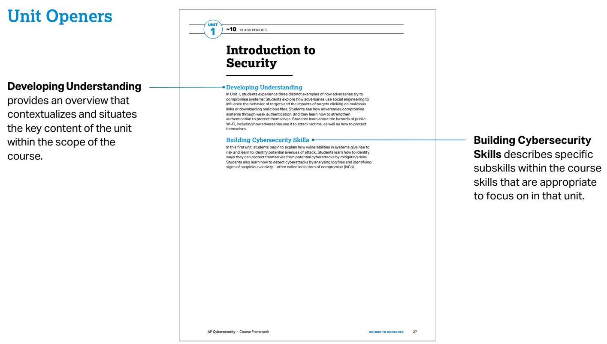

## Unit Scenarios

## Unit scenarios are

designed to connect the knowledge and skills students gain to relevant, real-world applications. They are paired with applicable student activities. Teachers may use their own scenarios in addition to, or in lieu of, the scenarios provided.


## Unit Scenarios

## Unit at a Glance

Unit at a Glance shows the topics, learning objectives, and connections to unit scenarios for each topic.

<table><tr><td>Topic</td><td>Learning Objectives</td><td>Scenario Connections</td><td>Class Periods</td></tr><tr><td>1.1 Understanding Social Engineering</td><td>1.1.A Identify common indicators of social engineering tactics.1.1.B Explain how social engineering tactics influence victims to perform a desired action.1.1.C Describe possible impacts for victims of social engineering attacks.</td><td>1A Detecting Phishing MessagesRead Scenario 1A.Reflect on the questions at the end of the scenario.</td><td>2</td></tr><tr><td>1.2 Suspicious Website Logins</td><td>1.2.A Identify common signs of a password attack.1.2.B Explain how adversaries take advantage of weak authentication.1.2.C Explain how to make authentication stronger.</td><td>1B Detecting Unauthorized LoginsRead Scenario 1B.Reflect on the questions at the end of the scenario.</td><td>2</td></tr><tr><td>1.3 Best Practices for Public Networks</td><td>1.3.A Identify the type of adversary conducting a cyberattack.1.3.B Identify types of wireless cyberattacks.1.3.C Describe actions individuals can take to increase protection of sensitive data when using the internet and Wi-Fi.</td><td>1C Impacts of Using Public Wi-FiRead Scenario 1C.Reflect on the questions at the end of the scenario.</td><td>2</td></tr><tr><td>1.4 AI-Based Cybersecurity Attacks</td><td>1.4.A Explain how adversaries use AI-powered tools to augment cyberattacks.1.4.B Explain how to protect against some AI-augmented cyberattacks.</td><td>1D AI-Powered CyberattacksRead Scenario 1D.Reflect on the questions at the end of the scenario.</td><td>2</td></tr><tr><td>1.5 Leveraging AI in Cyber Defense</td><td>1.5.A Explain how cyber defenders can leverage AI-powered tools to protect networks, applications, and data.1.5.B Explain how AI-powered tools are enabling faster and more accurate threat detection and response.</td><td>1E AI-Powered Cyber DefenseRead Scenario 1E.Reflect on the questions at the end of the scenario.</td><td>2</td></tr></table>

## Topic Pages

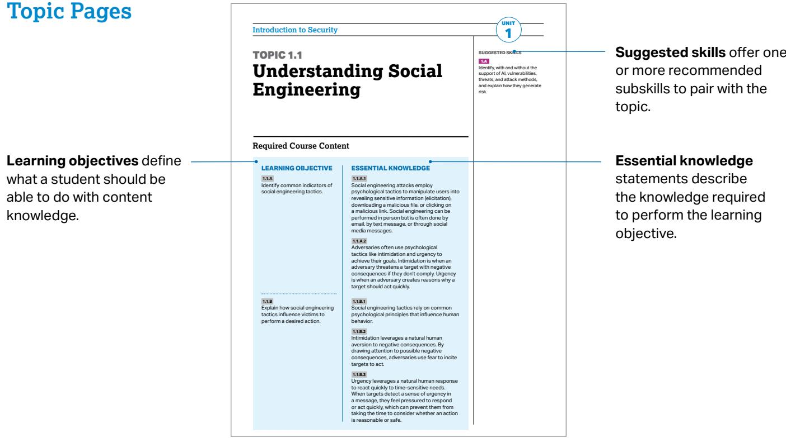

Identify common indicators of social engineering tactics.

Social engineering attacks employ psychological tactics to manipulate users into revealing sensitive information (elicitation), downloading a malicious file, or clicking on a malicious link. Social engineering can be performed in person but is often done by email, by text message, or through socia media messages.

Adversaries often use psychological tactics like intimidation and urgency to achieve their goals. Intimidation is when an adversapys threatens a taroet with pegative consequences if they don’t comply. Urgency is when an adversary creates reasons why a target should act quickly.

1.1.B Explain how social engineering tactics influence victims to perform a desired action

Social engineering tactics rely on common psychological principles that influence human behavior.

Intimidation leverages a natural human aversion to negative consequences. By drawing attention to possible negative consequences, adversaries use fear to incite targets to act

Suggested skills ofer one or more recommended subskills to pair with the topic.

statements describe the knowledge required to perform the learning objective.

## Exam Overview

## Sample multiple-choice questions serve as examples of the types of questions that may appear on the AP Exam.

## A sample free-response

question serves as an example of the type of question that may appear on the AP Exam.

## Sample Exam Questions

ƒ Model numbers of printers and the firmware versions the printers are running are visible on the internal network, revealing some information

Which of the fol owing risks would the cybersecurity analyst most likely document as a high risk?

(A) The hotel’s Wi-Fi extending to the parking area

(D) The model numbers of printers and the firmware versions the printer are running being visible

(B) Open network ports in the conference center

ƒ The tool generates an alert when suspicious or malicious trafic i detected because the hospital wants to be notified right away if an attack is attempted.

ƒ The tool does not take direct action to block or stop the trafic itself because the hospital wants administrators to decide how to respond to threats.

<table><tr><td>Rule Number</td><td>Action</td><td>Source</td><td>Destination</td><td>Direction</td><td>Port Number</td><td>Protocol</td></tr><tr><td>1</td><td>Deny</td><td>172.45.66.184</td><td>192.168.1.10</td><td>Inbound</td><td>22</td><td>SSH</td></tr><tr><td>2</td><td>Allow</td><td>ALL</td><td>192.168.1.10</td><td>Inbound</td><td>21</td><td>FTP</td></tr><tr><td>3</td><td>Allow</td><td>ALL</td><td>192.168.1.10</td><td>Inbound</td><td>80</td><td>HTTP</td></tr><tr><td>4</td><td>Allow</td><td>ALL</td><td>192.168.1.10</td><td>Inbound</td><td>445</td><td>SMB</td></tr><tr><td>5</td><td>Allow</td><td>ALL</td><td>192.168.1.10</td><td>Inbound</td><td>443</td><td>HTTPS</td></tr><tr><td>6</td><td>Allow</td><td>ALL</td><td>192.168.1.10</td><td>Inbound</td><td>22</td><td>SSH</td></tr><tr><td>7</td><td>Allow</td><td>172.45.66.184</td><td>192.168.1.10</td><td>Inbound</td><td>3306</td><td>MySQL</td></tr><tr><td>8</td><td>Allow</td><td>ALL</td><td>192.168.1.10</td><td>Inbound</td><td>3389</td><td>RDP</td></tr><tr><td>9</td><td>Allow</td><td>192.168.1.50</td><td>192.168.1.10</td><td>Inbound</td><td>5900</td><td>VNC</td></tr><tr><td>10</td><td>Deny</td><td>ALL</td><td>ALL</td><td>Inbound</td><td>ALL</td><td>ALL</td></tr></table>

AP CYBERSECURITY

# UNIT 1

# Introduction to Security


\~10 CLASS PERIODS

# Introduction to Security

## Developing Understanding

In Unit 1, students experience three distinct examples of how adversaries try to compromise systems: Students explore how adversaries use social engineering to influence the behavior of targets and the impacts of targets clicking on malicious links or downloading malicious files. Students see how adversaries compromise systems through weak authentication, and they learn how to strengthen authentication to protect themselves. Students learn about the hazards of public Wi-Fi, including how adversaries use it to attack victims, as well as how to protect themselves.

## Building Cybersecurity Skills

In this first unit, students begin to explain how vulnerabilities in systems give rise to risk and learn to identify potential avenues of attack. Students learn how to identify ways they can protect themselves from potential cyberattacks by mitigating risks. Students also learn how to detect cyberattacks by analyzing log files and identifying signs of suspicious activity—often called indicators of compromise (IoCs).

# Unit Scenarios

The scenarios for this unit are designed to connect the knowledge and skills students gain to relevant, real-world cybersecurity risks people regularly encounter. Each scenario is paired with relevant student activities. Teachers may use their own scenarios in addition to, or in lieu of, those provided here.

## SCENARIO 1A:

## Detecting Phishing Messages

You are sitting next to your teacher at their desk working on a problem when they receive the following email. Your teacher wants to click on the link in the email, but you suspect it may not be legitimate.

## The email:

To: ljones@school.edu

From: do-not-reply@g00gle.com

Subject: [Urgent!] Access Requested

One of your students has requested access to make a copy of a document. Click this link to authorize your student to copy your document.

If you don’t click the link, your student won’t be able to copy the document and complete their assignment.

Research shows that the faster teachers respond to students’ documentsharing requests, the more likely students are to submit assignments on time.

The Google Drive Team

Consider the following questions:

§ What evidence could you use to convince your teacher that this email is not legitimate?

§ What elements of the email might cause someone to act impulsively?

§ What are some potential consequences for someone who clicked the link in the email?

## SCENARIO 1B:

## Detecting Unauthorized Logins

You participate in an online game that allows users to create and manage virtual teams. One day, you discover that some of your previous choices have been modified without your knowledge. You check the account activity section, which lists each time the account was accessed. You normally log in to the website on weekends and evenings, when you’re not in school. A portion of the list of logins follows.

## Website Logins

<table><tr><td>Entry</td><td>Date/Time</td><td>Device IP Address</td></tr><tr><td>1</td><td>Saturday April 18 10:43</td><td>208.104.29.211</td></tr><tr><td>2</td><td>Sunday April 19 20:51</td><td>208.104.29.211</td></tr><tr><td>3</td><td>Tuesday April 21 18:34</td><td>208.104.29.211</td></tr><tr><td>4</td><td>Wednesday April 22 11:13</td><td>142.54.195.17</td></tr><tr><td>5</td><td>Saturday April 25 13:21</td><td>208.104.29.211</td></tr><tr><td>6</td><td>Sunday April 26 21:18</td><td>208.104.29.211</td></tr><tr><td>7</td><td>Monday April 27 10:07</td><td>142.54.195.17</td></tr><tr><td>8</td><td>Wednesday April 29 19:12</td><td>208.104.29.211</td></tr></table>

Consider the following questions:

§ What types of information does this log contain?

§ What patterns do you notice in this log?

§ What entries in the log are suspicious and why?

## SCENARIO 1C:

## Verifying Network Authenticity

You go to your neighborhood cofee shop and try to connect to the shop’s Wi-Fi network. You are redirected to a captive portal that requires you to provide some information before allowing you to access the wireless network. This captive portal has options for you to authenticate yourself by using your account credentials for popular online platforms. You select one and enter your login credentials for that platform, and you are granted access to the wireless network.

You open your streaming music service to play some music, and start studying for an upcoming test. While you are taking notes from your textbook, you notice that your music has stopped playing. When you check your streaming music service, you realize you have been logged out. When you try to log back in, the service says that your password is invalid.

You notice a sign on the wall that says “Login to our free Wi-Fi network: Sunshine Cofee Wi-Fi”, but you remember joining a network called “Guest Wi-Fi”. You accidentally joined a network set up by an adversary to trick customers.

When you logged into the “Guest Wi-Fi” network, you were redirected to a fake captive portal, set up by an adversary, where you supplied your login credentials for a popular online platform. By submitting your credentials on the adversary’s fake portal, they were able to capture your username and password. The adversary then used those credentials to log in to other services you had linked to the same platform, including your music service, and change your password. This locked you out of your account.

Consider the following questions:

§ How could you have avoided joining the malicious network in this scenario?

§ What are the benefits and hazards of using one platform to log in to multiple online services?

## SCENARIO 1D:

## AI-Powered Cyberattacks

Sitting at home one day, you receive a call from a relative who is frantic, asking questions quickly: “Are you okay? Did you get the money I sent? How did you end up in so much trouble?”

First, you calm them down and tell them you’re fine. Then you ask them to explain what they’re talking about. They say that you called them earlier from jail, claiming you had been arrested for stealing and needed bail money. They wired the money just as you instructed. You explain to them that you were never arrested, you haven’t left home all day, and you never called them. They’ve been scammed, but they insist that it was you calling them. They say it sounded exactly like you.

## What Really Happened?

You have a social media account where you post short videos of yourself. Two weeks ago, you got a friend request on that platform. The friend request came from someone with a name similar to a kid at your school. Figuring it was them, you accepted the request. That person was actually an adversary pretending to be someone from your school. The adversary was able to scrape enough samples of your voice from your social media posts to feed into an AI tool that clones voices. The adversary used social media to find your relative and called them using the voice-cloning tool pretending to be you. They created a fake story about being caught stealing, being in jail, and needing bail money wired to them.

## Consider the following questions:

§ Do you know all your online connections (on social media and gaming platforms) in real life? Do you know that they are who they claim to be?

§ Have you heard of adversaries trying to impersonate someone to get money out of a relative?

§ How could you help protect relatives from becoming a victim of a scheme like this?

## SCENARIO 1E:

## AI-Powered Cyber Defense

The company you work for is developing a new web application that will allow customers to place orders in an online system. The application automatically accesses the company’s warehouse inventory database to display current item availability to customers. When a customer purchases an item through the web portal, the application updates the database to remove the item(s) the customer purchased.

Before launching this new website, you ask an AI-powered tool to review the code and flag any potential security vulnerabilities. The AI tool flags several instances where a user input field is being fed directly into database requests as vulnerabilities. Adversaries could take advantage of those parts of the application to learn more about what is in the company’s warehouse and possibly modify the database in unintended ways.

The AI tool recommends several fixes to the code that would validate and sanitize user input before passing commands to the database. You share these recommendations with the software development team, who review the code changes and update the code with appropriate suggestions. The application is then pushed to a testing environment before being deployed.

Consider the following questions:

§ What are some potential advantages and disadvantages of using an AIpowered tool to review application code?

§ Why is it important for the development team to review the changes to the application code before implementing them?

§ Are there times when you use AI-powered tools to help you review your work?

## UNIT AT A GLANCE

<table><tr><td>Topic</td><td>Learning Objectives</td><td>Scenario Connections</td><td>Class Periods</td></tr><tr><td>1.1 Understanding Social Engineering</td><td>1.1.A Identify common indicators of social engineering tactics.1.1.B Explain how social engineering tactics influence victims to perform a desired action.1.1.C Describe possible impacts for victims of social engineering attacks.</td><td>1A Detecting Phishing MessagesRead Scenario 1A.Reflect on the questions at the end of the scenario.</td><td>2</td></tr><tr><td>1.2 Suspicious Website Logins</td><td>1.2.A Identify common signs of a password attack.1.2.B Explain how adversaries take advantage of weak authentication.1.2.C Explain how to make authentication stronger.</td><td>1B Detecting Unauthorized LoginsRead Scenario 1B.Reflect on the questions at the end of the scenario.</td><td>2</td></tr><tr><td>1.3 Best Practices for Public Networks</td><td>1.3.A Identify the type of adversary conducting a cyberattack.1.3.B Identify types of wireless cyberattacks.1.3.C Describe actions individuals can take to increase protection of sensitive data when using the internet and Wi-Fi.</td><td>1C Impacts of Using Public Wi-FiRead Scenario 1C.Reflect on the questions at the end of the scenario.</td><td>2</td></tr><tr><td>1.4 AI-Based Cybersecurity Attacks</td><td>1.4.A Explain how adversaries use AI-powered tools to augment cyberattacks.1.4.B Explain how to protect against some AI-augmented cyberattacks.</td><td>1D AI-Powered CyberattacksRead Scenario 1D.Reflect on the questions at the end of the scenario.</td><td>2</td></tr><tr><td>1.5 Leveraging AI in Cyber Defense</td><td>1.5.A Explain how cyber defenders can leverage AI-powered tools to protect networks, applications, and data.1.5.B Explain how AI-powered tools are enabling faster and more accurate threat detection and response.</td><td>1E AI-Powered Cyber DefenseRead Scenario 1E.Reflect on the questions at the end of the scenario.</td><td>2</td></tr></table>

TOPIC 1.1

# Understanding Social Engineering

## SUGGESTED SKILLS

## 1.A

Identify, with and without the support of AI, vulnerabilities, threats, and attack methods, and explain how they generate risk.

## Required Course Content

## LEARNING OBJECTIVE

## 1.1.A

Identify common indicators of social engineering tactics.

## 1.1.B

Explain how social engineering tactics influence victims to perform a desired action.

## ESSENTIAL KNOWLEDGE

## 1.1.A.1

Social engineering attacks employ psychological tactics to manipulate users into revealing sensitive information (elicitation), downloading a malicious file, or clicking on a malicious link. Social engineering can be performed in person but is often done by email, by text message, or through social media messages.

## 1.1.A.2

Adversaries often use psychological tactics like intimidation and urgency to achieve their goals. Intimidation is when an adversary threatens a target with negative consequences if they don’t comply. Urgency is when an adversary creates reasons why a target should act quickly.

## 1.1.B.1

Social engineering tactics rely on common psychological principles that influence human behavior.

## 1.1.B.2

Intimidation leverages a natural human aversion to negative consequences. By drawing attention to possible negative consequences, adversaries use fear to incite targets to act.

## 1.1.B.3

Urgency leverages a natural human response to react quickly to time-sensitive needs. When targets detect a sense of urgency in a message, they feel pressured to respond or act quickly, which can prevent them from taking the time to consider whether an action is reasonable or safe.

## 1.1.C

Describe possible impacts for victims of social engineering attacks.

## 1.1.C.1

Victims may give an adversary personal information that could lead to impersonation, such as name, phone number, address, workplace, pets’ names, or birthdate. These types of information, and information like them, are often used on websites as challenge questions to verify a user’s identity.

## 1.1.C.2

Victims may give an adversary secure information like a one-time password (OTP) or authentication login code, which could allow an adversary to log in to a service as the victim.

## 1.1.C.3

Victims may download malware or click a link that that installs malware on their device, steals information from their web browser, or directs them to a website where their login credentials can be captured by an adversary.

TOPIC 1.2

# Suspicious Website Logins

## SUGGESTED SKILLS

## 1.A

Identify, with and without the support of AI, vulnerabilities, threats, and attack methods, and explain how they generate risk.

## 2.A

Identify security controls, and explain how they mitigate risks.

## Required Course Content

## LEARNING OBJECTIVE

## 1.2.A

Identify common signs of a password attack.

## 1.2.B

Explain how adversaries take advantage of weak authentication.

## ESSENTIAL KNOWLEDGE

## 1.2.A.1

In an online password attack, adversaries try logging in to a device or service using common passwords, common password patterns, or stolen passwords.

## 1.2.A.2

Signs of an online password attack include:

§ Many failed attempts to log in over a short duration

§ Login attempts at unusual times

§ Login attempts from unknown devices

## 1.2.B.1

Many people use common patterns when creating passwords, such as:

Starting a password with one or two words, adding a two-digit number (often signifying a year), and putting a special character at the end

Including the names of family or pets in their passwords

§ Including personally significant dates in their passwords

## 1.2.B.2

Adversaries often construct a dictionary of possible passwords based on personal information gathered about a target (e.g., birthday, anniversary, names of pets and family) and use an automated tool to submit potential passwords.

## 1.2.C

Explain how to make authentication stronger.

## 1.2.C.1

Users should create passwords that are long, random, and unique. A password manager can be used to generate and store strong passwords, or a user may create long, unique passphrases for their accounts.

## 1.2.C.2

When creating passwords, users should avoid names, dates, or other personally meaningful words or numbers.

## 1.2.C.3

When available, users should enable multifactor authentication (MFA), which will require the user to provide extra proof of identity—such as a one-time code—in addition to the password as an extra layer of security.

TOPIC 1.3

# Best Practices for Public Networks

## SUGGESTED SKILLS

## 1.A

Identify, with and without the support of AI, vulnerabilities, threats, and attack methods, and explain how they generate risk.

## 2.A

Identify security controls, and explain how they mitigate risks.

## Required Course Content

## LEARNING OBJECTIVE

## 1.3.A

Identify the type of adversary conducting a cyberattack.

## ESSENTIAL KNOWLEDGE

## 1.3.A.1

Adversaries can be classified by their skill levels.

Low-skilled adversaries rely on malicious cyber tools created by others that can be purchased online. The tools they use exploit known vulnerabilities.

High-skilled adversaries have the capacity to create new malicious cyber tools or modify existing ones to adapt to new defensive techniques and tools. They also have the capacity to discover undocumented vulnerabilities, known as zero days.

## 1.3.A.2

Adversaries have a variety of motivations, including greed, desire for recognition, dedication to a cause, revenge, politics, or beliefs.

## 1.3.B Identify types of wireless cyberattacks.

## 1.3.B.1

In an evil twin attack, an adversary sets up their own wireless access point (WAP) with a service set identifier (SSID) similar or identical to a target network; the adversary’s network is called the evil twin. Victims of this attack could select to unknowingly connect to the evil twin, allowing the adversary to capture their network trafic. The adversary cannot read trafic that uses an encrypted protocol like HTTPS.

## 1.3.B

Identify types of wireless cyberattacks.

## 1.3.C

Describe actions individuals can take to increase protection of sensitive data when using the internet and Wi-Fi.

## 1.3.B.2

In a jamming attack, an adversary floods an area with a strong electromagnetic (EM) signal in the same frequency range as the wireless network, which prevents legitimate trafic between the access point (AP) and users. This type of attack that prevents users from accessing resources is called a denial of service (DoS) attack.

## 1.3.B.3

In a war driving attack, adversaries try to detect wireless network beacons while driving or walking around a target. If a wireless signal is detected, the adversary can gather information about the type of wireless network used and find areas where the wireless signal extends outside the physical building.

## 1.3.C.1

Individuals should verify that the name of any wireless network they join exactly matches the name of the network they intend to join.

## 1.3.C.2

Most internet protocols are encrypted to protect network trafic. However, individuals may consider the sensitivity of their data in choosing whether to join unencrypted Wi-Fi networks to protect vulnerable data such as DNS queries.

## 1.3.C.3

Individuals may consider using a virtual private network (VPN), which encrypts all their trafic to the VPN operator’s system. Although this action prevents a service provider from viewing trafic, the VPN provider can view the trafic.

TOPIC 1.4

# AI-Based Cybersecurity Attacks

## SUGGESTED SKILLS

## 1.A

Identify, with and without the support of AI, vulnerabilities, threats, and attack methods, and explain how they generate risk.

## 2.A

Identify security controls, and explain how they mitigate risks.

## Required Course Content

## LEARNING OBJECTIVE

## 1.4.A

Explain how adversaries use AI-powered tools to augment cyberattacks.

## ESSENTIAL KNOWLEDGE

## 1.4.A.1

Adversaries can use AI-powered tools that leverage existing voice and image samples of a person to create a digital avatar of that person. The use of these technologies enables adversaries to impersonate someone over the phone or even on a video call, which can lead to financial loss or the sharing of sensitive or private information. As more organizations adopt voice-based authentication, the impact of voice-impersonation has a larger potential impact.

## 1.4.A.2

Adversaries can use generative AI tools, like large language models (LLMs), to create convincing phishing messages in any target language. Because traditional phishing messages are sometimes written by nonnative speakers of the target’s language, unnatural language is a feature that has been used to distinguish phishing messages from legitimate messages. However, with AI tools, adversaries can now craft phishing messages in any language that read as though they were written by a native speaker.

## 1.4.A.3

Adversaries can craft prompts that extract secure or sensitive information from LLMs. Secure or sensitive information in LLMs can come from user input and the large data sets used to train LLMs.

## 1.4.A

Explain how adversaries use AI-powered tools to augment cyberattacks.

## 1.4.B

Explain how to protect against some AI-augmented cyberattacks.

## 1.4.A.4

Adversaries can publish websites or modify existing websites to contain false information so that the false information will be included in the training sets for LLMs, causing the LLMs to repeat the false information.

## 1.4.A.5

Adversaries can perform reconnaissance on a target using AI-powered tools that scan the internet to gather information posted on social media and public websites.

## 1.4.A.6

Adversaries can use AI-enhanced coding tools to help them write new malware, modify existing application code to perform malicious activities, or to find vulnerabilities in large code bases.

## 1.4.B.1

Shared secrets with close friends and relatives that can be used to verify each other’s identities should be established. A secret word or phrase known only to two parties can be used to authenticate identities in high-stakes situations.

## 1.4.B.2

Multifactor authentication (MFA) should be enabled. If an adversary clones a target’s voice to access a system with voice authentication, requiring a second authentication factor could prevent an adversary from gaining access to accounts.

## 1.4.B.3

Personal or sensitive data should not be entered into any AI-powered tools, such as chatbots or virtual assistants. Some AIpowered tools feed user input back into the model to provide continuous training. Adversaries could extract data that users have included in prompts.

## 1.4.B.4

Output from AI-powered tools should be carefully evaluated. Verify information from AI-powered tools using reputable, stable, non-AI-based sources.

TOPIC 1.5

# Leveraging AI in Cyber Defense

## SUGGESTED SKILLS

## 2.A

Identify security controls, and explain how they mitigate risks.

## 3.A

Identify methods for monitoring systems, and explain how they detect attacks.

## Required Course Content

## LEARNING OBJECTIVE

## 1.5.A

Explain how cyber defenders can leverage AI-powered tools to protect networks, applications, and data.

## 1.5.B

Explain how AI-powered tools are enabling faster and more accurate threat detection and response.

## ESSENTIAL KNOWLEDGE

## 1.5.A.1

AI tools can review current security configurations, like firewall rules and access controls, and recommend more secure options. Recommendations should always be checked by a knowledgeable security technician before being implemented.

## 1.5.A.2

AI-powered tools can analyze application code to identify vulnerabilities and recommend mitigations. Recommendations should always be reviewed by a knowledgeable programmer before being implemented.

## 1.5.A.3

AI-powered tools can suggest rules for automated detection systems. Detection rules should always be reviewed by a knowledgeable detection engineer before being added to a system.

## 1.5.B.1

Of the millions of digital events that happen on networks daily, some likely represent an adversary conducting malicious activity. Humans cannot carefully examine all those events to identify the malicious activity.

## 1.5.B.2

AI-powered tools can be trained to quickly analyze digital events and sort the events that are likely malicious activity from those that are harmless.

## 1.5.B

Explain how AI-powered tools are enabling faster and more accurate threat detection and response.

## 1.5.B.3

AI-powered tools can be programmed to alert human cybersecurity personnel when likely malicious activity is detected or to take specific corrective actions based on the type of malicious activity detected.

## 1.5.B.4

AI-powered tools enable threat-detection and response teams to catch malicious activity and intervene quickly to prevent loss, harm, damage, and destruction to digital infrastructure and data.

AP CYBERSECURITY

## UNIT 2 Securing Spaces


\~21 CLASS PERIODS

## Securing Spaces

## Developing Understanding

In this unit, students focus on securing a physical location. Adversaries that can gain physical access to a device are often able to bypass many of the technical controls that protect the device and the data on it. Thus, securing the physical space is a critical first layer of defense and a concrete way for students to develop adversarial thinking skills and begin to identify vulnerabilities, threats, attacks, and mitigations. Students consider how physical spaces might be breached by adversaries, how to detect physical breaches, how to select devices to prevent or deter an adversary, and how to place those devices to maximize their usefulness.

## Building Cybersecurity Skills

This unit focuses on an aspect of security that is concrete and is present in students everyday lives. By leveraging the fact that students move through diferent spaces (e.g., their home, the school building, a bank) that are secured in a variety of ways, teachers can connect the concepts of vulnerabilities, threats, and risk to students experiences. Students begin assessing and managing risk in this familiar domain while they practice selecting security controls based on the principles from Unit 1. Finally, students consider how to select controls to detect physical breaches and evaluate the impact of those controls.

# Unit Scenario

The scenario for this unit is designed to connect the knowledge and skills students gain to realistic workplace tasks. The scenario is paired with relevant student activities. Teachers may use their own scenarios in addition to, or in lieu of, the one provided here.

## SCENARIO 2A:

## Securing Xtensr Labs

You work on the physical security team at Xtensr Research Labs. Xtensr is buying a smaller research company in the same town to expand their operations. You have been tasked with conducting a physical vulnerability assessment of the new lab.

You will:

§ Review the building plans and current security controls for this new lab and identify physical vulnerabilities

§ Assess the risk from the vulnerabilities identified

§ Recommend physical security controls to mitigate these vulnerabilities

§ Recommend the placement of monitoring equipment to detect physical security breaches

## UNIT AT A G CLAN E

<table><tr><td>Topic</td><td>Learning Objectives</td><td>Scenario Connections</td><td>Class Periods</td></tr><tr><td>2.1 Cyber Foundations</td><td>2.1.A Identify social engineering attacks.2.1.B Identify types of adversaries.2.1.C Describe the phases of a cyberattack.2.1.D Describe the risk assessment process.2.1.E Identify strategies for managing risk.2.1.F Identify types of security controls.2.1.G Explain why a defense-in-depth security strategy is necessary to optimally protect an organization.</td><td></td><td>8</td></tr><tr><td>2.2 Physical Vulnerabilities and Attacks</td><td>2.2.A Identify common physical attacks.2.2.B Explain how threats can exploit common physical vulnerabilities to cause loss, damage, disruption, or destruction to assets.2.2.C Assess and document risks from physical vulnerabilities.</td><td>2A Securing Xtensr LabsReview physical plans to identify physical vulnerabilities.Assess the risk from the vulnerabilities identified.</td><td>5</td></tr><tr><td>2.3 Protecting Physical Spaces</td><td>2.3.A Identify managerial controls related to physical security.2.3.B Determine mitigation strategies for risks from physical vulnerabilities.</td><td>2A Securing Xtensr LabsRecommend physical security controls to mitigate the risks identified in Topic 2.2.</td><td>4</td></tr><tr><td>2.4 Detecting Physical Attacks</td><td>2.4.A Identify ways security controls can detect physical attacks.2.4.B Determine effective placement of security controls for detecting physical attacks.2.4.C Apply detection techniques to identify physical attacks.</td><td>2A Securing Xtensr LabsRecommend the placement of monitoring equipment for detecting physical security breaches.</td><td>4</td></tr></table>

## SUGGESTED SKILLS

## 1.A

Identify, with and without the support of AI, vulnerabilities, threats, and attack methods, and explain how they generate risk.

# Cyber Foundations

## 2.A

Identify security controls, and explain how they mitigate risks.

TOPIC 2.1

## Required Course Content

## LEARNING OBJECTIVE

2.1.A Identify social engineering attacks.

## ESSENTIAL KNOWLEDGE

## 2.1.A.1

Social engineers use psychological tactics to manipulate targets into taking a desired action.

## 2.1.A.2

Pretexting is when adversaries create a believable reason to contact a target.

## 2.1.A.3

Authority is when adversaries impersonate someone with power over a target or pretend to relay instructions from that person.

## 2.1.A.4

Intimidation is when adversaries state negative consequences if demands aren’t met.

## 2.1.A.5

Consensus is when adversaries create social pressure by making a target believe everyone else is doing a desired action.

## 2.1.A.6

Scarcity is when adversaries create a sense of limited availability.

## 2.1.A.7

Familiarity is when adversaries pretend to be or know someone close to a target to establish trust.

## 2.1.A.8

Urgency is when adversaries create a deadline that requires quick action by a target to avert negative consequences.

## 2.1.B

Identify types of adversaries.

## 2.1.B.1

Script kiddies are low-skilled adversaries who use tools developed by others without understanding how the tools work. They are often motivated by greed or a desire for recognition.

## 2.1.B.2

Hacktivists are motivated by social, political, or personal causes. They compromise computers and networks to support their cause or stop perceived harm, believing their goals justify their illegal methods.

## 2.1.B.3

Insider adversaries are unique threats because they have legitimate credentials and access to systems and data. They can be recruited by malicious third parties and can be motivated by greed or revenge.

## 2.1.B.4

Cyberterrorists are motivated by politics or beliefs and seek to disrupt entire communities, regions, or nations through cyberattacks (e.g., attacking a power grid, water treatment plant, or other civil infrastructure). They can act independently or on behalf of governments or criminal organizations.

## 2.1.B.5

Transnational criminal organizations seek financial gain primarily by deploying ransomware and stealing corporate intellectual property (IP) to sell in illegal markets.

## 2.1.C

Describe the phases of a cyberattack.

## 2.1.C.1

Cyberattacks aim to disrupt, harm, steal, or destroy devices, networks, or data. Adversaries work in phases, which may not all be used in every attack. The phases are:

i. Reconnaissance

ii. Initial access

iii. Persistence

iv. Lateral movement

v. Taking action

vi. Evading detection

## 2.1.C.2

In the reconnaissance phase of an attack, adversaries gather as much information as possible about their target, often using open source intelligence (OSINT), which is freely available information.

## 2.1.C

Describe the phases of a cyberattack.

## 2.1.D

Describe the risk assessment process.

## 2.1.C.3

In the initial-access phase of an attack, adversaries establish a foothold on the target’s computer, often through social engineering or compromised or weak credentials.

## 2.1.C.4

After gaining access during an attack, adversaries establish persistence to maintain access without needing to regain it. They may use a command and control (C2) protocol to send commands to the device and receive output, often through malware like a remote access trojan (RAT) or rootkit.

## 2.1.C.5

In the lateral-movement phase of an attack, adversaries try to escalate their privileges by accessing computers and user accounts with elevated permissions to services and data.

## 2.1.C.6

In the taking-action phase of an attack, adversaries act on their objectives by collecting targeted data, exfiltrating it, and disrupting services or destroying data.

## 2.1.C.7

In the final phase of an attack, many adversaries try to evade detection by removing or editing log files and erasing other files they may have planted on devices (e.g., malware).

## 2.1.D.1

Risk occurs when a threat can exploit a vulnerability to compromise an asset.

## 2.1.D.2

An asset is anything valuable. Assets include financial resources, intellectual property, data, digital infrastructure, physical property, and reputation.

## 2.1.D.3

Risk assessment considers two factors:

§ The likelihood of an attack against a specific vulnerability

§ The severity of the projected damage from an attack against a specific vulnerability

## 2.1.D

Describe the risk assessment process.

## 2.1.D.4

The likelihood of a vulnerability being exploited depends on many factors, including:

The value of the target: Adversaries are more likely to attack targets they perceive as valuable.

The level of skill required to exploit the vulnerability (i.e., the dificulty): Vulnerabilities with well-documented exploits often require less skill and can be carried out by more adversaries.

The motivation and capabilities of likely adversaries: Highly motivated and skilled adversaries are more likely to be able to perform more complex exploits.

## 2.1.D.5

The severity of an attack is often measured by financial cost, which can also include reputational and operational impacts.

## ILLUSTRATIVE EXAMPLE

A hacktivist is passionate about illegal fishing practices supported by a local food production company. The main webpage of this food production company would be a high-value target for this hacktivist; defacing the webpage to expose the company’s support of illegal fishing would provide no financial gain to the adversary, but would allow them to raise awareness about an issue that motivates them.

## 2.1.D.6

The result of a risk assessment can be quantitative or qualitative.

Quantitative risk assessment assigns a numeric value to a vulnerability based on a numeric scale (e.g., 1–10) or quantifiable impact, which could be financial (e.g., a \$10,000 annual risk).

## ILLUSTRATIVE EXAMPLES

§ Low, medium, high, severe

§ Unlikely low impact, likely low impact, unlikely high impact, likely high impact

## 2.1.D.7

Risk assessment documentation should include:

§ Vulnerable assets and their value

§ Descriptions of likely threats to the assets

Details of specific vulnerabilities for specific assets and how they would be exploited

## 2.1.D

Describe the risk assessment process.

## 2.1.E

Identify strategies for managing risk.

An explanation of the severity of damage (financial, operational, reputational, etc.) if a specific asset were compromised, and the likelihood of that compromise occurring

A final rating, quantitative or qualitative, for each risk identified

## ILLUSTRATIVE EXAMPLES

§ Scaled score (e.g., 1–10)

§ Monetary value (e.g., a \$10,000 risk vs. a \$100,000 risk)

## 2.1.E.1

Once a risk has been identified and assessed, an organization has four options for managing that risk:

i. Avoid

ii. Transfer

iii. Mitigate

iv. Accept

## 2.1.E.2

Risk avoidance stops the activity that is generating the risk. If the activity is a critical part of an organization’s mission or purpose, then avoidance is not possible.

## 2.1.E.3

Risk transference places the burden of the risk on another entity, such as an insurance company, a government, or consumers.

## 2.1.E.4

Risk mitigation implements security controls to reduce the likelihood or impact of a risk.

## 2.1.E.5

Residual risk is the risk that remains after an organization has gone through avoidance, transference, and mitigation. The residual risk is the level of risk that an organization is willing to accept. Risk acceptance acknowledges the fact that absolute security is unattainable.

## 2.1.E.6

To conserve financial resources and employee capacity, an organization will often favor solutions that are cost efective and easy to implement and maintain. Cost-efective solutions cost less to install and maintain than the expected loss from an attack.

## 2.1.F

## Identify types of security controls.

## 2.1.F.1

Security controls address at least one of the following principles:

Confidentiality ensures that only authorized individuals, systems, or processes can access data. Systems lacking confidentiality are vulnerable to data theft or destruction.

Integrity ensures data are accurate and trustworthy. Systems lacking integrity are vulnerable to data manipulation.

Availability ensures data and services are accessible to authorized individuals when needed. Systems lacking availability may experience unexpected downtime.

## 2.1.F.2

Security controls can be classified by type.

Physical controls provide security in the physical space and include locks, fences, and cameras, bollards, and security guards.

Technical controls provide security in the digital space and include firewalls, antimalware software, and encryption.

Managerial controls provide rules, guidelines, policies, and procedures that specify what security should be in place and include password policies, regular access reviews, and incident response plans (IRPs).

## 2.1.F.3

Security controls can be classified by function.

Preventative controls address potential vulnerabilities with the goal of stopping an adversary from attacking and include locks and encryption.

Detective controls help identify attacks when they occur and include intrusion detection systems (IDSs), cameras, and security incident and event management (SIEM) systems.

Corrective controls fix problems and help restore systems to an operational state and include vulnerability patching, repairing a broken card reader, and intrusion prevention systems (IPSs).

## 2.1.G

Explain why a defense-indepth security strategy is necessary to optimally protect an organization.

## 2.1.G.1

A defense-in-depth strategy, or layered defense, uses multiple types of security controls to protect sensitive data and systems.

## 2.1.G.2

A defense-in-depth strategy allows an organization to address diferent types of threats, each with a security control most suited to mitigate it.

## 2.1.G.3

A defense-in-depth strategy allows for resilience in data protection so when one security control is bypassed by an adversary, another security control may still prevent access to the data or system or limit the damage done to the data or system.

## 2.1.G.4

Layers in a defense-in-depth strategy can include human, physical, network, device, application, and data.

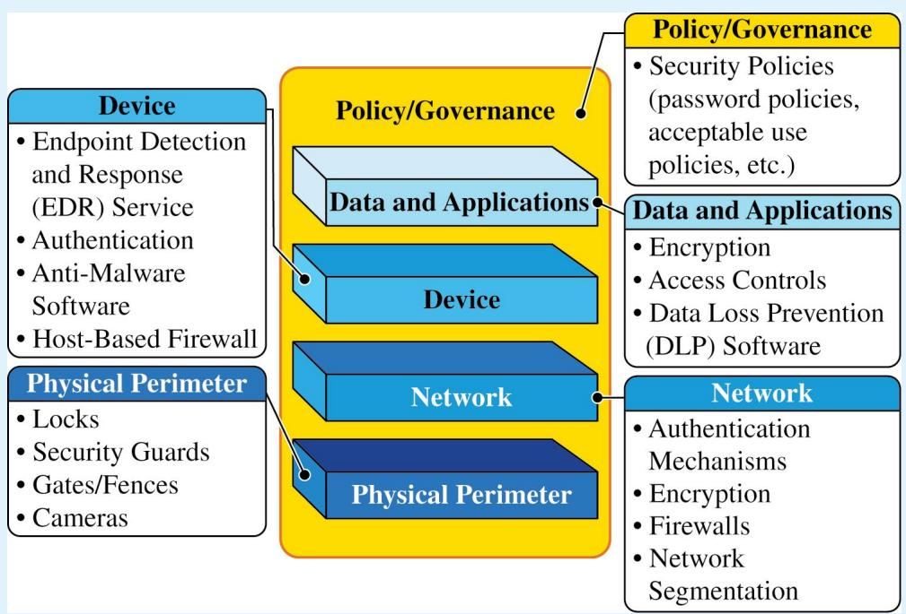

## FIGURE 2.1: Defense in Depth

Defense in depth is a layered security strategy that implements protections and deterrence at different levels to make it more challenging for adversaries to compromise a computer, network, or data.

SUGGESTED SKILLS

1.C

Evaluate, with and without the support of AI, the likelihood and impact of risks.

## 1.D

Document, with and without the support of AI, the likelihood and impact of risks.

TOPIC 2.2

# Physical Vulnerabilities and Attacks

Required Course Content

## LEARNING OBJECTIVE

2.2.A

Identify common physical attacks.

## ESSENTIAL KNOWLEDGE

## 2.2.A.1

Adversaries often use social engineering when conducting a physical attack.

## 2.2.A.2

Piggybacking is the name for an attack where an adversary uses social engineering to manipulate an authorized individual to grant the adversary access to a restricted area. Common piggybacking tactics include carrying something large to entice an authorized person to hold the door open, pretending to be an authorized person who has forgotten their access token, or pretending to be a maintenance person who needs to get into a certain area to perform an inspection or repair.

## 2.2.A.3

Tailgating is the name for an attack where an adversary gains unauthorized access to a restricted area by following close behind an authorized individual without that individual’s awareness or knowledge.

## 2.2.A.4

Shoulder surfing is the name for an attack where an adversary watches as a user accesses sensitive information so the adversary can use it later. Sometimes adversaries use a camera to record the target accessing the sensitive information for later analysis.

## 2.2.A.5

Dumpster diving is the name for an attack where an adversary goes through a target’s physical trash to look for information that could be used to help the adversary reach their goal.

## 2.2.A

Identify common physical attacks.

## 2.2.B

Explain how threats can exploit common physical vulnerabilities to cause loss, damage, disruption, or destruction to assets.

## 2.2.A.6

Card cloning is the name for an attack where an adversary makes a copy of an authorized user’s access card so they can gain access to all the resources the user is authorized to access.

## 2.2.B.1

Threats include human adversaries seeking to cause harm or disruption as well as natural disasters. Natural disasters can cause physical damage or destruction to computers and data as well as disruption of digital services provided by computers.

## 2.2.B.2

Vulnerabilities are weaknesses or flaws that could allow an asset to be compromised. Common compromises include:

Unauthorized access to sensitive data or restricted physical spaces

§ Disruption of services

§ Theft or destruction of digital or physical resources

§ Unauthorized modification of data

## 2.2.B.3

When adversaries disrupt power to a device, the device and any services it provides become unavailable. To disrupt power, adversaries may damage fuses or breakers in an electrical box, unplug or cut electrical wiring, or damage power distribution systems like substations and transformers.

## 2.2.B.4

When adversaries gain access to an area with sensitive information, they can steal or copy sensitive information.

## 2.2.B.5

When adversaries gain physical access to a device and its ports, they can plug in a keylogger or external drive containing malware, which could allow them to collect data from a user or possibly even to gain control of the device. With direct physical access adversaries can also physically destroy a device, making the device itself, any data stored on it, and any services it provides unavailable.

## 2.2.C

Assess and document risks from physical vulnerabilities.

## 2.2.C.1

Physical access to devices can allow adversaries to bypass many technical controls and layers of security.

## 2.2.C.2

High risks from physical vulnerabilities arise when sensitive information or systems are exposed in physical spaces without suficiently restricted and controlled access.

## ILLUSTRATIVE EXAMPLE

A server that stores customer data is in a room with no lock which is accessed via an unmonitored hallway.

## 2.2.C.3

Moderate risks from physical vulnerabilities arise when a noncritical or nonsensitive part of an organization is left unprotected in a way that it could act as a foothold for an adversary to gain initial access to other resources.

## ILLUSTRATIVE EXAMPLE

An ofice has a reception area beyond which access is controlled; the receptionist has a computer that connects to the ofice’s internal wireless network and the computer has exposed USB ports.

## 2.2.C.4

Low risks from physical vulnerabilities arise when a vulnerable asset is of low value and the vulnerability is unlikely to be exploited.

## ILLUSTRATIVE EXAMPLE

Employees in an ofice that requires badge access have laptop computers that they leave on their desks unattended when they all go to lunch together. The computers do not contain any sensitive information, but there are no cables securing the devices to the desks.

TOPIC 2.3

# Protecting Physical Spaces

SUGGESTED SKILLS

2.A

Identify security controls, and explain how they mitigate risks.

2.B

Determine layered security

controls that address

vulnerabilities.

## Required Course Content

## LEARNING OBJECTIVE

2.3.A

Identify managerial controls

related to physical security.

## ESSENTIAL KNOWLEDGE

## 2.3.A.1

Organizations should conduct employee security awareness training to educate employees about how they can contribute to the organization’s security by:

§ Detecting social engineering attempts like phishing

Not badging other people into restricted areas

§ Preventing device theft

## 2.3.A.2

Organizations should have a workstation security policy that outlines the measures necessary to protect a physical workplace. The policy may have tiers of workstation security based on the type of data handled at a workstation. Workstation policies often require:

Locking devices before leaving workstations unattended to prevent unauthorized access

Clearing sensitive documents of workstations before leaving them unattended (sometimes called a clean desk policy)

Using a privacy screen filter or other physical barrier to prevent others from viewing information on the screen

§ Connecting devices to surge protectors or uninterruptible power supplies (UPS)

## 2.3.B

Determine mitigation strategies for risks from physical vulnerabilities.

## 2.3.B.1

To determine a relevant control, a cyber defender considers how an adversary could take advantage of a vulnerability to attack a system and how to prevent, detect, or correct the attack.

## 2.3.B.2

Installing physical controls like fencing, gates, and bollards around a building can deter adversaries from trying to physically access an organization’s buildings.

## 2.3.B.3

Locks on doors, server cabinets, and computers can prevent devices from being accessed or stolen.

## 2.3.B.4

Card readers can record which employee badges are being used to access diferent entries at specific times and deny access to unauthorized badges.

## 2.3.B.5

Access control vestibules and turnstiles can prevent an authorized person from intentionally or accidentally admitting an unauthorized person into a restricted area.

## 2.3.B.6

Organizations can disable USB ports to prevent external drives from loading malware onto a computer.

## 2.3.B.7

An uninterruptible power supply (UPS) provides a backup power source for a device in the event of a power outage. Organizations can also use power generators to provide power at a larger scale to a building or set of critical devices.

## 2.3.B.8

Organizations prioritize risk mitigations based on the severity of the risks and the cost of the recommended mitigations.

TOPIC 2.4

# Detecting Physical Attacks

## SUGGESTED SKILLS

## 3.A

Identify methods for monitoring systems, and explain how they detect attacks.

## 3.B

Determine strategies and methods to detect attacks.

## Required Course Content

## LEARNING OBJECTIVE

## 2.4.A

Identify ways security controls can detect physical attacks.

## ESSENTIAL KNOWLEDGE

## 2.4.B

## 2.4.A.1

Determine efective placement of security controls for detecting physical attacks.

Cameras can capture a visual record of an adversary’s malicious activity. The feed from a camera should be recorded and monitored for maximum efect. Recordings can be especially helpful in after-incident investigations.

## 2.4.A.2

Security guards can monitor activity in an area and respond to suspicious activity once detected.

Motion sensors can alert security to movement in an area.

## 2.4.A.3

Employees that work in a physical space are often the first to notice the presence of an unauthorized person and can alert security.

## 2.4.A.4

## 2.4.B.1

When placing cameras, consideration should be given to visual coverage, angle, and the ability to be tampered with by an adversary. Consideration should also be given to what a camera in a specific area could capture an adversary doing and how that information would be helpful. Points of ingress and egress are often monitored by camera.

## 2.4.B.2

Motion sensors should be placed in areas where trafic is unexpected, like server rooms, or areas where sensitive materials are stored and few people have access. Motion sensors in high-trafic areas create many false alarms, making the alarms less likely to be taken seriously when there is a real security event.

## 2.4.B

Determine efective placement of security controls for detecting physical attacks

## 2.4.C

Apply detection techniques to identify physical attacks.

## 2.4.B.3

Locks should be placed on all entries to areas containing sensitive information or systems. For areas with particularly sensitive information or systems, an organization could use an access control vestibule at the entry point to prevent piggybacking or tailgating.

## 2.4.B.4

Security guards can be stationary or patrolling. Stationary guards can provide constant protection for a specific area, entrance, or high-value item. Patrolling guards are more dificult for an adversary to plan around and can create time pressure for an adversary. Placing stationary guards at places that funnel trafic (e.g., entry gates, main entrances or lobbies, and entrances to more secure access areas) can be highly efective, while patrolling guards are better suited for perimeters and exterior areas.

## 2.4.C.1

Cameras provide visual monitoring and a visual record of activity within a designated space. Cameras can be paired with facial recognition software that can provide alerts when unauthorized individuals enter controlled areas. Once a physical breach has been detected, defenders can use live and recorded camera footage to track an adversary’s path and actions.

## 2.4.C.2

Motion detectors work best when paired with cameras. When a security alert is raised because a motion detector has been activated, defenders can use cameras to check the space visually and verify a physical security breach.

## 2.4.C.3

When employees are required to use an electronic badge to unlock a door to a restricted area, a sensor can record how long the door was open. In reviewing entry logs for the door, potential piggybacking or tailgating can be detected by doors being open for longer than normal lengths of time.

AP CYBERSECURITY

# UNIT 3

# Securing Networks


\~26 CLASS PERIODS

# Securing Networks

## Developing Understanding

Most digital devices are connected to other devices through a computer network. The transmission of data between devices creates new opportunities for adversaries, so defenders must think carefully about how networks are designed and how data is protected while in transit. In this unit, students learn about common network attacks and how to protect against them. Students study the benefits of network segmentation and learn how to place and configure firewalls to manage network trafic. They also learn how to analyze network log files to find possible indicators of compromise (IoCs).

## Building Cybersecurity Skills

In Unit 3, students learn to apply their risk assessment skills in the domain of networking, identifying vulnerabilities and evaluating the likelihood and impact of a vulnerability being exploited to determine the risk. Students learn how to apply security controls to a network to help prevent and deter adversaries, and how to collect and analyze network data to detect attacks. Students also learn how automated tools, including AI, enable faster, more eficient detection of malicious activity on networks.

# Unit Scenarios

The scenarios for this unit are designed to connect the knowledge and skills students gain to realistic workplace tasks. The scenarios are paired with relevant student activities. Teachers may use their own scenarios in addition to, or in lieu of, those provided here.

## SCENARIO 3A:

## Protecting Patient Medical Data

You are a network security engineer at Adams County Hospital. Adams County Hospital maintains public servers that run a web application for patients to book appointments and pay bills and an internal file server that stores patient records (see network diagram). You need to determine the best placement for two new firewalls to protect these servers and then configure the servers to meet a set of specifications.

You will:

§ Review the building plans and current security controls for this new lab and identify physical vulnerabilities

§ Assess the risk from the vulnerabilities identified

§ Recommend physical security controls to mitigate these vulnerabilities

§ Recommend the placement of monitoring equipment to detect physical security breaches

## SCENARIO 3B:

## Configuring a Secure Wireless Network

In the aftermath of a natural disaster, as a network technician in the National Guard, you have been called up and asked to set up a secure wireless network at the local high school gymnasium, which has been converted to an emergency shelter, so that those who lost their homes in the disaster can have access to the internet to communicate with family and friends.

There is a satellite link that will provide the access to the internet. Your task is to determine the security features necessary to ensure that the network is safe to use. Your plan should include measures to detect possible malicious activity on the network that would compromise security or performance.

## You will:

§ Describe configurations to secure the wireless network

§ Recommend a collection of detective controls to monitor the network and raise an alert for any potential malicious activity

§ Describe the impact of the detective control recommendations

## SCENARIO 3C:

## Protecting a Network on a Naval Submarine

Submarines are a critical component in a modern navy. Modern submarines have sophisticated control mechanisms that are run by computers that communicate via a secure network. You are a network technician on a naval submarine, and you manage three LANs:

§ A dedicated LAN for the weapons systems

§ A secure LAN for oficial naval operations

§ A LAN for crew to use for recreation

You will consider the various levels of security needed for each of these LANs and how best to protect each one. Then you will:

§ Recommend security features for each LAN

§ Use a diagram to demonstrate the recommended security features

## UNIT AT A GLANCE

<table><tr><td>Topic</td><td>Learning Objectives</td><td>Scenario Connections</td><td>Class Periods</td></tr><tr><td>3.1 Network Vulnerabilities and Attacks</td><td>3.1.A Identify common network attacks.3.1.B Explain how adversaries can exploit network vulnerabilities to steal, disrupt, or destroy network communication.3.1.C Assess and document risks from network vulnerabilities.</td><td>3A Protecting Patient Medical DataAnalyze the current network architecture and determine network vulnerabilities.</td><td>6</td></tr><tr><td>3.2 Protecting Networks: Managerial Controls and Wireless Security</td><td>3.2.A Identify managerial controls related to network security.3.2.B Configure wireless network security features.</td><td>3B Configuring a Secure Wireless NetworkDescribe configurations to secure the wireless network.</td><td>3</td></tr><tr><td>3.3 Protecting Networks: Segmentation</td><td>3.3.A Identify techniques for segmenting a network.3.3.B Explain why network segmentation can increase network security.</td><td>3C Protecting a Network on a Naval Submarine Recommend security features for each LAN.Use a diagram to demonstrate the recommended security features.</td><td>2</td></tr><tr><td>3.4 Protecting Networks: Firewalls</td><td>3.4.A Identify types of network-based firewalls.3.4.B Explain how a firewall uses an access control list to allow or deny traffic entering or leaving a network.3.4.C Determine the effective placement of firewalls in a network.3.4.D Configure a firewall to manage the flow of network traffic.</td><td>3A Protecting Patient Medical DataDetermine the type and placement of Firewalls A and B within the existing network.Configure Firewall A so that external traffic can securely communicate with the web server while blocking other types of nonrelevant, potentially malicious traffic.Configure Firewall B so that only employees on the internal network can access patient records on the file server.3C Protecting a Network on a Naval Submarine Recommend security features for each LAN.Use a diagram to demonstrate the recommended security features.</td><td>8</td></tr><tr><td>3.5 Detecting Network Attacks</td><td>3.5.A Identify types of automated security tools used to detect network attacks.3.5.B Explain how organizations can leverage artificial intelligence (AI) to enhance threat detection and response.3.5.C Determine a network detection method.3.5.D Evaluate the impact of a network detection method.3.5.E Apply detection techniques to identify indicators of network attacks by analyzing log files.</td><td>3B Configuring a Secure Wireless NetworkRecommend a collection of detective controls to monitor the network and raise an alert for any potential malicious activity.Describe the impact of the detective control recommendations.</td><td>7</td></tr></table>

TOPIC 3.1

# Network Vulnerabilities and Attacks

Required Course Content

LEARNING OBJECTIVE

3.1.A

Identify common network attacks.

## ESSENTIAL KNOWLEDGE

## 3.1.A.1

The address resolution protocol (ARP) is used by a default gateway on a network to establish a table that pairs internet protocol (IP) addresses with media access control (MAC) addresses. An ARP poisoning attack is when an adversary sends falsified ARP packets to the default gateway to modify the table so that the adversary’s device receives trafic intended for the target by linking the target’s IP address to the adversary’s MAC address. Faking a MAC address is called MAC spoofing. This is an example of an on-path attack (or man-in-the-middle attack), which is when an adversary interrupts a data stream between two parties, captures both parties’ data, and copies or alters the data before sending them on. Both parties think they are communicating directly with each other, but instead they are each communicating with the adversary who is secretly intercepting their messages.

## 3.1.A.2

A MAC flooding attack is when an adversary sends the target switch many Ethernet frames, each with a diferent MAC address. This can force the switch into broadcast mode, and the adversary can then collect all of the frames on the network (because they are being broadcast), which could allow the adversary to access sensitive information. This is an example of eavesdropping (or snifing), which is when an adversary captures data in transit and can record and copy the data.


## SUGGESTED SKILLS

## 1.C

Evaluate, with and without the support of AI, the likelihood and impact of risks.

## 1.D

Document, with and without the support of AI, the likelihood and impact of risks.

## 3.1.A

Identify common network attacks.

## 3.1.B

Explain how adversaries can exploit network vulnerabilities to steal, disrupt, or destroy network communication.

## 3.1.A.3

A domain name system (DNS) poisoning attack is when an adversary pretends to be an authoritative name server (NS) and plants a fake DNS record on a DNS server to redirect browser trafic to a malicious website designed to steal credentials. This is an example of credential harvesting, which is when adversaries set up a fake login site that looks like a real one. Unsuspecting users enter their real credentials, which the adversaries capture and use.

## 3.1.A.4

A smurf attack attempts to overwhelm a network with Internet Control Message Protocol (ICMP) requests. It is a type of denial of service (DoS) attack, which makes a system or resource unavailable to authorized users. During a smurf attack, an adversary sends many ICMP requests with the victim’s address to the network’s broadcast address. The network’s gateway then sends these requests to all devices on the network. Each device on the network replies to the victim’s address, creating a flood of trafic that can block legitimate messages. When multiple devices attack the same target simultaneously, it’s called a distributed denial of service (DDoS) attack.

## 3.1.B.1

Adversaries can send malicious trafic into a network to flood it creating a DoS, to map the internal structure of the network, or to spoof a legitimate device. Networks without firewalls, or with improperly configured firewalls, are vulnerable to these types of attacks.

## 3.1.B.2

Adversaries that have compromised a device often attempt to leverage their access to compromise other devices on the local area network (LAN).

## 3.1.B.3

Adversaries that physically plug into a data port can gain access to a LAN through the switch port unless port security is enabled. This allows adversaries to launch DoS attacks or perform MAC flooding or MAC spoofing attacks.

## 3.1.B

Explain how adversaries can exploit network vulnerabilities to steal, disrupt, or destroy network communication.

## 3.1.C

Assess and document risks from network vulnerabilities.

## 3.1.B.4

Adversaries standing outside of physically secure spaces can pick up the signals and beacon frames from a wireless access point that is broadcasting outside the physical space. This allows them to gather information about the wireless network and to attempt eavesdropping and cryptographic attacks on it.

## 3.1.B.5

Adversaries can attempt to join networks to launch attacks from within the networks. Networks that do not authenticate devices and users make it easier for adversaries to join.

## 3.1.B.6

If there is an open network port, an adversary can plug a wireless access point into the port creating a rogue access point. The adversary could use this rogue access point to access the internal network wirelessly (maybe even from outside the physical space). This allows the adversary direct access to the LAN, bypassing any firewalls.

## 3.1.B.7

Adversaries can attempt to break wireless encryption and intercept, steal, or compromise data on a network.

## 3.1.C.1

Vulnerabilities on a network can lead to adversaries being able to intercept and alter data in transit, launch DoS attacks, or move laterally on a network to gain access to more sensitive or critical systems. Network vulnerabilities can constitute a risk to confidentiality, integrity, and availability.

## 3.1.C.2

There are automated vulnerability scanners that can check networks, devices, and applications for known vulnerabilities. These scanners produce a report that often includes the vulnerabilities detected, their severity, and mitigation recommendations.

## 3.1.C.3

Successfully exploiting a network vulnerability often requires advanced technical ability and knowledge. This can impact the likelihood of an exploit.

## 3.1.C

Assess and document risks from network vulnerabilities.

## 3.1.C.4

High risks from network vulnerabilities allow an adversary to easily have a significant impact by capturing network trafic, spoofing a legitimate device on the network, or launching a DoS attack.

## ILLUSTRATIVE EXAMPLE

An organization has a single unsegmented internal network that is accessible via a wireless network with weak encryption, and on that network it has a server running its proprietary web-application.

## 3.1.C.5

Moderate risks from network vulnerabilities could include vulnerabilities that might give adversaries the ability to gain information about systems or devices on a network.

## ILLUSTRATIVE EXAMPLE

An organization’s external firewall is not configured to block external ICMP trafic.

## 3.1.C.6

Low risks from network vulnerabilities include vulnerabilities that would be dificult to exploit and would likely have minimal negative impacts on an organization.

## ILLUSTRATIVE EXAMPLE

An organization has wireless access points that broadcast a beacon frame, which contains the network service set identifier (SSID) and the wireless encryption protocols.

TOPIC 3.2

# Protecting Networks: Managerial Controls and Wireless Security

## SUGGESTED SKILLS

## 2.C

Evaluate, with and without the support of AI, the impact of protective risk-management strategies.

2.D

Implement and log mitigations with and without the support of AI.

## Required Course Content

## LEARNING OBJECTIVE

## 3.2.A

Identify managerial controls related to network security.

## ESSENTIAL KNOWLEDGE

## 3.2.A.1

A router security policy will set forth a minimum configuration standard for routers on an organization’s network and may include:

Banning local user accounts (All router logins must use an approved authentication server.)

§ Disabling unnecessary services (e.g., Telnet)

Requiring a firewall (An organization may opt for a firewall device separate from the router.)

## 3.2.A.2

A switch security policy will set forth a minimum configuration standard for switches on an organization’s network and may include:

Banning local user accounts (All switch logins must use an approved authentication server.)

§ Requiring port security to be enabled.

§ Using MAC filtering

## 3.2.A.3

A virtual private network (VPN) policy will detail the minimum security requirements for employees using a VPN to access an organization’s internal network, and it may include:

A list of roles within the organization that are allowed to use a VPN to access the organization’s internal network

<table><tr><td rowspan="2"></td><td>3.2.AIdentify managerial controls related to network security.</td><td>·Authentication requirements for employees using a VPN (e.g., public/private key system or MFA)·A prohibition against split tunneling (also called dual tunneling)3.2.A.4A wireless security policy will establish the minimum security requirements for wireless networks within an organization and may include:·Requiring users to authenticate to the wireless network through an extensible authentication protocol (EAP) connected to an approved authentication server·Requiring all wireless traffic to be encrypted using AES encryption with a minimum key length·Disabling beacon frames on wireless access points</td></tr><tr><td>3.2.BConfigure wireless network security features.</td><td>3.2.B.1Organizations can disable beacon frame broadcasting on wireless access points (WAPs) to make it harder for adversaries to find their wireless network and learn its basic properties.3.2.B.2Organizations can control the broadcast direction and signal strength of a WAP so the signal does not extend beyond the physical space the access point is meant to cover.3.2.B.3Organizations should enable strong wireless encryption protocols to ensure wireless frames are not readable by adversaries who might intercept them.·WEP, WPS, and the original WPA wireless encryption protocols have known vulnerabilities and are insecure.·WPA3 is currently the strongest wireless encryption algorithm.3.2.B.4Organizations can enable MAC filtering to prevent unauthorized devices from accessing the network, and they can require users to authenticate when joining a network.</td></tr></table>

# Protecting Networks: Segmentation

TOPIC 3.3

## SUGGESTED SKILLS

## 2.A

Identify security controls, and explain how they mitigate risks.

## Required Course Content

## LEARNING OBJECTIVE

3.3.A Identify techniques for segmenting a network.

## 3.3.B

Explain why network segmentation can increase network security.

## ESSENTIAL KNOWLEDGE

## 3.3.A.1

Firewall zones and rules can be used to create a screened subnet (also known as a demilitarized zone, or DMZ)—a network segment that sits between public, external networks like the internet and internal, private networks. A screened subnet is typically is a lower security zone than the internal, private networks, and it typically holds an organization’s publicly facing resources, separating them from the internal network.

## 3.3.A.2

Subnetting can be used to create diferent subnets based on IP addressing. If a device is compromised by an adversary, subnets can contain a security breach to reduce the number of exposed devices.

Switches can be used to create VLANs, which logically separate devices physically connected to central switches.

## 3.3.A.3

## 3.3.B.1

Network segmentation refers to the process of dividing a network into smaller, isolated segments or subnetworks (subnets).

## 3.3.B.2

Dividing a network into smaller subnets isolates network trafic, which can prevent attacks on one subnet from impacting devices on other subnets.

## 3.3.B

Explain why network segmentation can increase network security.

## 3.3.B.3

Network segmentation can allow for diferent security policies and controls to be applied to diferent segments of the network, allowing for higher security zones and lower security zones.

## 3.3.B.4

Port security on a switch can prevent MAC flooding by limiting the number of addresses assignable to any single switch port.

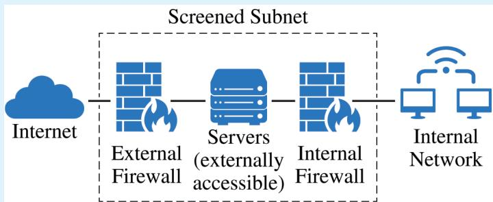

## FIGURE 3.3: Screened Subnet (also referred to as DMZ)

A screened subnet, also known as a DMZ, is a part of a network that is behind a firewall but still externally accessible. Screened subnets often contain servers that host web applications or websites. Beyond the screened subnet is a second firewall that more strictly restricts access to the LAN behind it.

## SUGGESTED SKILLS

## 2.C

Evaluate, with and without the support of AI, the impact of protective risk-management strategies.

2.D

Implement and log mitigations with and without the support of AI.

TOPIC 3.4

# Protecting Networks: Firewalls

## Required Course Content

## LEARNING OBJECTIVE

## 3.4.A

Identify types of networkbased firewalls.

## 3.4.B

Explain how a firewall uses an access control list to allow or deny trafic entering or leaving a network.

## ESSENTIAL KNOWLEDGE

## 3.4.A.1

A firewall is used to allow or deny network trafic in or out of a network. The firewall itself is software that can be hosted on a standalone device or integrated into another network device, such as a router.

## 3.4.A.2

A stateless firewall filters trafic based on information in packet headers, such as IP addresses, ports, and protocols.

## 3.4.A.3

A stateful firewall (also known as dynamic packet filtering) tracks the state of network connections passing through the firewall and can filter according to connection-related rules in addition to the filtering done by a stateless firewall. This allows for more control over content allowed in and out of a network.

## 3.4.A.4

A next-generation firewall (NGFW) has both the capabilities of typical stateless and stateful firewalls and additional advanced features, such as intrusion prevention, deep packet inspection, and filtering by application type.

## 3.4.B.1

Network administrators create a set of rules, called an access control list (ACL), that a firewall uses to permit or deny inbound and outbound network trafic.

## 3.4.B

Explain how a firewall uses an access control list to allow or deny trafic entering or leaving a network.

## 3.4.C

Determine the efective placement of firewalls in a network.

## 3.4.D

Configure a firewall to manage the flow of network trafic.

## 3.4.B.2

ACL rules are checked in order and the first rule that matches the criteria will be executed for the specified data.

## 3.4.B.3

A typical ACL will specify the direction of trafic (inbound or outbound), the criterion to filter by (IP addresses, logical port, service, or application), and the action to take (permit or deny).

## 3.4.C.1

Each segment of a network should have a firewall to control the flow of data in and out of that segment.

## 3.4.C.2

Network segments may have diferent security needs based on the data and services within them. The level of security for each firewall can be set independently.

## 3.4.C.3

Each point of data ingress and egress between the internal network and the public internet should have a firewall.

## 3.4.D.1

The requirements for a firewall will specify what type of trafic from which sources or to which destinations should be allowed or denied.

## 3.4.D.2

Specific rules for a firewall can allow or deny inbound or outbound trafic based on source or destination port or IP address, service, protocol, or application.

## ILLUSTRATIVE EXAMPLES

§ Allow inbound TCP port 22 from ALL; (this rule will allow all inbound TCP trafic with destination port 22, which is the designated port for the SSH protocol)

§ Deny inbound TCP port 80 from 192.168.1.0/24; (this rule will deny inbound TCP trafic with destination port 80 from IP addresses in the 192.168.1.0- 192.168.1.255 range)

## 3.4.D

Configure a firewall to manage the flow of network trafic.

## 3.4.D.3

Rules are implemented in order, and changing the order of a set of rules can change which trafic is allowed or denied. Consideration must be given to the precedence of filtering priorities when establishing the order of rules.

## ILLUSTRATIVE EXAMPLES

This set of rules would allow SSH trafic and deny other inbound TCP trafic

§ Rule 1: ALLOW inbound TCP port 22 from ALL;

§ Rule 2: DENY inbound TCP ALL from ALL;

Reversing the order of those rules would deny all inbound TCP trafic including SSH trafic.

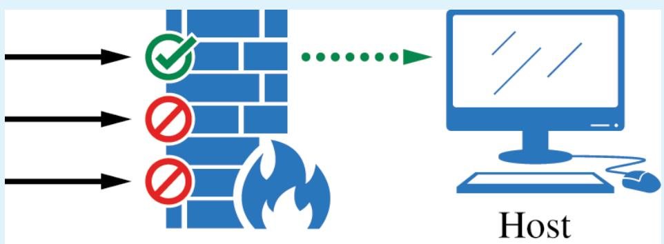

Host

Firewall


Incoming Network Traffic Accepted Network Traffic Rejected Network Traffic

## FIGURE 3.4: The Process of Firewalls

A firewall is used to admit or deny traffic entry into a network or host. Firewalls might use source IP addresses, destination IP addresses, or logical ports to filter traffic. This illustration depicts a firewall controlling incoming traffic. Note that firewalls can control traffic into, out of, and within a network.

SUGGESTED SKILLS

3.C

Evaluate the impact of threat detection methods.

3.D

Detect and classify cyberattacks by analyzing digital evidence with and without the support of AI.

TOPIC 3.5

# Detecting Network Attacks

## Required Course Content

## LEARNING OBJECTIVE

## 3.5.A

Identify types of automated security tools used to detect network attacks.

## ESSENTIAL KNOWLEDGE

## 3.5.A.1

Automated detection tools analyze data collected from an organization’s network and devices, such as switches and routers, servers, firewalls, and user computers. These data are often collected in a log file.

## 3.5.A.2

A network intrusion detection system (NIDS) is an automated tool that analyzes data to determine if malicious activity is taking place on a network. When an attack is detected, it generates an alert.

## 3.5.A.3

A network intrusion prevention system (NIPS) is an automated tool that, like an IDS, analyzes data to determine if malicious activity is taking place on a network. A NIPS can also mitigate or halt an attack by closing ports, blocking specific IP or MAC addresses, or rejecting specific protocols.

## 3.5.A.4

A security information and event management (SIEM) system collects and analyzes data from multiple sources (including firewalls, NIDS/NIPS, device logs, and application logs) to detect patterns that may indicate a cyberattack and raises an alert if a potential attack is detected. Security analysts investigate the alert to determine whether it represents a true threat and follow standard operating procedures to resolve or escalate the alert.

## 3.5.B

Explain how organizations can leverage artificial intelligence (AI) to enhance threat detection and response.

## 3.5.C

Determine a network detection method.

## 3.5.B.1

Computers log every action that users take. Firewalls, IDS, IPS, and other network sensors log all the trafic passing through various points in a network. A medium-sized organization’s network is logging millions (or even tens of millions) of data points per day. Even a large team of humans is incapable of analyzing so much data.

## 3.5.B.2

Threat detection teams are creating AI algorithms to analyze large amounts of data and classify the data patterns as malicious or normal.

## 3.5.B.3

AI models for threat detection are based on probabilistic calculations; they report a percentage to indicate the likelihood that something is malicious.

## 3.5.B.4

Organizations determine their own thresholds for what percentage of likelihood of a threat results in an alert. If the threshold is set too high, real attacks may go undetected; if the threshold is too low, the security team will be overwhelmed with false alerts.

## 3.5.C.1

Volume of network trafic is a criterion for determining a detection method. Signaturebased detection is more eficient for networks with high trafic volume. Signature-based detection compares detection data to a database of known indicators of compromise (IoCs), called signatures. Signature databases must be updated with IoCs for the latest attacks. Signature-based detection runs more quickly than anomaly-based detection.

## 3.5.C.2

Consistency of network trafic patterns is a criterion for determining a detection method. Anomaly-based detection is most efective on networks with consistent trafic patterns. Anomaly-based detection compares detection data to a baseline of recorded activity. Baselines must be recorded on uncompromised systems to establish expected data types and volumes. Anomaly-based detection triggers an alert or action when data types or volumes outside of a specified tolerance range are recorded. Anomaly-based detection relies on consistent patterns in network trafic to detect anomalous trafic patterns.

## 3.5.C

Determine a network detection method.

## 3.5.D

## Evaluate the impact of a network detection method.

## 3.5.C.3

Degree of sensitivity or criticality of a network is a criterion for determining a detection method. Networks with more sensitive or critical data or services will likely consider a hybrid approach. Hybrid detection combines signature-based and anomaly-based detection. Hybrid detection is more expensive than using either signature- or anomaly-based detection alone, and hybrid-detection models generate more alerts.

## 3.5.C.4

Likelihood of novel attacks on a network is a criterion for determining a detection method. Signature-based detection cannot detect a new attack. When an organization suspects that adversaries are likely to attempt a new attack on a network, anomaly-based detection is the preferred method when the cost of hybrid detection is prohibitively high.

## 3.5.D.1

Speed of detection is a factor in evaluating the impact of a network detection method. Faster detection enables faster response. Signaturebased detection methods are faster than anomaly-based detection methods, especially on networks with high trafic volume.

## 3.5.D.2

Cost is a factor in evaluating the impact of a network detection method. Detection tools and ongoing costs need to be within a budget. Anomaly-based detection systems require more expensive hardware to operate than signature based. Hybrid detection is the most expensive option because it combines both anomaly- and signature-based methods.

## 3.5.D.3

False positive rate is a factor in evaluating the impact of a network detection method. Signature-based detection has almost no false positives. Anomaly-based or hybrid detection will have higher false positive rates. Impacts of high false positive rates include:

Time and resources are put toward investigating alerts for nonmalicious activity.

Alert fatigue is a condition that occurs when responders get accustomed to false positives and take alerts less seriously because they assume alerts are false positives before investigating them.

## 3.5.D

Evaluate the impact of a

network detection method.

## 3.5.E

Apply detection techniques to identify indicators of network attacks by analyzing log files.

## 3.5.D.4

False negative rate is a factor in evaluating the impact of a network detection method. A false negative occurs when an adversary can bypass a detection system. Signature-based detection systems are easier to bypass than anomaly-based or hybrid systems. False negatives can result in adversaries causing loss, harm, disruption, or destruction to data and systems.

## 3.5.E.1

Evil-twin attacks can be detected by regularly scanning for service set identifiers (SSIDs) that look suspicious or similar to local legitimate SSIDs. Signal triangulation can be used to locate and disable an access point broadcasting an evil-twin network.

## 3.5.E.2

Jamming attacks can be detected by recognizing that no wireless devices in a specific physical space are able to connect to a wireless network and by scanning for electromagnetic (EM) noise in the wireless range.

## 3.5.E.3

ARP poisoning attacks can be detected by monitoring network trafic for unusual ARP messages (particularly duplicate MAC address ARP packets) and checking the ARP table on the default gateway.

## 3.5.E.4

MAC flooding attacks can be detected by monitoring network trafic for an unexpected surge of Ethernet frames with diferent MAC addresses and checking the MAC address table on a switch.

## 3.5.E.5

DNS poisoning attacks are dificult to detect. However, if an organization’s website experiences an abrupt and otherwise inexplicable drop in trafic, DNS records should be examined as a potential cause.

## 3.5.E.6

Smurf attacks can be detected by watching network trafic for a sudden increase in ICMP requests sent to the network’s broadcast address.

## 3.5.E

Apply detection techniques to identify indicators of network attacks by analyzing log files.

## 3.5.E.7

Network-based IoCs are discovered when analyzing network trafic, often in the form of packet capture files. Indicators can be found in source and destination IP addresses, ports, and protocols. These can include:

§ Connections to known malicious IP addresses

§ Unauthorized network scans

Unusual spikes or slow downs in network trafic

§ Mismatched port-application trafic

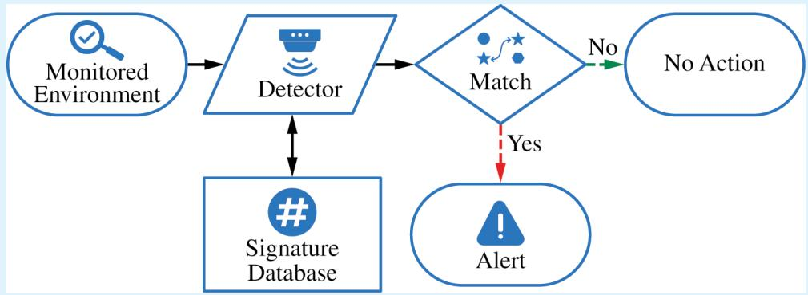

Anomaly-Based Detection Technique  
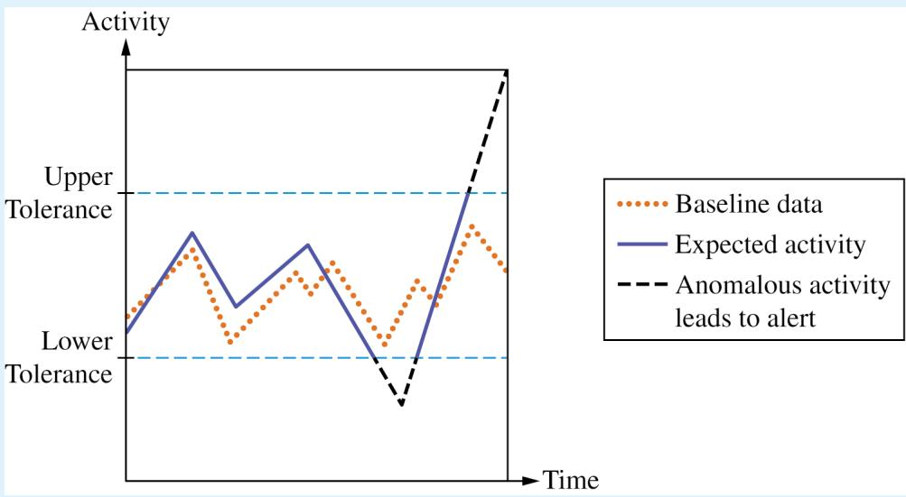  
FIGURE 3.5: Signature-Based vs. Anomaly-Based Detection Techniques  
Signature-based detection (top) showcases identification of known malware through digital signatures, relying on predefined patterns for efficient threat detection. Anomaly-based detection (bottom) demonstrates detection of new threats by analyzing deviations from normal behavior, identifying potential risks based on abnormal patterns. This enhances overall security measures.

THIS PAGE HAS BEEN INTENTIONALLY LEFT BLANK

AP CYBERSECURITY

# UNIT 4

# Securing Devices


\~23 CLASS PERIODS

# Securing Devices

## Developing Understanding

Computer devices store, process, and transmit all the digital data in the world. Devices include computer systems and laptops, smart phones and tablets, and a range of items that have microcomputers installed in them, like washing machines and cofee makers—these are often called smart devices or IoT (Internet of Things) devices. In Unit 4, students learn about how systems authenticate users of devices and how adversaries attempt to impersonate legitimate users. Students come to understand how adversaries use malware to compromise devices and the importance of keeping devices updated and of using anti-malware software. Students also learn how to analyze log files for indicators of compromise (IoCs).

## Building Cybersecurity Skills

As more everyday items incorporate embedded computers, device vulnerabilities and attacks are growing rapidly. In this unit, students learn to assess risk based on these new vulnerabilities. They learn how devices can be protected as another part of a defense-in-depth security strategy. Students also practice detecting attacks against devices by reviewing authentication logs for IoCs.

# Unit Scenarios

The scenarios for this unit are designed to connect the knowledge and skills students gain to realistic workplace tasks. The scenarios are paired with relevant student activities. Teachers may use their own scenarios in addition to, or in lieu of, those provided here.

## SCENARIO 4A:

## Designing Secure Connected Farm Equipment

You work as a security engineer for a company that manufactures internetconnected machinery for agricultural purposes (e.g., tractors, irrigation tools, and automated milking machines for dairy farms). These machines all have onboard computers that allow farmers to remotely control the devices. The computers are updated on an as-needed basis. Some of the machines use GPS to locate and maneuver themselves.

There have been reports of cyberattacks against farming equipment, and your boss has asked you to write a report detailing possible vulnerabilities with suggested mitigations to ensure that the machines your company produces are as safe as possible.

You will:

§ Research how an adversary might take advantage of internet-connected farm equipment, and assess the risk from possible vulnerabilities

§ Determine possible mitigation strategies to help secure the equipment

§ Produce a report for your manager, summarizing your findings and making recommendations

## SCENARIO 4B:

## Configuring Authentication Settings

You are a junior system administrator at Aceshack, an engineering firm. A new desktop computer has been set up in a drop-in area of Aceshack’s ofice for remote workers who are coming in just for the day. This new computer needs the security settings configured to comply with Aceshack’s policies.

You will log on to this computer as an administrator and configure the local security settings related to the password and account-lockout policies.

## SCENARIO 4C:

## Analyzing Log Files for Indicators of Compromise

You are a forensic analyst for Dynamic, a local manufacturing company. Dynamic has separate networks for its ofices and its manufacturing plants. Last month, there was a cyberattack against its business ofice network, but the adversaries were not able to compromise the manufacturing network. However, the security team has detected continued suspicious activity on the business network, and they are concerned that the suspicious activity may stem from the original attack and may eventually lead to the manufacturing environment also being compromised. You have been asked to analyze the authentication logs for devices on the manufacturing network for signs of adversaries attempting to compromise the manufacturing plant.

## You will:

§ Review authentication logs for devices on the manufacturing network

§ Identify any potential indicators of compromise (IoCs)

§ Submit a report summarizing your findings and recommendations

## UNIT AT A GLANCE

<table><tr><td>Topic</td><td>Learning Objectives</td><td>Scenario Connections</td><td>Class Periods</td></tr><tr><td>4.1 Device Vulnerabilities and Attacks</td><td>4.1.A Identify types of computing devices.4.1.B Identify the type of malware used in a cyberattack.4.1.C Explain how adversaries can exploit common device vulnerabilities to cause loss, damage, disruption, or destruction.4.1.D Assess and document risks from device vulnerabilities.</td><td>4A Designing Secure Connected Farm EquipmentResearch how an adversary might take advantage of internet-connected farm equipment, and assess the risk from possible vulnerabilities.Produce a report for your manager, summarizing your findings and making recommendations.</td><td>6</td></tr><tr><td>4.2 Authentication</td><td>4.2.A Explain why hashes (also called hash outputs, checksums, message digests, or digests) are used to store passwords.4.2.B Explain how password attacks exploit vulnerabilities.4.2.C Determine the type of authentication used to verify the identity of a user.4.2.D Configure login settings to make a device more secure.</td><td>4B Configuring Authentication SettingsConfigure the local security settings related to the password and account-lockout policies.</td><td>5</td></tr><tr><td>4.3 Protecting Devices</td><td>4.3.A Identify managerial controls related to device security.4.3.B Explain how anti-malware software can make a device more secure.4.3.C Explain why keeping a device&#x27;s operating system and software updated makes it more secure.4.3.D Configure a host-based firewall.</td><td>4A Designing Secure Connected Farm EquipmentDetermine possible mitigation strategies to help secure the equipment.</td><td>5</td></tr><tr><td>4.4 Detecting Attacks on Devices</td><td>4.4.A Explain how to detect attacks against devices.4.4.B Determine controls for detecting attacks against a device.4.4.C Evaluate the impact of a device detection method.4.4.D Apply detection techniques to identify indicators of password attacks by analyzing log files.</td><td>4C Analyzing Log Files for Indicators of CompromiseReview authentication logs for devices on the manufacturing network.Identify any potential IOCs.Submit a report summarizing your findings and recommendations.</td><td>7</td></tr></table>

TOPIC 4.1

# Device Vulnerabilities and Attacks

## SUGGESTED SKILLS

## 1.C

Evaluate, with and without the support of AI, the likelihood and impact of risks.

## 1.D

Document, with and without the support of AI, the likelihood and impact of risks.

## Required Course Content

## LEARNING OBJECTIVE

## 4.1.A

Identify types of computing devices.

## ESSENTIAL KNOWLEDGE

## 4.1.A.1

Server computers are devices that provide one or more services to other computers (e.g., DNS, DHCP, FTP). Any computer can be a server, and in an enterprise environment servers typically have more processing power and storage than a personal computer.

## 4.1.A.2

Personal computers are devices that are designed to be used by one person for work or recreational purposes (e.g., word processing, graphic design, web browsing, and media production or viewing). These include desktop, laptop, and notebook computers.

## 4.1.A.3

Handheld computers (also called mobile computers or information appliances) are smaller than personal computers and run on battery power. These include tablets, smartphones, and wearable technology like smart watches.

## 4.1.A.4

Embedded computers are devices that are part of a machine. Embedded devices have specific instruction sets for interfacing with the specialized components of the machine they’re embedded in. Embedded computers tend to be slower and cheaper than other computers and have minimal storage.

## 4.1.A

Identify types of computing devices.

## 4.1.B

Identify the type of malware used in a cyberattack.

## 4.1.A.5

Everyday devices with embedded computers are often called Internet of Things (IoT) devices. Embedded computers are found in transportation (e.g., cars, trains, and airplanes), devices that operate critical infrastructure (e.g., operating circuit breakers at electrical substations and pumps at water treatment plants), medical equipment (e.g., IV pumps, MRI scanners, pacemakers, and insulin pumps), and everyday devices like washing machines, cofee makers, and thermostats.

## 4.1.B.1

Malware is malicious software that can damage or destroy a device or network, or allow an adversary access to a device and the data on the device.

## 4.1.B.2

Malware is often used as a tool to accomplish part of an adversary’s plan to achieve their ultimate goal(s). There are many types of malware, such as:

§ Viruses are malware that must be activated by a user executing or opening a file.

§ Worms spread from one computer to another without human interaction.

Trojans are malware embedded in other software that seems harmless. Remote access trojans (RATs) provide an adversary with remote access to the target system.

Ransomware encrypts a device’s files, preventing the user from accessing files on the device. The ransomware typically presents the user with a screen demanding payment and promising to give the user a decryption key for their files if the user pays within a fixed amount of time.

Spyware tracks a user’s actions on a computer and sends information back to an adversary.

A keylogger is software or hardware that logs the users keystrokes and sends the information back to the adversary. Adversaries can often extract usernames and passwords from keylogger data.

Logic bombs are set to trigger their efect only when a specific set of conditions are met; the conditions can include time and date, specific type or version of the operating system, character set the computer is using, etc.

## 4.1.B

Identify the type of malware used in a cyberattack.

## 4.1.C

Explain how adversaries can exploit common device vulnerabilities to cause loss, damage, disruption, or destruction.

A rootkit is sophisticated malware that gets into the target computer’s operating system and can control nearly every aspect of the system, including making the rootkit itself invisible to detection.

## 4.1.B.3

While most malware is a file or a collection of files, fileless malware is malicious code that lives in RAM and uses legitimate programs already installed on a device to compromise it.

## 4.1.C.1

Adversaries can develop exploits for known vulnerabilities in software (including operating systems). Devices with unpatched software are vulnerable to these exploits, which could allow an adversary to crash a system, view user actions, enable or disable various services or components on the device (e.g., turning on a webcam or microphone), or even take control of the device to issue their own commands including commands to steal or destroy information on the device.

## 4.1.C.2

Adversaries can take advantage of weak authentication requirements by guessing a user’s password or using social engineering to get a user to divulge their password.

## 4.1.C.3

When systems don’t have a password on the basic input output system (BIOS) or unified extensible firmware interface (UEFI), an adversary can boot a computer into a special mode (e.g., “recovery mode”) that gives them higher-level privileges. Without BIOS or UEFI protection, adversaries can load their own operating system onto a device from an external drive and use specialized tools to alter or create user profiles, including changing user passwords.

## 4.1.C.4

Adversaries can load malware onto an external drive, and if autorun is enabled, then a device will run the malware when the external drive is inserted.

## 4.1.C.5

Adversaries can leverage open ports to connect to a device.

## 4.1.C

Explain how adversaries can exploit common device vulnerabilities to cause loss, damage, disruption, or destruction.

## 4.1.D

Assess and document risks from device vulnerabilities.

## 4.1.C.6

Adversaries can send malicious data to devices to disrupt them or attempt to take control of them. Devices that have no firewall (or a misconfigured firewall) cannot filter out this malicious data.

## 4.1.C.7

Adversaries often attempt to install malware on a device to disrupt or control it. Devices lacking anti-malware software are more vulnerable to this type of attack.

## 4.1.D.1

Risk from device vulnerabilities can come from unauthorized access or malware that allow an adversary to impersonate an authorized user, remotely control a device, encrypt a device’s drive to ransom the data, or wipe a device’s memory, destroying data or rendering the device inoperable. The level of risk varies depending on the criticality of the device or the services the device provides or data it stores.

## 4.1.D.2

High risks from device vulnerabilities involve potentially compromising sensitive data or critical operations.

## ILLUSTRATIVE EXAMPLE

An organization has not installed the most recent update for their email server which included a patch for a known critical vulnerability.

## 4.1.D.3

Moderate risks from device vulnerabilities can arise from weak authentication requirements or from vulnerabilities that would be less likely to be exploited.

## ILLUSTRATIVE EXAMPLE

A water treatment plant has embedded systems controlling pumps. The pumps can be remotely accessed via username and password for remote management for the plant, but the devices do not require multifactor authentication (MFA).

## 4.1.D.4

Low risks from device vulnerabilities are typically related to vulnerabilities that, if exploited, would have little impact.

## ILLUSTRATIVE EXAMPLE

An employee’s laptop has telnet port 23 open.

# TOPIC 4.2

# Authentication

## SUGGESTED SKILLS

2.A

Identify security controls, and explain how they mitigate risks.

2.B

Determine layered security

controls that address

vulnerabilities.

## Required Course Content

## LEARNING OBJECTIVE

## 4.2.A

Explain why hashes (also called hash outputs, checksums, message digests, or digests) are used to store passwords.

## ESSENTIAL KNOWLEDGE

## 4.2.A.1

A cryptographic hash function (also called a message digest function) is a mathematical algorithm that takes binary data of an arbitrary length, processes it according to a set of instructions, and outputs a fixed-length binary string called the hash (or checksum or message digest). Well known cryptographic hashes include:

§ MD5

§ SHA-1, SHA-256, SHA-512 (SHA stands for Secure Hash Algorithm)

§ NTHash

§ RIPEMD-160

## 4.2.A.2

An n-bit hash has 2<sup>n</sup> possible outputs. The number of inputs is infinite, and so inevitably two diferent inputs will produce the same hash. This is called a collision.

## 4.2.A.3

Cryptographic hash functions have the following properties:

Hashes are collision resistant; it is dificult to find two diferent inputs to the same hash function that produce the same output.

Hashes have pre-image resistance; given a hash, it is infeasible to figure out the input that generated the hash.

Hashes are repeatable; the same input will always produce the same hash.

Hashes have a fixed length; the length in bits of the hash for a specific hash function is constant regardless of the size of the input.

## 4.2.A

Explain why hashes (also called hash outputs, checksums, message digests, or digests) are used to store passwords.

## 4.2.B

Explain how password attacks exploit vulnerabilities.

## 4.2.A.4

Adversaries try to compromise hashing functions by forcing collisions in their output. If an eficient algorithm exists to force a collision for a specific hash function, then that hash function will be deprecated (no longer used in secure settings). MD5 and SHA1 are examples of deprecated hash functions.

## 4.2.A.5

Password-based authentication services shouldn’t store passwords in plaintext, so that if an adversary gains access to the user:password directory they won’t immediately know the passwords for all users. Instead, user passwords should be hashed and the hash stored in a database. When a user enters their password, it is hashed, and the hash is compared to the hash stored on file. If the hashes match, then the user is authenticated.

## 4.2.A.6

If two users had the same password, then their passwords would have identical hashes in the user:password directory. To prevent this, a few random bits (called salt) are hashed with a user’s password to generate the hash. Each user’s salt is unique, so even if two users have the same password they will have a diferent password hash because they have diferent salt.

## 4.2.B.1

If an adversary can compromise the password of a legitimate user, and that user’s organization has not enabled MFA or other authentication protections, then the adversary can act within that organization with all the access and rights available to the user.

## 4.2.B.2

Password attacks can be classified as online or ofline.

Online password attacks attempt user:password combinations in an active authentication portal.

Ofline password attacks have captured a user:password database and can run password attacks against the database on their own computer. This method bypasses any account lock out protections that may be in place.

## 4.2.B

Explain how password attacks exploit vulnerabilities.

## 4.2.B.3

Many users reuse the same passwords (or variations of the same password) for all the services and accounts they have, despite warnings not to. When an organization’s user database is stolen, the usernames, emails, and passwords are sold to adversaries or posted online. Adversaries often begin an attempt to compromise an account by trying stolen or leaked credentials for a target individual.

## 4.2.B.4

Many users set passwords that are easy to guess, and adversaries will attempt to guess common passwords for a user’s account. Password spraying is an attack where an adversary attempts a common password against many diferent user accounts.

## 4.2.B.5

Some services and devices (e.g., switches, routers, and IoT devices) are preconfigured with a default administrative user and password. Credential stufing is an attack where an adversary attempts to gain access to these services or devices using common default credentials or account credentials that have been stolen.

## 4.2.B.6

Ofline password attacks use automated hashcracking tools to hash possible passwords and compare them against a captured hash. Although hashes can’t be reversed, an adversary can use these tools to hash many potential passwords and compare them to the target hash. If an adversary finds a hash that matches, they can use the password that generated the hash to login to the user’s account. Ofline attacks include:

Brute force attacks, where an adversary uses an automated tool to test all the potential passwords that a user could have

Dictionary attacks, where an adversary uses an automated tool to test a list of common passwords

## 4.2.B.7

A rainbow table attack uses a list of common passwords to generate a rainbow table. A rainbow table is a table that contains each potential password and its hash. The table is then sorted by the hashes, and the adversary uses an automated tool to search the list of hashes for the captured hash. If the hashes match, then the adversary has found a password that generates the same hash, and the password will allow the adversary to login to the user’s account.

## 4.2.C

Determine the type of authentication used to verify the identity of a user.

## 4.2.C.1

Authentication mechanisms are technical controls that verify the identity of a user to ensure that only authorized users access a system. The proof the user provides to identify themselves is called a factor. Common authentication factors include:

§ Something the user knows (knowledge factor)

§ Something the user has (possession factor)

§ Something the user is (biometric factor)

§ Somewhere the user is (location factor)

## 4.2.C.2

Knowledge factors can be passwords, PINs, or answers to preselected challenge questions. For a knowledge factor to be efective it needs to be something an adversary can’t easily guess; however, knowledge factors that are dificult for an adversary to figure out can also be harder for a user to remember.

## 4.2.C.3

A possession factor is an object a user has that is unique to them, such as an access card, a bank card, a cell phone, or an authentication token. The more dificult it is for an adversary to obtain the object (or a copy of it), the more secure the possession factor is.

## 4.2.C.4

Biometric factors measure features of the human body and can include fingerprints, palm prints, facial recognition, iris or retina scans, or voice identification. Biometric factors are dificult for an adversary to duplicate because they are unique to an individual.

## 4.2.C.5

Location factors use information about Wi-Fi signals, GPS data, time zone settings, and even IP address information to make determinations about location. Rules can be established for allowing or denying access based on a location factor.

## 4.2.C.6

Multifactor authentication (MFA) is when a system uses more than one factor to authenticate a user. MFA is more secure than single-factor authentication because it requires the user to provide at least two separate factors of authentication.

## 4.2.D

Configure login settings to make a device more secure.

## 4.2.D.1

Requiring complexity in passwords is a login setting that can be configured. When enabled, users setting a new password must include at least one character from each character set. Passwords with characters from each character set are significantly harder for an adversary to crack than passwords that use characters from only one or two character sets. The main character sets often required are:

§ Uppercase letters (A–Z)

§ Lowercase letters (a–z)

§ Numeric digits (0–9)

Special characters (!”#\$%&’()\*+,-./:;<=>?@ [ \ ] ^\_\`{|}\~)

## 4.2.D.2

Requiring a minimum password length is a login setting that can be configured. This means that users must have at least a certain number of characters in their password. The longer and more complex a password is, the longer it will take a digital tool to crack the password.

## 4.2.D.3

Requiring a maximum password age is a login setting that can be configured. When configured, users will receive a prompt to change their password a certain number of days after their last password change, usually every 90 or 120 days. If a user’s password has been compromised, changing it could prevent an adversary from gaining access to the user’s account. However, some national standards recommend that organizations not require users to change their passwords on predefined intervals to discourage users from developing password patterns (e.g., PasswordFall2028).

## 4.2.D.4

Requiring the system to store a certain number of previous user passwords is a login setting that can be configured. This prevents a user from reusing a password. Many organizations store users’ previous 5–10 password hashes to prevent reuse.

## 4.2.D.5

Requiring a lockout period after a certain number of invalid login attempts is a login setting that can be configured. This prevents an adversary from continuously randomly attempting wrong passwords. Many organizations lock a user’s account after 3–5 invalid login attempts. The period of the lockout varies.

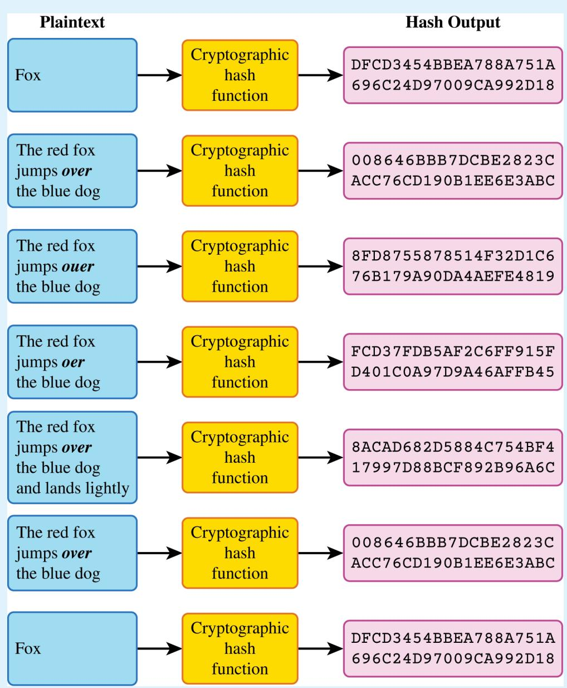

## FIGURE 4.2A: The Cryptographic Hash Function

The purpose of a cryptographic hash function is to verify the integrity of data and to show that the data have not been altered. Here, notice that any misspelling, additional text, or changes to the input will completely alter the hash output (also known as the checksum, message digest, or digest). However, any inputs that are exactly the same—such as the first and last, and the second and sixth—result in the same exact digest. The cryptographic hash function is one-way, meaning that a user cannot derive the input from the digest.


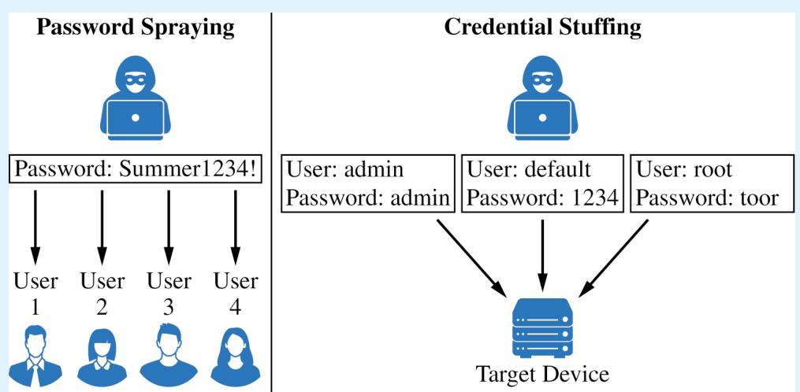

## FIGURE 4.2B: Types of Password Attacks – Password Spraying vs. Credential Stuffing

Password spraying (left) depicts an attack method in which adversaries attempt a few commonly used passwords across many accounts to attempt to gain unauthorized access, exploiting weak password policies and practices. Credential stuffing (right) shows attempts to use common credentials from one service to access other accounts, highlighting the risk of using default or common usernames and passwords.

## Adversary gets access to a database of hashed passwords.


<table><tr><td>Username</td><td>Password Hash</td></tr><tr><td>User 1</td><td>5aa910da8a49fd01d52e96843945c921</td></tr><tr><td>User 2</td><td>d386bc67675e9b6c5215dedf0b4b86a7</td></tr><tr><td>User 3</td><td>2c61ebff5a7f675451467527df66788d</td></tr></table>

## Hashing algorithms cannot be reversed.

The adversary makes a table of all possible passwords and generates a hash for all of them. This is called a rainbow table. The adversary can search the rainbow table for the hashes that match those in the database.

<table><tr><td>Plaintext Password</td><td>Password Hash</td></tr><tr><td>tEsT987</td><td>d386bc671a3f9c1e7b42d8f05c6a9be</td></tr><tr><td>!2345</td><td>d386bc6720d7a4c9e2f1b6a5c8e3d9f</td></tr><tr><td>Password123</td><td>d386bc673b8e5f0c3a7d2e9b1c4a6d5</td></tr><tr><td>L0veC@t$</td><td>d386bc6759c1d5a7e0f3b8a2e4c6d9b</td></tr><tr><td>Summ3rFun!</td><td>d386bc67675e9b6c5215dedf0b4b86a7</td></tr><tr><td>B1rdW4tcher</td><td>d386bc6794f2a9d0c6e5b1a8d3c7e9f</td></tr></table>

Because the hash for User 2's password is the same as the hash for the string “Summ3rFun!", the adversary may be able to use this string as User 2’s password to gain access to User 2’s account.

## FIGURE 4.2C: Types of Password Attacks – Rainbow Table Password Attack

The rainbow table (bottom table) contains precomputed hashes for many possible plaintext passwords, sorted alphanumerically. By comparing the hashed passwords from a compromised database (top table) against this table, an adversary can quickly find matching hashes and identify corresponding plaintext passwords. This illustrates the effectiveness of rainbow tables in recovering passwords from unsalted hash databases through hash comparison.

## TOPIC 4.3

# Protecting Devices

## SUGGESTED SKILLS

## 2.C

Evaluate, with and without the support of AI, the impact of protective risk-management strategies.

## 2.D

Implement and log mitigations with and without the support of AI.

## Required Course Content

## LEARNING OBJECTIVE

## 4.3.A

Identify managerial controls related to device security.

## ESSENTIAL KNOWLEDGE

## 4.3.A.1

An acceptable use policy will describe the range of activities that are permissible, prohibited, or required by users on devices owned by an organization and may include:

Prohibiting users from accessing specific websites or types of websites (e.g., social media or gaming)

§ Requiring users to keep software updated

§ Allowing users to connect peripheral devices

§ Prohibiting users from connecting external drives or media

## 4.3.A.2

A password policy will detail the requirements for user passwords within an organization and may include:

§ A minimum or maximum password length

§ A minimum or maximum amount of time a user may keep the same password

§ A prohibition of password reuse

Rules for password construction (e.g., no dictionary words and character set requirements)

§ A suggestion to use secure password management tools instead of writing passwords down

## 4.3.A

Identify managerial controls related to device security.

## 4.3.B

Explain how anti-malware software can make a device more secure.

## 4.3.C

Explain why keeping a device’s operating system and software updated makes it more secure.

## 4.3.D

Configure a host-based firewall.

## 4.3.A.3

A software installation policy will describe what (if any) software users are allowed to install on their devices and usually also a process for users to request specialized software they may need to perform their role, and it may include:

A prohibition against users installing software on their devices

§ A process for users to request new software needed for their role

§ A list of approved software for users

## 4.3.B.1

Anti-malware software (sometimes called antivirus software) has tools to quarantine and remove malware that can corrupt, spy on, or destroy a system. Malware contains indicators that make it detectable; these indicators are called signatures.

## 4.3.B.2

Anti-malware software has a database of malware signatures. It periodically scans the files on a device and checks to see if any of the files match any of the signatures in its database. If there is a match, the software quarantines and removes the malicious files.

## 4.3.C.1

When vulnerabilities in operating systems and software are found, the vendor or organization that maintains the operating system software will fix it and send an update. A small update is called a patch.

## 4.3.C.2

Ensuring that a computer’s operating system and software applications are updated to the most recent version prevents adversaries from taking advantage of a known vulnerability.

## 4.3.D.1

Host-based firewalls allow or deny trafic into or out of a single device. This provides an extra layer of security in case a host is connected to a compromised network.

## 4.3.D.2

A host-based firewall is software that runs on a device and follows a set of rules (an ACL) like a network-based firewall. Firewall rules are implemented in order, applying the first rule that matches.

4.3.D

Configure a host-based firewall.

## 4.3.D.3

A host-based firewall can also block specified types of outbound trafic. Host-based firewalls should always block ports or services not needed for a given device.

## ILLUSTRATIVE EXAMPLES

A host-based firewall is configured to block outbound FTP trafic. This prevents an adversary with remote access to the host from using FTP to exfiltrate a file to the adversary’s server.

## 4.3.D.4

The rules for a host-based firewall can allow or deny trafic based on source or destination port or IP address, service, protocol, or application.

SUGGESTED SKILLS

3.B

Determine strategies and methods to detect attacks.

3.D

Detect and classify cyberattacks by analyzing digital evidence with and without the support of AI.

TOPIC 4.4

# Detecting Attacks on Devices

## Required Course Content

## LEARNING OBJECTIVE

## 4.4.A

Explain how to detect attacks against devices.

## ESSENTIAL KNOWLEDGE

## 4.4.A.1

System processes and settings, login attempts, file download attempts, and user actions are logged by computing systems. These logs can be used to reconstruct circumstances leading up to and during a cyber incident.

## 4.4.A.2

An indicator of compromise (IoC) is evidence that an adversary has compromised a device or network.

## 4.4.A.3

Authentication logs (or auth logs) record every attempted login on a system. Analysis of authentication logs can reveal attempted attacks.

## 4.4.A.4

Host-based IoCs are discovered when analyzing logs and configuration settings. Indicators, such as the following, can be found in authentication logs, user activity logs, and system configuration files:

§ Unusual files being created or modified

§ Unexpected processes or services

§ Unauthorized changes to system configuration settings

Unauthorized software installation or update

## 4.4.A

Explain how to detect attacks against devices.

## 4.4.A.5

File-based IoCs are discovered when analyzing files on a device. Indicators are usually found in executable files and can include:

§ Files whose hash matches known malware

§ File names that are known to be created by a certain piece of malware

File paths that are associated with malicious activity

Determine controls for detecting attacks against a device.

## 4.4.B

## 4.4.A.6

Behavior-based IoCs are discovered when analyzing logs. Indicators can be found in authentication logs and access logs and can include:

§ Multiple failed login attempts

§ Unusual login times or locations

Unauthorized attempts to access sensitive data

Attempts to elevate user privileges on a system

## 4.4.B.1

Performance is a criterion for determining a detection method. Detection tools use system memory and processing power and can impact the performance of a device. Anomaly-based detection tools use more system resources than signature-based tools. Signature-based detection is a better option for devices with less powerful system resources. Many embedded devices do not have enough system resources to run any detection tools on the device.

## 4.4.B.2

Cost is a criterion for determining a detection method. Organizations that purchase detection software need to consider the cost of purchasing enough software licenses for the number of devices they need to monitor. Some organizations purchase an endpoint detection and response (EDR) service from a third-party vendor. Although these services are expensive, they provide a holistic, unified approach to threat detection for an organization’s devices; they typically include a centralized alert platform for monitoring possible attacks on devices.

## 4.4.B

Determine controls for detecting attacks against a device.

## 4.4.C

Evaluate the impact of a device detection method.

## 4.4.D

Apply detection techniques to identify indicators of password attacks by analyzing log files.

## 4.4.B.3

Sensitivity or criticality of the device is a criterion for determining a detection method. Devices that store or process sensitive information or provide critical services are more likely to be targeted by adversaries and benefit from a hybrid-detection model to ofer maximum protection, when possible.

## 4.4.C.1

Speed and performance are factors in evaluating the impact of a detection method. Signature-based detection is faster than anomaly-based detection in general, and that efect is compounded on devices, which often lack the processing power to efectively run anomaly-based detection tools. Implementing resource-intensive detection tools on devices can degrade device performance.

## 4.4.C.2

Phase of the attack is a factor in evaluating the impact of a detection method. To carry out actions on a device, adversaries must first bypass a combination of physical- or networklayer protective, deterrent, and detective security controls. Detecting and stopping an attack at the device level can prevent adversaries from accessing sensitive data or disrupting critical services.

## 4.4.C.3

False positives versus ease of bypassing detection is a factor in evaluating the impact of a detection method. Most device-level detection tools are signature-based, and signature-based detection has a low rate of false positives. However, signature-based detection is easier for adversaries to bypass.

## 4.4.D.1

Online password attacks can be detected in authentication logs. A single user attempting many wrong passwords is an indicator of an online password attack. If a user:password hash database has been compromised, all the user passwords in the database should be considered insecure and all users should be forced to reset their passwords.

## 4.4.D.2

If an authorized user is logging in from a diferent location or IP address than expected, or at a diferent time than normal, this can be an indicator that the user’s password has been compromised.

## 4.4.D

Apply detection techniques to identify indicators of password attacks by analyzing log files.

## 4.4.D.3

An indicator of password spraying is many users trying to log in within seconds of each other from one IP address or from unusual IP addresses.

## 4.4.D.4

An indicator of credential stufing is a series of default user:password combinations being attempted on a device in quick succession, often from the same IP address.

## 4.4.D.5

Ofline password attacks can’t be detected, because the attack takes place on the adversary’s computer.

THIS PAGE HAS BEEN INTENTIONALLY LEFT BLANK

AP CYBERSECURITY

UNIT 5

# Securing Applications and Data


\~30 CLASS PERIODS

# Securing Applications and Data

## Developing Understanding

Data is the foundation of the digital world. Every movie or song that is streamed, every website visited, and every financial transaction made online is recorded as digital data. Stealing, modifying, or denying access to data is often the end goal of an adversary. In this unit, students learn how adversaries commonly attack data and applications. Students learn how to set access controls to limit who has what type of access to data. They also learn how to use cryptography to protect the confidentiality and integrity of data both in storage and while it is being transmitted. Additionally, students learn how adversaries attack applications, what to look for in logs as evidence of an attack, and some mitigations that can help limit or stop an attack.

## Building Cybersecurity Skills

In this final unit, students practice assessing risk to data and learn about the vulnerabilities and attacks particular to data. Students learn why some data are more valuable than others and how the perceived value of the data impacts their risk assessment. Students also learn how to protect data using tools like cryptography and access controls. Finally, students practice detecting attacks on data by reviewing logs for indicators of compromise (IoCs).

# Unit Scenarios

The scenarios for this unit are designed to connect the knowledge and skills students gain to realistic workplace tasks. The scenarios are paired with relevant student activities. Teachers may use their own scenarios in addition to, or in lieu of, those provided here.

## SCENARIO 5A:

## Protecting Sensitive Data

As an employee on the security team of Vitahealth Solutions , a pharmaceutical company, you have been tasked with protecting the company’s proprietary research and development (R&D) on its new product Strype. The directories and files that contain the research are on an air-gapped computer. Only members of the R&D team and select members of the IT team have access to that computer. Your task is to secure the research by setting the access controls for the directories and files.

You will log into the computer that contains the proprietary research and set access according to the following criteria:

§ All members of the R&D team should have full access to the /RandD directory while other users should be able to access and read the directory.

§ All members of the R&D team should have full access to the /RandD/ Research directory while other users should have no access to the directory.

§ Only the head researcher should have read, write, and execute access to the /RandD/Formula directory, the R&D team should have read and execute access, and everyone else should have no access.

## SCENARIO 5B:

## Sending Encrypted Messages

You are a security engineer working for LightningGrid, a utility company that owns power generating plants across the United States. You are working on a classified project with another security engineer at a plant on the other side of the country. It is critical that you and your colleague have a method for communicating securely. You need to use PGP encryption to set up a secure communication channel.

Your teacher will randomly pair you with another student who will be your partner for this scenario, and you will each represent one of the security engineers in the scenario. You will use PGP encryption to establish a secure digital communication channel with each other.

## You will:

§ Use a tool to generate an asymmetric key pair

§ Share your public key with your partner

§ Send your partner an encrypted secret message

§ Receive and decrypt a secret message from your partner

## UNIT AT A GLANCE

<table><tr><td>Topic</td><td>Learning Objectives</td><td>Scenario Connections</td><td>Class Periods</td></tr><tr><td>5.1 Application and Data Vulnerabilities and Attacks</td><td>5.1.A Explain how adversaries can exploit application and file vulnerabilities to cause loss, damage, disruption, or destruction.5.1.B Explain how application attacks exploit vulnerabilities.5.1.C Assess and document risks from application and data vulnerabilities.</td><td></td><td>5</td></tr><tr><td>5.2 Protecting Applications and Data: Managerial Controls and Access Controls</td><td>5.2.A Explain how the state or classification of data impacts the type and degree of security applied to that data.5.2.B Identify managerial controls related to application and data security.5.2.C Determine an appropriate access control model to protect applications and data.5.2.D Configure access control settings on a Linux-based system.</td><td>5A Protecting Sensitive Data Configure access control settings for directories and files.</td><td>7</td></tr><tr><td>5.3 Protecting Stored Data with Cryptography</td><td>5.3.A Explain how encryption can be used to protect files.5.3.B Apply symmetric encryption algorithms to encrypt and decrypt data.</td><td></td><td>4</td></tr><tr><td>5.4 Asymmetric Cryptography</td><td>5.4.A Determine the appropriate asymmetric key to use when sending or receiving encrypted data.5.4.B Explain why the length of a key impacts the security of encrypted data.5.4.C Apply asymmetric encryption algorithms to encrypt and decrypt data.</td><td>5B Sending Encrypted Messages Generate an asymmetric key pair.Encrypt a message and send it.Decrypt a received message.</td><td>5</td></tr><tr><td>5.5 Protecting Applications</td><td>5.5.A Identify the application security principles of secure by design and security by default.5.5.B Explain how user input sanitization protects applications.</td><td></td><td>2</td></tr><tr><td>5.6 Detecting Attacks on Data and Applications</td><td>5.6.A Explain how to detect attacks on data.5.6.B Determine controls for detecting attacks against applications or data.5.6.C Evaluate the impact of a method for detecting attacks against an application or data.5.6.D Identify whether a file has been altered by verifying its hash.5.6.E Apply detection techniques to identify and report indicators of application attacks by analyzing log files.</td><td></td><td>7</td></tr></table>

SUGGESTED SKILLS

## 1.C

Evaluate, with and without the support of AI, the likelihood and impact of risks.

## 1.D

Document, with and without the support of AI, the likelihood and impact of risks.

TOPIC 5.1

# Application and Data Vulnerabilities and Attacks

Required Course Content

## LEARNING OBJECTIVE

## 5.1.A

Explain how adversaries can exploit application and file vulnerabilities to cause loss, damage, disruption, or destruction.

## 5.1.B

Explain how application attacks exploit vulnerabilities.

## ESSENTIAL KNOWLEDGE

## 5.1.A.1

An adversary can read any unencrypted files if they have access to the device or drive storing the files.

## 5.1.A.2

Computers have standard users and administrative users. Administrative users have access to control system settings and can typically access any files or applications on a system. If regular users are given administrative privileges on a computer, and an adversary can compromise a user’s account, then the adversary will have elevated privileges on the system.

## 5.1.A.3

When access control settings are weakly configured, many users often have permission to view and sometimes even edit files on a system. Adversaries can take advantage of weak access control settings to steal or destroy files or disrupt an application.

## 5.1.B.1

Applications are programs that run instructions on computers; they are executable data. Some applications run locally on a user’s computer, while other applications, like web applications, run on a server and are accessed by users through a network.

## 5.1.B

Explain how application attacks exploit vulnerabilities.

## 5.1.B.2

Many applications take user input through open-ended input fields where users can type characters (e.g., letters, numbers, punctuation). Developers should include user input checks in their application, such as numeric input when asked for a number of items, to ensure that the user input matches what is expected; the application should reject input outside of the expected parameters. This process of verifying that user input meets expected criteria before processing it is called data validation. Applications that fail to validate user input are vulnerable to injection-type attacks, where adversaries insert unexpected character strings in input fields to alter the behavior of a program.

## 5.1.B.3

Structured query language (SQL) is a computer language used to request information from databases and make changes to databases or entries in databases. Applications that query a database using unvalidated or unsanitized input from users are vulnerable.

## 5.1.B.4

An SQL-injection attack places SQL commands and control characters into a userinput field in an application, which can lead to a breach of confidentiality by causing the application to return more information than it should, or a breach of integrity by modifying or deleting data in the database.

## 5.1.B.5

Websites are written using hypertext markup language (HTML), and many websites use Javascript to create dynamic content on websites or web applications. Because Javascript commands run in the browser of the user visiting the website, those commands can access sensitive data stored in the browser like usernames, passwords, and cryptographic keys.

## 5.1.B.6

A cross site scripting (XSS) attack injects malicious code into a website that a user’s browser then executes. The malicious code can be embedded in a link the user clicks (a Type I or Reflected XSS attack) or it can be inserted onto a website through a comment field, forum post, or visitor log, which would afect any user visiting that website (a Type II or Stored XSS attack).

## 5.1.B

Explain how application attacks exploit vulnerabilities.

## 5.1.C

Assess and document risks from application and data vulnerabilities.

## 5.1.B.7

When applications take user input, that input is written to a bufer. A bufer is a designated section of computer memory with a fixed size. If the amount of data the user enters exceeds the size of the bufer, it can overflow into adjacent memory locations and overwrite other parts of the computer’s memory.

## 5.1.B.8

A bufer overflow attack feeds more data into memory than was allotted, which can cause a system to crash or to execute code outside the scope of a program’s security policy, efectively allowing the adversary to perform unauthorized actions on a computer, such as accessing, modifying, or deleting files.

## 5.1.B.9

The files that run web applications are stored in directories on servers. When users access web applications, their browsers send GET requests using hypertext transfer protocol (HTTP). A GET request accesses a file somewhere in the filesystem of the server.

## 5.1.B.10

In a directory traversal attack, adversaries modify URLs and GET requests to attempt to access sensitive data (e.g., usernames and passwords) on a server’s file system.

## ILLUSTRATIVE EXAMPLE

A web server stores images for a website it hosts in the /var/www/images/ directory. An adversary modifies a URL requesting an image to ../../../etc/passwd. The .. moves one directory up in the file system; so the three consecutive .. returns the path to the root, and from there the adversary is attempting to access the passwd file that would return a list of all the authorized usernames on the device.

## 5.1.C.1

Data security risks can involve a compromise of confidentiality when unauthorized persons can access sensitive data, integrity when data can be manipulated or altered from its intended state, and availability when data can be destroyed or encrypted to prevent others from accessing it.

## 5.1.C

Assess and document risks from application and data vulnerabilities.

## 5.1.C.2

High risks from data vulnerabilities often involve highly sensitive data (e.g., data that is governed by laws or regulations) that could be compromised through a highly likely exploit.

## ILLUSTRATIVE EXAMPLE

The company developing the next jet engine that will be used by the Air Force in its planes is storing the technical specifications for the engine on an unencrypted drive.

## 5.1.C.3

Moderate risks from data vulnerabilities often involve sensitive data not having strong enough encryption or strict enough access controls.

## ILLUSTRATIVE EXAMPLE

A company stores its customers’ PII in a spreadsheet, and the spreadsheet is encrypted using a small key.

## 5.1.C.4

Low risks from data vulnerabilities often involve less sensitive information being encrypted with shorter keys or having access controls that are not strict enough.

## ILLUSTRATIVE EXAMPLE

An organization’s CEO stores his private memos to his executive staf on a company share drive that is unencrypted and has no access controls.

SUGGESTED SKILLS

2.C

Evaluate, with and without the support of AI, the impact of protective risk-management strategies.

2.D

Implement and log mitigations with and without the support of AI.

TOPIC 5.2

# Protecting Applications and Data: Managerial Controls and Access Controls

Required Course Content

## LEARNING OBJECTIVE

## 5.2.A

Explain how the state or classification of data impacts the type and degree of security applied to that data.

## ESSENTIAL KNOWLEDGE

## 5.2.A.1

Organizations implement specific security controls to comply with legal requirements based on the types of data they collect, store, process, and transmit.

## 5.2.A.2

Data can be classified by their state.

Data at rest are stored on a drive. It is important to protect the physical drive storing the data from destruction or theft. Data at rest can also be encrypted so that if an adversary steals it, they can’t immediately read the data.

Data in transit are being sent from one device to another. If the data are being transferred over physical media (e.g., cables) it is important to protect the media. Data in transit can also be encrypted so that if an adversary intercepts it, they can’t immediately read the data.

Data in use are being processed by software or a person. Access controls can be used to limit who or what has the ability to use data in diferent ways (e.g., view or edit). Data must be unencrypted to be used.

## 5.2.A.3

Organizations often categorize data according to their sensitivity and prioritize a higher degree of security for more sensitive information.

## 5.2.A.4

Laws and regulations can require certain types of data to be stored, transmitted, and handled according to specific rules.

## 5.2.A

Explain how the state or classification of data impacts the type and degree of security applied to that data.

Personally identifiable information (PII) is any data that allows someone to be identified and includes (but is not limited to): name, signature, phone number, address, biometric data (e.g., fingerprints), social security number, date of birth, and email address. The protection of this data is covered by many laws but most notably The Privacy Act of 1974 and for children under the age of 13 the Children’s Online Privacy Protection Act of 1998.

Protected health information (PHI) is any data related to an individual’s health, treatment, payment for healthcare at any time and includes (but is not limited to): test results, treatment records, hospital records, doctor visit notes, and health provider payment records. The protection of PHI is included in the Health Insurance Portability and Accountability Act of 1996.

Payment card information (PCI) is the data collected by organizations to process payments via cards (e.g., credit cards) and includes the following: name, account number, expiration date, address, and CVV code. The protection of this data is regulated by the Payment Card Industry Data Security Standard (PCI-DSS).

## 5.2.A.5

Organizations that collect regulated data will label them and have policies that comply with the legal or regulatory requirements for the safe storage, transmission, and handling of these data.

## 5.2.B

Identify managerial controls related to application and data security.

## 5.2.B.1

A cryptography policy will describe the acceptable encryption protocols and key parameters for an organization and may include:

§ A list of encryption algorithms approved for specific uses

§ Minimum or maximum key lengths

§ Cryptographic key-generation requirements and parameters

§ Cryptographic key-storage requirements

## 5.2.B

Identify managerial controls related to application and data security.

## 5.2.C

## Determine an appropriate access control model to protect applications and data.

## 5.2.B.2

A web application security policy will outline the requirements and parameters for testing and mitigating web application vulnerabilities in an organization, and it may include:

Parameters for when an application is subject to a security assessment

Timelines for remediating vulnerabilities based on level of risk

Parameters for how an application security assessment is to be carried out (e.g., using specific tools or according to specific frameworks)

## 5.2.C.1

Access control enforces which users or applications (called subjects) can access, modify, add, or remove (called operations) which files or applications (called objects). Access control models describe how to determine which subjects have what type of access to which objects.

## 5.2.C.2

Role-based access control (RBAC) assigns every subject to a role and defines which roles have which types of access to which objects.

## ILLUSTRATIVE EXAMPLE

An example of a role at a company might be “accountant,” and one type of object could be the payroll software. Role-based access could be used to ensure that only subjects who are assigned to the role of “accountant” have access to the payroll software object.

## 5.2.C.3

Rule-based access control (RuBAC) checks a set of rules to determine what type of access a subject should have for a specific object and then allows or denies types of access based on the rules. This access control model is typically layered on top of another access control model.

## ILLUSTRATIVE EXAMPLE

There is a rule that prohibits subjects (even those who would normally have access) from accessing a certain database (the object) outside of local working hours. When a subject attempts to access the database, even if they are authorized to access it, they will be denied access if it is outside the time designated by the rule.

## 5.2.C

Determine an appropriate

access control model to

protect applications and data.

## 5.2.C.4

Discretionary access control (DAC) gives individual subjects the ability to set the type of access that other subjects have on objects they own. In DAC models some subjects are designated as administrators or super users, and they have the ability to override the access controls established by other subjects.

## ILLUSTRATIVE EXAMPLE

Bob creates a file (an object) and decides to give Alice permission to edit the file, to give Frank permission to view the file only, and to deny everyone else access to the file altogether.

## 5.2.C.5

Mandatory access control (MAC) follows strict rules for which types of access each subject level has for objects that are above their level, at their level, or below their level. Subject and object levels are assigned by an external administrator.

## 5.2.C.6

The Bell-LaPadula model is a MAC model that is often used by governments and military organizations to control the security of information. This model has the following two important properties:

i. The Simple Security Property states that subjects may not read objects that are above their level.

ii. The \* (Star) Security Property states that subjects may not write to objects below their level.

These rules taken together are often summarized as “write up, read down” (WURD).

## 5.2.C.7

The principle of least privilege is the idea that entities should be given exactly as much access as they need to perform their function and no more.

## 5.2.D

Configure access control settings on a Linux-based system.

## 5.2.D.1

Authorization is when an entity is granted permission to have a certain type of access to a resource. Access controls are put in place to control which users have what types of access to which data.

## 5.2.D

Configure access control settings on a Linux-based system.

## 5.2.D.2

There are three types of access to a file in Linux that can be set, and they always come in the following order:

i. Read access allows a user to view the contents of a file.

ii. Write access allows a user to make changes to a file.

iii. Execute access allows a user to run a binary file such as a program.

These are abbreviated rwx, respectively. If a user only has read and execute permissions (not write), then it would display as r-x. The - symbol indicates the absence of that permission.

## 5.2.D.3

There are three default entities for which permissions are set and always in this order: (1) the file owner, (2) the file group, and (3) all other users. The three sets are displayed with no spaces (e.g., rwxrwxrwx ).

## 5.2.D.4

To view the current permission settings for a file, use the command ls -l , which will show the current settings for the default entities. If there is a + symbol at the end of the permissions, this means that other permissions have been set for that file and it can be viewed with the getfacl command.

## 5.2.D.5

To modify the permission settings for a file, use the chmod command. This command can be used with the numeric method or the symbolic method.

## 5.2.D.6

To use chmod in the numeric method the syntax is chmod ### filename.

Each of the three ### represents one of the three entities mentioned above (the owner, the group, other nongroup users).

§ The first # = the owner

§ The second # = the group

§ The third # = other nongroup users

The permission for each entity is determined by adding up the values for the types of access to be granted:

§ 0 = no permissions

§ 1 = execute

§ 2 = write

§ 4 = read

## 5.2.D

Configure access control settings on a Linux-based system.

## Therefore 3 sets permission to write and

execute, 5 sets permission to read and execute, 6 sets permission to read and write, and 7 sets permission to read, write, and execute.

## ILLUSTRATIVE EXAMPLES

§ The command chmod 750 test would set the permissions for the owner to read, write, and execute, for the group to read and execute, and for everyone else to no access at all.

§ The command chmod 543 test would set the permissions for the owner to read and execute, for the group to read only, and for everyone else to write and execute.

§ The command chmod 777 test would set the permissions for all three entities to read, write, and execute for the file test.

## 5.2.D.7

To use chmod in the symbolic method the syntax is chmod entity +(or –) permission filename.

The entities are the user owner, the group, and other nongroup users. Each entity is represented with a single letter.

§ u = user owner

§ g = group

§ o = others

§ a = all

Permission can be either added or removed to any combination of entities.

§ + = add the permission

§ – = remove the permission

The permissions that can be set are read, write, and execute.

§ r = read

§ w = write

§ x = execute

Entities and permissions can be combined in a single command.

To add the read and execute permissions for the group and user owner for a file called testfile, the command would be chmod ug+rx testfile.

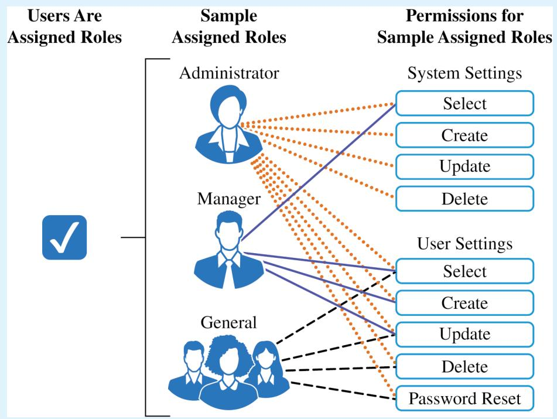  
FIGURE 5.2A: Access Control Model – Role-Based Access Control (RBAC)

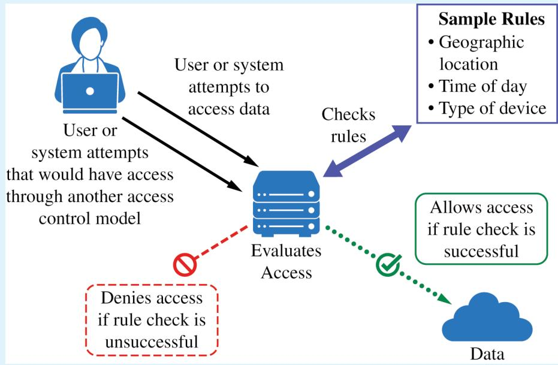  
FIGURE 5.2B: Access Control Model – Rule-Based Access Control (RuBAC)

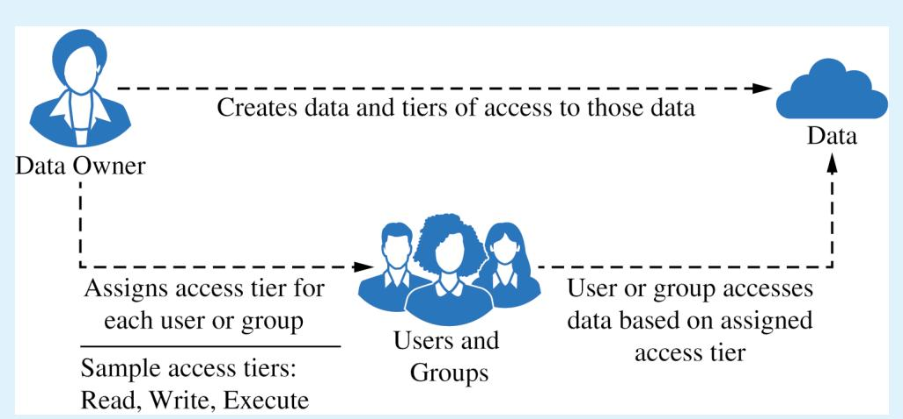

FIGURE 5.2C: Access Control Model – Discretionary Access Control (DAC)

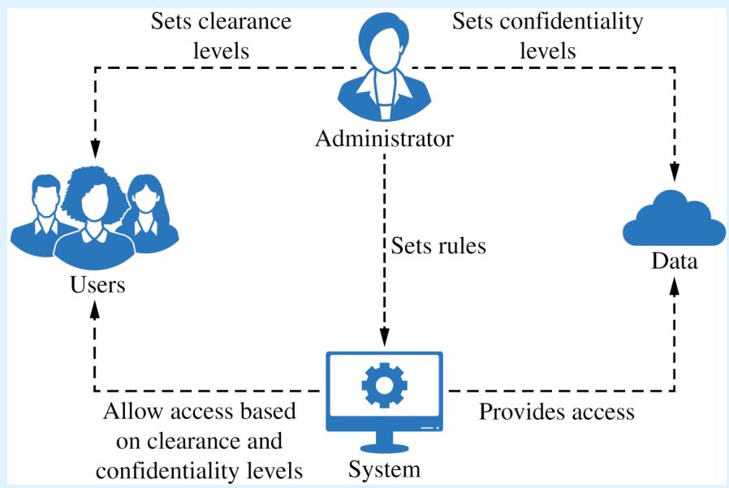  
FIGURE 5.2D: Access Control Model – Mandatory Access Control (MAC)

SUGGESTED SKILLS

2.A

Identify security controls, and explain how they mitigate risks.

## 2.D

Implement and log mitigations with and without the support of AI.

TOPIC 5.3

# Protecting Stored Data with Cryptography

## Required Course Content

## LEARNING OBJECTIVE

## 5.3.A

Explain how encryption can be used to protect files.

## ESSENTIAL KNOWLEDGE

## 5.3.A.1

The purpose of cryptography is to hide information. A cryptographic algorithm defines a process for encrypting and decrypting information. Encryption is the process of hiding the information, and decryption is the process of reversing the encryption to retrieve the original information.

## 5.3.A.2

An encryption algorithm defines a process for combining the information to be encrypted with a predefined key. The information to be encrypted is called the plaintext. The output of the encryption algorithm is called the ciphertext.

## 5.3.A.3

The number of possible keys that can be used in an encryption algorithm is called the keyspace. The larger the keyspace, the longer it will take an adversary to discover the correct key by random chance.

## 5.3.A.4

Cryptographic algorithms are classified by whether they use one key or two keys.

Symmetric encryption algorithms use the same key to encrypt and decrypt information.

Asymmetric encryption algorithms use two diferent keys—one to encrypt information and the other to decrypt information.

## 5.3.A

Explain how encryption can be used to protect files.

## 5.3.B

Apply symmetric encryption algorithms to encrypt and decrypt data.

## 5.3.A.5

Cryptographic algorithms are also classified by whether they process information one bit at a time or in fixed-size chunks of bits.

Block encryption handles information in fixed-size chunks called blocks, producing an output block for each input block.

Stream encryption handles input information continuously, producing output one element at a time.

## 5.3.B.1

Computer-based encryption algorithms operate on binary data. The most common symmetric encryption algorithm is the Advanced Encryption Standard (AES). AES encryption is used to secure Wi-Fi transmissions, internet browsing, file encryption on disks, and hardware-level encryption on processors.

## 5.3.B.2

AES is a symmetric key block cipher that encrypts data in 128-bit blocks (16 bytes). AES can operate with keys of varying lengths. Longer keys produce more secure encryption but require more time to encrypt and decrypt.

## 5.3.B.3

Symmetric encryption and decryption can be performed using the command line, specialized software, or web-based tools.

§ On a command line interface, users can encrypt or decrypt with OpenSSL.

§ Specialized software like AES Crypt is an open source tool that can encrypt and decrypt files.

There are many web-based tools for encrypting and decrypting files.

## 5.3.B.4

Using OpenSSL in a CLI, a user can encrypt and decrypt a file using the following commands (note that the encryption key is derived from the password provided):

To encrypt a file named test with AES using a 128-bit key, use the command: openssl enc -aes-128-cbc -e -in test -k password -out test.enc

To decrypt the encrypted file using the same key, use the command: openssl enc -aes-128-cbc -d -in test.enc -k password -out text

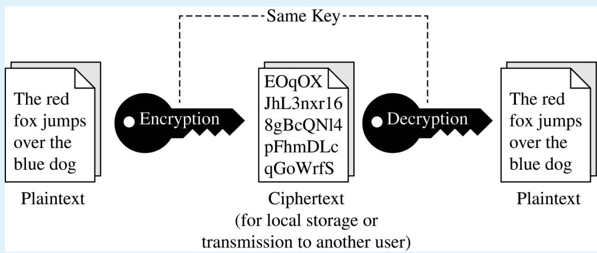  
FIGURE 5.3: Symmetric Encryption Algorithms

Symmetric encryption involves a single key encrypting and decrypting data. This helps ensure confidentiality between sender and receiver.

TOPIC 5.4

# Asymmetric Cryptography

SUGGESTED SKILLS

2.B

Determine layered security

controls that address

vulnerabilities.

## 2.D

Implement and log mitigations with and without the support of AI.

## Required Course Content

## LEARNING OBJECTIVE

## 5.4.A

Determine the appropriate asymmetric key to use when sending or receiving encrypted data.

## ESSENTIAL KNOWLEDGE

## 5.4.A.1

Asymmetric encryption allows users to communicate securely without prearranging a shared secret key.

## 5.4.A.2

When using asymmetric encryption, each entity that will be receiving data must first generate a key pair. Key pairs are binary strings of equal length that are generated at the same time through a mathematical process. One key is designated as the public key and the other as the private key. The keys are mathematical inverses of each other— each key reverses its partner. Either key can be used to encrypt information, but only the other key in the key pair will then be able to decrypt it.

## 5.4.A.3

Once the receiver generates the key pair, the private key must be stored securely. If the private key is exposed, shared, stolen, corrupted, or compromised the key pair must be deleted and a new key pair must be generated, because the security of the encryption algorithm rests on the security of the private key. The public key is published for anyone to view and use.

## 5.4.A.4

To send information securely to someone, the sender will use the receiver’s public key to encrypt the data and send it. Only the receiver who has the private key will be able to decrypt and read the information.

## 5.4.B

Explain why the length of a key impacts the security of encrypted data.

## 5.4.C

Apply asymmetric encryption algorithms to encrypt and decrypt data.

## 5.4.B.1

Longer keys result in larger keyspaces. For binary keys, an n-bit length key has a keyspace of 2<sup>n</sup>.

## 5.4.B.2

Using an application to randomly guess an n-bit length encryption key means that on average an adversary will be able to guess the correct key in 2<sup>n</sup>/2 or 2<sup>n 1−</sup> guesses.

## 5.4.B.3

Although longer keys are more secure, they also require more time to encrypt and decrypt messages.

## 5.4.B.4

Computational processing power and eficiency continue to improve, allowing software to guess keys faster. Key-length recommendations for both symmetric and asymmetric encryption algorithms are periodically increased to account for increased processing power.

## 5.4.B.5

Key-length comparison is only valid when comparing keys for the same cryptographic algorithm.

## ILLUSTRATIVE EXAMPLES

§ An AES 256-bit key is more secure than an AES 128-bit key.

§ An RSA 4096-bit key is more secure than an RSA 2048-bit key.

§ RSA and AES keys cannot be directly compared to one another in determining the level of security.

## 5.4.C.1

Common asymmetric encryption algorithms include RSA and elliptic curve cryptography (ECC). Asymmetric algorithms are used in many applications, including digital signatures and digital certificates.

## 5.4.C

Apply asymmetric encryption algorithms to encrypt and decrypt data.

## 5.4.C.2

As with symmetric encryption, asymmetric encryption and decryption can be performed using the command line, specialized software, or web-based tools.

§ On a command line interface, users can encrypt or decrypt with OpenSSL.

§ Specialized software like RSA Encryption Tool is an open source tool that can encrypt and decrypt files.

There are many web-based tools for encrypting and decrypting files.

## 5.4.C.3

In a CLI, a user can generate an asymmetric key pair and encrypt or decrypt files as necessary.

To generate a 2048-bit RSA key pair and save the key to a file named rsa.pem use the command: openssl genrsa -out rsa.pem 2048

To extract the public key from rsa.pem into a file named public.pem, use the command: openssl rsa -pubout -in rsa. pem -outform PEM -out public. pem

To encrypt the file test using RSA encryption and the key file public.pem, use the command: openssl pkeyutl -encrypt -pubin -inkey public.pem -in test -out test.enc

To decrypt the test.enc file using the rsa.pem file, run the command: openssl pkeyutl -decrypt -inkey rsa.pem -in test.enc -out test

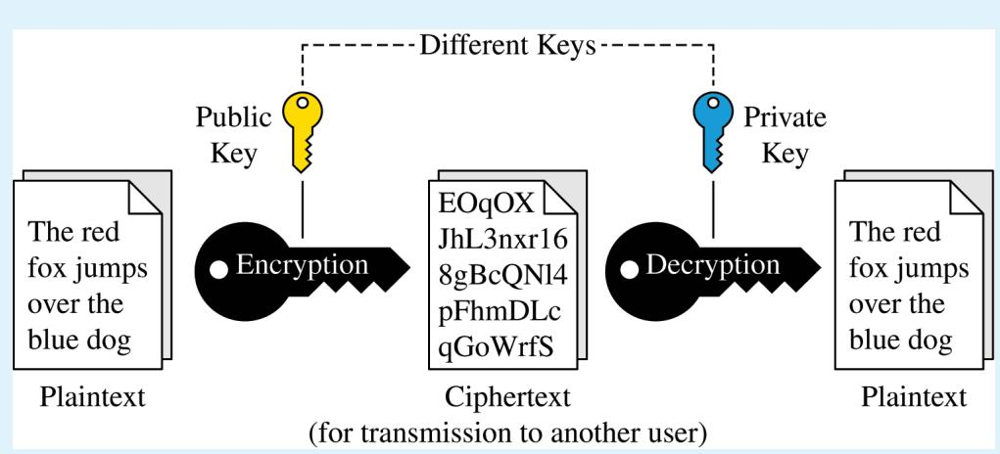  
FIGURE 5.4: Asymmetric Encryption Algorithms

Asymmetric encryption involves two keys: a public and a private key. In this encryption method, data encrypted with the public key can only be decrypted by the corresponding private key. This helps ensure secure communication and data integrity.

TOPIC 5.5

# Protecting Applications

SUGGESTED SKILLS

2.A

Identify security controls, and explain how they mitigate risks.

## Required Course Content

## LEARNING OBJECTIVE

## 5.5.A

Identify the application security principles of secure by design and security by default.

## ESSENTIAL KNOWLEDGE

## 5.5.A.1

Secure by design is an initiative that encourages companies to include security in all phases of product development including design. When organizations implement secure by design, security is a design principle not just a technical feature.

## 5.5.A.2

Secure by design includes three design principles:

Companies should take ownership of customer security outcomes. Companies should build products that meet the security needs of their customers.

ii. Companies should embrace radical transparency and accountability. Sharing relevant security-related product news and updates quickly increases security for everyone.

iii. Companies should build organizational structure and leadership to implement secure by design. Companies need leaders who are focused on security and have a security-first posture.

## 5.5.A.3

Secure by design includes the concept of secure by default, which is the idea that security features for software and devices should be enabled by default. Devices and software should be secure to use out of the box, with security features already enabled.

## 5.5.B

Explain how user input sanitization protects applications.

## 5.5.B.1

When users enter input into an application, the application typically encases that input in special characters to process it. The characters that encase the user input are called control characters and include the single quote, the double quote, and the semicolon.

## 5.5.B.2

When creating a program that takes user input, programmers should use a function to verify that user input meets their expected criteria and does not include any control characters that could be used to manipulate the system. This verification function can sanitize user input by removing potentially malicious characters, or it can give the user an error and force the user to provide diferent input. This can protect against many application attacks, including:

§ SQL injection attacks

§ XSS attacks

§ Directory traversal attacks

TOPIC 5.6

# Detecting Attacks on Data and Applications

SUGGESTED SKILLS

3.B

Determine strategies and methods to detect attacks.

3.D

Detect and classify cyberattacks by analyzing digital evidence with and without the support of AI.

## Required Course Content

## LEARNING OBJECTIVE

5.6.A

Explain how to detect attacks on data.

## ESSENTIAL KNOWLEDGE

## 5.6.A.1

Devices track and log when data are accessed and by whom. The process of recording and monitoring user activities is called accounting. Analysis of these logs can reveal malicious activity when an adversary attempts to access, copy, move, or delete data. Suspicious activity can include:

Accessing files that aren’t typically accessed

Accessing files or applications outside of a user’s normal patterns (including time of day, location, and device type)

§ Attempts to delete or copy sensitive files

## 5.6.A.2

A honeypot is a file that appears as if it contains valuable data (e.g., credit card information, PII, passwords), but the data in the file are fake. A system can alert defenders if someone attempts to access the honeypot. Since the honeypot is a fake file, there is no legitimate reason to be accessing it, and any attempted access would be an indicator of malicious activity.

## 5.6.A.3

Cryptographic hash functions can generate a digest for data and can reveal if data have been altered. If a file has changed unexpectedly, this can be a sign of malicious activity.

## 5.6.B

Determine controls for detecting attacks against applications or data.

## 5.6.C

Evaluate the impact of a method for detecting attacks against an application or data.

## 5.6.B.1

Cost is a criterion in determining detective controls. Detective controls like honeypots and using hash values to check data integrity are inexpensive. Some organizations invest in third-party data loss prevention (DLP) services, which monitor data access, usage, and transmission by users throughout the organization to detect suspicious activity; DLP services provide strong detection capabilities at a higher cost.

## 5.6.B.2

Sensitivity or criticality of data or applications is a criterion in determining detective controls. More sensitive or critical data or applications are more likely targets of an adversary and should be monitored more closely.

## 5.6.B.3

Classification of data is a criterion in determining detective controls. Data that have been classified as private, educational, healthcare, or financial often have legal or regulatory detection and monitoring requirements.

## 5.6.C.1

To operate at an efective speed, log analysis needs to be augmented with some automation. Honeypots ofer near instantaneous detection capabilities.

## 5.6.C.2

Some DLP tools, honeypots, and realtime automated log analysis provide alerts as an attack is happening. These tools allow for a prompt response that can stop an attack before it does more harm. Retrospective log analysis and the use of cryptographic hashes to verify data integrity identify attacks after they have occurred.

## 5.6.C.3

False negatives can occur in applications and data attack detection. Cryptographic hash functions only detect if data have been altered. An adversary could view and steal data without altering it, and a cryptographic hash function would not detect this. Honeypots cannot detect adversaries that do not attempt to access them.

## 5.6.D

Identify whether a file has been altered by verifying its hash.

## 5.6.D.1

Cryptographic hash functions can help identify changes in a file because they are repeatable: the same input always produces the same output for a given hash function.

## 5.6.D.2

Hashes can be calculated using the command line on a computer, a website, or specialized software.

In Windows Powershell, if a user wanted to generate the SHA256 hash for a file named testfile, they would use the command:

Get-FileHash testfile -Algorithm SHA256

In BASH the same could be accomplished with the command: sha256sum testfile

In zsh, the common command line terminal on Apple computers, this could be accomplished with the command: shasum -a 256 testfile

## 5.6.D.3

Apply detection techniques to identify and report indicators of application attacks by analyzing log files.

A file can be hashed and its hash output recorded. Then it can be hashed again later, and the second hash output can be compared to the previous hash output for the same file. If a file’s hash changes, then the file was altered between when the first and second hashes were generated.

## 5.6.E

## 5.6.E.1

SQL injection attacks can be detected by reviewing application and server logs of user input for SQL control words and symbols such as:

§ A single or double quote character:

§ Boolean conditions like OR 1=1

§ A double dash (which indicates a comment in SQL):

§ SQL control words (always in capital letters) like WHERE, IN, FROM

## 5.6.E.2

XSS attacks can be detected by reviewing user input for suspicious tags, particularly the <script>...</script> tag.

## 5.6.E

Apply detection techniques to identify and report indicators of application attacks by analyzing log files.

## 5.6.E.3

For web applications, bufer overflows can be detected by checking the amount of data the user is sending to the web application in their request. The fields commonly checked are the URL length, cookie length, query string length, and total request length. Long strings in any of these fields can be an indicator of an attempted bufer overflow attack.

## 5.6.E.4

Directory traversal attacks can be detected by reviewing application and server logs. HTTP GET requests that include paths with sequences of ../ are indicators of an adversary attempting a directory traversal.


## Exam Information

AP CYBERSECURITY

## Exam Overview

The AP Cybersecurity Exam assesses student understanding of the skills and learning objectives outlined in the course framework. The exam is 2 hours and 10 minutes long and includes 60 multiple-choice questions and 1 free-response question.

<table><tr><td>Section</td><td>Question Type</td><td>Number of Questions</td><td>Exam Weighting</td><td>Timing</td></tr><tr><td>I</td><td>Multiple-Choice Questions</td><td>60</td><td>70%</td><td>80 Minutes</td></tr><tr><td>II</td><td>Free-Response Questions</td><td>1</td><td>30%</td><td>50 Minutes</td></tr></table>

# How Student Learning Is Assessed on the AP Exam

## Section I: Multiple-Choice

The multiple-choice section of the AP Cybersecurity Exam includes 60 multiplechoice questions. All five units of the course are assessed in the multiple-choice section of the AP Cybersecurity Exam. The assessment is organized around course skills with the following weighting.

<table><tr><td>Units of Instruction</td><td>Approximate Exam Weighting for Multiple-Choice Section</td></tr><tr><td>Skill Category 1: Analyze Risk</td><td>25–40%</td></tr><tr><td>Skill Category 2: Mitigate Risk</td><td>25–40%</td></tr><tr><td>Skill Category 3: Detect Attacks</td><td>25–40%</td></tr></table>

## Section II: Free-Response

The second section of the AP Cybersecurity Exam includes one free-response question.

Device Security Analysis will provide students with several simulated sources about a single digital device. Sources may include security policies, firewall configurations, file-system permissions, and log files. The question will assess students’ ability to analyze the provided sources to identify security issues, detect evidence of attacks, describe how configuration or permission changes would afect the device and users, and evaluate how security controls, such as firewalls or automated systems, influence network trafic and device behavior. Students will be expected to cite evidence from the provided sources and explain their reasoning when describing attacks, permission settings, or the impact of policy or configuration modifications. The suggested time for this question is 50 minutes. Skill Categories 2 and 3 are assessed.

# Task Verbs Used in Free-Response Questions

The following task verbs are commonly used in free-response questions:

Identify: Provide information about cybersecurity concepts or evidence from the given sources.

Explain: Provide reasons that support a solution or that account for how an outcome occurs, using specific evidence to validate your conclusion.

Describe: Provide information about a cybersecurity process or outcome.

Determine: Using the given sources, provide a specific result by applying appropriate criteria or reasoning.

Write: Express in print form a proper command that has the indicated efect.

# Sample Exam Questions

The sample exam questions that follow illustrate the relationship between the course framework and the AP Cybersecurity Exam and serve as examples of the types of questions that appear on the exam. After the sample questions is a table that shows which skill(s) and learning objective(s) each question assesses. The table also provides the answers to the multiple-choice questions.

## Section I: Multiple-Choice Questions

The following are examples of the kinds of multiple-choice questions found on the exam.

1. A cybersecurity analyst recently completed a review of a hotel’s security. Consider the following information from their report.

§ The hotel’s Wi-Fi extends to the parking area, allowing outsiders potential access to the network.

§ Open network ports in the conference center connect to the hotel’s internal network and could enable spoofing of a legitimate device.

§ Guest feedback tablets in the lobby use a shared Wi-Fi network, exposing nonsensitive customer satisfaction data.

§ Model numbers of printers and the firmware versions the printers are running are visible on the internal network, revealing some information about devices on the network.

Which of the following risks would the cybersecurity analyst most likely document as a high risk?

(A) The hotel’s Wi-Fi extending to the parking area

(B) Open network ports in the conference center

(C) Guest feedback tablets using a shared Wi-Fi network

(D) The model numbers of printers and the firmware versions the printers are running being visible

<table><tr><td>From: ManagementTo: Security Manager</td></tr><tr><td>Subject: New Access Rules for Transaction System</td></tr><tr><td>Thank you for implementing access restrictions on our internal applications.</td></tr><tr><td>We are now interested in applying additional security rules that automatically limit user access based on specific conditions. For example, access to the transaction system should only be allowed during business hours and from devices connected to the corporate network.</td></tr><tr><td>Thanks!</td></tr></table>

<table><tr><td>(A)</td><td>chmod 444 Oak_Park_HS</td></tr><tr><td>(B)</td><td>chmod 640 Oak_Park_HS</td></tr><tr><td>(C)</td><td>chmod 740 Oak_Park_HS</td></tr><tr><td>(D)</td><td>chmod 777 Oak_Park_HS</td></tr></table>

2. A school district wants to ensure that only the school principal (kmurray) can edit faculty evaluation reports and to limit permissions for everyone else. The district’s system administrator wants to set the following permission for the file Oak\_Park\_HS, which contains the faculty evaluations.

```txt
-rw-r---- kmurray staff 2048 Sep 18 10:45 Oak_Park_HS
```

Which of the following commands can be used to set the permissions shown?

## 3. Consider the following email.

Which of the following access control models best meets the request in the email? (A) DAC (B) MAC (C) RBAC (D) RuBAC

4. A network technician is unable to access a server using port 443 from a machine with an IP address of 192.168.45.37. Consider the following access control list (ACL) for the server’s firewall.

<table><tr><td>Rule Number</td><td>Allow/Deny</td><td>Direction</td><td>Protocol</td><td>Port</td><td>Source</td></tr><tr><td>1</td><td>Allow</td><td>Inbound</td><td>TCP</td><td>22</td><td>ALL</td></tr><tr><td>2</td><td>Allow</td><td>Inbound</td><td>TCP</td><td>80</td><td>ALL</td></tr><tr><td>3</td><td>Deny</td><td>Inbound</td><td>TCP</td><td>443</td><td>192.168.0.0 - 192.168.255.255</td></tr><tr><td>4</td><td>Allow</td><td>Inbound</td><td>ICMP</td><td>ALL</td><td>ALL</td></tr><tr><td>5</td><td>Allow</td><td>Inbound</td><td>TCP</td><td>3306</td><td>ALL</td></tr><tr><td>6</td><td>Deny</td><td>Inbound</td><td>TCP</td><td>3389</td><td>ALL</td></tr><tr><td>7</td><td>Allow</td><td>Inbound</td><td>TCP</td><td>443</td><td>ALL</td></tr><tr><td>8</td><td>Allow</td><td>Inbound</td><td>TCP</td><td>587</td><td>ALL</td></tr><tr><td>9</td><td>Deny</td><td>Inbound</td><td>TCP</td><td>8140</td><td>192.168.45.0 - 192.168.45.255</td></tr><tr><td>10</td><td>Deny</td><td>Inbound</td><td>ALL</td><td>ALL</td><td>ALL</td></tr></table>

W hich of the following changes to the firewall would allow the network technician to access the server?

(A) Swap firewall rule 1 with firewall rule 10

(B) Swap firewall rule 3 with firewall rule 4

(C) Swap firewall rule 3 with firewall rule 7

(D) Swap firewall rule 4 with firewall rule 7

5. A system administrator runs two hashing functions on four files. Consider the following outputs for the two hashing functions.

Function 1 outputs

file1.txt - 8d8e115e5ebc50c8e03930beac6802a94ef4f36ab

file2.txt - 79a7d08081d12ecf123d63845e38c14c09956ee79

file3.txt - 02db6aefd093c317f8cf78a2fbe52a31b58a6bc5e

file4.txt - bcd3cf9d8527f711031d0d908d84cbb0df97ce90b

Function 2 outputs

file1.txt - 804537a7adfa4e1bce4d72d0b212a80af2dae3a5e

file2.txt - ba429665c8b95d05a963ee89fded2c7f18892d13e

file3.txt - 804537a7adfa4e1bce4d72d0b212a80af2dae3a5e

file4.txt - 7fa2901ebbb731eb283487afc033e45dae210a89e

Which of the following statements is supported by the file hashes?

(A) The files file1.txt and file3.txt are exact copies of each other.

(B) Function 1 is more secure than Function 2.

(C) Function 1 and Function 2 are the same hashing function.

(D) The files file1.txt and file3.txt have a collision in one hashing function.

6. The security manager at a hospital is planning to upgrade the hospital’s physical security system to ensure that only authorized personnel can access areas containing sensitive medical equipment and patient records. Because these areas require a high level of security, the manager wants an authentication method that is unique to each individual and extremely dificult for an adversary to duplicate or spoof. Which of the following authentication methods is best suited for these areas?

(A) Authentication token

(B) Password

(C) Retina scan

(D) Access card

7. Which of the following best describes how ofline password attacks work?

(A) Adversaries attempt user:password combinations in an active authentication portal.

(B) Adversaries intercept communication as it travels across a network and read the password in transit.

(C) Adversaries exploit weak access controls to directly retrieve plaintext passwords stored in a database.

(D) Adversaries use automated tools to hash many potential passwords and compare them to a captured hash.

## Questions 8 through 10 refer to the following.

Consider the following email that was identified and reported as a phishing attempt.

## From: Human Resources

## To: All Employees

## Subject: Final Reminder — Deadline Today!

Our records indicate that your employee profile is incomplete. In order to remain in compliance with company-wide HR standards, all staf must confirm their personal information by the end of the day. Failure to respond by this deadline may result in suspension of payroll access until your profile is verified.

Please note: Over 92% of employees have already completed this verification, and you are among the last to finalize your record.

To confirm your employee file, reply to this email with the following details:

1. Personal phone number

2. Pet’s name (for verification)

3. Date of birth

We appreciate your cooperation in keeping our records accurate and ensuring continued access to employee services.

Thank you,

## Human Resources

8. Which of the following shows how the email uses urgency to pressure the recipient into responding?

(A) The recipient is warned that they must confirm their personal information by the end of the day.

(B) The recipient is warned that failure to comply could result in payroll suspension.

(C) The recipient is encouraged to help human resources keep their records accurate.

(D) The recipient is told that the message comes from a trusted internal department.

9. How does the email’s claim that “Over 92% of employees have already completed the verification” attempt to pressure the recipient into responding to the email?

(A) By framing the request as routine HR communication that seems safe, showing the use of familiarity

(B) By implying that the opportunity to comply is limited and may soon be lost, showing the use of scarcity

(C) By presenting the request as coming from those in power and intimidating the recipient, showing the use of authority

(D) By applying social pressure and making the recipient believe most coworkers have already acted, showing the use of consensus

10. Which of the following is the most likely impact if the recipient responds to this email with the requested information?

(A) An adversary could use the recipient’s personal details to impersonate them.

(B) An adversary could use the recipient’s device as a foothold and move laterally on the network compromising other devices.

(C) An adversary could infect the recipient’s device with malicious code hidden in the reply email.

(D) An adversary could disrupt the entire payroll system by disabling access for all employees.

11. A natural gas company’s help desk receives reports from employees that the company’s website is intermittently crashing when they try to log in. The cybersecurity analyst reviews the server’s access logs and finds the following entries.

[22/Oct/2025:10:11:02] "GET /index.html HTTP/1.1" 200 4521

[22/Oct/2025:10:11:07] "GET /about.html HTTP/1.1" 200 3890

[22/Oct/2025:10:11:10] "GET ../../../../etc/passwd HTTP/1.1" 403 721

[22/Oct/2025:10:11:12] "GET ../../../../etc/shadow HTTP/1.1" 403 654

Which of the following application attacks is indicated in the log file?

(A) Bufer overflow attack

(B) Cross site scripting attack

(C) Directory traversal attack

(D) SQL injection attack

12. The system administrator at a high school receives an alert that there may have been multiple unauthorized login attempts to the school’s online grading system. To investigate, the administrator decides to review the authentication logs. Which of the following best describes how authentication logs can be used to determine whether unauthorized login attempts have occurred?

(A) The logs record which password was used in each login attempt, which allows the administrator to verify account ownership.

(B) The logs record all login activity, which allows the administrator to reconstruct when and how login attempts occurred.

(C) The logs record the location of each user attempting to log in, which allows the administrator to identify login attempts from other geographic regions.

(D) The logs record the type of device attempting to log in, which allows the administrator to block unauthorized devices.

13. The network administrator for a manufacturing facility has implemented a signature-based network detection system. Which of the following is a potential impact of using this network detection method instead of anomaly-based detection?

(A) More false negative alerts

(B) Higher operating costs

(C) Slower detection time

(D) More alert fatigue

14. Consider the following lines from a log file.

2025-09-25 08:01:14 ARP Reply: 192.168.1.13 is-at 00:01:5e:00:fc:16 2025-09-25 09:14:15 ARP Reply: 192.168.1.13 is-at 00:3b:cc:5e:ee:01

Which of the following attack types is indicated in the log file?

(A) ARP poisoning attack

(B) DNS poisoning attack

(C) Evil-twin attack

(D) MAC flooding attack

15. Which of the following best describes the length of a cryptographic hash function output?

(A) The length of the output is longer than the input due to the hashing process.

(B) The length of the output is fixed regardless of the length of the input.

(C) The length of the output varies based on the length of the input.

(D) The length of the output is shorter than the length of the input.

16. A state’s National Guard base is documenting cybersecurity risks from physical vulnerabilities. Which of the following would be classified as a moderate risk?

(A) An unlocked trailer containing non-networked ofice equipment that cannot be used to access sensitive systems

(B) A locked warehouse with noncritical computers that could be a foothold to access other network resources

(C) A publicly accessible touchscreen directory for visitors that contains no sensitive data and is unlikely to be exploited

(D) A main server room that contains sensitive systems and information and does not have suficiently restricted or controlled access

## Questions 17 through 20 refer to the following.

## Consider the following article.

Small Town Bank Disrupts Attempted Cyber Attack on Customer Database

Fairgrove Community Bank, a local financial institution serving residents of central Kentucky, reported that it successfully stopped a cyber intrusion attempt earlier this week aimed at its customer database.

The attack was detected on Tuesday afternoon when automated security systems flagged unusual database queries originating from the bank’s online loan application form. Investigators determined that the form was being used to input malicious code.

“One of the strings the adversary submitted included ‘ OR ‘1‘=‘1‘;- -, ” said James Holloway, a network administrator at Fairgrove Community Bank. “That’s a common trick pulled from online tutorials.”

Holloway said the attacker did not succeed in accessing any customer data, but the attempt revealed a flaw in the bank’s web application.

Fairgrove Community Bank’s security team has since patched the vulnerability. No data was compromised, and banking operations continued without interruption.

“This wasn’t some advanced adversary,” Holloway added. “They were copying code from the internet and testing to see if anything would work. But even simple attacks like this can work if we don’t implement best practices.”

Fairgrove Community Bank says it is conducting a full audit of its customer-facing applications to ensure proper protections are in place.

17. Which of the following best describes the adversary in this scenario? (A) Cyberterrorist (B) Script kiddie (C) State actor (D) Insider

18. Which of the following types of attacks occurred when the adversary submitted a string that included ‘ OR ‘1‘=‘1‘;--?

(A) SQL injection attack

(B) Bufer overflow attack

(C) Cross site scripting attack

(D) Directory traversal attack

19. Which of the following security controls would most likely prevent an attack like this in the future? (A) Encryption (B) Stateful firewall (C) Input sanitization (D) Access control list

20. Which of the following best explains how the adversary attempted to manipulate the bank’s customer database through the online loan application form?

(A) When user input is fed into a server’s file system, HTTP requests can access sensitive data.

(B) When user input contains executable scripts, those scripts can run in the user’s browser and access sensitive data.

(C) When user input exceeds the size of the designated memory, it can allow the adversary to access, modify, and delete files.

(D) When user input from a web form is fed directly into a database query, an adversary can inject control characters that can allow an adversary to view or modify the contents of a database.

21. An organization only allows their users to log into a system if they are physically in one of the following time zones (a time zone is a region where everyone uses the same clock time).

§ Eastern time zone

§ Central time zone

§ Mountain time zone

§ Pacific time zone

Which of the following authentication factors is being used to verify the identity of the users?

(A) Biometric factor

(B) Knowledge factor

(C) Location factor

(D) Possession factor

22. A hospital’s security manager has implemented an automated network security tool with the following functions.

§ The tool analyzes network trafic for signs of malicious activity so the security team can quickly spot potential threats.

The tool generates an alert when suspicious or malicious trafic is detected because the hospital wants to be notified right away if an attack is attempted.

§ The tool does not take direct action to block or stop the trafic itself because the hospital wants administrators to decide how to respond to threats.

Which of the following security systems did the security manager implement?

(A) Data loss prevention system

(B) Network intrusion prevention system

(C) Network intrusion detection system

(D) Security information and event management system

## Section II: Free-Response Question

The following is an example of the free-response question found on the exam.

## Device Security Analysis

The following sources all come from the same device and are captured in a risk assessment for this device.

## Source 1

The device’s IP address is 192.168.1.10.

Device Firewall Settings

<table><tr><td>Rule Number</td><td>Action</td><td>Source</td><td>Destination</td><td>Direction</td><td>Port Number</td><td>Protocol</td></tr><tr><td>1</td><td>Deny</td><td>172.45.66.184</td><td>192.168.1.10</td><td>Inbound</td><td>22</td><td>SSH</td></tr><tr><td>2</td><td>Allow</td><td>ALL</td><td>192.168.1.10</td><td>Inbound</td><td>21</td><td>FTP</td></tr><tr><td>3</td><td>Allow</td><td>ALL</td><td>192.168.1.10</td><td>Inbound</td><td>80</td><td>HTTP</td></tr><tr><td>4</td><td>Allow</td><td>ALL</td><td>192.168.1.10</td><td>Inbound</td><td>445</td><td>SMB</td></tr><tr><td>5</td><td>Allow</td><td>ALL</td><td>192.168.1.10</td><td>Inbound</td><td>443</td><td>HTTPS</td></tr><tr><td>6</td><td>Allow</td><td>ALL</td><td>192.168.1.10</td><td>Inbound</td><td>22</td><td>SSH</td></tr><tr><td>7</td><td>Allow</td><td>172.45.66.184</td><td>192.168.1.10</td><td>Inbound</td><td>3306</td><td>MySQL</td></tr><tr><td>8</td><td>Allow</td><td>ALL</td><td>192.168.1.10</td><td>Inbound</td><td>3389</td><td>RDP</td></tr><tr><td>9</td><td>Allow</td><td>192.168.1.50</td><td>192.168.1.10</td><td>Inbound</td><td>5900</td><td>VNC</td></tr><tr><td>10</td><td>Deny</td><td>ALL</td><td>ALL</td><td>Inbound</td><td>ALL</td><td>ALL</td></tr></table>

## Source 2

```yaml
sudo tail -n 30 /var/log/app/network_app.log
1 - Nov 10 09:00:11 ubuntu sudo: jprice : TTY=pts/0 ;
PWD=/home/jprice ; USER=root ; COMMAND=/usr/bin/
less/var/log/syslog

2 - Nov 10 09:00:15 ubuntu sudo: pam_unix(sudo:
session): session opened for user root by
jprice(uid=1000)

3 - Nov 10 09:00:35 ubuntu apt-get[1345]: Get:1
http://archive.ubuntu.com jammy InRelease [265 kB]

4 - Nov 10 09:00:46 ubuntu apt-get[1345]: Get:2
http://security.ubuntu.com jammy-security InRelease
[110 kB]

5 - Nov 10 09:00:55 ubuntu apt-get[1345]: Fetched
375 kB in 19s (19.7 kB/s)

6 - Nov 10 09:01:00 ubuntu apt-get[1345]: Reading
package lists... Done

7 - Nov 10 09:01:01 ubuntu sudo: pam_unix(sudo:
session):
session closed for user root

8 - Nov 10 09:02:14 ubuntu jprice: executed command:
'ufw status verbose'

9 - Nov 10 09:02:14 ubuntu jprice: executed command:
'systemctl status apache2'

10 - Nov 10 09:02:16 ubuntu jprice: executed command:
'tail -n /var/log/auth.log'

11 - Nov 10 09:03:10 ubuntu jprice: executed
command: 'systemctl status apache2'

12 - Nov 10 09:03:35 ubuntu systemd[1]: Starting
Daily apt download activities...

13 - Nov 10 09:03:36 ubuntu systemd[1]: Finished
Daily apt download activities.

14 - Nov 10 09:04:00 ubuntu jprice: executed
command: 'ss -tuln'

15 - Nov 10 09:04:01 ubuntu jprice: executed
command: 'cat/etc/ufw/user.rules'

16 - Nov 10 09:05:11 ubuntu jprice: executed
command: 'journalctl -xe'

17 - Nov 10 09:05:32 ubuntu jprice: executed
command: 'df -h'

18 - Nov 10 09:05:50 ubuntu jprice: executed
command: 'du -sh/var/log'
```

```txt
19 - Nov 10 09:06:02 ubuntu jprice: executed command: 'top -n 1'

20 - Nov 10 09:06:33 ubuntu jprice: executed command: 'curl -I http://localhost'

21 - Nov 10 09:06:33 ubuntu sudo: pam_unix(sudo:session): session opened for user root by jprice(uid=1000)

22 - Nov 10 09:06:34 ubuntu sudo: pam_unix(sudo:session): session closed for user root

23 - Nov 10 09:07:01 ubuntu CRON[1773]: pam_unix(cron:session): session opened for user root by (uid=0)

24 - Nov 10 09:07:01 ubuntu CRON[1773]: pam_unix(cron:session): session closed for user root

25 - Nov 10 09:07:45 ubuntu jprice: executed command: 'ip addr'

26 - Nov 10 09:07:47 ubuntu jprice: executed command: 'netstat - tulnp'

27 - Nov 10 09:08:10 ubuntu jprice: executed command: 'ufw status verbose'

28 - Nov 10 09:08:11 ubuntu systemd[1]: Reloading firewall rules (ufw.service)...

29 - Nov 10 09:08:11 ubuntu systemd[1]: Reloaded firewall rules (ufw.service).

30 - Nov 10 09:08:20 ubuntu jprice: executed command: 'exit'
```

## Source 3

```batch
sudo tail -n 30 /var/log/auth.log
1 - Nov 10 14:11:43 ubuntu sshd[1123]: Server listening on 0.0.0.0 port 22.
2 - Nov 10 14:11:43 ubuntu sshd[1123]: Server listening on :: port 22.
3 - Nov 10 14:21:01 ubuntu vsftpd[2184]: Failed login for invalid user admin from 203.0.113.25 port 21 ftp
4 - Nov 10 14:21:02 ubuntu vsftpd[2186]: Failed login for invalid user root from 203.0.113.25 port 21 ftp
5 - Nov 10 14:21:03 ubuntu vsftpd[2188]: Failed login for invalid user test from 203.0.113.25 port 21 ftp
6 - Nov 10 14:21:04 ubuntu vsftpd[2190]: Failed login for invalid user guest from 203.0.113.25 port 21 ftp
7 - Nov 10 14:21:05 ubuntu vsftpd[2192]: Failed login for invalid user ubuntu from 203.0.113.25 port 21 ftp
```

```txt
8 - Nov 10 14:21:06 ubuntu vsftpd[2194]: Failed login for invalid user deploy from 203.0.113.25 port 21 ftp
9 - Nov 10 14:21:07 ubuntu vsftpd[2196]: Failed login for invalid user support from 203.0.113.25 port 21 ftp
10 - Nov 10 14:21:08 ubuntu vsftpd[2198]: Failed login for invalid user admin1 from 203.0.113.25 port 21 ftp
11 - Nov 10 14:21:09 ubuntu vsftpd[2200]: Failed login for invalid user oracle from 203.0.113.25 port 21 ftp
12 - Nov 10 14:21:10 ubuntu vsftpd[2202]: Failed login for invalid user ftp from 203.0.113.25 port 21 ftp
13 - Nov 10 14:22:14 ubuntu sshd[2234]: Connection closed by authenticating user jprice 192.168.1.50 port 22 [preauth]
14 - Nov 10 14:22:15 ubuntu sshd[2234]: Accepted password for jprice from 192.168.1.50 port 22 ssh2
15 - Nov 10 14:22:15 ubuntu sshd[2234]:
pam_unix(sshd:session): session opened for user jprice by (uid=0)
16 - Nov 10 14:25:47 ubuntu sudo: jprice : TTY=pts/0 ; PWD=/home/jprice ; USER=root ; COMMAND=/usr/bin/apt update
17 - Nov 10 14:25:47 ubuntu sudo:
pam_unix(sudo:session): session opened for user root by jprice(uid=1000)
18 - Nov 10 14:25:48 ubuntu sudo:
pam_unix(sudo:session):session closed for user root
19 - Nov 10 14:28:02 ubuntu sshd[2331]: Connection closed by 203.0.113.25 [preauth]
20 - Nov 10 14:29:01 ubuntu CRON[2345]:
pam_unix(cron:session): session opened for user root by (uid=0)
21 - Nov 10 14:29:01 ubuntu CRON[2345]:
pam_unix(cron:session): session closed for user root
22 - Nov 10 14:30:17 ubuntu kernel: [UFW BLOCK]
IN=eth0 OUT= SRC=203.0.113.25 DST=192.168.1.10 PROTO=TCP PORT=25 SYN
23 - Nov 10 14:30:18 ubuntu sshd[2369]: Failed password for invalid user user from 203.0.113.25 port 22 ssh2
24 - Nov 10 14:30:18 ubuntu sshd[2370]: Received disconnect from 203.0.113.25 port 49151:11: Bye Bye [preauth]
```

```txt
25 - Nov 10 14:30:18 ubuntu kernel: [UFW BLOCK]
IN=eth0 OUT= SRC=203.0.113.25 DST=192.168.1.10
PROTO=TCP PORT=77 SYN

26 - Nov 10 14:31:55 ubuntu systemd-logind[99]: New session 7 of user jprice.

27 - Nov 10 14:31:55 ubuntu systemd: Started Session 7 of user jprice.

28 - Nov 10 14:31:55 ubuntu sudo: jprice : TTY=pts/0 ; PWD=/home/jprice ; USER=root ; COMMAND=/usr/bin/journalctl -xe

29 - Nov 10 14:31:55 ubuntu sudo:
pam_unix(sudo:session): session opened for user root by jprice(uid=1000)

30 - Nov 10 14:31:56 ubuntu sudo:
pam_unix(sudo:session): session closed for user root
```

## Source 4

```batch
sudo tail -n 30 /var/log/nginx/access_log
1 - 192.168.1.50 - jprice [10/Nov/2025:09:02:14 -0500] "GET/index.html HTTP/1.1" 200 4212 "-" "Mozilla/5.0 (Ubuntu)"
2 - 192.168.1.50 - jprice [10/Nov/2025:09:02:15 -0500] "GET /assets/css/style.css HTTP/1.1" 200 1024 "-" "Mozilla/5.0 (Ubuntu)"
3 - 192.168.1.50 - jprice [10/Nov/2025:09:02:15 -0500] "GET /assets/js/main.js HTTP/1.1" 200 2876 "-" "Mozilla/5.0 (Ubuntu)"
4 - 192.168.1.50 - jprice [10/Nov/2025:09:02:16 -0500] "GET /images/logo.png HTTP/1.1" 200 2048 "-" "Mozilla/5.0 (Ubuntu)"
5 - 192.168.1.50 - jprice [10/Nov/2025:09:02:17 -0500] "GET /about.html HTTP/1.1" 200 3198 "-" "Mozilla/5.0 (Ubuntu)"
6 - 192.168.1.50 - jprice [10/Nov/2025:09:02:18 -0500] "GET /contact.html HTTP/1.1" 200 2951 "-" "Mozilla/5.0 (Ubuntu)"
7 - 192.168.1.50 - jprice [10/Nov/2025:09:02:20 -0500] "POST /contact_form HTTP/1.1" 200 87 "https://example.local/contact.html" "Mozilla/5.0 (Ubuntu)"
8 - 192.168.1.50 - jprice [10/Nov/2025:09:02:21 -0500] "GET /dashboard HTTP/1.1" 200 4981 "-" "Mozilla/5.0 (Ubuntu)"
```

```txt
9 - 192.168.1.55 - - [10/Nov/2025:09:03:10 -0500]
"GET /api/user/profile?id=12 HTTP/1.1" 200 614 "-" "curl/7.81.0"

10 - 192.168.1.55 - - [10/Nov/2025:09:03:11 -0500] "GET /api/data/list HTTP/1.1" 200 1187 "-" "curl/7.81.0"

11 - 192.168.1.55 - - [10/Nov/2025:09:03:12 -0500]
"POST /api/user/update HTTP/1.1" 200 152 "-" "curl/7.81.0"

12 - 10.0.0.5 - admin [10/Nov/2025:09:04:01 -0500] "GET /admin/login HTTP/1.1" 200 4329 "-" "Mozilla/5.0 (Windows NT 10.0)"
13 - 10.0.0.5 - admin [10/Nov/2025:09:04:02 -0500]
"POST /admin/login HTTP/1.1" 302 112 "https://example.local/admin/login" "Mozilla/5.0 (Windows NT 10.0)"
14 - 10.0.0.5 - admin [10/Nov/2025:09:04:03 -0500]
"GET /admin/dashboard HTTP/1.1" 200 6275 "-" "Mozilla/5.0 (Windows NT 10.0)"
15 - 203.0.113.45 - - [10/Nov/2025:09:04:11 -0500]
"GET ../../../../etc/passwd HTTP/1.1" 400 234 "-" "curl/7.68.0"
16 - 203.0.113.45 - - [10/Nov/2025:09:04:12 -0500]
"GET ../../../etc/shadow HTTP/1.1" 403 312 "-" "curl/7.68.0"
17 - 203.0.113.45 - - [10/Nov/2025:09:04:13 -0500]
"GET ../../../var/www/html/config.php.bak HTTP/1.1" 404 198 "-" "curl/7.68.0"
18 - 192.168.1.55 - - [10/Nov/2025:09:04:15 -0500]
"GET /api/status HTTP/1.1" 200 94 "-" "curl/7.81.0"
19 - 192.168.1.50 - jprice [10/Nov/2025:09:04:16 -0500] "GET /logout HTTP/1.1" 302 51 "-" "Mozilla/5.0 (Ubuntu)"
20 - 192.168.1.50 - jprice [10/Nov/2025:09:04:17 -0500] "GET /login.html HTTP/1.1" 200 3811 "-" "Mozilla/5.0 (Ubuntu)"
21 - 192.168.1.50 - jprice [10/Nov/2025:09:05:00 -0500] "GET /favicon.ico HTTP/1.1" 200 428 "-" "Mozilla/5.0 (Ubuntu)"
22 - 192.168.1.50 - jprice [10/Nov/2025:09:05:22 -0500] "GET /docs/index.html HTTP/1.1" 200 2491 "-" "Mozilla/5.0 (Ubuntu)"
23 - 192.168.1.55 - - [10/Nov/2025:09:05:23 -0500]
"GET /api/docs HTTP/1.1" 200 682 "-" "curl/7.81.0"
24 - 192.168.1.50 - jprice [10/Nov/2025:09:05:25 --o5o] "GET /help HTTP/1.1" 2O O 4I22 "-" "Mozilla/5.0 (Ubuntu)"
```

```txt
25 - 192.168.1.55 - - [10/Nov/2025:09:05:26 -0500] "GET /api/user/profile?id=14 HTTP/1.1" 200 637 "-" "curl/7.81.0"
26 - 10.0.0.5 - admin [10/Nov/2025:09:05:27 -0500] "GET /admin/settings HTTP/1.1" 200 5214 "-" "Mozilla/5.0 (Windows NT 10.0)"
27 - 10.0.0.5 - admin [10/Nov/2025:09:05:28 -0500] "POST /admin/update HTTP/1.1" 200 164 "-" "Mozilla/5.0 (Windows NT 10.0)"
28 - 192.168.1.50 - jprice [10/Nov/2025:09:05:29 -0500] "GET /assets/js/analytics.js HTTP/1.1" 200 1193 "-" "Mozilla/5.0 (Ubuntu)"
29 - 192.168.1.50 - jprice [10/Nov/2025:09:05:30 -0500] "GET /HTTP/1.1" 200 4231 "-" "Mozilla/5.0 (Ubuntu)"
30 - 192.168.1.50 - jprice [10/Nov/2025:09:05:31 -0500] "GET /images/banner.jpg HTTP/1.1" 200 3087 "-" "Mozilla/5.0 (Ubuntu)"
```

## Source 5

<table><tr><td colspan="7">ls -l /home/jprice/Documents</td></tr><tr><td>-rw-r--r--</td><td>1 jprice</td><td>jprice</td><td>2143</td><td>Nov 08</td><td>09:15</td><td>report.txt</td></tr><tr><td>-rw----</td><td>1 jprice</td><td>jprice</td><td>1024</td><td>Nov 02</td><td>09:01</td><td>secrets.key</td></tr><tr><td>-rwxr-xr-x</td><td>1 jprice</td><td>jprice</td><td>8576</td><td>Nov 10</td><td>11:02</td><td>backup.sh</td></tr><tr><td>-r--r----</td><td>1 jprice</td><td>admin</td><td>3421</td><td>Nov 06</td><td>11:53</td><td>config.cfg</td></tr><tr><td>-rw-rw-r--</td><td>1 jprice</td><td>devteam</td><td>5012</td><td>Nov 10</td><td>09:04</td><td>notes.md</td></tr><tr><td>-rwx----</td><td>1 jprice</td><td>jprice</td><td>7744</td><td>Nov 10</td><td>06:17</td><td>deploy_script</td></tr><tr><td>-rw-r----</td><td>1 jprice</td><td>admin</td><td>2088</td><td>Nov 09</td><td>09:36</td><td>database.ini</td></tr><tr><td>-rwxrwx---</td><td>1 jprice</td><td>devteam</td><td>9281</td><td>Nov 04</td><td>01:27</td><td>run_tests.sh</td></tr><tr><td>-rw-r--rw-</td><td>1 jprice</td><td>shared</td><td>3999</td><td>Nov 01</td><td>12:08</td><td>public_data.csv</td></tr></table>

## Source 6

## Acceptable Use Policy

## Required Activities:

Users must keep the operating system and installed software up to date.

## Permitted Activities:

Users may connect peripheral devices such as keyboards, mice, monitors, and printers as needed for daily work.

## Prohibited Activities:

Users may not connect external drives, USB storage devices, or other removable media unless explicitly authorized.

Users may not modify system configurations, security settings, or access controls without authorization.

Users may not access social media websites on this device.

## Device Security Analysis

Use the given information to respond to parts A, B, C, D, and E. Label any subparts (e.g., i and ii) that may be present.

## Part A

Consider the policy for the device in Source 6.

i. Explain how one part of the policy helps protect the device.

ii. Explain how one rule in the current policy could be modified to make the device more secure. Include a specific example in your response.

## Part B

In the authorization log, there is evidence of a password attack in rows 3–12.

i. Describe the evidence in the log file that indicates a password attack. Include specific entries from the log file in your response.

ii. Identify the IP address of the adversary.

## Part C

Consider all the sources from the device.

i. Explain how the permission settings for one file in the

/home/jprice/Documents directory determine the level of access for that file for the owner, group, and all other users on the system. Include the name of the file in your response.

ii. Other than removing all permissions from all users, describe one way the permission settings for one file on the system could be configured to restrict access for some users on the device. Include the name of the file in your response.

iii. Using the explanation from part C (ii), write one or more chmod commands that set the permissions described.

## Part D

Consider all the sources from the device.

i. Explain how one connection attempt on the device was blocked by the device’s firewall. Include evidence from a log file in your response.

ii. Other than allowing all trafic for all services, describe a modification to one firewall rule that would allow the connection attempt identified in part D (i).

iii. Other than allowing the connection attempt identified in part D (i), describe one impact of your modification from part D (ii) on incoming or outgoing network trafic on the device.

## Part E

Apart from the password attack identified in part B, there is evidence of another attack on the device. Consider all the sources from the device.

i. Determine the type of attack evidenced in a log file.

ii. Describe specific information in the log file that indicates the attack named in part E (i).

iii. Describe one way an automated system could halt this type of attack in real time.

iv. This attack could be mitigated by an automated system, such as a firewall, IDS, IPS, or AI. Identify a diferent countermeasure that could mitigate, prevent, or deter the attack.

# Answer Key and Question Alignment to Course Framework

<table><tr><td>Multiple-Choice Question</td><td>Answer</td><td>Skill</td><td>Learning Objective</td></tr><tr><td>1</td><td>B</td><td>1.C</td><td>3.1.C</td></tr><tr><td>2</td><td>B</td><td>2.D</td><td>5.2.D</td></tr><tr><td>3</td><td>D</td><td>2.B</td><td>5.2.C</td></tr><tr><td>4</td><td>C</td><td>2.C</td><td>3.4.B</td></tr><tr><td>5</td><td>D</td><td>1.A</td><td>4.2.A</td></tr><tr><td>6</td><td>C</td><td>2.B</td><td>4.2.C</td></tr><tr><td>7</td><td>D</td><td>1.B</td><td>4.2.B</td></tr><tr><td>8</td><td>A</td><td>1.A</td><td>1.1.A</td></tr><tr><td>9</td><td>D</td><td>1.B</td><td>2.1.A</td></tr><tr><td>10</td><td>A</td><td>1.C</td><td>1.1.C</td></tr><tr><td>11</td><td>C</td><td>3.D</td><td>5.6.E</td></tr><tr><td>12</td><td>B</td><td>3.A</td><td>4.4.A</td></tr><tr><td>13</td><td>A</td><td>3.C</td><td>3.5.D</td></tr><tr><td>14</td><td>A</td><td>3.D</td><td>3.5.E</td></tr><tr><td>15</td><td>B</td><td>2.A</td><td>4.2.A</td></tr><tr><td>16</td><td>B</td><td>1.D</td><td>2.2.C</td></tr><tr><td>17</td><td>B</td><td>1.A</td><td>2.1.B</td></tr><tr><td>18</td><td>A</td><td>3.D</td><td>5.6.E</td></tr><tr><td>19</td><td>C</td><td>2.B</td><td>5.5.B</td></tr><tr><td>20</td><td>D</td><td>1.B</td><td>5.1.B</td></tr><tr><td>21</td><td>C</td><td>2.A</td><td>4.2.C</td></tr><tr><td>22</td><td>C</td><td>3.A</td><td>3.5.A</td></tr></table>

Free-Response Question

Skills 2.A, 2.B, 2.C, 2.D, 3.B, 3.D

Learning Objectives 3.1.A, 3.4.B, 3.4.D, 3.5.A, 3.5.E, 4.1.C, 4.2.D, 4.3.A, 4.3.C, 4.4.A, 4.4.D, 5.1.B, 5.2.D, 5.5.B, 5.6.E

THIS PAGE HAS BEEN INTENTIONALLY LEFT BLANK

# AP CYBERSECURITY Scoring Guidelines

## Device Security Analysis

14 points

Use the given information to respond to parts A, B, C, D, and E. Label any subparts (e.g., i and ii) that may be present.

## Part A

Consider the policy for the device in Source 6.

i. Explain how one part of the policy helps protect the device.

ii. Explain how one rule in the current policy could be modified to make the device more secure. Include a specific example in your response.

## Part B

In the authorization log, there is evidence of a password attack in rows 3–12.

i. Describe the evidence in the log file that indicates a password attack. Include specific entries from the log file in your response.

ii. Identify the IP address of the adversary.

## Part C

Consider all the sources from the device.

i. Explain how the permission settings for one file in the /home/jprice/Documents directory determine the level of access for that file for the owner, group, and all other users on the system. Include the name of the file in your response.

ii. Other than removing all permissions from all users, describe one way the permission settings for one file on the system could be configured to restrict access for some users on the device. Include the name of the file in your response.

iii. Using the explanation from part C (ii), write one or more chmod commands that set the permissions described.

## Part D

Consider all the sources from the device.

i. Explain how one connection attempt on the device was blocked by the device’s firewall. Include evidence from a log file in your response.

ii. Other than allowing all trafic for all services, describe a modification to one firewall rule that would allow the connection attempt identified in part D (i).

iii. Other than allowing the connection attempt identified in part D(i), describe one impact of your modification from part D (ii) on incoming or outgoing network trafic on the device.

## Part E

Apart from the password attack identified in part B, there is evidence of another attack on the device. Consider all the sources from the device.

i. Determine the type of attack evidenced in a log file.

ii. Describe specific information in the log file that indicates the attack named in part E (i).

iii. Describe one way an automated system could halt this type of attack in real time.

iv. This attack could be mitigated by an automated system, such as a firewall, IDS, IPS, or AI. Identify a diferent countermeasure that could mitigate, prevent, or deter the attack.

## Model Responses

## Part A

i. Not allowing users to connect removable media devices helps protect the device against malware that could be installed on it. Because the organization does not have control over external devices, they cannot guarantee that no malware will automatically be installed when they are plugged into the device.

ii. The AUP could require the system to check for updates within a certain time frame, such as weekly. If they force the system to check for updates weekly, this will ensure that all patches are installed in a timely fashion.

## Part B

i. There are multiple failed login attempts within seconds of each other all from the same device. Row 3 is the first failed login at 14:21:01, and 9 seconds later there are 10 failed login attempts ending on row 12 at 14:21:10.

ii. 203.0.113.25

## Part C

i. In the run\_tests.sh file, the owner of the file and the group devteam have all permissions (read, write, and execute) for the file because the first and second groupings have rwx, while all other users on the system have no permissions for the file because the last grouping has ---.

ii. To harden the report.txt file, they could remove the read permission from both the group and all other users for this system.

iii. “chmod g-r report.txt” and then “chmod o-r report.txt”

## Part D

i. Since firewall rule 10 denies all trafic to port 25 due to the absence of an allow rule, when the connection attempt from IP 203.0.113.25 occurs on line 22 in the auth log, the attempt to access port 25 is blocked.

ii. Rule 2 of the firewall could change the port number from 21 to 25.

iii. Changing the port in rule 2 to 25 from 21 would stop all inbound FTP/port 21 trafic to the device.

## Part E

i. Directory traversal attack

ii. In lines 15–17 of the web application log (source 4), there are attempts of “../..”, which is the classic sign of a directory traversal attack. They are attempting to go back in the file structure of the system where the web application is hosted—where they could try to access parts of the system that they should not have access to.

iii. An automated system could notice the malicious signs of a directory traversal attack and shut down the IP address from accessing the machine. So, in this case, it would stop the IP address of 203.0.113.45 from accessing the device when it recognizes the “../..” in the URL.

iv. The system could sanitize the user inputs to not allow any “../..” in the URL submitted by the user.

## Scoring Guidelines for Question: Device Security Analysis

<table><tr><td>Reporting Category</td><td colspan="2">Scoring Criteria</td></tr><tr><td rowspan="4">Part A (i)(0–1 points)Point 1</td><td>0 pointsDoes not explain how any part of the policy helps protect the device.</td><td>1 pointAccurately explains how one part of the policy helps protect the device.</td></tr><tr><td colspan="2">Decision Rules and Scoring Notes</td></tr><tr><td>Responses that do not earn this point:Are vague or unrelated to the policy.Describe something not in the policy.Do not clearly connect the policy to improved security.Identify something in the policy without explaining how it protects the device.</td><td>Responses that earn this point:Explain how a part of the acceptable use policy protects the device.</td></tr><tr><td>Examples that do not earn this point:“Long passwords are good.”“Users should avoid downloading games.”“The policy keeps the device safe.”</td><td>Examples that earn this point:“Users need to keep their operating system and software up to date because this ensures all known vulnerabilities are patched, preventing adversaries from exploiting them on the device.”“Keeping the operating system and software up to date ensures known vulnerabilities are patched, reducing the risk of adversaries exploiting those vulnerabilities on the device.”</td></tr><tr><td rowspan="4">Part A (ii)(0–1 points)Point 2</td><td>0 pointsDoes not explain a modification to the current policy or describes a modification that would not improve security.</td><td>1 pointAccurately explains how one rule in the current policy could be modified to make the device more secure, including a specific example in the response.</td></tr><tr><td colspan="2">Decision Rules and Scoring Notes</td></tr><tr><td>Responses that do not earn this point:·Suggest adding a new rule instead of modifying an existing rule.·Suggest a modification that would not enhance security.·Do not provide evidence from a log file.·Identify or describe without explaining.</td><td>Responses that earn this point:·Propose a modification to a policy rule and accurately explain how this helps make the device more secure.</td></tr><tr><td>Examples that do not earn this point:·“Allow social media during lunch breaks.”·“Let users plug in USB devices if they think it’s safe.”</td><td>Examples that earn this point:·“Modifying the removable media rule to include blocking wireless external storage, such as Bluetooth file transfers, would help prevent wireless Bluetooth attacks because it eliminates an additional attack vector.”·“Requiring automatic OS updates instead of manual updates ensures updates are applied without user intervention, helping keep the system up to date and reducing exposure to known vulnerabilities.”</td></tr><tr><td rowspan="4">Part B (i)(0–1 points)Point 3</td><td>0 pointsDoes not describe evidence of a password attack in the authorization log or identifies the attack but does not include evidence from a log file.</td><td>1 pointAccurately describes valid evidence in the log file that indicates a password attack, including specific entries from a log file in the response.</td></tr><tr><td colspan="2">Decision Rules and Scoring Notes</td></tr><tr><td>Responses that do not earn this point:▪ Mention entries unrelated to failed authentication attempts.▪ Describe normal logins.</td><td>Responses that earn this point:▪ Describe multiple failed password attempts from the same IP address in quick succession.</td></tr><tr><td>Examples that do not earn this point:▪ “Row 14 shows a successful login.”▪ “There was a CRON job run at 14:29.”</td><td>Examples that earn this point:▪ “Rows 3–12 show repeated failed FTP login attempts for many usernames within seconds.”</td></tr><tr><td rowspan="4">Part B (ii)(0–1 points)Point 4</td><td>0 pointsDoes not identify the correct IP address or port in the password attack.</td><td>1 pointAccuratelyidentifiesthe indicated IP address or port in the password attack.</td></tr><tr><td colspan="2">Decision Rules and Scoring Notes</td></tr><tr><td>Responses that do not earn this point:Provide any IP address other than 203.0.113.25.Identify multiple IP addresses.Provide a port.</td><td>Responses that earn this point:Identify IP address 203.0.113.25 as the adversary in the attack.</td></tr><tr><td>Examples that do not earn this point:"113.25""203.0.113.25 and 6.117.89.203"</td><td>Examples that earn this point:"203.0.113.25""IP address 203.0.113.25"</td></tr><tr><td rowspan="4">Part C (i)(0-1 points)Point 5</td><td>0 pointsDoes not accurately explain file permissions or identifies incorrect user or group permissions.</td><td>1 pointAccurately explains how the permission settings for one file in the indicated directory determine the level of access for that file for the owner, group, and all other users on the system, including the name of the file in the response.</td></tr><tr><td colspan="2">Decision Rules and Scoring Notes</td></tr><tr><td>Responses that do not earn this point:Misread the permission bits.Describe permissions for a file not in the stimulus.Do not list the name of the file.Identify or describe without explaining.</td><td>Responses that earn this point:Explain the correct permissions for owner, group, and others for a chosen file and identify the file.</td></tr><tr><td>Examples that do not earn this point:"Everyone can read notes.md.""deploy_script is open to all users.""The owner can read and write, the group can read, and all other users have no permissions."</td><td>Examples that earn this point:For backup.sh, the owner has read, write, and execute permissions because the permissions are rwx, while the group and others have read and execute permissions indicated by r-x.""For secrets.key, only the owner has read and write permissions, as shown by rw-, while the group and others have no permissions since no permission bits are set.""File: report.txtOwner: read and write since the first group is rw-Group: read only since the second group is r--Others: read only since the last group is r--"</td></tr><tr><td rowspan="4">Part C (ii)(0–1 points)Point 6</td><td>0 pointsDoes not describe a valid configuration change to the permissions of one file to modify access for users on this device.</td><td>1 pointAccuratelydescribesone way the permission settings for one file on the system could be configured to appropriately modify access (by granting or removing permissions) for some users on the device, including the name of the file in the response.</td></tr><tr><td colspan="2">Decision Rules and Scoring Notes</td></tr><tr><td>Responses that do not earn this point:· Suggest removing all permissions for a file on this system.· Suggest removing all access for the owner.· Do not identify the file name.Examples that do not earn this point:· “Remove execute permission from report.txt for owner.”· “Remove all permissions so no one can access it.”· “Give write permissions to all users on secrets.key.”</td><td>Responses that earn this point:· Suggest removing one or more permissions from a file that it currently has.· Suggest removing read, write, or execute access appropriately.Examples that earn this point:· “Remove read access for the group and others on report.txt to keep it private to the owner.”· “Remove execute permission for the owner on deploy_script.”</td></tr><tr><td colspan="2">Additional notes:· The file explained in part C (i) does not have to be the same file discussed in part C (ii) to earn the point.</td></tr><tr><td rowspan="5">Part C (iii)(0–1 points)Point 7</td><td>0 pointsDoes not write a valid chmod command or the command does not match the permissions described in part C (ii).</td><td>1 pointAccurately writes one or more chmod commands that would set the permissions described in part C (ii).</td></tr><tr><td colspan="2">Decision Rules and Scoring Notes</td></tr><tr><td>Responses that do not earn this point:Have incorrect command syntax.Have permissions that do not match the configuration to restrict access described in part C (ii).</td><td>Responses that earn this point:Use correct syntax, such as chmod 600 filename, or symbolic modes matching the response in part C (ii).</td></tr><tr><td>Examples that do not earn this point:"chmod -rw---- deploy.sh""chmod 777 secrets.key"</td><td>Examples that earn this point:"chmod 200 run_tests.sh""sudo chmod go-r report.txt"</td></tr><tr><td colspan="2">Additional notes:Correct responses may begin with sudo, but sudo is not required to earn the point.The response may still earn the point for part C (iii) if it did not earn the point for part C (ii) as long as the chmod command accurately sets the permissions described in part C (ii).</td></tr><tr><td rowspan="3">Part D (i)(0–1 points)Point 8</td><td>0 pointsDoes not explain how a connection attempt was blocked or identifies an event unrelated to the firewall.</td><td>1 pointAccurately explains how one connection attempt on the device was blocked by the device's firewall, including evidence from a log file in the response.</td></tr><tr><td colspan="2">Decision Rules and Scoring Notes</td></tr><tr><td>Responses that do not earn this point:Reference a login failure not caused by the firewall.Indicate a successful login attempt.Indicate multiple attempts being blocked where at least one attempt is incorrect.Do not provide evidence from a log file.Identify or describe without explaining.Examples that do not earn this point:"User admin failed login because of a wrong password.""SSH from 192.168.1.50 was blocked."</td><td>Responses that earn this point:Correctly identify a line from a log file and a firewall rule that would prevent the attempt in the log file, and explain why it would be prevented.Indicate how more than one connection attempt is being blocked by the firewall.Examples that earn this point:"Source 3 line 22 shows a blocked TCP SYN packet to port 25 from 203.0.113.25 because no firewall rule allows traffic on port 25.""In line 25 of the auth log, a connection attempt to port 77 is blocked by the firewall, as access to port 77 is not permitted."</td></tr><tr><td rowspan="5">Part D (ii)(0–1 points)Point 9</td><td>0 pointsDoes not describe a valid change to a firewall rule or suggests a modification that does not allow the connection attempt identified in part D (i).</td><td>1 pointAccuratelydescribesa modification to one firewall rule that would allow the connection attempt identified in part D (i).</td></tr><tr><td colspan="2">Decision Rules and Scoring Notes</td></tr><tr><td>Responses that do not earn this point:· Suggest adding another deny rule to the firewall.· Suggest altering an unrelated firewall rule.· Suggest allowing a modification that would allow all traffic for all services.</td><td>Responses that earn this point:· Suggest a change that would allow the connection attempt from part D (i).</td></tr><tr><td>Examples that do not earn this point:· “Change rule 3 from allow to deny.”· “Disable the firewall.”</td><td>Examples that earn this point:· “Modify rule 8 to allow port 25 before the final deny-all rule.”</td></tr><tr><td colspan="2">Additional notes:· The response may still earn the point for part D (ii) if it did not earn the point for part D (i).</td></tr><tr><td rowspan="4">Part D (iii)(0–1 points)Point 10</td><td>0 pointsDoes not describe the impact of the modification suggested in part D (ii).</td><td>1 pointCorrectlydescribesone impact of the modification suggested in part D (ii) on incoming or outgoing network traffic on the device.</td></tr><tr><td colspan="2">Decision Rules and Scoring Notes</td></tr><tr><td>Responses that do not earn this point:Do not include an accurate impact of the firewall change.Include an incorrect impact of the firewall change.Only references the connections in part D (i) or part D (ii) being impacted.Reference a different change than was recommended in part D (ii).</td><td>Responses that earn this point:Describe an impact of implementing the modification to the firewall as described in part D (ii).</td></tr><tr><td>Examples that do not earn this point:"It would block all adversaries.""It would stop brute force attempts.""It would allow the connection that was blocked originally by the firewall."</td><td>Examples that earn this point:"Allowing port 25 would permit email traffic into the device but could expose the system to SMTP-based attacks."</td></tr><tr><td rowspan="4">Part E (i)(0–1 points)Point 11</td><td>0 pointsDoes not determine the type of attack.</td><td>1 pointAccurately determines the type of attack evidenced in a log file.</td></tr><tr><td colspan="2">Decision Rules and Scoring Notes</td></tr><tr><td>Responses that do not earn this point:Identify a type of attack not supported by the evidence.Indicate multiple attack types where at least one attack is incorrect.Indicate a password attack.</td><td>Responses that earn this point:Identify directory traversal as the type of attack.</td></tr><tr><td>Examples that do not earn this point:"Ping flood attack""DDoS attack""ARP poisoning and directory traversal"</td><td>Examples that earn this point:"There is evidence of a directory traversal attack.""Directory traversal"</td></tr><tr><td rowspan="4">Part E (ii)(0–1 points)Point 12</td><td>0 pointsDoes not describe how specific entries indicate the attack using evidence from the log or gives a description unrelated to the log.</td><td>1 pointAccuratelydescribesspecific information in the log file that indicates the attack named in part E (i).</td></tr><tr><td colspan="2">Decision Rules and Scoring Notes</td></tr><tr><td>Responses that do not earn this point:Do not include evidence from the log.Incorrectly interpret a directory traversal attack.</td><td>Responses that earn this point:Describe how the attack is indicated using evidence from source 4 lines 15–17 that show attempts, like “../../../etc/passwd”.</td></tr><tr><td>Examples that do not earn this point:The attacker sent a POST request, which shows they were trying to hack the server.""There is a lot of traffic, which indicates an attack.""The system blocked port 25, which indicates a traversal attack.”</td><td>Examples that earn this point:“In source 4 line 15, the request includes ‘../../../etc/passwd’, which is a path traversal sequence attempting to reach system files outside the web root.""Lines 15–17 show attempts to access sensitive files like '/etc/passwd’ and '/etc/shadow’ using repeated ‘./’, which is a signature of directory traversal attacks.”</td></tr><tr><td rowspan="4">Part E (iii)(0–1 points)Point 13</td><td>0 pointsDoes not describe how an automated system could halt this type of attack.</td><td>1 pointAccuratelydescribesone way an automated system could halt this type of attack in real time.</td></tr><tr><td colspan="2">Decision Rules and Scoring Notes</td></tr><tr><td>Responses that do not earn this point:Reference making changes to the system prior to the attack.Indicate an action that would not stop the attack.</td><td>Responses that earn this point:Correctly state that an automated system would notice the malicious traffic and give a way to stop this traffic.Correctly state more than one way an automated system would stop this attack immediately.</td></tr><tr><td>Examples that do not earn this point:"The device could install updates to stop the attack.""The system should deny social media so attackers can’t get in."</td><td>Examples that earn this point:"An IPS could detect repeated ‘./’ patterns and block 203.0.113.45 immediately.""An intrusion prevention system could monitor for attempts to access protected files, like /etc/passwd, and immediately drop the connection and blacklist the IP."</td></tr><tr><td rowspan="4">Part E (iv)(0–1 points)Point 14</td><td>0 pointsDoes not identify a valid countermeasure or provides one already listed in the prompt.</td><td>1 pointAccuratelyidentifiesa countermeasure other than firewall, IDS, IPS, or AI that could mitigate, prevent, or deter the attack.</td></tr><tr><td colspan="2">Decision Rules and Scoring Notes</td></tr><tr><td>Responses that do not earn this point:Identify a firewall, IDS, IPS, or AI-based countermeasure.Do not identify a countermeasure that would stop this type of attack.</td><td>Responses that earn this point:Identify sanitizing inputs.Indicate not allowing “../.” patterns as a way to stop this type of attack.</td></tr><tr><td>Examples that do not earn this point:“Install an IDS.”“Disable Telnet from the device as it is outdated.”</td><td>Examples that earn this point:“The application could sanitize user input to remove all ‘./’ sequences before processing.”</td></tr></table>