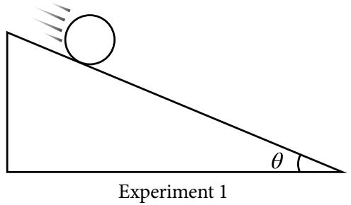

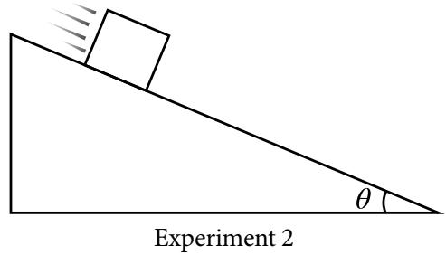  
Figure 3

In Experiment 1, the disk reaches the bottom of the ramp in timeB. $t _ { \mathrm { d i s k } }$ In Experiment 2, the students release a block of ice from rest from the same height on a ramp inclined at the same angle θ, as shown in Figure 3. Friction between the block and the ramp is negligible. The block reaches the bottom of the ramp in time $t _ { \mathrm { b l o c k } }$

Indicate whether $t _ { d i s k }$ is greater than, less than, or equal to $t _ { \mathrm { b l o c k } }$ by writing one of the following:

$$
t _ {\text { disk }} > t _ {\text { block }}
$$

$t _ { \mathrm { d i s k } } = t _ { \mathrm { b l o c k } }$

$t _ { \mathrm { d i s k } } < t _ { \mathrm { b l o c k } }$

Justify your reasoning. In your justification, include qualitative reasoning beyond mathematical derivations or expressions.

FREE–RESPONSE QUESTION: TRANSLATION BETWEEN REPRESENTATIONS

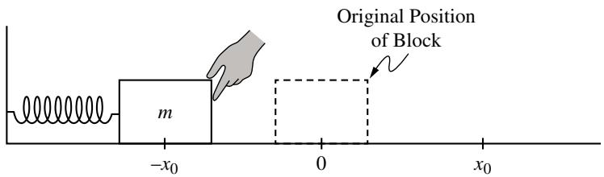

2. A block of mass m is attached to an ideal spring, whose other end is fixed to a wall. The block is displaced a distance $x _ { 0 }$ to the left of the spring’s equilibrium position, as shown in Figure 1. The block is then released from rest and oscillates with negligible friction along the horizontal surface. While the block is oscillating, it has a maximum speed $\nu _ { \mathrm { m a x } } .$

The energy bar charts in Figure 2 represent the spring potential energyA. $U _ { s }$ of the block-spring system, and the kinetic energy K of the block, as the block passes through positions $x = - x _ { 0 } , x = 0$ and $\boldsymbol { x } = + \boldsymbol { x } _ { 0 }$ while the block oscillates. The bar chart at $\boldsymbol { x } = - \boldsymbol { x } _ { 0 }$ is complete. Draw shaded rectangles to complete the energy bar charts in Figure 2 for positions $x = 0$ and $\boldsymbol { x } = + \boldsymbol { x } _ { 0 } .$

• Positive energy values are above the zero-energy line $( ^ { \mathfrak { c } } 0 ^ { \mathfrak { n } } )$ , and negative energy values are below the zero-energy line.

• Shaded regions should start at the dashed line representing zero energy.

• Represent any energy that is equal to zero with a distinct line on the zero-energy line.

• The relative height of each shaded region should reflect the magnitude of the respective energy consistent with the scale shown.

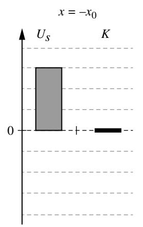

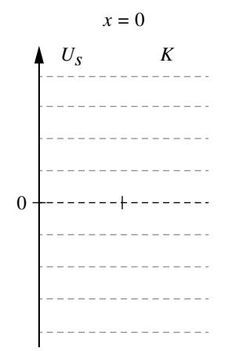  
Figure 2

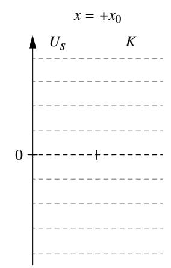

Figure 3 shows the position of the block as a function of time. Figure 4 shows the force exerted by the spring on the block as a function of time.  
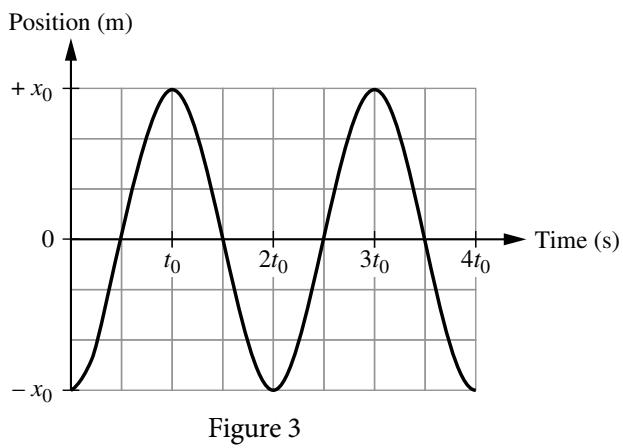

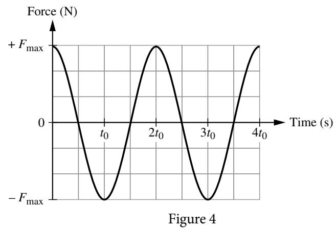  
B. i. Using figures 3 and 4, determine an expression for the spring constant of the spring.

ii. Starting with the equation for the period of a mass on a spring, derive an expression for the mass of the block. Express your answer in terms of ${ \dot { t } } _ { 0 } , x _ { 0 } , F _ { \mathrm { m a x } }$ , and physical constants, as appropriate. Begin your derivation by writing a fundamental physics principle or an equation from the reference information.

On the axes provided in Figure 5 sketch a graph of the velocity of the block as a function of time.C.

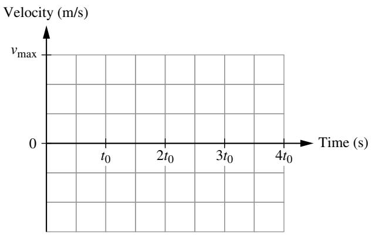  
Figure 5

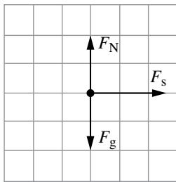  
Figure 6

A student sketches the free-body diagram in Figure 6, and makes theD. following claim:

“The free-body diagram shows the forces exerted on the block at time $t = 1 . 5 t _ { 0 }$

Justify why the student’s sketch (Figure 6) and claim are or are not consistent with the graph of velocity as a function of time you sketched in part C.

FREE–RESPONSE QUESTION: EXPERIMENTAL DESIGN AND ANALYSIS

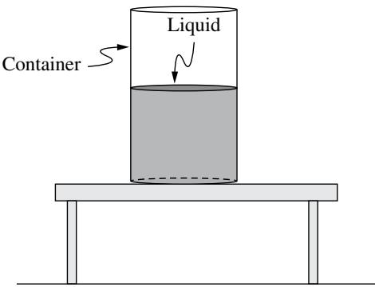  
Figure 1

3. A group of students are given a cylindrical container half filled with a liquid of unknown density ρ as shown in Figure 1. The students have access to an additional container with more of the same liquid, meter sticks, and a pressure sensor. They do not have access to a scale.

A. i. Indicate quantities that could be measured by the students that would allow them to determine the density of the liquid using a linear graph.

ii. Briefly describe a method to reduce experimental uncertainty for the measured quantities.

B. i. Indicate what quantities students could graph on the horizontal and vertical axes to create a linear graph that can be used to determine the density of the liquid.

ii. Briefly describe the relationship between the density of the liquid and a feature of the graph from Part B (i). Your answer may include an equation that relates the density of the liquid and the chosen feature of the graph.

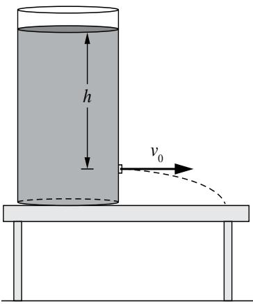  
Figure 2

The students perform another experiment with another cylindrical container which is filled with water, as shown in Figure 2. The students make a small hole in the side of the cylinder and measure the speed v at which water exits the hole. The students plug the first hole, make another one at a diferent height, and repeat this procedure. Table 1 shows the height h of each hole relative to the top of the water, and the corresponding water speed v .

<table><tr><td>Height h (m)</td><td>Speed v (m/s)</td></tr><tr><td>0.25</td><td>2.2</td></tr><tr><td>0.20</td><td>2.0</td></tr><tr><td>0.15</td><td>1.8</td></tr><tr><td>0.10</td><td>1.4</td></tr><tr><td>0.05</td><td>1.1</td></tr></table>

Table 1

C. The students correctly determine that the relationship between h and v is given by

$$
\nu = \sqrt {2 g h}
$$

The students want to determine an experimental value for the acceleration due to gravity. The students create a graph with $\nu ^ { 2 }$ plotted on the vertical axis.

i. Label the horizontal axis of Figure 3 with a measured or calculated quantity. Include units, as appropriate. The graphed quantities should yield a linear graph that can be used to determine the acceleration due to gravity.

ii. On the grid provided in Figure 3, create a graph of the quantities indicated in part C (i).

\- Clearly label the horizontal axis with a numerical scale.

\- Plot the corresponding data points on the grid.

\- T able 2 is provided in your booklet for scratch work and will not be scored.

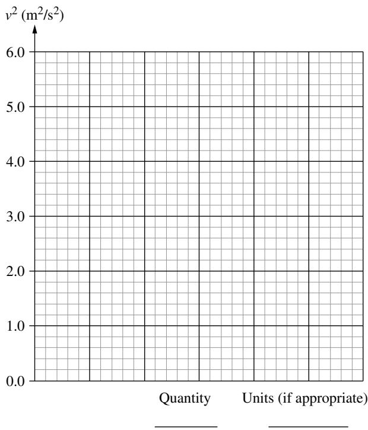  
Figure 3  
iii. Draw a best fit line for the data plotted in part (C) ii.  
Calculate an experimental value for the acceleration due to gravity usingD. the best-fit line that you drew in part Ciii.

FREE–RESPONSE QUESTION: QUALITATIVE/QUANTITATIVE TRANSLATION

  
Figure 1

4. Block 1 of mass $M _ { 1 }$ slides to the right along a horizontal surface with speed $\nu _ { 0 }$ toward Block 2 of mass $M _ { \mathfrak { z } } ,$ which is initially at rest, as shown in Figure 1. When Block 1 collides with Block 2, the blocks stick together. Friction between the blocks and the surface is negligible.

If Block 2 is much less massive than Block 1A. $( M _ { 2 } \ll M _ { 1 } )$ , estimate the approximate speed of the two-block system after the collision in terms of $\nu _ { \mathrm { 0 } }$ . Justify your estimate using qualitative reasoning beyond referencing equations.

Starting with conservation of momentum, derive an equation forB. $\nu _ { f } ,$ the speed of the two – block system after the collision, in terms of $M _ { \mathfrak { r } } , M _ { \mathfrak { z } } ,$ and $\nu _ { \mathrm { 0 } } .$ Begin your derivation by writing a fundamental physics principle or an equation from the reference information.

C. If Block 2 is much less massive than Block 1, does the equation you derived in part B agree with your qualitative reasoning from part A? Justify why or why not.

## Answer Key and Question Alignment to Course Framework

<table><tr><td>Multiple Choice Question</td><td>Answer</td><td>Skill</td><td>Learning Objective</td><td>Essential Knowledge</td></tr><tr><td>1</td><td>B</td><td>2.A</td><td>2.4.A</td><td>2.4.A.1</td></tr><tr><td>2</td><td>D</td><td>3.B</td><td>2.5.A</td><td>2.5.A.3</td></tr><tr><td>3</td><td>B</td><td>3.C</td><td>3.2.A</td><td>3.2.A.4</td></tr><tr><td>4</td><td>B</td><td>2.C</td><td>1.3.A</td><td>1.3.A.4</td></tr><tr><td>5</td><td>C</td><td>3.B</td><td>1.3.A</td><td>1.3.A.4</td></tr><tr><td>6</td><td>B</td><td>2.A</td><td>5.3.B</td><td>5.3.B.2</td></tr><tr><td>7</td><td>B</td><td>2.C</td><td>7.4.A</td><td>7.4.A.3</td></tr><tr><td>8</td><td>A</td><td>2.D</td><td>8.3.B</td><td>8.3.B.3</td></tr><tr><td>9</td><td>D</td><td>2.B</td><td>4.3.A</td><td>4.3.A.3</td></tr><tr><td>10</td><td>A</td><td>2.C</td><td>3.4.C</td><td>3.4.C.3</td></tr><tr><td>11</td><td>B</td><td>3.C</td><td>4.1.A</td><td>4.1.A.3</td></tr><tr><td>12</td><td>D</td><td>3.B</td><td>7.2.A</td><td>7.2.A.1</td></tr><tr><td>13</td><td>D</td><td>2.B</td><td>2.9.A</td><td>2.9.A.2</td></tr><tr><td>14</td><td>B</td><td>2.D</td><td>6.3.C</td><td>6.3.C.2</td></tr><tr><td>15</td><td>A</td><td>2.D</td><td>8.4.A</td><td>8.4.A.2</td></tr></table>

<table><tr><td>Free-Response Question</td><td>Skill</td><td>Learning Objective</td></tr><tr><td>1</td><td>1.A, 2.A, 3.B, 3.C</td><td>1.3.A, 2.5.A, 2.6.A, 2.7.A, 5.2.A, 5.3.B, 5.6.A</td></tr><tr><td>2</td><td>1.A, 1.C, 2.A, 2.D, 3.B, 3.C</td><td>1.3.A, 2.8.A, 3.4.B, 7.2.A, 7.3.A, 7.4.A</td></tr><tr><td>3</td><td>1.B, 2.B, 2.D, 3.A</td><td>1.5.B, 8.2.B, 8.4.B</td></tr><tr><td>4</td><td>2.A, 2.D, 3.B, 3.C</td><td>4.1.A, 4.3.A</td></tr><tr><td colspan="2">Scoring Guidelines for Question 1: Mathematical Routines</td><td>10 points</td></tr><tr><td>Learning Objectives:</td><td>1.3.A 2.5.A 2.6.A 2.7.A 5.2.A 5.3.B 5.6.A</td><td></td></tr><tr><td rowspan="2">(a) i</td><td>For a force of gravity drawn straight down from the center of the circle</td><td rowspan="2">1 point</td></tr><tr><td>Scoring Note: Acceptable labels for forces include:  $F_g$ ,  $F_{gravity}$ , mg,  $F_{earth,disk}$ , WG, and g are not acceptable labels for the force of gravity.</td></tr></table>

For one of the following:

1 point

• $F _ { \mathrm { N } }$ points perpendicular to the ramp starting from the point on the circle that touches the ramp.

• $F _ { \mathrm { f } }$ points up the ramp starting at the point on the circle that touches the ramp.

Example Response:

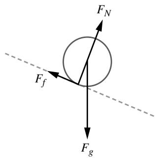

<table><tr><td>(a) ii</td><td>For indicating that the torque exerted on the disk around the center of the disk is from the frictional force</td><td>1 point</td></tr><tr><td>(a) iii</td><td>For an expression for net force that includes a component of the gravitational force and frictional force in opposite directions.  $mg \sin\theta - F_f$ </td><td>1 point</td></tr><tr><td rowspan="3">(a) iv</td><td>For a multi-step derivation that uses Newton&#x27;s second law in rotational or translational form.</td><td>1 point</td></tr><tr><td>For using the relationship between the angular acceleration of the disk and the translational acceleration of the center of mass of the disk.  $\alpha = \frac{a}{R}$ </td><td>1 point</td></tr><tr><td>For a correct expression for the translational acceleration of the center of mass of the disk in terms of given variables $a = \frac{2}{3}g(\sin\theta)$ </td><td>1 point</td></tr><tr><td></td><td>Total for part (a)</td><td>7 points</td></tr></table>

Example Response:

$$
\sum \tau = I \alpha
$$

$$
F _ {f} R \sin (9 0 ^ {\circ}) = \left(\frac {1}{2} M R ^ {2}\right) \alpha
$$

$$
F _ {f} R \sin (9 0 ^ {\circ}) = \left(\frac {1}{2} M R ^ {2}\right) \left(\frac {\alpha}{R}\right)
$$

$$
F _ {f} = \frac {1}{2} M a
$$

$$
\sum F = M a
$$

$$
M g \sin \theta - F _ {f} = M a
$$

$$
M g \sin \theta - \frac {1}{2} M a = M a
$$

$$
M g \sin \theta = \frac {3}{2} M a
$$

$$
a = \frac {2}{3} g \sin \theta
$$

(b)

For a claim that $t _ { \mathrm { d i s k } } > t _ { \mathrm { b l o c k } }$ with an attempt at a justification using forces or conservation of energy.

1 point

For indicating that the acceleration or the net force exerted on the disk is smaller than the acceleration or the 1 poi nt net force exerted on the block.

OR

For indicating that the disk will have both rotational and translational kinetic energy at the bottom of the ramp

For a justification that includes that the larger acceleration for the block over the same distance leads to a 1 point smaller time for the block to reach the bottom of the incline

OR

For a justification that includes that the larger translational kinetic energy for the block over the same distance leads to a higher velocity and thus a shorter time over the same distance.

## Example Response

The net force exerted on the block is larger since there is no frictional force from the surface. The net force is related to the acceleration, so since the block has a larger net force it will have a larger acceleration. Both the block and the disk start from rest and have to travel the same distance, and since the block has a larger acceleration, it will be able to travel the distance in a smaller time. Therefore, the block will reach the bottom in less time.

Total for part (b)

3 points

Total for question 1 10 points

## Scoring Guidelines for Question 2: Translation Between Representations

<table><tr><td colspan="5">Learning Objectives: 1.3.A 2.8.A 3.4.B 7.2.A 7.3.A 7.4.A</td></tr><tr><td rowspan="5">(a)</td><td colspan="3">For a single bar representing the kinetic energy of the block at x=0.</td><td>1 point</td></tr><tr><td colspan="3">For a single bar representing the potential energy of the block-spring system at x=+x0.</td><td>1 point</td></tr><tr><td colspan="3">For an equal total energy of the block-spring system at all three locations.</td><td>1 point</td></tr><tr><td colspan="3">Example Response x=0</td><td></td></tr><tr><td colspan="3">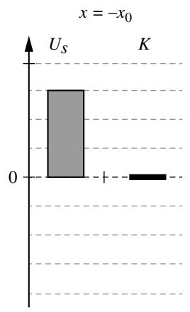 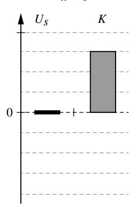 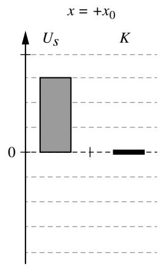</td><td></td></tr><tr><td></td><td></td><td>Total for part (a)</td><td>3 points</td><td></td></tr><tr><td>(b)i</td><td colspan="2">For the correct spring constant in terms of Fmax and x0.k=Fmax/x0</td><td>1 point</td><td></td></tr><tr><td rowspan="3">(b)ii</td><td colspan="2">For a multi-step derivation that begins with the equation for period of a mass on a spring.T=2π√m/k</td><td>1 point</td><td></td></tr><tr><td colspan="2">For ONE of the following:Substitution of the spring constant into the equation for the period of a block-spring system.Substitution of 2t0for the period into the equation for the period of a block-spring system.</td><td>1 point</td><td></td></tr><tr><td colspan="2">For a correct expression of the mass of the block in terms of given variables.m=(t0/π)2Fmax/x0</td><td>1 point</td><td></td></tr></table>

Example Response:

$$
k = \frac {F _ {\mathrm{max}}}{x _ {0}}
$$

$$
T = 2 \pi \sqrt {\frac {m}{k}}
$$

$$
2 t _ {0} = 2 \pi \sqrt {\frac {m}{k}}
$$

$$
2 t _ {0} = 2 \pi \sqrt {\frac {m}{\frac {F _ {\max}}{x _ {0}}}}
$$

$$
t _ {0} = \pi \sqrt {\frac {x _ {0} m}{F _ {\mathrm{max}}}}
$$

$$
\left(\frac {t _ {0}}{\pi}\right) ^ {2} = \frac {x _ {0} m}{F _ {\max}}
$$

$$
m = \left(\frac {t _ {0}}{\pi}\right) ^ {2} \frac {F _ {\mathrm{max}}}{x _ {0}}
$$

<table><tr><td></td><td></td><td>Total for part (b)</td><td>4 points</td></tr><tr><td rowspan="3">(c)</td><td>For a sketch that has the same period as the graph given in part (b) of  $2t_0$ .</td><td></td><td>1 point</td></tr><tr><td>For a sketch that has the same magnitude above and below the zero.</td><td></td><td>1 point</td></tr><tr><td>For a sketch that resembles a positive sine function.</td><td></td><td>1 point</td></tr></table>

Example Response

Velocity (m/s)

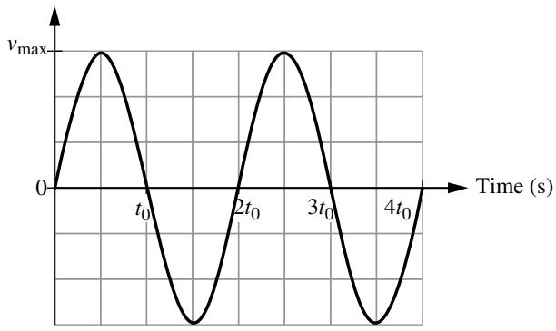

Figure 4

<table><tr><td></td><td>Total for part (c)</td><td>3 points</td></tr><tr><td rowspan="2">(d)</td><td>For a claim that the sketch and claim are or are not consistent with the graph of velocity as a function of time, consistent with part (c) with an attempt at a justification using functional dependence.</td><td>1 point</td></tr><tr><td>For a justification that includes that at  $t = 1.5t_{0}$ , the net force should be zero with justification using a relevant feature of the graph (i.e., the slope of the graph of velocity as a function of time is zero at  $t = 1.5t_{0}$ ).</td><td>1 point</td></tr></table>

## Example Response:

The claim and free-body diagram are not consistent with my graph of velocity as a function of time. At time $t = 1 . 5 t _ { 0 } ,$ my velocity graph is at a maximum, and the slope of the velocity graph at that time is zero. This means that at $t = 1 . 5 t _ { 0 } ,$ the acceleration is zero, and because acceleration is directly related to force, the force from the spring should be zero at $t = 1 . 5 t _ { 0 } .$

Scoring Note: The two points for Part (d) can be earned independently of the rest of the points on the question, as long as the student correctly interprets the consistency between their answer for part (c) and the given sketch. For example, a student who earns zero points in part (c) can still earn full credit in (d) if they reason why their incorrect diagram is or is not consistent with the sketch.

<table><tr><td></td><td>Total for part (d)</td><td>2 points</td></tr><tr><td></td><td>Total for question 2</td><td>12 points</td></tr><tr><td colspan="2">Scoring Guidelines for Question 3:Experimental Design and Analysis</td><td>10 points</td></tr><tr><td colspan="2">Learning Objectives: 1.5.B 8.2.B 8.4.B</td><td></td></tr><tr><td>(a) i</td><td>For indicating all the required quantities to determine the density of the fluid – Pressure and height of the fluid.</td><td>1 point</td></tr><tr><td>(a) ii</td><td>For a reasonable method of reducing experimental uncertainty either by taking several pressure measurements at the same depth/height, or at least one pressure measurement at several depths/heights.</td><td>1 point</td></tr><tr><td></td><td>Example ResponsePlace the pressure sensor at the bottom of the container of liquid. Measure the height of the liquid with a meterstick and record the reading on the pressure sensor. Repeat measurements to reduce experimental error. Put more liquid in the container and measure the new height of the liquid and the pressure from the sensor. Repeat for multiple heights of the liquid to reduce experimental uncertainty.</td><td></td></tr><tr><td></td><td>Total for part (a)</td><td>2 points</td></tr><tr><td>(b) i</td><td>For describing a graph that would have a slope that is either directly or inversely proportional to the density of the fluid. Examples of acceptable responses may include the following:P as a function of hh as a function of P</td><td>1 point</td></tr><tr><td>(b) ii</td><td>For describing how the slope of the graph can be used to determine the density. Examples of acceptable responses may include the following:if Pressure as a function of height is graphed, slope is ρgif Height as a function of pressure is graphed, slope is  $\frac{1}{\rho g}$ if  $\frac{P}{\rho}$  as a function of height is graphed, the slope is gif Height as a function of  $\frac{P}{\rho}$  is graphed, the slope is  $\frac{1}{g}$ if P as a function of ρh is graphed, the slope is gif ρh as a function of P is graphed, the slope is  $\frac{1}{g}$ </td><td>1 point</td></tr><tr><td></td><td>Example Response:Graph Pressure as a function of height, the slope of the best fit line of the data will be equal to ρg.</td><td></td></tr><tr><td></td><td>Total for part (b)</td><td>2 points</td></tr><tr><td>(c) i</td><td>For labeling the vertical axis with a quantity (including units) that could be plotted to produce a linear graph whose slope can be used to determine the acceleration due to gravity. Examples of acceptable responses may include the following:Graphing  $v^{2}$  as a function of ΔyGraphing  $v^{2}$  as a function of 2ΔyScoring Note:Any response that correctly identifies the functional dependence between speed and distance earns this point, regardless of any coefficients that contain numbers or physical/fundamental constants.</td><td>1 point</td></tr><tr><td rowspan="4">(c) ii</td><td>For labeling the vertical axis with a linear scale.</td><td rowspan="2">1 point</td></tr><tr><td>Scoring Note: This point can be earned for labels and plotted points that are consistent with the previous part.</td></tr><tr><td>For correctly plotting data points consistent with quantities indicated in C (i).</td><td rowspan="2">1 point</td></tr><tr><td>Scoring Note: This point can be earned for labels and plotted points that are consistent with the previous part.</td></tr><tr><td rowspan="2">(c) iii</td><td>For drawing an appropriate best-fit line that approximates the trend of the data.</td><td rowspan="2">1 point</td></tr><tr><td>Scoring Note: If the graph produced is nonlinear, then a line or curve that approximates the trend of that data can earn this point.</td></tr></table>

Example Response:

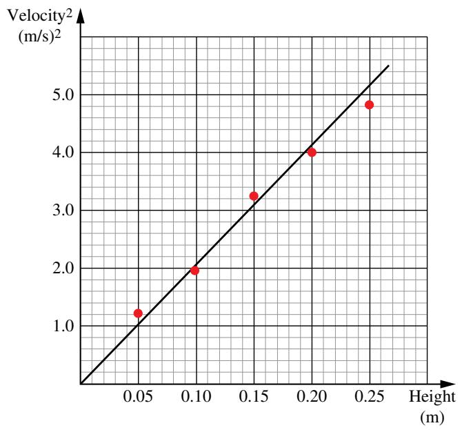  
(d) For correctly relating the slope of the best-fit line to the acceleration due to gravity, g. Examples of acceptable 1 point responses may include the following:

<table><tr><td>Graph</td><td>Analysis</td></tr><tr><td> $v^{2}$ vs.  $h$ </td><td>Slope equals 2g</td></tr><tr><td> $\frac{1}{2}v^{2}$ vs.  $h$ </td><td>Slope equals g</td></tr><tr><td> $v$  vs.  $\sqrt{2h}$ </td><td>Slope equals  $\sqrt{g}$ </td></tr><tr><td> $v$  vs.  $\sqrt{h}$ </td><td>Slope equals  $\sqrt{2g}$ </td></tr></table>

For a value of g within a range 9 m/s2 2 to 12 m/s

Example Response: Slope equals $_ { 2 g }$ ${ \mathrm { s l o p e } } = { \frac { 1 . 0 - 0 . 0 } { 0 . 0 5 - 0 . 0 } } = 2 0 ~ { \frac { \mathrm { m } } { \mathrm { s } ^ { 2 } } }$ $\nu ^ { 2 } = 2 g h$ $g = { \frac { \mathrm { s l o p e } } { 2 } } = { \frac { 2 0 } { 2 } } = 1 0 ~ { \frac { \mathrm { m } } { \mathrm { s } ^ { 2 } } }$

<table><tr><td colspan="2">Scoring Guidelines for Question 4: Qualitative/Quantitative Translation</td><td>8 points</td></tr><tr><td colspan="2">Learning Objectives: 4.1.A 4.3.A</td><td></td></tr><tr><td rowspan="3">(a)</td><td>For a claim that the final velocity will be approximately equal to the initial velocity of Block 1. $v_f \approx v_0$ </td><td>1 point</td></tr><tr><td>For connecting the claim to ONE of the following:the conservation of momentum.Newton&#x27;s third lawthe momentum of the center of mass of the system</td><td>1 point</td></tr><tr><td>For the justification of the evidence supporting the claim. Examples of acceptable responses may include the following:a correct statement relating either block&#x27;s mass to the relative magnitude of the change in that block&#x27;s momentum.a correct statement relating Newton&#x27;s third law to a small acceleration for Block 2 or a large acceleration for Block 1a correct statement relating the speed of either block to the momentum of the center of mass of the system.</td><td>1 point</td></tr></table>

## Example Response

If the mass of Block 2 is really really small, the final momentum of Block 2 will also be really, really small. This means that the change in momentum of Block 2 is really small. The change in momentum of each block is equal and opposite, so if the change in momentum of Block 2 is small, so is the change in momentum of Block 1, so Block 1 is still traveling at approximately the same speed.

## OR

Newton’s third law states that the force that the two blocks exert on each other must be equal in magnitude and opposite in direction. If the mass of Block 2 is very very small, the force exerted on it by Block 1 will mean that relative to Block 1, Block 2 will have a large acceleration (changing it’s velocity from zero to almost v ), while that same force exerted on Block will result in a very small acceleration – so the speed of1 Block 1 remains almost equal to $\nu _ { _ { 0 } } .$

## OR

If the mass of Block 2 is very very small, the addition of the mass of Block 2 to the mass of the system is a very small mass change. Which means that the additional momentum of adding the momentum of Block 2 moving is very very small, which means that the final speed of the system should be equal to the initial speed of the system because of the conservation of momentum.

<table><tr><td></td><td></td><td>Total for part (a)</td><td>3 points</td></tr><tr><td rowspan="3">(b)</td><td>For a multistep derivation that begins with conservation of momentum $p_{i} = p_{f}$ </td><td></td><td>1 point</td></tr><tr><td>For substituting appropriate values of mass and initial velocities $M_{1}v_{1,i} + M_{2}(0) = (M_{1} + M_{2})v_{f}$ </td><td></td><td>1 point</td></tr><tr><td>For a correct equation for the final velocity of the two-block system after the collision. $v_{f} = \frac{M_{1}v_{0}}{(M_{1} + M_{2})}$ </td><td></td><td>1 point</td></tr><tr><td colspan="4">Example Response:</td></tr><tr><td></td><td> $p_i = p_f$  $M_1v_{1,i} + M_2v_{2,i} = (M_1 + M_2)v_f$  $M_1v_{1,i} + M_2(0) = (M_1 + M_2)v_f$  $v_f = \frac{M_1v_0}{(M_1 + M_2)}$ </td><td colspan="2"></td></tr><tr><td></td><td>Total for part (b)</td><td colspan="2">3 points</td></tr><tr><td rowspan="4">(c)</td><td>For a statement that addresses functional dependence between the mass of Block 2 and the final speed of the two-block system.</td><td colspan="2">1 point</td></tr><tr><td>Scoring Note: It is not necessary to use functional dependence correctly to earn this point.</td><td colspan="2"></td></tr><tr><td>For a correct justification using functional dependence to link the claim made in part (a) to the equation derived in part (b).</td><td colspan="2">1 point</td></tr><tr><td>Example Response:In Part (a) I claimed that if the mass of Block 2 was much less than the mass of Block 1 that the final speed of the two-block system would be approximately equal to the original speed of Block 1. In the equation I derived in part (b) since the final speed of the block is inversely related to the mass of Block 2, if the mass of Block 2 is very small, it will effectively mean that the masses in the numerator and denominator cancel leaving the final mass equal to the initial mass, which is what I claimed in part (a).</td><td colspan="2"></td></tr><tr><td></td><td>Total for part (c)</td><td colspan="2">2 points</td></tr><tr><td></td><td>Total for question 4</td><td colspan="2">8 points</td></tr></table>

THIS PAGE IS INTENTIONALLY LEFT BLANK.

AP PHYSICS 1

## Appendix

##

# Vocabulary and Definitions of Important Ideas in AP Physics

## Vocabulary and Word Choice in AP Physics

The discussions below are included to elaborate on the choice of words and vocabulary used within AP Physics. Many of these words, when used in the context of AP Physics,haveveryspecificandintentionalmeanings. Theintentionaluseofcertainwordswithinspecific contextscanhaveasignificantimpactonstudent understanding as well as their ability to communicate that understanding with others.

The AP Physics Exam will NOT directly assess student understandingofphysicsvocabulary.For instance, students will not be asked to identify the correctdefinitionofacceleration,orthediference between a system and an object. Students will be expectedtousethesedefinitionsincontextually appropriatesituations.Descriptionsanddefinitions, found in the appendix, are intended to be used as starting points for discussions and are included to help students be more conscientious about the languagetheyusetodescribeascenario—thattheyare inherently thinking more about the underlying principles and ideas that apply to that scenario. This can lead to a deeper and more robust understanding of the course content.

Ofteninphysicscontexts,wordshavespecific meaningsandareuseddiferentlythanincolloquia conversation. Common examples of words that have specificphysicsdefinitionsincludeobject,system, momentum, and work. Students need to be aware of these subtleties, so that they can communicate appropriately about the details of a scenario. Ultimately, the language used to describe the natural world can be very important when helping students build understanding of physics concepts in measured and intentional increments.

## Models

## A PHYSICAL, MATHEMATICAL, OR CONCEPTUAL REPRESENTATION OF A SYSTEM OF IDEAS, EVENTS, OR PROCESSES. SYSTEM OF IDEAS, EVENTS, OR PROCESSES.

Ascientificmodelcanbethoughtofasthesetofrules that describe a physical phenomenon. The model sets out the boundaries within which the scientist will consider that phenomenon. Typically, these boundaries simplify a complex scenario to make the analysis and description of that scenario easier and more accessible, particularly to students just beginning their studies in physics.

Consider perhaps the most common example of an introductory physics problem: “A block is at rest at the top of an inclined plane. Determine the speed of a block at the bottom of the inclined plane.” What should students consider in their calculations? What model of the block/incline/earth should students use to describe this situation? To describe the subtleties of the scenario, students would need to consider friction and airresistance;theslightincreaseingravitationalfield as the block slides downward; and the loss of energy to vibrations, sound, and thermal energy. Does the coeficientoffrictiondecreaseslightlyastheabrasion between the block and incline subtly smooths the surfaces? Should the density, temperature, and relative humidity of the air be considered? Clearly, the physics ofevensuchastraightforwardexampleofablock-on-aramp can raise many questions to be considered.

Therefore, in introductory physics courses, phenomena aretypicallyanalyzedinthemostbasicconditions, usingthemostsimplifiedmodels.Thisallowsstudents to focus on big concepts and ideas, before exploring more complex models that include more detailed considerations. For example, when modeling Earth, we typically consider it to be uniform density, spherical, and an inertial frame of reference, even though none of those properties are completely accurate. Most often, onlygravitationalefectsfromtheSunareconsidered. EventidalefectsfromtheMoonareonlyconsidered after introductory courses. This spherical, uniform descriptionofEarthisasimplifiedmodelthatisused to focus on bigger concepts without getting stuck with extraneousdetailsandnuance.Intheearlierblockon-a-rampexample,virtuallyalloftheefectslisted are considered negligible and are ignored in favor of obtaining an answer that is within the level of accuracy needed for the course. The mathematics required to describetheseefectstendstogetcomplexquickly.It is important, however, that students understand they areusingasimplifiedmodelsothatlaterextensionscan beaddedinthecontextofrefiningthemodel—anormal scientificprocess.

The models chosen to simplify the universe have been done so with alignment to their respective AP Physics courses. These models are elaborated on within the boundary statements provided in the course frameworks, as well as in the conventions for the AP Exams, listed on the equation sheets. While nuances of these models are described in detail within each course’s course framework, these models can be summarizedasfollows.

Unless otherwise stated, students may assume that:

§ Frames of reference are inertial.

§ Air resistance is negligible.

§ Frictional/drag forces are negligible.

§ Edgeefectsofchargedplatesarenegligible.

§ Strings, springs, and pulleys are ideal.

## Representations

A METHOD OF UNDERSTANDING AND COMMUNICATING UNDERSTANDINGS ABOUT PHYSICS.

Once deciding on the boundaries of a model, scientists must decide how to communicate those boundaries to others. A representation is a depiction of a model or aspects of that model. Representations can take many forms, and scientists are consistently developing new representations.

Representations that are frequently used within AP Physics 1 include (but are not limited to):

§ Written descriptions

§ Drawings and pictures

§ Diagrams or schematics

§ Mathematical equations or sets of equations

§ Graphs and data tables

§ Charts

§ Motion maps

§ Energy bar charts

§ Momentum charts

§ Free-bodydiagrams

§ Force diagrams

Studentswillbenefitfromfamiliaritywithasmany diferentrepresentationsaspossible.Whatmakes a concept or idea clear to one student using one representation may not be clear to another. The more methods that students are given to access and describe content, the more likely they are to use those descriptions. The depth to which a student understands course content is related to the variety of representations with which that student can communicate their knowledge. True understanding is demonstrated through the ability to use many diferentrepresentationsinmanydiferentsituations. To this end, the AP Physics 1 Exam will use many representations, as well as require students to create many representations.

## Objects

## A PHYSICAL THING WHERE THE INTERNALSTRUCTURE AND PROPERTIES OF THE THINGARE IGNORED.

Whether it be a cow, the Earth, a car, or pencil, the objectmodeloftheseentitieshasaveryspecific meaning. Within the context of AP Physics, using the word “object” denotes some key characteristics, and is used, as most models are, to simplify the analysis and descriptions of the interactions between two or more masses. Most notably, an object has no internal structure or surface properties. An object can be considered as a collection of atoms or molecules that stick together in a functional way. A person could imagine handling an object, picking it up, as though the object had no internal structure.

Consider a truck. Most often, it’s simply “a truck.” The user of the truck does not consider the multitude of components that make a truck a truck: the engine, the doors and windows, the wheels, the frame, the radio, the suspension, and so on. The user treats the truck as a single object, neglecting the constituent parts and structure of the truck itself.

Similartoawell-packedbox,anobjectistreatedthe samefromdiferentperspectives.Thetruckisatruck if viewed from the top, bottom, or side. However, when carrying a load of unsecured bricks, the object model of thetruckmaynotbesuficient.Themotionofthebricks withinthetruckmayafectthebehaviorofthetruck itself.Suddenaccelerations—inanydirection—may havesignificantefectsonhowthetruckbehaves.

Furthermore, using the object model ignores the physicalsizeoftheobjectitself.Objectscannotbe compressed, twisted, or rotated because the physical dimensions of the object are ignored. When considering a truck as an object, there would be no need to make the distinction between the front, back, or sides of the truck. However, in the physical world, pushing the top of atruckhasadiferentefectthanpushingthebottomor middle of the truck. If the truck is modeled as an object, theseefectsareignored;thelocationoftheapplication of the force is not considered.

A notable discussion of some nuances of the object modelcanbefoundwhenanalyzingfriction.Friction,by definition,istheinteractionoftwoobjectsinphysical contact with each other. The amount of friction is inherently tied to the structure and properties of those objects. For instance, two wooden blocks wil slideacrosseachotherdiferentlyiftheyarecovered with sandpaper than if they are covered in grease. The surfaces of the blocks matter when it comes to describing their interactions. However, the blocks may still be treated as objects because the force of friction exerted on one block by the other block does not dependonthesizeorshapeoftheblocks.Theamount of area of the blocks that are in contact with each other does not change the force of friction, and so the blocks may still be modeled as objects.

The object model is used throughout AP Physics 1 to simplify the analysis of most phenomena. An “object” can be anything because what the object is is not important to the analysis. The properties that matter totheanalysis—themassoftheobject,thecoeficient of friction between the object and a surface, the speed oftheobject,andsoon—canbeusedtodescribeany number of physical things. In this case, it is up to the student to create their own mental representation of the situation.

## Systems

## A COLLECTION OF OBJECTS THAT ARE ANALYZED TOGETHER.

A system is how a physicist chooses to group objects togethertoanalyzeagivenscenario.Asstudentsgain a deeper understanding of physics concepts, they will noticethathowsystemsarechosencansignificantly simplify(orsignificantlycomplicate)theanalysisofa problem. There is no single right or wrong way to group objects, but often the preferred method is to choose a systemthatsimplifiestheanalysis.

Note that in special cases, a system can itself be reduced to a single object. This can happen when the behaviors and interactions of the individual parts of thesystemdonotafectthebehaviororanalysisof the system as a whole. Consider a box of cereal. In reality, this is a very complex system. A cardboard box, a plastic bag, and a large number of pieces of cereal within. However, the complex motion of the pieces of cereal within the box are not important to consider when handling the box of cereal. Therefore, the entire box–bag–cereal system can itself be considered as a single object.

Unless the system is chosen to be the entire observable universe (which would require an exceedingly complex analysis), a small group of objects chosen to be a system will exist as part of a larger local environment. The system as a whole then may interact with that environment. Consider the box of cereal above. Perhaps the box is torn, and cereal begins to spill. The physicist has a decision to make with regard to their system: continue to include every piece of cereal as part of the system (System A) or consider only the cereal inside the box to be part of the system (System B). See the figurebelow.

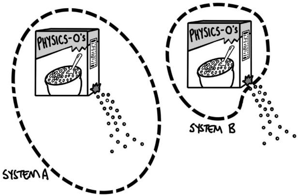

AnalyzingSystemAwillbeexceedinglycomplex,as the small pieces of cereal move, bounce, accelerate, and collide with each other and the environment and scatter.AnalyzingSystemBismuchsimpler:theboxis losing mass to the environment, but the box–bag–cereal system may be modeled as a single object that has a changing mass.

## Rigid System

A SYSTEM THAT DOES NOT CHANGE SHAPE, BUT DIFFERENT POINTS WITHIN THE SYSTEM MAY MOVE IN DIFFERENT DIRECTIONS AND WITH DIFFERENT SPEEDS. Supposeawheelissupportedbyahorizontalaxle, so that the bottom of the wheel is not contacting the ground. While the wheel rotates, all points move together, and the shape of the wheel does not change. Points A and B are marked on the wheel, as shown in the followingfigure.

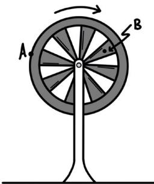

At any given instant in time, Point A is traveling with a greatertranslationalspeedandinadiferentdirection than Point B. If the rotation of the wheel is relevant to the analysis of the situation, it cannot be modeled as anobjectbecause,bydefinition,theobjectmodeldoes notaccountforthesediferences.Instead,thewheelis modeled as a rigid system.

For a rigid system, the location at which forces are exerted or the location of the point of analysis matters. Pushingonthetopofthewheelwillhaveadiferent efectthanpushingonthebottomofthewheelor pushing directly toward the axle of the wheel. Again, the goals and complexity of the analysis dictates what model to use.

## Constant or conserved?

The cereal example is a good place to discuss the subtlety between the terms constant and conserved, and how the choice of the system determines whether a quantity is constant or conserved. For the leaking cereal box, the total amount of cereal is conserved,

in both System A and System B. In both choices of system, the total amount of cereal that exists does not change. However, the choice of system does influence whether the amount of cereal within that system is constant.Inthefirstchoice,wherethestudentdecides to continue to include each individual piece of cereal as part of the system, even as the cereal spills from the box, the total amount of cereal within the system is constant. In the second choice, where the student decides to only consider the cereal within the box as part of the system, the total amount of cereal within the system decreases, and is not constant. However, thiscerealisstillconserved—thecerealdoesnot simply vanish, disappear, or cease to exist because it is not selected to be part of the system. The cereal is transferred out of the system.

Supposestudentswantedtoanalyzetheenergyofthe box of cereal as it falls toward Earth. In the box–Earth system, total mechanical energy is both conserved and constant. The total amount of energy within the system does not change as the box gains kinetic energy, and the gravitational potential energy of the box–Earth system decreases. However, in a system consisting only of the box, the total amount of energy that system is not constant, but energy is conserved. The kinetic energy of the box increases, but this increase in energy is due to the transfer of energy into the box system by the external force of gravity doing work on the box. The energy transferred into the box by the force of gravity is not“new”energythatwascreatedbygravity—thetotal energy of the universe has remained the same and has been conserved.

AP PHYSICS 1

# Table of Information: Equations

## ADVANCED PLACEMENT PHYSICS 1 TABLE OF INFORMATION

<table><tr><td colspan="2">CONSTANTS AND CONVERSION FACTORS</td></tr><tr><td>Universal gravitational constant, $G = 6.67 \times 10^{-11} \text{ m}^{3}/(\text{kg} \cdot \text{s}^{2}) = 6.67 \times 10^{-11} \text{ N} \cdot \text{m}^{2}/\text{kg}^{2}$ 1 atmosphere of pressure,1 atm =  $1.0 \times 10^{5} \text{ N/m}^{2} = 1.0 \times 10^{5} \text{ Pa}$ </td><td>Magnitude of the acceleration due to gravity at Earth’s surface,  $g = 9.8 \text{ m/s}^{2}$ Magnitude of the gravitational field strength at Earth’s surface,  $g = 9.8 \text{ N/kg}$ </td></tr></table>

<table><tr><td rowspan="4">UNITSYMBOLS</td><td colspan="2">hertz, Hz</td><td colspan="2">newton, N</td></tr><tr><td colspan="2">joule, J</td><td colspan="2">pascal, Pa</td></tr><tr><td colspan="2">kilogram, kg</td><td colspan="2">second, s</td></tr><tr><td colspan="2">meter, m</td><td colspan="2">watt, W</td></tr></table>

<table><tr><td colspan="3">PREFIXES</td></tr><tr><td>Factor</td><td>Prefix</td><td>Symbol</td></tr><tr><td> $10^{12}$ </td><td>tera</td><td>T</td></tr><tr><td> $10^9$ </td><td>giga</td><td>G</td></tr><tr><td> $10^6$ </td><td>mega</td><td>M</td></tr><tr><td> $10^3$ </td><td>kilo</td><td>k</td></tr><tr><td> $10^{-2}$ </td><td>centi</td><td>c</td></tr><tr><td> $10^{-3}$ </td><td>milli</td><td>m</td></tr><tr><td> $10^{-6}$ </td><td>micro</td><td>μ</td></tr><tr><td> $10^{-9}$ </td><td>nano</td><td>n</td></tr><tr><td> $10^{-12}$ </td><td>pico</td><td>p</td></tr></table>

<table><tr><td colspan="8">VALUES OF TRIGONOMETRIC FUNCTIONS FOR COMMON ANGLES</td></tr><tr><td>θ</td><td>0°</td><td>30°</td><td>37°</td><td>45°</td><td>53°</td><td>60°</td><td>90°</td></tr><tr><td>sin θ</td><td>0</td><td>1/2</td><td>3/5</td><td> $\sqrt{2}/2$ </td><td>4/5</td><td> $\sqrt{3}/2$ </td><td>1</td></tr><tr><td>cos θ</td><td>1</td><td> $\sqrt{3}/2$ </td><td>4/5</td><td> $\sqrt{2}/2$ </td><td>3/5</td><td>1/2</td><td>0</td></tr><tr><td>tan θ</td><td>0</td><td> $\sqrt{3}/3$ </td><td>3/4</td><td>1</td><td>4/3</td><td> $\sqrt{3}$ </td><td>∞</td></tr></table>

The following conventions are used in this exam:  
•	 The frame of reference of any problem is assumed to be inertial unless otherwise stated.  
• Air resistance is assumed to be negligible unless otherwise stated.  
•	 Springs and strings are assumed to be ideal unless otherwise stated.  
•	 Fluids are assumed to be ideal, and pipes are assumed to be completely fi lled by fl uid, unless otherwise stated.

<table><tr><td colspan="4">GEOMETRY AND TRIGONOMETRY</td></tr><tr><td>Rectangle</td><td>Rectangular Solid</td><td>A = area</td><td>Right Triangle</td></tr><tr><td rowspan="2">A = bh</td><td rowspan="2">V = ℓwh</td><td>b = base</td><td rowspan="2"> $a^{2} + b^{2} = c^{2}$ </td></tr><tr><td>C = circumference</td></tr><tr><td>Triangle</td><td>Cylinder</td><td>h = height</td><td rowspan="2">sin θ =  $\frac{a}{c}$ </td></tr><tr><td rowspan="4">A =  $\frac{1}{2}bh$ </td><td>V = πr2ℓ</td><td>ℓ = length</td></tr><tr><td rowspan="3">S = 2πrℓ + 2πr2</td><td>r = radius</td><td rowspan="2">cos θ =  $\frac{b}{c}$ </td></tr><tr><td>s = arc length</td></tr><tr><td>S = surface area</td><td rowspan="2">tan θ =  $\frac{a}{\tau}$ </td></tr><tr><td>Circle</td><td>Sphere</td><td>V = volume</td></tr><tr><td>A = πr2</td><td rowspan="2">V =  $\frac{4}{3}\pi r^{3}$ </td><td>w = width</td><td rowspan="3">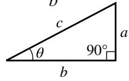</td></tr><tr><td>C = 2πr</td><td>θ = angle</td></tr><tr><td>s = rθ</td><td>S = 4πr2</td><td></td></tr></table>

## MECHANICS AND FLUIDS

$$
v _ {x} = v _ {x 0} + a _ {x} t
$$

$$
x = x _ {0} + v _ {x 0} t + \frac {1}{2} a _ {x} t ^ {2}
$$

$$
v _ {x} ^ {2} = v _ {x 0} ^ {2} + 2 a _ {x} (x - x _ {0})
$$

$$
\vec {x} _ {\mathrm{cm}} = \frac {\sum m _ {i} \vec {x} _ {i}}{\sum m _ {i}}
$$

$$
\vec {a} _ {\mathrm{sys}} = \frac {\sum \vec {F}}{m _ {\mathrm{sys}}} = \frac {\vec {F} _ {\mathrm{net}}}{m _ {\mathrm{sys}}}
$$

$$
\left| \vec {F} _ {f} \right| \leq \left| \mu \vec {F} _ {n} \right|
$$

$$
\vec {F} _ {s} = - k \Delta \vec {x}
$$

$$
a _ {c} = \frac {v ^ {2}}{r}
$$

$$
\left| \vec {F} _ {g} \right| = G \frac {m _ {1} m _ {2}}{r ^ {2}}
$$

$$
K = \frac {1}{2} m v ^ {2}
$$

$$
W = F _ {\parallel} d = F d \cos \theta
$$

$$
U _ {s} = \frac {1}{2} k (\Delta x) ^ {2}
$$

$$
U _ {G} = - \frac {G m _ {1} m _ {2}}{r}
$$

$$
\Delta U _ {g} = m g \Delta y
$$

$$
\Delta K = \sum W _ {i} = \sum F _ {\parallel , i} d _ {i}
$$

$$
P _ {\mathrm{avg}} = \frac {W}{\Delta t} = \frac {\Delta E}{\Delta t}
$$

$$
P _ {\text { inst }} = F _ {\parallel} v = F v \cos \theta
$$

$$
a = \mathrm{acceleration}
$$

$$
\vec {p} = m \vec {v}
$$

$$
\vec {F} _ {\mathrm{net}} = \frac {\Delta \vec {p}}{\Delta t} = m \frac {\Delta \vec {v}}{\Delta t} = m \vec {a}
$$

$$
\vec {J} = \vec {F} _ {\mathrm{avg}} \Delta t = \Delta \vec {p}
$$

$$
\vec {v} _ {\mathrm{cm}} = \frac {\sum \vec {p} _ {i}}{\sum m _ {i}} = \frac {\sum m _ {i} \vec {v} _ {i}}{\sum m _ {i}}
$$

$$
d = \mathrm{distance}
$$

$$
\omega = \omega_ {0} + \alpha t
$$

$$
E = \mathrm{energy}
$$

$$
F = \mathrm{force}
$$

$$
J = \text { impulse }
$$

$$
k = \mathrm{springconstant}
$$

$$
K = \mathrm{kineticenergy}
$$

$$
m = \mathrm{mass}
$$

$$
p = \mathrm{momentum}
$$

$$
P = \mathrm{power}
$$

$$
\omega^ {2} = \omega_ {0} ^ {2} + 2 \alpha (\theta - \theta_ {0})
$$

$$
\theta = \theta_ {0} + \omega_ {0} t + \frac {1}{2} \alpha t ^ {2}
$$

$$
\nu = r \omega
$$

$$
r = \mathrm{radiusordistance}
$$

$$
a _ {T} = r \alpha
$$

$$
t = \mathrm{time}
$$

$$
\tau = r _ {\perp} F = r F \sin \theta
$$

$$
I = \sum m _ {i} r _ {i} ^ {2}
$$

$$
U = \text { potential   energy }
$$

$$
v = \text { velocity   or   speed }
$$

$$
W = \mathrm{work}
$$

$$
I ^ {\prime} = I _ {\mathrm{cm}} + M d ^ {2}
$$

$$
\theta = \mathrm{angle}
$$

$$
x = \mathrm{position}
$$

$$
y = \text { vertical   position }
$$

$$
\alpha_ {\mathrm{sys}} = \frac {\Sigma \tau}{I _ {\mathrm{sys}}} = \frac {\tau_ {\mathrm{net}}}{I _ {\mathrm{sys}}}
$$

$$
K = \frac {1}{2} I \omega^ {2}
$$

m = coeffi cient of friction

$$
W = \tau \Delta \theta
$$

$$
L = I \omega
$$

$$
L = r m v \sin \theta
$$

$$
\Delta L = \tau \Delta t
$$

$$
\Delta x _ {\mathrm{cm}} = r \Delta \theta
$$

$$
T = \frac {1}{f}
$$

$$
T _ {s} = 2 \pi \sqrt {\frac {m}{k}}
$$

$$
P = P _ {0} + \rho g h
$$

$$
P = \frac {F _ {\perp}}{A}
$$

$$
T _ {p} = 2 \pi \sqrt {\frac {\ell}{g}}
$$

$$
P _ {\mathrm{gauge}} = \rho g h
$$

$$
A _ {1} v _ {1} = A _ {2} v _ {2}
$$

$$
F _ {b} = \rho V g
$$

$$
\rho = \frac {m}{V}
$$

$$
x = A \sin (2 \pi f t)
$$

$$
a = \mathrm{acceleration}
$$

$$
x = A \cos (2 \pi f t)
$$

$$
A = \mathrm{amplitudeorarea}
$$

$$
d = \mathrm{distance}
$$

$$
f = \mathrm{frequency}
$$

$$
F = \mathrm{force}
$$

$$
h = \mathrm{height}
$$

$$
I = \mathrm{rotationalinertia}
$$

$$
k = \mathrm{springconstant}
$$

$$
K = \mathrm{kineticenergy}
$$

$$
t = \mathrm{time}
$$

$$
\ell = \mathrm{length}
$$

$$
L = \text { angular   momentum }
$$

$$
T = \mathrm{period}
$$

$$
m = \mathrm{mass}
$$

$$
v = \text { velocity   or   speed }
$$

$$
M = \mathrm{mass}
$$

$$
W = \mathrm{work}
$$

$$
P = \mathrm{pressure}
$$

$$
P _ {1} + \rho g y _ {1} + \frac {1}{2} \rho v _ {1} ^ {2} = P _ {2} + \rho g y _ {2} + \frac {1}{2} \rho v _ {2} ^ {2}
$$

$$
V = \mathrm{volume}
$$

$$
r = \text { radius   or   distance }
$$

$$
x = \mathrm{position}
$$

$$
y = \text {   vertical   position   }
$$

$$
\alpha = \text { angular   acceleration }
$$

$$
\theta = \text { angle   or   angular }
$$

$$
\tau = \mathrm{torque}
$$

$$
\mathrm{position}
$$

$$
\rho = \mathrm{density}
$$

w = angular speed

THIS PAGE IS INTENTIONALLY LEFT BLANK.