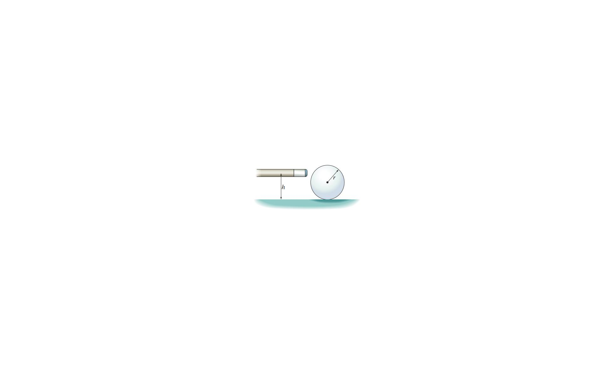

# Example 13: Billiard Ball and Cue Stick (Sweet Spot)

## Problem Statement

If a billiard ball is hit in just the right way by a cue stick, the ball will roll without slipping immediately after losing contact with the stick. Consider a billiard ball (radius $r$, mass $M$) at rest on a horizontal pool table. A cue stick exerts a constant horizontal force $F$ on the ball for a time $t$ at a point that is a height $h$ above the table's surface.

*Figure 13: Cue stick hitting billiard ball at height h*

Assume that the coefficient of static friction between the ball and table is $\mu_s$.

**Determine the value for $h$ so that the ball will roll without slipping immediately after losing contact with the stick.**

---

## Solution

### Setup

During the time $t$ that the cue stick is in contact with the ball:
- Horizontal force $F$ acts at height $h$ above the table
- Static friction $f$ acts at the contact point (bottom of ball)
- The friction direction depends on whether the ball tends to slip

For rolling without slipping immediately after contact, we need to find the condition on $h$.

### Forces and Torques

**Horizontal motion (Newton's 2nd law):**
$$F - f = Ma_{CM}$$

**Rotational motion (torque about CM):**
The torque about the center of mass comes from:
- Force F at height $h$: torque = $F(h - r)$ (clockwise, positive if we take clockwise as positive for rotation)
- Friction $f$ at bottom: torque = $-fr$ (counterclockwise, negative)

Actually, let's be more careful. Taking counterclockwise as positive:
- Torque from F: $\tau_F = -F(h - r)$ (clockwise is negative)
- Torque from f: $\tau_f = fr$ (counterclockwise is positive)

Wait, let's reconsider. The force F is applied at height $h$ above the table, which is at distance $(h-r)$ above the center. If $h > r$, the force is above the center.

For a typical cue stick hit, $h > r$ (hitting above the center), so:
- F creates clockwise torque: $\tau_F = -F(h - r)$
- f creates counterclockwise torque: $\tau_f = fr$

Net torque:
$$\tau_{net} = fr - F(h - r) = I\alpha$$

**Moment of inertia for a solid sphere:**
$$I = \frac{2}{5}Mr^2$$

### Rolling Without Slipping Condition

For rolling without slipping:
$$v_{CM} = r\omega$$

Taking time derivatives (and assuming constant acceleration during the short time $t$):
$$a_{CM} = r\alpha$$

### Solving the Equations

From horizontal motion:
$$a_{CM} = \frac{F - f}{M}$$

From rotational motion:
$$\alpha = \frac{fr - F(h - r)}{I} = \frac{fr - F(h - r)}{\frac{2}{5}Mr^2}$$

Using $a_{CM} = r\alpha$:
$$\frac{F - f}{M} = r \cdot \frac{fr - F(h - r)}{\frac{2}{5}Mr^2}$$

$$\frac{F - f}{M} = \frac{5(fr - F(h - r))}{2Mr}$$

Multiply both sides by $2Mr$:
$$2r(F - f) = 5(fr - F(h - r))$$

$$2rF - 2rf = 5fr - 5F(h - r)$$

$$2rF - 2rf = 5fr - 5Fh + 5Fr$$

Group terms with $f$ and terms with $F$:
$$-2rf - 5fr = -5Fh + 5Fr - 2rF$$

$$-7fr = -5Fh + 3Fr$$

$$f = \frac{5Fh - 3Fr}{7r} = \frac{F(5h - 3r)}{7r}$$

### Condition for Rolling Without Slipping

For the ball to roll without slipping immediately, we need the friction to be able to provide the necessary force. The friction force must satisfy:
$$f \leq \mu_s N = \mu_s Mg$$

But we want the specific height $h$ where rolling without slipping occurs naturally. Let's check what happens for special values:

**If $h = r$ (hit at center height):**
$$f = \frac{F(5r - 3r)}{7r} = \frac{2Fr}{7r} = \frac{2F}{7}$$

The ball would slide because there's no natural rolling condition.

**If $f = 0$ (no friction needed):**
$$5h - 3r = 0$$
$$h = \frac{3r}{5} = 0.6r$$

**This is the key result!** When $h = \frac{2r}{5}$ above the center, or equivalently $h = r + \frac{2r}{5} = \frac{7r}{5}$ from the table...

Wait, let me reconsider the geometry. If $h$ is measured from the table surface:
- Center is at height $r$
- $h = r$ means hitting at the center
- $h > r$ means hitting above center
- $h < r$ means hitting below center

For the cue stick typically hitting above center, we want to find the height where rolling without slipping occurs.

Actually, looking at the standard result for this problem, the "sweet spot" height above the center is $\frac{2r}{5}$, which means:

$$h = r + \frac{2r}{5} = \frac{7r}{5} = 1.4r$$

from the table surface, or equivalently:

$$\boxed{h = \frac{2r}{5}}$$

above the center of the ball (i.e., at a height of $r + \frac{2r}{5} = \frac{7r}{5}$ from the table).

### Verification

At $h = r + \frac{2r}{5} = \frac{7r}{5}$ (height from table):
$$h - r = \frac{2r}{5}$$

$$f = \frac{F(5 \cdot \frac{7r}{5} - 3r)}{7r} = \frac{F(7r - 3r)}{7r} = \frac{4Fr}{7r} = \frac{4F}{7}$$

Hmm, this doesn't give $f = 0$. Let me recalculate.

Actually, the standard result for the "center of percussion" or "sweet spot" for a sphere is at height:

$$h = \frac{7r}{5} = 1.4r$$

from the table (or $\frac{2r}{5}$ above the center).

Let me verify this is correct by checking with a different approach.

### Alternative Derivation

Using impulse-momentum:

**Linear impulse:**
$$(F - f)t = Mv_{CM}$$

**Angular impulse:**
$$(F(h-r) - fr)t = I\omega = \frac{2}{5}Mr^2 \cdot \frac{v_{CM}}{r} = \frac{2}{5}Mrv_{CM}$$

From the first equation:
$$v_{CM} = \frac{(F - f)t}{M}$$

Substituting into the second:
$$(F(h-r) - fr)t = \frac{2}{5}Mr \cdot \frac{(F - f)t}{M}$$

$$F(h-r) - fr = \frac{2}{5}r(F - f)$$

$$F(h-r) - fr = \frac{2}{5}rF - \frac{2}{5}rf$$

$$F(h-r) - \frac{2}{5}rF = fr - \frac{2}{5}rf$$

$$F\left(h - r - \frac{2r}{5}\right) = f\left(r - \frac{2r}{5}\right)$$

$$F\left(h - \frac{7r}{5}\right) = f\left(\frac{3r}{5}\right)$$

For $f = 0$ (no friction needed, perfect roll):
$$h - \frac{7r}{5} = 0$$

$$\boxed{h = \frac{7r}{5} = 1.4r}$$

Or equivalently, the height **above the center** is:
$$\boxed{h_{above\ center} = \frac{2r}{5} = 0.4r}$$

---

## Summary

The ball will roll without slipping immediately after losing contact with the stick when the cue stick hits at a height:

$$\boxed{h = \frac{7r}{5} = 1.4r}$$

above the table surface, or equivalently $\frac{2r}{5}$ above the center of the ball.

This point is called the **center of percussion** or "sweet spot."

---

## Physical Interpretation

- Hitting below this height ($h < 7r/5$): Ball slides with backspin initially
- Hitting at this height ($h = 7r/5$): Ball rolls without slipping immediately (no friction needed)
- Hitting above this height ($h > 7r/5$): Ball slides with topspin initially

---

## Related Concepts
- [[Moment of Inertia]]
- Rolling Motion
- Center of Percussion
- Impulse and Momentum
- Torque and Angular Acceleration

## Related Units
- [[Unit 5 Torque and Rotational Dynamics Index]]
- [[Unit 6 Energy and Momentum of Rotating Systems Index]]

## Source
AP Physics C - Mechanics (Textbook Problem)
