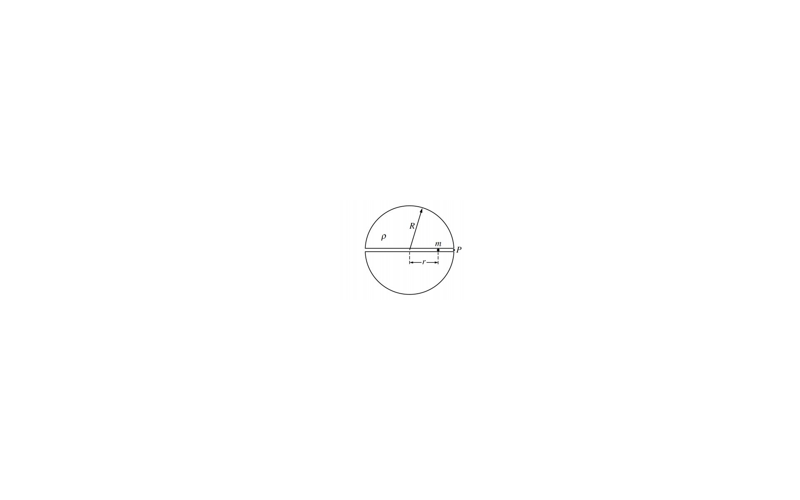

# Example 7: Ball in Tunnel Through Planet

## Problem Statement

A spherical, nonrotating planet has a radius $R$ and a uniform density $\rho$ throughout its volume. Suppose a narrow tunnel were drilled through the planet along one of its diameters, as shown in Figure 7, in which a small ball of mass $m$ could move freely under the influence of gravity. Let $r$ be the distance of the ball from the center of the planet.

*Figure 7: Ball moving in a tunnel through a uniform planet*

---

## Part (a)

**Question:** Show that the magnitude of the force on the ball at a distance $r < R$ from the center of the planet is given by $F = -Cr$, where $C = \frac{4}{3}\pi G\rho m$.

**Solution:**

For a uniform sphere, using Gauss's law for gravity (or direct integration), only the mass interior to radius $r$ contributes to the gravitational force:

Mass enclosed within radius $r$:
$$M_{enc} = \rho \cdot \frac{4}{3}\pi r^3$$

Gravitational force (directed toward center, so negative when $r > 0$):
$$F = -\frac{GmM_{enc}}{r^2} = -\frac{Gm \cdot \rho \cdot \frac{4}{3}\pi r^3}{r^2}$$

$$F = -\frac{4\pi G\rho m}{3} \cdot r$$

Therefore:
$$\boxed{C = \frac{4\pi G\rho m}{3}}$$

And:
$$\boxed{F = -Cr}$$

**Key insight:** The force is linear in $r$ and directed toward the center, exactly like a spring force $F = -kr$!

---

## Part (c)

**Question:** Determine the work done by gravity as the ball moves from the surface to the center of the planet.

**Solution:**

The ball is dropped from rest at point $P$ (surface, $r = R$) to the center ($r = 0$).

Work done by gravity:
$$W = \int_R^0 F \, dr = \int_R^0 (-Cr) \, dr$$

$$W = -C \left[\frac{r^2}{2}\right]_R^0 = -C \left(0 - \frac{R^2}{2}\right) = \frac{CR^2}{2}$$

Substituting $C = \frac{4\pi G\rho m}{3}$:

$$\boxed{W = \frac{2\pi G\rho m R^2}{3}}$$

**Alternative expression:** Using $\rho = \frac{M_{planet}}{\frac{4}{3}\pi R^3}$ and $g_{surface} = \frac{GM_{planet}}{R^2}$:

$$W = \frac{1}{2}mg_{surface}R$$

---

## Part (d)

**Question:** Determine the speed of the ball when it reaches the center of the planet.

**Solution:**

Using the work-energy theorem:
$$W = \Delta K = \frac{1}{2}mv^2 - 0$$

From part (c):
$$\frac{CR^2}{2} = \frac{1}{2}mv^2$$

Solving for $v$:
$$\boxed{v = \sqrt{\frac{CR^2}{m}} = R\sqrt{\frac{C}{m}} = R\sqrt{\frac{4\pi G\rho}{3}}}$$

Or using surface gravity $g = \frac{GM}{R^2} = \frac{4\pi G\rho R}{3}$:

$$\boxed{v = \sqrt{gR}}$$

**Numerical note:** For Earth ($R \approx 6.4 \times 10^6$ m, $g \approx 9.8$ m/s²):
$$v \approx \sqrt{9.8 \times 6.4 \times 10^6} \approx 7.9 \text{ km/s}$$

Interestingly, this equals orbital velocity at Earth's surface!

---

## Part (e)

**Question:** Fully describe the subsequent motion of the ball from the time it reaches the center of the planet.

**Solution:**

Since $F = -Cr$ is a linear restoring force (like a spring), the ball executes **simple harmonic motion (SHM)** about the center of the planet.

**Description of motion:**

1. **From center to opposite surface:** The ball continues past the center due to its kinetic energy. As it moves toward the opposite surface, the restoring force slows it down.

2. **At opposite surface ($r = -R$):** The ball momentarily comes to rest at the opposite side of the planet.

3. **Return journey:** The ball accelerates back toward the center, reaching maximum speed at $r = 0$.

4. **Back to starting point:** The ball returns to the starting point $P$ (where it was dropped), completing one full oscillation.

**Period of oscillation:**

From $F = -Cr = ma = m\frac{d^2r}{dt^2}$:
$$\frac{d^2r}{dt^2} = -\frac{C}{m}r = -\omega^2 r$$

Where:
$$\omega = \sqrt{\frac{C}{m}} = \sqrt{\frac{4\pi G\rho}{3}}$$

The period is:
$$T = \frac{2\pi}{\omega} = 2\pi\sqrt{\frac{3}{4\pi G\rho}} = \sqrt{\frac{3\pi}{G\rho}}$$

**Remarkably**, this period is **independent of the amplitude** (i.e., independent of $R$)! Any object dropped through any diameter of any uniform planet takes the same amount of time to return, depending only on the planet's density.

For Earth: $T \approx 84$ minutes.

---

## Part (f)

**Question:** Write an equation that could be used to calculate the time it takes the ball to move from point $P$ to the center of the planet. It is not necessary to solve this equation.

**Solution:**

**Method 1: Using SHM solution**

The position as a function of time for SHM with amplitude $R$:
$$r(t) = R\cos(\omega t)$$

where $\omega = \sqrt{\frac{C}{m}} = \sqrt{\frac{4\pi G\rho}{3}}$.

To find when $r = 0$ (center):
$$0 = R\cos(\omega t)$$
$$\cos(\omega t) = 0$$
$$\omega t = \frac{\pi}{2}$$

$$\boxed{t = \frac{\pi}{2\omega} = \frac{\pi}{2}\sqrt{\frac{3}{4\pi G\rho}} = \sqrt{\frac{3\pi}{16G\rho}}}$$

Or simply:
$$\boxed{t = \frac{T}{4}}$$

where $T$ is the full oscillation period.

**Method 2: Using energy (integral form)**

From energy conservation:
$$\frac{1}{2}mv^2 + \frac{1}{2}Cr^2 = \frac{1}{2}CR^2$$

$$v = \frac{dr}{dt} = \sqrt{\frac{C(R^2 - r^2)}{m}}$$

Separating variables:
$$\int_0^t dt = \int_R^0 \frac{dr}{\sqrt{\frac{C(R^2 - r^2)}{m}}}$$

$$\boxed{t = \sqrt{\frac{m}{C}} \int_0^R \frac{dr}{\sqrt{R^2 - r^2}}}$$

This integral evaluates to $\frac{\pi}{2}\sqrt{\frac{m}{C}}$, giving the same result as Method 1.

---

## Summary and Key Results

| Quantity | Expression |
|----------|------------|
| Force constant | $C = \frac{4\pi G\rho m}{3}$ |
| Force law | $F = -Cr$ (linear restoring force) |
| Work to center | $W = \frac{CR^2}{2}$ |
| Speed at center | $v = \sqrt{gR} = R\sqrt{\frac{4\pi G\rho}{3}}$ |
| Period of oscillation | $T = \sqrt{\frac{3\pi}{G\rho}}$ |
| Time to center | $t = \frac{T}{4} = \sqrt{\frac{3\pi}{16G\rho}}$ |

---

## Related Concepts
- [[Universal Gravitation]]
- [[Differential Equation for SHM]] - Simple harmonic motion from linear restoring force
- [[Conservation of Energy]]
- Gauss's Law for Gravity
- Simple Harmonic Motion

## Related Units
- [[Unit 2 Force and Translational Dynamics Index]]
- [[Unit 7 Oscillations Index]]

## Source
AP Physics C - Mechanics (Free Response Question)
