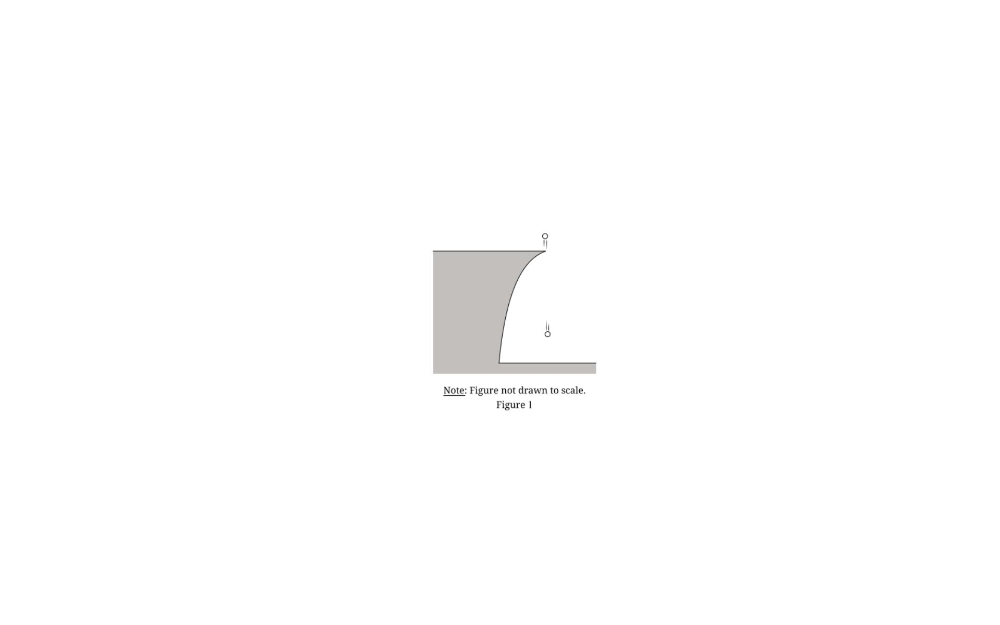
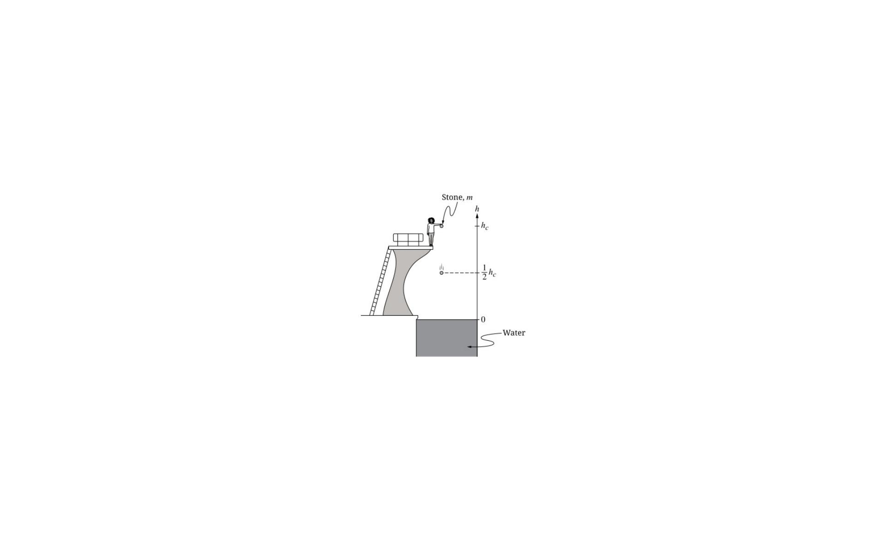
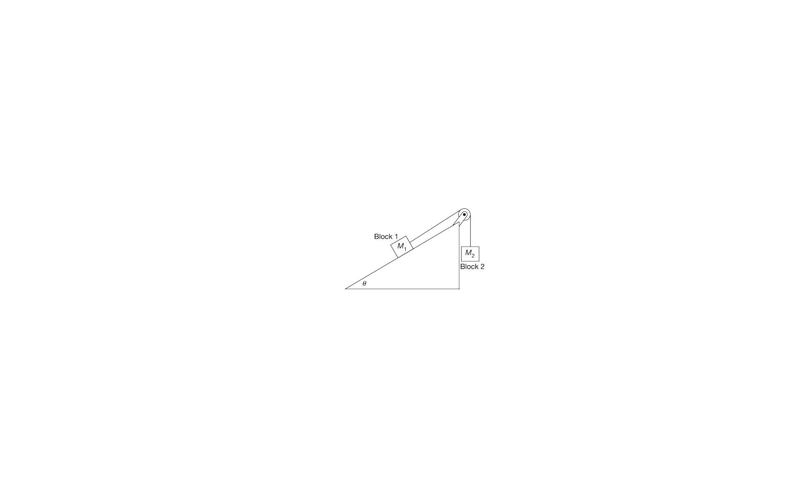
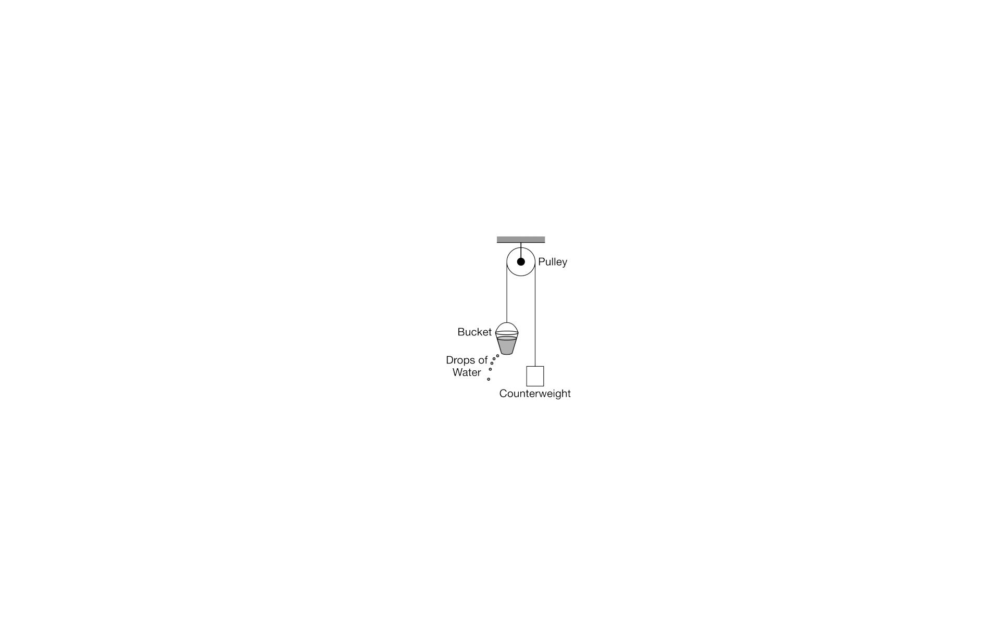
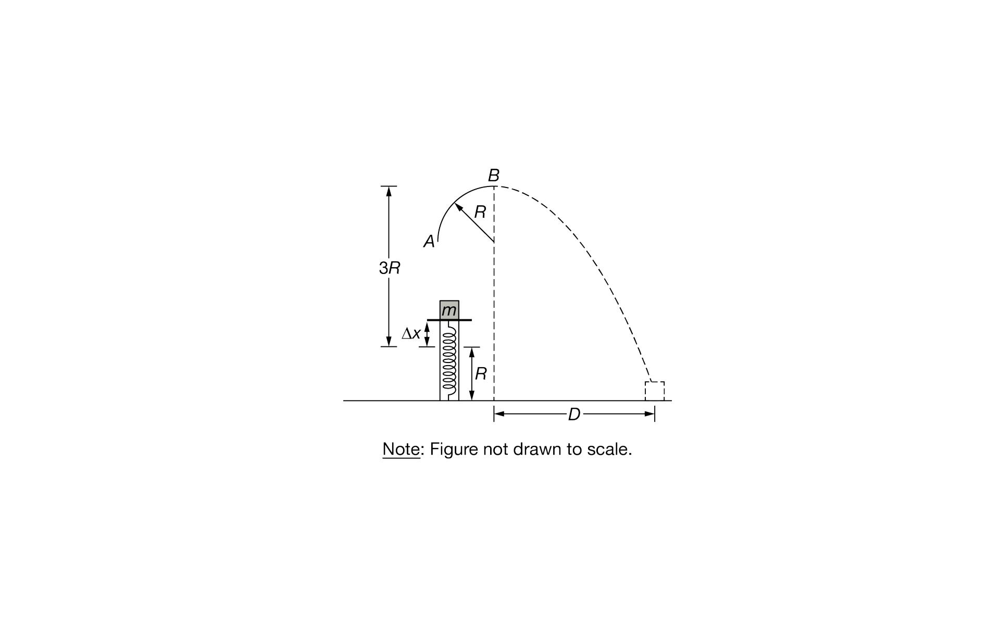
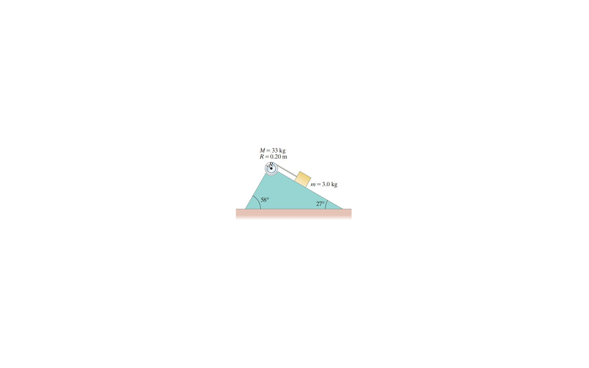
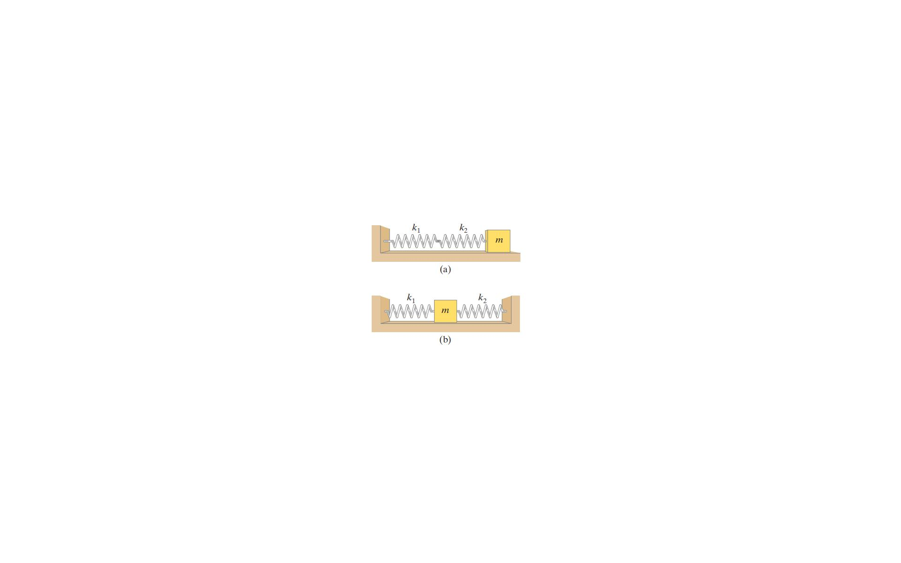
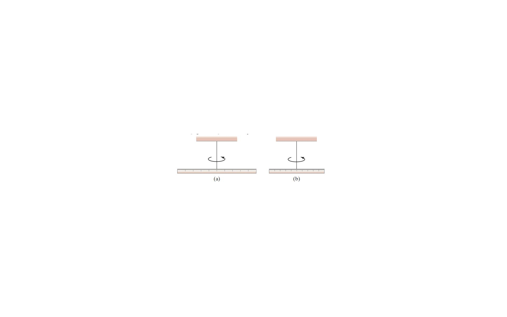
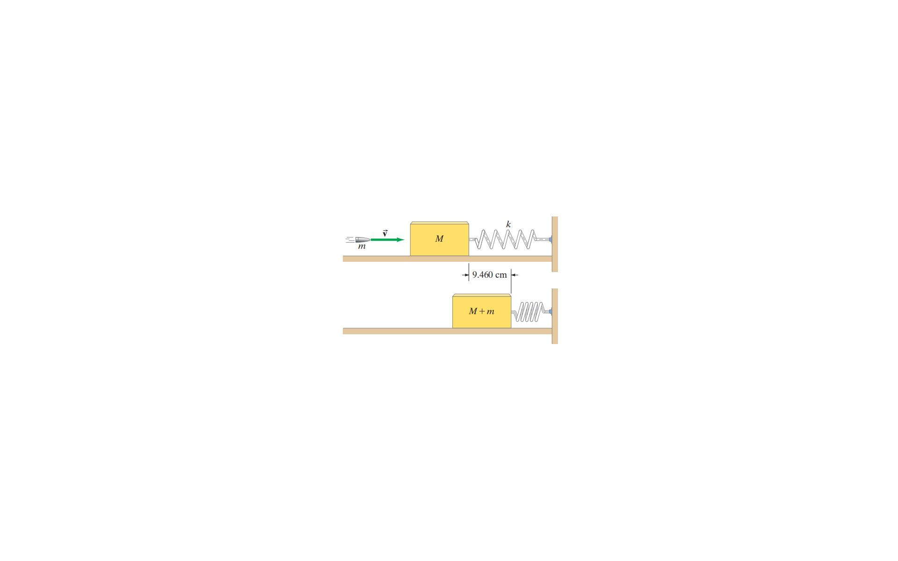

# Examples - AP Physics C Mechanics

This folder contains worked examples from AP Physics C Mechanics free response questions.

## Example Problems

### Example 1: Sphere with Air Resistance
- **Topic:** Dynamics with velocity-dependent drag force
- **Key Concepts:** Differential equations, terminal velocity, exponential decay
- **File:** [[Example 1 - Sphere with Air Resistance]]
- **Figure:** 

### Example 2: Box with Time-Varying Force
- **Topic:** Newton's laws with friction and time-varying applied force
- **Key Concepts:** Friction, exponential decay, integration of motion equations
- **File:** [[Example 2 - Box with Time-Varying Force]]
- **Figure:** 

### Example 3: Stone in Water
- **Topic:** Motion through fluid with drag force
- **Key Concepts:** Free fall, terminal velocity, fluid resistance, energy conservation
- **File:** [[Example 3 - Stone in Water]]
- **Figure:** 

### Example 4: Two-Block System on Inclined Plane
- **Topic:** Inclined plane with friction and connected masses
- **Key Concepts:** Static and kinetic friction, equilibrium, connected systems
- **File:** [[Example 4 - Two-Block Inclined Plane]]
- **Figure:** 

### Example 5: Atwood Machine with Leaking Bucket
- **Topic:** Variable mass system with time-dependent mass
- **Key Concepts:** Atwood machine, variable mass, mechanical energy, graph analysis
- **File:** [[Example 5 - Atwood Machine with Leaking Bucket]]
- **Figure:** 

### Example 6: Sliding Rope on Frictionless Table
- **Topic:** Variable mass system with energy methods
- **Key Concepts:** Work-energy theorem, center of mass, variable force
- **File:** [[Example 6 - Sliding Rope]]
- **Figure:** 

### Example 7: Ball in Tunnel Through Planet
- **Topic:** Gravitational force inside a uniform sphere and SHM
- **Key Concepts:** Universal gravitation, linear restoring force, simple harmonic motion
- **File:** [[Example 7 - Ball in Tunnel Through Planet]]
- **Figure:** 

### Example 8: Power and Work from Position Function
- **Topic:** Power calculation from position function
- **Key Concepts:** Instantaneous power, average power, work-energy theorem
- **File:** [[Example 8 - Power from Position Function]]
- Note: No figure - text-based problem

### Example 9: Potential Energy and Turning Points
- **Topic:** Potential energy analysis and bound states
- **Key Concepts:** Turning points, energy conservation, Lennard-Jones-like potential
- **File:** [[Example 9 - Potential Energy and Turning Points]]
- Note: No figure - text-based problem

### Example 10: Spring-Launch into Semicircular Track
- **Topic:** Spring energy, circular motion, and projectile motion
- **Key Concepts:** Conservation of energy, circular motion, projectile motion
- **File:** [[Example 10 - Spring-Launch into Semicircular Track]]
- **Figure:** 

### Example 11: Lennard-Jones Potential
- **Topic:** Intermolecular potential and molecular dynamics
- **Key Concepts:** Lennard-Jones potential, equilibrium, bound states
- **File:** [[Example 11 - Lennard-Jones Potential]]
- Note: No figure - text-based problem

### Example 12: Disk Pulled by String on Frictionless Surface
- **Topic:** Combined translation and rotation on frictionless surface
- **Key Concepts:** Moment of inertia, rolling without slipping, work-energy theorem
- **File:** [[Example 12 - Disk Pulled by String]]
- **Figure:** 

### Example 13: Billiard Ball and Cue Stick (Sweet Spot)
- **Topic:** Center of percussion for rolling without slipping
- **Key Concepts:** Center of percussion, rolling motion, impulse-momentum
- **File:** [[Example 13 - Billiard Ball Sweet Spot]]
- **Figure:** 

### Example 14: Block and Cylinder on Inclined Plane
- **Topic:** Connected system with rotation on incline
- **Key Concepts:** Torque, rotational dynamics, energy with friction
- **File:** [[Example 14 - Block and Cylinder on Incline]]
- **Figure:** 

### Example 15: Man Grabbing Sliding Beam
- **Topic:** Conservation of angular momentum in collision
- **Key Concepts:** Conservation of angular momentum, center of mass, parallel axis theorem
- **File:** [[Example 15 - Man Grabbing Sliding Beam]]
- **Figure:** 

### Example 16: Bullet Through Pivoted Stick
- **Topic:** Angular momentum transfer in collision
- **Key Concepts:** Conservation of angular momentum, moment of inertia of rod
- **File:** [[Example 16 - Bullet Through Pivoted Stick]]
- **Figure:** 

### Example 17: Springs in Series and Parallel
- **Topic:** Equivalent spring constants and periods
- **Key Concepts:** Springs in series, springs in parallel, effective spring constant, SHM period
- **File:** [[Example 17 - Springs in Series and Parallel]]
- **Figure:** 

### Example 18: Torsional Oscillation of a Meter Stick
- **Topic:** Torsional pendulum with varying length
- **Key Concepts:** Torsional oscillation, moment of inertia scaling, period formula
- **File:** [[Example 18 - Torsional Oscillation of Meter Stick]]
- **Figure:** 

### Example 19: Ballistic Measurement with Spring
- **Topic:** Two-stage collision and energy problem
- **Key Concepts:** Inelastic collision, momentum conservation, spring energy, ballistic measurement
- **File:** [[Example 19 - Ballistic Measurement with Spring]]
- **Figure:** 

---

## Related Concepts
- [[Friction Forces]]
- [[Atwood Machine]]
- [[Conservation of Energy]]
- [[Differential Equations in Mechanics]]

## Related Units
- [[Unit 2 Force and Translational Dynamics Index]]
- [[Unit 5 Torque and Rotational Dynamics Index]]
- [[Unit 6 Energy and Momentum of Rotating Systems Index]]
- [[Unit 7 Oscillations Index]]
