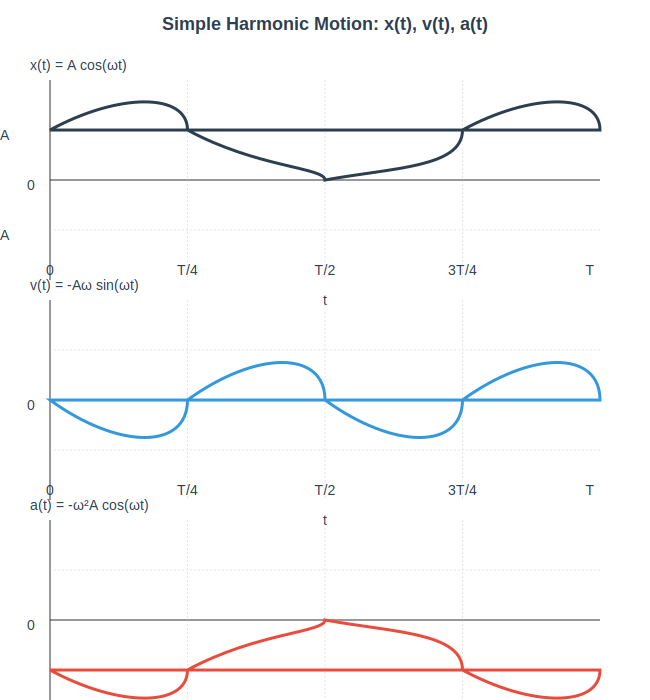
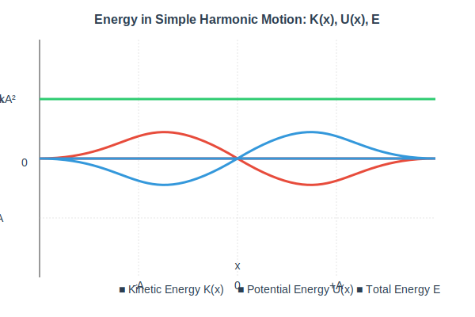

# Simple Harmonic Motion

**Simple Harmonic Motion (SHM)** is the most fundamental oscillatory motion. It occurs when the restoring force is directly proportional to the displacement from equilibrium, and opposite in direction:

$$F = -kx$$

This gives the differential equation:

$$\frac{d^2x}{dt^2} + \omega^2 x = 0 \quad \text{where} \quad \omega = \sqrt{\frac{k}{m}}$$

---

## Displacement, Velocity, and Acceleration

### General Equations (Starting from Maximum Displacement (Phase = 0)

When we start the motion at $x = A$ at $t = 0$:

**Displacement:**
$$\boxed{x(t) = A \cos(\omega t + \phi)}$$
where:
- $A$ = amplitude (maximum displacement)
- $\omega$ = angular frequency ($\omega = 2\pi f = \frac{2\pi}{T}$)
- $\phi$ = phase constant (here $\phi = 0$ for our starting condition)

**Velocity:**
$$v(t) = \frac{dx}{dt} = \boxed{-A\omega \sin(\omega t)}$$

**Acceleration:**
$$a(t) = \frac{dv}{dt} = \boxed{-A\omega^2 \cos(\omega t) = -\omega^2 x(t)}$$

### Phase Relationship

| Quantity | Expression | Phase relative to displacement |
|----------|-------------|-------|
| **Displacement** | $x = A\cos(\omega t)$ | Reference |
| **Velocity** | $v = -A\omega\sin(\omega t)$ | Leads displacement by $\frac{\pi}{2}$ (90°) |
| **Acceleration** | $a = -A\omega^2\cos(\omega t) = -\omega^2 x$ | Opposite phase to displacement (180° out of phase) |

---

## Graphs of $x(t)$, $v(t)$, $a(t)$

### Characteristics when starting at $x = A$ ($t=0$):

---

### Summary of Values at Different Times

| Time | Displacement $x$ | Velocity $v$ | Acceleration $a$ |
|------|------------------|---------------|------------------|
| $t = 0$ | $+A$ | $0$ | $-A\omega^2$ |
| $t = T/4$ | $0$ | $-A\omega$ | $0$ |
| $t = T/2$ | $-A$ | $0$ | $+A\omega^2$ |
| $t = 3T/4$ | $0$ | $+A\omega$ | $0$ |
| $t = T$ | $+A$ | $0$ | $-A\omega^2$ |

---

## Energy in Simple Harmonic Motion

### Total Mechanical Energy

$$E = K + U = \text{constant}$$

**Kinetic Energy:**
$$K = \frac{1}{2}mv^2 = \frac{1}{2}m(-A\omega\sin\omega t)^2 = \boxed{\frac{1}{2}kA^2 \sin^2\omega t}$$

(Recall that $\omega^2 = \frac{k}{m}$ so $m\omega^2 = k$.)

**Potential Energy** (spring):
$$U = \frac{1}{2}kx^2 = \boxed{\frac{1}{2}kA^2 \cos^2\omega t}$$

**Total Energy:**
$$E = \frac{1}{2}kA^2 (\sin^2\omega t + \cos^2\omega t) = \boxed{\frac{1}{2}kA^2}$$

### Energy Exchange

- When $|x| = A$ (maximum displacement): $K = 0$, $U = \frac{1}{2}kA^2 = E$ (all potential)
- When $x = 0$ (equilibrium): $U = 0$, $K = \frac{1}{2}kA^2 = E$ (all kinetic)
- Energy continuously converts between potential and kinetic as the system oscillates

### Energy vs Displacement Graph

---

## Key Relationships Summary

1. **a(t) = -\omega^2 x(t)** → Acceleration is always proportional to displacement and opposite in direction
2. **v(t) = \frac{dx}{dt}** → Velocity is the time derivative of displacement
3. **a(t) = \frac{dv}{dt} = \frac{d^2x}{dt^2}** → Acceleration is the second derivative
4. **Phase differences:**
   - Velocity leads displacement by 90°
   - Acceleration is 180° out of phase with displacement
5. **Energy conservation:** Total energy $E = \frac{1}{2}kA^2 = constant$, exchanging between kinetic and potential

---

## Worked Examples

- [[Differential Equation for SHM]]

## Related Concepts
- [[Differential Equation for SHM]]
- [[Physical Pendulum]]
- [[Resonance]]
- [[Example 7 - Ball in Tunnel Through Planet]] → SHM from gravitational force

## Related Units
- [[Unit 7 Oscillations Index]]

## Source
AP Physics C - Mechanics
