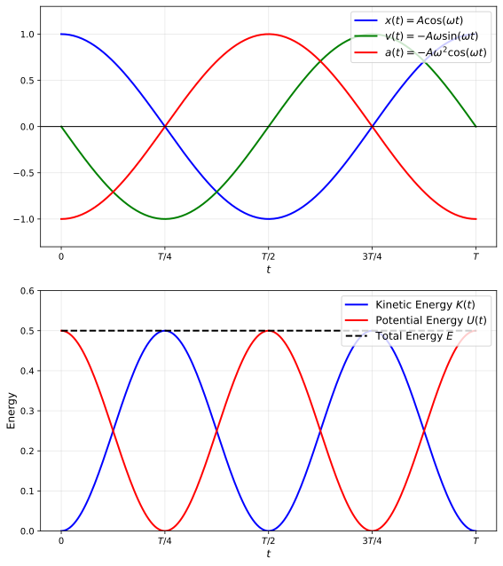

# Simple Harmonic Motion

**Simple Harmonic Motion (SHM)** is the most fundamental oscillatory motion. It occurs when the restoring force is directly proportional to the displacement from equilibrium, and opposite in direction:

$$F = -kx$$

This gives the differential equation:

$$\frac{d^2x}{dt^2} + \omega^2 x = 0 \quad \text{where} \quad \omega = \sqrt{\frac{k}{m}}$$

---

## Displacement, Velocity, and Acceleration

### General Equations (Starting from Maximum Displacement with Phase = 0)

When we start the motion at $x = A$ when $t = 0$:

**Displacement:**
$$\boxed{x(t) = A \cos(\omega t + \phi)}$$
where:
- $A$ = amplitude (maximum displacement)
- $\omega$ = angular frequency ($\omega = 2\pi f = \frac{2\pi}{T}$)
- $\phi$ = phase constant ($\phi = 0$ for our starting condition here)

**Velocity:**
$$v(t) = \frac{dx}{dt} = \boxed{-A\omega \sin(\omega t)}$$

**Acceleration:**
$$a(t) = \frac{dv}{dt} = \boxed{-A\omega^2 \cos(\omega t) = -\omega^2 x(t)}$$

### Phase Relationship

| Quantity | Expression | Phase relative to displacement |
|----------|-------------|-----------------------|
| **Displacement** | $x = A\cos(\omega t)$ | Reference |
| **Velocity** | $v = -A\omega\sin(\omega t)$ | Leads displacement by $\frac{\pi}{2}$ (90°) |
| **Acceleration** | $a = -A\omega^2\cos(\omega t) = -\omega^2 x$ | Opposite phase to displacement (180° out of phase) |

---

## Graphs of $x(t)$, $v(t)$, $a(t)$, $K(t)$, $U(t)$

---

### Summary of Values at Different Times

| Time | Displacement $x$ | Velocity $v$ | Acceleration $a$ |
|------|------------------|---------------|------------------|
| $t = 0$ | $+A$ | $0$ | $-A\omega^2$ |
| $t = T/4$ | $0$ | $-A\omega$ | $0$ |
| $t = T/2$ | $-A$ | $0$ | $+A\omega^2$ |
| $t = 3T/4$ | $0$ | $+A\omega$ | $0$ |
| $t = T$ | $+A$ | $0$ | $-A\omega^2$ |

---

## Key Relationships Summary

1. **$a(t) = -\omega^2 x(t)$** → Acceleration is always proportional to displacement and opposite in direction
2. **$v(t) = \frac{dx}{dt}$** → Velocity is the time derivative of displacement
3. **$a(t) = \frac{dv}{dt} = \frac{d^2x}{dt^2}$** → Acceleration is the second derivative
4. **Phase differences:**
   - Velocity leads displacement by 90°
   - Acceleration is 180° out of phase with displacement
5. **Energy conservation:** Total energy $E = \frac{1}{2}kA^2 = \text{constant}$, continuously exchanging between kinetic and potential

---

## Physical Pendulum (物理摆)

A **physical pendulum** is any rigid body pivoted at a point other than its center of mass, oscillating under gravity. Unlike the simple pendulum (point mass on a massless string), the physical pendulum accounts for the body's **moment of inertia**.

### Derivation

$$\tau = -mgd \sin\theta \quad \rightarrow \quad \text{重力产生的回复力矩}$$

> 小角度近似：$\sin\theta \approx \theta$

$$I \cdot \alpha = -mgd \cdot \theta \quad \rightarrow \quad \text{转动定律} \ \tau = I\alpha$$

$$\alpha = -\left(\frac{mgd}{I}\right)\theta \quad \rightarrow \quad \text{SHM 标准形式} \ \alpha = -\omega^2\theta$$

$$\omega^2 = \frac{mgd}{I} \quad \rightarrow \quad \omega = \sqrt{\frac{mgd}{I}} \quad \rightarrow \quad \text{角频率}$$

$$\boxed{T = 2\pi\sqrt{\frac{I}{mgd}}} \quad \rightarrow \quad \text{周期（物理摆核心公式）}$$

### 参数说明

| 符号 | 含义 | 单位 |
|------|------|------|
| $m$ | 刚体质量 | kg |
| $g$ | 重力加速度 | m/s² |
| $d$ | 转轴到质心的距离 | m |
| $I$ | 绕转轴的转动惯量 | kg·m² |
| $\theta$ | 角位移（小角度近似 $\sin\theta \approx \theta$） | rad |

### 特例：单摆 (Simple Pendulum)

当质量集中在一点，悬线无质量时：

$$I = mL^2, \quad d = L$$

代入物理摆周期公式：

$$T = 2\pi\sqrt{\frac{mL^2}{mgL}} = 2\pi\sqrt{\frac{L}{g}}$$

### 物理摆 vs 弹簧振子

| | 弹簧振子 | 物理摆 |
|------|----------|--------|
| **回复因素** | $F = -kx$ | $\tau = -mgd\,\theta$ |
| **惯性因素** | $m$ | $I$ |
| **SHM 条件** | 胡克定律 | 小角度 $\theta \ll 1$ |
| **标准形式** | $a = -\frac{k}{m}x$ | $\alpha = -\frac{mgd}{I}\theta$ |
| **角频率** | $\omega = \sqrt{k/m}$ | $\omega = \sqrt{mgd/I}$ |
| **周期** | $T = 2\pi\sqrt{m/k}$ | $T = 2\pi\sqrt{I/mgd}$ |

> [!tip]+ 解题关键
> 物理摆问题核心三步：
> 1. **找转轴** → 确定 $I$（平行轴定理：$I = I_{CM} + md^2$）
> 2. **找质心** → 确定 $d$
> 3. **代入** → $T = 2\pi\sqrt{I/mgd}$

---

- [[Differential Equation for SHM]]

## Related Concepts
- [[Differential Equation for SHM]]
- [[Physical Pendulum]]
- [[Resonance]]
- [[Example 7 - Ball in Tunnel Through Planet]] → SHM from gravitational force

## Related Units
- [[Unit 7 Oscillations Index]]
- [[Unit 2 Force and Translational Dynamics Index]]
- [[Unit 6 Energy and Momentum of Rotating Systems Index]]

## 跨领域联系
- [[../经典力学/经典力学索引]] — 经典力学中的振动理论
- [[../电磁学/麦克斯韦方程组]] — 电磁振荡的数学基础

## Source
AP Physics C - Mechanics
