COURSE AND EXAM DESCRIPTION

Effective Fall 2024

## AP® Physics C: Mechanics

Instructional section

√Sample exam questions

# AP® Physics C: Mechanics

COURSE AND EXAM DESCRIPTION

Efective Fall 2024

## What AP® Stands For

Thousands of Advanced Placement teachers have contributed to the principles articulated here. These principles are not new; they are, rather, a reminder of how AP already works in classrooms nationwide. The following principles are designed to ensure that teachers’ expertise is respected, required course content is understood, and students are academically challenged and free to make up their own minds.

1. AP standsforclarityandtransparency.Teachersandstudentsdeserveclear expectations. The Advanced Placement Program makes public its course frameworks and sample assessments. Confusion about what is permitted in the classroom disrupts teachers and students as they navigate demanding work.

2. AP isanunflinchingencounterwithevidence.APcoursesenablestudentstodevelop as independent thinkers and to draw their own conclusions. Evidence and the scientificmethodarethestartingplaceforconversationsinAPcourses.

3. AP opposescensorship.APisanimatedbyadeeprespectfortheintellectual freedom of teachers and students alike. If a school bans required topics from their AP courses, the AP Program removes the AP designation from that course and its inclusion in the AP Course Ledger provided to colleges and universities. For example, the concepts of evolution are at the heart of college biology, and a course that neglects such concepts does not pass muster as AP Biology.

4. APopposesindoctrination.APstudentsareexpectedtoanalyzediferent perspectives from their own, and no points on an AP Exam are awarded for agreementwithanyspecificviewpoint.APstudentsarenotrequiredtofeel certain ways about themselves or the course content. AP courses instead develop students’ abilities to assess the credibility of sources, draw conclusions, and make up their own minds.

As the AP English Literature course description states: “AP students are not expectedoraskedtosubscribetoanyonespecificsetofculturalorpoliticalvalues, butareexpectedtohavethematuritytoanalyzeperspectivesdiferentfromtheir ownandtoquestionthemeaning,purpose,orefectofsuchcontentwithinthe literary work as a whole.”

5. APcoursesfosteranopen-mindedapproachtothehistoriesandculturesof diferentpeoples.Thestudyofdiferentnationalities,cultures,religions,races,and ethnicities is essential within a variety of academic disciplines. AP courses ground such studies in primary sources so that students can evaluate experiences and evidence for themselves.

6. EveryAPstudentwhoengageswithevidenceislistenedtoandrespected. Students are encouraged to evaluate arguments but not one another. AP classrooms respect diversity in backgrounds, experiences, and viewpoints. The perspectives and contributions of the full range of AP students are sought and considered. Respectful debate of ideas is cultivated and protected; personal attacks have no place in AP.

7. APisachoiceforparentsandstudents.Parentsandstudentsfreelychooseto enroll in AP courses. Course descriptions are available online for parents and studentstoinformtheirchoice.Parentsdonotdefinewhichcollege-leveltopics are suitable within AP courses; AP course and exam materials are crafted by committeesofprofessorsandotherexperteducatorsineachfield.APcoursesand exams are then further validated by the American Council on Education and studies thatconfirmtheuseofAPscoresforcollegecreditsbythousandsofcollegesand universities nationwide.

The AP Program encourages educators to review these principles with parents and students so they know what to expect in an AP course. Advanced Placement is always achoice,anditshouldbeaninformedone.APteachersshouldbegiventheconfidence and clarity that once parents have enrolled their child in an AP course, they have agreed to a classroom experience that embodies these principles.

## Contents

v Acknowledgments
1 About AP
4 AP Resources and Supports
5 Instructional Model
6 About the AP Physics C: Mechanics Course
6 College Course Equivalent
6 Prerequisites
6 Laboratory Requirement

COURSE FRAMEWORK
8 Introduction
9 Science Practices
11 Course Content
13 Course at a Glance
17 Unit Guides
18 Using the Unit Guides
21 UNIT 1: Kinematics
35 UNIT 2: Force and Translational Dynamics
61 UNIT 3: Work, Energy, and Power
77 UNIT 4: Linear Momentum
89 UNIT 5: Torque and Rotational Dynamics
105 UNIT 6: Energy and Momentum of Rotating Systems
121 UNIT 7: Oscillations

LABORATORY INVESTIGATIONS
136 Lab Experiments
137 How to Set Up a Lab Program
139 Laboratory Investigations

INSTRUCTIONAL APPROACHES
144 Selecting and Using Course Materials
145 Guided Inquiry in AP Physics C: Mechanics
148 Instructional Strategies
154 Developing the Science Practices

EXAM INFORMATION
164 Exam Overview
166 How Student Learning Is Assessed on the AP Exam
169 Task Verbs Used in Free-Response Questions
170 Sample Exam Questions

## SCORING GUIDELINES

187 Question 1: Mathematical Routines

189 Question 2: Translation Between Representations

192 Question 3: Experimental Design and Analysis

194 Question 4: Qualitative/Quantitative Translation

## APPENDIX

198 Vocabulary and Definitions of Important Ideas in AP Physics

203 Table of Information: Equations

# Acknowledgments

College Board would like to acknowledge the following committee members, consultants, and reviewers for their assistance with and commitment to the development of this course. All individuals and their afiliations were current at the time of contribution.

Hamza Balci, Kent State University, Kent, OH

Suzanne Brahmia, University of Washington, Seattle, WA

Eric Burkholder, Stanford University, Stanford, CA

Gerald Cleaver, Baylor University, Waco, TX

Robert Davis, Brigham Young University, Provo, UT

Veronica Ellingson, Hudson Senior High School, Hudson, WI

Karin Foss, Wayzata High School, Plymouth, MN

Herbert Fotso, The State University of New York at Bufalo, Bufalo, NY

Kristin Glover, Prairie Ridge High School, Crystal Lake, Illinois

Kathy Harper, Case Western Reserve University, Cleveland, OH

Mark Hossler, Landmark Christian School, Fairburn, GA

Stefan Jeglinski, University of North Carolina, Chapel Hill, NC

Kathy Koenig, University of Cincinnati, Cincinnati, OH

Kristine Lang, Colorado College, Colorado Springs, CO

Robynne Lock, Texas A and M University, Commerce, Commerce, TX

Sam Lofland, Rowan University, Glassboro, New Jersey

Joe Mancino, Glastonbury High School, Glastonbury, CT

Ricardo Markland, Miami Coral Park Senior High School, Miami, FL

Dee Dee Messer, William Mason High School, Mason, OH

Matthew Milligan, Farragut High School, Knoxville, TN

Holley Mosley, Liberty High School, Frisco, TX

Heather Rave, St. Thomas Aquinas College, Orangeburg, NY

Matt Sckalor, Great Neck South High School, Great Neck, NY

Peter Sheldon, Randolph College, Lynchburg, VA

Gay Stewart, West Virginia University, Morgantown, WV

Shelly Strand, West Fargo High School, West Fargo, ND

Dawn Striker, Longmeadow High School, Longmeadow, MA

Oather Strawderman, Lawrence Free State High School, Lawrence, KS

Yau-Jong Twu, Eleanor Roosevelt High School, Greenbelt, MD

Brian Utter, University of California Merced, Merced, CA

Matthew Vonk, University of Wisconsin-River Falls, River Falls, WI

## College Board Staf

Amy Johnson, Senior Director, Manager, AP Physics Curriculum and Assessment

Caitlin Carpenter, Director, AP Physics Curriculum and Assessment

Jesse Miner, Director, AP Physics Curriculum and Assessment

John Pinizzotto, Director, AP Physics Curriculum and Assessment

Beth Brown, Director, Product Development and Editorial

Shu-Kang Chen, Executive Director, Department Head, AP Science

Claire Lorenz, Senior Director, AP School Experience

Serena Magrogan, Senior Director, Manager, AP Science Curriculum and Assessment

Laura Keegan, Senior Director, AP Program Access Product Owner

Daniel McDonough, Senior Director, AP Content and Assessment Publications

Allison Thurber, Vice President, AP Curriculum and Assessment

SPECIAL THANKS Brian Brown, Anders Gardestig, Ann Marie Zolandz, Angela Jensvold, and Mark Widmer

## About AP

The Advanced Placement® Program (AP®) enables willing and academically prepared students to pursue college-levelstudies—withtheopportunitytoearn collegecredit,advancedplacement,orboth—while still in high school. Through AP courses in more than 40 subjects, each culminating in a challenging exam, students learn to think critically, construct solid arguments,andseemanysidesofanissue—skills that prepare them for college and beyond. Taking AP coursesdemonstratestocollegeadmissionoficers that students have sought the most challenging curriculum available to them, and research indicates that students who score a 3 or higher on an AP Exam typically experience greater academic success in college and are more likely to earn a college degree thannon-APstudents.EachAPteacher’ssyllabus is evaluated and approved by faculty from some of the nation’s leading colleges and universities, and AP Exams are developed and scored by college faculty and experiencedAPteachers.Mostfour-yearcollegesand universities in the United States grant credit, advanced placement, or both on the basis of successful AP Examscores—morethan3,300institutionsworldwide annually receive AP scores.

## AP Course Development

Inanongoingeforttomaintainalignmentwithbest practicesincollege-levellearning,APcoursesand examsemphasizechallenging,research-based curricula aligned with higher education expectations.

Individual teachers are responsible for designing their own curriculum for AP courses, selecting appropriate college-levelreadings,assignments,andresources. This course and exam description presents the content and skills that are the focus of the corresponding college course and that appear on the AP Exam. It also organizesthecontentandskillsintoaseriesofunits that represent a sequence found in widely adopted college textbooks and that many AP teachers have told us they follow to focus their instruction. The intention of this publication is to respect teachers time and expertise by providing a roadmap that they can modify and adapt to their local priorities and preferences.Moreover,byorganizingtheAPcourse content and skills into units, the AP Program is able

to provide teachers and students with free formative assessments—ProgressChecks—thatteachers can assign throughout the year to measure student progress as they acquire content knowledge and develop skills.

## Enrolling Students: Access, Opportunity, and Readiness

The AP Program welcomes all students willing to challengethemselveswithcollege-levelcoursework and career preparation. We strongly encourage educators to invite students into AP classes, including students from ethnic, racial, socioeconomic, geographic, or other groups not broadly participating in a school's AP program. We believe that readiness for AP is attainable, and that educators can expand readiness byopeningaccesstoPre-APcoursework.Wecommit tosupporteducatorsandcommunitiesintheireforts to make AP courses widely available, advancing students in their plans for college and careers.

## Ofering AP Courses: The AP Course Audit

The AP Program unequivocally supports the principle that each school implements its own curriculum that will enable students to develop the content understandings and skills described in the course framework.

While the unit sequence represented in this publication is optional, the AP Program does have a short list of curricular and resource requirements that must be fulfilledbeforeaschoolcanlabelacourse“Advanced Placement”or“AP.”SchoolswishingtooferAP courses must participate in the AP Course Audit, a process through which AP teachers’ course materials are reviewed by college faculty. The AP Course Audit was created to provide teachers and administrators with clear guidelines on curricular and resource requirements for AP courses and to help colleges and universities validate courses marked “AP” on students transcripts. This process ensures that AP teachers’ courses meet or exceed the curricular and resource expectations that college and secondary school faculty haveestablishedforcollege-levelcourses.

The AP Course Audit form is submitted by the AP teacher and the school principal (or designated administrator)toconfirmawarenessandunderstanding of the curricular and resource requirements. A syllabus or course outline, detailing how course requirements are met, is submitted by the AP teacher for review by college faculty.

Please visit the AP Course Audit website for more information to support the preparation and submission of materials for the AP Course Audit.

## How the AP Program Is Developed

The scope of content for an AP course and exam is derived from an analysis of hundreds of syllabi and courseoferingsofcollegesanduniversities.Using this research and data, a committee of college faculty and expert AP teachers work within the scope of the corresponding college course to articulate what students should know and be able to do upon the completion of the AP course. The resulting course framework is the heart of this course and exam description and serves as a blueprint of the content and skills that can appear on an AP Exam.

The AP Test Development Committees are responsible for developing each AP Exam, ensuring the exam questions are aligned to the course framework. The AP Exam development process is a multiyear endeavor; all AP Exams undergo extensive review, revision, piloting, and analysis to ensure that questions are accurate, fair, and valid, and that there is an appropriate spread of dificultyacrossthequestions.

Committee members are selected to represent a variety of perspectives and institutions (public and private, small and large schools and colleges), and a range of gender, racial/ethnic, and regional groups. A list of each subject’s current AP Test Development Committee members is available on AP Central®.

Throughout AP course and exam development, College Board gathers feedback from various stakeholders in both secondary schools and higher education institutions. This feedback is carefully considered to ensure that AP courses and exams are able to provide studentswithacollege-levellearningexperienceand theopportunitytodemonstratetheirqualificationsfor advanced placement or college credit.

## How AP Exams Are Scored

The exam scoring process, like the course and exam development process, relies on the expertise of both APteachersandcollegefaculty.Whilemultiple-choice questions are scored by machine, the freeresponse

questionsandthrough-courseperformance assessments, as applicable, are scored by thousands of college faculty and expert AP teachers. Most are scored at the annual AP Reading, while a small portion is scored online. All AP Readers are thoroughly trained, and their work is monitored throughout the Reading for fairness and consistency. In each subject, a highly respected college faculty member serves as Chief Faculty Consultant and, with the help of AP Readers in leadership positions, maintains the accuracy of thescoringstandards.Scoresonthefree-response questions and performance assessments are weighted andcombinedwiththeresultsofthecomputer-scored multiple-choicequestions,andthisrawscoreis converted into a composite AP score on a 1–5 scale.

AP Exams are not norm referenced or graded on a curve. Instead, they are criterion referenced, which means that every student who meets the criteria for an AP score of 2, 3, 4, or 5 will receive that score, no matter how many students that is. The criteria for the number of points students must earn on the AP Exam toreceivescoresof3,4,or5—thescoresthatresearch consistently validates for credit and placement purposes—include:

The number of points successful college students earn when their professors administer AP Exam questions to them

§ Performance that researchers have found to be predictive of an AP student succeeding when placed intoasubsequenthigher-levelcollegecourse

The number of points college faculty indicate, after reviewing each AP question, that they expect is necessary to achieve each AP grade level

## Using and Interpreting AP Scores

The extensive work done by college faculty and AP teachers in the development of the course and exam and throughout the scoring process ensures that AP Exam scores accurately represent students achievement in the equivalent college course. Frequent and regular research studies establish the validity of AP scores as follows:

<table><tr><td>AP Score</td><td>Credit Recommendation</td><td>College Grade Equivalent</td></tr><tr><td>5</td><td>Extremely well qualified</td><td>A</td></tr><tr><td>4</td><td>Well qualified</td><td>A−, B+, B</td></tr><tr><td>3</td><td>Qualified</td><td>B−, C+, C</td></tr><tr><td>2</td><td>Possibly qualified</td><td>n/a</td></tr><tr><td>1</td><td>No recommendation</td><td>n/a</td></tr></table>

While colleges and universities are responsible for setting their own credit and placement policies, most private colleges and universities award credit and/ or advanced placement for AP scores of 3 or higher. Additionally, most states in the U.S. have adopted statewide credit policies that ensure college credit for scores of 3 or higher at public colleges and universities. Toconfirmaspecificcollege’sAPcredit/placement policy, a search engine is available on the AP Credit Policy Search page.

## BECOMING AN AP READER

Each June, thousands of AP teachers and college faculty members from around the world gather for seven days in multiple locations to evaluate and scorethefree-responsesectionsoftheAPExams. Ninetyeight percent of surveyed educators who took part in the AP Reading say it was a positive experience.

There are many reasons to consider becoming an AP Reader, including opportunities to:

§ Bring positive changes to the classroom: Surveys show that the vast majority of returning APReaders—bothhighschoolandcollege

educators—makeimprovementstothewaythey teach or score because of their experience at the AP Reading.

Gain in-depth understanding of AP Exam and AP scoring standards: AP Readers gain exposure to the quality and depth of the responses from the entire pool of AP Exam takers, and thus are better able to assess their students’ work in the classroom.

Receive compensation: AP Readers are compensated for their work during the Reading. Expenses, lodging, and meals are covered for Readers who travel.

Score from home: AP Readers have online distributed scoring opportunities for certain subjects. Check the AP Readersitefor details.

Earn Continuing Education Units (CEUs): AP Readers earn professional development hours and CEUs that can be applied to PD requirements by states, districts, and schools.

## How to Apply

Visit the Become an AP Reader site for eligibility requirements and to start the application process.

# AP Resources and Supports

By completing a simple class selection process at the start of the school year, teachers and students receive access to a robust set of classroom resources.

## AP Classroom

AP Classroom is a dedicated online platform designed to support teachers and students throughout their AP experience. The platform provides a variety of powerful resources and toolstoprovideyearlongsupporttoteachersandstudents,oferingopportunitiestogiveand get meaningful feedback on student progress.

## UNIT GUIDES

Appearing in this publication and on AP Classroom, these planning guides outline all required coursecontentandskills,organizedintocommonlytaughtunits.Eachunitguidesuggestsa sequenceandpacingofcontent,scafoldsskillinstructionacrossunits,organizescontent into topics, and provides tips on taking the AP Exam.

## PROGRESS CHECKS

Formative AP questions for every unit provide feedback to students on the areas where they need to focus. Available online, Progress Checks measure knowledge and skills through multiple-choicequestionswithrationalestoexplaincorrectandincorrectanswers,andfreeresponse questions with scoring information.

## REPORTS

Reportsprovidesteacherswithaone-stopshopforstudentresultsonallassignmenttypes, including Progress Checks. Teachers can view class trends and see where students struggle with content and skills that will be assessed on the AP Exam. Students can view their own progress over time to improve their performance before the AP Exam.

## QUESTION BANK

The Question Bank is a searchable library of all AP questions that teachers use to build custom practice for their students. Teachers can create and assign assessments with formative topic questions or questions from practice or released AP Exams.

## Class Section Setup and Enrollment

§ Teachers and students sign into or create their College Board accounts.

§ TeachersconfirmthattheyhaveaddedthecoursetheyteachtotheirAPCourseAudit account and have had it approved by their school’s administrator.

Teachers or AP coordinators, depending on who the school has decided is responsible, set up class sections so students can access AP resources and have exams ordered on their behalf.

§ Students join class sections with a join code provided by their teacher or AP coordinator.

§ Studentswillbeaskedforadditionalinformationuponjoiningtheirfirstclasssection.

# Instructional Model

Integrating AP resources throughout the course can help students develop skills and conceptual understandings. The instructional model outlined below shows possible ways to incorporate AP resources into the classroom.

## Plan

Teachers may consider the following approaches as they plan their instruction before teaching each unit.

§ Review the overview at the start of each unit guide to identify essential questions, conceptual understandings, and skills for each unit.

§ Use the Unit at a Glance table to identify related topics that build toward a common understanding, and then plan appropriate pacing for students.

§ Identify useful strategies in the Instructional Approaches section to help teach the concepts and skills.

## Teach

When teaching, supporting resources could be used to build students’ conceptual understanding and mastery of skills.

§ Use the topic pages in the unit guides to identify the required content.

§ Integratethecontentwithaskill,consideringanyappropriatescafolding.

§ Employanyoftheinstructionalstrategiespreviouslyidentified.

§ Use the available resources, including AP Videos, on the topic pages to bring a variety of assets into the classroom

## Assess

Teachers can measure student understanding of the content and skills covered in the unit and provide actionable feedback to students.

§ While teaching each topic, use AP Classroom to assign students topic questions as a waytocontinuouslycheckstudentunderstandingandprovidejust-in-timefeedback.

§ At the end of each unit, use AP Classroom to assign students progress checks, as homeworkoranin-classtask.

§ Providequestion-levelfeedbacktostudentsthroughanswerrationales;provideformative feedback using Reports.

§ Create additional practice opportunities using the Question Bank and assign them through AP Classroom.

# About the AP Physics C: Mechanics Course

APPhysicsC:Mechanicsisacalculus-basedintroductorycollege-levelphysicscourse. Students cultivate their understanding of physics by developing models of physical phenomenathroughinquiry-basedinvestigations.

Students build their understanding of physical models as they explore and solve problems in these topics:

§ Kinematics

§ Forces and Translational Dynamics

§ Work, Energy, and Power

§ Linear Momentum

§ Torque and Rotational Dynamics

§ Energy and Momentum of Rotating Systems

§ Oscillations

## College Course Equivalent

APPhysicsC:Mechanicsisequivalenttothefirstcourseinanintroductorycollegecourse sequenceincalculus-basedphysics.

## Prerequisites

Students should have taken, or be concurrently taking, calculus.

## Laboratory Requirement

Thiscourserequiresthat25percentofinstructionaltimebespentinhands-onlaboratorywork, withanemphasisoninquiry-basedinvestigationsthatprovidestudentswithopportunitiesto demonstrate the foundational physics principles and apply the science practices.

Inquiry-basedlaboratoryexperiencessupporttheAPPhysicsC:MechanicscourseandAP Course Audit curricular requirements by providing opportunities for students to engage in the sciencepracticesastheydesignplansforexperiments,makepredictions,collectandanalyze data, apply mathematical routines, develop explanations, and communicate about their work.

Colleges may require students to present their laboratory materials from AP science courses before granting college credit for laboratory work, so students should be encouraged to retain their laboratory notebooks, reports, and other materials.

## AP PHYSICS C: MECHANICS dp dt Framework Course

## Introduction

The AP Physics C: Mechanics course outlined in this framework reflects a commitment to what physics teachers, professors, and researchers have agreed is the main goal of a college-level physics course: to help students develop a deep understanding of the foundational principles that shape classical mechanics. By confronting complex physical situations or scenarios, the course is designed to enable students to develop the ability to reason about physical phenomena using important science practices, such as explaining relationships, applying and justifying the use of mathematical routines, designing experiments, analyzing data, and making connections across multiple topics within the course.

To foster this deeper level of learning, the AP Physics C:Mechanicscoursedefinesconcepts,skills,and understandings required by representative colleges and universities for granting college credit and/or placement. Students will practice reasoning skills used by physicists by discussing and debating, with peers, the physical phenomena investigated in class, aswellasbydesigningandconductinginquiry-based laboratory investigations to solve problems through first-handobservations,datacollection,analysis,and interpretation.

This document is not a complete curriculum. Teachers create their own local curriculum by selecting, for each concept, content that enables students to explore the course learning objectives and meets state or local requirements. This result is a course that prepares studentsforcollegecreditand/orplacement.

## 1 AP PHYSICS C: MECHANICS

# Science Practices

The table that follows presents the science practices that students should develop during the AP Physics C: Mechanics course. These practices form the basis of many tasks on the AP Physics C: Mechanics exam

The unit guides that follow embed and spiral these practices throughout the course, providing teachers with one way to integrate the practices into the course contentwithsuficientrepetitiontopreparestudentstoapplythosescience practices when taking the AP Physics C: Mechanics exam.

More detailed information about teaching the science practices can be found in the Instructional Approaches section of this publication.

## AP PHYSICS C: MECHANICS Science Practices

<table><tr><td>Practice 1</td><td>Practice 2</td><td>Practice 3</td></tr><tr><td>Creating Representations1Create representations that depict physical phenomena.</td><td>Mathematical Routines2Conduct analyses to derive, calculate, estimate, or predict.</td><td>Scientific Questioning and Argumentation3Describe experimental procedures, analyze data, and support claims.</td></tr><tr><td colspan="3">SKILLS</td></tr><tr><td>1.A Create diagrams, tables, charts, or schematics to represent physical situations.1.B Create quantitative graphs with appropriate scales and units, including plotting data.1.C Create qualitative sketches of graphs that represent features of a model or the behavior of a physical system.</td><td>2.A Derive a symbolic expression from known quantities by selecting and following a logical mathematical pathway.2.B Calculate or estimate an unknown quantity with units from known quantities, by selecting and following a logical computational pathway.2.C Compare physical quantities between two or more scenarios or at different times and locations in a single scenario.2.D Predict new values or factors of change of physical quantities using functional dependence between variables.</td><td>3.A Create experimental procedures that are appropriate for a given scientific question.3.B Apply an appropriate law, definition, theoretical relationship, or model to make a claim.3.C Justify or support a claim using evidence from experimental data, physical representations, or physical principles or laws.</td></tr></table>

## AP PHYSICS C: MECHANICS

# Course Content

The AP Physics C: Mechanics course framework provides a clear detailed description of the course requirements for student success. The framework specifieswhatstudentsmustknow,beabletodo,andunderstandwithafocus on ideals that encompass core principles, theories, and processes of physics. This framework also encourages instruction that prepares students to make connections across domains through a broader way of thinking about the physical world.

## UNITS

Thecoursecontentisorganizedintocommonlytaughtunits.Theunitshavebeen arranged in a logical sequence frequently found in many college courses and textbooks.

The seven units in AP Physics C: Mechanics and their relevant weightings on the multiple-choicesectionoftheAPExamarelistedonthenextpage.

Pacing recommendations on the Course at a Glance page provide suggestions for how teachers can cover both the required course content and the Progress Checks. The number of suggested class periods is based on a schedule in which theclassmeetsfivedaysaweekfor45minuteseachdayorfor90minutesa day for a single semester. While these recommendations have been made to aid in planning, teachers are free to adjust the pacing based on the needs of their students, alternate schedules (e.g., block scheduling), or their school’s academic calendar.

## Exam Weighting for the Multiple-Choice Section of the AP Physics C: Mechanics Exam.

<table><tr><td>Units of Instruction</td><td>Exam Weighting</td></tr><tr><td>Unit 1: Kinematics</td><td>10–15%</td></tr><tr><td>Unit 2: Force and Translational Dynamics</td><td>20–25%</td></tr><tr><td>Unit 3: Work, Energy, and Power</td><td>15–25%</td></tr><tr><td>Unit 4: Linear Momentum</td><td>10–20%</td></tr><tr><td>Unit 5: Torque and Rotational Dynamics</td><td>10–15%</td></tr><tr><td>Unit 6: Energy and Momentum of Rotating Systems</td><td>10–15%</td></tr><tr><td>Unit 7: Oscillations</td><td>10–15%</td></tr></table>

## TOPICS

Each unit is divided into teachable segments called topics. Visit the topic pages (starting on page 23) to see all the required content for each topic.

## Learning Objectives and Science Practices

In the AP Physics C: Mechanics course and exam, every examquestionofstudentproficiencywillbealignedto a learning objective and a skill. The learning objectives represent the content domain, while the skill represents the science practice required to successfully complete the task. The three categories of science practices are described as discrete practices, but they are, in fact,interrelated.Forexample,scientificquestions and predictions are associated with the underlying mathematical relationships, and those relationships are used to create diagrams and graphs. The ordering of the science practices is not meant to describe any hierarchy ofimportanceordificulty.

The three science practices, and their associated skills. will be applied to all learning objectives in the course framework. The task verb “describe,” which is used in nearly all learning objectives, encompasses the range of possible graphical, mathematical, or verbal skill applications. Within these multiple representations, students should be able to “describe” a physical concept graphically, mathematically, and verbally.

For example, for a given learning objective, teachers are encouraged to ask the following questions about a physical phenomenon:

§ How would students create or interpret graphs or other visual representations?

§ What quantitative problems could students solve?

§ What experiment could a student design, or what datawouldstudentsanalyze?

§ How could the concepts be described verbally?

How could the course content be used as evidence to justify or support a claim about the behavior of a system, physical phenomena, or outcome of an experiment?

## Required Equations

Not all equations in this course framework appear on the equation sheet provided to students while taking the AP Physics C: Mechanics Exam. Many of the equations in this document are provided for reference and guidance, or to demonstratethefinalresultsofderivationsexpectedof students on the exam. These equations are denoted as “Derived Equations.” Additionally, variables used within thiscourseframeworkfollowthedefinitionsgivenon the equation sheet. For a complete list of the equations available to students on the AP Physics C: Mechanics Exam, please see the AP Physics C: Mechanics Table of Information: Equations in the Appendix.

# Course at a Glance

## Plan

The Course at a Glance provides ausefulvisualorganizationfor the AP Physics C: Mechanics course components, including:

Sequence of units, along with approximate weighting and suggested pacing. Note, suggested pacing options are provided for both 45-minuteperiodsmeeting daily for a full year and for 90-minuteperiodsmeeting daily for a single semester.

§ Progression of topics within each unit.

§ Spiraling of the science practices across units

## Teach

## PRACTICES

Science Practices spiral throughout the course.

Creating 1 Representations

Mathematical2 Routines

Scientific Questioning and Argumentation

## Required Course Content

Each topic contains required Learning Objectives and Essential Knowledge statements that form the basis of the assessment on the AP Exam.

## Assess

AssigntheProgressChecks— either as homework or in class—foreachunit.Each Progress Check contains formativemultiple-choiceand free-responsequestions.The feedback from these checks shows students the areas where they need to focus.

UNIT 1

## Kinematics

\~14–19 Class Periods

10 –15% AP Exam Weighting

1 2 3

1.1 Scalars and Vectors

1 2 3

1.2 Displacement, Velocity, and Acceleration

1.3 Representing Motion

1.4 Reference Frames and Relative Motion

1.5 Motion in Two or Three Dimensions

UNIT 2

Force and Translational Dynamics

\~15–25 Class Periods

20–25% AP Exam Weighting

2.1 Systems and Center of Mass

2.2 Forces and Free-Body Diagrams

2.3 Newton’s Third Law

2.4 Newton’s First Law

2.5 Newton’s Second Law

2.6 Gravitational Force

2.7 Kinetic and Static Friction

2.8 Spring Forces

2.9 Resistive Forces

2.10 Circular Motion

## Progress Check 1

§ Mathematical Routines

Multiple-choice: \~18 questions Free-response: 4 questions

§ Translation Between Representations

§ Experimental Design and Analysis

§ Qualitative/Quantitative Translation

## Progress Check 2

Multiple-choice: \~30 questions Free-response: 4 questions

§ Mathematical Routines

§ Translation Between Representations

§ Experimental Design and Analysis

§ Quantitative/Qualitative Translation

UNIT 3

Work, Energy, and Power

\~12–17 Class Periods

15–25% AP Exam Weighting

10 –20% AP Exam Weighting

\~11–15 Class Periods

UNIT 4

3.1 Translational Kinetic Energy

1 23

3.2 Work

Linear Momentum

3.3 Potential Energy

3.4 Conservation of Energy

12

\~14–20 Class Periods

3.5 Power

12

12 3

1 23

2 3

4.1 Linear Momentum

UNIT 5

1 23

4.2 Change in Momentum and Impulse

1 2 3

4.3 Conservation of Linear Momentum

10 –15% AP Exam Weighting

1 23

4.4 Elastic and Inelastic Collisions

Torque and Rotational Dynamics

1 23

5.1 Rotational Kinematics

1 23

5.2 Connecting Linear and Rotational Motion

1 2

5.3 Torque

12 3

5.4 Rotational Inertia

5.5 Rotational Equilibrium and Newton’s First Law in Rotational Form

5.6 Newton’s Second Law in Rotational Form

## Progress Check 3

Multiple-choice: \~18 questions Free-response: 4 questions

§ Mathematical Routines

§ Translation Between Representations

§ Experimental Design and Analysis

§ Qualitative/Quantitative Translation

## Progress Check 4

Multiple-choice: \~18 questions Free-response: 4 questions

§ Mathematical Routines

§ Translation Between Representations

§ Experimental Design and Analysis

§ Qualitative/Quantitative Translation

## Progress Check 5

Multiple-choice: \~18 questions Free-response: 4 questions

§ Mathematical Routines

§ Translation Between Representations

§ Experimental Design and Analysis

§ Qualitative/Quantitative Translation

## Energy and Momentum of Rotating Systems

\~13–19 Class Periods

10 –15% AP Exam Weighting

6.1 Rotational Kinetic Energy

1 23

\~12–17 Class Periods

6.2 Torque and Work

UNIT 7

6.3 Angular Momentum and Angular Impulse

6.4 Conservation of Angular Momentum

6.5 Rolling

6.6 Motion of Orbiting Satellites

10 –15% AP Exam Weighting

## Oscillations

2 3

7.1 Defining Simple Harmonic Motion (SHM)

1 23

7.2 Frequency and Period of SHM

1 2

7.3 Representing and Analyzing SHM

7.4 Energy of Simple Harmonic Oscillators

2 7.5 Simple and Physical 3 Pendulums

## Progress Check 6

Multiple-choice: \~18 questions

Free-response: 4 questions

Multiple-choice: \~18 question

§ Mathematical Routines

Free-response: 4 questions

## Progress Check 7

§ Translation Between Representations

§ Mathematical Routines

§ Experimental Design and Analysis

§ Translation Between Representations

§ Qualitative/Quantitative Translation

§ Experimental Design and Analysis

§ Qualitative/Quantitative Translation

THIS PAGE IS INTENTIONALLY LEFT BLANK.

AP PHYSICS C: MECHANICS

# Unit Guides

## Introduction

Designed with input from the community of AP Physics C: Mechanics educators,theunitguidesoferteachershelpfulguidanceinbuilding students’ skills and content knowledge. The suggested sequence was identifiedthroughathoroughanalysisofthesyllabiofhighlyefectiveAP teachersandtheorganizationoftypicalcollegetextbooks.

This unit structure respects new AP teachers’ time by providing one possible sequence that can adopt or modify rather than having to build fromscratch.AnadditionalbenefitisthattheseunitsenabletheAP Programtoprovideinterestedteacherswithformativeassessments— theProgressChecks—thattheycanassigntheirstudentsattheendof each unit to gauge progress toward success on the AP Exam. However, experiencedAPteacherswhoaresatisfiedwiththeircurrentcourse organizationandtheexamresultsshouldfeelnopressuretoadoptthese units, which comprise an optional sequence for this course.

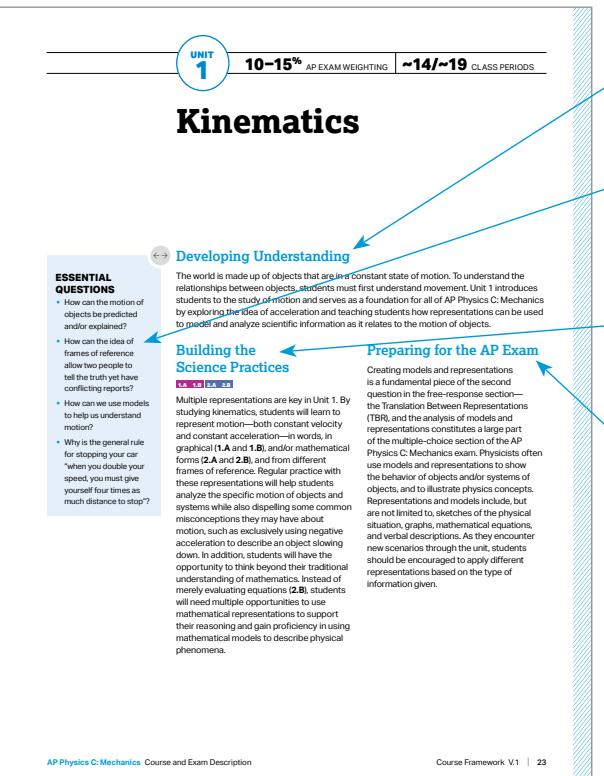

## UNIT OPENERS

Developing Understanding provides an overview that contextualizesandsituatesthekeycontentoftheunitwithin the scope of the course.

The essential questionsarethought-provokingquestionsthat motivate students and inspire inquiry.

Building the Science Practices describesspecificskills within the practices that are appropriate to focus on in that unit. Certain practices have been noted to indicate areas of emphasis for that unit.

Preparing for the AP Exam provides helpful tips and common studentmisunderstandingsidentifiedfrompriorexamdata.

<table><tr><td>Topic</td><td>Suggested Skills</td></tr><tr><td>1.1 Scalars and Vectors</td><td>Create diagrams, tables, charts, or schematics to represent physical situations.Derive a symbolic expression from known quantities by selecting and following a logical mathematical pathway.Calculate or estimate an unknown quantity with units from known quantities, by selecting and following a logical computational pathway.Apply an appropriate law, definition, theoretical relationship, or model to make a claim.</td></tr><tr><td>1.2 Displacement, Velocity, and Acceleration</td><td>Create quantitative graphs with appropriate scales and units, including plotting data.Calculate or estimate an unknown quantity with units from known quantities, by selecting and following a logical computational pathway.Compare physical quantities between two or more scenarios or at different times and/or locations within a single scenario.Create experimental procedures that are appropriate for a given scientific question.Justify or support a claim using evidence from experimental data, physical representations, or physical principles or laws.</td></tr><tr><td>1.3 Representing Motion</td><td>Create qualitative sketches of graphs that represent features of a model or the behavior of the physical system.Derive a symbolic expression from known quantities by selecting and following a logical mathematical pathway.Predict new values or factors of change of physical quantities using functional dependence between variables.Justify or support a claim using evidence from experimental data, physical representations, or physical principles or laws.</td></tr><tr><td>1.4 Reference Frames and Relative Motion</td><td>Create diagrams, tables, charts, or schematics to represent physical situations.Calculate or estimate an unknown quantity with units from known quantities, by selecting and following a logical computational pathway.Compare physical quantities between two or more scenarios or at different times and/or locations within a single scenario.Apply an appropriate law, definition, theoretical relationship, or model to make a claim.</td></tr></table>

## The Unit at a Glance table shows the topics and suggested skills.

The suggested skills for each topic show possible ways to linkthecontentinthattopictospecificAPPhysicsskills.The individual skills have been thoughtfully chosen in a way that scafoldsskillsthroughoutthecourse.Thequestionsonthe Progress Checks are based on this pairing. However, AP Exam questions can pair the content with any of the skills.

<table><tr><td>Activity</td><td>Topic</td><td>Sample Activity</td></tr><tr><td>1</td><td>1.2</td><td>Friends Without PensAssign students a small set of problems that relate position, velocity, or acceleration as a function of time. Challenge students to derive equations for the other two quantities as functions of time using calculus. Have students chat with &quot;friends,&quot; as appropriate, to work on starting the derivations.</td></tr><tr><td>2</td><td>1.3</td><td>Desktop Experiment TasksProvide students with a pull-back toy car and a means to take video, and have them record position versus time data for the car as it speeds up and slows down. Have students fit a polynomial equation to the position versus time data and use calculus to predict the car&#x27;s maximum speed and initial and final magnitudes of acceleration.</td></tr><tr><td>3</td><td>1.3</td><td>Changing RepresentationsGive students a verbal description of segmented motion, such as &quot;accelerates from rest at 5 m/s2 for 10 seconds, then comes to rest again after another 20 seconds.&quot; Have students draw position/velocity/acceleration graphs and formulate piecewise position/velocity/acceleration equations of motion.</td></tr><tr><td>4</td><td>1.3</td><td>Create a PlanFind data of speed and total stopping distance for cars. Provide students with five pairs of speed and total stopping distances (not broken into thinking and braking distances). Ask students to determine the driver&#x27;s reaction time and the car&#x27;s braking acceleration from the data.</td></tr><tr><td>5</td><td>1.4</td><td>Desktop Experiment TasksGive each group a constant motion vehicle and a long, wide piece of paper (e.g., wrapping paper or brown school paper). Have the students experiment with the car traveling on the moving paper. Challenge students to determine how to aim the car relative to the moving paper for the car to travel &quot;straight across.&quot;</td></tr><tr><td>6</td><td>1.5</td><td>Desktop Experiment TasksGive students a ball launcher, right-triangular block, and meterstick. Have them calculate the launch speed of the ball using a horizontal launch of the ball from the launcher, and then predict where the ball will land if the ball is launched on the triangular block.</td></tr><tr><td>7</td><td>1.5</td><td>Graph and SwitchPlace students in pairs. Have Student A create a horizontal and vertical pair of velocity graphs for projectile motion, while Student B writes a narrative of what happens (including whether the projectile was shot at an angle, lands higher or lower or at the same height). Students then discuss their representations and decide whether the graph created by Student A supports or does not support the narrative written by Student B.</td></tr></table>

26 | Course Framework V.1  
AR Rbyrice C-Mechanice. Couree andExam Deecrintior

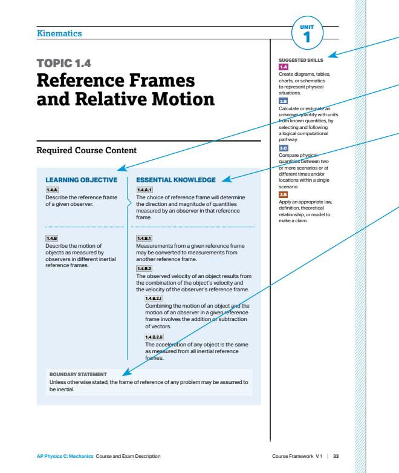

The Sample Instructional Activities include optional activities that can help tie together the content and skills for a particular topic.

## TOPIC PAGES

The suggested skills note the course skills that could be paired with the learning objectives for that topic.

Learning objectivesdefinewhatastudentneedstobeableto do with content knowledge to progress through the course.

Essential knowledgestatementsdefinetherequiredcontent knowledge associated with each learning objective assessed on the AP Exam.

Boundary statements provide guidance to teachers regarding the content boundaries of the AP Physics courses. Boundary statements appear at the end of essential knowledge statements where appropriate.

THIS PAGE IS INTENTIONALLY LEFT BLANK.

AP PHYSICS C: MECHANICS

## UNIT 1 Kinematics

10–15% AP EXAM WEIGHTING

\~14–19 CLASS PERIODS

## Remember to go to AP Classroom to assign students the online Progress Check for this unit.

Whether assigned as homework or completedinclass,the Progress Check provides each student with immediate feedback related to this unit’stopicand skills.

## Progress Check 1

## Multiple-choice: \~18 questions Free-response: 4 questions

§ Mathematical Routines

§ Translation Between Representations

§ Experimental Design and Analysis

§ Qualitative/Quantitative Translation

# Kinematics

## ESSENTIAL QUESTIONS

§ How can the motion of objects be predicted and/or explained?

§ How can the idea of frames of reference allow two people to tell the truth yet have conflictingreports?

§ How can we use models to help us understand motion?

§ Why is the general rule for stopping your car “when you double your speed, you must give yourself four times as much distance to stop”?

## Developing Understanding

The world is made up of objects that are in a constant state of motion. To understand the relationshipsbetweenobjects,studentsmustfirstunderstandmovement.Unit1introduces students to the study of motion and serves as a foundation for all of AP Physics C: Mechanics by exploring the idea of acceleration and teaching students how representations can be used tomodelandanalyzescientificinformationasitrelatestothemotionofobjects.

## Building the Science Practices

## 1.A 1.B 2.A 2.B

Multiple representations are key in Unit 1. By studying kinematics, students will learn to representmotion—bothconstantvelocity andconstantacceleration—inwords,in graphical (1.A and 1.B), and/or mathematical forms (2.A and 2.B),andfromdiferent frames of reference. Regular practice with these representations will help students analyzethespecificmotionofobjectsand systems while also dispelling some common misconceptions they may have about motion, such as exclusively using negative acceleration to describe an object slowing down. In addition, students will have the opportunity to think beyond their traditiona understanding of mathematics. Instead of merely evaluating equations (2.B), students will need multiple opportunities to use mathematical representations to support theirreasoningandgainproficiencyinusing mathematical models to describe physical phenomena.

## Preparing for the AP Exam

Creating models and representations is a fundamental piece of the second questioninthefree-responsesection— the Translation Between Representations (TBR), and the analysis of models and representations constitutes a large part ofthemultiple-choicesectionoftheAP Physics C: Mechanics exam. Physicists often use models and representations to show the behavior of objects and/or systems of objects, and to illustrate physics concepts. Representations and models include, but are not limited to, sketches of the physical situation, graphs, mathematical equations, and verbal descriptions. As they encounter new scenarios through the unit, students shouldbeencouragedtoapplydiferent representations based on the type of information given.

## UNIT AT A GLANCE

<table><tr><td>Topic</td><td>Suggested Skills</td></tr><tr><td>1.1 Scalars and Vectors</td><td>1.A Create diagrams, tables, charts, or schematics to represent physical situations.2.A Derive a symbolic expression from known quantities by selecting and following a logical mathematical pathway.2.B Calculate or estimate an unknown quantity with units from known quantities, by selecting and following a logical computational pathway.3.B Apply an appropriate law, definition, theoretical relationship, or model to make a claim.</td></tr><tr><td>1.2 Displacement, Velocity, and Acceleration</td><td>1.B Create quantitative graphs with appropriate scales and units, including plotting data.2.B Calculate or estimate an unknown quantity with units from known quantities, by selecting and following a logical computational pathway.2.C Compare physical quantities between two or more scenarios or at different times and/or locations within a single scenario.3.A Create experimental procedures that are appropriate for a given scientific question.3.C Justify or support a claim using evidence from experimental data, physical representations, or physical principles or laws.</td></tr><tr><td>1.3 Representing Motion</td><td>1.C Create qualitative sketches of graphs that represent features of a model or the behavior of the physical system.2.A Derive a symbolic expression from known quantities by selecting and following a logical mathematical pathway.2.D Predict new values or factors of change of physical quantities using functional dependence between variables.3.C Justify or support a claim using evidence from experimental data, physical representations, or physical principles or laws.</td></tr><tr><td>1.4 Reference Frames and Relative Motion</td><td>1.A Create diagrams, tables, charts, or schematics to represent physical situations.2.B Calculate or estimate an unknown quantity with units from known quantities, by selecting and following a logical computational pathway.2.C Compare physical quantities between two or more scenarios or at different times and/or locations within a single scenario.3.B Apply an appropriate law, definition, theoretical relationship, or model to make a claim.</td></tr></table>

continued on next page

## UNIT AT A GLANCE (cont'd)

<table><tr><td>Topic</td><td>Suggested Skills</td></tr><tr><td>1.5 Motion in Two or Three Dimensions</td><td>1.B Create quantitative graphs with appropriate scales and units, including plotting data.2.A Derive a symbolic expression from known quantities by selecting and following a logical mathematical pathway.2.D Predict new values or factors of change of physical quantities using functional dependence between variables.3.A Create experimental procedures that are appropriate for a given scientific question.3.C Justify or support a claim using evidence from experimental data, physical representations, or physical principles or laws.</td></tr></table>

4 Review the results in class to identify and address any student misunderstandings Go to AP Classroom to assign the Progress Check for Unit 1.

## SAMPLE INSTRUCTIONAL ACTIVITIES

Thesampleactivitiesonthispageareoptionalandareoferedtoprovidepossiblewaysto incorporate instructional approaches into the classroom. Teachers do not need to use these activities or instructional approaches and are free to alter or edit them. The examples below were developed in partnership with teachers from the AP community to share ways that they approach teaching some of the topics in this unit. Please refer to the Instructional Approaches section for more examples of activities and strategies

<table><tr><td>Activity</td><td>Topic</td><td>Sample Activity</td></tr><tr><td>1</td><td>1.2</td><td>Friends Without PensAssign students a small set of problems that relate position, velocity, or acceleration as a function of time. Challenge students to derive equations for the other two quantities as functions of time using calculus. Have students chat with &quot;friends,&quot; as appropriate, to work on starting the derivations.</td></tr><tr><td>2</td><td>1.3</td><td>Desktop Experiment TasksProvide students with a pull-back toy car and a means to take video, and have them record position versus time data for the car as it speeds up and slows down. Have students fit a polynomial equation to the position versus time data and use calculus to predict the car&#x27;s maximum speed and initial and final magnitudes of acceleration.</td></tr><tr><td>3</td><td>1.3</td><td>Changing RepresentationsGive students a verbal description of segmented motion, such as &quot;accelerates from rest at 5 m/s $^{2}$  for 10 seconds, then comes to rest again after another 20 seconds.&quot;Have students draw position/velocity/acceleration graphs and formulate piecewise position/velocity/acceleration equations of motion.</td></tr><tr><td>4</td><td>1.3</td><td>Create a PlanFind data of speed and total stopping distance for cars. Provide students with five pairs of speed and total stopping distances (not broken into thinking and braking distances). Ask students to determine the driver&#x27;s reaction time and the car&#x27;s braking acceleration from the data.</td></tr><tr><td>5</td><td>1.4</td><td>Desktop Experiment TasksGive each group a constant motion vehicle and a long, wide piece of paper (e.g., wrapping paper or brown school paper). Have the students experiment with the car traveling on the moving paper. Challenge students to determine how to aim the car relative to the moving paper for the car to travel &quot;straight across.&quot;</td></tr><tr><td>6</td><td>1.5</td><td>Desktop Experiment TasksGive students a ball launcher, right-triangular block, and meterstick. Have them calculate the launch speed of the ball using a horizontal launch of the ball from the launcher, and then predict where the ball will land if the ball is launched on the triangular block.</td></tr><tr><td>7</td><td>1.5</td><td>Graph and SwitchPlace students in pairs. Have Student A create a horizontal and vertical pair of velocity graphs for projectile motion, while Student B writes a narrative of what happens (including whether the projectile was shot at an angle, lands higher or lower or at the same height). Students then discuss their representations and decide whether the graph created by Student A supports or does not support the narrative written by Student B.</td></tr></table>

# TOPIC 1.1

# Scalars and Vectors

## Required Course Content

## LEARNING OBJECTIVE

## 1.1.A

Describe a scalar or vector quantity using magnitude and direction,asappropriate.

## ESSENTIAL KNOWLEDGE

## 1.1.A.1

Scalars are quantities described by magnitude only; vectors are quantities described by both magnitude and direction.

## 1.1.A.2

Vectors can be visually modeled as arrows with appropriate direction and lengths proportional to their magnitude.

## 1.1.A.3

Distance and speed are examples of scalar quantities, while position, displacement, velocity, and acceleration are examples of vector quantities.

## 1.1.A.4

Vectors can be expressed in unit vector notation or as a magnitude and a direction.

## 1.1.A.4.i

Unit vector notation can be used to represent vectors as the sum of their constituent components in the x-, y-, and z-directions, denoted by , Î, and , respectively.

Relevant equation:

$$
\vec {r} = \left(A \hat {i} + B \hat {j} + C \hat {k}\right)
$$

## 1.1.A.4.ii

The position vector of a point is given by r, and the unit vector in the direction of the position vector is denoted r.

continued on next page

## SUGGESTED SKILLS

## 1.A

Create diagrams, tables, charts, or schematics to represent physical situations.

## 2.A

Derive a symbolic expression from known quantities by selecting and following a logical mathematical pathway.

## 2.B

Calculate or estimate an unknown quantity with units from known quantities, by selecting and following a logical computational pathway.

## 3.B

Apply an appropriate law, definition, theoretical relationship, or model to make a claim.

## LEARNING OBJECTIVE

## 1.1.A

Describe a scalar or vector quantity using magnitude and direction, as appropriate.

## ESSENTIAL KNOWLEDGE

## 1.1.A.4.iii

A resultant vector is the vector sum of the addend vectors’ components.

Relevant equations:

$$
\vec {C} = \vec {A} + \vec {B}
$$

$$
\vec {C} = \left(A _ {x} + B _ {x}\right) \hat {i} + \left(A _ {y} + B _ {y}\right) \hat {j}
$$

## 1.1.A.5

Inagivenone-dimensionalcoordinatesystem, opposite directions are denoted by opposite signs.

TOPIC 1.2

# Displacement, Velocity, and Acceleration

## Required Course Content

## LEARNING OBJECTIVE

## 1.2.A

Describe a change in an object’s position.

## 1.2.B

Describe the average velocity and acceleration of an object.

## ESSENTIAL KNOWLEDGE

## 1.2.A.1

Whenusingtheobjectmodel,thesize,shape, andinternalconfigurationareignored.The object may be treated as a single point with extensive properties such as mass and charge.

## 1.2.A.2

Displacement is the change in an object’s position.

Relevant equation:

$$
\Delta x = x - x _ {0}
$$

## 1.2.B.1

Averages of velocity and acceleration are calculatedconsideringtheinitialandfinal states of an object over an interval of time.

## 1.2.B.2

Average velocity is the displacement of an object divided by the interval of time in which that displacement occurs.

$$
\vec {\nu} _ {\mathrm{avg}} = \frac {\Delta \vec {x}}{\Delta t}
$$

## 1.2.B.3

Average acceleration is the change in velocity divided by the interval of time in which that change in velocity occurs.

$$
\vec {a} _ {\mathrm{avg}} = \frac {\Delta \vec {v}}{\Delta t}
$$

## 1.2.B.4

An object is accelerating if either the magnitude and/or direction of the object’s velocity are changing.

## SUGGESTED SKILLS

## 1.B

Create quantitative graphs with appropriate scales and units, including plotting data.

## 2.B

Calculate or estimate an unknown quantity with units from known quantities, by selecting and following a logical computational pathway.

## 2.C

Compare physical quantities between two or more scenarios or at different times and/or locations within a single scenario.

3.A

Create experimental procedures that are appropriate for a given scientific question.

## 3.C

Justify or support a claim using evidence from experimental data, physical representations, or physical principles or laws.

## Kinematics

## LEARNING OBJECTIVE

## 1.2.B

Describe the average velocity and acceleration of an object.

## 1.2.C

Describe the instantaneous position, velocity, and acceleration of an object as a function of time.

## ESSENTIAL KNOWLEDGE

## 1.2.B.5

Calculating average velocity or average acceleration over a very small time interval yields a value that is very close to the instantaneous velocity or instantaneous acceleration.

## 1.2.C.1

As the time interval used to calculate the averagevalueofaquantityapproacheszero, the average value of that quantity approaches the value of the quantity at that instant, called the instantaneous value.

## 1.2.C.1.i

Instantaneous velocity is the rate of change of the object’s position, which is equal to the derivative of position with respect to time.

Relevant equations:

$$
\vec {v} = \frac {d \vec {r}}{d t}
$$

$$
\nu_ {x} = \frac {d x}{d t}
$$

## 1.2.C.1.ii

Instantaneous acceleration is the rate of change of the object’s velocity, which is equal to the derivative of velocity with respect to time.

Relevant equations:

$$
\vec {a} = \frac {d \vec {v}}{d t}
$$

$$
a _ {x} = \frac {d v _ {x}}{d t}
$$

## 1.2.C.2

Time-dependentfunctionsandinstantaneous values of position, velocity, and acceleration canbedeterminedusingdiferentiationand integration.

# TOPIC 1.3

# Representing Motion

## Required Course Content

## LEARNING OBJECTIVE

## 1.3.A

Describe the position, velocity, and acceleration of an object using representations of that object’s motion.

## ESSENTIAL KNOWLEDGE

## 1.3.A.1

Motion can be represented by motion diagrams,figures,graphs,equations,and narrative descriptions.

## 1.3.A.2

For constant acceleration, three kinematic equations can be used to describe instantaneous linear motion in one dimension:

$$
\nu_ {x} = \nu_ {x 0} + a _ {x} t
$$

$$
x = x _ {0} + \nu_ {x 0} t + \frac {1}{2} a _ {x} t ^ {2}
$$

$$
\nu_ {x} ^ {2} = \nu_ {x 0} ^ {2} + 2 a _ {x} (x - x _ {0})
$$

Note: The equations above are written to indicate motion in the x-direction, but these equations can be used in any single dimension as appropriate.

## 1.3.A.3

Near the surface of Earth, the vertical acceleration caused by the force of gravity is downward, constant, and has a measured value approximately equal to

$$
a _ {g} = g \approx 1 0 \mathrm{m} / \mathrm{s} ^ {2}.
$$

## 1.3.A.4

Graphs of position, velocity, and acceleration asfunctionsoftimecanbeusedtofindthe relationships between those quantities.

continued on next page

## SUGGESTED SKILLS

## 1.C

Create qualitative sketches of graphs that represent features of a model or the behavior of the physical system.

## 2.A

Derive a symbolic expression from known quantities by selecting and following a logical mathematical pathway.

## 2.D

Predict new values or factors of change of physical quantities using functional dependence between variables.

## 3.C

Justify or support a claim using evidence from experimental data, physical representations, or physical principles or laws.

## LEARNING OBJECTIVE

1.3.A

Describe the position, velocity, and acceleration of an object using representations of that object’s motion.

## ESSENTIAL KNOWLEDGE

## 1.3.A.4.i

An object’s instantaneous velocity is the rate of change of the object’s position, which is equal to the slope of a line tangent to a point on a graph of the object’s position as a function of time.

Relevant equation:

$$
\nu_ {x} = \frac {d x}{d t}
$$

## 1.3.A.4.ii

An object’s instantaneous acceleration is the rate of change of the object’s velocity, which is equal to the slope of a line tangent to a point on a graph of the object’s velocity as a function of time.

Relevant equation:

$$
a _ {x} = \frac {d v _ {x}}{d t}
$$

## 1.3.A.4.iii

The displacement of an object during a time interval is equal to the area under the curve of a graph of the object’s velocity as a function of time (i.e., the area bounded by thefunctionandthehorizontalaxisforthe appropriate interval).

Relevant equation:

$$
\Delta x = \int_ {t _ {1}} ^ {t _ {2}} v _ {x} (t) d t
$$

1.3.A.4.iv

The change in velocity of an object during a time interval is equal to the area under the curve of a graph of the acceleration of the object as a function of time.

Relevant equation:

$$
\Delta v _ {x} = \int_ {t _ {1}} ^ {t _ {2}} a _ {x} (t) d t
$$

## BOUNDARY STATEMENT

AP Physics C: Mechanics and AP Physics C: Electricity and Magnetism expects that for all situations in which a numerical quantity is required for g, the value $g \approx 1 0 ~ \mathrm { m / s } ^ { 2 }$ willbeused.However,studentswillnotbepenalizedforcorrectlyusing the more precise commonly accepted values of $g { = } 9 . 8 1 \mathrm { m } / \mathrm { s } ^ { 2 } \ \mathrm { o r } \ g { = } 9 . 8 \ \mathrm { m } / \mathrm { s } ^ { 2 }$

TOPIC 1.4

# Reference Frames and Relative Motion

## Required Course Content

## LEARNING OBJECTIVE

## 1.4.A

Describe the reference frame of a given observer.

## 1.4.B

Describe the motion of objects as measured by observersindiferentinertial reference frames.

## ESSENTIAL KNOWLEDGE

## 1.4.A.1

The choice of reference frame will determine the direction and magnitude of quantities measured by an observer in that reference frame.

## 1.4.B.1

Measurements from a given reference frame may be converted to measurements from another reference frame.

## 1.4.B.2

The observed velocity of an object results from the combination of the object’s velocity and the velocity of the observer’s reference frame.

## 1.4.B.2.i

Combining the motion of an object and the motion of an observer in a given reference frame involves the addition or subtraction of vectors.

## 1.4.B.2.ii

The acceleration of any object is the same as measured from all inertial reference frames.

## SUGGESTED SKILLS

## 1.A

Create diagrams, tables, charts, or schematics to represent physical situations.

## 2.B

Calculate or estimate an unknown quantity with units from known quantities, by selecting and following a logical computational pathway.

## 2.C

Compare physical quantities between two or more scenarios or at different times and/or locations within a single scenario.

## 3.B

Apply an appropriate law, definition, theoretical relationship, or model to make a claim.

## BOUNDARY STATEMENT

Unless otherwise stated, the frame of reference of any problem may be assumed to be inertial.

## SUGGESTED SKILLS

## 1.B

Create quantitative graphs with appropriate scales and units, including plotting data.

## 2.A

Derive a symbolic expression from known quantities by selecting and following a logical mathematical pathway.

## 2.D

Predict new values or factors of change of physical quantities using functional dependence between variables.

3.A

Create experimenta procedures that are appropriate for a given scientific question.

## 3.C

Justify or support a claim using evidence from experimental data, physical representations, or physical principles or laws.

TOPIC 1.5

# Motion in Two or Three Dimensions

## Required Course Content

## LEARNING OBJECTIVE

## 1.5.A

Describe the motion of an object moving in two or three dimensions.

## ESSENTIAL KNOWLEDGE

## 1.5.A.1

Motion in two or three dimensions can be analyzedusingone-dimensionalkinematic relationships if the motion is separated into components.

## 1.5.A.2

Velocityandaccelerationmaybediferentin each dimension and may be nonuniform.

## 1.5.A.3

Motion in one dimension may be changed without causing a change in a perpendicular dimension.

## 1.5.A.4

Projectilemotionisaspecialcaseoftwodimensionalmotionthathaszeroacceleration inonedimensionandconstant,nonzero acceleration in the second dimension.

## BOUNDARY STATEMENT

APPhysicsC:Mechanicsonlyexpectsstudentstoquantitativelyanalyzethe motion of an object in two dimensions. AP Physics C: Electricity and Magnetism expects students to also qualitatively describe the motion of a particle in three dimensions.

AP PHYSICS C: MECHANICS

# UNIT 2 Force and Translational Dynamics

AP 20–25% AP EXAM WEIGHTING

\~15–25 CLASS PERIODS

## AP

Remember to go to AP Classroom to assign students the online Progress Check for this unit.

Whether assigned as homework or completedinclass,the Progress Check provides each student with immediate feedback related to this unit’stopicand skills.

## Progress Check 2

## Multiple-choice: \~30 questions Free-response: 4 questions

§ Mathematical Routines

§ Translation Between Representations

§ Experimental Design and Analysis

§ Qualitative/Quantitative Translation

# Force and Translational Dynamics

## ESSENTIAL QUESTIONS

§ Why do we feel pulled toward Earth but not a pencil?

§ Why does the swirling motion continue after you’ve stopped stirring a cupofcofee?

§ If you apply the same amount of “push” to a car as you would a shopping cart, why doesn’t the car move?

§ Why must you push backward to make a skateboard move forward?

§ How do you determine which team wins the tug-of-war:Theteam that pulls harder on the rope or the team that pushes harder on the ground?

## Developing Understanding

In Unit 2, students are introduced to the concept of force, which is an interaction between two objects or systems of objects. Within the larger study of dynamics, forces provide thecontextinwhichstudentsanalyzeandcometounderstandavarietyofphysical phenomena. This understanding is accomplished by revisiting and building upon the representationspresentedinUnit1—specifically,throughtheintroductionofthefree-body diagram.Studentswillfurtheranalyzetheefectofforcesonsystemswhenthenencounter Newton’s second law in rotational form in Unit 5.

## Building the Science Practices 2.A 2.D 3.B

Translation between models and representations is key in this unit. Students will continue to use models and representations that will help them further analyzesystems,theinteractionsbetween systems, and how these interactions result inchange.Alongsidegainingproficiency intheuseofspecificforceequations,Unit 2 also encourages students to derive new expressions from fundamental principles (2.A) to help them make predictions using functional dependence between variables (2.D). The skills of making claims (3.B) can be developed throughout the unit by providing students with opportunities to such as having them make predictions about the acceleration of a system based on the forces exerted on that system, and then justifying those predictions with appropriate physics principles.

## Preparing for the AP Exam

The AP Physics C: Mechanics Exam requires studentstore-expresskeyelements of physical phenomena across multiple representations in the domain. This skill appearsinquestionfourofthefree-response section, the Qualitative/Quantitative Translation (QQT). In this question, students demonstrate translation between words and mathematicsbydescribingandanalyzing a scenario. Using content from any unit, theQQTfirstrequiresstudentstomakea claim and provide evidence and reasoning to support their claim without reference to equations. Students are then asked to derive an equation or set of equations to mathematically represent the scenario. Lastly, students are required to make a connection betweentheclaimmadeinthefirstpartofthe question and the equation(s) derived in the second part. Students exposed primarily to numerical problem solving often struggle with the QQT because it requires them to express a conceptual understanding of course content and representations. Opportunities to translatebetweendiferentrepresentations, including equations, diagrams, graphs, and verbal descriptions, can help students prepare for the QQT question.

## UNIT AT A GLANCE

<table><tr><td>Topic</td><td>Suggested Skills</td></tr><tr><td>2.1 Systems and Center of Mass</td><td>1.A Create diagrams, tables, charts, or schematics to represent physical situations2.B Calculate or estimate an unknown quantity with units from known quantities, by selecting and following a logical computational pathway.2.C Compare physical quantities between two or more scenarios or at different times and/or locations within a single scenario.3.B Apply an appropriate law, definition, theoretical relationship, or model to make a claim.</td></tr><tr><td>2.2 Forces and Free-Body Diagrams</td><td>1.A Create diagrams, tables, charts, or schematics to represent physical situations.2.C Compare physical quantities between two or more scenarios or at different times and/or locations within a single scenario.3.B Apply an appropriate law, definition, theoretical relationship, or model to make a claim.3.C Justify or support a claim using evidence from experimental data, physical representations, or physical principles or laws.</td></tr><tr><td>2.3 Newton&#x27;s Third Law</td><td>1.A Create diagrams, tables, charts, or schematics to represent physical situations.2.C Compare physical quantities between two or more scenarios or at different times and/or locations within a single scenario.3.B Apply an appropriate law, definition, theoretical relationship, or model to make a claim.3.C Justify or support a claim using evidence from experimental data, physical representations, or physical principles or laws.</td></tr><tr><td>2.4 Newton&#x27;s First Law</td><td>1.C Create qualitative sketches of graphs that represent features of a model or the behavior of the physical system.2.B Calculate or estimate an unknown quantity with units from known quantities, by selecting and following a logical computational pathway.2.C Compare physical quantities between two or more scenarios or at different times and/or locations within a single scenario.3.C Justify or support a claim using evidence from experimental data, physical representations, or physical principles or laws.</td></tr></table>

## UNIT AT A GLANCE (cont’d)

<table><tr><td>Topic</td><td>Suggested Skills</td></tr><tr><td>2.5 Newton's Second Law</td><td>1.B Create quantitative graphs with appropriate scales and units, including plotting data.2.B Calculate or estimate an unknown quantity with units from known quantities, by selecting and following a logical computational pathway.2.D Predict new values or factors of change of physical quantities using functional dependence between variables.3.A Create experimental procedures that are appropriate for a given scientific question.3.C Justify or support a claim using evidence from experimental data, physical representations, or physical principles or laws.</td></tr><tr><td>2.6 Gravitational Force</td><td>1.C Create qualitative sketches of graphs that represent features of a model or the behavior of the physical system.2.A Derive a symbolic expression from known quantities by selecting and following a logical mathematical pathway.2.D Predict new values or factors of change of physical quantities using functional dependence between variables.3.B Apply an appropriate law, definition, theoretical relationship, or model to make a claim.</td></tr><tr><td>2.7 Kinetic and Static Friction</td><td>1.B Create quantitative graphs with appropriate scales and units, including plotting data.2.A Derive a symbolic expression from known quantities by selecting and following a logical mathematical pathway.2.B Calculate or estimate an unknown quantity with units from known quantities, by selecting and following a logical computational pathway.3.A Create experimental procedures that are appropriate for a given scientific question.3.B Apply an appropriate law, definition, theoretical relationship, or model to make a claim.</td></tr><tr><td>2.8 Spring Forces</td><td>1.A Create diagrams, tables, charts, or schematics to represent physical situations.2.B Calculate or estimate an unknown quantity with units from known quantities, by selecting and following a logical computational pathway.2.D Predict new values or factors of change of physical quantities using functional dependence between variables.3.C Justify or support a claim using evidence from experimental data, physical representations, or physical principles or laws.</td></tr><tr><td>2.9 Resistive Forces</td><td>1.B Create quantitative graphs with appropriate scales and units, including plotting data.2.A Derive a symbolic expression from known quantities by selecting and following a logical mathematical pathway.2.C Compare physical quantities between two or more scenarios or at different times and/or locations within a single scenario.3.A Create experimental procedures that are appropriate for a given scientific question.3.C Justify or support a claim using evidence from experimental data, physical representations, or physical principles or laws.</td></tr><tr><td>2.10 Circular Motion</td><td>1.A Create qualitative sketches of graphs that represent features of a model or the behavior of the physical system.2.A Derive a symbolic expression from known quantities by selecting and following a logical mathematical pathway.2.D Predict new values or factors of change of physical quantities using functional dependence between variables.3.C Justify or support a claim using evidence from experimental data, physical representations, or physical principles or laws.</td></tr></table>

4 Go to AP Classroom to assign the Progress Check for Unit 2.Review the results in class to identify and address any student misunderstandings

## SAMPLE INSTRUCTIONAL ACTIVITIES

Thesampleactivitiesonthispageareoptionalandareoferedtoprovidepossiblewaysto incorporate instructional approaches into the classroom. Teachers do not need to use these activities or instructional approaches and are free to alter or edit them. The examples below were developed in partnership with teachers from the AP community to share the ways that they approach teaching some of the topics in this unit. Please refer to the Instructional Approaches section for more examples of activities and strategies.

<table><tr><td>Activity</td><td>Topic</td><td>Sample Activity</td></tr><tr><td>1</td><td>2.1</td><td>Desktop Experiment TasksUsing two bathroom scales and a long wooden plank, have students determine the location of their center of mass. Then, have students determine how far their center of mass moves as they move their arms from their sides to up over their head.</td></tr><tr><td>2</td><td>2.1</td><td>Graph and SwitchPlace students into pairs. Have each pair produce a free-body diagram. Have the pairs trade diagrams and have the groups suggest a situation where the forces on an object would be described by the diagram that they have been given. Have the groups compare their claims.</td></tr><tr><td>3</td><td>2.3</td><td>Discussion GroupsDivide students into groups of 2 or 3. Have students explain why a strong adult will win against a small child in tug-of-war, even though the rope always has the same tension at both ends. Then, have students support their reasoning with free-body diagrams, and have each group present their reasoning and free-body diagram to the class.</td></tr><tr><td>4</td><td>2.5</td><td>Desktop Experiment TasksGive students an object having unknown mass (or have students use their set of house keys, if available), known masses, string, a pulley, a meterstick, and a stopwatch. Have students use the provided materials to determine the unknown mass of the object.</td></tr><tr><td>5</td><td>2.7</td><td>Desktop Experiment TasksAsk students to find the coefficient of friction (static or kinetic) of a shoe or other object. This activity can be made into a competition, where the team with the simplest procedure or the team that uses the least equipment wins.</td></tr><tr><td>6</td><td>2.10</td><td>Desktop Experiment TasksDrill a small hole in the center of a wooden meterstick so that a pencil point fits in the hole. Place a penny on the meterstick and gently rotate the meterstick faster and faster until the penny slips. Have students make measurements and calculations to find the coefficient of static friction between the meterstick and the penny.</td></tr></table>

SUGGESTED SKILLS

Create diagrams, tables, charts, or schematics to represent physical situations.

2.B

Calculate or estimate an unknown quantity with units from known quantities, by selecting and following a logical computational pathway.

2.C

Compare physica quantities between two or more scenarios or at different times and/or locations within a single scenario.

3.B

Apply an appropriate law, definition, theoretica relationship, or model to make a claim.

TOPIC 2.1

# Systems and Center of Mass

## Required Course Content

## LEARNING OBJECTIVE

## 2.1.A

Describe the properties and interactions of a system.

## ESSENTIAL KNOWLEDGE

## 2.1.A.1

System properties are determined by the interactions between objects within the system.

## 2.1.A.2

If the properties or interactions of the constituent objects within a system are not important in modeling the behavior of the macroscopic system, the system can itself be treated as a single object.

## 2.1.A.3

Systems may allow interactions between constituent parts of the system and the environment, which may result in the transfer of energy or mass.

## 2.1.A.4

Individual objects within a chosen system may behavediferentlyfromeachotheraswellas from the system as a whole.

## 2.1.A.5

Theinternalstructureofasystemafectsthe analysis of that system.

## 2.1.A.6

As variables external to a system are changed, the system’s substructure may change.

continued on next page

## LEARNING OBJECTIVE

## 2.1.B

Describe the location of a system’s center of mass with respect to the system’s constituent parts.

## ESSENTIAL KNOWLEDGE

## 2.1.B.1

For objects or systems with symmetrical mass distributions, the center of mass is located on lines of symmetry.

## 2.1.B.2

The location of a system’s center of mass along a given axis can be calculated using the equation

$$
\vec {x} _ {\mathrm{cm}} = \frac {\sum m _ {i} \vec {x} _ {i}}{\sum m _ {i}}.
$$

## 2.1.B.3

For a nonuniform solid that can be considered asacollectionofdiferentialmasses,dm, the solid’s center of mass can be calculated using the equation

$$
\vec {r} _ {\mathrm{cm}} = \frac {\int \vec {r} d m}{\int d m}.
$$

## 2.1.B.3.i

The linear mass density of a rod or other linear rigid body is the derivative of the rod’s mass with respect to the position of thediferentialmasselementontherigid body.

Relevant equation:

$$
\lambda = \frac {d}{d \ell} m (\ell)
$$

## 2.1.B.3.ii

If a function of mass density is given for a solid, the total mass can be determined by integrating the mass density over the length (one dimension), area (two dimensions), or volume (three dimensions) of the solid. For example:

$$
M _ {\mathrm{total}} = \int \rho (r) d V
$$

## 2.1.B.4

A system can be modeled as a singular object that is located at the system’s center of mass.

SUGGESTED SKILLS

Create diagrams, tables, charts, or schematics to represent physical situations.

2.C

Compare physical quantities between two or more scenarios or at different times and/or locations within a single scenario.

3.B

Apply an appropriate law, definition, theoretical relationship, or model to make a claim.

3.C

Justify or support a claim using evidence from experimental data, physical representations, or physical principles or laws.

TOPIC 2.2

# Forces and Free-Body Diagrams

## Required Course Content

## LEARNING OBJECTIVE

## 2.2.A

Describe a force as an

interaction between two

objects or systems

## 2.2.B

Describe the forces exerted on an object or system using afree-bodydiagram.

## ESSENTIAL KNOWLEDGE

## 2.2.A.1

Forces are vector quantities that describe the interactions between objects or systems.

## 2.2.A.1.i

A force exerted on an object or system is always due to the interaction of that object or system with another object or system.

## 2.2.A.1.ii

An object or system cannot exert a net force on itself.

## 2.2.A.2

Contact forces describe the interaction of an object or system touching another object orsystemandaremacroscopicefectsof interatomic electric forces.

## 2.2.B.1

Free-bodydiagramsareusefultoolsfor visualizingforcesbeingexertedonasingle object or system and for determining the equations that represent a physical situation.

## 2.2.B.2

Thefree-bodydiagramofanobjectorsystem shows each of the forces exerted on the object or system by the environment.

## 2.2.B.3

Forces exerted on an object or system are represented as vectors originating from the representation of the center of mass, such as a dot. A system is treated as though all of its mass is located at the center of mass.

## LEARNING OBJECTIVE

## 2.2.B

Describe the forces exerted on an object or system using a free-body diagram.

## ESSENTIAL KNOWLEDGE

## 2.2.B.4

A coordinate system with one axis parallel to the direction of acceleration of the object or systemsimplifiesthetranslationfromfreebody diagram to algebraic representation. For example,inafree-bodydiagramofanobject on an inclined plane, it is useful to set one axis parallel to the surface of the incline.

## BOUNDARY STATEMENT

AP Physics C: Mechanics and AP Physics C: Electricity and Magnetism only expect students to depict the forces exerted on objects, not the force components on free-bodydiagrams.OntheAPPhysicsexams,individualforcesrepresentedona free-bodydiagrammustbedrawnasindividualstraightarrows,originatingonthe dot and pointing in the direction of the force. Individual forces that are in the same direction must be drawn side by side, not overlapping.

## SUGGESTED SKILLS

## 1.A

Create diagrams, tables, charts, or schematics to represent physical situations.

## 2.C

Compare physica quantities between two or more scenarios or at different times and/or locations within a single scenario.

## 3.B

Apply an appropriate law, definition, theoretical relationship, or model to make a claim.

## 3.C

Justify or support a claim using evidence from experimental data, physical representations, or physical principles or laws.

# TOPIC 2.3

# Newton’s Third Law

## Required Course Content

## LEARNING OBJECTIVE

## 2.3.A

Describe the interaction of two objects or systems using Newton’s third law and a representation of paired forces exerted on each object or system.

## ESSENTIAL KNOWLEDGE

## 2.3.A.1

Newton’s third law describes the interaction of two objects or systems in terms of the paired forces that each exerts on the other.

$$
\overrightarrow {F} _ {\mathrm{AonB}} = - \overrightarrow {F} _ {\mathrm{BonA}}
$$

## 2.3.A.2

Interactions between objects within a system (internalforces)donotinfluencethemotionof a system’s center of mass.

## 2.3.A.3

Tension is the macroscopic net result of forces thatinfinitesimalsegmentsofastring,cable, chain, or similar system exert on each other in response to an external force.

## 2.3.A.3.i

An ideal string has negligible mass and does not stretch when under tension.

## 2.3.A.3.ii

The tension in an ideal string is the same at all points within the string.

## 2.3.A.3.iii

In a string with nonnegligible mass, tension may not be the same at all points within the string.

## 2.3.A.3.iv

An ideal pulley is a pulley that has negligible mass and rotates about an axle through its center of mass with negligible friction.

# TOPIC 2.4

# Newton’s First Law

## Required Course Content

## LEARNING OBJECTIVE

## 2.4.A

Describe the conditions under which a system’s velocity remains constant.

## ESSENTIAL KNOWLEDGE

## 2.4.A.1

The net force on a system is the vector sum of all forces exerted on the system.

## 2.4.A.2

Translationalequilibriumistheconfiguration of forces such that the net force exerted on a systemiszero.

## Derived equation:

$$
\sum \vec {F} _ {i} = 0
$$

## 2.4.A.3

Newton’sfirstlawstatesthatifthenetforce exertedonasystemiszero,thevelocityofthat system will remain constant.

## 2.4.A.4

Forces may be balanced in one dimension but unbalanced in another. The system’s velocity will change only in the direction of the unbalanced force.

## 2.4.A.5

An inertial reference frame is one from which anobserverwouldverifyNewton’sfirstlawof motion.

## SUGGESTED SKILLS

## 1.C

Create qualitative sketches of graphs that represent features of a model or the behavior of the physical system.

## 2.B

Calculate or estimate an unknown quantity with units from known quantities, by selecting and following a logical computational pathway.

## 2.C

Compare physical quantities between two or more scenarios or at different times and/or locations within a single scenario.

## 3.C

Justify or support a claim using evidence from experimental data, physica representations, or physical principles or laws.

## SUGGESTED SKILLS

## 1.B

Create quantitative graphs with appropriate scales and units, including plotting data.

## 2.B

Calculate or estimate an unknown quantity with units from known quantities, by selecting and following a logical computationa pathway.

Predict new values or factors of change of physical quantities using functional dependence between variables.

## 3.A

Create experimenta procedures that are appropriate for a given scientific question.

Justify or support a claim using evidence from experimental data, physical representations, or physical principles or laws.

# TOPIC 2.5

# Newton’s Second Law

## Required Course Content

## LEARNING OBJECTIVE

## 2.5.A

Describe the conditions under which a system’s velocity changes.

## ESSENTIAL KNOWLEDGE

## 2.5.A.1

Unbalancedforcesareaconfigurationof forces such that the net force exerted on a systemisnotequaltozero.

## 2.5.A.2

Newton’s second law of motion states that the acceleration of a system’s center of mass has a magnitude proportional to the magnitude of the net force exerted on the system and is in the same direction as that net force.

## Relevant equation:

$$
\vec {a} _ {\mathrm{sys}} = \frac {\sum \vec {F}}{m _ {\mathrm{sys}}} = \frac {\vec {F} _ {\mathrm{net}}}{m _ {\mathrm{sys}}}
$$

## 2.5.A.3

The velocity of a system’s center of mass will onlychangeifanonzeronetexternalforceis exerted on that system.

# TOPIC 2.6

# Gravitational Force

## Required Course Content

## LEARNING OBJECTIVE

## 2.6.A

Describe the gravitational interaction between two objects or systems with mass.

## ESSENTIAL KNOWLEDGE

## 2.6.A.1

Newton’s law of universal gravitation describes the gravitational force between two objects or systems as directly proportional to each of their masses and inversely proportional to the square of the distance between the systems’ centers of mass.

## Relevant equation:

$$
\left| \vec {F} _ {g} \right| = G \frac {m _ {1} m _ {2}}{r ^ {2}}
$$

## 2.6.A.1.i

The gravitational force is attractive.

## 2.6.A.1.ii

The gravitational force is always exerted along the line connecting the center of mass of the two interacting systems.

## 2.6.A.1.iii

The gravitational force on a system can be considered to be exerted on the system’s center of mass.

## 2.6.A.2

Afieldmodelstheefectsofanoncontact force exerted on an object at various positions in space.

continued on next page

## SUGGESTED SKILLS

## 1.C

Create qualitative sketches of graphs that represent features of a model or the behavior of the physical system.

## 2.A

Derive a symbolic expression from known quantities by selecting and following a logical mathematical pathway.

## 2.D

Predict new values or factors of change of physical quantities using functional dependence between variables.

## 3.B

Apply an appropriate law, definition, theoretical relationship, or model to make a claim.

## LEARNING OBJECTIVE

## 2.6.A

Describe the gravitational interaction between two objects or systems with mass.

## 2.6.C

Describe the conditions under which the magnitude of a system’s apparent weight is diferentfromthemagnitude of the gravitational force exerted on that system.

## 2.6.B

## ESSENTIAL KNOWLEDGE

Describe situations in which the gravitational force can be considered constant.

## 2.6.A.2.i

Themagnitudeofthegravitationalfield created by a system of mass M at a point in space is equal to the ratio of the gravitational force exerted by the system on a test object of mass m to the mass of the test object.

Derived equation:

$$
\left| \vec {g} \right| = \frac {\left| \vec {F} _ {g} \right|}{m} = G \frac {M}{r ^ {2}}
$$

## 2.6.A.3

## 2.6.A.2.ii

If the gravitational force is the only force exerted on an object, the observed acceleration of the object (in m/s2) is numerically equal to the magnitude of the gravitationalfieldstrength(inN/kg) at that location.

The gravitational force exerted by an astronomical body on a relatively small nearby object is called weight.

Derived equation:

$$
\mathrm{Weight} = F _ {g} = m g
$$

## 2.6.B.1

If the gravitational force between two systems’ centers of mass has a negligible change as the relative position of the two systems changes, the gravitational force can be considered constant at all points between the initial and finalpositionsofthesystems.

## 2.6.B.2

Near the surface of Earth, the strength of the gravitationalfieldis

$$
g \approx 1 0 \mathrm{N/kg}.
$$

## 2.6.C.1

The magnitude of the apparent weight of a system is the magnitude of the normal force exerted on the system.

## 2.6.C.2

If the system is accelerating, the apparent weight of the system is not equal to the magnitude of the gravitational force exerted on the system.

## LEARNING OBJECTIVE

## 2.6.C

Describe the conditions under which the magnitude of a system’s apparent weight is diferent from the magnitude of the gravitational force exerted on that system.

## 2.6.D

Describe inertial and gravitational mass.

## 2.6.E

Describe the gravitational force exerted on an object by a uniform spherical distribution of mass.

## ESSENTIAL KNOWLEDGE

## 2.6.C.3

A system appears weightless when there are no forces exerted on the system or when the force of gravity is the only force exerted on the system.

## 2.6.C.4

The equivalence principle states that an observer in a noninertial reference frame is unable to distinguish between an object’s apparent weight and the gravitational force exertedontheobjectbyagravitationalfield.

## 2.6.D.1

Objects have inertial mass, or inertia, a property that determines how much an object’s motion resists changes when interacting with another object.

## 2.6.D.2

Gravitational mass is related to the force of attraction between two systems with mass.

## 2.6.D.3

Inertial mass and gravitational mass have been experimentallyverifiedtobeequivalent.

## 2.6.E.1

The net gravitational force exerted on an object by a uniform spherical distribution of mass is the sum of the individual forces from smalldiferentialmassesthatcomprisethe distribution.

## 2.6.E.2

Newton’s shell theorem describes the net gravitational force exerted on an object by a uniform spherical shell of mass.

## 2.6.E.2.i

The net gravitational force exerted on an objectinsideathinsphericalshelliszero.

## 2.6.E.2.ii

The net gravitational force exerted on an object outside a thin spherical shell can be determined by treating the shell as a single massive object located at the center of the shell.

## 2.6.E.2.iii

An object inside a sphere of uniform density experiences a net gravitational force from only a partial mass of the sphere.

## Force and Translational Dynamics

## LEARNING OBJECTIVE

## 2.6.E

Describe the gravitational force exerted on an object by a uniform spherical distribution of mass.

## ESSENTIAL KNOWLEDGE

## 2.6.E.2.iv

The partial mass of a sphere that contributes to the net gravitational force exerted on an object within that sphere is the portion of the sphere’s mass located a distance less than or equal to the object’s distance from the center of the sphere and can be calculated using the density of the sphere.

Derived equation:

$$
m _ {\mathrm{partial}} = \rho \frac {4}{3} \pi (r _ {\mathrm{partial}}) ^ {3}
$$

## 2.6.E.3

The gravitational force exerted on an object within a uniform sphere can be shown to be proportional to the object’s distance from the sphere’s center.

Derived equation:

$$
F _ {g, \mathrm{partial}} = - k r _ {\mathrm{partial}}
$$

## BOUNDARY STATEMENT

AP Physics C: Mechanics does not expect students to mathematically prove or derive Newton’s shell theorem.

TOPIC 2.7

# Kinetic and Static Friction

## Required Course Content

## LEARNING OBJECTIVE

## 2.7.A

Describe kinetic friction between two surfaces.

## ESSENTIAL KNOWLEDGE

## 2.7.A.1

Kinetic friction occurs when two surfaces in contact move relative to each other.

## 2.7.A.1.i

The kinetic friction force is exerted in a direction opposite the motion of each surface relative to the other surface.

## 2.7.A.1.ii

The force of friction between two surfaces doesnotdependonthesizeofthesurface area of contact.

## 2.7.A.2

The magnitude of the kinetic friction force exerted on an object is the product of the normal force the surface exerts on the object andthecoeficientofkineticfriction.

Relevant equation:

F F f k, = µk N

## 2.7.A.2.i

Thecoeficientofkineticfrictiondepends on the material properties of the surfaces that are in contact.

## 2.7.A.2.ii

Normal force is the perpendicular component of the force exerted on an object by the surface with which it is in contact; it is directed away from the surface.

continued on next page

## SUGGESTED SKILLS

## 1.B

Create quantitative graphs with appropriate scales and units, including plotting data.

2.A

Derive a symbolic expression from known quantities by selecting and following a logical mathematical pathway.

2.B

Calculate or estimate an unknown quantity with units from known quantities, by selecting and following a logical computational pathway.

## 3.A

Create experimental procedures that are appropriate for a given scientific question.

3.B

Apply an appropriate law, definition, theoretical relationship, or model to make a claim.

## LEARNING OBJECTIVE

## 2.7.B

Describe static friction between two surfaces.

## ESSENTIAL KNOWLEDGE

## 2.7.B.1

Static friction may occur between the contacting surfaces of two objects that are not moving relative to each other.

## 2.7.B.2

Static friction adopts the value and direction required to prevent an object from slipping or sliding on a surface.

Relevant equation:

$$
\left| \overrightarrow {F} _ {f, s} \right| \leq \left| \mu_ {s} \overrightarrow {F} _ {n} \right|
$$

## 2.7.B.2.i

Slipping and sliding refer to situations in which two surfaces are moving relative to each other.

## 2.7.B.2.ii

There exists a maximum value for which static friction will prevent an object from slipping on a given surface.

Derived equation:

$$
F _ {f, s, \max} = \mu_ {s} F _ {\mathrm{N}}
$$

## 2.7.B.3

Thecoeficientofstaticfrictionistypically greaterthanthecoeficientofkineticfriction for a given pair of surfaces.

# TOPIC 2.8

# Spring Forces

## Required Course Content

## EARNING OBJECTIVE

## 2.8.A

Describe the force exerted on an object by an ideal spring.

## 2.8.B

Describe the equivalent spring constant of a combination of springs exerting forces on an object.

## ESSENTIAL KNOWLEDGE

## 2.8.A.1

An ideal spring has negligible mass and exerts a force that is proportional to the change in its length as measured from its relaxed length. A nonideal spring either has nonnegligible mass or exerts a force that is not proportional to the change in its length as measured from its relaxed length.

## 2.8.A.2

The magnitude of the force exerted by an ideal spring on an object is given by Hooke’s law:

$$
\vec {F} _ {s} = - k \Delta \vec {x}
$$

## 2.8.A.3

The force exerted on an object by a spring is always directed toward the equilibrium position of the object–spring system.

## 2.8.B.1

A collection of springs that exert forces on an object may behave as though they were a single spring with an equivalent spring constant $k _ { \mathrm { e q } } .$

## 2.8.B.1.i

The inverse of the equivalent spring constant of a set of springs in series is equal to the sum of the inverses of the individual spring constants.

Derived equation:

$$
\frac {1}{k _ {\mathrm{eq,series}}} = \sum_ {i} \frac {1}{k _ {i}} = \frac {1}{k _ {1}} + \frac {1}{k _ {2}} + \dots
$$

continued on next page

## SUGGESTED SKILLS

## 1.A

Create diagrams, tables, charts, or schematics to represent physical situations.

## 2.B

Calculate or estimate an unknown quantity with units from known quantities, by selecting and following a logical computational pathway.

## 2.D

Predict new values or factors of change of physical quantities using functional dependence between variables.

## 3.C

Justify or support a claim using evidence from experimental data, physical representations, or physical principles or laws.

## Force and Translational Dynamics

## LEARNING OBJECTIVE

## 2.8.B

Describe the equivalent spring constant of a combination of springs exerting forces on an object.

## ESSENTIAL KNOWLEDGE

## 2.8.B.1.ii

The equivalent spring constant of a set of springs arranged in series is smaller than the smallest constituent spring constant.

## 2.8.B.1.iii

The equivalent spring constant of a set of springs arranged in parallel is the sum of the individual spring constants.

Derived equation:

$$
k _ {\mathrm{eq,parallel}} = \sum_ {i} k _ {i} = k _ {1} + k _ {2} + \dots
$$

## BOUNDARY STATEMENT

APPhysicsC:Mechanicsonlyexpectsstudentstofindtheefectivespring constant of systems of springs that are arranged either in series or in parallel and doesnotexpectstudentstofindtheefectivespringconstantofasysteminwhich springs are arranged in both series and parallel.

# TOPIC 2.9

# Resistive Forces

## Required Course Content

## LEARNING OBJECTIVE

## 2.9.A

Describe the motion of an object subject to a resistive force.

## ESSENTIAL KNOWLEDGE

## 2.9.A.1

Aresistiveforceisdefinedasavelocitydependent force in the opposite direction of an object’s velocity, for example:

## F k = − v r

## 2.9.A.2

Applying Newton’s second law to an object upon which a resistive force is exerted results inadiferentialequationforvelocity.

## 2.9.A.2.i

Using the method of separation of variables, the velocity can be determined by integrating over the proper limits of integration.

## 2.9.A.2.ii

The acceleration or position of a moving objectthatissubjecttoavelocity-dependent force may be determined using initial conditions of the object and methods of calculus, once a function for velocity is determined.

## 2.9.A.2.iii

The position, velocity, and acceleration as functions of time of an object under theinfluenc eofaresistiveforceofthe

form $\vec { F } _ { r } = - k \vec { \nu }$ are exponential and have asymptotes that are determined by the initial conditions of the object and the forces exerted on the object.

## 2.9.A.3

Terminalvelocityisdefinedasthemaximum speed achieved by an object moving under the influenceofaconstantforceandaresistive force that are exerted on the object in opposite directions. The terminal condition is reached whenthenetforceexertedontheobjectiszero.

## SUGGESTED SKILLS

## 1.B

Create quantitative graphs with appropriate scales and units, including plotting data.

## 2.A

Derive a symbolic expression from known quantities by selecting and following a logical mathematical pathway.

## 2.C

Compare physical quantities between two or more scenarios or at different times and/or locations within a single scenario.

## 3.A

Create experimental procedures that are appropriate for a given scientific question.

Justify or support a claim using evidence from experimental data, physical representations, or physical principles or laws.

## SUGGESTED SKILLS

## 1.A

Create qualitative sketches of graphs that represent features of a model or the behavior of the physical system.

## 2.A

Derive a symbolic expression from known quantities by selecting and following a logical mathematical pathway.

## 2.D

Predict new values or factors of change of physical quantities using functional dependence between variables.

## 3.C

Justify or support a claim using evidence from experimental data, physical representations, or physical principles or laws.

# TOPIC 2.10 Circular Motion

## Required Course Content

## LEARNING OBJECTIVE

## 2.10.A

Describe the motion of an object traveling in a circular path.

## ESSENTIAL KNOWLEDGE

## 2.10.A.1

Centripetal acceleration is the component of an object’s acceleration directed toward the center of the object’s circular path.

## 2.10.A.1.i

The magnitude of centripetal acceleration for an object moving in a circular path is the ratio of the object’s tangential speed squared to the radius of the circular path.

## Relevant equation:

$$
a _ {c} = \frac {\nu^ {2}}{r}
$$

## 2.10.A.1.ii

Centripetal acceleration is directed toward the center of an object’s circular path.

## 2.10.A.2

Centripetal acceleration can result from a single force, more than one force, or components of forces that are exerted on an object in circular motion.

## 2.10.A.2.i

At the top of a vertical, circular loop, an object requires a minimum speed to maintain circular motion. At this point, and with this minimum velocity, the gravitational force is the only force that causes the centripetal acceleration.

Derived equation:

$$
\nu = \sqrt {g r}
$$

continued on next page

## LEARNING OBJECTIVE

## 2.10.A

Describe the motion of an object traveling in a circular path.

## ESSENTIAL KNOWLEDGE

## 2.10.A.2.ii

Components of the static friction force and the normal force can contribute to the net force producing centripetal acceleration of an object traveling in a circle on a banked surface.

## 2.10.A.2.iii

A component of tension contributes to the net force producing centripetal acceleration experienced by a conical pendulum.

## 2.10.A.3

Tangential acceleration is the rate at which an object’s speed changes and is directed tangent to the object’s circular path.

## 2.10.A.4

The net acceleration of an object moving in a circle is the vector sum of the centripetal acceleration and tangential acceleration.

## 2.10.A.5

The revolution of an object traveling in a circular path at a constant speed (uniform circular motion) can be described using period and frequency.

## 2.10.A.5.i

The time to complete one full circular path, one full rotation, or a full cycle of oscillatory motionisdefinedasperiod,T.

## 2.10.A.5.ii

The rate at which an object is completing revolutionsisdefinedasfrequency,f.

Relevant equation:

$$
T = \frac {1}{f}
$$

## 2.10.A.5.iii

For an object traveling at a constant speed in a circular path, the period is given by the derived equation

$$
T = \frac {2 \pi r}{\nu}.
$$

continued on next page

## Force and Translational Dynamics

## 2.10.B

Describe circular orbits using Kepler’s third law.

## 2.10.B.1

For a satellite in circular orbit around a central body, the satellite’s centripetal acceleration is caused only by gravitational attraction. The period and radius of the circular orbit are related to the mass of the central body.

Derived equation:

$$
T ^ {2} = \frac {4 \pi^ {2}}{G M} R ^ {3}
$$

## BOUNDARY STATEMENT

APPhysicsC:MechanicsdoesnotexpectstudentstoknowKepler’sfirstor second laws of planetary motion.

AP PHYSICS C: MECHANICS

# UNIT 3 Work, Energy, and Power

AP 15–25% AP EXAM WEIGHTING

\~12–17 CLASS PERIODS

## AP

Remember to go to AP Classroom to assign students the online Progress Check for this unit.

Whether assigned as homework or completedinclass,the Progress Check provides each student with immediate feedback related to this unit’stopicand skills.

## Progress Check 3

## Multiple-choice: \~18 questions Free-response: 4 questions

§ Mathematical Routines

§ Translation Between Representations

§ Experimental Design and Analysis

§ Qualitative/Quantitative Translation

# Work, Energy, and Power

## ESSENTIAL QUESTIONS

§ Does pushing an object always change its energy?

§ If energy is conserved, why are we running out of it?

§ How much money can you save by charging your phone at school instead of at home?

§ Why does a stretched rubber band return to its original length?

§ Why does it seem easier to carry a large box up a ramp rather than a set of stairs?

## Developing Understanding

In Unit 3, students will be introduced to the idea of conservation as a foundational principle of physics, along with the concept of work as the primary agent of change for energy. As in earlierunits,studentswillonceagainutilizebothfamiliarandnewmodelsandrepresentations toanalyzephysicalsituations,nowwithforceorenergyasmajorcomponents.Students will be encouraged to call upon their knowledge of content and skills in Units 1 and 2 to determine the most appropriate technique for approaching a problem and will be challenged to understand the limiting factors of each technique.

## Building the Science Practices

## 1.A 1.C 2.A 3.C

Describing, creating, and using representations (1.A and 1.C) will help students grapple with common misconceptions that they may have about energy, such as whether a force does work on an object, even though the object doesn’t move, or whether a single object can “have” potential energy. A thorough understanding of energy will support students’ ability to justify claims with evidence (3.C) about physical situations. This understanding is crucial, as the mathematical models and representations (2.A) used in Unit 3 will spiral throughout the course and appear in subsequent units. As students’ comprehension of energy evolves, students should begin to leverage understanding of the science practices to connect and relate knowledge across scales, concepts, and representations, as well as across disciplines—particularly,physics,chemistry, and biology.

## Preparing for the AP Exam

Thefirstfree-responsequestiononthe APPhysicsC:MechanicsExam—the MathematicalRoutines(MR)question— focuses on assessing students’ ability to create and use mathematical models. Students will be required to calculate or derive an expression for a physical quantity. They will also be required to create and/or use a representation and make and justify claims.ThefinalpartoftheMRquestion requires students to demonstrate their ability to communicate their understanding of a physical situation in a reasoned, expository analysis. A student’s analysis of the situationshouldbecoherent,organized,and sequential. It should draw from evidence, cite physical principles, and clearly present the student’sthinking.WhileUnit3oferscontent perfect for practicing the MR question, the MR question on the AP Physics C: Mechanics Exam can pull content from any of the seven units of the course.

## UNIT AT A GLANCE

<table><tr><td>Topic</td><td>Suggested Skills</td></tr><tr><td>3.1 Translational Kinetic Energy</td><td>1.C Create qualitative sketches of graphs that represent features of a model or the behavior of the physical system.2.C Compare physical quantities between two or more scenarios or at different times and/or locations within a single scenario.3.B Apply an appropriate law, definition, theoretical relationship, or model to make a claim.3.C Justify or support a claim using evidence from experimental data, physical representations, or physical principles or laws.</td></tr><tr><td>3.2 Work</td><td>1.A Create diagrams, tables, charts, or schematics to represent physical situations.1.C Create qualitative sketches of graphs that represent features of a model or the behavior of the physical system.2.A Derive a symbolic expression from known quantities by selecting and following a logical mathematical pathway.2.D Predict new values or factors of change of physical quantities using functional dependence between variables.3.B Apply an appropriate law, definition, theoretical relationship, or model to make a claim.</td></tr><tr><td>3.3 Potential Energy</td><td>1.C Create qualitative sketches of graphs that represent features of a model or the behavior of the physical system.2.A Derive a symbolic expression from known quantities by selecting and following a logical mathematical pathway.2.B Calculate or estimate an unknown quantity with units from known quantities, by selecting and following a logical computational pathway.3.B Apply an appropriate law, definition, theoretical relationship, or model to make a claim.</td></tr><tr><td>3.4 Conservation of Energy</td><td>1.B Create quantitative graphs with appropriate scales and units, including plotting data.2.A Derive a symbolic expression from known quantities by selecting and following a logical mathematical pathway.2.C Compare physical quantities between two or more scenarios or at different times and/or locations within a single scenario.3.A Create experimental procedures that are appropriate for a given scientific question.3.C Justify or support a claim using evidence from experimental data, physical representations, or physical principles or laws.</td></tr></table>

## UNIT AT A GLANCE (cont’d)

<table><tr><td>Topic</td><td>Suggested Skills</td></tr><tr><td>3.5 Power</td><td>1.A Create diagrams, tables, charts, or schematics to represent physical situations.2.B Calculate or estimate an unknown quantity with units from known quantities, by selecting and following a logical computational pathway.2.C Compare physical quantities between two or more scenarios or at different times and/or locations within a single scenario.3.B Apply an appropriate law, definition, theoretical relationship, or model to make a claim.</td></tr></table>

4 Go to AP Classroom to assign the Progress Check for Unit 3.Review the results in class to identify and address any student misunderstandings

## SAMPLE INSTRUCTIONAL ACTIVITIES

Thesampleactivitiesonthispageareoptionalandareoferedtoprovidepossiblewaysto incorporate instructional approaches into the classroom. Teachers do not need to use these activities or instructional approaches and are free to alter or edit them. The examples below were developed in partnership with teachers from the AP community to share ways that they approach teaching some of the topics in this unit. Please refer to the Instructional Approaches section for more example of activities and strategies.

<table><tr><td>Activity</td><td>Topic</td><td>Sample Activity</td></tr><tr><td>1</td><td>3.3</td><td>Graph and SwitchBreak students into small groups. Have each group construct a potential energy (U) function that has at least one minimum, as well as a graph of that function. Have the groups switch graphs and s formulate an AP-level questions about the U function (e.g., &quot;If a 2 kg mass is released at x = 3 m, what is its speed at x = 9 m?&quot;). Have the groups switch papers again. Ask the group to answer the question they have been given.</td></tr><tr><td>2</td><td>3.4</td><td>Graph and SwitchPresent groups of students with a sequence of two or three energy bar charts and have them describe a realistic situation that would involve those energy transformations. Have groups switch diagrams and descriptions and justify whether or not the description is consistent with the energy bar chart.</td></tr><tr><td>3</td><td>3.4</td><td>Desktop Experiment TasksUsing spring-loaded suction cup launchers, have students measure the spring constant of the spring, not by removing the spring from the launcher, but by measuring some aspect of the suction cup&#x27;s motion after being launched.</td></tr><tr><td>4</td><td>3.4</td><td>Changing RepresentationsHave each student describe an everyday activity that involves the transfer of mechanical energy. Then, have students construct energy bar charts showing the exchanges of energy and free-body diagrams to indicate the forces doing work, and flowcharts to indicate the flow of energy from one system or form to another.</td></tr><tr><td>5</td><td>3.5</td><td>Create a PlanHave students construct graph of power delivered to a car as a function of time as the car accelerates from rest and reaches full speed. Next, ask students to describe how they could use the graph of power as a function of time to determine the velocity of the car as a function of time.</td></tr></table>

TOPIC 3.1

# Translational Kinetic Energy

## Required Course Content

## LEARNING OBJECTIVE

## 3.1.A

Describe the translational kinetic energy of an object in terms of the object’s mass and velocity.

## ESSENTIAL KNOWLEDGE

## 3.1.A.1

An object’s translational kinetic energy is given by the equation

$$
K = \frac {1}{2} m v ^ {2}.
$$

3.1.A.2

Translational kinetic energy is a scalar quantity.

## 3.1.A.3

Diferentobserversmaymeasurediferent values of the translational kinetic energy of an object, depending on the observer’s frame of reference.

## SUGGESTED SKILLS

1.C

Create qualitative sketches of graphs that represent features of a model or the behavior of the physical system.

2.C

Compare physical quantities between two or more scenarios or at different times and/or locations within a single scenario.

3.B

Apply an appropriate law, definition, theoretical relationship, or model to make a claim.

3.C

Justify or support a claim using evidence from experimental data, physical representations, or physical principles or laws.

## SUGGESTED SKILLS

## 1.A

Create diagrams, tables, charts, or schematics to represent physical situations.

## 1.C

Create qualitative sketches of graphs that represent features of a model or the behavior of the physical system.

## 2.A

Derive a symbolic expression from known quantities by selecting and following a logical mathematical pathway.

## 2.D

Predict new values o factors of change of physical quantities using functional dependence between variables.

## 3.B

Apply an appropriate law, definition, theoretica relationship, or model to make a claim.

# TOPIC 3.2 Work

## Required Course Content

## LEARNING OBJECTIVE

## 3.2.A

Describe the work done on an object or system by a given force or collection of forces.

## ESSENTIAL KNOWLEDGE

## 3.2.A.1

Work is the amount of energy transferred into or out of a system by a force exerted on that system over a distance.

## 3.2.A.1.i

The work done by a conservative force exertedonasystemispath-independent andonlydependsontheinitialandfinal configurationsofthatsystem.

## 3.2.A.1.ii

The work done by a conservative force on asystem—orthechangeinthepotential energyofthesystem—willbezeroifthe systemreturnstoitsinitialconfiguration.

## 3.2.A.1.iii

Potential energies are associated only with conservative forces.

## 3.2.A.1.iv

The work done by a nonconservative force ispath-dependent.

## 3.2.A.1.v

The most common nonconservative forces are friction and air resistance.

## 3.2.A.2

Work is a scalar quantity that may be positive, negative,orzero.

continued on next page

## LEARNING OBJECTIVE

## 3.2.A

Describe the work done on an object or system by a given force or collection of forces.

## ESSENTIAL KNOWLEDGE

## 3.2.A.3

The work done on an object by a variable force is calculated using

$$
W = \int_ {a} ^ {b} \vec {F} (r) \cdot d \vec {r},
$$

where the integral is taken over the path from point a to point b.

## 3.2.A.3.i

The dot product between two vectors, $\vec { A }$ and ${ \vec { B } } ,$ results in a scalar quantity of magnitude

$$
\vec {A} \cdot \vec {B} = A B \cos \theta .
$$

## 3.2.A.3.ii

Only the component of the force exerted on a system that is parallel to the displacement of the point of application of the force will change the system’s total energy.

## 3.2.A.3.iii

If the component of the force exerted on a system that is parallel to the displacement is constant, the work done on the system by the force is given by the derived equation

$$
W = F _ {\parallel} d = F d \cos \theta .
$$

## 3.2.A.3.iv

The component of the force exerted on a system perpendicular to the direction of the displacement of the system’s center of mass can change the direction of the system’s motion without changing the system’s kinetic energy.

## 3.2.A.4

The work–energy theorem states that the change in an object’s kinetic energy is equal to the sum of the work (net work) being done by all forces exerted on the object.

Relevant equation:

$$
\Delta K = \sum W _ {i} = \sum F _ {\parallel , i} d _ {i}
$$

## 3.2.A.4.i

An external force may change the configurationofasystem.Thecomponent of the external force parallel to the displacement times the displacement of the point of application of the force gives the change in kinetic energy of the system.

## LEARNING OBJECTIVE

## 3.2.A

Describe the work done on an object or system by a given force or collection of forces.

## ESSENTIAL KNOWLEDGE

## 3.2.A.4.ii

If the system’s center of mass and the point of application of the force move the same distance when a force is exerted on a system, then the system may be modeled as an object, and only the system’s kinetic energy can change.

## 3.2.A.4.iii

The energy dissipated by friction is typically equated to the force of friction times the length of the path over which the force is exerted.

$$
\Delta E _ {\mathrm{mech}} = F _ {f} d \cos \theta
$$

## 3.2.A.5

Work is equal to the area under the curve of a graph of $\dot { F _ { \parallel } }$ as a function of displacement.

## BOUNDARY STATEMENT

APPhysicsC:Mechanicsonlyexpectsstudentstoanalyzethetransferof mechanical energy, although students should be aware that mechanical energy may be dissipated in the form of thermal energy or sound.

# TOPIC 3.3

# Potential Energy

## Required Course Content

## LEARNING OBJECTIVE

## 3.3.A

Describe the potential energy of a system.

## ESSENTIAL KNOWLEDGE

## 3.3.A.1

A system composed of two or more objects has potential energy if the objects within that system only interact with each other through conservative forces.

## 3.3.A.2

Potential energy is a scalar quantity associated with the position of objects within a system.

## 3.3.A.3

Thedefinitionofzeropotentialenergyfor a given system is a decision made by the observer considering the situation to simplify or otherwise assist in analysis.

## 3.3.A.4

The relationship between conservative forces exerted on a system and the system’s potential energy is

$$
\Delta U = - \int_ {a} ^ {b} \vec {F} _ {c f} (r) \cdot d \vec {r}.
$$

## 3.3.A.5

The conservative forces exerted on a system in a single dimension can be determined using the slope of the system’s potential energy with respect to position in that dimension; these forces point in the direction of decreasing potential energy.

Relevant equation:

$$
F _ {x} = - \frac {d U (x)}{d x}
$$

## 3.3.A.6

Graphs of a system’s potential energy as a function of its position can be useful in determining physical properties of that system.

## SUGGESTED SKILLS

## 1.C

Create qualitative sketches of graphs that represent features of a model or the behavior of the physical system.

## 2.A

Derive a symbolic expression from known quantities by selecting and following a logical mathematical pathway.

## 2.B

Calculate or estimate an unknown quantity with units from known quantities, by selecting and following a logical computational pathway.

## 3.B

Apply an appropriate law, definition, theoretical relationship, or model to make a claim.

## LEARNING OBJECTIVE

3.3.A

Describe the potential energy of a system.

## ESSENTIAL KNOWLEDGE

## 3.3.A.6.i

Stable equilibrium is a location at which a small displacement in an object’s position results in a force exerted on the object opposite to the direction of the small displacement, accelerating the object back toward the equilibrium position.

## 3.3.A.6.ii

Unstable equilibrium is a location at which a small displacement in an object’s position results in a force exerted on the object in the same direction as the small displacement, accelerating the object away from the equilibrium position.

## 3.3.A.6.iii

In a given dimension, stable equilibrium positions exist at locations where the potential energy as a function of position in that dimension has a local minimum.

## 3.3.A.6.iv

In a given dimension, unstable equilibrium positions occur at locations where the potential energy as a function of position in that dimension has a local maximum.

## 3.3.A.7

The potential energy of common physical systems can be described using the physical properties of that system.

## 3.3.A.7.i

The elastic potential energy of an ideal spring is given by the following equation, where Δx is the distance the spring has been stretched or compressed from its equilibrium length.

Relevant equation:

$$
U _ {s} = \frac {1}{2} k (\Delta x) ^ {2}
$$

## 3.3.A.7.ii

The general form for the gravitational potential energy of a system consisting of two approximately spherical distributions of mass (e.g., moons, planets, or stars) is given by the equation

$$
U _ {g} = - G \frac {m _ {1} m _ {2}}{r}.
$$

## LEARNING OBJECTIVE

3.3.A

Describe the potential energy of a system.

## ESSENTIAL KNOWLEDGE

## 3.3.A.7.iii

Becausethegravitationalfieldnearthe surface of a planet is nearly constant, the change in gravitational potential energy in a system consisting of an object with mass mandaplanetwithgravitationalfieldof magnitude g when the object is near the surface of the planet may be approximated by the equation

$$
\Delta U _ {g} = m g \Delta y.
$$

## 3.3.A.8

The total potential energy of a system containing more than two objects is the sum of the potential energy of each pair of objects within the system.

## SUGGESTED SKILLS

Create quantitative graphs with appropriate scales and units, including plotting data.

## 2.A

Derive a symbolic expression from known quantities by selecting and following a logical mathematical pathway.

Compare physica quantities between two or more scenarios or at different times and/or locations within a single scenario.

## 3.A

Create experimenta procedures that are appropriate for a given scientific question.

Justify or support a claim using evidence from experimental data, physical representations, or physical principles or laws.

TOPIC 3.4

# Conservation of Energy

## Required Course Content

## LEARNING OBJECTIVE

## 3.4.A

Describe the energies present in a system.

3.4.B

Describe the behavior of a system using conservation of mechanical energy principles.

## ESSENTIAL KNOWLEDGE

## 3.4.A.1

A system composed of only a single object can only have kinetic energy.

## 3.4.A.2

A system that contains objects that interact via conservative forces or that can change its shape reversibly may have both kinetic and potential energies.

## 3.4.B.1

Mechanical energy is the sum of a system’s kinetic and potential energies.

## 3.4.B.2

Any change to a type of energy within a system must be balanced by an equivalent change of other types of energies within the system or by a transfer of energy between the system and its surroundings.

## 3.4.B.3

A system may be selected so that the total energy of that system is constant.

## 3.4.B.4

If the total energy of a system changes, that change will be equivalent to the energy transferred into or out of the system.

continued on next page

## LEARNING OBJECTIVE

## 3.4.C

Describe how the selection of a system determines whether the energy of that system changes.

## ESSENTIAL KNOWLEDGE

## 3.4.C.1

Energy is conserved in all interactions.

## 3.4.C.2

Iftheworkdoneonaselectedsystemiszero and there are no nonconservative interactions within the system, the total mechanical energy of the system is constant.

## 3.4.C.3

If the work done on a selected system is nonzero,energyistransferredbetweenthe system and the environment.

## BOUNDARY STATEMENT

AP Physics C: Mechanics expects students to know that mechanical energy can be dissipated as thermal energy or sound by nonconservative forces.

## SUGGESTED SKILLS

## 1.A

Create diagrams, tables, charts, or schematics to represent physical situations.

## 2.B

Calculate or estimate an unknown quantity with units from known quantities, by selecting and following a logical computational pathway.

## 2.C

Compare physica quantities between two or more scenarios or at different times and/or locations within a single scenario.

## 3.B

Apply an appropriate law, definition, theoretica relationship, or model to make a claim.

# TOPIC 3.5 Power

## Required Course Content

## LEARNING OBJECTIVE

## 3.5.A

Describe the transfer of energy into, out of, or within a system in terms of power.

## ESSENTIAL KNOWLEDGE

## 3.5.A.1

Power is the rate at which energy changes with respect to time, either by transfer into or out of a system or by conversion from one type to another within a system.

## 3.5.A.2

Average power is the amount of energy being transferred or converted, divided by the time it took for that transfer or conversion to occur.

## Relevant equation:

$$
P _ {\mathrm{avg}} = \frac {\Delta E}{\Delta t}
$$

## 3.5.A.3

Because work is the change in energy of an object or system due to a force, average power is the total work done, divided by the time during which that work was done.

Relevant equation:

$$
P _ {\mathrm{avg}} = \frac {W}{\Delta t}
$$

## 3.5.A.4

The instantaneous power delivered to an object by a force is given by the equation

$$
P _ {\mathrm{inst}} = \frac {d W}{d t}.
$$

## 3.5.A.5

The instantaneous power delivered to an object by the component of a constant force parallel to the object’s velocity can be described with the derived equation

$$
P _ {\text { inst }} = F _ {\parallel} \nu = F \nu \cos \theta .
$$

AP PHYSICS C: MECHANICS

# UNIT 4 Linear Momentum

10–20%AP EXAM WEIGHTING

\~11–15 CLASS PERIODS

## AP

Remember to go to AP Classroom to assign students the online Progress Checkforthis unit.

Whether assigned as homework or completedinclass,the Progress Check provides each student with immediate feedback related to this unit’stopicand skills.

## Progress Check 4

## Multiple-choice: \~18 questions Free-response: 4 questions

§ Mathematical Routines

§ Translation Between Representations

§ Experimental Design and Analysis

§ Qualitative/Quantitative Translation

# Linear Momentum

## ESSENTIAL QUESTIONS

§ Why does water move a ship forward when its propellers push water backward?

§ Why are cannon barrels so much longer and heavier than cannonballs?

§ Why might a person land in the water instead of on the dock when trying to exit a canoe?

## Developing Understanding

Unit 4 introduces students to the relationships between force, time, impulse, and linear momentum via calculations, data analysis, designing experiments, and making predictions. Students will learn how to use new models and representations to illustrate the law of conservationoflinearmomentumofobjectsandsystemswhilegainingproficiencyusing previously studied representations. Using the law of conservation of linear momentum to analyzephysicalsituationsprovidesstudentswithamorecompletepictureofforcesand opportunities to revisit misconceptions surrounding Newton’s third law. Students will also have the opportunity to make connections between momentum and kinetic energy of objects or systems and see under what conditions these quantities remain constant.

## Building the Science Practices 1.B 2.B 2.D 3.A

Inquiry learning, critical thinking and problem-solvingskillsarebestdeveloped whenscientificinquiryexperiencesare designed and implemented with increasing student involvement. In Unit 4, students can be asked to practice collecting data and determining appropriate experimental procedurestoanswerscientificquestions (3.A). For example, students can be asked to analyzeafamiliarexperimentbyprovidinga written explanation of how they would make observations or collect data in the given scenario.

Once students have designed a procedure and have collected data, they can practice analyzingthatdata(1.B, 2.B, 2.D) by plotting linearizedgraphsandusingthebestfitline to the plotted data to make claims about the physical scenario.

## Preparing for the AP Exam

Thethirdfree-responsequestiononthe AP Physics C: Mechanics Exam is an Experimental Design and Analysis Question. In this question, students will need to justify their selection of the kind of data needed and then design a plan to collect these data. Because students often struggle with knowing where to start when designing an experiment,theywillbenefitfromscafolded opportunities to determine the data needed toanswerascientificquestion.Inthe Experimental Design and Analysis question on the exam, students will also be asked tolinearizeandanalyzedata.Practicing designing experiments, performing data analysis, and discussing sources of error throughout the course can help students prepare for, and be successful on, the Experimental Design and Analysis (LAB) question.

## UNIT AT A GLANCE

<table><tr><td>Topic</td><td>Suggested Skills</td></tr><tr><td>4.1 Linear Momentum</td><td>1.C Create qualitative sketches of graphs that represent features of a model or the behavior of the physical system.2.B Calculate or estimate an unknown quantity with units from known quantities, by selecting and following a logical computational pathway.2.D Predict new values or factors of change of physical quantities using functional dependence between variables.3.B Apply an appropriate law, definition, theoretical relationship, or model to make a claim.</td></tr><tr><td>4.2 Change in Momentum and Impulse</td><td>1.C Create qualitative sketches of graphs that represent features of a model or the behavior of the physical system.2.A Derive a symbolic expression from known quantities by selecting and following a logical mathematical pathway.2.C Compare physical quantities between two or more scenarios or at different times and/or locations within a single scenario.3.C Justify or support a claim using evidence from experimental data, physical representations, or physical principles or laws.</td></tr><tr><td>4.3 Conservation of Linear Momentum</td><td>1.A Create diagrams, tables, charts, or schematics to represent physical situations.1.B Create quantitative graphs with appropriate scales and units, including plotting data.2.C Compare physical quantities between two or more scenarios or at different times and/or locations within a single scenario.3.A Create experimental procedures that are appropriate for a given scientific question.3.B Apply an appropriate law, definition, theoretical relationship, or model to make a claim.</td></tr><tr><td>4.4 Elastic and Inelastic Collisions</td><td>1.A Create diagrams, tables, charts, or schematics to represent physical situations.2.B Calculate or estimate an unknown quantity with units from known quantities, by selecting and following a logical computational pathway.2.D Predict new values or factors of change of physical quantities using functional dependence between variables.3.C Justify or support a claim using evidence from experimental data, physical representations, or physical principles or laws.</td></tr></table>

## SAMPLE INSTRUCTIONAL ACTIVITIES

Thesampleactivitiesonthispageareoptionalandareoferedtoprovidepossiblewaysto incorporate instructional approaches into the classroom. Teachers do not need to use these activities or instructional approaches and are free to alter or edit them. The examples below were developed in partnership with teachers from the AP community to share ways that they approach teaching some of the topics in this unit. Please refer to the Instructional Approaches section for more examples of activities and strategies.

<table><tr><td>Activity</td><td>Topic</td><td>Sample Activity</td></tr><tr><td>1</td><td>4.2</td><td>Four-Square Problem SolvingPresent students with a problem where an object&#x27;s motion changes (such as a car on an on-ramp entering a highway). In the first three squares, have students determine the force applied to the object using Newton&#x27;s laws of motion, work-energy theorem, and impulse momentum theorem. Then, in the fourth square, have students draw a free-body diagram.</td></tr><tr><td>2</td><td>4.3</td><td>Desktop Experiment TasksGive students a device that launches a projectile much faster than can be measured directly using distance and time data. Have students launch the projectile into a stationary, freely movable object; make necessary measurements; and use conservation of momentum to determine the launch speed of the projectile.</td></tr><tr><td>3</td><td>4.3</td><td>Desktop Experiment TasksGive students two spring-loaded carts with different masses. First, have students determine the amount of kinetic energy gained by Cart 1 when launched by its spring. Then, have students make Cart 1 collide elastically with Cart 2 and predict where Cart 2 will land when it rolls off of the track.</td></tr><tr><td>4</td><td>4.4</td><td>Ranking TasksPresent students with three scenarios of an arrow being shot at a pumpkin which is attached to the ceiling by a long string. In the first scenario, the arrow bounces off the pumpkin and travels back the way it came. In the second scenario, the arrow sticks into the pumpkin and travels with the pumpkin. In the third scenario, the arrow travels through the pumpkin. Have students rank the final speeds of the pumpkin and justify their ranking with evidence.</td></tr></table>

## SUGGESTED SKILLS

## 1.C

Create qualitative sketches of graphs that represent features of a model or the behavior of the physical system.

## 2.B

Calculate or estimate an unknown quantity with units from known quantities, by selecting and following a logical computational pathway.

## 2.D

Predict new values or factors of change of physical quantities using functional dependence between variables.

## 3.B

Apply an appropriate law, definition, theoretica relationship, or model to make a claim.

# TOPIC 4.1

# Linear Momentum

## Required Course Content

## LEARNING OBJECTIVE

## 4.1.A

Describe the linear momentum of an object or system.

## ESSENTIAL KNOWLEDGE

## 4.1.A.1

Linearmomentumisdefinedbytheequation p m= v  .

## 4.1.A.2

Momentum is a vector quantity and has the same direction as the velocity.

## 4.1.A.3

Momentumcanbeusedtoanalyzecollisions and explosions.

## 4.1.A.3.i

A collision is a model for an interaction where the forces exerted between the involved objects in the system are much larger than the net external force exerted on those objects during the interaction.

## 4.1.A.3.ii

Asonlytheinitialandfinalstatesofa collisionareanalyzed,theobjectmodel maybeusedtoanalyzecollisions.

## 4.1.A.3.iii

An explosion is a model for an interaction in which forces internal to the system move objects within that system apart.

TOPIC 4.2

# Change in Momentum and Impulse

Required Course Content

## LEARNING OBJECTIVE

## 4.2.A

Describe the impulse delivered to an object or system.

## ESSENTIAL KNOWLEDGE

## 4.2.A.1

The rate of change of a system’s momentum is equal to the net external force exerted on that system.

Relevant equation:

$$
\vec {F} _ {\mathrm{net}} = \frac {d \vec {p}}{d t}
$$

## 4.2.A.2

Impulseisdefinedastheintegralofaforce exerted on an object or system over a time interval.

Relevant equation:

$$
\vec {J} = \int_ {t _ {1}} ^ {t _ {2}} \vec {F} _ {\mathrm{net}} (t) d t
$$

## 4.2.A.3

Impulse is a vector quantity and has the same direction as the net force exerted on the system.

## 4.2.A.4

The impulse delivered to a system by a net external force is equal to the area under the curve of a graph of the net external force exerted on the system as a function of time.

## 4.2.A.5

The net external force exerted on a system is equal to the slope of a graph of the momentum of the system as a function of time.

continued on next page

## SUGGESTED SKILLS 1.C

Create qualitative sketches of graphs that represent features of a model or the behavior of the physical system.

2.A

Derive a symbolic expression from known quantities by selecting and following a logical mathematical pathway.

2.C

Compare physical quantities between two or more scenarios or at different times and/or locations within a single scenario.

3.C

Justify or support a claim using evidence from experimental data, physical representations, or physical principles or laws.

## LEARNING OBJECTIVE

## 4.2.B

Describe the relationship between the impulse exerted on an object or system and the change in momentum of the object or system.

## ESSENTIAL KNOWLEDGE

## 4.2.B.1

Changeinmomentumisthediference betweenasystem’sfinalmomentumandits initial momentum.

Relevant equation:

$$
\Delta \vec {p} = \vec {p} - \vec {p} _ {0}
$$

## 4.2.B.2

The impulse–momentum theorem relates the impulse delivered to an object and the object’s change in momentum.

## 4.2.B.2.i

The impulse exerted on an object is equal to the object’s change in momentum.

Relevant equation:

$$
\vec {J} = \int_ {t _ {1}} ^ {t _ {2}} \vec {F} _ {\mathrm{net}} (t) d t = \Delta \vec {p}
$$

## 4.2.B.2.ii

Newton’s second law of motion is a direct result of the impulse–momentum theorem applied to systems with constant mass.

$$
\vec {F} _ {\mathrm{net}} = \frac {d \vec {p}}{d t} = m \frac {d \vec {v}}{d t} = m \vec {a}
$$

## 4.2.B.2.iii

The impulse–momentum theorem also describes the behavior of a system in which the velocity is constant but the mass changes with respect to time.

$$
\vec {F} _ {\mathrm{net}} = \frac {d \vec {p}}{d t} = \frac {d m}{d t} \vec {\nu}
$$

TOPIC 4.3

# Conservation of Linear Momentum

## Required Course Content

## LEARNING OBJECTIVE

## 4.3.A

Describe the behavior of a system using conservation of linear momentum.

## ESSENTIAL KNOWLEDGE

## 4.3.A.1

A collection of objects with individual momenta can be described as one system with one center-of-massvelocity.

## 4.3.A.1.i

For a collection of objects, the velocity of a system’s center of mass can be calculated using the equation

$$
\vec {v} _ {\mathrm{cm}} = \frac {\sum \vec {p} _ {i}}{\sum m _ {i}} = \frac {\sum (m _ {i} \vec {v} _ {i})}{\sum m _ {i}}.
$$

## 4.3.A.1.ii

The velocity of a system’s center of mass is constant in the absence of a net external force.

## 4.3.A.2

The total momentum of a system is the sum of the momenta of the system’s constituent parts.

## 4.3.A.3

In the absence of net external forces, any change to the momentum of an object within a system must be balanced by an equivalent and opposite change of momentum elsewhere within the system. Any change to the momentum of a system is due to a transfer of momentum between the system and its surroundings.

4.3.A.3.i

The impulse exerted by one object on a second object is equal and opposite to the impulse exerted by the second object on thefirst.ThisisadirectresultofNewton’s third law.

## SUGGESTED SKILLS

1.B

Create quantitative graphs with appropriate scales and units, including plotting data.

1.A

Create diagrams, tables, charts, or schematics to represent physical situations.

2.C

Compare physical quantities between two or more scenarios or at different times and/or locations within a single scenario.

3.A

Create experimental procedures that are appropriate for a given scientific question.

3.B

Apply an appropriate law, definition, theoretical relationship, or model to make a claim.

## LEARNING OBJECTIVE

## 4.3.A

Describe the behavior of a system using conservation of linear momentum.

## ESSENTIAL KNOWLEDGE

## 4.3.A.3.ii

A system may be selected so that the total momentum of that system is constant.

## 4.3.A.3.iii

If the total momentum of a system changes, that change will be equivalent to the impulse exerted on the system.

Relevant equation:

$$
\vec {J} = \Delta \vec {p}
$$

## 4.3.A.4

Correct application of conservation of momentum can be used to determine the velocity of a system immediately before and immediately after collisions or explosions.

## BOUNDARY STATEMENT

APPhysicsC:Mechanicsonlyexpectsstudentstoquantitativelyanalyzecollisions andinteractionsinoneortwodimensions.Three-dimensionalcollisionsmaybe analyzedqualitatively.

## 4.3.B

Describe how the selection of a system determines whether the momentum of that system changes.

## 4.3.B.1

## 4.3.B.2

Momentum is conserved in all interactions.

If the net external force on the selected system iszero,thetotalmomentumofthesystemis constant.

## 4.3.B.3

If the net external force on the selected system isnonzero,momentumistransferredbetween the system and the environment.

TOPIC 4.4

# Elastic and Inelastic Collisions

## Required Course Content

## LEARNING OBJECTIVE

## 4.4.A

Describe whether an interaction between objects is elastic or inelastic.

## ESSENTIAL KNOWLEDGE

## 4.4.A.1

An elastic collision between objects is one in which the initial kinetic energy of the system is equaltothefinalkineticenergyofthesystem.

## 4.4.A.2

Inanelasticcollision,thefinalkineticenergies of each of the objects within the system may bediferentfromtheirinitialkineticenergies.

## 4.4.A.3

An inelastic collision between objects is one in which the total kinetic energy of the system decreases.

## 4.4.A.4

In an inelastic collision, some of the initial kinetic energy is not restored to kinetic energy but is transformed by nonconservative forces into other forms of energy.

## 4.4.A.5

In a perfectly inelastic collision, the objects stick together and move with the same velocity after the collision.

## SUGGESTED SKILLS

## 1.A

Create diagrams, tables, charts, or schematics to represent physical situations.

## 2.B

Calculate or estimate an unknown quantity with units from known quantities, by selecting and following a logical computational pathway.

## 2.D

Predict new values or factors of change of physical quantities using functional dependence between variables.

## 3.C

Justify or support a claim using evidence from experimental data, physical representations, or physical principles or laws.

THIS PAGE IS INTENTIONALLY LEFT BLANK.

AP PHYSICS C: MECHANICS

UNIT 5

# Torque and Rotational Dynamics

AP® 10–15% AP EXAM WEIGHTING

\~14–20 CLASS PERIODS

## AP

Remember to go to AP Classroom to assign students the online Progress Checkforthis unit.

Whether assigned as homework or completedinclass,the Progress Check provides each student with immediate feedback related to this unit’stopicand skills.

## Progress Check 5

## Multiple-choice: \~18 questions Free-response: 4 questions

§ Mathematical Routines

§ Translation Between Representations

§ Experimental Design and Analysis

§ Qualitative/Quantitative Translation

# Torque and Rotational Dynamics

## ESSENTIAL QUESTIONS

§ Why does a curveball take less time to reach the plate than a fastball?

§ Why is it easier to balance a bicycle when it’s in motion?

§ Why are long wrenches moreefective?

§ Why does it matter where a door handle is placed?

## Developing Understanding

Unit 5 reinforces the Unit 2 ideas of force and linear motion by introducing students to the rotational analogs of torque and rotational motion. Although these topics present more complex scenarios, the tools of analysis remain the same: The content and models explored inthefirstfourunitsofAPPhysicsC:MechanicssetthefoundationforUnits5and6.During theirstudyoftorqueandrotationalmotion,studentswillbeintroducedtodiferentways of modeling forces. Throughout Units 5 and 6, students will compare and connect their understanding of linear and rotational motion, dynamics, energy, and momentum to develop holistic models to evaluate physical phenomena.

## Building the Science Practices 2.A 2.C 2.D 3.B

In Unit 5, students will be introduced to new, butsomewhatfamiliar,equations—andbe expected to derive new expressions from those equations (2.A), just as they have in previous units. Those new expressions can help students compare physical quantities between scenarios (2.C), to make claims (3.B), and justify claims or predict values of variables using functional dependence (2.D). For example, students might be asked to determine the torque exerted on a system if the force exerted is doubled. Because using functional dependence to predict changes in quantities can be challenging, students may benefitfrommanyopportunitiestopractice these important mathematical skills that will betestedinboththemultiple-choiceand free-responsesectionsoftheAPPhysicsC: Mechanics Exam.

## Preparing for the AP Exam

The analysis of functional relationships isassessedonthefourthfree-response question—theQualitative/Quantitative Translation(QQT)question—aswellasthe multiple-choicesectionoftheAPPhysicsC: Mechanics Exam. Therefore, students must be able to identify, work with, and predict new values from functional dependencies between variables. Students may also be asked to explain phenomena based on evidence obtained through application of functional relationships. Students who may strugglemathematicallywillbenefitfrom scafoldedinstructiontohelpthemdevelop the mathematical understanding necessary to go from just calculating the value of a variable to determining how that value changes when the value of other variables in a related equation change.

## UNIT AT A GLANCE

<table><tr><td>Topic</td><td>Suggested Skills</td></tr><tr><td>5.1 Rotational Kinematics</td><td>1.C Create qualitative sketches of graphs that represent features of a model or the behavior of the physical system.2.B Calculate or estimate an unknown quantity with units from known quantities, by selecting and following a logical computational pathway.2.D Predict new values or factors of change of physical quantities using functional dependence between variables.3.B Apply an appropriate law, definition, theoretical relationship, or model to make a claim.</td></tr><tr><td>5.2 Connecting Linear and Rotational Motion</td><td>1.C Create qualitative sketches of graphs that represent features of a model or the behavior of the physical system.2.A Derive a symbolic expression from known quantities by selecting and following a logical mathematical pathway.2.C Compare physical quantities between two or more scenarios or at different times and/or locations within a single scenario.3.B Apply an appropriate law, definition, theoretical relationship, or model to make a claim.</td></tr><tr><td>5.3 Torque</td><td>1.A Create diagrams, tables, charts, or schematics to represent physical situations.2.B Calculate or estimate an unknown quantity with units from known quantities, by selecting and following a logical computational pathway.2.C Compare physical quantities between two or more scenarios or at different times and/or locations within a single scenario.3.C Justify or support a claim using evidence from experimental data, physical representations, or physical principles or laws.</td></tr><tr><td>5.4 Rotational Inertia</td><td>1.B Create quantitative graphs with appropriate scales and units, including plotting data.2.A Derive a symbolic expression from known quantities by selecting and following a logical mathematical pathway.2.C Compare physical quantities between two or more scenarios or at different times and/or locations within a single scenario.3.A Create experimental procedures that are appropriate for a given scientific question.3.B Apply an appropriate law, definition, theoretical relationship, or model to make a claim.</td></tr></table>

## UNIT AT A GLANCE (cont’d)

<table><tr><td>Topic</td><td>Suggested Skills</td></tr><tr><td>5.5 Rotational Equilibrium and Newton&#x27;s First Law in Rotational Form</td><td>1.A Create diagrams, tables, charts, or schematics to represent physical situations.2.A Derive a symbolic expression from known quantities by selecting and following a logical mathematical pathway.2.C Compare physical quantities between two or more scenarios or at different times and/or locations within a single scenario.3.B Apply an appropriate law, definition, theoretical relationship, or model to make a claim.</td></tr><tr><td>5.6 Newton&#x27;s Second Law in Rotational Form</td><td>1.B Create quantitative graphs with appropriate scales and units, including plotting data.2.A Derive a symbolic expression from known quantities by selecting and following a logical mathematical pathway.2.D Predict new values or factors of change of physical quantities using functional dependence between variables.3.A Create experimental procedures that are appropriate for a given scientific question.3.C Justify or support a claim using evidence from experimental data, physical representations, or physical principles or laws.</td></tr></table>

Review the results in class to identify and address any student misunderstandings

## SAMPLE INSTRUCTIONAL ACTIVITIES

Thesampleactivitiesonthispageareoptionalandareoferedtoprovidepossiblewaysto incorporate instructional approaches into the classroom. Teachers do not need to use these activities or instructional approaches and are free to alter or edit them. The examples below were developed in partnership with teachers from the AP community to share ways that they approach teaching some of the topics in this unit. Please refer to the Instructional Approaches section for more examples of activities and strategies.

<table><tr><td>Activity</td><td>Topic</td><td>Sample Activity</td></tr><tr><td>1</td><td>5.1</td><td>Predict and ExplainPut stickers near the center and near the edge of a rotating turntable. Have students predict and explain the relationships between linear and rotational position, displacement, speed, and acceleration.</td></tr><tr><td>2</td><td>5.3</td><td>Create a PlanHave students design a walkway (of given mass) that is to be suspended from a ceiling. Have them determine the amount of force the two supports (one on each end) must be able to provide as a person (of given mass) walks across the walkway.</td></tr><tr><td>3</td><td>5.3</td><td>Predict and ExplainSpin a bike wheel (preferably with the tire removed so that it will roll on its metal rims) and release it from rest on the floor or a long table. Have students predict what will happen to the wheel&#x27;s linear velocity (it will increase) and its angular velocity (it will decrease) as the wheel &quot;peels out.&quot; Then, explain why this happens using a force diagram.</td></tr><tr><td>4</td><td>5.6</td><td>Desktop Experiment TasksHave students allow a yo-yo to fall and unroll. Then, have them use a meterstick and stopwatch to determine its downward acceleration. Next, have them measure its mass and the radius of its axle and use that information to determine the yo-yo&#x27;s rotational inertia using rotational dynamics.</td></tr><tr><td>5</td><td>5.6</td><td>Create a PlanDrop two roll of toilet paper. Allow one to fall freely, while the other unrolls as it falls. Challenge students to determine the difference in heights so that the two rolls, when released simultaneously from rest, land on the ground at the same time.</td></tr></table>

# TOPIC 5.1

# Rotational Kinematics

## Required Course Content

## LEARNING OBJECTIVE

## 5.1.A

Describe the rotation of a system with respect to time using angular displacement, angular velocity, and angular acceleration.

## ESSENTIAL KNOWLEDGE

## 5.1.A.1

Angular displacement is the measurement of the angle, in radians, through which a point on a rigidsystemrotatesaboutaspecifiedaxis. Relevant equation:

$$
\Delta \theta = \theta - \theta_ {0}
$$

## 5.1.A.1.i

A rigid system is one that holds its shape butinwhichdiferentpointsonthesystem moveindiferentdirectionsduringrotation. A rigid system cannot be modeled as an object.

## 5.1.A.1.ii

One direction of angular displacement aboutanaxisofrotation—clockwiseor counterclockwise—istypicallyindicated as mathematically positive, with the other direction becoming mathematically negative.

## 5.1.A.1.iii

If the rotation of a system about an axis may be well described using the motion of the system’s center of mass, the system may be treated as a single object. For example, the rotation of Earth about its axis may be considered negligible when considering the revolution of Earth about the center of mass of the Earth–Sun system.

continued on next page

## SUGGESTED SKILLS

## 1.C

Create qualitative sketches of graphs that represent features of a model or the behavior of the physical system.

## 2.B

Calculate or estimate an unknown quantity with units from known quantities, by selecting and following a logical computational pathway.

## 2.D

Predict new values or factors of change of physical quantities using functional dependence between variables.

## 3.B

Apply an appropriate law, definition, theoretical relationship, or model to make a claim.

## LEARNING OBJECTIVE

## 5.1.A

Describe the rotation of a system with respect to time using angular displacement, angular velocity, and angular acceleration

## ESSENTIAL KNOWLEDGE

## 5.1.A.2

Angular velocity is the rate at which angular position changes with respect to time.

## Relevant equation:

$$
\omega = \frac {d \theta}{d t}
$$

## 5.1.A.3

Angular acceleration is the rate at which angular velocity changes with respect to time.

## Relevant equation:

$$
\alpha = \frac {d \omega}{d t}
$$

## 5.1.A.4

Angular displacement, angular velocity, and angular acceleration around one axis are analogous to linear displacement, velocity, and acceleration in one dimension and demonstrate the same mathematical relationships.

## 5.1.A.4.i

For constant angular acceleration, the mathematical relationships between angular displacement, angular velocity, and angular acceleration can be described with the following equations:

$$
\omega = \omega_ {0} + \alpha t
$$

$$
\theta = \theta_ {0} + \omega_ {0} t + \frac {1}{2} \alpha t ^ {2}
$$

$$
\omega^ {2} = \omega_ {0} ^ {2} + 2 \alpha (\theta - \theta_ {0})
$$

## 5.1.A.4.ii

Graphs of angular displacement, angular velocity, and angular acceleration as functionsoftimecanbeusedtofindthe relationships between those quantities.

## BOUNDARY STATEMENT

AP Physics C: Mechanics expects students to be able to mathematically manipulate the magnitudes of angular displacement, angular velocity, and angular acceleration using vector conventions. However, the directions of said vectors will not be assessed on the exam.

Descriptions of the directions of rotational kinematics quantities for a point or rigid body are limited to clockwise and counterclockwise with respect to a given axis of rotation.

TOPIC 5.2

# Connecting Linear and Rotational Motion

## Required Course Content

## LEARNING OBJECTIVE

## 5.2.A

Describe the linear motion of a point on a rotating rigid system that corresponds to the rotational motion of that point, and vice versa.

## ESSENTIAL KNOWLEDGE

## 5.2.A.1

For a point at a distance rfromafixedaxisof rotation, the linear distance s traveled by the point as the system rotates through an angle is given by the equation

## 5.2.A.2

$$
s = r \theta
$$

Derived relationships of linear velocity and of the tangential component of acceleration to their respective angular quantities are given by the following equations:

$$
\nu = r \omega
$$

$$
a _ {T} = r \alpha
$$

## 5.2.A.3

For a rigid system, all points within that system have the same angular velocity and angular acceleration.

## BOUNDARY STATEMENT

AP Physics C: Mechanics expects students to be able to mathematically manipulate the magnitudes of angular displacement, angular velocity, and angular acceleration using vector conventions. However, the directions of the vectors will not be assessed on the exam.

Descriptions of the directions of rotational kinematics quantities for a point or rigid body are limited to clockwise and counterclockwise with respect to a given axis of rotation.

## SUGGESTED SKILLS

## 1.C

Create qualitative sketches of graphs that represent features of a model or the behavior of the physical system.

## 2.A

Derive a symbolic expression from known quantities by selecting and following a logical mathematical pathway.

## 2.C

Compare physical quantities between two or more scenarios or at different times and/or locations within a single scenario.

## 3.B

Apply an appropriate law, definition, theoretical relationship, or model to make a claim.

## SUGGESTED SKILLS

## 1.A

Create diagrams, tables, charts, or schematics to represent physical situations.

## 2.B

Calculate or estimate an unknown quantity with units from known quantities, by selecting and following a logical computational pathway.

## 2.C

Compare physica quantities between two or more scenarios or at different times and/or locations within a single scenario.

## 3.C

Justify or support a claim using evidence from experimental data, physical representations, or physical principles or laws.

# TOPIC 5.3 Torque

## Required Course Content

## LEARNING OBJECTIVE

## 5.3.A

Identify the torques exerted on a rigid system.

## 5.3.B

Describe the torques exerted on a rigid system.

## ESSENTIAL KNOWLEDGE

## 5.3.A.1

Torque results only from the force component perpendicular to the position vector from the axis of rotation to the point of application of the force.

## 5.3.A.2

The lever arm is the perpendicular distance from the axis of rotation to the line of action of the exerted force.

## 5.3.B.1

Torques can be described using force diagrams.

## 5.3.B.1.i

Forcediagramsaresimilartofree-body diagramsandareusedtoanalyzethe torques exerted on a rigid system.

## 5.3.B.1.ii

Similartofree-bodydiagrams,force diagrams represent the relative magnitude and direction of the forces exerted on a rigid system. Force diagrams also depict the location at which those forces are exerted relative to the axis of rotation.

## 5.3.B.2

The torque exerted on a rigid system about a chosen pivot point by a given force is described by τ=r×.

continued on next page

## LEARNING OBJECTIVE

## 5.3.B

Describe the torques exerted on a rigid system.

## ESSENTIAL KNOWLEDGE

## 5.3.B.2.i

Thecross-productbetweentwovectors, A and B, results in a vector quantity of magnitude

## Ā× B= AB sin θ.

## 5.3.B.2.ii

The direction of the vector resulting from thecross-productofvectors A and B is perpendicular to both vectors A and B and thereforeisnormaltotheplanedefinedby vectors A and B.

## 5.3.B.2.iii

The direction of the vector resulting from thecross-productofvectorsA and B can be qualitatively determined by applying the appropriateright-handrule.

## SUGGESTED SKILLS

## 1.B

Create quantitative graphs with appropriate scales and units, including plotting data.

## 2.A

Derive a symbolic expression from known quantities by selecting and following a logical mathematical pathway.

## 2.C

Compare physica quantities between two or more scenarios or at different times and/or locations within a single scenario.

## 3.A

Create experimenta procedures that are appropriate for a given scientific question.

## 3.B

Apply an appropriate law, definition, theoretica relationship, or model to make a claim.

# TOPIC 5.4

# Rotational Inertia

## Required Course Content

## LEARNING OBJECTIVE

## 5.4.A

Describe the rotational inertia of a rigid system relative to a given axis of rotation.

## 5.4.B

Describe the rotational inertia of a rigid system rotating about an axis that does not pass through the system’s center of mass.

## ESSENTIAL KNOWLEDGE

## 5.4.A.1

Rotational inertia measures a rigid system’s resistance to changes in rotation and is related to the mass of the system and the distribution of that mass relative to the axis of rotation.

## 5.4.A.2

The rotational inertia of an object rotating a perpendicular distance r from an axis is described by the equation

## I mr 2 = .

## 5.4.A.3

The total rotational inertia of a collection of objects about an axis is the sum of the rotational inertias of each object about that axis.

$$
I _ {\mathrm{tot}} = \sum I _ {i} = \sum m _ {i} r _ {i} ^ {2}
$$

## 5.4.A.4

For a solid that can be considered as a collectionofdiferentialmasses,dm, the solid’s rotational inertia can be calculated using the equation

$$
I = \int r ^ {2} d m,
$$

where r is the perpendicular distance from dm to the axis of rotation.

## 5.4.B.1

A rigid system’s rotational inertia in a given plane is at a minimum when the rotational axis passes through the system’s center of mass.

## LEARNING OBJECTIVE

## 5.4.B

Describe the rotational inertia of a rigid system rotating about an axis that does not pass through the system’s center of mass.

## ESSENTIAL KNOWLEDGE

## 5.4.B.2

The parallel axis theorem uses the following equation to relate the rotational inertia of a rigid system about any axis that is parallel to an axis through its center of mass:

$$
I ^ {\prime} = I _ {\mathrm{cm}} + M d ^ {2}
$$

## BOUNDARY STATEMENT

AP Physics C: Mechanics only expects students to use calculus in the derivations of the rotational inertia of thin rods of uniform or nonuniform density about an arbitrary axis perpendicular to the rod, as well as derivations of the rotational inertia of a thin cylindrical shell, disk, or rigid bodies that can be considered to be made up of coaxial rings or shells about an axis that passes through their centers (e.g., annular rings).

Studentsshouldhaveaqualitativeunderstandingofthefactorsthatafect rotational inertia; for example, how rotational inertia is greater when mass is farther from the axis of rotation, which is why a hoop has more rotational inertia than a solid puck of the same mass and radius.

## SUGGESTED SKILLS

1.A

Create diagrams, tables, charts, or schematics to represent physical situations.

2.A

Derive a symbolic expression from known quantities by selecting and following a logical mathematical pathway.

2.C

Compare physica quantities between two or more scenarios or at different times and/or locations within a single scenario.

## 3.B

Apply an appropriate law, definition, theoretica relationship, or model to make a claim.

TOPIC 5.5

# Rotational Equilibrium and Newton’s First Law in Rotational Form

## Required Course Content

## LEARNING OBJECTIVE

## 5.5.A

Describe the conditions under which a system’s angular velocity remains constant.

## ESSENTIAL KNOWLEDGE

## 5.5.A.1

A system may exhibit rotational equilibrium (constant angular velocity) without being in translational equilibrium, and vice versa.

## 5.5.A.1.i

Free-bodyandforcediagramsdescribethe nature of the forces and torques exerted on an object or rigid system.

## 5.5.A.1.ii

Rotationalequilibriumisaconfigurationof torques such that the net torque exerted on thesystemiszero.

Relevant equation:

$$
\sum \tau_ {i} = 0
$$

## 5.5.A.1.iii

TherotationalanalogofNewton’sfirstlaw is that a system will have a constant angular velocity only if the net torque exerted on thesystemiszero.

## 5.5.A.2

A rotational corollary to Newton’s second law states that if the torques exerted on a rigid system are not balanced, the system’s angular velocity must be changing.

## BOUNDARY STATEMENT

APPhysicsC:Mechanicsdoesnotexpectstudentstosimultaneouslyanalyze rotation in multiple planes.

TOPIC 5.6

# Newton’s Second Law in Rotational Form

## Required Course Content

## LEARNING OBJECTIVE

## 5.6.A

Describe the conditions under which a system’s angular velocity changes.

## ESSENTIAL KNOWLEDGE

## 5.6.A.1

Angular velocity changes when the net torque exerted on the object or system is not equal to zero.

## 5.6.A.2

The rate at which the angular velocity of a rigid system changes is directly proportional to the net torque exerted on the rigid system and is in the same direction. The angular acceleration of the rigid system is inversely proportional to the rotational inertia of the rigid system.

## Relevant equation:

$$
\alpha_ {\mathrm{sys}} = \frac {\Sigma \tau}{I _ {\mathrm{sys}}} = \frac {\tau_ {\mathrm{net}}}{I _ {\mathrm{sys}}}
$$

## 5.6.A.3

To fully describe a rotating rigid system, linear and rotational analyses may need to be performed independently.

## SUGGESTED SKILLS

## 1.B

Create quantitative graphs with appropriate scales and units, including plotting data.

## 2.A

Derive a symbolic expression from known quantities by selecting and following a logical mathematical pathway.

## 2.D

Predict new values or factors of change of physical quantities using functional dependence between variables.

3.A

Create experimental procedures that are appropriate for a given scientific question.

## 3.C

Justify or support a claim using evidence from experimental data, physica representations, or physical principles or laws.

THIS PAGE IS INTENTIONALLY LEFT BLANK.

UNIT 6

# Energy and Momentum of Rotating Systems

AP 10–15% AP EXAM WEIGHTING

\~13–19 CLASS PERIODS

## Remember to go to AP Classroom to assign students the online Progress Check for this unit.

Whether assigned as homework or completedinclass,the Progress Check provides each student with immediate feedback related to this unit’stopicand skills.

## Progress Check 6

## Multiple-choice: \~18 questions Free-response: 4 questions

§ Mathematical Routines

§ Translation Between Representations

§ Experimental Design and Analysis

§ Qualitative/Quantitative Translation

# Energy and Momentum of Rotating Systems

## ESSENTIAL QUESTIONS

§ What keeps a bicycle balanced?

§ Why do planets move faster when they travel closer to the sun?

§ What do satellites and projectiles have in common?

§ Howwouldfigure skatingbediferentif angular momentum wasn’t conserved?

## Developing Understanding

In Unit 6, students will apply their knowledge of energy and momentum to rotating systems. Similar to the approach used for translational energy and momentum concepts in Units 3 and 4, it is important that students have conceptual understanding of how angular momentum and rotational energy change due to external torque(s) on a system. Additionally, articulating the conditions under which the rotational energy and/or angular momentum of a system remains constant is foundational to working through more complex scenarios. Students will use the content and skills presented in both Units 5 and 6 to further study the motion of orbiting satellites and rolling without slipping in this unit.

## Building the Science Practices 2.C 2.D 3.B 3.C

Unit 6 provides opportunities for students to compare physical quantities between scenariosoratdiferenttimesinasingle scenario (2.C), as well as determine new values of quantities using functional dependencies between variables (2.D). From there, students can also make and justify claims based on these physical principles and functional relationships (3.B, 3.C). For example, students could describe conceptually what happens to the rotational inertia of a system when the pivot point is moved, and then justify what impact that change will have on the angular acceleration of the system. By the end of the unit, it is important for students to be comfortable with making claims about the reasonableness of their claims andjustificationsmadewithfunctional dependence (2.D, 3.C),startingwiththefirst principles of physics.

## Preparing for the AP Exam

Onboththemultiple-choiceandfreeresponse sections of the AP Physics C: Mechanics Exam students need to be able to describe the relationships between physical quantities in order to articulate theefectsofchangingaphysicalquantity in a scenario. Therefore, students will benefitfromopportunitiestoinvestigate changes in system, including practicing using fundamental principles of physics to decide whether a quantity will increase, decrease, or remain the same when another quantity is changed. In addition, when writing justificationsforclaims,simplyreferencing an equation, law, or physical principle is not suficient.Forexample,statingthatonedisk is rolling faster than another because of “conservation of energy” is not a complete enoughanswertoearncreditonthefreeresponse section of the AP Physics C: Mechanics Exam. Students must clearly and concisely explain the steps in their reasoning that lead from the equation, law, or physical principletothejustificationoftheirclaim.

## UNIT AT A GLANCE

<table><tr><td>Topic</td><td>Suggested Skills</td></tr><tr><td>6.1 Rotational Kinetic Energy</td><td>1.C Create qualitative sketches of graphs that represent features of a model or the behavior of the physical system.2.C Compare physical quantities between two or more scenarios or at different times and/or locations within a single scenario.3.B Apply an appropriate law, definition, theoretical relationship, or model to make a claim.3.C Justify or support a claim using evidence from experimental data, physical representations, or physical principles or laws.</td></tr><tr><td>6.2 Torque and Work</td><td>1.A Create diagrams, tables, charts, or schematics to represent physical situations.2.A Derive a symbolic expression from known quantities by selecting and following a logical mathematical pathway.2.C Compare physical quantities between two or more scenarios or at different times and/or locations within a single scenario.3.B Apply an appropriate law, definition, theoretical relationship, or model to make a claim.</td></tr><tr><td>6.3 Angular Momentum and Angular Impulse</td><td>1.C Create qualitative sketches of graphs that represent features of a model or the behavior of the physical system.2.A Derive a symbolic expression from known quantities by selecting and following a logical mathematical pathway.2.C Compare physical quantities between two or more scenarios or at different times and/or locations within a single scenario.3.C Justify or support a claim using evidence from experimental data, physical representations, or physical principles or laws.</td></tr><tr><td>6.4 Conservation of Angular Momentum</td><td>1.C Create qualitative sketches of graphs that represent features of a model or the behavior of the physical system.2.B Calculate or estimate an unknown quantity with units from known quantities, by selecting and following a logical computational pathway.3.B Apply an appropriate law, definition, theoretical relationship, or model to make a claim.3.C Justify or support a claim using evidence from experimental data, physical representations, or physical principles or laws.</td></tr></table>

## UNIT AT A GLANCE (cont’d)

<table><tr><td>Topic</td><td>Suggested Skills</td></tr><tr><td>6.5 Rolling</td><td>1.B Create quantitative graphs with appropriate scales and units, including plotting data.2.A Derive a symbolic expression from known quantities by selecting and following a logical mathematical pathway.2.D Predict new values or factors of change of physical quantities using functional dependence between variables.3.A Create experimental procedures that are appropriate for a given scientific question.3.B Apply an appropriate law, definition, theoretical relationship, or model to make a claim.</td></tr><tr><td>6.6 Motion of Orbiting Satellites</td><td>1.C Create qualitative sketches of graphs that represent features of a model or the behavior of the physical system.2.A Derive a symbolic expression from known quantities by selecting and following a logical mathematical pathway.3.C Justify or support a claim using evidence from experimental data, physical representations, or physical principles or laws.</td></tr></table>

Go to AP Classroom to assign the Progress Check for Unit 6.Review the results in class to identify and address any student misunderstandings

## SAMPLE INSTRUCTIONAL ACTIVITIES

Thesampleactivitiesonthispageareoptionalandareoferedtoprovidepossiblewaysto incorporate instructional approaches into the classroom. Teachers do not need to use these activities or instructional approaches and are free to alter or edit them. The examples below were developed in partnership with teachers from the AP community to share ways that they approach teaching some of the topics in this unit. Please refer to the Instructional Approaches section for more examples of activities and strategies.

<table><tr><td>Activity</td><td>Topic</td><td>Sample Activity</td></tr><tr><td>1</td><td>6.1</td><td>Concept-Oriented DemonstrationObtain a ring and a disk of equal mass and radius and load up a low-friction cart with weights to make it the same mass as the ring and the disk. &quot;Race&quot; the three objects from rest down identical inclines to show students the cart wins, then the disk, and then the ring. Have students explain why this occurs, with forces and then with energy.</td></tr><tr><td>2</td><td>6.3</td><td>Predict and ExplainAllow students to explore and experiment with set of fidget spinners. Ask them to explain why it is difficult to change the plane of rotation of a spinner while it is rotating.</td></tr><tr><td>3</td><td>6.4</td><td>Create a PlanHave students complete the necessary research to determine the rotational inertia of a human body in different configurations (e.g., arms outstretched, arms pulled in). Then, obtain footage of an ice skater spinning and pulling in their arms. Have students analyze the footage to see if angular momentum is conserved.</td></tr><tr><td>4</td><td>6.5</td><td>Desktop Experiment TasksHave students release a yo-yo from the top of a ramp and allow it to roll down the ramp. Have them use a meterstick and stopwatch to determine the yo-yo&#x27;s final velocity and the height of its release. Next, have them measure the yo-yo&#x27;s outer radius and mass and use that information to determine the yo-yo&#x27;s rotational inertia using energy concepts.</td></tr><tr><td>5</td><td>6.5</td><td>Construct an ArgumentHave students roll a hoop and a disk (equal mass and radius) down identical ramps. Then have them explain why the disk reached the bottom in less time using energy bar charts and to-scale free-body diagrams.</td></tr></table>

TOPIC 6.1

# Rotational Kinetic Energy

## Required Course Content

## LEARNING OBJECTIVE

## 6.1.A

Describe the rotational kinetic energy of a rigid system in terms of the rotational inertia and angular velocity of that rigid system.

## ESSENTIAL KNOWLEDGE

## 6.1.A.1

The rotational kinetic energy of an object or rigid system is related to the rotational inertia and angular velocity of the rigid system and is given by the equation

$$
K _ {\mathrm{rot}} = \frac {1}{2} I \omega^ {2}.
$$

## 6.1.A.1.i

The rotational inertia of an object about afixedaxiscanbeusedtoshowthatthe rotational kinetic energy of that object is equivalent to its translational kinetic energy, which is its total kinetic energy.

## 6.1.A.1.ii

The total kinetic energy of a rigid system is the sum of its rotational kinetic energy due to its rotation about its center of mass and the translational kinetic energy due to the linear motion of its center of mass.

## 6.1.A.2

A rigid system can have rotational kinetic energy while its center of mass is at rest due to the individual points within the rigid system having linear speed and, therefore, kinetic energy.

## 6.1.A.3

Rotational kinetic energy is a scalar quantity.

## SUGGESTED SKILLS

## 1.C

Create qualitative sketches of graphs that represent features of a model or the behavior of the physical system.

## 2.C

Compare physical quantities between two or more scenarios or at different times and/or locations within a single scenario.

## 3.B

Apply an appropriate law, definition, theoretical relationship, or model to make a claim.

## 3.C

Justify or support a claim using evidence from experimental data, physical representations, or physical principles or laws.

## SUGGESTED SKILLS

## 1.A

Create diagrams, tables, charts, or schematics to represent physical situations.

## 2.A

Derive a symbolic expression from known quantities by selecting and following a logical mathematical pathway.

## 2.C

Compare physica quantities between two or more scenarios or at different times and/or locations within a single scenario.

## 3.B

Apply an appropriate law, definition, theoretica relationship, or model to make a claim.

# TOPIC 6.2

# Torque and Work

## Required Course Content

## LEARNING OBJECTIVE

## 6.2.A

Describe the work done on a rigid system by a given torque or collection of torques.

## ESSENTIAL KNOWLEDGE

## 6.2.A.1

A torque can transfer energy into or out of an object or rigid system if the torque is exerted over an angular displacement.

## 6.2.A.2

The amount of work done on a rigid system by a torque is related to the magnitude of that torque and the angular displacement through which the rigid system rotates during the interval in which that torque is exerted.

## Relevant equation:

$$
W = \int_ {\theta_ {1}} ^ {\theta_ {2}} \tau d \theta
$$

## 6.2.A.3

Work done on a rigid system by a given torque can be found from the area under the curve of a graph of the torque as a function of angular position.

TOPIC 6.3

# Angular Momentum and Angular Impulse

## Required Course Content

## LEARNING OBJECTIVE

## 6.3.A

Describe the angular momentum of an object or rigid system.

## 6.3.B

Describe the angular impulse delivered to an object or rigid system by a torque.

## ESSENTIAL KNOWLEDGE

## 6.3.A.1

The magnitude of the angular momentum of arigidsystemaboutaspecificaxiscanbe described with the equation

$$
L = I \omega .
$$

## 6.3.A.2

The angular momentum of an object about a given point is

$$
\vec {L} = \vec {r} \times \vec {p}.
$$

## 6.3.A.2.i

The selection of the axis about which an objectisconsideredtorotateinfluences the determination of the angular momentum of that object.

## 6.3.A.2.ii

The measured angular momentum of an object traveling in a straight line depends on the distance between the reference point and the object, the mass of the object, the speed of the object, and the angle between the radial distance and the velocity of the object.

## 6.3.B.1

Angularimpulseisdefinedastheproductof the torque exerted on an object or rigid system and the time interval during which the torque is exerted.

Relevant equation:

angular impluse =

## SUGGESTED SKILLS

## 1.C

Create qualitative sketches of graphs that represent features of a model or the behavior of the physical system.

## 2.A

Derive a symbolic expression from known quantities by selecting and following a logical mathematical pathway.

## 2.C

Compare physical quantities between two or more scenarios or at different times and/or locations within a single scenario.

## 3.C

Justify or support a claim using evidence from experimental data, physical representations, or physical principles or laws.

## LEARNING OBJECTIVE

## 6.3.B

Describe the angular impulse delivered to an object or rigid system by a torque.

## 6.3.C

Relate the change in angular momentum of an object or rigid system to the angular impulse given to that object or rigid system.

## ESSENTIAL KNOWLEDGE

## 6.3.B.2

Angular impulse has the same direction as the torque imparting it.

## 6.3.B.3

The angular impulse delivered to an object or rigid system by a torque can be found from the area under the curve of a graph of the torque as a function of time.

## 6.3.C.1

The magnitude of the change in angular momentum can be described by comparing themagnitudesofthefinalandinitialmomenta of the object or rigid system.

$$
\Delta L = L - L _ {0}
$$

## 6.3.C.2

A rotational form of the impulse–momentum theorem relates the angular impulse delivered to an object or rigid system and the change in angular momentum of that object or rigid system.

## 6.3.C.2.i

The angular impulse exerted on an object or rigid system is equal to the change in angular momentum of that object or rigid system.

Relevant equation:

$$
\Delta L = \int_ {t _ {1}} ^ {t _ {2}} \tau d t
$$

## 6.3.C.2.ii

The rotational form of the impulse– momentum theorem is a direct result of Newton’s second law of motion for cases in which rotational inertia is constant.

$$
\tau_ {\mathrm{net}} = \frac {d L}{d t} = I \frac {d \omega}{d t} = I \alpha
$$

## 6.3.C.3

The net torque exerted on an object or rigid system is equal to the slope of the graph of the angular momentum of an object as a function of time.

## 6.3.C.4

The angular impulse delivered to an object or rigid system is equal to the area under the curve of a graph of the net external torque exerted on an object as a function of time.

TOPIC 6.4

# Conservation of Angular Momentum

## Required Course Content

## LEARNING OBJECTIVE

## 6.4.A

Describe the behavior of a system using conservation of angular momentum.

## ESSENTIAL KNOWLEDGE

## 6.4.A.1

The total angular momentum of a system about a rotational axis is the sum of the angular momenta of the system’s constituent parts about that rotational axis.

## 6.4.A.2

Any change to a system’s angular momentum must be due to an interaction between the system and its surroundings.

## 6.4.A.2.i

The angular impulse exerted by one object or system on a second object or system is equal and opposite to the angular impulse exerted by the second object or system on thefirst.ThisisadirectresultofNewton’s third law.

## 6.4.A.2.ii

A system may be selected so that the total angular momentum of that system is constant.

## 6.4.A.2.iii

The angular speed of a nonrigid system may change without the angular momentum of the system changing if the system changes shape by moving mass closer to or farther from the rotational axis.

## 6.4.A.2.iv

If the total angular momentum of a system changes, that change will be equivalent to the angular impulse exerted on the system.

## SUGGESTED SKILLS

## 1.C

Create qualitative sketches of graphs that represent features of a model or the behavior of the physical system.

## 2.B

Calculate or estimate an unknown quantity with units from known quantities, by selecting and following a logical computational pathway.

## 3.B

Apply an appropriate law, definition, theoretical relationship, or model to make a claim.

## 3.C

Justify or support a claim using evidence from experimental data, physical representations, or physical principles or laws.

## LEARNING OBJECTIVE

## 6.4.B

Describe how the selection of a system determines whether the angular momentum of that system changes.

## ESSENTIAL KNOWLEDGE

## 6.4.B.1

Angular momentum is conserved in all interactions.

## 6.4.B.2

If the net external torque exerted on a selected objectorrigidsystemiszero,thetotalangular momentum of that system is constant.

## 6.4.B.3

If the net external torque exerted on a selected objectorrigidsystemisnonzero,angular momentum is transferred between the system and the environment.

# TOPIC 6.5 Rolling

## Required Course Content

## LEARNING OBJECTIVE

## 6.5.A

Describe the kinetic energy of a system that has translational and rotational motion.

## 6.5.B

Describe the motion of a system that is rolling without slipping.

## 6.5.C

Describe the motion of a system that is rolling while slipping.

## ESSENTIAL KNOWLEDGE

## 6.5.A.1

The total kinetic energy of a system is the sum of the system’s translational and rotational kinetic energies.

## Relevant equation:

$$
K _ {\mathrm{tot}} = K _ {\mathrm{trans}} + K _ {\mathrm{rot}}
$$

## 6.5.B.1

While rolling without slipping, the translational motion of a system’s center of mass is related to the rotational motion of the system itself with the following equations:

$$
\Delta x _ {\mathrm{cm}} = r \Delta \theta
$$

$$
\nu_ {\mathrm{cm}} = r \omega
$$

$$
a _ {\mathrm{cm}} = r \alpha
$$

## 6.5.B.2

For ideal cases, rolling without slipping implies that the frictional force does not dissipate any energy from the rolling system.

## 6.5.C.1

When slipping, the motion of a system’s center of mass and the system’s rotational motion cannot be directly related.

## 6.5.C.2

When a rotating system is slipping relative to another surface, the point of application of the force of kinetic friction exerted on the system moves with respect to the surface, so the force of kinetic friction will dissipate energy from the system.

## BOUNDARY STATEMENT

Rolling friction is beyond the scope of AP Physics C: Mechanics.

## 1.B

## SUGGESTED SKILLS

Create quantitative graphs with appropriate scales and units, including plotting data.

## 2.A

Derive a symbolic expression from known quantities by selecting and following a logical mathematical pathway.

## 2.D

Predict new values or factors of change of physical quantities using functional dependence between variables.

## 3.A

Create experimental procedures that are appropriate for a given scientific question.

## 3.B

Apply an appropriate law, definition, theoretical relationship, or model to make a claim.

## SUGGESTED SKILLS

## 1.C

Create qualitative sketches of graphs that represent features of a model or the behavior of the physical system.

2.A

Derive a symbolic expression from known quantities by selecting and following a logical mathematical pathway.

## 3.C

Justify or support a claim using evidence from experimental data, physical representations, or physical principles or laws.

TOPIC 6.6

# Motion of Orbiting Satellites

## Required Course Content

## LEARNING OBJECTIVE

## 6.6.A

Describe the motions of a system consisting of two objects or systems interacting only via gravitational forces.

## ESSENTIAL KNOWLEDGE

## 6.6.A.1

In a system consisting only of a massive central object and an orbiting satellite with mass that is negligible in comparison to the central object’s mass, the motion of the central object itself is negligible.

## 6.6.A.2

The motion of satellites in orbits is constrained by conservation laws.

## 6.6.A.2.i

In circular orbits, the system’s total mechanical energy, the system’s gravitational potential energy, and the satellite’s angular momentum and kinetic energy are constant.

## 6.6.A.2.ii

In elliptical orbits, the system’s total mechanical energy and the satellite’s angular momentum are constant, but the system’s gravitational potential energy and the satellite’s kinetic energy can each change.

## 6.6.A.2.iii

The gravitational potential energy of a system consisting of a satellite and a massivecentralobjectisdefinedtobezero whenthesatelliteisaninfinitedistance from the central object.

Relevant equation:

$$
U _ {g} = - G \frac {m _ {1} m _ {2}}{r}
$$

continued on next page

## LEARNING OBJECTIVE

## 6.6.A

Describe the motions of a system consisting of two objects interacting only via gravitational forces.

## ESSENTIAL KNOWLEDGE

## 6.6.A.3

The total energy of a system consisting of a satellite orbiting a central object in a circular path can be written in terms of the gravitational potential energy of that system or the kinetic energy of the satellite.

Derived equations:

$$
K = - \frac {1}{2} U
$$

$$
E _ {t o t a l} = \frac {1}{2} U = - \frac {G M m}{2 r}
$$

## 6.6.A.4

The escape velocity of a satellite is the satellite’s velocity such that the mechanical energyofthesatellite–central-objectsystemis equaltozero.

## 6.6.A.4.i

When the only force exerted on a satellite is gravity from a central object, a satellite that reaches escape velocity will move away from the central body until its speed reacheszeroataninfinitedistancefromthe central body.

## 6.6.A.4.ii

The escape velocity of a satellite from a central body of mass M can be derived using conservation of energy laws.

Derived equation:

$$
\nu_ {\mathrm{esc}} = \sqrt {\frac {2 G M}{r}}
$$

THIS PAGE IS INTENTIONALLY LEFT BLANK.

AP PHYSICS C: MECHANICS

## UNIT 7 Oscillations

10–15% AP EXAM WEIGHTING

\~12–17 CLASS PERIODS

## Remember to go to AP Classroom to assign students the online Progress Check for this unit.

Whether assigned as homework or completedinclass,the Progress Check provides each student with immediate feedback related to this unit’stopicand skills.

## Progress Check 7

## Multiple-choice: \~18 questions Free-response: 4 questions

§ Mathematical Routines

§ Translation Between Representations

§ Experimental Design and Analysis

§ Qualitative/Quantitative Translation

# Oscillations

## ESSENTIAL QUESTIONS

§ How can oscillations be used to make our lives easier and more comfortable?

§ How can an astronaut be “weighed” in space?

§ How could you measure the length of a long string with a stopwatch?

§ What do a child on a swing, a beating heart and metronome have in common?

## Developing Understanding

InUnit7,studentswillapplypreviously-encounteredmodelsandmethodsofanalysis to simple harmonic motion. They will also be reminded that, even in new situations, the fundamentallawsofphysicsremainthesame.Becausethisunitisthefirstinwhichstudents possessallthetoolsofforce,energy,andmomentumconservation—suchasenergybar charts,free-bodydiagrams,andmomentumdiagrams—scafoldinglessonswillenhance student understanding of fundamental physics principles and their limitation, as they relate to oscillating systems. Students will also use the skills and knowledge they have gained to make and justify claims, as well as connect new concepts with those learned in previous topics.

## Building the Science Practices

## 1.A 1.C 2.A 3.C

Throughout this unit, there are many opportunities for students to create graphs (1.C) that may include force, energy, or momentum as either a function of position or time for a single scenario and to make connections between physical concepts based on these graphs. In Unit 7, as in other units in AP Physics C: Mechanics, practice creating and using models to represent physical scenarios (1.A) and then translating the information presented in these models intootherrepresentations—suchas symbolic expressions (2.A)—canhelp students justify or support claims about oscillating systems (3.C).

## Preparing for the AP Exam

Thesecondfree-responsequestionon theAPPhysicsC:MechanicsExam—the Translation Between Representations question—requiresstudentstocreate graphical and verbal models of scenarios as well as compare these models to mathematical representations of the same situation. Similar in nature to the Qualitative/Quantitative Translation question QQT, the TBR involves creating multiple representations and describing the relationships between those representations; however, the types of representations being comparedintheTBRdiferfromthose in the QQT. In the TBR, a student might beaskedtosketchfree-bodydiagrams of a block oscillating on a spring at the maximum displacement and at equilibrium. The student might then be asked to create energy bar charts for the block–spring system at maximum displacement and at equilibrium. Lastly, the student might be asked to make connections between the two representations, explaining how the representations are consistent with each other. While the Unit 7 content provides especially good practice for the TBR, content fromanyunitmaybeincludedinthisfreeresponse question on the AP Exam.

## UNIT AT A GLANCE

<table><tr><td>Topic</td><td>Suggested Skills</td></tr><tr><td>7.1 Defining Simple Harmonic Motion (SHM)</td><td>1.A Create diagrams, tables, charts, or schematics to represent physical situations.2.C Compare physical quantities between two or more scenarios or at different times and/or locations within a single scenario.3.B Apply an appropriate law, definition, theoretical relationship, or model to make a claim.3.C Justify or support a claim using evidence from experimental data, physical representations, or physical principles or laws.</td></tr><tr><td>7.2 Frequency and Period of SHM</td><td>1.C Create qualitative sketches of graphs that represent features of a model or the behavior of the physical system.2.A Derive a symbolic expression from known quantities by selecting and following a logical mathematical pathway.2.D Predict new values or factors of change of physical quantities using functional dependence between variables.3.B Apply an appropriate law, definition, theoretical relationship, or model to make a claim.</td></tr><tr><td>7.3 Representing and Analyzing SHM</td><td>1.C Create qualitative sketches of graphs that represent features of a model or the behavior of the physical system.2.A Derive a symbolic expression from known quantities by selecting and following a logical mathematical pathway.2.C Compare physical quantities between two or more scenarios or at different times and/or locations within a single scenario.3.B Apply an appropriate law, definition, theoretical relationship, or model to make a claim.</td></tr><tr><td>7.4 Energy of Simple Harmonic Oscillators</td><td>1.C Create qualitative sketches of graphs that represent features of a model or the behavior of the physical system.2.B Calculate or estimate an unknown quantity with units from known quantities, by selecting and following a logical computational pathway.2.D Predict new values or factors of change of physical quantities using functional dependence between variables.3.C Justify or support a claim using evidence from experimental data, physical representations, or physical principles or laws.</td></tr></table>

## UNIT AT A GLANCE (cont’d)

<table><tr><td>Topic</td><td>Suggested Skills</td></tr><tr><td>7.5 Simple and Physical Pendulums</td><td>1.B Create quantitative graphs with appropriate scales and units, including plotting data.2.A Derive a symbolic expression from known quantities by selecting and following a logical mathematical pathway.2.B Calculate or estimate an unknown quantity with units from known quantities, by selecting and following a logical computational pathway.3.A Create experimental procedures that are appropriate for a given scientific question.3.B Apply an appropriate law, definition, theoretical relationship, or model to make a claim.</td></tr></table>

4 Go to AP Classroom to assign the Progress Check for Unit 7.Review the results in class to identify and address any student misunderstandings

## SAMPLE INSTRUCTIONAL ACTIVITIES

Thesampleactivitiesonthispageareoptionalandareoferedtoprovidepossiblewaysto incorporate instructional approaches into the classroom. Teachers do not need to use these activities or instructional approaches and are free to alter or edit them. The examples below were developed in partnership with teachers from the AP community to share ways that they approach teaching some of the topics in this unit. Please refer to the Instructional Approaches section for more examples of activities and strategies.

<table><tr><td>Activity</td><td>Topic</td><td>Sample Activity</td></tr><tr><td>1</td><td>7.1</td><td>Predict and ExplainHave students predict whether a ball rolling back and forth inside a spherical bowl is simple harmonic motion. Then, have them take data to confirm their predictions (e.g., period independent of amplitude or motion is a sine function or force proportional to displacement).</td></tr><tr><td>2</td><td>7.2</td><td>RankingGive students four to six cases of a mass on a spring. The cases should show different masses, spring constants, and oscillation amplitudes (e.g.,  $m / k / 2A$ ,  $m / 2k / A$ ,and  $2m / k / 2A$ ). Have students rank them based on period, frequency, maximum speed, maximum acceleration, maximum force, and total energy.</td></tr><tr><td>3</td><td>7.2</td><td>Desktop Experiment TasksObtain a steel ruler or yardstick, clamp it to a table, and attach various masses to the end with the hole in it. Have students measure the period of oscillation for each mass attached, and then use the data to determine the spring constant of the steel ruler.</td></tr><tr><td>4</td><td>7.3</td><td>Changing RepresentationsGive students a graph of position, velocity, or acceleration for simple harmonic motion and have them make the other two graphs with the same time scale, along with force, momentum, kinetic energy, potential energy, and total energy versus time graphs. Then, have students also make energy bar charts for various instants during the simple harmonic motion.</td></tr><tr><td>5</td><td>7.5</td><td>Desktop Experiment TasksDivide students into groups and have each group use a pendulum to determine the acceleration of gravity in the classroom. The winning group is the one whose procedure includes the most components for reducing error (e.g., timing multiple periods, linearizing data, very precisely finding the center of mass of the bob).</td></tr></table>

TOPIC 7.1

# Defining Simple Harmonic Motion (SHM)

## Required Course Content

## LEARNING OBJECTIVE

## 7.1.A

Describe simple harmonic motion.

## ESSENTIAL KNOWLEDGE

## 7.1.A.1

Simple harmonic motion is a special case of periodic motion.

## 7.1.A.2

SHM results when the magnitude of the restoring force exerted on an object is proportional to that object’s displacement from its equilibrium position.

## Derived equation:

## x =−k∆x

## 7.1.A.2.i

A restoring force is a force that is exerted in a direction opposite to the object’s displacement from an equilibrium position.

## 7.1.A.2.ii

An equilibrium position is a location at which the net force exerted on an object or systemiszero.

## SUGGESTED SKILLS

## 1.A

Create diagrams, tables, charts, or schematics to represent physical situations.

## 2.C

Compare physical quantities between two or more scenarios or at different times and/or locations within a single scenario.

## 3.B

Apply an appropriate law, definition, theoretical relationship, or model to make a claim.

## 3.C

Justify or support a claim using evidence from experimental data, physical representations, or physical principles or laws.

## SUGGESTED SKILLS

1.C

Create qualitative sketches of graphs that represent features of a model or the behavior of the physical system.

2.A

Derive a symbolic expression from known quantities by selecting and following a logical mathematical pathway.

2.D

Predict new values o factors of change of physical quantities using functional dependence between variables.

3.B

Apply an appropriate law, definition, theoretica relationship, or model to make a claim.

TOPIC 7.2

# Frequency and Period of SHM

## Required Course Content

## LEARNING OBJECTIVE

## 7.2.A

Describe the frequency and period of an object exhibiting SHM.

## ESSENTIAL KNOWLEDGE

## 7.2.A.1

The period of SHM is related to the angular frequency, $\omega .$ of the object’s motion by the following equation:

$$
T = \frac {2 \pi}{\omega} = \frac {1}{f}
$$

## 7.2.A.1.i

Theperiodofanobject–ideal-spring oscillator is given by the equation

$$
T _ {s} = 2 \pi \sqrt {\frac {m}{k}}.
$$

## 7.2.A.1.ii

The period of a simple pendulum displaced by a small angle is given by the equation

$$
T _ {p} = 2 \pi \sqrt {\frac {l}{g}}.
$$

TOPIC 7.3

# Representing and Analyzing SHM

## Required Course Content

## LEARNING OBJECTIVE

## 7.3.A

Describe the displacement, velocity, and acceleration of an object exhibiting SHM.

## ESSENTIAL KNOWLEDGE

## 7.3.A.1

For an object exhibiting SHM, the displacement of that object measured from its equilibrium position can be represented by the equations

x = Acos(2π ft) or x = A sin(2π ft).

## 7.3.A.1.i

Minima,maxima,andzerosof displacement, velocity, and acceleration are features of harmonic motion.

## 7.3.A.1.ii

Recognizingthepositionsortimesat which the displacement, velocity, and accelerationforSHMhaveextremaorzeros can help in qualitatively describing the behavior of the motion.

## 7.3.A.2

The position as a function of time for an object exhibitingSHMisasolutionofthesecondorderdiferentialequationderivedfromthe application of Newton’s second law.

Derived equation:

$$
\frac {d ^ {2} x}{d t ^ {2}} = - \omega^ {2} x
$$

## 7.3.A.3

Characteristics of SHM, such as velocity and acceleration, can be determined by or derived from the equation

x = A cos(ωt + φ).

continued on next page

## SUGGESTED SKILLS

## 1.C

Create qualitative sketches of graphs that represent features of a model or the behavior of the physical system.

## 2.A

Derive a symbolic expression from known quantities by selecting and following a logical mathematical pathway.

## 2.C

Compare physical quantities between two or more scenarios or at different times and/or locations within a single scenario.

## 3.B

Apply an appropriate law, definition, theoretical relationship, or model to make a claim.

## LEARNING OBJECTIVE

## 7.3.A

Describe the displacement, velocity, and acceleration of an object exhibiting SHM.

## ESSENTIAL KNOWLEDGE

## 7.3.A.3.i

The acceleration of an object exhibiting SHM is related to the object’s angular frequency and position.

## Derived equation:

$$
a = - \omega^ {2} x
$$

## 7.3.A.3.ii

It can be shown that the maximum velocity and acceleration of an object exhibiting SHM are related to the angular frequency of the object’s motion.

## Derived equations:

$$
\nu_ {\mathrm{max}} = A \omega
$$

$$
a _ {\mathrm{max}} = A \omega^ {2}
$$

## 7.3.A.4

In the presence of a sinusoidal external force, a system may exhibit resonance.

## 7.3.A.4.i

Resonance occurs when an external force is exerted at the natural frequency of an oscillating system.

## 7.3.A.4.ii

Resonance increases the amplitude of oscillating motion.

## 7.3.A.4.iii

The natural frequency of a system is the frequency at which the system will oscillate when it is displaced from its equilibrium position.

## 7.3.A.5

Changing the amplitude of a system exhibiting SHM will not change its period.

## 7.3.A.6

Properties of SHM can be determined and analyzedusinggraphicalrepresentations.

## BOUNDARY STATEMENT

AP Physics C: Mechanics only expects students to know the solution to thesecond-orderdiferentialequationthatdescribesSHM,aswellasbe able to identify SHM. AP Physics C: Mechanics does not expect students to mathematically prove that the solution is correct.

TOPIC 7.4

# Energy of Simple Harmonic Oscillators

## Required Course Content

## LEARNING OBJECTIVE

## 7.4.A

Describe the mechanical energy of a system exhibiting SHM.

## ESSENTIAL KNOWLEDGE

## 7.4.A.1

The total energy of a system exhibiting SHM is the sum of the system’s kinetic and potential energies.

## Relevant equation:

$$
E _ {\mathrm{total}} = U + K
$$

## 7.4.A.2

Conservation of energy indicates that the total energy of a system exhibiting SHM is constant.

## 7.4.A.3

The kinetic energy of a system exhibiting SHM is at a maximum when the system’s potential energy is at a minimum.

## 7.4.A.4

The potential energy of a system exhibiting SHM is at a maximum when the system’s kinetic energy is at a minimum.

## 7.4.A.4.i

The minimum kinetic energy of a system exhibitingSHMiszero.

## 7.4.A.4.ii

Changing the amplitude of a system exhibiting SHM will change the maximum potential energy of the system and, therefore, the total energy of the system.

Relevant equation for a spring–object system:

$$
E _ {\mathrm{total}} = \frac {1}{2} k A ^ {2}
$$

## SUGGESTED SKILLS

## 1.C

Create qualitative sketches of graphs that represent features of a model or the behavior of the physical system.

## 2.B

Calculate or estimate an unknown quantity with units from known quantities, by selecting and following a logical computational pathway.

## 2.D

Predict new values or factors of change of physical quantities using functional dependence between variables.

## 3.C

Justify or support a claim using evidence from experimental data, physical representations, or physical principles or laws.

## SUGGESTED SKILLS

1.B

Create quantitative graphs with appropriate scales and units, including plotting data.

2.A

Derive a symbolic expression from known quantities by selecting and following a logical mathematical pathway.

2.B

Calculate or estimate an unknown quantity with units from known quantities, by selecting and following a logical computational pathway.

3.A

Create experimenta procedures that are appropriate for a given scientific question.

3.B

Apply an appropriate law, definition, theoretica relationship, or model to make a claim.

TOPIC 7.5

# Simple and Physical Pendulums

## Required Course Content

## LEARNING OBJECTIVE

## 7.5.A

Describe the properties of a physical pendulum.

## ESSENTIAL KNOWLEDGE

## 7.5.A.1

A physical pendulum is a rigid body that undergoesoscillationaboutafixedaxis.

## 7.5.A.2

For small amplitudes of motion, the period of a physical pendulum is derived from the application of Newton’s second law in rotational form.

Relevant equation:

$$
T _ {\mathrm{phys}} = 2 \pi \sqrt {\frac {I}{m g d}}
$$

## 7.5.A.2.i

When displaced from equilibrium, the gravitational force exerted on a physical pendulum’s center of mass provides a restoring torque.

Derived equation:

τ =−mgd sinθ

## 7.5.A.2.ii

Forsmallamplitudesofmotion,thesmallangle approximation can be applied to the restoring torque.

Derived equation:

$$
\sin \theta \approx \theta
$$

$$
\tau = - m g d \theta = I \alpha
$$

## 7.5.A.2.iii

Thesmall-angleapproximationand Newton’s second law in rotational form yieldasecond-orderdiferentialequation that describes SHM:

$$
\frac {d ^ {2} \theta}{d t ^ {2}} = - \omega^ {2} \theta
$$

## LEARNING OBJECTIVE

## 7.5.A

Describe the properties of a physical pendulum.

## ESSENTIAL KNOWLEDGE

## 7.5.A.3

A simple pendulum is a special case of physical pendulums in which the hanging object can be modeled as a point mass at a distance, l, from the pivot point.

Relevant equation:

$$
T _ {p} = 2 \pi \sqrt {\frac {\ell}{g}}
$$

## 7.5.A.4

A torsion pendulum is a case of SHM where the restoring torque is proportional to the angular displacement of a rotating system. For example,ahorizontaldiskthatissuspended from a wire attached to its center of mass may undergo rotational oscillations about the wire in thehorizontalplane.

Derived equation:

$$
I \alpha = - k \Delta \theta
$$

THIS PAGE IS INTENTIONALLY LEFT BLANK.

## AP PHYSICS C: MECHANICS dp Laboratory dt Investigations

# Lab Experiments

Although laboratory work has often been separated from classroom work, research shows that experience andexperimentareoftenmoreinstructionallyefective whenflexiblyintegratedintothedevelopmentof concepts. When students build their own conceptual understanding of the principles of physics, their familiarity with the concrete evidence for their ideas leads to deeper understanding and gives them a sense of ownership of the knowledge they have constructed.

ScientificinquiryexperiencesinAPPhysicsC: Mechanics should be designed and implemented with increasing student involvement to help enhance inquiry learning and the development of critical thinking andproblem-solvingskillsandabilities.Typically,the level of investigations in an AP Physics C: Mechanics classroom should focus primarily on the continuum between guided and open inquiry. However, depending on students’ familiarity with a topic, a given laboratory experience might incorporate a sequence involving all fourlevelsofinquiry(confirmation,structuredinquiry, guided inquiry, and open inquiry).

## Lab Manuals and Lab Notebooks

Many publishers and science classroom material distributorsoferafordablelabmanualswithoutlined experiments and activities as well as lab notebooks for recording lab data and observations. Students can useanytypeofnotebooktofulfillthelabnotebook requirement, even an online document. Consider the needs of the classroom when deciding what type of lab notebook to use.

## Lab Materials

A wide range of equipment may be used in the physics laboratory, from generic lab items, such as metersticks, rubber balls, springs, string, metal spheres, calibrated mass sets, beakers, glass and cardboard tubes, electronic balances, stopwatches, clamps, and ringstands,toitemsmorespecifictophysics,such as tracks, carts, light bulbs, resistors, magnets, and batteries. Successful guided inquiry student work can be accomplished with simple, inexpensive materials and with more sophisticated physics equipment, such as air tracks, force sensors, and oscilloscopes. Remember that the AP lab should provide an experience for students equivalent to that of a college laboratory, so teachers are encouragedtomakeeveryeforttoprovidearangeof experiences—fromexperimentsstudentscontrivefrom plumbing pipe, string, and duct tape to experiments in whichstudentsgatherandanalyzedatausingcalculators orcomputer-interfacedequipment.

There are avenues that teachers can explore as a means of getting access to more expensive equipment, such as computers and probes. Probes can often be rented for short periods of time from instrument suppliers. Alternatively, local colleges or universities may allow high school students to complete a lab as a fieldtripontheircampus,ortheymayallowteachersto borrow their equipment. They may even donate their old equipment. Some schools have partnerships with local businesses that can help with laboratory equipment and materials.Teacherscanalsoutilizeonlinedonationsites suchasDonorsChooseandAdopt-A-Classroom.

## Lab Time

For AP Physics C: Mechanics to be comparable to a college physics course, it is critical that teachers make laboratory work an important part of their curriculum. An analysis of data from AP Physics examinees, regarding the length of time they spent per week in the laboratory, shows that increased laboratory time correlates with higher AP scores. Flexible or modular scheduling must be implemented to meet thetimerequirementsidentifiedinthecourseoutline. Furthermore, it is important that the AP Physics laboratory program be adapted to local conditions andfundingasitaimstooferthestudentsawellrounded experience with experimental physics. Adequate laboratory facilities should be provided so that each student has a work space where equipment and materials can be left overnight if necessary. Suficientlaboratoryequipmentfortheanticipated enrollment and appropriate instruments should be provided. Students in AP Physics should have access to computers with software appropriate for processing laboratory data and writing reports.

# How to Set Up a Lab Program

Physicsisawayofapproachingscientificdiscovery that requires personal observation and physical experimentation. Being successful in this endeavor requiresstudentstosynthesizeanduseabroad spectrum of knowledge and skills, including mathematical, computational, experimental, and practical skills, and to develop habits of mind that mightbecharacterizedasthinkinglikeaphysicist. Student-directed,inquiry-basedlabexperience supports the AP Physics C: Mechanics course and AP Course Audit curricular requirements. It provides opportunities for students to design experiments, collect data, apply mathematical routines and methods,andrefinetestableexplanationsand predictions. The AP Physics C: Mechanics course shouldincludeahands-onlaboratorycomponent comparabletoasemester-longintroductorycollege level physics laboratory. Students must spend a minimum of 25% of instructional time engaged in hands-onlaboratorywork.

The AP Physics C: Mechanics Exam directly assesses the learning objectives of the course framework, which means that the inclusion of appropriate experiments aligned with those learning objectives is important for student success. Teachers should select experiments that provide students with the broadest laboratory experience possible. We encourage teachers to be creative in designing their lab program while ensuring that students explore and develop an understanding of the core techniques of writing experimental procedures andanalyzingdata.Aftercompletion,studentsshould be able to describe how to construct knowledge, model (create an abstract representation of a real system),designexperiments,analyzevisualdata,and communicate physics. Students should also develop an understanding of how changes in the design of theexperimentswouldafecttheoutcomeoftheir results. Many questions on the AP Exam are written in an experimental context, so these skills will prove invaluable for both concept comprehension and exam performance. Because AP Physics C: Mechanics is equivalent to a college course, the equipment and time allotted to laboratories should be similar to that in a

college course. Therefore, schools must ensure that studentshaveaccesstoscientificequipmentandall materialsnecessaryto conducthands-on,college-level physicslaboratory investigations.

## Getting Students Started

There are no prescriptive “steps” to the iterative processofinquiry-basedinvestigations.However, there are some common characteristics of inquiry that will support students in designing their investigations. Often, this simply begins with using the learning objectives to craft a question for students to investigate. Teachers may choose to give students a list of materials they are allowed to use in their design or require that students request the equipment they feel they need to investigate the question. Working with learning objectives to craft questions may include the following:

Selecting learning objectives from the course framework that relate to the subject under study, andthatmaysetforthspecifictasks,intheformof “Design an experiment to ... .”

Rephrasingorrefiningthelearningobjectivesthat aligntotheunitofstudytocreateaninquiry-based investigation for students.

Students should be given latitude to make design modificationsoraskforadditionalequipment appropriate for their design. It is also helpful for individual groups to report to the class their basic design to elicit feedback on feasibility. Guided student groups can proceed through the experiment, with the teacherallowingthemthefreedomtomakemistakes— as long as those mistakes don’t endanger students or equipment,orleadthegroupstoofaroftask.Students shouldhavemanyopportunitiesforpost-labreporting so that groups can understand the successes and challenges of individual lab designs.

## Communication, Group Collaboration, and the Laboratory Record

Laboratory work is an excellent means through which students can develop and practice communication skills. Success in subsequent work in physics depends heavily on an ability to communicate about observations, ideas, and conclusions to others. By working together in a truly collaborative manner to plan and carry out experiments, students learn oral communication skills and teamwork. Students must be encouraged to take full individual responsibility for the success, or failure, of the collaboration.

After students are given a question for investigation, theymaypresenttheirfindingsineitherawrittenor an oral report to the teacher and class for feedback andcritiqueontheirfinaldesignandresults.Students should be encouraged to critique and challenge one another’s claims based on the evidence collected during the investigation.

## Laboratory Safety

Giving students the responsibility for design of their own laboratory experience involves special responsibilities for teachers. To ensure a safe workingenvironment,teachersshouldfirstprovide the limitations and safety precautions necessary for potential procedures and equipment students may use during their investigation. Teachers should also providespecificguidelinespriortostudents’discussion on investigation designs for each experiment, so thatthoseprecautionscanbeincorporatedintofinal

student-selectedlabdesignsandincludedinthe background or design plan in a laboratory record. It may also be helpful to print the precautions that apply to thatspecificlabasSafetyNotestoplaceonthedesk or wall near student workstations. In addition, a general set of safety guidelines should be set forth for students at the beginning of the course. The following is a list of possible general guidelines teachers may post.

Before each lab, make sure you know and record the potentialhazardsinvolvedintheinvestigation,as well as the precautions you will take to stay safe.

Before using equipment, make sure you know the proper method of use to acquire good data and avoid damage to equipment.

§ Know where safety equipment is located in the lab, suchasthefireextinguisher,safetygoggles,and the first aid kit.

§ Follow the teacher’s special safety guidelines as set forth prior to each experiment. (Students should record these as part of their design plan for a lab.)

§ When in doubt about the safety or advisability of a procedure, check with the teacher before proceeding.

Teachers should interact constantly with students as they work to observe safety practices and anticipate and discuss with them any problems that may arise. Walking among student groups and asking questions allows teachers to keep the pulse of what students are doing and maintain a watchful eye for potential safety issues.

# Laboratory Investigations

## Introduction

Laboratory investigations, experiments, and activities (also called “labs”) are the cornerstone of many successful physics classrooms. Labs give students the opportunity to investigate behaviors of objects and systems, make observations, and develop their own explanations and understandings of the physical world. Within labs, students explore patterns and systems to make conclusions that can be used to predict future outcomes. This cycle of observation, measurement,recording,analyzing,andconcluding is the backbone of all science. Justifying conclusions by applying the knowledge, concepts, and principles that are discussed in lecture or classwork sessions to tangible material connects physical actions to conceptual understanding. Labs provide students with additional ways to encode information, which increases the methods by which they are able to retrieve and apply that information. An analysis of data from AP Physics examinees, regarding the length of time they spent per week in the laboratory, shows that increased lab time correlates with higher AP Exam scores.

## Descriptions of Labs

AP Physics courses require that 25% of instruction timeisspentinhands-onlaboratorywork.Inpractice, this translates to approximately one classroom period of 45 minutes per week (for a course that meets 5 days a week for 45 minutes for the entire school year) that isdevotedtolab-relatedactivities.Thisaveragecan be implemented in a variety of ways. Some teachers do labs on the same day every week, using a weekly cycleofcontent,practice,application,andlow-stakes formative assessment. Others prefer to do one “big” or more complex lab every two weeks. Some teachers prefertothreadquick20-minute“minilabs”throughout their daily classroom routines. Some teachers plan a few investigative labs at the start of a unit; then spendsignificantclasstimeonpractice,discussion, and application of concepts; and then end the unit with one or two more complex labs that incorporate content from the entire unit. And even further still, some teachers do a combination of all of the above. Any approach is acceptable as long as the 25% requirement is met.

## Defining “Labs” and “Lab Time”

Perhaps the most common questions asked by teachers who are planning their lessons are variations of:

§ “What counts as a lab?”

§ “What counts as time spent on labs?”

§ “Do labs need to take the entire class period?”

§ “Do students need to be in the ‘lab’ part of the classroom to count as lab time?”

§ “Do digital or online lab simulations count for lab time?”

§ “Dolabsneedtohaveformalwrite-ups?”

## Labs

For AP Physics, a lab is performed any time data is collectedand/oranalyzed.Afollow-upquestionmight then be: “What is the threshold for collecting data?” For AP Physics, data is collected any time a student writes down an observation or measurement. Data can be qualitative, such as “The hockey puck looks like it slows down,” or quantitative “The acceleration of the hockey puck was −1.23 m / s2.” Data can be recorded in many ways, such as tables, lists, or paragraphs. The analysis itself can also be qualitative or quantitative, as appropriate for the objective of the lab.

## Lab Time

For AP Physics, lab time is any time spent in the classroom that supports the act of doing a lab, as definedabove.Thisincludes,butisnotlimitedto:

§ Time spent discussing the goal and objectives of a lab.

§ Setup of equipment and lab stations.

“Pre-lab”questionsandactivities,suchas identifying what to measure, developing and writing experimental procedures, sketching lab setups, creating data tables to complete, and so on.

§ Performing experimental procedures.

§ Collecting,plotting,andanalyzingdataasneeded.

§ “Post-lab”activities,suchasinterpreting, comparing, and discussing the results of the lab, connecting these results to course content, or exploring extension questions.

§ Cleanup of equipment and lab stations.

Note that all of the above can be done individually, in small lab groups, or as an entire class, as deemed appropriate for any given teacher’s students and class withinthecontextofaspecificlab.Therearetimeswhen it is appropriate to simply let students explore on their own,andothertimeswhenmorespecificinstructions and directions are required (either because of complexity or safety, or both). Sometimes a long summary and reviewsessionisnotneeded,otherlabsbenefitfrom having the entire class share their data and make conclusions using this larger pool of data. All this time spent supporting the lab may be counted as lab time.

## Types of Labs

Mostlabscanbebroadlycategorizedintothree types:Investigations,Verifications,andApplications. Investigation labs are activities where students are asked to induce an outcome and discover mathematical relationships or qualitative properties without having been taught the answer in the classroom. For example, a lab may pose the question: “What is the relationship between the impulse given to an object and that object’s change in momentum?” Prior to this lab,teacherswillhavegivendefinitionsofimpulse and momentum, but may not have discussed the Impulse–Momentum Theorem. Students will determine what data to record, how to obtain that data, take measurements, and then make a conclusion about the relationship between the impulse given to an object and that object’s change in momentum.

The purpose of investigation labs is to have students create their own understanding of the behavior of a physical system. When created on its own, this understanding may provide a much more solid foundation on which the student can build further knowledge than when that same student is simply told about a physics concept. A real, tangible, physical experience is often much easier to relate to and remember. The phrase “Remember when you did …” can be much more accessible than “Imagine you will …”

Note that if students already know the relationship between impulse and the change in momentum, an investigationlabiseasilyturnedintoaverificationlab.

Verification labsconfirminformationstudentshave already been provided. Depending on the approach oftheteacher,theselabscanalsobebeneficialand usefulintheclassroom.However,thepowerofselfdiscovery should be harnessed as often as possible, as it frequently helps students make their learning more permanentthanwhentheysimplyconfirmtheanswer found by others.

An application lab is when students are asked to apply a known physical principle or idea to a lab setup in ordertofindaspecificanswerorquantity.Forexample, a lab may ask students to “Determine the mass of a cart by measuring the impulse given to the cart and the cart’s change in momentum.” For this lab, students already know that J p and apply that relationship to accomplish the objective of the lab. The results in application labs are typically easy to assess as “right” or “wrong.” If students experimentally determine that the mass of the cart is 350g, place the cart on a scale, and measure the mass of the cart to be 347g, that provides instant feedback on how well the students applied physics, laboratory skills, and the quality of their measurements. A lab group that obtains 682g for the same cart has similar instant feedback.

In an application lab, an unexpected result that significantlydepartsfromtheexpectedresult shouldleadtodouble-checkingmeasurementsand procedures,recalibrationofequipment,orfindingother errors in methods or data. The ability for students to use instant feedback to check the accuracy of their work can be an invaluable tool used to develop student confidenceaswellasrefineskillsandunderstanding. Even when students do not obtain the “right” answer thefirsttime,astudentcanearnatremendousfeeling ofprideandaccomplishmentafterself-correcting.Not only does this student learn how to overcome their mistakes, but the learning may also then be associated with positive outcomes.

## Lab Skills

Labs should be selected to implement a wide variety ofappropriatescientificskills.Withinthecontextof AP Physics, all three skills within Science Practice 3:ScientificQuestioningandArgumentationare appropriatetoemphasize.However,inperformingan experiment, students may also demonstrate any of the other skills within the AP Physics Science Practices. As such, teachers should intentionally choose which skills toemphasize,andwhen.Forinstance,somelabsmay require meticulous measurement and data collection, while others only need qualitative observations. Teachers are encouraged to choose labs that represent all the skills studentswillneedtobecomewell-roundedscientists and physicists. No single type of lab or instructional approachcanprovideaone-size-fits-allsolutionfor studentsintheclassroom.Studentsbenefitfroma variety of strategies and approaches to gain a deep, comprehensive understanding of physics concepts.

Suggested lab variations to address a variety of course skills include

§ Labs that have small details that require careful attention as well as labs that are basic and straighforward.

Labs that require students to repeat the same measurementmanytimestofindanaverageas well as labs where students must change a single quantityinordertofindarelationshipbetweentwo variables.

§ Labsthatrequiregraphicallinearizationand complex mathematical derivation to determine an experimental value as well as labs that have simple conclusions based on qualitative observations.

## Lab Formats

Labs may appear in a variety of formats. For a quick 15-minutedemonstrationwherestudentsmake observations and conclusions, students may simply write their observations on the front of an index card and their conclusions on the back side of that same card. There is no one right way to do labs in the classroom; therearemanydiferentmethodsthatcanbeemployed. Some suggested lab formats include:

§ Printing out pages for students to complete

§ Requiring students to keep detailed laboratory notebooks

§ Combination approach, including both printed workbook style pages and full laboratory notebooks.

§ Traditional lab manual and full lab report

Teachers are encouraged to use routine to their advantage in the lab. If structures and routines are introduced at the start of the academic year, the complexity of labs that can be performed throughout the course can be increased. At the start of the year, teacherscanreinforceandemphasizethelabskills themselves (i.e., developing procedures, recording dataefectively,analysismethods,etc.)inthecontext of more accessible content. For example, if the goal of alabistoanalyzethespeedofabowlingballasitrolls down a hallway, students can typically develop and refineascientificmethodofdoingsowithouthaving to use complex experimental equipment and setups or nuanced physics. Later in their studies, a lab could have students investigate the relationship between the period of a meterstick oscillating as a physical pendulum and the pivot point of that that oscillation. Whilethislabwouldrequirespecificequipmentaswell as more complex data collection and analysis, students would be able to focus on these complexities because they have practiced the foundational lab skills and techniques throughout the course.

## Lab Equipment

There is no required lab equipment in AP Physics C: Mechanics. It is possible to develop a robust series of labs that only require the most basic materials. However, there is a wide range of equipment, sensors, and tools that are available to teachers to use to augment their current compilation of materials. A list of the most commonly used lab equipment is provided below. While students do not need to have personal experience with each of these tools, they need to be made aware of this equipment, as well as the uses for each piece, so that they will be aware of what equipment they might be asked about on the AP exam.

## Generic Lab Equipment

Stands,90-degreecrosssupports,andclamps,of varyingsizesanddesign

§ Metersticks

§ Scale(digital,triple-beambalance,etc.)

§ String

Oftenheavy-dutyfishinglineisthebest “physics” string. Fishing line is inexpensive, thin, easily available, and strong. Cotton twine is often too thick or breaks too easily, and nylon stringcanbedificulttotieinareliableknot.

§ Tape (including masking tape, painter’s tape, duct tape, clear tape, etc.)

§ Scissors

§ Glue and/or glue sticks

§ Assorted spheres, balls, and masses

## Physics-Specific Optional Lab Equipment

§ Low-frictiontrack

§ Low-frictioncarts

Newer models of these carts can be loaded withshort-cutfeatures,suchasbuilt-insensors that can measure the position, velocity, and accelerationofthecart,aswellasabuilt-in force sensor, and can connect to a cell phone or computer using cables and/or Bluetooth.

§ Ultrasonic motion sensor

An ultrasonic motion sensor is a device that emitsahigh-frequency“ping”andmeasuresthe amount of time to hear an echo of that ping. The sensor then makes some assumptions about the speed of sound to calculate the distance betweenthesensorandtheobjectofwhich thatpingisreflected.Thiscanberepeated hundreds of times per second, and then those

measurements can be used to calculate the velocity and acceleration of the object.

Note that while the data ultrasonic motion sensors measure can be used to calculate speed, the quantity that these motion sensors directly measure is time.

Ultrasonic motion sensors can be used to determine the position, velocity, and acceleration of an object.

## § Photogates

A photogate is a device that uses an infrared light beam and a sensor to detect if a light is blocked (or not). In conjunction with data providedaboutthesizeoftheobjectthat passes through the photogate, and the amount of time for which the light is blocked, a computer can calculate the average speed of the object as it passes through the gate. Multiple photogates can be set up to precisely measure the time an object takes to pass from one gate to the next. Due to how photogates work, a single photogate cannot measure the direction of an object’s motion.

4 Note that while the data photogates measure can be used to calculate speed, the quantity that photogates are directly measuring is time.

Photogates can be said to determine speed, butdependingontheconfigurationofthe photogates, the speed being measured may be considered to be equal to the object’s instantaneous speed at that single location, ortheaveragespeedbetweentwodiferent photogates. In some applications, this distinction is crucial to obtaining the appropriate value.

## § Spring scales/Force sensors

4 Spring scales use the calibrated compression or extension of a spring to determine the force exerted on the spring.

Electronic force sensors typically use a metal gauge that is deformed by a force exerted on the gauge. Electronic force sensors tend to have much more precision and accuracy than spring scales.

Note that spring scales are a direct application of Hooke’s law in the lab, and that while the discussion of how electronic force sensors may be fascinating to some students, knowing thespecificsofexactlyhowandwhytheywork is not required for the exam.

## § Low-friction/lowinertiapulleys

Thesearepulleysthathaveverylow-friction axles and low rotational inertia, which allows the pulleys to be used without needing to account for friction or the rotation of the pulley in the experimental setup. Excessive friction within the axleofapulleyorlargepulleyscansignificantly impact the results of the experiment.

Some manufacturers make pulleys that can be used in conjunction with photogates to precisely calculate the angular displacement, velocity, and acceleration of the pulley.

## § Cell phones

Modern cell phones are packed with sensors, cameras, and apps that can be easily and appropriately implemented in the classroom. Cell phones have stopwatches, video cameras (andmostwithslow-motionoreventimelapse capabilities), accelerometers that can be used to measure angles and acceleration, magnetometers, microphones, GPS, and so on. In addition, there are many free apps that students can download that take advantage of these sensors within a physics lab setting. Cell phones can be used if available but are not required. For most laboratory investigations where data collection with phones is desired, onephonepergroupwillsufice.

## § Video analysis/Computer software

There are multiple options for computer software and video analysis of varying cost and functionality. Electronic sensors should come with the software needed to operate those sensors. More robust software can use collected data to measure the area under a curve,orperformcurve-fittinganalysesor linear regressions, and more.

## AP PHYSICS C: MECHANICS dp Instructional dt Approaches

# Selecting and Using Course Materials

## Selecting and Using Course Materials

Teacherswillbenefitfromawidearrayofmaterials tohelpstudentsbecomeproficientwiththescience practices necessary to develop a conceptual understanding of the relationships, laws, and phenomena studied in AP Physics C: Mechanics. In additiontousingacollege-leveltextbookthatwill provide required course content, teachers should provide students with regular opportunities to create and use data, representations, and models through supplemental material such as TIPERS (Tasks Inspired by Physics Education Research), AP Classroom, and released AP Physics C: Mechanics questions. Rich, experimental investigation is the cornerstone of AP Physics C: Mechanics, and diverse source material allowsteachersmoreflexibilityindesigningthetypes of learning activities that will help develop the habits of thinking like a physicist.

## Textbooks

Whilenearlyallcollege-levelphysicstextbooksaddress the 7 units of AP Physics C: Mechanics, it’s important for teachers to identify other types of secondary sources (such as lab manuals, TIPERS, etc.) to supplement the chosen textbook, accordingly, ensuring that each of the 7 topic areas, as well as the science practices, receive adequate attention. AP Central provides an example textbook list to help determine whether a text is considered appropriate in meeting the AP Physics C: Mechanics Course Audit resource requirement. Teachers can also select textbooks locally.

# Guided Inquiry in AP Physics C: Mechanics

The more active students are in their science education, themorescientificallyliteratetheywillbecome.Inquiry into authentic questions generated from student experiences should be one of the central strategies when teaching AP Physics C: Mechanics. By posing questions, planning investigations to answer those questions, and reviewing what is already known in

light of experimental evidence, students mirror how scientistsanalyzethenaturalworld.Inquiryrequires identifying assumptions, using critical and logical thinking, and considering alternative explanations. Havingstudentsprobeforanswerstoscientific questions will lead to a deeper understanding of scientificconcepts.

How to Scafold Inquiry in the AP Classroom

<table><tr><td>Skill</td><td>MORE</td><td>AMOUNT OF DIRECTION FROM TEACHER</td><td>LESS</td></tr><tr><td>1.ACreate diagrams, tables, charts, or schematics to represent physical situations.</td><td>The student works with a representation provided by the teacher.</td><td>The student selects from a set of representations provided by the teacher.</td><td>The student sharpens, completes, or augments a representation provided by the teacher.</td></tr><tr><td>1.BCreate quantitative graphs with appropriate scales and units, including plotting data.</td><td>The student works with a graph provided by the teacher.</td><td>The student plots data on a graph that is labeled and scaled, but not fully completed, by the teacher.</td><td>The student applies appropriate scales and plots data on a graph where the axes have been labeled for the student by the teacher.</td></tr><tr><td>1.CCreate qualitative sketches of graphs that represent features of a model or the behavior of a physical system.</td><td>The student works with sketches of graphs that are provided by the teacher.</td><td>The student is able to identify important characteristics of a sketch of a given scenario (i.e., whether the quantity should be increasing or decreasing but not necessarily whether it is concave up or down).</td><td>The student creates a sketch that represents a feature of a model, based on a sketch from a slightly different scenario, either provided by the teacher or reviewed previously.</td></tr><tr><td>2.ADerive a symbolic expression from known quantities by selecting and following a logical mathematical pathway.</td><td>The student works with a derivation provided by the teacher.</td><td>The student selects from a set of given derivations.</td><td>The student is given possible starting points for a derivation by the teacher.</td></tr></table>

How to Scafold Inquiry in the AP Classroom

<table><tr><td>Skill</td><td colspan="4">MORE ← AMOUNT OF DIRECTION FROM TEACHER → LESS</td></tr><tr><td>2.BCalculate or estimate an unknown quantity with units from known quantities, by selecting and following a logical computational pathway.</td><td>The student works with a calculation provided by the teacher.</td><td>The student selects from a set of given calculations provided by the teacher.</td><td>The student is given possible starting points for a calculation by the teacher.</td><td>The student performs a calculation on their own using physics concepts and principles.</td></tr><tr><td>2.CCompare physical quantities between two or more scenarios or at different times and locations in a single scenario.</td><td>The student is given the relationship or pattern between quantities from the teacher.</td><td>The student is given possible relationships or patterns to choose from to compare quantities from the teacher.</td><td>The student is directed toward possible patterns or relationships by the teacher.</td><td>The student can examine relationships and form links to explanations on their own.</td></tr><tr><td>2.DPredict new values or factors of change of physical quantities using functional dependence between variables.</td><td>The student is given a scenario and an equation by the teacher and is instructed how to analyze the scenario using the given equation.The student is given data by the teacher and is told how to analyze it.</td><td>The student is given possible equations or relationships between variables for a given scenario by the teacher and is asked to choose the equation or relationship that could be helpful in analyzing the scenario.The student is given data to analyze by the teacher.</td><td>The student is directed toward first principles by the teacher that will help start a derivation to make claims about the functional dependence between variables in a given scenario.The student is directed to collect and analyze certain data by the teacher.</td><td>The student can derive relationships and make claims about the functional dependence between variables in a given scenario on their own.The student can determine both what constitutes evidence to support a claim and collect it on their own.</td></tr><tr><td>3.ACreate experimental procedures that are appropriate for a given scientific question.</td><td>The student works with a procedure provided by the teacher.</td><td>The student selects from a set of given procedures provided by the teacher.</td><td>The student sharpens, completes, or augments an outline of a procedure provided by the teacher.</td><td>The student determines a procedure on their own.</td></tr><tr><td>3.BApply an appropriate law, definition, theoretical relationship, or model to make a claim.</td><td>The student is given procedures, relationships, or data by the teacher to make claims and predictions.</td><td>The student is given broad guidelines from the teacher to sharpen claims and predictions.</td><td>The student is coached in the development of claims and predictions using evidence summarized by the teacher.</td><td>The student devises a claim or prediction on their own after summarizing the evidence.</td></tr><tr><td>3.CJustify or support a claim using evidence from experimental data, physical representations, or physical principles or laws.</td><td>The student is provided with evidence to support an explanation.</td><td>The student is given possible ways to use evidence to create explanations by the teacher.</td><td>The student is guided through the process of formulating explanations from evidence.</td><td>The student can form reasonable and logical arguments to communicate explanations based on scientific theories and models on their own.</td></tr></table>

Understandingthediferenttypesofinquirycanhelp teachersscafoldthetypesoflabsandactivitiesto better meet the needs of their students.

Below are four suggestions to make labs and activities morestudent-centeredandinquiry-based:

1 Start small: Take out the “data” or “results” section from traditional labs. If the procedure is thorough and simple enough, students can read and design the data and results sections on their own.

Tackle the procedure: Eventually, teachers will want students to design their own experiments, but studentsmayneedsomepracticefirst.Remove thestepnumbersandshuflethestepsinagiven procedure. Have the students work in pairs to put the steps into the correct order. Next, try having themwriteaprocedureasapre-labhomework assignment, and then work together as a class to develop it further, making sure that the question, variables, and safety are addressed.

1 Try a goal-oriented task: Completely remove the procedure, and prompt students with a question that asks them to achieve something they want to do. At this point, it’s best to choose a lab that incorporates topics students already understand conceptually and that uses simple, familiar equipment.

Let students do the thinking: Create opportunities for students to choose what they will investigate. Facilitate their thought process without telling them whattodo.Apre-labbrainstormingsessioninsmall groups is helpful when having students develop a question to investigate. It is important to provide students with some guidelines at this step. For example, students need to think about a question, a hypothesis, and materials before beginning an open-endedlab.Seeingandapprovingthisinlab groupshelpsbooststudents’confidence.

# Instructional Strategies

The AP Physics C: Mechanics course framework outlines the concepts and science practices students must be proficientinordertobesuccessfulontheAPExam.Toaddressthoseconceptsandsciencepracticesefectively, teachers should incorporate a variety of instructional approaches and best practices into their daily lessons and activities. Teachers can help students develop the science practices by engaging them in learning activities that allow them to apply their understanding of course concepts. Teachers may consider the following strategies as they plan instruction. Please note they are listed alphabetically and not by order of importance or instruction

<table><tr><td>Strategy</td><td>Description</td><td>Example</td></tr><tr><td>Ask the Expert</td><td>Students are assigned as "experts" on concepts they understand well; groups rotate through the expert stations to learn about concepts they need to work on, providing students with opportunities to share knowledge and learn from one another.</td><td>Assign student "experts" on conservation of linear momentum questions. Have students rotate through stations in groups, working with the station expert to justify a set of claims pertaining to each question with corresponding physical laws. "Experts" can be swapped at any point during the rotation so that all students have the opportunity to lead work and engage with multiple problems.</td></tr><tr><td>Changing Representations</td><td>Students translate from one representation (e.g., motion map) to another (e.g., a free-body diagram). This may involve creating pictures, tables, graphs, lists, equations, models, and/or verbal expressions to interpret text or data.</td><td>For a given situation involving energy conservation, have students create a sketch of the identified system, a set of conservation of energy equations, sets of energy bar charts and graphs of potential energy, kinetic energy, total energy; or combinations of the above representations.</td></tr><tr><td>Concept-Oriented Demonstration</td><td>Students create a description, prediction, and/or explanation for a demonstration done by the teacher.</td><td>While demonstrating why different soup cans with identical diameters reach the bottom of an incline at different times because of the contents of the cans, have students explain the outcome of the "race" in terms of physical laws and theories.</td></tr><tr><td>Conflicting Contentions</td><td>Students are presented with two or three statements that disagree in some way and must both decide which contention they agree with and explain why.</td><td>Present students with the following scenario: A small child and a large adult, both wearing roller skates, stand at rest facing each other. The child and adult push off each other, and when they are no longer touching, the child is moving faster than the adult.Then, ask students to justify or disprove the following claimsClaim 1: "The adult pushed harder on the child because they are bigger."Claim 2: "Both the child and the adult pushed equally hard, but the child moved farther while they were pushing, so the child ended up going faster."Claim 3: "The child must have pushed harder to get the adult moving since the adult is bigger, and that caused the child to accelerate more."</td></tr><tr><td>Construct an Argument</td><td>Students use mathematical reasoning to present assumptions about mathematical situations, evaluate mathematical information, support conjectures with mathematically relevant and accurate data, and provide a logical progression of ideas leading to a reasonable conclusion. This strategy can be used with scenarios presented verbally that do not lend themselves to immediate application of a formula or mathematical process.</td><td>Provide students with distance versus time and velocity versus time graphs that represent a motorist's behavior through several towns on a map and ask them to construct a mathematical argument either in defense of or against a traffic camera's charge of speeding, given a known speed limit.</td></tr><tr><td>Create a Plan</td><td>Students analyze the tasks in a problem and create a process for completing the tasks. They find the information needed, interpret data, choose how to solve a problem, communicate the results, and verify accuracy.</td><td>Have groups of 3–4 students analyze the tasks necessary to design an experiment to determine the relationship between the diameter of a wooden dowel and the force required to break the dowel by scaffolding the process. Have students identify the steps needed to determine the relationship, including collecting and analyzing data, as well as what to do with the collected data.</td></tr><tr><td>Debriefing</td><td>Students discuss the understanding of a concept to lead to a consensus on its meaning while clarifying misconceptions and deepening understanding of context.</td><td>Have students roll a ball down a simple ramp and measure the distance the ball travels over time every second for five seconds. Then, have them plot position versus time and sketch a curve of best fit to help them discuss how they might determine the average velocity of the ball over the 5 seconds and then the instantaneous velocity of the ball at several points.</td></tr><tr><td>Desktop Experiment Tasks</td><td>Students perform a demonstration at their desks (either in class or at home) using a predict-and-explain format but add the step of actually doing the experiment. This "doing it" step consists of using the apparatus provided to answer a given question, and is followed by a reformulating step, where students reconsider their previous explanations while considering the results of the experiment.</td><td>Have students determine the coefficient of kinetic friction between their shoe and the surface of their desk by pulling the shoe across the surface with a spring scale at a constant speed. Students can compare the determined coefficients to the type of shoe (e.g., athletic, slipper, sandal, etc.) and discuss the relationship between type of shoe and coefficient.</td></tr></table>

continued on next page

<table><tr><td>Strategy</td><td>Description</td><td>Example</td></tr><tr><td>Discussion Groups</td><td>Students work with in groups to discuss related content, create problem solutions, and explain and justify a solution.</td><td>As a review for the AP Physics C: Mechanics exam, assign students the problem of determining the speed of an object just before it reaches the ground after it has been released from rest at a height h above the ground. Challenge students to solve the problem using as many physics pathways as they can. Some examples may include: analyzing the forces and then using kinematics, using conservation of energy on the object-Earth system, using the impulse-momentum theorem, and using angular impulse and angular momentum.</td></tr><tr><td>Friends Without Pens</td><td>Students solve problems by engaging in two &quot;rounds&quot; of timed work—in groups and then independently. In the first round, called &quot;friends without pens,&quot; students are grouped together to discuss the problem but are not permitted to write anything. In the second round, called &quot;pens without friends,&quot; students return to their desk where they complete and finalize their responses to the problem individually, using any information they remember from their group discussion and their own knowledge of course concepts.</td><td>Ask students to evaluate two scenarios where blocks sit at rest on a tabletop where friction between the table and the block is negligible. In one scenario, the block is pulled by a string where the tension in the string is 50 N. In the second scenario an identical string is attached to the block, travels over a pulley and is attached to an object of mass 5 kg. Ask students to compare the accelerations of the blocks in the two scenarios by making a claim about the accelerations and providing evidence to support that claim.</td></tr><tr><td>Four-Square Problem Solving</td><td>Students are given a scenario, perhaps one that came from a traditional, &quot;plug-and-chug&quot; calculation problem. They divide a sheet of paper into four quadrants. In each quadrant, students put some representation of what is going on in the problem (e.g., motion maps or graphs, free-body diagrams, energy bar graphs, momentum bar graphs, mathematical models (i.e., equations with symbols), well-labeled diagrams, or written explanation (i.e., two to three strong, clear sentences).</td><td>Assign students the scenario of a disk rolling without slipping down an incline. For the four-squares, have studentsA. sketch a force diagram of the disk.B. sketch an energy bar chart of the translational kinetic, rotational kinetic, and gravitational potential energy of the disk-Earth system when the disk is at the top and bottom of the incline.C. derive an equation for the translational speed of the disk at the bottom of the incline.D. make a claim about the final speed of a hoop (with the same mass and radius) if it were released from rest at the top of the same incline.</td></tr><tr><td>Graph and Switch</td><td>Each student in a pair generates a graph (or sketch of a graph), on a graphing calculator or on paper, to model a certain function. Then, the students switch graphing calculators or papers to review each other&#x27;s solutions.</td><td>As students learn about momentum diagrams, have them graph momentum versus time and force versus time, as well as create a momentum diagram to model a single situation. Have students individually graph and explain how their representations support a claim they make about the situation. Then, have them share their steps with a partner and receive feedback on their graphs, claims, evidence, and reasoning.</td></tr></table>

continued on next page

<table><tr><td>Strategy</td><td>Description</td><td>Example</td></tr><tr><td>Marking the Text</td><td>Students highlight, underline, and/or annotate a text to identify and focus on key information that helps them understand the concepts and interpretations of tasks required to solve the problem.</td><td>Have students read through an AP-level question on experimental design—or have them look at a write-up of another student&#x27;s experimental design—and underline the pronouns, equipment, and key information (e.g., the car begins at rest) to identify important details needed to answer the question or improve a given response. Leave time for students to ask clarifying questions about words or phrases they find unclear before asking them to provide a solution.</td></tr><tr><td>Meaningful, Meaningless Calculations</td><td>Students decide whether a calculation is meaningful (i.e., it gives a value that tells us something legitimate about the physical situation) or is meaningless (i.e., the expression is a totally inappropriate use of a relation). For example, a meaningless calculation might involve substituting a wrong numerical value into an expression.</td><td>Ask students to write an expression for the energy of a system. Have them decide which of the following expressions are meaningful, based on the units for the involved quantities:  $MgD$ ,  $Mg/D$ ,  $MD/g$  and  $1/MgD$ . Have students explain why the other expressions are meaningless, and address and discuss any misconceptions that arise.Ask students about a situation where a cart with a fan is released from rest and moves across a flat tabletop 1 m long with negligible friction. Have them find the final speed of the cart by measuring the time it took to travel 1 m and dividing the displacement of the cart (1 m) by this time. Then, ask students if and why this is a meaningful calculation for this situation and why other calculations are inappropriate or meaningless.</td></tr><tr><td>Note Taking</td><td>Students create a record of information while reading a text, listening to a speaker, or interacting with a problem.</td><td>Have students write down descriptions of the steps needed to solve a problem, in words, so that a record of the processes can be referred to at a later point in time.</td></tr><tr><td>Predict and Explain</td><td>Students predict what will happen in a situation—one they are familiar with or have sufficient background information about—and explain why they think that outcome will occur.</td><td>When a ballistic pendulum is set up, ask students what will happen to the maximum swing height when the mass of the dart is increased or decreased. Then, ask students the following questions: What would happen if the dart were to bounce off of, instead of stick into the block? What if the dart passed through the block?</td></tr><tr><td>Qualitative Reasoning</td><td>Students are presented with an initial and a final version of the same physical situation and asked to apply a principle to qualitatively reason how some quantity, or aspect, will change.</td><td>Ask students what would happen to the angular momentum of an object in orbit around the Earth if the radius of orbit were increased, if the speed of orbit were decreased, or if the mass of the Earth were changed. To continue their thinking, you may ask students: What happens to the energy of the system as the physical properties above are changed?</td></tr></table>

continued on next page

<table><tr><td>Strategy</td><td>Description</td><td>Example</td></tr><tr><td>Quickwrite</td><td>Students write for a short, specific amount of time about a designated topic.</td><td>To help synthesize concepts after having learned about the conservation of mechanical energy, have students list as many ways as possible to change the total mechanical energy of a system and how each change affects the total mechanical energy.</td></tr><tr><td>Ranking Tasks</td><td>Students are presented with a series of variations of a situation, based on a specific scenario. The variations differ in the values (numeric or symbolic) for the variables involved, but also frequently include variables that are not important to the task. Students rank the variations of a specified physical quantity and must also explain the reasoning for their ranking choices, as well as rate their confidence in their ranking.</td><td>Given six different arrows launched from the ground with different speeds at different angles, have students rank the arrows based on highest acceleration at the top, longest time in the air, and largest velocity at the top.</td></tr><tr><td>Sharing and Responding</td><td>Students communicate with each other in pairs or in groups, taking turns proposing a solution to a problem and responding to the solutions of others.</td><td>Have students individually answer a released free-response question from the AP Physics C: Mechanics Exam. Then, have students review each other&#x27;s work for the same problem in pairs or small groups. Have those pairs or groups make any necessary corrections and build a single, complete solution together.</td></tr><tr><td>Simplify the Problem</td><td>Students use &quot;friendlier&quot; numbers or functions to help solve a problem.</td><td>Have students use the analogy of one-dimensional motion when initially analyzing rotational kinematics. Ask them how they would go about solving the problem in the simpler context—what formulas they would use, what quantities they would substitute, and so on.</td></tr><tr><td>&quot;What, If Anything, Is Wrong?&quot;</td><td>Students analyze a statement or diagrammed situation to determine if it is correct. If everything is correct, students explain why the situation/statement works as described. If something is incorrect, students must identify the error and explain how to correct it.</td><td>Have students analyze a free-body diagram or a force diagram that may or may not have incorrect forces drawn. If all forces drawn are correct, have students explain why they are correct. If one or more forces drawn are incorrect, have students explain why they are incorrect and how they might correct the error.</td></tr></table>

continued on next page

<table><tr><td>Strategy</td><td>Description</td><td>Example</td></tr><tr><td>Write and Switch</td><td>Students make observations, collect data, or make a claim about a situation and then switch papers with a partner. Each student in the pair gives feedback on the other&#x27;s work and then returns the paper.</td><td>As students learn about creating an argument, have them draft an initial argument themselves; share their claim, evidence, and reasoning with a partner; and receive feedback on their argument. Give students a scenario such as:“Two objects sit at rest on a horizontal surface where friction between the objects and the surface is negligible. A force is exerted on one of the objects for a time Δt. Describe the motion of the center of mass of the two objects from before Δt to after Δt. Justify your answer.”</td></tr><tr><td>Working Backward</td><td>Students work with the reverse order of the steps for solving a problem. For example, the given information could be an equation with specific values for all, or all but one, of the variables. Students then construct a physical situation for which the given equation would apply.</td><td>Give students an equation, such as 4 m=(6 m/s)t-(9 m/s2)t2and ask students to create another representation from this equation, such as a written scenario that this equation could represent, a position versus time graph, a velocity versus time graph, or a motion map. Start small by asking students for only one additional representation, and work toward having students create several representations for each scenario.</td></tr></table>

# Developing the Science Practices

Throughout the course, students will develop science practices that are fundamental to the discipline of physics. Studentswillbenefitfrommultipleopportunitiestodevelopthesepracticesinascafoldedmanner.Thetables that follow look at each of the science practices and their associated skills and provide examples of questions with sample activities for incorporating instruction on that skill into the course.

## Science Practice 1: Creating Representations

## Create representations that depict physical phenomena

When physicists describe and explain complex phenomena, they try to simplify real objects, systems, and processes to make the analysis manageable. Thesesimplificationsormodelsareusedtopredict how new phenomena will occur. A simple model may treat a system as an object, neglecting the system’s internal structure and behavior. More complex models aremodelsofasystemofobjects,suchasafirework display or planets orbiting the sun. A process can besimplified,too.Modelscanbebothconceptual andmathematical.Thediferentialequationrelating a velocity dependent force exerted on an object to the acceleration of that object is an example of a mathematical model, while the idea of the object reaching a terminal velocity is a conceptual model. To make a good model, students need to identify a set of the most important characteristics of a phenomenon or system that may simplify analysis. They then need to create a representation of those characteristics. Examples of representations used to model introductory physics concepts are pictures, motionmaps,free-bodydiagrams,forcediagrams, graphs, energy bar charts, and momentum charts. Representationshelpinanalyzingphenomena,making predictions and communicating ideas. AP Physics C: Mechanicsrequiresstudentstouse,analyze,and/or re-expressmodelsandrepresentationsofnaturalor man-madesystems.Aspecialnoteaboutfree-body diagrams: AP Physics C: Mechanics only expects students to depict the forces exerted on objects, not the force components on free-body diagrams. On the AP Physics exams, individual forces represented on a free-body diagram must be drawn as individual straight arrows, originating on the dot and pointing in the direction of the force. Individual forces that are exerted in the same direction must be drawn side by side, not overlapping.

Students often think that to make a graph, they need to connectthedatapoints,orthatthebest-fitfunctionis always linear. Thus, it is important that they know how to constructabest-fitcurve,evenfordatathatdonotfita linear relationship.

The following table provides examples of questions and sample activities for strengthening the skill of creating representations.

Science Practice 1: Creating Representations

<table><tr><td>Skill</td><td>Questions to Ask Students</td><td>Sample Activities</td></tr><tr><td>1.ACreate diagrams, tables, charts, or schematics to represent physical situations.</td><td>What kind of model or representation would be appropriate for this physical scenario?What physical characteristics can be modeled or represented for this physical scenario?What features of the representation provide information relevant to the question or problem?</td><td>Have students divide their paper into four quarters. In each quarter of the paper, have students create a representation of a provided physical situation. For example, have students create four different representations of two objects during an elastic collision. Representations can include graphs, equations, narratives, bar charts, motion maps, free-body diagrams, or sketches of physical situations. Have students describe the consistency between the representations.</td></tr><tr><td>1.BCreate quantitative graphs with appropriate scales and units, including plotting data.</td><td>What data should be plotted?What scale and axis labels should be used?What does an appropriately scaled graph look like?What does a graph need to contain to be considered “correctly labeled”?How should the data be graphed so that the best-fit curve shows a relationship?What do the data on the graph show?Is there a pattern present in the data? How do you know? What does the pattern show about the relationship between quantities?What data would need to be graphed to create a linear relationship?What is the physical meaning of the slope and/or area underneath the linearized graph?What is the physical meaning of the y and/ or x intercepts of the linearized graph?</td><td>When learning about one-dimensional motion, have students measure the time it takes for an object to fall a specified height. Repeat the measurements for various heights. Have students determine what they should graph so that they can create a linearized graph.Have students identify correct graphs by giving them a “What, if Anything, Is Wrong?” task. Ask students to analyze a set of data and a supposed matching graph, and ask them to identify what, if anything, is wrong with the graph. The “wrong” things can be simple at first (e.g., scales not uniform, labels left off) and then can be scaffolded to be more difficult and address student misconceptions later in the course.</td></tr><tr><td>1.CCreate qualitative sketches of graphs that represent features of a model or the behavior of a physical system.</td><td>What are the main functional relationships needed to represent the phenomena?What is the relationship between the two physical quantities?What kind of graph (scatter plot, bar-graph, sketch of a graph etc.) is appropriate to represent the relationships between quantities that represent the phenomena?</td><td>Ask students to sketch graphs of the potential energy of a box-spring system as it oscillates horizontally, as a function of the position of the box. Then, have students add to that graph a sketch of the kinetic energy of the box as a function of the position of the box, and then the total mechanical energy of the box-spring system as a function of the position of the box. Finally, have students highlight the differences and similarities in the graphs.</td></tr></table>

## Science Practice 2: Mathematical Routines

Conduct analyses to derive, calculate, estimate, or predict physical phenomena.

Physicists commonly use mathematical representations to describe and explain phenomena, as well as to solve problems. When students work with these representations, they should understand the connections between the mathematical descriptions, the physical phenomena, and the concepts represented in them. When using equations or mathematical representations, students need to be able to justify why using a particular equation or mathematical representationtoanalyzeasituationisuseful,andbe aware of the conditions under which the equation/ mathematical representation can be used. When solving a problem, students need to be able to describe the given situation in multiple ways, including through

pictorial representations, force diagrams, and so on, and then choose an appropriate mathematical representation—insteadoffirstchoosingaformula whose variables seem to match the “givens” in the problem.

Students should also be able to work with the algebraic form of an equation before substituting values, as well as be able to solve the equation and interpret the answer in terms of units and limiting case analysis. Students should be able to translate between functional relationships in equations (e.g., proportionalities, inverseproportionalities,etc.)andcause-andefectrelationshipsinthephysicalworld,whilealso being able to evaluate a numerical result in terms of appropriateness for the given context.

The following table provides examples of questions and instructional strategies for implementing mathematical routines into the course:

Science Practice 2: Mathematical Routines

<table><tr><td>Skill</td><td>Questions to Ask Students</td><td>Sample Activities</td></tr><tr><td>2.ADerive a symbolic expression from known quantities by selecting and following a logical mathematical pathway.</td><td>What laws, definitions, or mathematical relationships relate to the given problem?What are the rules, assumptions, or limitations surrounding the use of the chosen law, definition, or relationship?Did the derivation begin with an equation or a fundamental physics relationship, law, or definition? If so, which one?Are the steps clearly written out and annotated? Are any steps skipped? If so, which ones?</td><td>Have students identify which main law, definition, or mathematical relationship should be used in a scenario, based solely on question stems of multiple-choice questions, without looking at the question or response choices. Have students practice thinking about what could be asked of them, and what analysis technique they might want to use just from looking at the prompt they are given to analyze.When deriving the escape speed of a rocket launched from a planet, have students choose an equation or fundamental physics principle (e.g., conservation of energy) from the AP Physics C: Mechanics Table of Information: Equations.</td></tr><tr><td>2.BCalculate or estimate an unknown quantity with units from known quantities, by selecting and following a logical computational pathway.</td><td>Did the calculation begin with an equation or a fundamental physics relationship, law, or definition? If so, which ones?What known quantities can be used to calculate the unknown quantity?What steps should you follow to use the known quantities to calculate the unknown quantity?How should you label the calculated quantity? What units should be used?</td><td>Have students work backward from a given mathematical representation to a physical situation. For example, students can be given an equation such as  $m_{1}g - \mu_{k}m_{2}g\cos\theta - m_{2}g\sin\theta = (m_{1} + m_{2})a$  and then ask students to create another representation from this equation, such as a written scenario that this equation could represent, a position versus time graph, a velocity versus time graph, free-body diagram, and so on.</td></tr></table>

Science Practice 2: Mathematical Routines

<table><tr><td>Skill</td><td>Questions to Ask Students</td><td>Sample Activities</td></tr><tr><td>2.CCompare physical quantities between two or more scenarios or at different times and/or locations within a single scenario.</td><td>What relationship(s) link the needed and given quantities?Can the relationship between the quantities be rewritten so that the variable in question is alone on one side of the equation?What quantities in the relationship are constants versus variables that can change?</td><td>Have students analyze a scenario where a force is being exerted on an object and ask them to determine the relationship between net force and acceleration when the mass of the object increases.</td></tr><tr><td>2.DPredict new values or factors of change of physical quantities using functional dependence between variables.</td><td>What relationship(s) link the needed and given quantities?What are the rules, assumptions, or limitations surrounding the use of the chosen law, definition, or relationship?How are the quantities in the relationship related (e.g., directly, inversely, etc.)?What words would you use to describe the functional dependence of the variables on each other?</td><td>When analyzing the torque applied to a door, have students qualitatively and quantitatively estimate, and then determine the changes in the applied torque depending on the length of the lever arm.</td></tr></table>

## Science Practice 3: Scientific Questioning and Argumentation

## Describe experimental procedures, analyze data, and support claims.

Physicists examine data and evidence to develop claims about physical phenomena. As they articulate their claims, physicists use reasoning processes thatrelyontheirawarenessofdiferenttypesof relationships, connections, and patterns within the data and evidence. They then formulate a claim and develop an argument that explains how the claim is supported by the available evidence. As a result, students should learn how to create persuasive and meaningful arguments by using claims they develop and evidence they’veidentifiedtosupportthoseclaims.

Scientificquestionscanrangeinscopeaswellas inspecificity,fromdetermininginfluencingfactors to determining mechanisms. The question posed will determine the type of data to be collected andwillinfluencetheplanforcollectingdata. Designing and improving experimental designs and/ ordata-collectionstrategiesisalearnedskill.Class discussions can reveal issues of measurement uncertainty and assumptions in data collection.

Being able to devise testable explanations goes hand-in-handwithdealingwithnewphenomena.It isimportantthatstudentsunderstandthatscientific instruments do not produce exact measurements and learn what steps they can take to decrease uncertainty. One step may be designing a second experiment to determine the same quantity and then checking for consistency across the two measurements. Finally, students should be able to revise their initial explanation or reasoning based on the new data.

The analysis, interpretation, and application of quantitative information are vital skills for students in AP Physics C: Mechanics. Analysis skills can be taught using any type of data, but students will be more invested in their data analysis if it is data they have collected through their own investigations. Students shouldbeencouragedtoanalyzetheirdata,draw conclusions, and apply their knowledge to content across the course.

The following table provides examples of strategies for implementing opportunities to practice argumentation throughout the course.

Science Practice 3: Scientific Questioning and Argumentation

<table><tr><td>Skill</td><td>Questions to Ask Students</td><td>Sample Activities</td></tr><tr><td>3.ACreate experimental procedures that are appropriate for a given scientific question.</td><td>What information will be needed to answer the scientific question? What data should be collected?What equipment is needed to collect the necessary data?How will each piece of equipment be used to collect the necessary data?What possible errors need to be addressed before data collection?What steps can be taken to decrease the uncertainty in the measurements and data?What changes can be made to observations and measurements to refine the data?How will the data be analyzed to answer the scientific question?How can a second experiment be designed to answer the same scientific question and check for consistency?</td><td>Have students design an experiment and plot and analyze graphical data where the area under a curve is needed to determine the work done on or by the object or system.Have students list the common sources of uncertainty and error in an experiment designed to find the rotational inertia of a bicycle wheel. Then, have them identify and/or describe the manner in which each source would affect the results of the experiment.</td></tr></table>

Science Practice 3: Scientific Questioning and Argumentation

<table><tr><td>Skill</td><td>Questions to Ask Students</td><td>Sample Activities</td></tr><tr><td>3.BApply an appropriate law, definition, theoretical relationship, or model to make a claim.</td><td>What law, definition, relationship, or model can be used to make a claim about the scenario?What is your purpose (e.g., to define, show causality, compare, or explain a process) for making a claim?</td><td>Ask students a question such as, “Which of the following has the most effect on the speed of a sphere released from rest at the top of an inclined plane?” Then, have students analyze possibilities and the evidence for and against each claim.</td></tr><tr><td>3.CJustify or support a claim using evidence from experimental data, physical representations or physical principles or laws.</td><td>What reasoning (e.g., physical laws, theories) supports your claim? How does the reasoning support your claim?How does the evidence support your claim?</td><td>While rolling a hollow sphere and a solid sphere of the same mass and radius down a ramp, ask students which sphere will get to the bottom first, and which one will have the largest speed at the bottom. Have the students start with fundamental principles of physics to justify their claims.</td></tr></table>

## Practicing with Science Practices and Skills:

## CASE STUDY—BLOCK ON A RAMP

Thefollowingmultiple-choicequestionsallusethesamestimulusandbasicscenario.However,eachmultiplechoicequestioniswrittentoassessadiferentcourseskill.Thiscasestudyhelpsillustratehowthesamecontent canbeassessedinthecontextofdiferentskills.Themoreopportunitiesthatstudentshavetopracticecontentwith diferentsciencepractices,thebetterpreparedtheywillbefortheAPPhysicsC:MechanicsExam.Thecontentbelow is appropriate for AP Physics C: Mechanics. (Note: Science Practice 1 is FRQ only, and so is not represented below.)

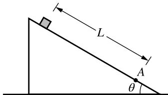

## Skill 2.A: Derivations

Derive a symbolic expression from known quantities by selecting and following a logical mathematical pathway.

## QUESTION 2.A:

Derive an expression for the speed $\nu _ { _ A }$ in terms of the given quantities and physical constants, as appropriate.

(A) $\nu _ { A } = { \sqrt { 2 g L \sin \theta } }$

(B) $\nu _ { A } = \sqrt { 2 g L ( \sin \theta - \mu _ { k } \cos \theta ) }$

(C) $\nu _ { A } = \sqrt { 2 g L ( \mu _ { k } \cos \theta ) }$

(D) $\nu _ { A } = \sqrt { 2 g L ( \sin \theta + \mu _ { k } \cos \theta ) }$

## Skill 2.B: Calculations

Calculate or estimate an unknown quantity with units from known quantities, by selecting and following a logical computational pathway.

## QUESTION 2.B:

Given $L { = } 1 . 0 \ \mathrm { m } , \mu _ { k } { = } 0 . 1 ,$ , and $\theta = 3 0 ^ { \circ }$ , the speed $\nu _ { _ A }$ of the block as it reaches point A is most nearly

(A) 2.9 m/s

(B) 3.1 m/s

(C) 8.3 m/s

(D) 9.9 m/s

A block is released from rest near the top of a rough ramp inclined at an angle abovethehorizontal.Point A is a distance L away from the point where the block isreleased,asshowninthefigure.Thecoeficientof kinetic friction between the block and the ramp is $\mu _ { k } .$ . The block is moving with speed $\nu _ { _ A }$ when it reaches point A.

## Skill 2.C: Comparisons

Compare physical quantities between two or more scenariosoratdiferenttimesand/orlocationswithina single scenario.

## QUESTION 2.C:

The work done by the force of gravity on the block as the block slides from the point of release to point A is $W _ { \mathrm { 1 ^ { ' } } }$ . The angle of the ramp is increased, and the work done by the force of gravity on the block as the block slides from the point of release to point A is $W _ { 2 } .$ . How does $W _ { 1 }$ compare to $W _ { 2 } ?$

(A) $W _ { 1 } > W _ { 2 }$

(B) $W _ { 1 } < W _ { 2 }$

(C) $W _ { 1 } = W _ { 2 }$

(D) $W _ { 1 }$ and $W _ { 2 }$ cannot be compared without knowing the mass of the block.

## Skill 2.D: Functional Dependence

Predict new values or factors of change of physical quantities using functional dependence between variables.

## QUESTION 2.D:

The energy dissipated by the frictional force as the block travels from the point of release to point A is $E _ { \mathrm { 1 } } .$ Ifthecoeficientoffrictionbetweentheblockandthe ramp is doubled, the energy dissipated by the frictional force as the block travels from the point of release to point A is

$E _ { 2 }$ . What is the ratio $\frac { E _ { 1 } } { E _ { 2 } } ?$

(A) $\textstyle { \frac { 1 } { 2 } }$

(B) 1

(C) 2

(D) 4

## Skill 3.B: Make a Claim

Applyanappropriatelaw,definition,theoretical relationship, or model to make a claim.

## QUESTION 3.B:

Which of the following statements is correct about the total mechanical energy in the scenario above?

(A) Thetotalmechanicalenergyofthesystem consisting of only the block decreases from the time of release until the time when the block reaches point A.

(B) Thetotalmechanicalenergyofthesystem consisting of only the block remains constant from the time of release until the time when the block reaches point A.

(C) Thetotalmechanicalenergyofthesystem consisting of the block and Earth decreases from the time of release until the time when the block reaches point A.

(D) Thetotalmechanicalenergyofthesystem consisting of only the block and Earth remains constant from the time of release until the time when the block reaches point A.

## Skill 3.C: Justify a Claim

Justify or support a claim using evidence from experimental data, physical representations, or physical principles or laws.

## QUESTION 3.C:

Which of the following statements correctly explains why the total mechanical energy of the block–Earth system decreases as the block travels to point A?

(A) TheheightoftheblockabovethesurfaceofEarth decreases.

(B) Theforceoffrictionremovesenergyfromthe block–Earth system.

(C) Thedownwardgravitationalforceexertedonthe block by Earth does negative work on the block– Earth system.

(D) Thenormalforcefromtheinclinedoesnegative work on the block–Earth system.

THIS PAGE IS INTENTIONALLY LEFT BLANK.

## AP PHYSICS C: MECHANICS dp Exam dt Information

## Exam Overview

The AP Physics C: Mechanics exam assesses student application of the science practices and understanding of the learning objectives outlined in the course framework. The exam is 3 hours long and includes 42 multiplechoice questions and 4 free-response questions. A four-function, scientific, or graphing calculator is allowed on both sections of the exam. The details of the exam, including exam weighting and timing, can be found below:

<table><tr><td>Section</td><td>Type of Questions</td><td>Number of Questions</td><td>Weighting</td><td>Timing</td></tr><tr><td>I</td><td>Multiple-choice questions</td><td>42</td><td>50%</td><td>85 minutes</td></tr><tr><td>II</td><td>Free-response questions</td><td>4</td><td>50%</td><td>95 minutes</td></tr><tr><td></td><td colspan="4">Question 1: Mathematical Routines</td></tr><tr><td></td><td colspan="4">Question 2: Translation Between Representations</td></tr><tr><td></td><td colspan="4">Question 3: Experimental Design and Analysis</td></tr><tr><td></td><td colspan="4">Question 4: Qualitative/Quantitative Translation</td></tr></table>

The exam also assesses each of the seven units of instruction with the following exam weightings on the multiple-choicesectionoftheAPexam:

Exam Weighting for the Multiple-Choice Section of the AP Exam

<table><tr><td>Units of Instruction</td><td>Weighting</td></tr><tr><td>Unit 1: Kinematics</td><td>10–15%</td></tr><tr><td>Unit 2: Force and Translational Dynamics</td><td>20–25%</td></tr><tr><td>Unit 3: Work, Energy and Power</td><td>15–25%</td></tr><tr><td>Unit 4: Linear Momentum</td><td>10–20%</td></tr><tr><td>Unit 5: Torque and Rotational Dynamics</td><td>10–15%</td></tr><tr><td>Unit 6: Energy and Momentum of Rotating Systems</td><td>10–15%</td></tr><tr><td>Unit 7: Oscillations</td><td>10–15%</td></tr></table>

# How Student Learning is Assessed on the AP Exam

## Exam Weighting by Science Practice

SciencePractices2and3areassessedinthemultiple-choicesectionwiththefollowingweighting(Science Practice1willnotbeassessedinthemultiple-choicesection).SciencePractices1,2,and3areallassessedinthe free response section with the following weighting.

Please note: Required course content (Learning Objectives and Essential Knowledge) can be assessed with any skill.

<table><tr><td colspan="2">Skill</td><td>Approximate MCQ Exam Weighting</td><td>Approximate FR Exam Weighting</td></tr><tr><td>1.A</td><td>Create diagrams, tables, charts, or schematics to represent physical situations.</td><td rowspan="3">N/A</td><td rowspan="3">20-35%</td></tr><tr><td>1.B</td><td>Create quantitative graphs with appropriate scales and units, including plotting data.</td></tr><tr><td>1.C</td><td>Create qualitative sketches of graphs that represent features of a model or the behavior of a physical system.</td></tr><tr><td>2.A</td><td>Derive a symbolic expression from known quantities by selecting and following a logical mathematical pathway.</td><td>25-30%</td><td rowspan="4">40-45%</td></tr><tr><td>2.B</td><td>Calculate or estimate an unknown quantity with units from known quantities, by selecting and following a logical computational pathway.</td><td>20-25%</td></tr><tr><td>2.C</td><td>Compare physical quantities between two or more scenarios or at different times and locations in a single scenario.</td><td>10-15%</td></tr><tr><td>2.D</td><td>Predict new values or factors of change of physical quantities using functional dependence between variables.</td><td>10-15%</td></tr><tr><td>3.A</td><td>Create experimental procedures that are appropriate for a given scientific question.</td><td>N/A</td><td></td></tr><tr><td>3.B</td><td>Apply an appropriate law, definition, theoretical relationship, or model to make a claim.</td><td>15–25%</td><td>30–35%</td></tr><tr><td>3.C</td><td>Justify or support a claim using evidence from experimental data, physical representations, or physical principles or laws.</td><td>5–10%</td><td></td></tr></table>

## Free-Response Questions

Thefree-responsesectionofthePhysicsC:MechanicsExamconsistsoffourquestiontypeslistedbelowinthe order they will appear on the exam.

## Mathematical Routines (MR)

## Skills: 1.A 1.C 2.A 2.B 3.B 3.C

## 10points;suggestedtime20-25minutes

TheMathematicalRoutines(MR)questionassessesstudents’abilitytousemathematicstoanalyzeascenario and make predictions about that scenario. Students will be expected to symbolically derive relationships between variables, as well as calculate numerical values. Students will be expected to create and use representations that describethescenario,eithertohelpguidethemathematicalanalysis(suchasdrawingafree-bodydiagram)orthat are applicable to the scenario (such as sketching velocity as a function of time).

## Translation Between Representations (TBR) 1.A 1.C 2.A 2.D 3.B 3.C

## 12points;suggestedtime25-30minutes

TheTranslationBetweenRepresentations(TBR)questionassessesstudents’abilitytoconnectdiferent representations of a scenario. Students will be expected to create a visual representation that describes a given scenario. Students will derive equations that are mathematically relevant to the scenario. Students will draw graphs that relate quantities within the scenario. Finally, students will be asked to do any one of the following:

§ Justify why their answers to any two of the previous parts do/do not agree with each other.

§ Use their representations, mathematical analysis, or graph to make a prediction about another situation and justify their prediction using that reasoning or analysis.

§ Use their representations, mathematical analysis, or graph to make a prediction about how those representations would change if properties of the scenario were altered and justify that claim using consistent reasoning or analysis

# Experimental Design and Analysis (LAB)

## Skills: 1.B 2.B 2.D 3.A

## 10points;suggestedtime25-30minutes

The Experimental Design and Analysis (l AB) question assesses students' ability to create scientific procedures that car be used with appropriate data analysis technigues to determine the answer to given questions. The LAB question car roughly be divided into two sections: Design and Analysis. In the Design portion of the LAB question, students will be asked to develop a method by which a question about a given physical scenario could be answered. The experimental procedureisexpectedtobescientificallysound:varyasingleparameter,andmeasurehowthatchangeafectsasingle characteristic. Methods must be able to be performed in a typical high school laboratory. Measurements must be made with realistically obtainable equipment or sensors. Students will be expected to describe a method by which the collecteddatacouldbeanalyzedinordertoanswertheposedquestion,byeithergraphicalorcomparativeanalyses.

Students will then be given experimental data collected in order to answer a similar, but not identical, question to what was asked in the Design portion of the question. Students will be asked to use the data provided to create and plot a graphthatcanbeanalyzedtodeterminetheanswertothegivenquestion.Forinstance,theslopeorinterceptsofthe line may be used to determine a physical quantity or perhaps the nature of the slope would answer the posed question.

## Qualitative/Quantitative Translation (QQT)

## 2.A 2.D 3.B 3.C

## 8points;suggestedtime15-20minutes

The Qualitative/Quantitative Translation (QQT) question assesses students’ ability to connect the nature of the scenario, the physical laws that govern the scenario, and mathematical representations of that scenario to each other. Students will be asked to make and justify a claim about a given scenario, as well as derive an equation related to that scenario. Finally, students will be asked to do any one of the following

§ Justify why their answers to any of the previous parts do/do not agree with each other.

§ Use their representations or mathematical analysis to make a prediction about another situation and justify their prediction using that reasoning or analysis.

Use their representations and mathematical analysis to make a prediction about how those representations would change if properties of the scenario were altered and justify that claim using consistent reasoning or analysis.

While students may not be directly assessed on their ability to create diagrams or other representations of the system toanswertheQQT,thoseskillsmaystillhelpstudentstoanswertheQQT.Forinstance,somestudentsmayfindthat drawingafree-bodydiagramisusefulwhendeterminingtheaccelerationofasystem.However,thestudentwillearn points for the explanation and conclusions that diagram indicates (or perhaps the derivation that results from the diagram), rather than for creating the diagram itself.

# Task Verbs Used in Free-Response Questions

Thefollowingtaskverbsarecommonlyusedinthefree-response questions.

Calculate:Performmathematicalstepstoarriveatafinalanswer,including algebraic expressions, properly substituted numbers, and correct labeling of unitsandsignificantfigures.

Compare: Provide a description or explanation of similarities and/or diferences.

Derive: Starting with a fundamental law or relationship, perform a series of mathematicalstepstoarriveatafinalanswer.

Describe: Providetherelevantcharacteristicsofaspecifiedtopic.

Determine: Make a decision or arrive at a conclusion after reasoning, observation, or applying mathematical routines (calculations).

Draw: Create a diagram or schematic that illustrates relationships, depicts physicalobjects,ordemonstratesconsistencybetweendiferenttypesof representation. Labels may or may not be required.

Estimate: Roughly calculate numerical quantities, values (greater than, equal to, less than), or signs (negative, positive) of quantities based on experimental evidence or provided data. When making estimations, showing steps in calculations are not required.

Indicate:Provideinformationaboutaspecifiedtopic,withoutelaborationor explanation.

Justify: Provide qualitative reasoning beyond mathematical derivations or expressions to support, qualify, or defend a claim.

Label: Provide labels indicating unit, scale, and/or components in a diagram, graph, model, or representation.

Plot: Draw data points in a graph using a given scale or indicating the scaleandunits,demonstratingconsistencybetweendiferenttypesof representations.

Rank:Arrangequantitiesinrelationtoeachother,typicallybysizeor magnitude.

Sketch: Create a graph, representation, or model that illustrates relationships orphenomena,demonstratingconsistencybetweendiferenttypesof representations. Labels may or may not be required.

Verify:Confirmthattheconditionsofascientificdefinition,law,theorem,or test are met to explain why it applies in a given situation. Also, use empirical data,observations,tests,orexperimentstoprove,confirm,and/orjustifya hypothesis.

# Sample Exam Questions

The sample exam questions that follow illustrate the relationship between the course framework and the AP Physics C: Mechanics Exam and serve as examples of the types of questions that appear on the exam. These sample questions do not represent thefullrangeanddistributionofitemsonanoficialAPPhysicsC:MechanicsExam. After the sample questions is a table which shows which skill, learning objective, and essential knowledge statement each question relates to. This table also provides the answerstothemultiple-choicequestions.

## Section I: Multiple-Choice Questions

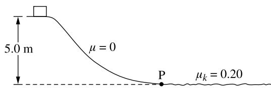

1. A block is released from rest and slides down a track with negligible friction, descending a vertical distance of 5.0 m from its initial position to Point P, as shown in the figure. The block then slides on a horizontal surface where the coeficient of kinetic friction $\mu _ { k }$ between the block and the horizontal surface is 0.20. How far does the block slide on the horizontal surface before coming to rest?

(A) 1.0 m

(B) 5.0 m

(C) 10 m

(D) 25 m

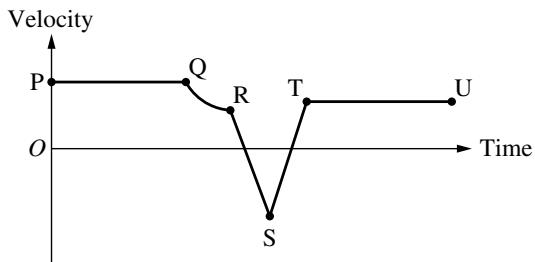

2. The velocity as a function of time for an object moving along a straight line is shown in the graph. For which of the following sections of the graph is the acceleration constant and nonzero? (A) QR only (B) PQ and TU only (C) RS and ST only (D) PQ, RS, ST and TU only

3. The net force F exerted on an object that moves along a straight line is given as a function of time t by $F ( t ) = A t ^ { 2 } + B ,$ where $A { = } 1 \mathrm { N } / s ^ { 2 }$ and B =1 N. What is the change in momentum of the object from t = 0 to t = 3 s? (A) 6 kg·m/s (B) 12 kg·m/s (C) 17 kg·m/s (D) 30 kg·m/s

4. A spherical star spinning at an initial angular velocity suddenly collapses to half of its original radius without any loss of mass. Assume the star has uniform density before and uniform density after the collapse. What is the angular velocity of the star after the collapse? (A) (B) (C) (D)

<table><tr><td></td><td>Period of pendulum</td><td>Period of spring</td></tr><tr><td>A</td><td>Remains the same</td><td>Remains the same</td></tr><tr><td>B</td><td>Remains the same</td><td>Increases</td></tr><tr><td>C</td><td>Increases</td><td>Remains the same</td></tr><tr><td>D</td><td>Increases</td><td>Increases</td></tr><tr><td>(A)</td><td>A</td><td></td></tr><tr><td>(B)</td><td>B</td><td></td></tr><tr><td>(C)</td><td>C</td><td></td></tr><tr><td>(D)</td><td>D</td><td></td></tr></table>

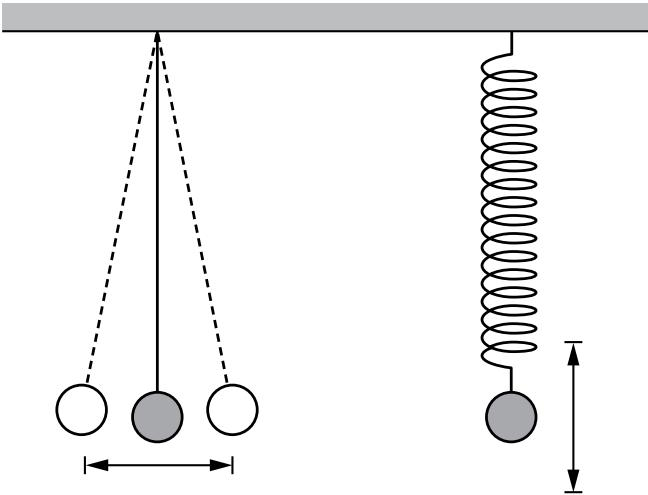

5. A pendulum is constructed by attaching a 1 kg sphere to the end of a light string that is fixed to a ceiling. A second 1 kg sphere is attached the end of a spring, which is also fixed to the ceiling. The pendulum and spring have the same length when in equilibrium, as shown in the figure. Both spheres are displaced from equilibrium in the directions shown and oscillate with the same period. If the 1 kg spheres are replaced with 2 kg spheres and the amplitudes of oscillations are unchanged, which of the following is true about each of their resulting periods of oscillation?

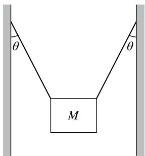

6. A heavy sign of mass M is held at rest by two supporting wires between two buildings, with each wire making an angle with the vertical, as shown in the figure. What is the tension in each wire?

(A) $\frac { M g } { 2 \mathrm { s i n } \theta }$

(B) $\frac { M g } { 2 { \cos } \theta }$

(C) $\frac { M g } { \sin \theta }$

(D) $\frac { M g } { \cos \theta }$

<table><tr><td></td><td>Mass (kg)</td><td>Area  $\left( {\mathrm{{cm}}}^{2}\right)$ </td><td>Coefficient of Static Friction  $\left( {\mu }_{s}\right)$ </td></tr><tr><td>Block 1</td><td>0.75</td><td>75</td><td>0.20</td></tr><tr><td>Block 2</td><td>3.0</td><td>100</td><td>0.40</td></tr></table>

7. In an experiment, two blocks made of diferent materials are placed on the same wooden board, which is initially horizontal. The table shown provides three values for each block: the mass, the area of the side of the block in contact with the board, and the coeficient of static friction between the block and the board. One end of the board is then slowly raised. Which of the following correctly identifies the block that will start sliding down the board first, and includes appropriate reasoning?

(A) Block 1, because it has less mass per unit area.

(B) Block 1, because the coeficient of static friction is smaller.

(C) Block 2, because it has greater mass.

(D) Block 2, because the coeficient of static friction is larger.

Energy at t = tf  
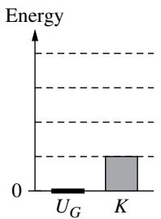  
Energy at $t = t _ { 0 }$

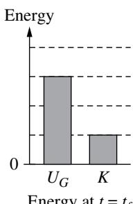

8. A student lifts a ball straight upward at a constant speed. The energy bar diagrams represent the gravitational potential energy $U _ { \ G }$ of the ball-Earth system and the kinetic energy K of the ball at a time $t = t _ { 0 }$ and at a later time $t = t _ { f }$ . Which of the following energy bar diagrams correctly represents the change in mechanical energy $\Delta E$ of the ball-Earth system for the time interval $\Delta t = t _ { f } - t _ { 0 } ?$

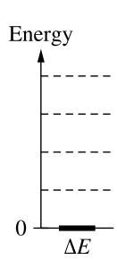  
(A)

(B)  
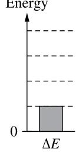

(C)  
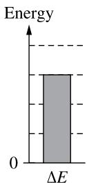

(D)  
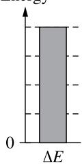

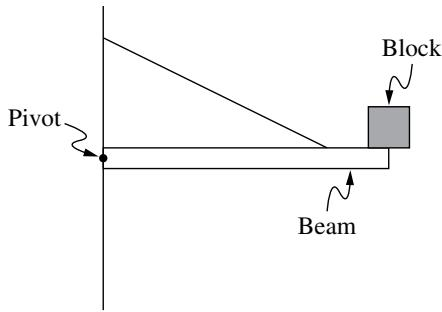

9. A uniform beam of length 0.60 m and mass 4.0 kg is fixed to a wall by a pivot. The beam is held horizontally by a string fixed to the beam and wall. A block of mass 1.0 kg is attached at the end of the beam, as shown. Which of the following is nearest to the magnitude of the torque about the pivot exerted by the weight of the block?

(A) 0

(B)

(C)

(D)

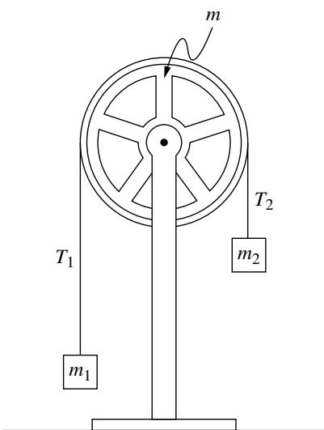

10. Two blocks of mass $m _ { 1 }$ and $m _ { 2 }$ are connected by a thin string that passes over a circular wheel of mass m, as shown. The wheel is attached to a vertical stand and rotates freely about its center. The string does not slip on the wheel and exerts forces $T _ { 1 }$ and $T _ { 2 }$ on the blocks. When the wheel is released from rest in the position shown, it undergoes an angular acceleration and rotates clockwise. Which of the following statements about the magnitudes of $T _ { 1 }$ and $T _ { \scriptscriptstyle 2 }$ is correct?

(A) $T _ { 1 } = T _ { 2 }$ because the tension in the string must always be constant within the string.

(B) $T _ { 1 } = T _ { 2 }$ because both blocks have the same acceleration.

(C) $T _ { 1 } < T _ { 2 }$ because $m _ { 1 }$ is farther from the wheel than $m _ { 2 }$

(D) $T _ { \scriptscriptstyle 1 } < T _ { \scriptscriptstyle 2 }$ because an unbalanced clockwise torque is needed to accelerate the wheel clockwise.

11. Two small, identical blocks, Block 1 and Block 2, are dropped from rest at diferent heights above a horizontal floor. Block 1 has speed $\nu _ { \scriptscriptstyle 1 }$ immediately before hitting the floor, and Block 2 has speed $2 \nu _ { 1 }$ immediately before hitting the floor. The work done by gravity on Block 1 as it falls is $W _ { \mathrm { r } } .$ What is the work done by gravity on Block 2 as it falls?

(A) $\frac { 1 } { 4 } W _ { 1 }$

(B) $\frac { 1 } { 2 } W _ { 1 }$

(C) $2 W _ { 1 }$

(D) $4 W _ { 1 }$

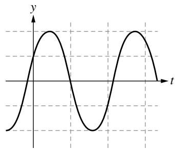

12. A block is hung vertically from an ideal spring. The block is pulled down, released, and allowed to oscillate. The vertical position y of the block as a function of time t is shown in the graph. Which of the following graphs best represents the corresponding acceleration a of the block as a function of time?

(A)  
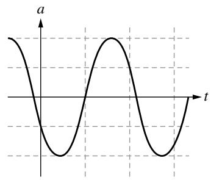

(C)  
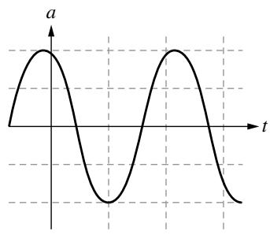

(B)  
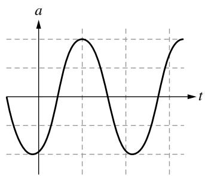

(D)  
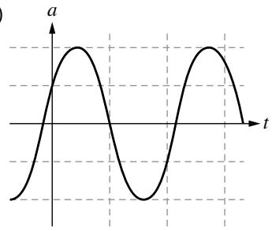

13. A small rock is launched from the surface of a planet with no atmosphere. The initial speed of the rock is $2 \nu _ { \mathrm { e s c } } ,$ , where $\nu _ { \mathrm { e s c } }$ is the escape speed of the planet. What is the speed of the rock when it is very far from the surface of the planet?

(A) Zero

(B) $\frac { 1 } { 2 } \nu _ { \mathrm { e s c } }$

(C) $\sqrt { 2 } \nu _ { \mathrm { e s c } }$

(D) $\sqrt { 3 } \nu _ { \mathrm { e s c } }$

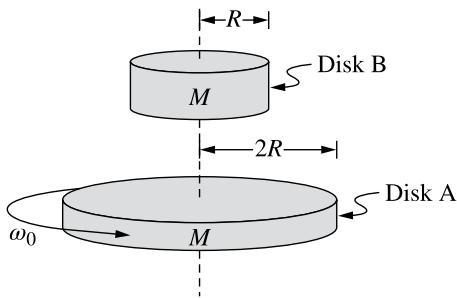

14. Two uniform disks, A and B, each of mass $M .$ , have radii 2R and R, respectively. The rotational inertia of a uniform disk of mass m and radius r $\mathrm { i s } { \frac { 1 } { 2 } } m r ^ { 2 }$ . Disk A rotates in a horizontal plane about its center with angular velocity $\omega _ { \scriptscriptstyle 0 }$ and Disk B is initially held at rest. Disk B is then released and falls onto the center of Disk A such that both disks spin together about their centers without slipping. What is the angular velocity $\omega _ { f }$ of the two-disk system?

(A) $\frac { 1 } { 2 } \omega _ { \scriptscriptstyle 0 }$

(B) $\frac { 2 } { 3 } \omega _ { \mathrm { o } }$

(C) $\frac { 4 } { 5 } \omega _ { \scriptscriptstyle 0 }$

(D) $\frac { 2 } { \sqrt { 5 } } \omega _ { \scriptscriptstyle 0 }$

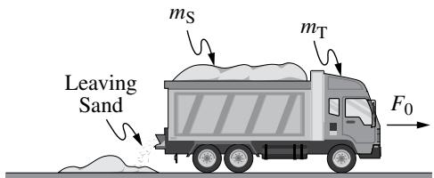

15. A truck of mass $m _ { \mathrm { T } }$ is initially at rest with a load of sand of initial mass $m _ { s }$ At time $t = 0$ , the truck is pushed forward by a constant force $F _ { 0 }$ and the sand begins to leave the truck, as shown. The mass of sand that has left the truck as a function of time t is given by Ct, where C is a positive constant with appropriate units. At time $t _ { 1 }$ there is no sand left in the truck. Which of the following graphs most nearly shows the velocity $\nu _ { \mathrm { r } }$ of the truck as a function of time?

(A)  
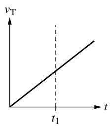

(B)  
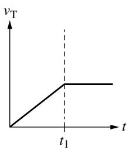

(C)  
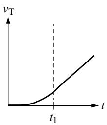

(D)  
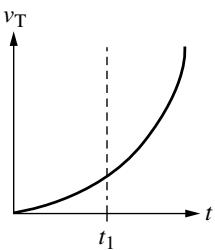

## Section II: Free–Response Questions QUESTION 1: MATHEMATICAL ROUTINES

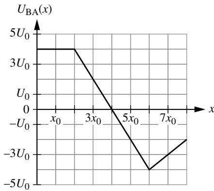  
Figure 1

A system is comprised of two objects, A and B, which interact with each other through a conservative force $F _ { \mathrm { B A } } \left( x \right)$ , where x is the position of Object A with respect to Object B. The potential energy $U _ { \mathrm { B A } } \left( x \right)$ of the two-object system as a function of x is shown in Figure 1. No external forces are exerted on the two-object system.

Object A has mass $m _ { \mathrm { A } }$ and is released from rest at position $\begin{array} { r } { x = 3 x _ { 0 } . } \end{array}$ Object A starts moving, and later passes through position $\scriptstyle x = 7 x _ { 0 }$

i. Derive an expression for the speed of Object A at the instant Object A is passing through position $\scriptstyle x = 7 x _ { 0 } .$ Express your answer in terms of $m _ { \mathrm { A } } ,$ $U _ { \mathfrak { o } } , x _ { \mathfrak { o } } ,$ and physical constants, as appropriate. Begin your derivation by writing a fundamental physics principle or an equation from the reference information.

ii. On the grid shown in Figure 2, draw a graph of the force exerted on Object A by Object B.

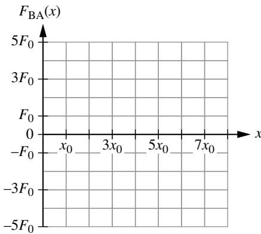  
Figure 2

In another scenario, Object A is replaced by Object C. Objects C and B interact with each other through a conservative force $F _ { \mathrm { { B C } } } \left( x \right) = - \beta x ^ { 2 } ;$ , where $\beta { = } \frac { 3 } { 8 } ~ \frac { \mathrm { k g } } { \mathrm { s ^ { 2 } m } }$ The potential energy $U _ { \mathrm { { B C } } } ( x )$ of the Object C-Object B system is defined to be zero when Object C is at position $x = - 2$ m. No external forces are exerted on the two object system.

B. Derive an equation for $U _ { \mathrm { { B C } } } ( x )$ Express your answer only in terms of x. Begin your derivation by writing a fundamental physics principle or an equation from the reference information.

QUESTION 2: TRANSLATION BETWEEN REPRESENTATIONS

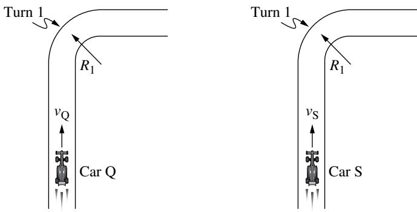  
Figure 1

Two identical race cars, Cars Q and S, each of mass m, are driven on a flat, horizontal road. Turn 1 in the road can be modeled as a circular segment of radius $R _ { \mathrm { 1 } } ,$ as shown in Figure 1. The coeficient of static friction between each car’s tires and the road is µ. The race cars are constructed so that when the cars are moving forward at a speed v relative to the air, the air exerts a downward force of magnitude $F _ { \mathrm { d o w n } }$ on the car given by $F _ { _ { \mathrm { d o w n } } } = b \nu ^ { 2 } ;$ , where b is a positive constant with appropriate units.

Both cars travel through Turn 1 at constant speeds without slipping. Car Q travels at speed $\nu _ { \mathrm { Q } }$ and Car S travels at speed $\nu _ { \mathrm { { s } } } = 2 \nu _ { \mathrm { { Q } } }$ . The air is not moving, so the cars’ speeds relative to the air is the same as their speed relative to the ground.

The dot in Figure 2 represents Car Q, as seen from the back, as the car turns to the right through Turn 1. The four arrows represent the following forces exerted on the car: $F _ { \mathrm { d o w n , Q } } ^ { } ,$ a gravitational force $F _ { g , \mathrm { Q } }$ , a normal force $F _ { n , \mathrm { Q } } ^ { \mathrm { } } ;$ , and a frictional force $F _ { f , \mathrm { Q } } .$

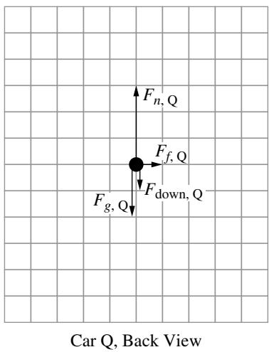  
Figure 2

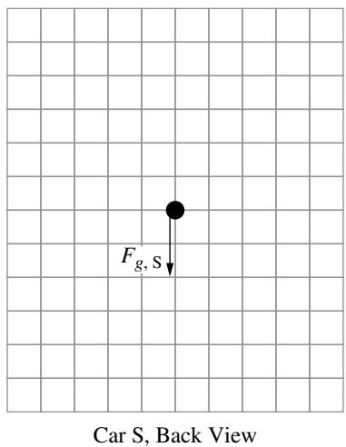  
Figure 3  
The dot in Figure 3 represents Car S, as seen from the back, as the car turns to the right through Turn 1. The arrow labeled $F _ { \mathrm { g , S } }$ represents the gravitational force exerted on Car S.

A. On the dot in Figure 3, draw and label the other forces exerted on Car S. Each force must be represented by a distinct arrow starting on, and pointing away from, the dot. The lengths of the arrows should reflect the relative magnitudes of the forces exerted on Car Q.

If the radius of the curve is large enough, then either car would be capable of traveling through the curve at any speed without slipping. The critical radius $R _ { \mathrm { c } }$ is the smallest value of the radius of curvature where the cars can travel at any speed without slipping.

B. Derive an expression for $R _ { \mathrm { c } }$ in terms of m, µ, b, and physical constants, as appropriate. Begin your derivation by writing a fundamental physics principle or an equation from the reference information.

The maximum speed $\nu _ { \mathrm { m a x } }$ that a car can travel along a circular track without slipping as a function of the track’s radius R if air exerts no downward force on the car is shown with the dashed line in Figure 4.

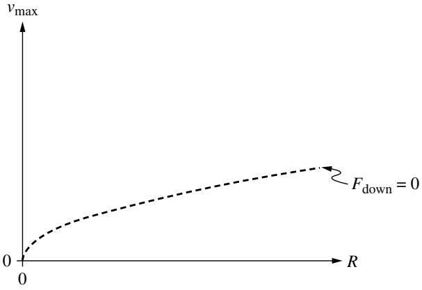  
Figure 4

C. On Figure 4, sketch the maximum speed that the car can have on a circular track of radius R when air exerts a downward force of magnitude $F _ { \mathrm { d o w n } } = b \nu ^ { 2 }$ on the car.

Figure 5 shows Car Q in a semicircular turn of radius R . Car Q enters the turn at Point A and then travels through both Point B, which is midway through the turn, and Point C, where the car exits the turn. Air moves in the direction shown with respect to the ground at speed $\nu _ { \mathrm { w i n d } } .$ While turning, Car Q maintains a constant radius turn and always travels at the maximum speed possible without slipping. The time intervals in which Car Q travels between points A and B and between points B and C are $\Delta t _ { \mathrm { A B } }$ and $\Delta t _ { \mathrm { B C } }$ , respectively.

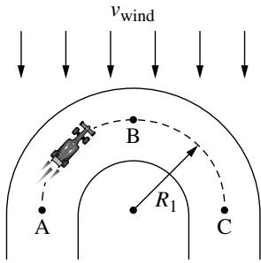  
Figure 5

D. Is $\Delta t _ { \mathrm { A B } }$ is greater than, less than, or equal to $\Delta t _ { \mathrm { { B C } } } ?$ Justify your answer. Your justification may reference equations but must include conceptual reasoning beyond algebraic solutions.

## QUESTION 3: EXPERIMENTAL DESIGN AND ANALYSIS

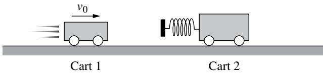  
Figure 1

A group of students have two Carts, Cart 1 and Cart 2, each of known mass $M _ { 1 }$ and $M _ { ☉ } ,$ respectively. The carts are placed on a straight horizontal track. Cart 1 is given an initial speed $\nu _ { 0 }$ toward the right. Cart 2 is initially at rest and has a spring attached to it, as shown in Figure 1. Cart 1 collides with Cart 2.

The group of students want to determine the relationship between $\nu _ { 0 }$ and the fraction of kinetic energy remaining after the collision, which is described by the ratio $\frac { K _ { \mathrm { t o t a l } , f } } { K _ { \mathrm { t o t a l } , i } }$ ,  where $K _ { \mathrm { t o t a l } , f }$ is the total kinetic energy of Carts 1 and 2 after the collision

$K _ { \mathrm { t o t a l } , i }$ is the total kinetic energy of Carts 1 and 2 before the collision.

i. Indicate quantities that could be measured by the students that would allow them to determine if the initial speed $\nu _ { 0 }$ of Cart 1 changes the ratio $\frac { K _ { \mathrm { t o t a l } , f } } { K _ { \mathrm { t o t a l } , i } }$

ii. Briefly describe a method to reduce experimental uncertainty for the measured quantities.

i. Indicate what quantities the students could graph on the horizontal and vertical axes to create a linear graph that can be used to determine if the value of $\nu _ { 0 }$ changes the ratio $\frac { K _ { \mathrm { t o t a l } , f } } { K _ { \mathrm { t o t a l } , i } }$

ii. Briefly describe how the graph can be analyzed to determine if the value of $\nu _ { 0 }$ changes the ratio $\frac { K _ { \mathrm { t o t a l } , f } } { K _ { \mathrm { t o t a l } , i } }$

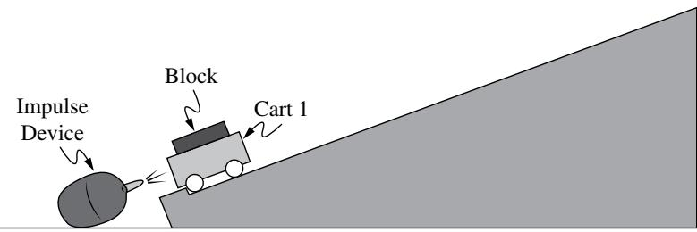  
Figure 2

In a later experiment, Cart 1 is placed at the bottom of a ramp. An impulse device at the bottom of the ramp delivers an impulse to Cart 1 that is directed up the ramp by quickly releasing a burst of high-pressure air, as shown in Figure 2. The magnitude of the impulse delivered to the cart is the same in all trials. Blocks of diferent known masses can be attached to Cart 1.

C.

The students are asked to determine the value of the impulse delivered to the block-cart system by the impulse device. The students measure the combined mass $M _ { 1 , B }$ of the cart and block. The impulse device delivers the impulse to the blockcart system, and the students measure the maximum vertical height h attained by the block-cart system above the initial position of the system.

The experiment is repeated using blocks of diferent masses. The students’ measurements are shown in Table 1.

Table 1

<table><tr><td>Trial Number</td><td>Combined mass of cart and block,  $M_{1,B}$  (kg)</td><td>Maximum Height h(m)</td></tr><tr><td>1</td><td>0.100</td><td>0.395</td></tr><tr><td>2</td><td>0.150</td><td>0.160</td></tr><tr><td>3</td><td>0.250</td><td>0.070</td></tr><tr><td>4</td><td>0.350</td><td>0.035</td></tr><tr><td>5</td><td>0.500</td><td>0.015</td></tr></table>

i. Label the axes of the grid provided with measured or calculated quantities. Include units, as appropriate. The graphed quantities should yield a linear graph that can be used to determine the impulse delivered.

ii. On the grid provided, create a graph of the quantities indicated in part C (i).

\- Clearly label the horizontal and vertical axes with a numerical scale.

\- Plot the corresponding data points on the grid.

\- Table 2 is provided in your booklet for scratch work and will not be scored.

Quantity (Units, as appropriate)

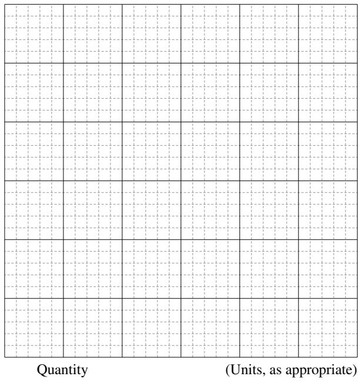

iii. Draw a best-fit line for the data plotted in part C (ii).

D. Using the straight line from part C (iii), calculate the value of the impulse delivered to the cart by the impulse device.

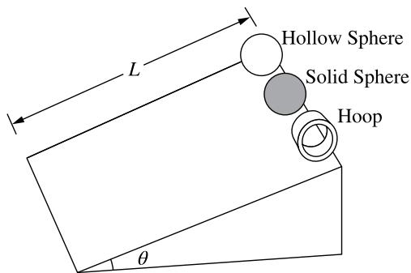

A hollow sphere, a uniform solid sphere, and a hoop are placed at the top of a ramp of length L that makes an angle with the horizontal, as shown in the figure. The hollow sphere, solid sphere, and hoop have the same mass M and the same radius R. All three shapes are released from rest at the same time and roll down the ramp without slipping.

A. Rank the time taken by each shape to reach the bottom of the ramp from greatest to least.

Justify your rankings. Your justification may reference equations but must include conceptual reasoning beyond algebraic solutions.

The time for one of the shapes to roll without slipping to the bottom of the ramp is t, and the rotational inertia of that shape is I.

B. Derive the relationship between t and I w t to sho hat $t = { \sqrt { \frac { 2 L { \left( I + M R ^ { 2 } \right) } } { M g R ^ { 2 } \sin \theta } } }$ Begin your derivation by writing a fundamental physics principle or an equation from the reference information.

A new sphere is constructed using a thin spherical shell of radius R. The shell is completely filled with liquid. The mass of the shell is much less than that of the liquid, and the total mass of the liquid-filled sphere is M.

The liquid-filled sphere is placed at the top of the ramp, released from rest, and rolls without slipping to the bottom of the ramp. As the sphere rolls down the ramp, the liquid inside the sphere does not rotate with the shell.

C. Does the liquid-filled sphere reach the bottom of the ramp in more time, less time, or the same time as the solid sphere? Use the equation derived in part B to justify your answer.

Answer Key and Question Alignment to Course Framework

<table><tr><td>Multiple-Choice Question</td><td>Answer</td><td>Skill</td><td>Learning Objective</td><td>Essential Knowledge</td></tr><tr><td>1</td><td>D</td><td>2.B</td><td>3.4.B</td><td>3.4.B.2</td></tr><tr><td>2</td><td>C</td><td>2.C</td><td>1.3.A</td><td>1.3.A.4</td></tr><tr><td>3</td><td>B</td><td>2.B</td><td>4.2.B</td><td>4.2.B.2</td></tr><tr><td>4</td><td>D</td><td>2.D</td><td>6.4.A</td><td>6.4.A.2</td></tr><tr><td>5</td><td>B</td><td>2.C</td><td>7.2.A</td><td>7.2.A.1</td></tr><tr><td>6</td><td>B</td><td>2.A</td><td>2.4.A</td><td>2.4.A.1</td></tr><tr><td>7</td><td>B</td><td>3.C</td><td>2.7.B</td><td>2.7.B.2</td></tr><tr><td>8</td><td>C</td><td>3.B</td><td>3.4.B</td><td>3.4.B.2</td></tr><tr><td>9</td><td>B</td><td>2.B</td><td>5.3.B</td><td>5.3.B.2</td></tr><tr><td>10</td><td>D</td><td>3.C</td><td>5.6.A</td><td>5.6.A.1</td></tr><tr><td>11</td><td>D</td><td>2.D</td><td>3.2.A</td><td>3.2.A.4</td></tr><tr><td>12</td><td>A</td><td>3.B</td><td>7.3.A</td><td>7.3.A.3</td></tr><tr><td>13</td><td>D</td><td>2.A</td><td>6.6.A</td><td>6.6.A.4</td></tr><tr><td>14</td><td>C</td><td>2.A</td><td>6.3.A</td><td>6.3.A.2</td></tr><tr><td>15</td><td>C</td><td>2.C</td><td>4.2.B</td><td>4.2.B.2</td></tr></table>

<table><tr><td>Free-Response Question</td><td>Skill</td><td>Learning Objective</td></tr><tr><td>1</td><td>2.A, 3.B, 1.C</td><td>3.1.A, 3.4.B, 3.3.A</td></tr><tr><td>2</td><td>1.A, 3.B, 2.A, 1.C, 2.D, 3.C</td><td>1.4.B, 2.2.B, 2.4.A, 2.4.B, 2.5.A, 2.7.B, 2.10.A</td></tr><tr><td>3</td><td>3.A, 2.D, 1.B, 2.B, 3.C</td><td>2.1.B, 3.1.A, 3.4.B, 3.4.C, 4.2.B, 4.4.A</td></tr><tr><td>4</td><td>3.B, 3.C, 2.A, 2.D</td><td>1.3.A, 3.4.B, 5.4.A, 5.6.A, 5.4.B, 6.1.A</td></tr></table>

<table><tr><td colspan="2">Scoring Guidelines for Question 1: Mathematical Routines</td><td>10 points</td></tr><tr><td colspan="3">Learning Objectives:3.1.A3.4.B3.3.A</td></tr><tr><td colspan="2">A. i. For a multistep derivation that indicates one of the following:■ the total energy of the two object system when Object A is at position  $x = 3x_0$  is equal to the total energy of the system when Object A is at position  $x = 7x_0$ :  $E_{\text{total},0} = E_{\text{total},f}$ ■ that the change in kinetic energy of Object A is equal to the negative of the system’s change in potential energy:  $\Delta K = -\Delta U$ </td><td>1 point</td></tr><tr><td colspan="2">For indicating the total energy of the two-object system is the sum of the system’s potential energy and the kinetic energy of Object A:  $E_{\text{total}} = U + K$ </td><td>1 point</td></tr><tr><td colspan="2">For indicating that either the velocity of Object A or the kinetic energy of Object A is zero when Object A is at position  $x = 3x_0$ ,  $K_0 = 0$ </td><td>1 point</td></tr><tr><td colspan="2">For correct substitutions of the potential energy of the system when Object A is at position  $x = 3x_0$  and at position  $x = 7x_0$ :  $U(7x_0) - U(3x_0) = -3U_0 - 2U_0$  OR</td><td>1 point</td></tr><tr><td colspan="2">For indicating that the change in potential energy as Object A moves from  $x = 3x_0$  to  $x = 7x_0$ is  $-5U_0$   $\Delta U = -5U_0$ </td><td></td></tr><tr><td colspan="2">For a correct answer  $v = \sqrt{\frac{10U_0}{m_A}}$ </td><td>1 point</td></tr><tr><td colspan="2">Example Response: $E_{\text{total},0} = E_{\text{total},f}$  $U_0 + K_0 = U_f + K_f$  $U_f - U_0 = -(K_f - K_0)$  $U(7x_0) - U(3x_0) = -(K(7x_0) - 0)$  $-3U_0 - 2U_0 = -\frac{1}{2} m_A v^2$  $v = \sqrt{\frac{10U_0}{m_A}}$ </td><td></td></tr><tr><td colspan="2">ii. For sketching a force is equal to zero for the entire region  $0 < x < 2x_0$ </td><td>1 point</td></tr><tr><td colspan="2">For drawing a constant force across the interval  $2x_0 < x < 6x_0$  that has twice the magnitude of a constant force across the interval  $6x_0 < x < 8x_0$ </td><td>1 point</td></tr></table>

Example Response:

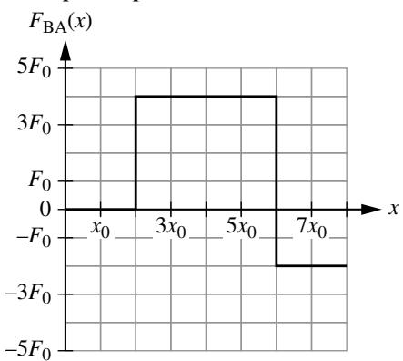  
Figure 2

7 points

B. For a substituting the given expression for force into an appropriate equation to find a change in potential energy 1 point of the two-object system

$$
\Delta U = - \int_ {a} ^ {b} (\beta x ^ {2}) d x
$$

For one of the following:

1 point

■ Correctly relating the change in potential energy of the two-object system to the difference in potential energy of the system when Object A is at position x and another arbitrary position: $\Delta U = U ( x ) - U ( x ^ { \prime } )$

■ Using correct limits in the integral where a definite integral can be evaluated by setting $U ( - 2 \mathrm { m } ) = 0 \mathrm { J }$

■ Indicating a correct integration constant

For a correct equation for potential energy as a function of position

1 point

$$
U (x) = \frac {x ^ {3}}{8} + 1
$$

Example Response:

$$
U (x) - U (- 2 \mathrm{m}) = - \int_ {- 2 \mathrm{m}} ^ {x} F (x) d x
$$

$$
U (x) - 0 = - \int_ {- 2 \mathrm{m}} ^ {x} (- \beta x ^ {2}) d x = \int_ {- 2 \mathrm{m}} ^ {x} (\beta x ^ {2}) d x
$$

$$
U (x) = \beta \left(\frac {x ^ {3}}{3}\right) \Bigg | _ {- 2 \mathrm{m}} ^ {x} = \left(\frac {x ^ {3}}{8}\right) \Bigg | _ {- 2} ^ {x}
$$

$$
U (x) = \frac {x ^ {3}}{8} - \frac {\left(- 2\right) ^ {3}}{8} = \frac {x ^ {3}}{8} + 1
$$

Total for part B 3 points

Total for Question 1 10 points

<table><tr><td colspan="7">Scoring Guidelines for Question 2: Translation Between Representations</td><td>12 points</td></tr><tr><td>Learning Objectives:</td><td>1.4.B</td><td>2.2.B</td><td>2.4.A</td><td>2.5.A</td><td>2.7.B</td><td>2.10.A</td><td></td></tr><tr><td rowspan="6">A.</td><td colspan="6">For correctly drawing and labeling the three forces  $F_{\text{down,S}}$ ,  $F_{\text{n,S}}$ , and  $F_{\text{f,S}}$  such that  $\sum F_{\text{vertical}} = 0$  (regardless of the relative sizes of each arrow), with no extraneous forces</td><td>1 point</td></tr><tr><td colspan="6">For drawing a downward force  $F_{\text{down,S}} = 4F_{\text{down,Q}}$ , i.e., four grid units in length</td><td>1 point</td></tr><tr><td colspan="6">For drawing  $F_{\text{f,S}}$  in the same horizontal direction as  $F_{\text{f,Q}}$ , with  $F_{\text{f,S}} = 4F_{\text{f,Q}}$ , i.e., four grid units in length</td><td>1 point</td></tr><tr><td colspan="6">Example Response: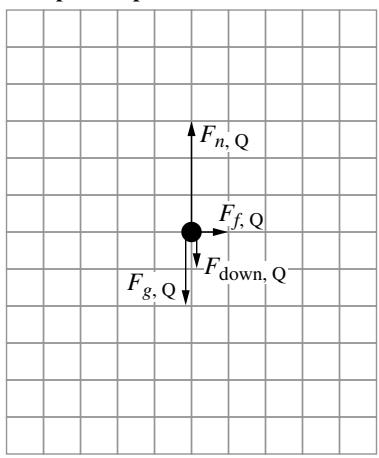 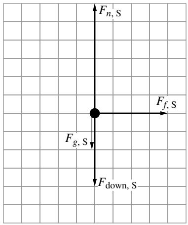</td><td></td></tr><tr><td colspan="2">Car Q, Back View Figure 2</td><td colspan="4">Car S, Back View Figure 3</td><td></td></tr><tr><td colspan="5"></td><td>Total for part A</td><td>3 points</td></tr><tr><td rowspan="4">B.</td><td colspan="6">For a multistep derivation that uses Newton&#x27;s second law, consistent with the diagram drawn in part A for the vertical direction $\sum F_{\text{vert}} = 0$  $F_n - mg - F_{\text{down}} = 0$  $F_n = mg + bv^2$ </td><td>1 point</td></tr><tr><td colspan="6">For a correct expression for the frictional force exerted on the car $F_f \leq \mu F_n = \mu (mg + bv^2)$ Scoring Note: An expression for normal force that is consistent with the previously drawn free-body diagram drawn earns this point.</td><td>1 point</td></tr><tr><td colspan="6">For correctly equating the frictional force to the force that causes a centripetal acceleration $F_f = m \frac{v^2}{R_c}$ </td><td>1 point</td></tr><tr><td colspan="6">For a correct expression for  $R_c$  in terms of the given variables  $R_c = \frac{m}{\mu b}$ </td><td>1 point</td></tr></table>

Example Response 1:

Using Newton’s second law for the vertical forces,

$$
\sum F _ {\mathrm{vert}} = 0
$$

$$
F _ {n} - m _ {\mathrm{C}} g - F _ {\mathrm{down}} = 0
$$

$$
F _ {n} = m _ {\mathrm{C}} g + b v ^ {2}
$$

The friction force is

$$
F _ {f} \leq \mu F _ {n}
$$

These quantities are equal when the car is going as fast as possible without slipping, so $F _ { _ { f } } = \mu F _ { _ { n } } = \mu \left( m _ { _ { \mathrm { C } } } g + b \nu ^ { 2 } \right)$

Using Newton’s second law for the horizontal friction force,

$$
F _ {f} = m _ {\mathrm{C}} \frac {v ^ {2}}{R _ {\mathrm{C}}}
$$

$$
\frac {m _ {\mathrm{C}} v ^ {2}}{R _ {\mathrm{C}}} = \mu (b v ^ {2} + m _ {\mathrm{C}} g)
$$

$$
R _ {\mathrm{c}} = \frac {m _ {\mathrm{c}} v ^ {2}}{\mu (b v ^ {2} + m _ {\mathrm{c}} g)}
$$

As $\nu \to \infty ,$ neglect $m _ { \mathrm { { c } } } g$ so $R _ { \mathrm { c } } \to { \frac { m _ { \mathrm { c } } \nu ^ { 2 } } { \mu b \nu ^ { 2 } } } ,$ , and $R _ { \mathrm { c } } = { \frac { m _ { \mathrm { c } } } { \mu b } }$

Example Response 2:

$$
\sum F _ {\mathrm{vert}} = 0
$$

$$
F _ {n} - m _ {\mathrm{C}} g - F _ {\mathrm{down}} = 0
$$

$$
F _ {n} = m _ {\mathrm{C}} g + b v ^ {2}
$$

$$
F _ {f} \leq \mu F _ {n} = \mu \left(m _ {\mathrm{C}} g + b v ^ {2}\right)
$$

$$
F _ {f} = m _ {\mathrm{C}} \frac {v ^ {2}}{R _ {\mathrm{C}}}
$$

$$
\frac {m _ {\mathrm{C}} v ^ {2}}{R _ {\mathrm{C}}} \leq \mu (b v ^ {2} + m _ {\mathrm{C}} g)
$$

$$
v ^ {2} \left(\frac {m _ {\mathrm{c}}}{R _ {\mathrm{c}}} - \mu b\right) \leq \mu m _ {\mathrm{c}} g
$$

$$
v ^ {2} \leq \frac {\mu m _ {\mathrm{C}} g}{}
$$

$$
\frac {m _ {\mathrm{c}}}{R _ {\mathrm{c}}} - \mu b
$$

v can have any value when the denominator goes to zero, so

$$
\frac {m _ {\mathrm{c}}}{R _ {\mathrm{c}}} - \mu b = 0
$$

$$
\frac {m _ {\mathrm{c}}}{R _ {\mathrm{c}}} = \mu b
$$

$$
R _ {\mathrm{c}} = \frac {m _ {\mathrm{c}}}{\mu b}
$$

Total for part B 4 points

<table><tr><td rowspan="3">C.</td><td>For a sketch that is greater than the given curve for all R&gt;0</td><td>1 point</td></tr><tr><td>For a sketch that starts at the origin and is always increasing</td><td>1 point</td></tr><tr><td>For a sketch that has a single transition from concave down to concave upScoring Note: A vertical asymptote is not required to earn this point.</td><td>1 point</td></tr><tr><td></td><td colspan="2">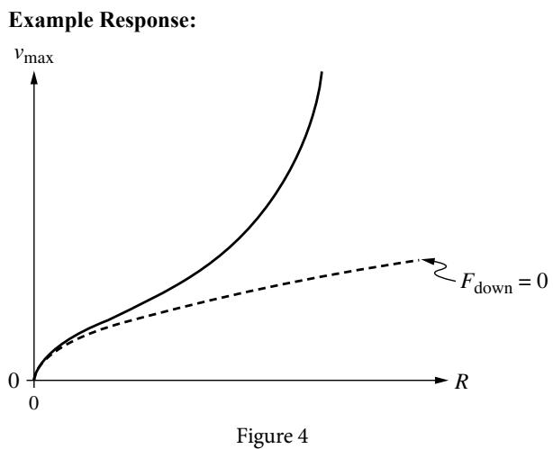</td></tr><tr><td></td><td>Total for part C</td><td>3 points</td></tr><tr><td rowspan="4">D.</td><td>For indicating that the maximum speed before slipping is either greatest when the car and wind travel in opposite directions, or equivalently, least when the car and wind travel in the same direction.</td><td>1 point</td></tr><tr><td>For a justification that correctly relates average speed to the time taken to travel between two points</td><td>1 point</td></tr><tr><td>Example Response:The relative speed between the car and the air is greater when the car is moving into the wind between Point A and Point B, so the downward force and maximum speed are greater as well. Since the car can go faster between points A and B than between points B and C, the car spends less time between points A and B. Therefore ΔtAB&lt;ΔtBC.</td><td>1 point</td></tr><tr><td>Total for part D</td><td>2 points</td></tr><tr><td></td><td>Total for Question 2</td><td>12 points</td></tr><tr><td colspan="2">Scoring Guidelines for Question 3: Experimental Design and Analysis</td><td>10 points</td></tr><tr><td>Learning Objectives:</td><td>2.1.B 3.1.A 3.4.B 3.4.C 4.2.B 4.4.A</td><td></td></tr><tr><td>A. i.</td><td>For measuring the speed of Cart 1 before the collision and both carts after the collision.</td><td>1 point</td></tr><tr><td rowspan="7">ii.</td><td>For repeating the experiment for a range of initial velocities of Cart 1.</td><td rowspan="2">1 point</td></tr><tr><td>Scoring Note: While best practice encourages students to also perform multiple trials using the same  $v_0$ , these measurements are not required to earn this point.</td></tr><tr><td>Example Response:</td><td></td></tr><tr><td>1. Position motion sensors at each end of the track.</td><td></td></tr><tr><td>2. Use the motion sensors to measure the initial speed of Cart 1 and the final speeds of both carts.</td><td></td></tr><tr><td>Repeat steps 1 and 2 for multiple values of  $v_0$ </td><td></td></tr><tr><td>Total for part A</td><td>2 points</td></tr><tr><td rowspan="3">B. i.</td><td>For indicating that the students should graph  $K_{\text{total},f}$  as a function of  $K_{\text{total},i}$ .</td><td>1 point</td></tr><tr><td>Example Response:</td><td></td></tr><tr><td>Use the masses and speeds of the carts before and after the collision to calculate the total energy of the two carts before ( $K_{\text{total},i}$ ) and after ( $K_{\text{total},f}$ ) the collision. Then graph final kinetic energy as a function of initial kinetic energy.</td><td></td></tr><tr><td rowspan="4">ii.</td><td>For using the ratio between the initial and final kinetic energies of the system to determine if the ratio  $\frac{K_{\text{total},f}}{K_{\text{total},i}}$  changes at different values of  $v_0$ </td><td>1 point</td></tr><tr><td>Example Response</td><td></td></tr><tr><td>The ratio  $\frac{K_{\text{total},f}}{K_{\text{total},i}}$  is equal to the slope of a line of best fit for this graph. If the data is linear, then the ratio is constant for all values of  $v_0$ .</td><td></td></tr><tr><td>Total for part B</td><td>2 points</td></tr><tr><td rowspan="4">C. i.</td><td>For indicating on the axes of the graph, two quantities that have a linear relation and can be used to determine the impulse delivered by the impulse device</td><td>1 point</td></tr><tr><td>Examples of acceptable responses include:</td><td></td></tr><tr><td> $\frac{1}{M_{1,B}}$  and  $\sqrt{h}$  (on either axis)</td><td></td></tr><tr><td> $M_{1,B}^2$  and  $\frac{1}{h}$  (on either axis)</td><td></td></tr><tr><td rowspan="2">ii.</td><td>For labeling axes correctly (including units) with a linear scale.</td><td>1 point</td></tr><tr><td>For correctly plotted points.</td><td>1 point</td></tr><tr><td>iii.</td><td>For drawing a line that approximates the trend of the data</td><td>1 point</td></tr></table>

Example Response:

<table><tr><td>Trial Number</td><td>Total Mass  $M_{1,B}$  of block-Cart 1 (kg)</td><td>Maximum Height h (m)</td><td> $1/M_{1,B}$  $\left(\mathrm{kg}^{-1}\right)$ </td><td> $\sqrt{h}$  $\left(\sqrt{\mathrm{m}}\right)$ </td><td></td></tr><tr><td>1</td><td>0.100</td><td>0.395</td><td>10</td><td>0.628</td><td></td></tr><tr><td>2</td><td>0.150</td><td>0.160</td><td>6.67</td><td>0.4</td><td></td></tr><tr><td>3</td><td>0.250</td><td>0.070</td><td>4</td><td>0.265</td><td></td></tr><tr><td>4</td><td>0.350</td><td>0.035</td><td>2.85</td><td>0.187</td><td></td></tr><tr><td>5</td><td>0.500</td><td>0.015</td><td>2</td><td>0.122</td><td></td></tr></table>

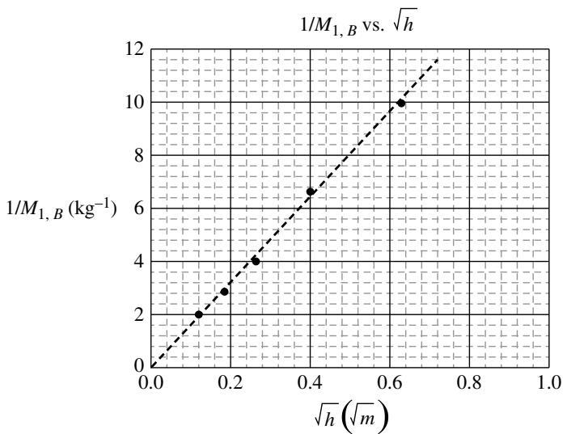

<table><tr><td></td><td>Total for part C</td><td>4 points</td></tr><tr><td rowspan="13">D.</td><td>For correctly relating the slope of the graphed line to the impulse</td><td>1 point</td></tr><tr><td>For a value of the impulse delivered by the impulse device that is between 0.24 N·s and 0.30 N·s</td><td>1 point</td></tr><tr><td colspan="2">Example Response</td></tr><tr><td> $J = \Delta p$ </td><td></td></tr><tr><td> $J = M_{1,B} v_0$ </td><td></td></tr><tr><td> $v_0 = \sqrt{2gh}$ </td><td></td></tr><tr><td> $J = M_{1,B} \sqrt{2gh}$ </td><td></td></tr><tr><td> $\frac{1}{M_{1,B}} = \frac{\sqrt{2g}}{J} \sqrt{h}$ </td><td></td></tr><tr><td>slope =  $\frac{\sqrt{2g}}{J}$ </td><td></td></tr><tr><td> $J = \frac{\sqrt{2g}}{slope}$ </td><td></td></tr><tr><td> $J = \frac{\sqrt{2g}}{16.16} = 0.27 \text{ N} \cdot \text{s}$ </td><td></td></tr><tr><td>Total for part D</td><td>2 points</td></tr><tr><td>Total for Question 3</td><td>10 points</td></tr></table>