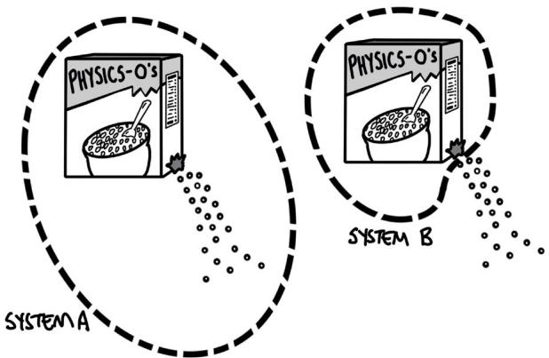
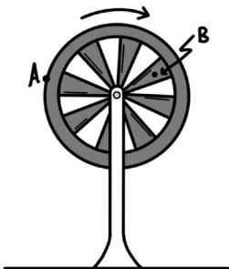
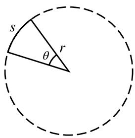
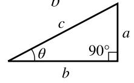

<table><tr><td colspan="2">Scoring Guidelines for Question 4: Qualitative/Quantitative Translation</td><td>8 points</td></tr><tr><td>Learning Objectives:</td><td>1.3.A 3.4.B 5.4.A 5.6.A 5.4.B 6.1.A</td><td></td></tr><tr><td colspan="2">A. For a correct ranking:Solid Sphere, Hollow Sphere, Hoop</td><td>1 point</td></tr><tr><td colspan="2">For a justification that includes one of the following:Relating the amount of potential energy transformed into rotational kinetic energy to the rotational inertia of the shapeRelating the time the shapes take to reach the bottom of the ramp to rotational inertia</td><td>1 point</td></tr><tr><td colspan="2">For a justification that includes one of the following:Relating the amount of translational kinetic energy of the shape to the speed of the shape at the bottom of the rampRelating torque exerted on and angular acceleration of the shape to the time the shapes take to reach the bottom of the ramp</td><td>1 point</td></tr><tr><td colspan="2">Example Response:Solid Sphere, Hollow Sphere, HoopThe more rotational inertia the object has, the more gravitational potential energy is converted into rotational kinetic energy, leaving less translational kinetic energy. The least kinetic energy will move the slowest and reach the bottom of the ramp last. Because an object&#x27;s rotational inertia is related to the average distance of the object&#x27;s mass from its rotational axis, the hoop will move the slowest and the solid sphere the fastest.</td><td></td></tr><tr><td colspan="2">Total for part A</td><td>3 points</td></tr><tr><td colspan="2">B. For a multistep derivation that uses Newton&#x27;s second law in rotational form to determine a translational acceleration $\tau_{\text{net}} = I\alpha$  $\alpha = \frac{a}{R}$ </td><td>1 point</td></tr><tr><td colspan="2">For a net torque and rotational inertia of the sphere that are consistent with the chosen axis of rotation about which to analyze the motion of the sphere: $MgR\sin\theta = (I + MR^2)\alpha$  (gravity exerts a torque on the sphere about the point of contact between the sphere and ramp)OR $F_f R = I\alpha$  and  $Mg\sin\theta - F_f = Ma$  (friction exerts a torque on the sphere about the sphere&#x27;s center of mass)Scoring Note:A derivation that correctly applies conservation of energy can earn points 1 and 2.</td><td>1 point</td></tr><tr><td colspan="2">For using an appropriate equation that relates translational acceleration, distance, and time $x = x_0 + v_0t + \frac{1}{2}at^2$ </td><td>1 point</td></tr></table>

Example Response:

$$
\tau_ {\mathrm{net}} = I \alpha
$$

$$
M g R \sin \theta = (I + M R ^ {2}) \alpha
$$

$$
M g R \sin \theta = (I + M R ^ {2}) \left(\frac {a}{R}\right)
$$

$$
a = \frac {M g R ^ {2} \sin \theta}{I + M R ^ {2}}
$$

$$
x = x _ {0} + v _ {0} t + \frac {1}{2} a t ^ {2}
$$

$$
L = \frac {1}{2} \left(\frac {M g R ^ {2} \sin \theta}{I + M R ^ {2}}\right) t ^ {2}
$$

$$
t = \sqrt {\frac {2 L (I + M R ^ {2})}{M g R ^ {2} \sin \theta}}
$$

C. For correctly relating the amount of rotational inertia of the shell to the time for the shell to roll down the ramp 1 point For indicating that the liquid-filled sphere will have a smaller rotational inertia than the solid sphere because less 1 point mass is rotating as the liquid-filled sphere rolls down the ramp

## Example Response:

Because the angle, length of the ramp, mass, and radius of the shell is the same as the solid sphere, the derivation in part B indicates the time to roll down the ramp will only change if the rotational inertia changes. The liquid filled sphere must have a smaller rotational inertia because less mass will rotate as the sphere rolls down the ramp. Therefore t will be smaller because I is smaller.

Total for part C

THIS PAGE IS INTENTIONALLY LEFT BLANK.

## AP PHYSICS C: MECHANICS dp Appendix dt

# Vocabulary and Definitions of Important Ideas in AP Physics

## Vocabulary and Word Choice in AP Physics

The discussions below are included to elaborate on the choice of words and vocabulary used within AP Physics. Many of these words, when used in the context of AP Physics,haveveryspecificandintentionalmeanings. Theintentionaluseofcertainwordswithinspecific contextscanhaveasignificantimpactonstudent understanding as well as their ability to communicate that understanding with others.

The AP Physics Exam will NOT directly assess student understandingofphysicsvocabulary.For instance, students will not be asked to identify the correctdefinitionofacceleration,orthediference between a system and an object. Students will be expectedtousethesedefinitionsincontextually appropriatesituations.Descriptionsanddefinitions, found in the appendix, are intended to be used as starting points for discussions and are included to help students be more conscientious about the languagetheyusetodescribeascenario—thattheyare inherently thinking more about the underlying principles and ideas that apply to that scenario. This can lead to a deeper and more robust understanding of the course content.

Ofteninphysicscontexts,wordshavespecific meaningsandareuseddiferentlythanincolloquial conversation. Common examples of words that have specificphysicsdefinitionsincludeobject,system, momentum, and work. Students need to be aware of these subtleties, so that they can communicate appropriately about the details of a scenario. Ultimately, the language used to describe the natural world can be very important when helping students build understanding of physics concepts in measured and intentional increments.

## Models

A PHYSICAL, MATHEMATICAL, OR CONCEPTUAL REPRESENTATION OF A SYSTEM OF IDEAS, EVENTS, OR PROCESSES. Ascientificmodelcanbethoughtofasthesetofrules that describe a physical phenomenon. The model sets out the boundaries within which the scientist will consider that phenomenon. Typically, these boundaries simplify a complex scenario to make the analysis and description of that scenario easier and more accessible, particularly to students just beginning their studies in physics.

Consider perhaps the most common example of an introductory physics problem: “A block is at rest at the top of an inclined plane. Determine the speed of a block at the bottom of the inclined plane.” What should students consider in their calculations? What model of the block/incline/earth should students use to describe this situation? To describe the subtleties of the scenario, students would need to consider friction and airresistance;theslightincreaseingravitationalfield as the block slides downward; and the loss of energy to vibrations, sound, and thermal energy. Does the coeficientoffrictiondecreaseslightlyastheabrasion between the block and incline subtly smooths the surfaces? Should the density, temperature, and relative humidity of the air be considered? Clearly, the physics ofevensuchastraightforwardexampleofablock-on-aramp can raise many questions to be considered.

Therefore, in introductory physics courses, phenomena aretypicallyanalyzedinthemostbasicconditions, usingthemostsimplifiedmodels.Thisallowsstudents to focus on big concepts and ideas, before exploring more complex models that include more detailed considerations. For example, when modeling Earth, we typically consider it to be uniform density, spherical, and an inertial frame of reference, even though none of those properties are completely accurate. Most often,

onlygravitationalefectsfromtheSunareconsidered. EventidalefectsfromtheMoonareonlyconsidered after introductory courses. This spherical, uniform descriptionofEarthisasimplifiedmodelthatisused to focus on bigger concepts without getting stuck with extraneousdetailsandnuance.Intheearlierblockon-a-rampexample,virtuallyalloftheefectslisted are considered negligible and are ignored in favor of obtaining an answer that is within the level of accuracy needed for the course. The mathematics required to describetheseefectstendstogetcomplexquickly.It is important, however, that students understand they areusingasimplifiedmodelsothatlaterextensionscan beaddedinthecontextofrefiningthemodel—anormal scientificprocess.

The models chosen to simplify the universe have been done so with alignment to their respective AP Physics courses. These models are elaborated on within the boundary statements provided in the course frameworks, as well as in the conventions for the AP Exams, listed on the equation sheets. While nuances of these models are described in detail within each course’s course framework, these models can be summarizedasfollows.

Unless otherwise stated, students may assume that:

§ Frames of reference are inertial.

§ Air resistance is negligible.

§ Drag forces are negligible.

§ Edgeefectsofchargedplatesarenegligible.

§ Strings, springs, and pulleys are ideal.

## Representations

A METHOD OF UNDERSTANDING AND COMMUNICATING UNDERSTANDINGS ABOUT PHYSICS.

Once deciding on the boundaries of a model, scientists must decide how to communicate those boundaries to others. A representation is a depiction of a model or aspects of that model. Representations can take many forms, and scientists are consistently developing new representations.

Representations that are frequently used within AP Physics C: Mechanics include (but are not limited to):

§ Written descriptions

§ Drawings and pictures

§ Diagrams or schematics

§ Mathematical equations or sets of equations

§ Graphs and data tables

§ Charts

§ Motion maps

§ Energy bar charts

§ Momentum charts

§ Free-bodydiagrams

§ Force diagrams

Studentswillbenefitfromfamiliaritywithasmany diferentrepresentationsaspossible.Whatmakes a concept or idea clear to one student using one representation may not be clear to another. The more methods that students are given to access and describe content, the more likely they are to use those descriptions. The depth to which a student understands course content is related to the variety of representations with which that student can communicate their knowledge. True understanding is demonstratedthroughtheabilitytousemanydiferent representationsinmanydiferentsituations.Tothis end, the AP Physics C: Mechanics Exam will use many representations, as well as require students to create many representations.

## Objects

## A PHYSICAL THING WHERE THE INTERNALSTRUCTURE AND PROPERTIES OF THE THINGARE IGNORED.

Whether it be a cow, the Earth, a car, or pencil, the objectmodeloftheseentitieshasaveryspecific meaning. Within the context of AP Physics, using the word “object” denotes some key characteristics, and is used, as most models are, to simplify the analysis and descriptions of the interactions between two or more masses. Most notably, an object has no interna structure or surface properties. An object can be considered as a collection of atoms or molecules that stick together in a functional way. A person could imagine handling an object, picking it up, as though the object had no internal structure.

Consider a truck. Most often, it’s simply “a truck.” The user of the truck does not consider the multitude of components that make a truck a truck: the engine, the doors and windows, the wheels, the frame, the radio, the suspension, and so on. The user treats the truck as a single object, neglecting the constituent parts and structure of the truck itself.

Similartoawell-packedbox,anobjectistreatedthe samefromdiferentperspectives.Thetruckisatruck if viewed from the top, bottom, or side. However, when carrying a load of unsecured bricks, the object model of thetruckmaynotbesuficient.Themotionofthebricks withinthetruckmayafectthebehaviorofthetruck itself.Suddenaccelerations—inanydirection—may havesignificantefectsonhowthetruckbehaves.

Furthermore, using the object model ignores the physicalsizeoftheobjectitself.Objectscannotbe compressed, twisted, or rotated because the physical dimensions of the object are ignored. When considering a truck as an object, there would be no need to make the distinction between the front, back, or sides of the truck. However, in the physical world, pushing the top of atruckhasadiferentefectthanpushingthebottomor middle of the truck. If the truck is modeled as an object, theseefectsareignored;thelocationoftheapplication of the force is not considered.

A notable discussion of some nuances of the object modelcanbefoundwhenanalyzingfriction.Friction,by definition,istheinteractionoftwoobjectsinphysical contact with each other. The amount of friction is inherently tied to the structure and properties of those objects. For instance, two wooden blocks will slideacrosseachotherdiferentlyiftheyarecovered with sandpaper than if they are covered in grease. The surfaces of the blocks matter when it comes to describing their interactions. However, the blocks may still be treated as objects because the force of friction exerted on one block by the other block does not dependonthesizeorshapeoftheblocks.Theamount of area of the blocks that are in contact with each other does not change the force of friction, and so the blocks may still be modeled as objects.

The object model is used throughout AP Physics C: Mechanics to simplify the analysis of most phenomena. An “object” can be anything because what the object is is not important to the analysis. The properties thatmattertotheanalysis—themassoftheobject, thecoeficientoffrictionbetweentheobjectanda surface,thespeedoftheobject,andsoon—canbe used to describe any number of physical things. In this case, it is up to the student to create their own mental representation of the situation.

## Systems

## A COLLECTION OF OBJECTS THAT ARE ANALYZED TOGETHER.

A system is how a physicist chooses to group objects togethertoanalyzeagivenscenario.Asstudentsgain a deeper understanding of physics concepts, they will noticethathowsystemsarechosencansignificantly simplify(orsignificantlycomplicate)theanalysisofa problem. There is no single right or wrong way to group objects, but often the preferred method is to choose a systemthatsimplifiestheanalysis.

Note that in special cases, a system can itself be reduced to a single object. This can happen when the behaviors and interactions of the individual parts of thesystemdonotafectthebehaviororanalysisof the system as a whole. Consider a box of cereal. In reality, this is a very complex system. A cardboard box, a plastic bag, and a large number of pieces of cereal within. However, the complex motion of the pieces of cereal within the box are not important to consider when handling the box of cereal. Therefore, the entire box–bag–cereal system can itself be considered as a single object.

Unless the system is chosen to be the entire observable universe (which would require an exceedingly complex analysis), a small group of objects chosen to be a system will exist as part of a larger local environment. The system as a whole then may interact with that environment. Consider the box of cereal above. Perhaps the box is torn, and cereal begins to spill. The physicist has a decision to make with regard to their system: continue to include every piece of cereal as part of the system (System A) or consider only the cereal inside the box to be part of the system (System B). See the figurebelow.

AnalyzingSystemAwillbeexceedinglycomplex,as the small pieces of cereal move, bounce, accelerate, and collide with each other and the environment and scatter.AnalyzingSystemBismuchsimpler:theboxis losing mass to the environment, but the box–bag–cereal system may be modeled as a single object that has a changing mass.

## Rigid System

A SYSTEM THAT DOES NOT CHANGE SHAPE, BUT DIFFERENT POINTS WITHIN THE SYSTEM MAY MOVE IN DIFFERENT DIRECTIONS AND WITH DIFFERENT SPEEDS.

Supposeawheelissupportedbyahorizontalaxle, so that the bottom of the wheel is not contacting the ground. While the wheel rotates, all points move together, and the shape of the wheel does not change. Points A and B are marked on the wheel, as shown in the followingfigure.

At any given instant in time, Point A is traveling with a greatertranslationalspeedandinadiferentdirection than Point B. If the rotation of the wheel is relevant to the analysis of the situation, it cannot be modeled as anobjectbecause,bydefinition,theobjectmodeldoes notaccountforthesediferences.Instead,thewheelis modeled as a rigid system.

For a rigid system, the location at which forces are exerted or the location of the point of analysis matters. Pushingonthetopofthewheelwillhaveadiferent efectthanpushingonthebottomofthewheelor pushing directly toward the axle of the wheel. Again, the goals and complexity of the analysis dictates what model to use.

## Constant or Conserved?

The cereal example is a good place to discuss the subtlety between the terms constant and conserved, and how the choice of the system determines whether a quantity is constant or conserved. For the leaking cereal box, the total amount of cereal is conserved,

in both System A and System B. In both choices of system, the total amount of cereal that exists does not change.However,thechoiceofsystemdoesinfluence whether the amount of cereal within that system is constant.Inthefirstchoice,wherethestudentdecides to continue to include each individual piece of cereal as part of the system, even as the cereal spills from the box, the total amount of cereal within the system is constant. In the second choice, where the student decides to only consider the cereal within the box as part of the system, the total amount of cereal within the system decreases, and is not constant. However, thiscerealisstillconserved—thecerealdoesnot simply vanish, disappear, or cease to exist because it is not selected to be part of the system. The cereal is transferred out of the system.

Supposestudentswantedtoanalyzetheenergyofthe box of cereal as it falls toward Earth. In the box–Earth system, total mechanical energy is both conserved and constant. The total amount of energy within the system does not change as the box gains kinetic energy, and the gravitational potential energy of the box–Earth system decreases. However, in a system consisting only of the box, the total amount of energy that system is not constant, but energy is conserved. The kinetic energy of the box increases, but this increase in energy is due to the transfer of energy into the box system by the external force of gravity doing work on the box. The energy transferred into the box by the force of gravity is not“new”energythatwascreatedbygravity—thetotal energy of the universe has remained the same and has been conserved.

THIS PAGE IS INTENTIONALLY LEFT BLANK.

AP PHYSICS C: MECHANICS

# Table of Information: Equations

<table><tr><td>CONSTANTS AND CONVERSION FACTORS</td></tr><tr><td>Universal gravitational constant,  $G = 6.67 \times 10^{-11} \text{ m}^{3}/(\text{kg} \cdot \text{s}^{2}) = 6.67 \times 10^{-11} \text{ N} \cdot \text{m}^{2}/\text{kg}^{2}$ </td></tr><tr><td>Magnitude of the acceleration due to gravity at Earth’s surface,  $g = 9.8 \text{ m/s}^{2}$ </td></tr><tr><td>Magnitude of the gravitational field strength at Earth’s surface,  $g = 9.8 \text{ N/kg}$ </td></tr></table>

<table><tr><td rowspan="4">UNITSYMBOLS</td><td colspan="2">hertz, Hz</td><td colspan="2">newton, N</td></tr><tr><td colspan="2">joule, J</td><td colspan="2">second, s</td></tr><tr><td colspan="2">kilogram, kg</td><td colspan="2">watt, W</td></tr><tr><td colspan="2">meter, m</td><td colspan="2"></td></tr></table>

<table><tr><td colspan="3">PREFIXES</td></tr><tr><td>Factor</td><td>Prefix</td><td>Symbol</td></tr><tr><td> $10^{12}$ </td><td>tera</td><td>T</td></tr><tr><td> $10^9$ </td><td>giga</td><td>G</td></tr><tr><td> $10^6$ </td><td>mega</td><td>M</td></tr><tr><td> $10^3$ </td><td>kilo</td><td>k</td></tr><tr><td> $10^{-2}$ </td><td>centi</td><td>c</td></tr><tr><td> $10^{-3}$ </td><td>milli</td><td>m</td></tr><tr><td> $10^{-6}$ </td><td>micro</td><td>μ</td></tr><tr><td> $10^{-9}$ </td><td>nano</td><td>n</td></tr><tr><td> $10^{-12}$ </td><td>pico</td><td>p</td></tr></table>

<table><tr><td colspan="8">VALUES OF TRIGONOMETRIC FUNCTIONS FOR COMMON ANGLES</td></tr><tr><td>θ</td><td>0°</td><td>30°</td><td>37°</td><td>45°</td><td>53°</td><td>60°</td><td>90°</td></tr><tr><td>sin θ</td><td>0</td><td>1/2</td><td>3/5</td><td> $\sqrt{2}/2$ </td><td>4/5</td><td> $\sqrt{3}/2$ </td><td>1</td></tr><tr><td>cos θ</td><td>1</td><td> $\sqrt{3}/2$ </td><td>4/5</td><td> $\sqrt{2}/2$ </td><td>3/5</td><td>1/2</td><td>0</td></tr><tr><td>tan θ</td><td>0</td><td> $\sqrt{3}/3$ </td><td>3/4</td><td>1</td><td>4/3</td><td> $\sqrt{3}$ </td><td>∞</td></tr></table>

The following conventions are used in this exam.

•	 The frame of reference of any problem is assumed to be inertial unless otherwise stated.

•	 Air resistance is assumed to be negligible unless otherwise stated.

•	 Springs and strings are assumed to be ideal unless otherwise stated.

## MECHANICS

$$
v _ {x} = v _ {x 0} + a _ {x} t
$$

$$
a = \mathrm{acceleration}
$$

$$
a = \mathrm{acceleration}
$$

$$
d = \mathrm{distance}
$$

$$
\omega = \frac {d \theta}{d t}
$$

$$
d = \mathrm{distance}
$$

$$
x = x _ {0} + v _ {x 0} t + \frac {1}{2} a _ {x} t ^ {2}
$$

$$
E = \mathrm{energy}
$$

$$
f = \text { frequency }
$$

$$
f = \text { frequency }
$$

$$
\alpha = \frac {d \omega}{d t}
$$

$$
F = \mathrm{force}
$$

$$
v _ {x} ^ {2} = v _ {x 0} ^ {2} + 2 a _ {x} (x - x _ {0})
$$

$$
F = \mathrm{force}
$$

$$
I = \mathrm{rotationalinertia}
$$

$$
J = \mathrm{impulse}
$$

$$
\Delta x = \int v _ {x} (t) d t
$$

$$
k = \mathrm{springconstant}
$$

$$
\omega = \omega_ {0} + \alpha t
$$

$$
k = \text { spring   constant }
$$

$$
K = \text { kinetic   energy }
$$

$$
K = \mathrm{kineticenergy}
$$

$$
\ell = \text { length }
$$

$$
\Delta v _ {x} = \int a _ {x} (t) d t
$$

$$
\ell = \mathrm{length}
$$

$$
\theta = \theta_ {0} + \omega_ {0} t + \frac {1}{2} \alpha t ^ {2}
$$

$$
L = \mathrm{angularmomentum}
$$

$$
m = \mathrm{mass}
$$

$$
m = \mathrm{mass}
$$

$$
\vec {x} _ {\mathrm{cm}} = \frac {\sum m _ {i} \vec {x} _ {i}}{\sum m _ {i}}
$$

$$
M = \mathrm{mass}
$$

$$
\omega^ {2} = \omega_ {0} ^ {2} + 2 \alpha (\theta - \theta_ {0})
$$

$$
p = \mathrm{momentum}
$$

$$
M = \mathrm{mass}
$$

$$
\nu = r \omega
$$

$$
p = \mathrm{momentum}
$$

$$
P = \text { power }
$$

$$
r = \mathrm{radius}, \mathrm{distance}, \mathrm{or}
$$

$$
a _ {T} = r \alpha
$$

$$
\vec {r} _ {\mathrm{cm}} = \frac {\int \vec {r} d m}{\int d m}
$$

$$
r = \text { radius,   distance,   or   position }
$$

$$
\mathrm{position}
$$

$$
t = \mathrm{time}
$$

$$
\vec {\tau} = \vec {r} \times \vec {F}
$$

$$
t = \mathrm{time}
$$

$$
T = \text { period }
$$

$$
T = \text { period }
$$

$$
I _ {\mathrm{tot}} = \sum I _ {i} = \sum m _ {i} r _ {i} ^ {2}
$$

$$
\lambda = \frac {d}{d \ell} m (\ell)
$$

$$
U = \text { potential   energy }
$$

$$
v = \text { velocity   or   speed }
$$

$$
v = \text { velocity   or   speed }
$$

$$
I = \int r ^ {2} d m
$$

$$
W = \mathrm{work}
$$

$$
\vec {a} _ {\mathrm{sys}} = \frac {\sum \vec {F}}{m _ {\mathrm{sys}}} = \frac {\vec {F} _ {\mathrm{net}}}{m _ {\mathrm{sys}}}
$$

$$
W = \mathrm{work}
$$

$$
x = \text { position   or   distance }
$$

$$
x = \mathrm{positionordistance}
$$

$$
I ^ {\prime} = I _ {\mathrm{cm}} + M d ^ {2}
$$

$$
y = \text { vertical   position }
$$

$$
\alpha = \mathrm{angularacceleration}
$$

$$
\theta = \mathrm{angularposition}
$$

$$
\lambda = \text { linear   mass   density }
$$

$$
\left| \vec {F} _ {g} \right| = G \frac {m _ {1} m _ {2}}{r ^ {2}}
$$

$$
\alpha_ {\mathrm{sys}} = \frac {\Sigma \tau}{I _ {\mathrm{sys}}} = \frac {\tau_ {\mathrm{net}}}{I _ {\mathrm{sys}}}
$$

$$
\tau = \text { torque }
$$

$$
\mu = \mathrm{coefficientoffriction}
$$

$$
\phi = \mathrm{phaseangle}
$$

$$
K _ {\mathrm{rot}} = \frac {1}{2} I \omega^ {2}
$$

$$
\omega = \text { angular   frequency }
$$

$$
\left| \vec {F} _ {f} \right| \leq \left| \mu \vec {F} _ {N} \right|
$$

or angular speed

$$
\vec {F} _ {s} = - k \Delta \vec {x}
$$

$$
W = \int \boldsymbol {\tau} \cdot d \theta
$$

$$
a _ {c} = \frac {v ^ {2}}{r} = r \omega^ {2}
$$

$$
\vec {L} = \vec {r} \times \vec {p} = I \vec {\omega}
$$

$$
T = \frac {1}{f}
$$

$$
\Delta L = \int \tau d t
$$

$$
\Delta x _ {\mathrm{cm}} = r \Delta \theta
$$

$$
K = \frac {1}{2} m v ^ {2}
$$

$$
T = \frac {2 \pi}{\omega} = \frac {1}{f}
$$

$$
W = \int_ {a} ^ {b} \vec {F} \cdot d \vec {r}
$$

$$
P _ {\mathrm{avg}} = \frac {W}{\Delta t} = \frac {\Delta E}{\Delta t}
$$

$$
T _ {s} = 2 \pi \sqrt {\frac {m}{k}}
$$

$$
\Delta K = \sum W _ {i} = \sum F _ {\parallel , i} d _ {i}
$$

$$
\Delta U = - \int_ {a} ^ {b} \vec {F} _ {\mathrm{cf}} (r) \cdot d \vec {r}
$$

$$
P _ {\mathrm{inst}} = \frac {d W}{d t}
$$

$$
T _ {p} = 2 \pi \sqrt {\frac {\ell}{g}}
$$

$$
\vec {p} = m \vec {v}
$$

$$
T _ {\mathrm{phys}} = 2 \pi \sqrt {\frac {I}{m g d}}
$$

$$
F _ {x} = - \frac {d U (x)}{d x}
$$

$$
\vec {F} _ {\mathrm{net}} = \frac {d \vec {p}}{d t}
$$

$$
x = x _ {\mathrm{max}} \cos (\omega t + \phi)
$$

$$
U _ {s} = \frac {1}{2} k (\Delta x) ^ {2}
$$

$$
\vec {J} = \int_ {t _ {1}} ^ {t _ {2}} \vec {F} _ {\mathrm{net}} (t) d t = \Delta \vec {p}
$$

$$
U _ {G} = - G \frac {m _ {1} m _ {2}}{r}
$$

$$
\Delta U _ {g} = m g \Delta y
$$

$$
\vec {v} _ {\mathrm{cm}} = \frac {\sum \vec {p} _ {i}}{\sum m _ {i}} = \frac {\sum m _ {i} \vec {v} _ {i}}{\sum m _ {i}}
$$

## GEOMETRY AND TRIGONOMETRY

$$
A = \mathrm{area}
$$

$$
\mathrm{RightTriangle}
$$

$$
V = \ell w h
$$

$$
A = b h
$$

$$
V = \pi r ^ {2} \ell
$$

$$
A = \frac {1}{2} b h
$$

$$
S = 2 \pi r \ell + 2 \pi r ^ {2}
$$

$$
a ^ {2} + b ^ {2} = c ^ {2}
$$

$$
b = \text { base }
$$

$$
C = \mathrm{circumference}
$$

Sphere

$$
h = \text { height }
$$

$$
\sin \theta = \frac {a}{c}
$$

$$
V = \frac {4}{3} \pi r ^ {3}
$$

$$
\ell = \text { length }
$$

$$
r = \mathrm{radius}
$$

$$
\mathrm{Circle}
$$

$$
S = 4 \pi r ^ {2}
$$

$$
s = \operatorname{arclength}
$$

$$
\cos \theta = \frac {b}{c}
$$

$$
S = \mathrm{surfacearea}
$$

$$
A = \pi r ^ {2}
$$

$$
V = \mathrm{volume}
$$

$$
\tan \theta = \frac {a}{b}
$$

$$
C = 2 \pi r
$$

$$
w = \mathrm{width}
$$

$$
\theta = \mathrm{angle}
$$

$$
s = r \theta
$$

<table><tr><td>VECTORS</td><td>CALCULUS</td><td>IDENTITIES</td></tr><tr><td> $\vec{A} \cdot \vec{B} = AB\cos\theta$  $\left|\vec{A} \times \vec{B}\right| = AB\sin\theta$  $\vec{r} = (A\hat{i} + B\hat{j} + C\hat{k})$  $\vec{C} = \vec{A} + \vec{B}$  $\vec{C} = (A_x + B_x)\hat{i} + (A_y + B_y)\hat{j}$ </td><td> $\frac{df}{dx} = \frac{df}{du}\frac{du}{dx}$  $\frac{d}{dx}(x^n) = nx^{n-1}$  $\frac{d}{dx}(e^{ax}) = ae^{ax}$  $\frac{d}{dx}(\ln ax) = \frac{1}{x}$  $\frac{d}{dx}[\sin(ax)] = a\cos(ax)$  $\frac{d}{dx}[\cos(ax)] = -a\sin(ax)$  $\int x^n dx = \frac{1}{n+1}x^{n+1}, n \ne -1$  $\int e^{ax} dx = \frac{1}{a}e^{ax}$  $\int \frac{dx}{x+a} = \ln |x+a|$  $\int \cos(ax) dx = \frac{1}{a}\sin(ax)$  $\int \sin(ax) dx = -\frac{1}{a}\cos(ax)$ </td><td> $\log(a \cdot b^x) = \log a + x\log b$  $\sin^2\theta + \cos^2\theta = 1$  $\sin(2\theta) = 2\sin\theta\cos\theta$  $\frac{\sin\theta}{\cos\theta} = \tan\theta$ </td></tr></table>

