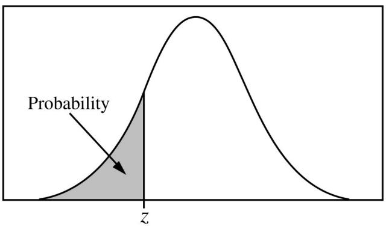
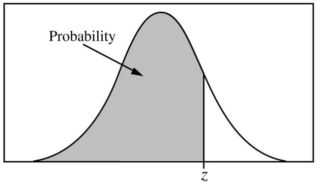
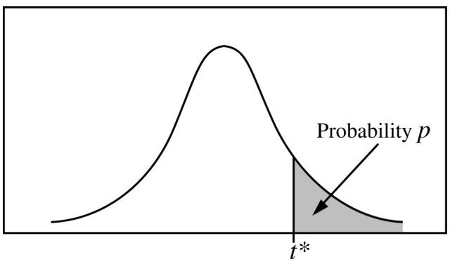
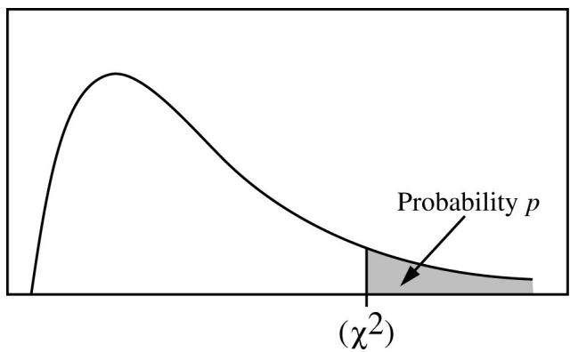

<table><tr><td>Reporting Category</td><td colspan="2">Scoring Criteria</td></tr><tr><td rowspan="4">Part C (ii)(0-1 points)Point 6</td><td>0 pointsDoes not accuratelycomparenumerical representations of data</td><td>1 pointAccurately comparesnumerical representations of data</td></tr><tr><td colspan="2">Decision Rules and Scoring Notes</td></tr><tr><td>Responses that do not earn this point:The response fails to compare the distance from Q1 to the median and the distance from the median to Q3.The response gives incorrect values but does not have any work shown to indicate that this was just a minor mathematical error.</td><td>Responses that earn this point:The response indicates that the distance from Q1 to the median is greater than the distance from the median to Q3.The response indicates that the distance from Q1 to the median is greater than the distance from the median to Q3 but gives incorrect values. However, the work shown indicates that this is a minor mathematical error.</td></tr><tr><td>Examples that do not earn this point:The distance from Q1 to the median is 561, and the distance from the median to Q3 is 297.""The distance from Q1 to the median is 461, and the distance from the median to Q3 is 297." (No work is shown to verify that this was a minor mathematical error.)</td><td>Examples that earn this point:“For the AES encryption method, the distance from Q1 to the median (561) is larger than the distance from the median to Q3 (297).”“For the AES encryption method, the distance from Q1 to the median is larger than the distance from the median to Q3.”“For the AES encryption method, the distance from Q1 to the median (794 - 233 = 461) is larger than the distance from the median to Q3 (1,091 - 794 = 297)." (Work is shown, and 461 is treated as a minor mathematical error.)</td></tr><tr><td rowspan="4">Part C (iii)(0-1 points)Point 7</td><td>0 pointsDoes not accurately explain numerical representations of data</td><td>1 pointAccurately explains numerical representations of data</td></tr><tr><td colspan="2">Decision Rules and Scoring Notes</td></tr><tr><td>Responses that do not earn this point:The response does not accurately explain that the IQR is the best measure of variability for the DES method.The response does not accurately link the comparison of the distances to the shape of the distribution, which will affect the selection of the measure of variability.The response does not give a reason to use the IQR.The response does not refer to the comparisons.</td><td>Responses that earn this point:The response uses the comparison of the distances from Q1 to the median and the median to Q3 to indicate that the IQR is the best measure of variability because it is evident that neither method is symmetric.The response shows evidence that neither method is symmetric, which will affect the selection of the measure of variability.</td></tr><tr><td>Examples that do not earn this point:The best measure of variability to represent both methods is the IQR.""Based on these comparisons, the range is the best measure of variability to represent both methods.""Based on these comparisons, the standard deviation is the best measure of variability to represent both methods.""The shape of the distribution for both methods is fairly symmetric and therefore will need to be considered when Andrea chooses a measure of variability for both methods."</td><td>Examples that earn this point:“Because the distance from Q1 to the median and the distance from the median to Q3 are very different within each distribution, the distributions are likely skewed. Therefore, the IQR is the best measure of variability for both methods.”</td></tr><tr><td rowspan="4">Part D(0-1 points)Point 8</td><td>0 pointsDoes not accurately determine whether a claim is supported or not supported based on statistical results</td><td>1 pointAccurately determines whether a claim is supported or not supported based on statistical results</td></tr><tr><td colspan="2">Decision Rules and Scoring Notes</td></tr><tr><td>Responses that do not earn this point:▪ The response does not accurately determine that Andrea is using the best measure of center.</td><td>Responses that earn this point:▪ The response accurately determines that Andrea is using the best measure of center.</td></tr><tr><td>Examples that do not earn this point:▪ “Neither is correct.”▪ “Both measures of center can be used.”</td><td>Examples that earn this point:▪ “Andrea is correct in using the medians to compare the encryption methods.”</td></tr><tr><td rowspan="4">Part D(0-1 points)Point 9</td><td>0 pointsDoes not accurately justify the answer based on statistical results</td><td>1 pointAccurately justifies the answer based on statistical results</td></tr><tr><td colspan="2">Decision Rules and Scoring Notes</td></tr><tr><td>Responses that do not earn this point:The response does not accurately justify the answer using other parts of the question.The response does not justify the answer using both encryption methods.The response does not discuss that medians are resistant to outliers.</td><td>Responses that earn this point:The response accurately justifies Andrea's use of the medians by noting that both distributions have outliers and/or that the distance from Q1 to the median is very different than the distance from the median to Q3 within each distribution, indicating that the distributions are not symmetric. Therefore, the medians are better because they are resistant to outliers, and the means are not resistant to outliers.</td></tr><tr><td>Examples that do not earn this point:"proof from part B""The mean and the median are different.""The mean and the median are the same.""The medians are better."</td><td>Examples that earn this point:“Both distributions have outliers, which may indicate that the distributions are not symmetric. Therefore, the medians are better because they are resistant to outliers, and the means are not resistant to outliers.""The distance from Q1 to the median is not the same as the distance from the median to Q3 in either distribution, which may indicate that the distributions are not symmetric. Therefore, the medians are better because they are resistant to outliers, and the means are not resistant to outliers.”</td></tr><tr><td rowspan="3">Part E(0-1 points)Point 10</td><td>0 pointsDoes not accurately determine the indicated component for a valid investigative question</td><td>1 pointAccurately determines the indicated component for a valid investigative question</td></tr><tr><td colspan="2">Decision Rules and Scoring Notes</td></tr><tr><td>Responses that do not earn this point:The response does not accurately determine the population.The response does not provide the population.Examples that do not earn this point:“all customers”“all bank customers”</td><td>Responses that earn this point:The response accurately determines that the population for a valid investigative question for Andrea’s study is all the bank’s customers who use the bank’s website.Examples that earn this point:“all the bank’s customers who use the bank’s website”</td></tr></table>

## Question 3: Inference (Hypothesis Test)

## General Scoring Notes

§ Except where otherwise noted, each point of these scoring guidelines is earned independently.

§ The scoring criteria identify the specific components of the model solution that are used to determine the score.

Neil, a marketing director, wanted to compare the efectiveness of two diferent video advertisements designed to persuade people to buy a new laptop. He showed the two advertisements, version A and version B, to diferent groups of people.

The responses from the diferent groups of people were compared to determine which version performs better. Each advertisement contains a unique code that people can text using their cell phones to get more information about the laptop. Neil will use the advertisement that has a higher percentage of people who text that version’s code. If there is no diference in the percentages for the two advertisements, he will use both.

Neil gathered a group of 500 volunteers who were interested in purchasing a laptop. The volunteers were randomly assigned to groups. One group watched version A of the advertisement for the new laptop, and the other group watched version B of the advertisement for the new laptop. For version A, 83 of the 250 volunteers texted the code to get more information. For version B, 54 of the 250 volunteers texted the code to get more information.

At the 0.05 level of significance, complete the appropriate inference procedure to determine if there is convincing statistical evidence of a diference in the proportion of adults similar to those in the study who will watch version A and text the code than the proportion of adults similar to those in the study who will watch version B and text the code.

Use the given information to respond to parts A, B, C, and D.

A. Identify and classify the variable(s) in the study.

B. Identify the appropriate inference procedure.

C. Complete the inference procedure, including calculating the appropriate statistics.

D. Justify a conclusion in context.

## Model Solution

A. The explanatory variable is the version of the commercial viewed and was categorical with categories A and B. The response variable in this study is whether a viewer texts for more information and was categorical: Yes or No.

B. An appropriate inference procedure is a two-sample z-test for the diference between two population proportions.

C. The null hypothesis is $\mathrm { H } _ { 0 } { : } p _ { A } = p _ { B } ,$ and the alternative hypothesis is $\mathrm { H } _ { \mathrm { a } } { : } p _ { A } { \neq } p _ { B } .$ For adults similar to those in the study, let ${ \pmb { \mathit { P } } } _ { A }$ represent the true proportion who will watch version A and text the code for more information, and let $\left. \hat { P } _ { B } \right.$ represent the true proportion who will watch version B and text the code for more information. The randomization condition for performing a two-sample z-test for the diference between two population proportions is satisfied because the volunteers were randomly assigned to Version A or Version B. The values of the sample proportions are $\widehat { \boldsymbol { p } } _ { A } = \frac { 8 3 } { 2 5 0 } = 0 . 3 3 2 , \widehat { \boldsymbol { p } } _ { B } = \frac { 5 4 } { 2 5 0 } = 0 . 2 1 6$ . The combined proportion

is $: \hat { p } _ { c } = \frac { 2 5 0 \big ( 0 . 3 3 2 \big ) + 2 5 0 \big ( 0 . 2 1 6 \big ) } { 2 5 0 + 2 5 0 } = 0 . 2 7 4$ . The normality condition is met because the expected number of successes and failures for both samples are at least 10.

Version A $: 2 5 0 { \bigl ( } 0 . 2 7 4 { \bigr ) } = 6 8 . 5 , 2 5 0 { \bigl ( } 1 - 0 . 2 7 4 { \bigr ) } = 1 8 1 . 5$

Version B: $2 5 0 { \big ( } 0 . 2 7 4 { \big ) } = 6 8 . 5 , 2 5 0 { \big ( } 1 - 0 . 2 7 4 { \big ) } = 1 8 1 . 5$

The value of the test statistic is $z = { \frac { 0 . 3 3 2 - 0 . 2 1 6 } { \sqrt { 0 . 2 7 4 { \left( 1 - 0 . 2 7 4 \right) } } \sqrt { \frac { 1 } { 2 5 0 } } + { \frac { 1 } { 2 5 0 } } } } = 2 . 9 1$ , and the p-value is 0.0036.

D. Because this p-value of 0.0036 is less than $\alpha = 0 . 0 5$ significance level, the null hypothesis should be rejected. There is convincing statistical evidence to conclude that there is a diference in the proportion of adults similar to those in the study who will watch version A and text the code for more information and the proportion of adults similar to those in the study who will watch version B and text the code for more information.

<table><tr><td>Reporting Category</td><td colspan="2">Scoring Criteria</td></tr><tr><td rowspan="4">Part AIdentify Variable(0-1 points)Point 1</td><td>0 pointsDoes not accurately identify the relevant information</td><td>1 pointAccurately identifies the relevant information</td></tr><tr><td colspan="2">Decision Rules and Scoring Notes</td></tr><tr><td>Responses that do not earn this point:The response does not accurately identify the variables used in the study.The response does not provide identification for the variables used in the study.</td><td>Responses that earn this point:The response accurately identifies the explanatory variable as the version of the commercial viewed and the response variable as whether a viewer texts for more information.</td></tr><tr><td>Examples that do not earn this point:"laptop""A and B"</td><td>Examples that earn this point:"version of the commercial and whether a person texts a code"</td></tr><tr><td rowspan="4">Part AClassify Variable(0-1 points)Point 2</td><td>0 pointsDoes not accurately classify the relevant information</td><td>1 pointAccurately classifies the relevant information</td></tr><tr><td colspan="2">Decision Rules and Scoring Notes</td></tr><tr><td>Responses that do not earn this point:The response does not accurately classify the variables used in the study as categorical or qualitative.The response does not provide classification for the variables used in the study.</td><td>Responses that earn this point:The response accurately classifies the variables used in the study as categorical or qualitative.</td></tr><tr><td>Examples that do not earn this point:“Both are quantitative.”</td><td>Examples that earn this point:“Both are qualitative.”“Both are categorical.”</td></tr><tr><td rowspan="4">Part BIdentify Procedure(0-1 points)Point 3</td><td>0 pointsDoes not accurately identify the appropriate inference procedure</td><td>1 pointAccurately identifies the appropriate inference procedure</td></tr><tr><td colspan="2">Decision Rules and Scoring Notes</td></tr><tr><td>Responses that do not earn this point:The response identifies the incorrect inference procedure.The response does not accurately name the correct inference procedure.The response identifies the correct test by name but also includes an incorrect formula.The response identifies the test by formula using a t-statistic instead of a z-test statistic.The response does not provide an inference procedure name or formula.</td><td>Responses that earn this point:The response accurately describes the inference procedure as a two-sample z-test for the difference between two population proportions.The response accurately provides the formula for a two-sample z-test for the difference between two population proportions. $z = \frac{(\hat{p}_1 - \hat{p}_2) - 0}{\sqrt{\hat{p}_c(1 - \hat{p}_c)}\sqrt{\frac{1}{n_1} + \frac{1}{n_2}}}$ </td></tr><tr><td>Examples that do not earn this point:"test for two population proportions"two-proportion z-interval"2 z-test"two-sample z-test"</td><td>Examples that earn this point:"two sample z-test for population proportions""two-sample z-test difference between two population proportions"" $z = \frac{(\hat{p}_1 - \hat{p}_2) - 0}{\sqrt{\hat{p}_c(1 - \hat{p}_c)}\sqrt{\frac{1}{n_1} + \frac{1}{n_2}}}$ "</td></tr><tr><td rowspan="4">Part CHypotheses(0-1 points)Point 4</td><td>0 pointsDoes not accurately identify the null and alternative hypotheses</td><td>1 pointAccurately identifies the null and alternative hypotheses</td></tr><tr><td colspan="2">Decision Rules and Scoring Notes</td></tr><tr><td>Responses that do not earn this point:The response identifies the incorrect null and/or alternative hypotheses.The response is not stated in terms of the proportions.The response only provides one hypothesis.The response does not provide both hypotheses.</td><td>Responses that earn this point:The response identifies the null hypothesis as  $H_0: p_A = p_B$  and the alternative hypothesis as  $H_a: p_A \neq p_B$ .</td></tr><tr><td>Examples that do not earn this point:" $H_0: p_A \neq p_B$  and  $H_a: p_A = p_B$ "The null hypothesis is that the proportion subscript A does not equal the proportion subscript B, and the proportion subscript A equals the proportion subscript B."</td><td>Examples that earn this point:" $H_0: p_A = p_B$  and  $H_a: p_A \neq p_B$ "The null hypothesis is that the proportion subscript A equals the proportion subscript B, and the alternative hypothesis is that the proportion subscript A does not equal the proportion subscript B."</td></tr><tr><td rowspan="4">Part CParameter or Population(0-1 points)Point 5</td><td>0 pointsDoes not accurately identify the population parameter(s)</td><td>1 pointAccurately identifies the population parameter(s)</td></tr><tr><td colspan="2">Decision Rules and Scoring Notes</td></tr><tr><td>Responses that do not earn this point:The response identifies the incorrect parameters.The response is stated in terms of the sample proportions.The response does not provide parameters.The response clearly refers to the sample proportions instead of the population proportions using words or a symbol (e.g.,  $\hat{p}$ ).</td><td>Responses that earn this point:The response identifies the correct parameters in terms of the population proportions.The response that does not clearly indicate a population proportion in the parameter identification may satisfy the population aspect by clearly referring to the population in the justification (Part D Point 10).</td></tr><tr><td>Examples that do not earn this point:The parameter,  $\hat{p}$ , represents the proportion.""The parameter,  $p$ , represents the sample proportion.""Let  $\hat{p}_{A}$  represent the proportion of people who watched version A and texted the code for more information, and let  $\hat{p}_{B}$  represent the proportion of people who watched version B and texted the code for more information."</td><td>Examples that earn this point:“For adults similar to those in the study, let  $p_{A}$  represent the population proportion of adults who will watch version A and text the code for more information, and let  $p_{B}$  represent the population proportion of adults who will watch version B and text the code for more information.”</td></tr><tr><td rowspan="4">Part CRandomization and 10% Conditions(0-1 points)Point 6</td><td>0 pointsDoes not accurately justify whether the randomization condition and 10% condition are met</td><td>1 pointAccurately justifies whether the randomization condition and 10% condition are met</td></tr><tr><td colspan="2">Decision Rules and Scoring Notes</td></tr><tr><td>Responses that do not earn this point:The response only responds with random check.The response implies that random assignment was used.</td><td>Responses that earn this point:The response accurately justifies that the randomization condition is met because volunteers were randomly assigned to version A or version B.</td></tr><tr><td>Examples that do not earn this point:"random check""random assignment"</td><td>Examples that earn this point:"The volunteers were randomly assigned to version A or version B."</td></tr><tr><td rowspan="4">Part CNormality or Expected Counts Conditions(0-1 points)Point 7</td><td>0 pointsDoes not accurately justify whether the normality condition is met</td><td>1 pointAccurately justifies whether the normality condition is met</td></tr><tr><td colspan="2">Decision Rules and Scoring Notes</td></tr><tr><td>Responses that do not earn this point:The response checks any inappropriate condition, such as n &gt;30.The response states that, according to the central limit theorem (CLT), the sampling distribution is approximately normal.The response does not provide the normality condition.</td><td>Responses that earn this point:The response accurately justifies that the normality condition is met using a pooled p-hat because expected successes and failures for both samples are at least 10.Version A: 250(0.274) = 68.5,250(1 - 0.274) = 181.5Version B: 250(0.274) = 68.5,250(1 - 0.274) = 181.5The response accurately justifies that the normality condition is met using a non-pooled p-hat because observed successes and failures for both samples are at least 10.Version A: 250(0.332) = 83,250(1 - 0.332) = 167Version B: 250(0.216) = 54,250(1 - 0.216) = 196</td></tr><tr><td>Examples that do not earn this point:"Because np ≥ 5 and n(1 - p) ≥ 5, the sampling distribution is approximately normal.""Because np ≥ 10 and n(1 - p) ≥ 10, the sampling distribution is approximately normal.""n &gt;30""According to the central limit theorem (CLT), the sampling distribution is approximately normal."</td><td>Examples that earn this point"The normality condition is met because the expected number of successes and failures for both samples are at least 10.250(0.274) = 68.5,250(1 - 0.274) = 181.5.""The normality condition is met because the observed number of successes and failures for both samples are at least 10.Version A: 250(0.332) = 83,250(1 - 0.332) = 167Version B: 250(0.216) = 54,250(1 - 0.216) = 196"</td></tr><tr><td rowspan="4">Part CTest Statistics and p-Value(0-1 points)Point 8</td><td>0 pointsDoes not accurately calculate the results for the appropriate statistical inference method</td><td>1 pointAccurately calculates the results for the appropriate statistical inference method</td></tr><tr><td colspan="2">Decision Rules and Scoring Notes</td></tr><tr><td>Responses that do not earn this point:The response does not accurately calculate the z-statistic and/or p-value, and supporting work is not shown to indicate a minor calculation error.The response does not provide the z-statistic and/or p-value.</td><td>Responses that earn this point:The response accurately reports the z-statistic as 2.91 and the p-value as 0.0036.Supporting work for the correct p-value is considered extraneous and can be ignored.An arithmetic or transcription error in a response can be ignored if correct work is shown.</td></tr><tr><td>Examples that do not earn this point:The z-statistic is 3, and the p-value is less than 1.""The z-statistic is 2.89, and the p-value is 0."</td><td>Examples that earn this point:The z-statistic is 2.91, and the p-value is 0.0036.""The value of the test statistic is $z = \frac{0.332 - 0.216}{\sqrt{0.27(1 - 0.27)}\sqrt{\frac{1}{250} + \frac{1}{250}}} = 2.91$ and the p-value is 0.0036.""The value of the test statistic is $z = \frac{0.332 - 0.216}{\sqrt{\frac{(0.332)(1 - 0.332)}{250} + \frac{(0.216)(1 - 0.216)}{250}}} = 2.93$ and the p-value is 0.0034."</td></tr><tr><td rowspan="4">Part Dp-Value to the Level of Significance Comparison(0-1 points)Point 9</td><td>0 pointsDoes not accuratelydeterminethe results from a comparison of the p-value to the level of significance</td><td>1 pointAccuratelydeterminesthe results from a comparison of the p-value to the level of significance</td></tr><tr><td colspan="2">Decision Rules and Scoring Notes</td></tr><tr><td>Responses that do not earn this point:The response does not accurately compare the p-value to the level of significance.The response does not include values for the p-value and the level of significance.The response does not accurately conclude the formal decision about the null hypothesis based on the comparison of the p-value to the level of significance.The response includes an incorrect p-value for the comparison.The response does not compare the p-value to the level of significance.</td><td>Responses that earn this point:The response compares the correct p-value and the level of significance with a formal decision about the null hypothesis.The response compares the correct p-value with a formal decision about the null hypothesis and the incorrect, consistently used level of significance.</td></tr><tr><td>Examples that do not earn this point:"p is less than alpha.""0.0036 &gt;0.05""0.0036 &gt;0.05, fail to reject the null hypothesis"</td><td>Examples that earn this point:The p-value of 0.0036 is &lt; alpha of 0.05, so the null hypothesis should be rejected.""0.0036 &lt; 0.05. Therefore, the null should be rejected.""Because the p-value (0.0036) is less than the level of significance (0.05), reject H0."</td></tr><tr><td rowspan="4">Part DJustification(0-1 points)Point 10</td><td>0 pointsDoes not accurately justify whether a claim is supported or not supported based on statistical calculations and results</td><td>1 pointAccurately justifies whether a claim is supported or not supported based on statistical calculations and results</td></tr><tr><td colspan="2">Decision Rules and Scoring Notes</td></tr><tr><td>Responses that do not earn this point:The response does not include wording that there is supporting evidence.The response does not include the alternative hypothesis.</td><td>Responses that earn this point:The response indicates there is enough statistical evidence to conclude that there is a difference in the proportion of adults similar to those in the study who will watch version A and text the code for more information and the proportion of adults similar to those in the study who will watch version B and text the code for more information.</td></tr><tr><td>Examples that do not earn this point:“There is no difference in the percentage of people who watched version A and texted the code for more information and the percentage of people who watched version B and texted the code for more information.“The test supports Neil’s claim.”</td><td>Examples that earn this point:“There is convincing statistical evidence of a difference in the proportion of adults similar to those in the study who will watch version A and text the code for more information and the proportion of adults similar to those in the study who will watch version B and text the code for more information.”</td></tr></table>

## Question 4: Multi-Focus on Practices 2, 3, and 4

10 points

## General Scoring Notes

§ Except where otherwise noted, each point of these scoring guidelines is earned independently.

§ The scoring criteria identify the specific components of the model solution that are used to determine the score.

According to a 2024 national survey of 400 randomly selected ofices in a certain country, the average number of water bottle refilling stations was 2.6 with a standard deviation of 1.6 stations. Erika is a marketer at a water bottle company, and she wants to investigate whether the average number of refilling stations per ofice has changed from 2024 to 2025. In 2025, she selected a random sample of 350 ofices in the country and asked how many refilling stations were in each ofice. The results of the 2025 sample are summarized in the table.

Number of Water Bottle Refilling Stations and Proportions of Offices in 2025

<table><tr><td>Number of Refilling Stations</td><td>0</td><td>1</td><td>2</td><td>3</td><td>4</td><td>5</td><td>6</td></tr><tr><td>Proportion of Offices</td><td>0.04</td><td>0.13</td><td>0.21</td><td>0.35</td><td>0.19</td><td>0.05</td><td>0.03</td></tr></table>

Erika also found the standard deviation for the sample to be 1.31 refilling stations.

Use the given information to respond to parts A, B, C, D, and E. Label any subparts (e.g., i and ii) that may be present.

A. Use the table to respond to the following. Show all work for calculations.

i. An ofice from the sample will be selected at random. Calculate the probability that an ofice had 3 or more refilling stations in 2025.

ii. Calculate the average number of refilling stations per ofice for the sample of ofices in 2025.

B. Erika believes that the average number of refilling stations per ofice for the sample of ofices in 2025 has changed compared to the sample of ofices from 2024. Determine whether Erika’s belief is supported by the data. Use the results from part A (ii) to justify your answer without conducting an inference procedure.

C. Erika wants to conduct an inference procedure to estimate the diference in the true mean number of refilling stations per ofice between 2024 and 2025. Identify the appropriate inference procedure Erika should use.

D. Assume the conditions for the inference procedure identified in part C were satisfied and that Erika used a 90% confidence level.

i. Calculate the results from the appropriate inference procedure.

ii. Interpret a conclusion from part D (i) in context.

E. Based on the results from Erika’s inference procedure, determine whether there is suficient statistical evidence of a diference in the true mean number of refilling stations per ofice in the country between 2024 and 2025. Explain your reasoning.

## Model Solution

A.

$$
P (X \geq 3) = 0. 3 5 + 0. 1 9 + 0. 0 5 + 0. 0 3 = 0. 6 2
$$

$$
E (X) = (0 \cdot 0. 0 4) + (1 \cdot 0. 1 3) + (2 \cdot 0. 2 1) + (3 \cdot 0. 3 5) + (4 \cdot 0. 1 9) + (5 \cdot 0. 0 5) + (6 \cdot 0. 0 3) = 2. 7 9
$$

B. There has been a change in the average number of refilling stations per ofice in the country, from 2.6 refilling stations in 2024 to 2.79 refilling stations in 2025.

C. A two-sample t-interval for a diference between two population means

D. Assume the conditions for inference were met for the inference procedure identified in part D.

i. The 90% confidence interval is $\left( - 0 . 3 6 5 , - 0 . 0 1 5 \right)$

ii. Erika is 90% confident that the diference in the true mean number of refilling stations per ofice between 2024 and 2025 falls between −0.365 and −0.015.

E. Based on Erika’s inference procedure, there is suficient statistical evidence of a diference in the true mean number of refilling stations per ofice in the country between 2024 and 2025 because 0 is not in the interval.

<table><tr><td>Reporting Category</td><td colspan="2">Scoring Criteria</td></tr><tr><td rowspan="4">Part A (i)(0-1 points)Point 1</td><td>0 pointsDoes not accurately calculate the value</td><td>1 pointAccurately calculates the value</td></tr><tr><td colspan="2">Decision Rules and Scoring Notes</td></tr><tr><td>Responses that do not earn this point:The response does not accurately calculate the proportion.The response does not provide the proportion.The response states a value of 0.62 but does not show the calculation.</td><td>Responses that earn this point:The response accurately calculates  $P(X \geq 3) = 0.35 + 0.19 + 0.05 + 0.03 = 0.62$ .An arithmetic or transcription error in a response can be ignored if correct work is shown.</td></tr><tr><td>Examples that do not earn this point:"0.62""0.19 + 0.05 + 0.03 = 0.27"</td><td>Examples that earn this point:"0.35 + 0.19 + 0.05 + 0.03 = 0.62""0.35 + 0.19 + 0.05 + 0.03 = 0.61"</td></tr><tr><td rowspan="4">Part A (ii)(0-1 points)Point 2</td><td>0 pointsDoes not accurately calculate the value</td><td>1 pointAccurately calculates the value</td></tr><tr><td colspan="2">Decision Rules and Scoring Notes</td></tr><tr><td>Responses that do not earn this point:The response does not accurately calculate the value.The response does not provide the value.The response states a value of 2.79 but does not show the calculation.</td><td>Responses that earn this point:The response accurately calculates  $E(X) = (0 \cdot 0.04) + (1 \cdot 0.13) + (2 \cdot 0.21) + (3 \cdot 0.35) + (4 \cdot 0.19) + (5 \cdot 0.05) + (6 \cdot 0.03) = 2.79$ .An arithmetic or transcription error in a response can be ignored if correct work is shown.</td></tr><tr><td>Examples that do not earn this point:"2.79"</td><td>Examples that earn this point:“(0·0.04) + (1·0.13) + (2·0.21) + (3·0.35) + (4·0.19) + (5·0.05) + (6·0.03) = 2.79”“(0·0.04) + (1·0.13) + (2·0.21) + (3·0.35) + (4·0.19) + (5·0.05) + (6·0.03) = 2.69”</td></tr><tr><td rowspan="4">Part B(0-1 points)Point 3</td><td>0 pointsDoes not accurately determine whether a claim is supported or not supported based on statistical calculations</td><td>1 pointAccurately determines whether a claim is supported or not supported based on statistical calculations</td></tr><tr><td colspan="2">Decision Rules and Scoring Notes</td></tr><tr><td>Responses that do not earn this point:The response does not indicate that there has been a change in the average number of refilling stations.The response does not indicate that Erika's belief is supported.</td><td>Responses that earn this point:The response indicates that there has been a change in the average number of refilling stations.The response indicates that Erika's belief is supported.</td></tr><tr><td>Examples that do not earn this point:"There is no change in the average number of refilling stations.""There is a decrease in the average number of refilling stations."</td><td>Examples that earn this point:"There has been a change in the average number of refilling stations per office between 2024 and 2025.""Yes, Erika's belief is supported by the data."</td></tr><tr><td rowspan="4">Part B(0-1 points)Point 4</td><td>0 pointsDoes not accurately justify the answer based on statistical calculations</td><td>1 pointAccurately justifies the answer based on statistical calculations</td></tr><tr><td colspan="2">Decision Rules and Scoring Notes</td></tr><tr><td>Responses that do not earn this point:The response does not provide a correct explanation and/or justification with support.The response does not provide any explanation and/or justification with support.</td><td>Responses that earn this point:The response indicates that the average number of refilling stations per office was 2.6 in 2024, which differs from 2.79 in 2025.The response includes 2.79 or the value from part A (ii).</td></tr><tr><td>Examples that do not earn this point:"There is no change in the average number of refilling stations.""There is a decrease in the average number of refilling stations."</td><td>Examples that earn this point:"In 2024, there was an average of 2.6 refilling stations, which differs from an average of 2.79 refilling stations in 2025.""2.79 &gt; 2.6"</td></tr><tr><td rowspan="4">Part C(0-1 points)Point 5</td><td>0 pointsDoes not accurately identify the appropriate inference procedure</td><td>1 pointAccurately identifies the appropriate inference procedure</td></tr><tr><td colspan="2">Decision Rules and Scoring Notes</td></tr><tr><td>Responses that do not earn this point:The response identifies the incorrect inference procedure.The response does not accurately name the correct inference procedure.The response identifies the correct inference procedure by name but also includes an incorrect formula.The response does not provide an inference procedure name or formula.</td><td>Responses that earn this point:The response accurately describes the inference procedure as a two-sample t-interval for a difference between two population means.The response accurately provides the formula for a two-sample t-interval for a difference between two population means. $\left(\overline{x}_1 - \overline{x}_2\right) \pm t^* \sqrt{\frac{s_1^2 + s_2^2}{n_1 + n_2}}$  (2.6 - 2.79) ± 1.645 $\sqrt{\frac{1.6^2}{400} + \frac{1.31^2}{350}}$ </td></tr><tr><td>Examples that do not earn this point:"A one-sample t-test for the population mean difference""A two-sample z-interval for a difference between two population means"</td><td>Examples that earn this point:"A two-sample t-interval for a difference between two population means"" $\left(\overline{x}_1 - \overline{x}_2\right) \pm t^* \sqrt{\frac{s_1^2 + s_2^2}{n_1 + n_2}}$  "  $(2.6 - 2.79) \pm 1.645 \sqrt{\frac{1.6^2}{400} + \frac{1.31^2}{350}}$  "</td></tr><tr><td rowspan="5">Part D (i)(0-1 points)Point 6</td><td>0 pointsDoes not accurately calculate the results for the appropriate statistical inference method</td><td>1 pointAccurately calculates the results for the appropriate statistical inference method</td></tr><tr><td colspan="2">Decision Rules and Scoring Notes</td></tr><tr><td>Responses that do not earn this point:The response does not accurately calculate the t-interval for a difference between two population means.The response does not provide a t-interval for a difference between two population means.The response provides the correct interval but specifies it as a z-interval (unless the test named in part C was a two-sample z-interval).</td><td>Responses that earn this point:The response accurately reports the correct values for the t-interval for a difference between two population means as  $(-0.365, -0.015)$ . $(2.6 - 2.79) \pm 1.645 \sqrt{\frac{1.6^2}{400} + \frac{1.31^2}{350}}$  $= (-0.365, -0.015)$ ,with df = 744.782.The response has a slightly different interval because the degrees of freedom used was more conservative, such as df = 349.An arithmetic or transcription error in a response can be ignored if correct work is shown.</td></tr><tr><td>Examples that do not earn this point:"The z-interval is  $(-0.365, -0.015)$ ."</td><td>Examples that earn this point:"The t-interval is  $(-0.365, -0.015)$ ,with df = 744.782.""The t-interval is  $(-0.367, -0.013)$ ,with df = 349."</td></tr><tr><td colspan="2">Additional Notes:The response is consistent with the stated inference procedure identified in part C.</td></tr><tr><td rowspan="5">Part D (ii)(0-1 points)Point 7</td><td>0 pointsDoes not accurately interpret the results for the appropriate statistical inference method</td><td>1 pointAccurately interprets the results for the appropriate statistical inference method</td></tr><tr><td colspan="2">Decision Rules and Scoring Notes</td></tr><tr><td>Responses that do not earn this point:The interpretation does not include the 90% confidence level and the interval endpoints (-0.365, -0.015).</td><td>Responses that earn this point:The interpretation includes the 90% confidence level and the interval endpoints (-0.365, -0.015).The interpretation includes the confidence level and the interval endpoints consistent with the response from part D (i).</td></tr><tr><td>Examples that do not earn this point:“The interval is (-0.365, -0.015).”“90% confidence level”</td><td>Examples that earn this point:“90% confident, and the interval is (-0.365, -0.015).”</td></tr><tr><td colspan="2">Additional Notes:Part D Points 7 and 8 can be earned in any order based on the response.</td></tr><tr><td rowspan="4">Part D (ii)(0-1 points)Point 8</td><td>0 pointsDoes not accurately include the context</td><td>1 pointAccurately includes the context</td></tr><tr><td colspan="2">Decision Rules and Scoring Notes</td></tr><tr><td>Responses that do not earn this point:The response includes the incorrect context.The response does not provide context.The response does not include the population parameter.</td><td>Responses that earn this point:The response includes refilling stations.The response includes 2024 and 2025.The response includes the population parameter.</td></tr><tr><td>Examples that do not earn this point:"true mean difference between 2024 and 2025""difference in the number of refilling stations per office between 2024 and 2025""true mean difference in the number of refilling stations"</td><td>Examples that earn this point:"difference in the true mean number of refilling stations per office between 2024 and 2025"</td></tr><tr><td rowspan="5">Part E(0-1 points)Point 9</td><td>0 pointsDoes not accurately determine whether a claim is supported or not supported based on statistical results</td><td>1 pointAccurately determines whether a claim is supported or not supported based on statistical results</td></tr><tr><td colspan="2">Decision Rules and Scoring Notes</td></tr><tr><td>Responses that do not earn this point:The response does not accurately report that there is sufficient statistical evidence of a difference in the true mean number of refilling stations per office in the country between 2024 and 2025.</td><td>Responses that earn this point:The response accurately reports that there is sufficient statistical evidence of a difference in the true mean number of refilling stations per office in the country between 2024 and 2025.</td></tr><tr><td>Examples that do not earn this point:"Erika cannot make any determination based on the data provided.""There is not sufficient statistical evidence of a difference in the true mean number of refilling stations per office in the country between 2024 and 2025."</td><td>Examples that earn this point:"There is sufficient statistical evidence of a difference in the true mean number of refilling stations per office in the country between 2024 and 2025.""Erika has enough evidence to say that the true mean number of refilling stations per office in the country changed between 2024 and 2025."</td></tr><tr><td colspan="2">Additional Notes:Part E Points 9 and 10 can be earned in any order based on the response.If the incorrect inference procedure was conducted in Part D or if the correct inference procedure provides incorrect results, use the students' results from the inference procedure to evaluate part E.</td></tr><tr><td rowspan="4">Part E(0-1 points)Point 10</td><td>0 pointsDoes not accurately explain the reasoning</td><td>1 pointAccurately explains the reasoning</td></tr><tr><td colspan="2">Decision Rules and Scoring Notes</td></tr><tr><td>Responses that do not earn this point:The response does not accurately explain the reasoning to support the determination.The response does not provide reasoning to support the determination.</td><td>Responses that earn this point:The response accurately bases the explanation on whether 0 is in the interval and is consistent with part D.</td></tr><tr><td>Examples that do not earn this point:“There is not enough data to make a decision.”“No, because 0 is not in the interval of (-0.365, -0.015).”</td><td>Examples that earn this point:“Yes, because 0 is not in the interval of (-0.365, -0.015).”</td></tr></table>

AP STATISTICS

Appendix

THIS PAGE HAS BEEN INTENTIONALLY LEFT BLANK

AP STATISTICS

# Formula Sheet and Tables

<table><tr><td>Probability Distribution</td><td>Mean</td><td>Standard Deviation</td></tr><tr><td>Discrete random variable, X</td><td> $\mu_X = E(X) = \sum x_i \cdot P(x_i)$ </td><td> $\sigma_X = \sqrt{\sum (x_i - \mu_X)^2 \cdot P(x_i)}$ </td></tr></table>

## Formulas for AP Statistics

## I. Descriptive Statistics

$$
\overline {{x}} = \frac {1}{n} \sum x _ {i} = \frac {\sum x _ {i}}{n}
$$

$$
s = \sqrt {\frac {1}{n - 1} \sum \left(x _ {i} - \bar {x}\right) ^ {2}} = \sqrt {\frac {\sum \left(x _ {i} - \bar {x}\right) ^ {2}}{n - 1}}
$$

$$
\hat {y} = a + b x
$$

## II. Probability and Distributions

$$
P (A \cup B) = P (A) + P (B) - P (A \cap B)
$$

$$
P (A \mid B) = \frac {P (A \cap B)}{P (B)}
$$

If X has a binomial distribution with

parameters n and $\textstyle { p , }$ then:

$$
P \big (X = x \big) = \binom {n} {x} p ^ {x} \left(1 - p\right) ^ {n - x},
$$

$$
\mu_ {X} = n p
$$

$$
\sigma_ {x} = \sqrt {n p (1 - p)}
$$

where $x = 0 , 1 , 2 , 3 , . . . , n$

## III. Sampling Distributions and Inferential Statistics

$$
\text { Standardized   test   statistic: } \frac {\text { statistic - parameter }}{\text { standard   error   of   the   statistic }}
$$

Confidence interval: statistic ± ( )critical value ( )standard error of the statistic

$$
\text { Chi - square   statistic: } \chi^ {2} = \sum \frac {\left(\text { Observed   Count } - \text { Expected   Count }\right) ^ {2}}{\text { Expected   Count }}
$$

## III. Sampling Distributions and Inferential Statistics (cont.)

Sampling Distributions for Proportions

<table><tr><td>Sample Statistic</td><td>Mean</td><td>Standard Deviation</td><td>Standard Error</td></tr><tr><td>For one population: $\hat{p}$ </td><td> $\mu_{\hat{p}} = p$ </td><td> $\sigma_{\hat{p}} = \sqrt{\frac{p(1-p)}{n}}$ </td><td> $SE_{\hat{p}} = \sqrt{\frac{\hat{p}(1-\hat{p})}{n}}$ </td></tr><tr><td>For two populations: $\hat{p}_{1}-\hat{p}_{2}$ </td><td> $\mu_{\hat{p}_{1}-\hat{p}_{2}} = p_{1} - p_{2}$ </td><td> $\sigma_{\hat{p}_{1}-\hat{p}_{2}} = \sqrt{\frac{p_{1}(1-p_{1})}{n_{1}} + \frac{p_{2}(1-p_{2})}{n_{2}}}$ </td><td> $SE_{\hat{p}_{1}-\hat{p}_{2}} = \sqrt{\frac{\hat{p}_{1}(1-\hat{p}_{1})}{n_{1}} + \frac{\hat{p}_{2}(1-\hat{p}_{2})}{n_{2}}}$ When  $p_{1} = p_{2}$  is assumed: $SE_{\hat{p}_{1}-\hat{p}_{2}} = \sqrt{\hat{p}_{c}(1-\hat{p}_{c})} \sqrt{\frac{1}{n_{1}} + \frac{1}{n_{2}}}$ ,where  $\hat{p}_{c} = \frac{n_{1}\hat{p}_{1} + n_{2}\hat{p}_{2}}{n_{1} + n_{2}}$ </td></tr></table>

Sampling Distributions for Means

<table><tr><td>Sample Statistic</td><td>Mean</td><td>Standard Deviation</td><td>Standard Error</td></tr><tr><td>For one population: $\overline{x}$ </td><td> $\mu_{\overline{x}} = \mu$ </td><td> $\sigma_{\overline{x}} = \frac{\sigma}{\sqrt{n}}$ </td><td> $SE_{\overline{x}} = \frac{s}{\sqrt{n}}$ </td></tr><tr><td>For two populations: $\overline{x}_{1} - \overline{x}_{2}$ </td><td> $\mu_{\overline{x}_{1}-\overline{x}_{2}} = \mu_{1} - \mu_{2}$ </td><td> $\sigma_{\overline{x}_{1}-\overline{x}_{2}} = \sqrt{\frac{\sigma_{1}^{2}}{n_{1}} + \frac{\sigma_{2}^{2}}{n_{2}}}$ </td><td> $SE_{\overline{x}_{1}-\overline{x}_{2}} = \sqrt{\frac{s_{1}^{2}}{n_{1}} + \frac{s_{2}^{2}}{n_{2}}}$ </td></tr></table>

## Tables for AP Statistics

  
Table entry for z is the probability lying below z.

Table A: Standard Normal Probabilities

<table><tr><td>z</td><td>.00</td><td>.01</td><td>.02</td><td>.03</td><td>.04</td><td>.05</td><td>.06</td><td>.07</td><td>.08</td><td>.09</td></tr><tr><td>-3.4</td><td>.0003</td><td>.0003</td><td>.0003</td><td>.0003</td><td>.0003</td><td>.0003</td><td>.0003</td><td>.0003</td><td>.0003</td><td>.0002</td></tr><tr><td>-3.3</td><td>.0005</td><td>.0005</td><td>.0005</td><td>.0004</td><td>.0004</td><td>.0004</td><td>.0004</td><td>.0004</td><td>.0004</td><td>.0003</td></tr><tr><td>-3.2</td><td>.0007</td><td>.0007</td><td>.0006</td><td>.0006</td><td>.0006</td><td>.0006</td><td>.0006</td><td>.0005</td><td>.0005</td><td>.0005</td></tr><tr><td>-3.1</td><td>.0010</td><td>.0009</td><td>.0009</td><td>.0009</td><td>.0008</td><td>.0008</td><td>.0008</td><td>.0008</td><td>.0007</td><td>.0007</td></tr><tr><td>-3.0</td><td>.0013</td><td>.0013</td><td>.0013</td><td>.0012</td><td>.0012</td><td>.0011</td><td>.0011</td><td>.0011</td><td>.0010</td><td>.0010</td></tr><tr><td>-2.9</td><td>.0019</td><td>.0018</td><td>.0018</td><td>.0017</td><td>.0016</td><td>.0016</td><td>.0015</td><td>.0015</td><td>.0014</td><td>.0014</td></tr><tr><td>-2.8</td><td>.0026</td><td>.0025</td><td>.0024</td><td>.0023</td><td>.0023</td><td>.0022</td><td>.0021</td><td>.0021</td><td>.0020</td><td>.0019</td></tr><tr><td>-2.7</td><td>.0035</td><td>.0034</td><td>.0033</td><td>.0032</td><td>.0031</td><td>.0030</td><td>.0029</td><td>.0028</td><td>.0027</td><td>.0026</td></tr><tr><td>-2.6</td><td>.0047</td><td>.0045</td><td>.0044</td><td>.0043</td><td>.0041</td><td>.0040</td><td>.0039</td><td>.0038</td><td>.0037</td><td>.0036</td></tr><tr><td>-2.5</td><td>.0062</td><td>.0060</td><td>.0059</td><td>.0057</td><td>.0055</td><td>.0054</td><td>.0052</td><td>.0051</td><td>.0049</td><td>.0048</td></tr><tr><td>-2.4</td><td>.0082</td><td>.0080</td><td>.0078</td><td>.0075</td><td>.0073</td><td>.0071</td><td>.0069</td><td>.0068</td><td>.0066</td><td>.0064</td></tr><tr><td>-2.3</td><td>.0107</td><td>.0104</td><td>.0102</td><td>.0099</td><td>.0096</td><td>.0094</td><td>.0091</td><td>.0089</td><td>.0087</td><td>.0084</td></tr><tr><td>-2.2</td><td>.0139</td><td>.0136</td><td>.0132</td><td>.0129</td><td>.0125</td><td>.0122</td><td>.0119</td><td>.0116</td><td>.0113</td><td>.0110</td></tr><tr><td>-2.1</td><td>.0179</td><td>.0174</td><td>.0170</td><td>.0166</td><td>.0162</td><td>.0158</td><td>.0154</td><td>.0150</td><td>.0146</td><td>.0143</td></tr><tr><td>-2.0</td><td>.0228</td><td>.0222</td><td>.0217</td><td>.0212</td><td>.0207</td><td>.0202</td><td>.0197</td><td>.0192</td><td>.0188</td><td>.0183</td></tr><tr><td>-1.9</td><td>.0287</td><td>.0281</td><td>.0274</td><td>.0268</td><td>.0262</td><td>.0256</td><td>.0250</td><td>.0244</td><td>.0239</td><td>.0233</td></tr><tr><td>-1.8</td><td>.0359</td><td>.0351</td><td>.0344</td><td>.0336</td><td>.0329</td><td>.0322</td><td>.0314</td><td>.0307</td><td>.0301</td><td>.0294</td></tr><tr><td>-1.7</td><td>.0446</td><td>.0436</td><td>.0427</td><td>.0418</td><td>.0409</td><td>.0401</td><td>.0392</td><td>.0384</td><td>.0375</td><td>.0367</td></tr><tr><td>-1.6</td><td>.0548</td><td>.0537</td><td>.0526</td><td>.0516</td><td>.0505</td><td>.0495</td><td>.0485</td><td>.0475</td><td>.0465</td><td>.0455</td></tr><tr><td>-1.5</td><td>.0668</td><td>.0655</td><td>.0643</td><td>.0630</td><td>.0618</td><td>.0606</td><td>.0594</td><td>.0582</td><td>.0571</td><td>.0559</td></tr><tr><td>-1.4</td><td>.0808</td><td>.0793</td><td>.0778</td><td>.0764</td><td>.0749</td><td>.0735</td><td>.0721</td><td>.0708</td><td>.0694</td><td>.0681</td></tr><tr><td>-1.3</td><td>.0968</td><td>.0951</td><td>.0934</td><td>.0918</td><td>.0901</td><td>.0885</td><td>.0869</td><td>.0853</td><td>.0838</td><td>.0823</td></tr><tr><td>-1.2</td><td>.1151</td><td>.1131</td><td>.1112</td><td>.1093</td><td>.1075</td><td>.1056</td><td>.1038</td><td>.1020</td><td>.1003</td><td>.0985</td></tr><tr><td>-1.1</td><td>.1357</td><td>.1335</td><td>.1314</td><td>.1292</td><td>.1271</td><td>.1251</td><td>.1230</td><td>.1210</td><td>.1190</td><td>.1170</td></tr><tr><td>-1.0</td><td>.1587</td><td>.1562</td><td>.1539</td><td>.1515</td><td>.1492</td><td>.1469</td><td>.1446</td><td>.1423</td><td>.1401</td><td>.1379</td></tr><tr><td>-0.9</td><td>.1841</td><td>.1814</td><td>.1788</td><td>.1762</td><td>.1736</td><td>.1711</td><td>.1685</td><td>.1660</td><td>.1635</td><td>.1611</td></tr><tr><td>-0.8</td><td>.2119</td><td>.2090</td><td>.2061</td><td>.2033</td><td>.2005</td><td>.1977</td><td>.1949</td><td>.1922</td><td>.1894</td><td>.1867</td></tr><tr><td>-0.7</td><td>.2420</td><td>.2389</td><td>.2358</td><td>.2327</td><td>.2296</td><td>.2266</td><td>.2236</td><td>.2206</td><td>.2177</td><td>.2148</td></tr><tr><td>-0.6</td><td>.2743</td><td>.2709</td><td>.2676</td><td>.2643</td><td>.2611</td><td>.2578</td><td>.2546</td><td>.2514</td><td>.2483</td><td>.2451</td></tr><tr><td>-0.5</td><td>.3085</td><td>.3050</td><td>.3015</td><td>.2981</td><td>.2946</td><td>.2912</td><td>.2877</td><td>.2843</td><td>.2810</td><td>.2776</td></tr><tr><td>-0.4</td><td>.3446</td><td>.3409</td><td>.3372</td><td>.3336</td><td>.3300</td><td>.3264</td><td>.3228</td><td>.3192</td><td>.3156</td><td>.3121</td></tr><tr><td>-0.3</td><td>.3821</td><td>.3783</td><td>.3745</td><td>.3707</td><td>.3669</td><td>.3632</td><td>.3594</td><td>.3557</td><td>.3520</td><td>.3483</td></tr><tr><td>-0.2</td><td>.4207</td><td>.4168</td><td>.4129</td><td>.4090</td><td>.4052</td><td>.4013</td><td>.3974</td><td>.3936</td><td>.3897</td><td>.3859</td></tr><tr><td>-0.1</td><td>.4602</td><td>.4562</td><td>.4522</td><td>.4483</td><td>.4443</td><td>.4404</td><td>.4364</td><td>.4325</td><td>.4286</td><td>.4247</td></tr><tr><td>-0.0</td><td>.5000</td><td>.4960</td><td>.4920</td><td>.4880</td><td>.4840</td><td>.4801</td><td>.4761</td><td>.4721</td><td>.4681</td><td>.4641</td></tr></table>

continued on next page

  
Table entry for z is the probability lying below z.

Table A: Standard Normal Probabilities (cont.)

<table><tr><td>z</td><td>.00</td><td>.01</td><td>.02</td><td>.03</td><td>.04</td><td>.05</td><td>.06</td><td>.07</td><td>.08</td><td>.09</td></tr><tr><td>0.0</td><td>.5000</td><td>.5040</td><td>.5080</td><td>.5120</td><td>.5160</td><td>.5199</td><td>.5239</td><td>.5279</td><td>.5319</td><td>.5359</td></tr><tr><td>0.1</td><td>.5398</td><td>.5438</td><td>.5478</td><td>.5517</td><td>.5557</td><td>.5596</td><td>.5636</td><td>.5675</td><td>.5714</td><td>.5753</td></tr><tr><td>0.2</td><td>.5793</td><td>.5832</td><td>.5871</td><td>.5910</td><td>.5948</td><td>.5987</td><td>.6026</td><td>.6064</td><td>.6103</td><td>.6141</td></tr><tr><td>0.3</td><td>.6179</td><td>.6217</td><td>.6255</td><td>.6293</td><td>.6331</td><td>.6368</td><td>.6406</td><td>.6443</td><td>.6480</td><td>.6517</td></tr><tr><td>0.4</td><td>.6554</td><td>.6591</td><td>.6628</td><td>.6664</td><td>.6700</td><td>.6736</td><td>.6772</td><td>.6808</td><td>.6844</td><td>.6879</td></tr><tr><td>0.5</td><td>.6915</td><td>.6950</td><td>.6985</td><td>.7019</td><td>.7054</td><td>.7088</td><td>.7123</td><td>.7157</td><td>.7190</td><td>.7224</td></tr><tr><td>0.6</td><td>.7257</td><td>.7291</td><td>.7324</td><td>.7357</td><td>.7389</td><td>.7422</td><td>.7454</td><td>.7486</td><td>.7517</td><td>.7549</td></tr><tr><td>0.7</td><td>.7580</td><td>.7611</td><td>.7642</td><td>.7673</td><td>.7704</td><td>.7734</td><td>.7764</td><td>.7794</td><td>.7823</td><td>.7852</td></tr><tr><td>0.8</td><td>.7881</td><td>.7910</td><td>.7939</td><td>.7967</td><td>.7995</td><td>.8023</td><td>.8051</td><td>.8078</td><td>.8106</td><td>.8133</td></tr><tr><td>0.9</td><td>.8159</td><td>.8186</td><td>.8212</td><td>.8238</td><td>.8264</td><td>.8289</td><td>.8315</td><td>.8340</td><td>.8365</td><td>.8389</td></tr><tr><td>1.0</td><td>.8413</td><td>.8438</td><td>.8461</td><td>.8485</td><td>.8508</td><td>.8531</td><td>.8554</td><td>.8577</td><td>.8599</td><td>.8621</td></tr><tr><td>1.1</td><td>.8643</td><td>.8665</td><td>.8686</td><td>.8708</td><td>.8729</td><td>.8749</td><td>.8770</td><td>.8790</td><td>.8810</td><td>.8830</td></tr><tr><td>1.2</td><td>.8849</td><td>.8869</td><td>.8888</td><td>.8907</td><td>.8925</td><td>.8944</td><td>.8962</td><td>.8980</td><td>.8997</td><td>.9015</td></tr><tr><td>1.3</td><td>.9032</td><td>.9049</td><td>.9066</td><td>.9082</td><td>.9099</td><td>.9115</td><td>.9131</td><td>.9147</td><td>.9162</td><td>.9177</td></tr><tr><td>1.4</td><td>.9192</td><td>.9207</td><td>.9222</td><td>.9236</td><td>.9251</td><td>.9265</td><td>.9279</td><td>.9292</td><td>.9306</td><td>.9319</td></tr><tr><td>1.5</td><td>.9332</td><td>.9345</td><td>.9357</td><td>.9370</td><td>.9382</td><td>.9394</td><td>.9406</td><td>.9418</td><td>.9429</td><td>.9441</td></tr><tr><td>1.6</td><td>.9452</td><td>.9463</td><td>.9474</td><td>.9484</td><td>.9495</td><td>.9505</td><td>.9515</td><td>.9525</td><td>.9535</td><td>.9545</td></tr><tr><td>1.7</td><td>.9554</td><td>.9564</td><td>.9573</td><td>.9582</td><td>.9591</td><td>.9599</td><td>.9608</td><td>.9616</td><td>.9625</td><td>.9633</td></tr><tr><td>1.8</td><td>.9641</td><td>.9649</td><td>.9656</td><td>.9664</td><td>.9671</td><td>.9678</td><td>.9686</td><td>.9693</td><td>.9699</td><td>.9706</td></tr><tr><td>1.9</td><td>.9713</td><td>.9719</td><td>.9726</td><td>.9732</td><td>.9738</td><td>.9744</td><td>.9750</td><td>.9756</td><td>.9761</td><td>.9767</td></tr><tr><td>2.0</td><td>.9772</td><td>.9778</td><td>.9783</td><td>.9788</td><td>.9793</td><td>.9798</td><td>.9803</td><td>.9808</td><td>.9812</td><td>.9817</td></tr><tr><td>2.1</td><td>.9821</td><td>.9826</td><td>.9830</td><td>.9834</td><td>.9838</td><td>.9842</td><td>.9846</td><td>.9850</td><td>.9854</td><td>.9857</td></tr><tr><td>2.2</td><td>.9861</td><td>.9864</td><td>.9868</td><td>.9871</td><td>.9875</td><td>.9878</td><td>.9881</td><td>.9884</td><td>.9887</td><td>.9890</td></tr><tr><td>2.3</td><td>.9893</td><td>.9896</td><td>.9898</td><td>.9901</td><td>.9904</td><td>.9906</td><td>.9909</td><td>.9911</td><td>.9913</td><td>.9916</td></tr><tr><td>2.4</td><td>.9918</td><td>.9920</td><td>.9922</td><td>.9925</td><td>.9927</td><td>.9929</td><td>.9931</td><td>.9932</td><td>.9934</td><td>.9936</td></tr><tr><td>2.5</td><td>.9938</td><td>.9940</td><td>.9941</td><td>.9943</td><td>.9945</td><td>.9946</td><td>.9948</td><td>.9949</td><td>.9951</td><td>.9952</td></tr><tr><td>2.6</td><td>.9953</td><td>.9955</td><td>.9956</td><td>.9957</td><td>.9959</td><td>.9960</td><td>.9961</td><td>.9962</td><td>.9963</td><td>.9964</td></tr><tr><td>2.7</td><td>.9965</td><td>.9966</td><td>.9967</td><td>.9968</td><td>.9969</td><td>.9970</td><td>.9971</td><td>.9972</td><td>.9973</td><td>.9974</td></tr><tr><td>2.8</td><td>.9974</td><td>.9975</td><td>.9976</td><td>.9977</td><td>.9977</td><td>.9978</td><td>.9979</td><td>.9979</td><td>.9980</td><td>.9981</td></tr><tr><td>2.9</td><td>.9981</td><td>.9982</td><td>.9982</td><td>.9983</td><td>.9984</td><td>.9984</td><td>.9985</td><td>.9985</td><td>.9986</td><td>.9986</td></tr><tr><td>3.0</td><td>.9987</td><td>.9987</td><td>.9987</td><td>.9988</td><td>.9988</td><td>.9989</td><td>.9989</td><td>.9989</td><td>.9990</td><td>.9990</td></tr><tr><td>3.1</td><td>.9990</td><td>.9991</td><td>.9991</td><td>.9991</td><td>.9992</td><td>.9992</td><td>.9992</td><td>.9992</td><td>.9993</td><td>.9993</td></tr><tr><td>3.2</td><td>.9993</td><td>.9993</td><td>.9994</td><td>.9994</td><td>.9994</td><td>.9994</td><td>.9994</td><td>.9995</td><td>.9995</td><td>.9995</td></tr><tr><td>3.3</td><td>.9995</td><td>.9995</td><td>.9995</td><td>.9996</td><td>.9996</td><td>.9996</td><td>.9996</td><td>.9996</td><td>.9996</td><td>.9997</td></tr><tr><td>3.4</td><td>.9997</td><td>.9997</td><td>.9997</td><td>.9997</td><td>.9997</td><td>.9997</td><td>.9997</td><td>.9997</td><td>.9997</td><td>.9998</td></tr></table>

Table entry for p and C is the point $t ^ { * }$ with probability p lying above it and probability C lying between $- t ^ { * }$ and $t ^ { ^ { \ast } }$

Table B: t-Distribution Critical Values

<table><tr><td rowspan="2">df</td><td colspan="12">Tail Probability p</td></tr><tr><td>.25</td><td>.20</td><td>.15</td><td>.10</td><td>.05</td><td>.025</td><td>.02</td><td>.01</td><td>.005</td><td>.0025</td><td>.001</td><td>.0005</td></tr><tr><td>1</td><td>1.000</td><td>1.376</td><td>1.963</td><td>3.078</td><td>6.314</td><td>12.71</td><td>15.89</td><td>31.82</td><td>63.66</td><td>127.3</td><td>318.3</td><td>636.6</td></tr><tr><td>2</td><td>.816</td><td>1.061</td><td>1.386</td><td>1.886</td><td>2.920</td><td>4.303</td><td>4.849</td><td>6.965</td><td>9.925</td><td>14.09</td><td>22.33</td><td>31.60</td></tr><tr><td>3</td><td>.765</td><td>.978</td><td>1.250</td><td>1.638</td><td>2.353</td><td>3.182</td><td>3.482</td><td>4.541</td><td>5.841</td><td>7.453</td><td>10.21</td><td>12.92</td></tr><tr><td>4</td><td>.741</td><td>.941</td><td>1.190</td><td>1.533</td><td>2.132</td><td>2.776</td><td>2.999</td><td>3.747</td><td>4.604</td><td>5.598</td><td>7.173</td><td>8.610</td></tr><tr><td>5</td><td>.727</td><td>.920</td><td>1.156</td><td>1.476</td><td>2.015</td><td>2.571</td><td>2.757</td><td>3.365</td><td>4.032</td><td>4.773</td><td>5.893</td><td>6.869</td></tr><tr><td>6</td><td>.718</td><td>.906</td><td>1.134</td><td>1.440</td><td>1.943</td><td>2.447</td><td>2.612</td><td>3.143</td><td>3.707</td><td>4.317</td><td>5.208</td><td>5.959</td></tr><tr><td>7</td><td>.711</td><td>.896</td><td>1.119</td><td>1.415</td><td>1.895</td><td>2.365</td><td>2.517</td><td>2.998</td><td>3.499</td><td>4.029</td><td>4.785</td><td>5.408</td></tr><tr><td>8</td><td>.706</td><td>.889</td><td>1.108</td><td>1.397</td><td>1.860</td><td>2.306</td><td>2.449</td><td>2.896</td><td>3.355</td><td>3.833</td><td>4.501</td><td>5.041</td></tr><tr><td>9</td><td>.703</td><td>.883</td><td>1.100</td><td>1.383</td><td>1.833</td><td>2.262</td><td>2.398</td><td>2.821</td><td>3.250</td><td>3.690</td><td>4.297</td><td>4.781</td></tr><tr><td>10</td><td>.700</td><td>.879</td><td>1.093</td><td>1.372</td><td>1.812</td><td>2.228</td><td>2.359</td><td>2.764</td><td>3.169</td><td>3.581</td><td>4.144</td><td>4.587</td></tr><tr><td>11</td><td>.697</td><td>.876</td><td>1.088</td><td>1.363</td><td>1.796</td><td>2.201</td><td>2.328</td><td>2.718</td><td>3.106</td><td>3.497</td><td>4.025</td><td>4.437</td></tr><tr><td>12</td><td>.695</td><td>.873</td><td>1.083</td><td>1.356</td><td>1.782</td><td>2.179</td><td>2.303</td><td>2.681</td><td>3.055</td><td>3.428</td><td>3.930</td><td>4.318</td></tr><tr><td>13</td><td>.694</td><td>.870</td><td>1.079</td><td>1.350</td><td>1.771</td><td>2.160</td><td>2.282</td><td>2.650</td><td>3.012</td><td>3.372</td><td>3.852</td><td>4.221</td></tr><tr><td>14</td><td>.692</td><td>.868</td><td>1.076</td><td>1.345</td><td>1.761</td><td>2.145</td><td>2.264</td><td>2.624</td><td>2.977</td><td>3.326</td><td>3.787</td><td>4.140</td></tr><tr><td>15</td><td>.691</td><td>.866</td><td>1.074</td><td>1.341</td><td>1.753</td><td>2.131</td><td>2.249</td><td>2.602</td><td>2.947</td><td>3.286</td><td>3.733</td><td>4.073</td></tr><tr><td>16</td><td>.690</td><td>.865</td><td>1.071</td><td>1.337</td><td>1.746</td><td>2.120</td><td>2.235</td><td>2.583</td><td>2.921</td><td>3.252</td><td>3.686</td><td>4.015</td></tr><tr><td>17</td><td>.689</td><td>.863</td><td>1.069</td><td>1.333</td><td>1.740</td><td>2.110</td><td>2.224</td><td>2.567</td><td>2.898</td><td>3.222</td><td>3.646</td><td>3.965</td></tr><tr><td>18</td><td>.688</td><td>.862</td><td>1.067</td><td>1.330</td><td>1.734</td><td>2.101</td><td>2.214</td><td>2.552</td><td>2.878</td><td>3.197</td><td>3.611</td><td>3.922</td></tr><tr><td>19</td><td>.688</td><td>.861</td><td>1.066</td><td>1.328</td><td>1.729</td><td>2.093</td><td>2.205</td><td>2.539</td><td>2.861</td><td>3.174</td><td>3.579</td><td>3.883</td></tr><tr><td>20</td><td>.687</td><td>.860</td><td>1.064</td><td>1.325</td><td>1.725</td><td>2.086</td><td>2.197</td><td>2.528</td><td>2.845</td><td>3.153</td><td>3.552</td><td>3.850</td></tr><tr><td>21</td><td>.686</td><td>.859</td><td>1.063</td><td>1.323</td><td>1.721</td><td>2.080</td><td>2.189</td><td>2.518</td><td>2.831</td><td>3.135</td><td>3.527</td><td>3.819</td></tr><tr><td>22</td><td>.686</td><td>.858</td><td>1.061</td><td>1.321</td><td>1.717</td><td>2.074</td><td>2.183</td><td>2.508</td><td>2.819</td><td>3.119</td><td>3.505</td><td>3.792</td></tr><tr><td>23</td><td>.685</td><td>.858</td><td>1.060</td><td>1.319</td><td>1.714</td><td>2.069</td><td>2.177</td><td>2.500</td><td>2.807</td><td>3.104</td><td>3.485</td><td>3.768</td></tr><tr><td>24</td><td>.685</td><td>.857</td><td>1.059</td><td>1.318</td><td>1.711</td><td>2.064</td><td>2.172</td><td>2.492</td><td>2.797</td><td>3.091</td><td>3.467</td><td>3.745</td></tr><tr><td>25</td><td>.684</td><td>.856</td><td>1.058</td><td>1.316</td><td>1.708</td><td>2.060</td><td>2.167</td><td>2.485</td><td>2.787</td><td>3.078</td><td>3.450</td><td>3.725</td></tr><tr><td>26</td><td>.684</td><td>.856</td><td>1.058</td><td>1.315</td><td>1.706</td><td>2.056</td><td>2.162</td><td>2.479</td><td>2.779</td><td>3.067</td><td>3.435</td><td>3.707</td></tr><tr><td>27</td><td>.684</td><td>.855</td><td>1.057</td><td>1.314</td><td>1.703</td><td>2.052</td><td>2.158</td><td>2.473</td><td>2.771</td><td>3.057</td><td>3.421</td><td>3.690</td></tr><tr><td>28</td><td>.683</td><td>.855</td><td>1.056</td><td>1.313</td><td>1.701</td><td>2.048</td><td>2.154</td><td>2.467</td><td>2.763</td><td>3.047</td><td>3.408</td><td>3.674</td></tr><tr><td>29</td><td>.683</td><td>.854</td><td>1.055</td><td>1.311</td><td>1.699</td><td>2.045</td><td>2.150</td><td>2.462</td><td>2.756</td><td>3.038</td><td>3.396</td><td>3.659</td></tr><tr><td>30</td><td>.683</td><td>.854</td><td>1.055</td><td>1.310</td><td>1.697</td><td>2.042</td><td>2.147</td><td>2.457</td><td>2.750</td><td>3.030</td><td>3.385</td><td>3.646</td></tr><tr><td>40</td><td>.681</td><td>.851</td><td>1.050</td><td>1.303</td><td>1.684</td><td>2.021</td><td>2.123</td><td>2.423</td><td>2.704</td><td>2.971</td><td>3.307</td><td>3.551</td></tr><tr><td>50</td><td>.679</td><td>.849</td><td>1.047</td><td>1.299</td><td>1.676</td><td>2.009</td><td>2.109</td><td>2.403</td><td>2.678</td><td>2.937</td><td>3.261</td><td>3.496</td></tr><tr><td>60</td><td>.679</td><td>.848</td><td>1.045</td><td>1.296</td><td>1.671</td><td>2.000</td><td>2.099</td><td>2.390</td><td>2.660</td><td>2.915</td><td>3.232</td><td>3.460</td></tr><tr><td>80</td><td>.678</td><td>.846</td><td>1.043</td><td>1.292</td><td>1.664</td><td>1.990</td><td>2.088</td><td>2.374</td><td>2.639</td><td>2.887</td><td>3.195</td><td>3.416</td></tr><tr><td>100</td><td>.677</td><td>.845</td><td>1.042</td><td>1.290</td><td>1.660</td><td>1.984</td><td>2.081</td><td>2.364</td><td>2.626</td><td>2.871</td><td>3.174</td><td>3.390</td></tr><tr><td>1000</td><td>.675</td><td>.842</td><td>1.037</td><td>1.282</td><td>1.646</td><td>1.962</td><td>2.056</td><td>2.330</td><td>2.581</td><td>2.813</td><td>3.098</td><td>3.300</td></tr><tr><td>∞</td><td>.674</td><td>.841</td><td>1.036</td><td>1.282</td><td>1.645</td><td>1.960</td><td>2.054</td><td>2.326</td><td>2.576</td><td>2.807</td><td>3.091</td><td>3.291</td></tr><tr><td></td><td>50%</td><td>60%</td><td>70%</td><td>80%</td><td>90%</td><td>95%</td><td>96%</td><td>98%</td><td>99%</td><td>99.5%</td><td>99.8%</td><td>99.9%</td></tr><tr><td colspan="13">Confidence Level C</td></tr></table>

  
Table entry for p is the point ( χ2) with probability p lying above it.

Table C: χ2 Critical Values

<table><tr><td rowspan="2">df</td><td colspan="12">Tail probability p</td></tr><tr><td>.25</td><td>.20</td><td>.15</td><td>.10</td><td>.05</td><td>.025</td><td>.02</td><td>.01</td><td>.005</td><td>.0025</td><td>.001</td><td>.0005</td></tr><tr><td>1</td><td>1.32</td><td>1.64</td><td>2.07</td><td>2.71</td><td>3.84</td><td>5.02</td><td>5.41</td><td>6.63</td><td>7.88</td><td>9.14</td><td>10.83</td><td>12.12</td></tr><tr><td>2</td><td>2.77</td><td>3.22</td><td>3.79</td><td>4.61</td><td>5.99</td><td>7.38</td><td>7.82</td><td>9.21</td><td>10.60</td><td>11.98</td><td>13.82</td><td>15.20</td></tr><tr><td>3</td><td>4.11</td><td>4.64</td><td>5.32</td><td>6.25</td><td>7.81</td><td>9.35</td><td>9.84</td><td>11.34</td><td>12.84</td><td>14.32</td><td>16.27</td><td>17.73</td></tr><tr><td>4</td><td>5.39</td><td>5.99</td><td>6.74</td><td>7.78</td><td>9.49</td><td>11.14</td><td>11.67</td><td>13.28</td><td>14.86</td><td>16.42</td><td>18.47</td><td>20.00</td></tr><tr><td>5</td><td>6.63</td><td>7.29</td><td>8.12</td><td>9.24</td><td>11.07</td><td>12.83</td><td>13.39</td><td>15.09</td><td>16.75</td><td>18.39</td><td>20.51</td><td>22.11</td></tr><tr><td>6</td><td>7.84</td><td>8.56</td><td>9.45</td><td>10.64</td><td>12.59</td><td>14.45</td><td>15.03</td><td>16.81</td><td>18.55</td><td>20.25</td><td>22.46</td><td>24.10</td></tr><tr><td>7</td><td>9.04</td><td>9.80</td><td>10.75</td><td>12.02</td><td>14.07</td><td>16.01</td><td>16.62</td><td>18.48</td><td>20.28</td><td>22.04</td><td>24.32</td><td>26.02</td></tr><tr><td>8</td><td>10.22</td><td>11.03</td><td>12.03</td><td>13.36</td><td>15.51</td><td>17.53</td><td>18.17</td><td>20.09</td><td>21.95</td><td>23.77</td><td>26.12</td><td>27.87</td></tr><tr><td>9</td><td>11.39</td><td>12.24</td><td>13.29</td><td>14.68</td><td>16.92</td><td>19.02</td><td>19.68</td><td>21.67</td><td>23.59</td><td>25.46</td><td>27.88</td><td>29.67</td></tr><tr><td>10</td><td>12.55</td><td>13.44</td><td>14.53</td><td>15.99</td><td>18.31</td><td>20.48</td><td>21.16</td><td>23.21</td><td>25.19</td><td>27.11</td><td>29.59</td><td>31.42</td></tr><tr><td>11</td><td>13.70</td><td>14.63</td><td>15.77</td><td>17.28</td><td>19.68</td><td>21.92</td><td>22.62</td><td>24.72</td><td>26.76</td><td>28.73</td><td>31.26</td><td>33.14</td></tr><tr><td>12</td><td>14.85</td><td>15.81</td><td>16.99</td><td>18.55</td><td>21.03</td><td>23.34</td><td>24.05</td><td>26.22</td><td>28.30</td><td>30.32</td><td>32.91</td><td>34.82</td></tr><tr><td>13</td><td>15.98</td><td>16.98</td><td>18.20</td><td>19.81</td><td>22.36</td><td>24.74</td><td>25.47</td><td>27.69</td><td>29.82</td><td>31.88</td><td>34.53</td><td>36.48</td></tr><tr><td>14</td><td>17.12</td><td>18.15</td><td>19.41</td><td>21.06</td><td>23.68</td><td>26.12</td><td>26.87</td><td>29.14</td><td>31.32</td><td>33.43</td><td>36.12</td><td>38.11</td></tr><tr><td>15</td><td>18.25</td><td>19.31</td><td>20.60</td><td>22.31</td><td>25.00</td><td>27.49</td><td>28.26</td><td>30.58</td><td>32.80</td><td>34.95</td><td>37.70</td><td>39.72</td></tr><tr><td>16</td><td>19.37</td><td>20.47</td><td>21.79</td><td>23.54</td><td>26.30</td><td>28.85</td><td>29.63</td><td>32.00</td><td>34.27</td><td>36.46</td><td>39.25</td><td>41.31</td></tr><tr><td>17</td><td>20.49</td><td>21.61</td><td>22.98</td><td>24.77</td><td>27.59</td><td>30.19</td><td>31.00</td><td>33.41</td><td>35.72</td><td>37.95</td><td>40.79</td><td>42.88</td></tr><tr><td>18</td><td>21.60</td><td>22.76</td><td>24.16</td><td>25.99</td><td>28.87</td><td>31.53</td><td>32.35</td><td>34.81</td><td>37.16</td><td>39.42</td><td>42.31</td><td>44.43</td></tr><tr><td>19</td><td>22.72</td><td>23.90</td><td>25.33</td><td>27.20</td><td>30.14</td><td>32.85</td><td>33.69</td><td>36.19</td><td>38.58</td><td>40.88</td><td>43.82</td><td>45.97</td></tr><tr><td>20</td><td>23.83</td><td>25.04</td><td>26.50</td><td>28.41</td><td>31.41</td><td>34.17</td><td>35.02</td><td>37.57</td><td>40.00</td><td>42.34</td><td>45.31</td><td>47.50</td></tr><tr><td>21</td><td>24.93</td><td>26.17</td><td>27.66</td><td>29.62</td><td>32.67</td><td>35.48</td><td>36.34</td><td>38.93</td><td>41.40</td><td>43.78</td><td>46.80</td><td>49.01</td></tr><tr><td>22</td><td>26.04</td><td>27.30</td><td>28.82</td><td>30.81</td><td>33.92</td><td>36.78</td><td>37.66</td><td>40.29</td><td>42.80</td><td>45.20</td><td>48.27</td><td>50.51</td></tr><tr><td>23</td><td>27.14</td><td>28.43</td><td>29.98</td><td>32.01</td><td>35.17</td><td>38.08</td><td>38.97</td><td>41.64</td><td>44.18</td><td>46.62</td><td>49.73</td><td>52.00</td></tr><tr><td>24</td><td>28.24</td><td>29.55</td><td>31.13</td><td>33.20</td><td>36.42</td><td>39.36</td><td>40.27</td><td>42.98</td><td>45.56</td><td>48.03</td><td>51.18</td><td>53.48</td></tr><tr><td>25</td><td>29.34</td><td>30.68</td><td>32.28</td><td>34.38</td><td>37.65</td><td>40.65</td><td>41.57</td><td>44.31</td><td>46.93</td><td>49.44</td><td>52.62</td><td>54.95</td></tr><tr><td>26</td><td>30.43</td><td>31.79</td><td>33.43</td><td>35.56</td><td>38.89</td><td>41.92</td><td>42.86</td><td>45.64</td><td>48.29</td><td>50.83</td><td>54.05</td><td>56.41</td></tr><tr><td>27</td><td>31.53</td><td>32.91</td><td>34.57</td><td>36.74</td><td>40.11</td><td>43.19</td><td>44.14</td><td>46.96</td><td>49.64</td><td>52.22</td><td>55.48</td><td>57.86</td></tr><tr><td>28</td><td>32.62</td><td>34.03</td><td>35.71</td><td>37.92</td><td>41.34</td><td>44.46</td><td>45.42</td><td>48.28</td><td>50.99</td><td>53.59</td><td>56.89</td><td>59.30</td></tr><tr><td>29</td><td>33.71</td><td>35.14</td><td>36.85</td><td>39.09</td><td>42.56</td><td>45.72</td><td>46.69</td><td>49.59</td><td>52.34</td><td>54.97</td><td>58.30</td><td>60.73</td></tr><tr><td>30</td><td>34.80</td><td>36.25</td><td>37.99</td><td>40.26</td><td>43.77</td><td>46.98</td><td>47.96</td><td>50.89</td><td>53.67</td><td>56.33</td><td>59.70</td><td>62.16</td></tr><tr><td>40</td><td>45.62</td><td>47.27</td><td>49.24</td><td>51.81</td><td>55.76</td><td>59.34</td><td>60.44</td><td>63.69</td><td>66.77</td><td>69.70</td><td>73.40</td><td>76.09</td></tr><tr><td>50</td><td>56.33</td><td>58.16</td><td>60.35</td><td>63.17</td><td>67.50</td><td>71.42</td><td>72.61</td><td>76.15</td><td>79.49</td><td>82.66</td><td>86.66</td><td>89.56</td></tr><tr><td>60</td><td>66.98</td><td>68.97</td><td>71.34</td><td>74.40</td><td>79.08</td><td>83.30</td><td>84.58</td><td>88.38</td><td>91.95</td><td>95.34</td><td>99.61</td><td>102.7</td></tr><tr><td>80</td><td>88.13</td><td>90.41</td><td>93.11</td><td>96.58</td><td>101.9</td><td>106.6</td><td>108.1</td><td>112.3</td><td>116.3</td><td>120.1</td><td>124.8</td><td>128.3</td></tr><tr><td>100</td><td>109.1</td><td>111.7</td><td>114.7</td><td>118.5</td><td>124.3</td><td>129.6</td><td>131.1</td><td>135.8</td><td>140.2</td><td>144.3</td><td>149.4</td><td>153.2</td></tr></table>

THIS PAGE HAS BEEN INTENTIONALLY LEFT BLANK

