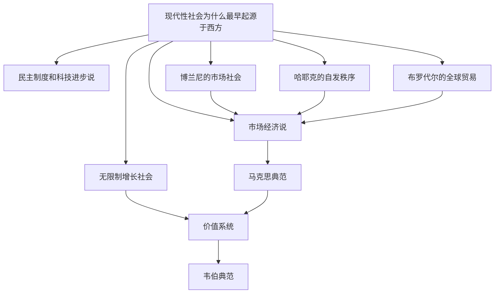

# 现代性社会为什么最早起源于西方

这是一个关于[[现代性]]起源的元问题。历史上，各种解释范式从不同角度试图回答：为什么现代社会（一个科技和经济可以无限制增长的社会）最早出现在西方？对这一问题的梳理，最终指向了[[韦伯典范]]——即现代性的本质是[[价值系统]]的革命。

## 一、传统解释及其局限

### 1. [[市场经济说]]
**核心观点**：现代性等同于资本主义市场经济的兴起。市场将一切商品化，打破了封建束缚，释放出巨大的生产力。

**局限**：
- 将现代性的**结果**误当作**原因**。市场经济本身是现代社会的一个特征，用它来解释现代性的起源属于循环论证。
- 无法回答：为什么市场经济只在西方 spontaneously 产生，而其他文明（如中国、伊斯兰文明）同样拥有发达的市场和商业传统，却未能自发进入现代社会？

### 2. [[民主制度和科技进步说]]
**核心观点**：现代性源于政治制度的民主化和科学革命带来的技术进步。民主提供了制度保障，科技提供了增长动力。

**局限**：
- 这同样是现代性的**表现形式**，而非其深层根源。
- 民主制度与科学革命本身也需要被解释——它们为何率先发生在西方？

---

## 二、二十世纪的重要修正

### 3. [[博兰尼]]的[[市场社会]]
在《大转型》中，[[博兰尼]]提出了对市场经济说的深刻批判：
- 19世纪之前，市场始终"嵌入"（embedded）在社会和宗教伦理之中，受到严格规制。
- **市场社会**（market society）是19世纪的独特产物，意味着市场开始从社会中"脱嵌"（disembedding），反过来支配社会。
- 这一理论实际上否定了"市场经济自发产生现代性"的古典叙事，指出现代市场本身需要特定的社会条件才能存在。

### 4. [[哈耶克]]的[[自发秩序]]
[[哈耶克]]强调市场和社会制度是人类行动的产物，而非人类设计的结果。现代秩序是通过文化演化自发形成的"扩展秩序"。

**评价**：
- 虽然深刻解释了市场秩序的运作机制，但它更多是关于**市场如何维系**的理论，而非关于**现代性为何起源于西方**的历史解释。

### 5. [[布罗代尔]]的[[全球贸易]]
[[布罗代尔]]以"长时段"（longue durée）和"世界体系"视角看待现代性：
- 资本主义不是某一国家内部的生产方式变革，而是**全球贸易网络**和"世界经济"（world-economy）的产物。
- 欧洲之所以能率先进入现代，是因为它在15世纪后成为全球贸易网络的中心。

**局限**：
- 全球贸易体系可以解释西方崛起的**外部条件**，但无法解释为何西方文明愿意并且能够持续追求"无限制的增长"。贸易优势并不必然导致科技和经济的指数级增长。

---

## 三、对现代性本质的重新定义

### 6. 现代社会是一个科技和经济可以无限制增长的社会
这是现代性最核心的特征。前现代社会的经济增长始终受到"边际报酬递减"和"资源天花板"的约束，因此传统文明普遍持有一种"循环时间观"或"停滞的世界观"。

而**现代社会**的根本特征在于：它相信并且实现了科技和经济的**无限制增长**。这种"增长信仰"本身是一种独特的价值观念，需要一个文明将其视为正当甚至神圣的追求。

---

## 四、从马克思典范回到韦伯典范

### 7. [[扩大了的马克思典范]]的局限
马克思主义将一切上层建筑（法律、政治、文化、宗教）归结于经济基础和生产力的发展。即使经过"扩大"（如将科学技术也纳入生产力范畴），这一典范的根本局限在于：
- **物质决定论**无法解释为什么一个文明会选择将"无限增长"作为最高价值。
- 忽视了**观念**和**价值系统**在历史中的独立作用。

### 8. 回到[[价值系统]]
一旦我们意识到现代性的核心是"无止境地改造世界和经济增长"，就必须追问：**是什么让这种追求在道德上正当、在心理上持久？**

答案是**价值系统**。现代性的起源，不是经济基础的自发演进，而是一场深刻的**价值革命**。

### 9. [[韦伯典范]]
最终，我们必须回到马克斯·韦伯（Max Weber）在《新教伦理与资本主义精神》中开启的典范：
- 现代性起源于西方文明独特的**价值理性化**（value rationalization）过程。
- 特别是**宗教改革**后的新教伦理，创造了"入世禁欲主义"（inner-worldly asceticism）：
  - 将救赎焦虑转化为对职业劳动（calling）的虔诚奉献；
  - 将节制、节俭、计算和系统性的工作视为荣耀上帝的方式；
  - 从而将"无止境地积累财富和改造世界"赋予宗教性的正当性。
- 当这种宗教热情世俗化后，它转化为一种普世的、以"进步"和"增长"为核心的现代价值系统。

**结论**：现代性最早起源于西方，不是因为西方先有市场经济、民主制度或全球贸易网络，而是因为西方文明经历了一场独特的价值理性化革命，使得"无限制地追求经济增长和科技进步"成为整个社会的最高目标。这正是**韦伯典范**的深刻之处。

---

## 知识图谱关联

### 相关概念
- [[现代性]]
- [[市场经济说]]
- [[民主制度和科技进步说]]
- [[博兰尼]]
- [[市场社会]]
- [[哈耶克]]
- [[自发秩序]]
- [[布罗代尔]]
- [[全球贸易]]
- [[马克思典范]]
- [[价值系统]]
- [[韦伯典范]]
