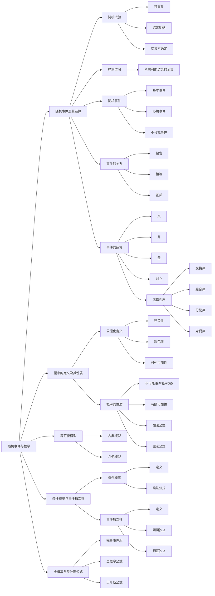

# 随机事件与概率

## 知识图谱

---

## 一、随机事件及其运算

### 1.1 随机试验

**定义**：满足以下三个条件的试验称为随机试验：
- ✅ **可以重复**：在相同条件下可以重复进行
- ✅ **结果明确**：试验的所有可能结果是明确可知的
- ✅ **不确定性**：每次试验前无法预知哪个结果会发生

**记号**：通常用字母 $E$ 表示随机试验

---

### 1.2 样本空间

**定义**：随机试验 $E$ 的所有可能结果组成的集合

**记号**：通常用 $S$ 或 $\Omega$ 表示

**样本点**：样本空间中的每个元素，即试验的每个可能结果

---

### 1.3 随机事件

**定义**：样本空间 $S$ 的子集，称为随机事件，简称事件

**分类**：

| 事件类型 | 定义 | 记号 |
|---------|------|------|
| **基本事件** | 只含有一个样本点的事件 | $\{e\}$ |
| **必然事件** | 在每次试验中一定发生的事件 | $S$ 或 $\Omega$ |
| **不可能事件** | 在每次试验中一定不发生的事件 | $\emptyset$ |

---

### 1.4 随机事件的关系

设 $A, B$ 为两个事件：

1. **包含关系**：$A \subset B$
   - 读作：**B 包含 A**（或 A 含于 B）
   - 事件 $A$ 发生必然导致事件 $B$ 发生
   - 等价于：$A$ 是 $B$ 的子集

2. **相等关系**：$A = B$
   - $A \subset B$ 且 $B \subset A$

3. **互斥关系（互不相容）**：$A \cap B = \emptyset$
   - 事件 $A$ 与事件 $B$ 不能同时发生

---

### ⚠️ 易混淆概念辨析

| 记号 | 正确含义 | 错误说法 |
|-----|---------|---------|
| $A \subset B$ | **包含关系**：$A$ 发生必然导致 $B$ 发生 | ❌ 不是"$A$ 与 $B$ 互斥" |
| $A = B$ | **相等关系**：$A \subset B$ 且 $B \subset A$，即 $A, B$ 是同一事件 | ❌ 不是"$A$ 与 $B$ 同时发生" |
| $A \cap B = \emptyset$ | **互斥关系**：$A$ 与 $B$ 不可能同时发生 | ✓ 这个是对的 |
| $A \cup B$ | **和事件**：$A$ 与 $B$ 至少有一个发生 | ✓ 这个是对的 |
| $A \cap B$（或 $AB$）| **积事件**：$A$ 与 $B$ 都发生 | ✓ 这个是对的 |
| $A - B$ | **差事件**：$A$ 发生并且 $B$ 不发生 | ✓ 这个是对的 |
| $\overline{A}$ | **对立事件**：$A$ 不发生 | ✓ 这个是对的 |

---

### 1.5 随机事件的运算

设 $A, B$ 为事件：

| 运算 | 记号 | 定义 |
|-----|------|------|
| **事件的交（积）** | $A \cap B$ 或 $AB$ | $A$ 与 $B$ 同时发生 |
| **事件的并（和）** | $A \cup B$ | $A$ 发生或 $B$ 发生 |
| **事件的差** | $A - B$ | $A$ 发生而 $B$ 不发生 |
| **事件的对立（逆）** | $\overline{A}$ | $A$ 不发生 |

**运算性质**：

1. **交换律**：$A \cup B = B \cup A, \quad A \cap B = B \cap A$

2. **结合律**：
   $$(A \cup B) \cup C = A \cup (B \cup C)$$
   $$(A \cap B) \cap C = A \cap (B \cap C)$$

3. **分配律**：
   $$(A \cup B) \cap C = (A \cap C) \cup (B \cap C)$$
   $$(A \cap B) \cup C = (A \cup C) \cap (B \cup C)$$

4. **对偶律（德摩根律）**：
   $$\overline{A \cup B} = \overline{A} \cap \overline{B}$$
   $$\overline{A \cap B} = \overline{A} \cup \overline{B}$$

---

## 二、概率的定义及其性质

### 2.1 公理化定义

设 $E$ 是随机试验，$S$ 是样本空间。对于 $E$ 的每一事件 $A$ 赋予一个实数，记为 $P(A)$，如果集合函数 $P(\cdot)$ 满足下列条件：

1. **非负性**：对于每一个事件 $A$，有 $P(A) \geq 0$

2. **规范性**：对于必然事件 $S$，有 $P(S) = 1$

3. **可列可加性**：设 $A_1, A_2, \dots$ 是两两互不相容的事件，则
   $$P\left(\bigcup_{i=1}^{\infty} A_i\right) = \sum_{i=1}^{\infty} P(A_i)$$

---

### 2.2 概率的性质

1. **不可能事件的概率**：$P(\emptyset) = 0$

2. **有限可加性**：若 $A_1, A_2, \dots, A_n$ 两两互不相容，则
   $$P\left(\bigcup_{i=1}^{n} A_i\right) = \sum_{i=1}^{n} P(A_i)$$

3. **减法公式**：
   $$P(B - A) = P(B) - P(AB)$$
   
   特别地，若 $A \subset B$，则
   $$P(B - A) = P(B) - P(A), \quad P(B) \geq P(A)$$

4. **加法公式**：
   $$P(A \cup B) = P(A) + P(B) - P(AB)$$
   
   推广到多个事件：
   $$P(A \cup B \cup C) = P(A) + P(B) + P(C) - P(AB) - P(AC) - P(BC) + P(ABC)$$

5. **对立事件的概率**：
   $$P(\overline{A}) = 1 - P(A)$$

---

### ⚠️ 重要辨析：概率为0 ≠ 不可能事件

| 关系 | 命题 | 结论 |
|-----|------|------|
| 正方向 | 若 $A = \emptyset$（不可能事件），则 $P(A) = 0$ | ✅ **一定成立** |
| 反方向 | 若 $P(A) = 0$，则 $A = \emptyset$（不可能事件） | ❌ **不一定成立** |

---

#### 💡 直观理解（几何概型）

**例子**：在区间 $[0, 1]$ 上随机取一个点
- 事件 $A$：取到的点 = 0.5
- $A$ **不是不可能事件**（你真的有可能刚好取到0.5）
- 但 $P(A) = 0$（单点的"长度"为0）

**本质区别**：
| 表达式 | 含义 | 数学本质 |
|-------|------|---------|
| $AB = \emptyset$ | AB是**空集** | 没有任何样本点 |
| $P(AB) = 0$ | AB的**测度为零** | 样本点存在，但"长度/面积"为0 |

> 在**离散世界**（抛硬币、掷骰子），二者等价；但在**连续世界**，存在"有样本点但测度为零"的集合！

---

> **经典例题**：对于任意事件 $A$ 和 $B$，若 $P(AB) = 0$，则（ ）
> 
> A. $\overline{A}\overline{B} = \emptyset$ &nbsp;&nbsp; B. $AB = \emptyset$ &nbsp;&nbsp; C. $P(A)P(B) = 0$ &nbsp;&nbsp; D. $P(A\overline{B}) - P(A) = 0$
> 
> **正确答案：D**
> 
> **解析**：
> - ❌ B错误：$P(AB) = 0$ 不能推出 $AB = \emptyset$！概率为0的事件不一定是不可能事件。
> - ✅ D正确：根据减法公式 $P(A\overline{B}) = P(A) - P(AB)$，当 $P(AB) = 0$ 时，$P(A\overline{B}) = P(A)$。

---

## 三、等可能概型

### 3.1 古典概型

**定义**：满足以下两个条件的试验模型称为古典概型：
1. 试验的样本空间只包含有限个元素
2. 试验中每个基本事件发生的可能性相同

**计算公式**：
$$P(A) = \frac{k}{n} = \frac{A \text{ 包含的基本事件数}}{S \text{ 中基本事件的总数}}$$

---

### 3.2 几何概型

**定义**：满足以下两个条件的试验模型称为几何概型：
1. 试验的样本空间是某个可度量的几何区域
2. 试验中每个样本点落在子区域的概率与子区域的度量成正比

**计算公式**：
$$P(A) = \frac{\mu(A)}{\mu(S)}$$

其中 $\mu(\cdot)$ 表示几何度量（长度、面积、体积等）

---

## 四、条件概率与事件的相互独立性

### 4.1 条件概率

**定义**：设 $A, B$ 是两个事件，且 $P(A) > 0$，称
$$P(B|A) = \frac{P(AB)}{P(A)}$$
为在事件 $A$ 发生的条件下事件 $B$ 发生的条件概率。

**乘法公式**：
$$P(AB) = P(A)P(B|A) \quad (P(A) > 0)$$

推广：
$$P(ABC) = P(A)P(B|A)P(C|AB)$$

---

### 4.2 事件的相互独立性

**定义**：设 $A, B$ 是两个事件，如果满足等式
$$P(AB) = P(A)P(B)$$
则称事件 $A, B$ 相互独立。

**多个事件的独立性**：

对于 $n$ 个事件 $A_1, A_2, \dots, A_n$：

1. **两两相互独立**：对于任意 $1 \leq i < j \leq n$，有
   $$P(A_iA_j) = P(A_i)P(A_j)$$

2. **相互独立**：对于任意 $k(1 < k \leq n)$，任意 $1 \leq i_1 < i_2 < \dots < i_k \leq n$，有
   $$P(A_{i_1}A_{i_2}\cdots A_{i_k}) = P(A_{i_1})P(A_{i_2})\cdots P(A_{i_k})$$

> **重要区别**：相互独立 $\Rightarrow$ 两两独立，但两两独立 $\nRightarrow$ 相互独立

---

## 五、全概率公式与贝叶斯公式

### 5.1 完备事件组

**定义**：设 $S$ 是试验 $E$ 的样本空间，$B_1, B_2, \dots, B_n$ 是 $E$ 的一组事件，若：
1. $B_iB_j = \emptyset, \quad i \neq j$
2. $B_1 \cup B_2 \cup \dots \cup B_n = S$

则称 $B_1, B_2, \dots, B_n$ 为样本空间 $S$ 的一个**划分**（完备事件组）。

---

### 5.2 全概率公式

设 $S$ 是试验 $E$ 的样本空间，$A$ 是 $E$ 的事件，$B_1, B_2, \dots, B_n$ 是 $S$ 的一个划分，且 $P(B_i) > 0$，则
$$P(A) = \sum_{i=1}^{n} P(B_i)P(A|B_i)$$

**直观意义**："由因导果"，通过各个原因 $B_i$ 求结果 $A$ 的概率

---

### 5.3 贝叶斯公式

设 $S$ 是试验 $E$ 的样本空间，$A$ 是 $E$ 的事件，$B_1, B_2, \dots, B_n$ 是 $S$ 的一个划分，且 $P(A) > 0, P(B_i) > 0$，则
$$P(B_i|A) = \frac{P(B_i)P(A|B_i)}{\sum_{j=1}^{n} P(B_j)P(A|B_j)}$$

**直观意义**："由果溯因"，已知结果 $A$ 发生，求它是由原因 $B_i$ 引起的概率

---

#### 💡 本质理解

贝叶斯公式**本质上就是条件概率的展开形式**：

$$P(B_i|A) = \frac{P(A B_i)}{P(A)} = \frac{\text{分子：乘法公式}}{\text{分母：全概率公式}}$$

- 分子 $P(AB_i)$ 用**乘法公式**展开：$P(B_i)P(A|B_i)$
- 分母 $P(A)$ 用**全概率公式**展开：$\sum_{j=1}^{n} P(B_j)P(A|B_j)$

> 贝叶斯公式并没有定义新的概念，只是把条件概率与两个基本公式结合，解决了"由果溯因"的逆概率问题！

---

## 常用公式汇总

| 公式名称 | 公式 |
|---------|------|
| 加法公式 | $P(A \cup B) = P(A) + P(B) - P(AB)$ |
| 减法公式 | $P(B - A) = P(B) - P(AB)$ |
| 对立事件 | $P(\overline{A}) = 1 - P(A)$ |
| 条件概率 | $P(B|A) = \dfrac{P(AB)}{P(A)}$ |
| 乘法公式 | $P(AB) = P(A)P(B|A)$ |
| 全概率公式 | $P(A) = \sum\limits_{i=1}^{n} P(B_i)P(A|B_i)$ |
| 贝叶斯公式 | $P(B_i|A) = \dfrac{P(B_i)P(A|B_i)}{\sum\limits_{j=1}^{n} P(B_j)P(A|B_j)}$ |
